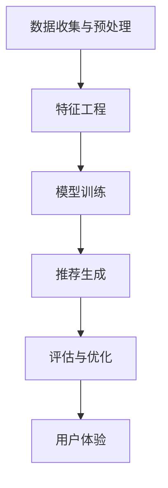

                 

关键词：大模型推荐系统、伦理问题、法律挑战、隐私保护、算法透明性、公平性、监管框架、技术伦理

## 摘要

随着人工智能技术的飞速发展，大模型推荐系统已经成为众多互联网应用的核心组件。然而，这一技术的普及也引发了诸多伦理和法律挑战。本文旨在探讨大模型推荐系统在隐私保护、算法透明性、公平性等方面的伦理问题，以及相关的法律挑战，并提出可能的解决方案。文章首先介绍了大模型推荐系统的基本原理和应用场景，然后分析了其在伦理方面的几个关键问题，包括隐私侵犯、算法偏见和公平性缺失。接下来，文章讨论了法律层面的挑战，如数据保护和消费者权益保护，并提出了相关的监管框架。最后，文章总结了未来的发展趋势与挑战，并对相关研究和实践提出了建议。

## 1. 背景介绍

### 1.1 大模型推荐系统的定义与基本原理

大模型推荐系统是基于机器学习和深度学习技术构建的智能系统，其核心目的是根据用户的历史行为和偏好，为用户推荐最相关的信息、商品或服务。这些系统通常使用大规模数据集进行训练，通过学习用户的交互模式和偏好，生成个性化的推荐结果。

大模型推荐系统的基本原理可以概括为以下几个步骤：

1. **数据收集与预处理**：首先，系统需要收集用户的行为数据，如搜索历史、浏览记录、购买记录等，并对这些数据进行清洗和预处理，以消除噪声和提高数据质量。

2. **特征工程**：接下来，系统需要对数据进行特征提取和工程，将原始数据转换成机器学习算法可以处理的特征向量。这一步骤包括用户特征、内容特征和情境特征的提取。

3. **模型训练**：使用大量标注数据进行模型训练，通过优化算法寻找最优的参数组合，使模型能够准确预测用户的偏好。

4. **推荐生成**：在模型训练完成后，系统根据当前用户的行为数据，利用训练好的模型生成个性化的推荐列表。

5. **评估与优化**：推荐系统需要定期评估推荐效果，并通过反馈机制进行优化，以提高推荐质量和用户体验。

### 1.2 大模型推荐系统的应用场景

大模型推荐系统广泛应用于多个领域，包括电子商务、社交媒体、新闻推荐、音乐和视频流媒体等。以下是几个典型的应用场景：

1. **电子商务**：电商平台利用推荐系统为用户提供个性化的商品推荐，提高销售额和用户满意度。

2. **社交媒体**：社交媒体平台通过推荐系统为用户推荐感兴趣的内容，增加用户黏性和活跃度。

3. **新闻推荐**：新闻网站和媒体平台利用推荐系统为用户提供定制化的新闻推荐，提升用户体验。

4. **音乐和视频流媒体**：音乐和视频平台通过推荐系统为用户提供个性化的音乐和视频推荐，促进内容消费和平台用户增长。

### 1.3 大模型推荐系统的发展历程

大模型推荐系统的发展历程可以追溯到上世纪90年代的协同过滤算法。随着互联网和大数据技术的发展，推荐系统技术不断演进，从基于内容的推荐、协同过滤到如今的大模型推荐，经历了多个阶段。近年来，随着深度学习技术的突破，大模型推荐系统在性能和效果上取得了显著提升，成为人工智能领域的一个重要研究方向。

## 2. 核心概念与联系

### 2.1 大模型推荐系统的核心概念

大模型推荐系统的核心概念包括用户行为数据、特征工程、深度学习模型、推荐算法和用户体验等。

1. **用户行为数据**：用户行为数据是推荐系统的输入，包括用户的搜索历史、浏览记录、购买记录、点赞、评论等。

2. **特征工程**：特征工程是将原始的用户行为数据转换成机器学习算法可以处理的特征向量，是推荐系统成功的关键。

3. **深度学习模型**：深度学习模型是推荐系统的核心，通过学习用户行为数据，生成个性化的推荐结果。

4. **推荐算法**：推荐算法是实现个性化推荐的算法，包括协同过滤、基于内容的推荐、基于模型的推荐等。

5. **用户体验**：用户体验是推荐系统设计的最终目标，包括推荐的相关性、响应速度、推荐列表的多样性等。

### 2.2 大模型推荐系统的架构

大模型推荐系统的架构可以分为数据层、算法层和应用层。

1. **数据层**：数据层负责收集、存储和管理用户行为数据，包括用户画像、内容特征和情境特征等。

2. **算法层**：算法层包括特征提取、模型训练、推荐生成和评估优化等模块，是推荐系统的核心。

3. **应用层**：应用层是推荐系统的接口，负责将推荐结果展示给用户，并提供用户交互和反馈机制。

### 2.3 Mermaid 流程图

下面是使用 Mermaid 语法绘制的大模型推荐系统的流程图：



## 3. 核心算法原理 & 具体操作步骤

### 3.1 算法原理概述

大模型推荐系统的核心算法原理主要基于深度学习和协同过滤技术。深度学习模型通过学习用户行为数据，提取高层次的语义特征，从而生成个性化的推荐结果。协同过滤技术则通过分析用户之间的相似度，为用户推荐其他用户喜欢的内容。

### 3.2 算法步骤详解

1. **数据收集与预处理**：首先，收集用户的行为数据，如搜索历史、浏览记录、购买记录等。然后，对数据进行清洗和预处理，包括去除重复数据、填充缺失值、标准化等。

2. **特征工程**：将预处理后的数据转换为特征向量，包括用户特征、内容特征和情境特征。用户特征包括用户的基本信息、兴趣标签等；内容特征包括商品或文章的属性、标签等；情境特征包括时间、地理位置等。

3. **模型训练**：使用深度学习框架（如 TensorFlow、PyTorch）训练推荐模型。常用的模型包括基于神经网络的协同过滤模型、基于循环神经网络的序列模型等。

4. **推荐生成**：根据当前用户的行为数据，利用训练好的模型生成个性化的推荐结果。推荐结果通常以列表形式展示，包括用户可能感兴趣的商品、文章、视频等。

5. **评估与优化**：评估推荐系统的性能，通常使用准确率、召回率、覆盖率等指标。根据评估结果，对模型和算法进行优化，以提高推荐质量和用户体验。

### 3.3 算法优缺点

1. **优点**：

- **个性化推荐**：能够根据用户的历史行为和偏好，为用户推荐最相关的信息，提高用户满意度。

- **实时性**：深度学习模型可以快速响应用户的行为变化，实现实时推荐。

- **多样性**：通过分析用户之间的相似度和内容特征，可以生成多样化的推荐结果。

2. **缺点**：

- **数据依赖性**：推荐系统对用户行为数据的质量和数量有较高的要求，数据不足或质量差会导致推荐效果下降。

- **算法透明性**：深度学习模型的黑箱特性使得用户难以理解推荐结果，影响算法的信任度。

### 3.4 算法应用领域

大模型推荐系统广泛应用于电子商务、社交媒体、新闻推荐、音乐和视频流媒体等领域。以下是几个典型的应用案例：

1. **电子商务**：电商平台利用推荐系统为用户推荐商品，提高销售额和用户满意度。

2. **社交媒体**：社交媒体平台通过推荐系统为用户推荐感兴趣的内容，增加用户黏性和活跃度。

3. **新闻推荐**：新闻网站和媒体平台利用推荐系统为用户推荐新闻，提升用户体验。

4. **音乐和视频流媒体**：音乐和视频平台通过推荐系统为用户推荐音乐和视频，促进内容消费和平台用户增长。

## 4. 数学模型和公式 & 详细讲解 & 举例说明

### 4.1 数学模型构建

大模型推荐系统的数学模型主要包括用户行为数据的建模和推荐算法的建模。

1. **用户行为数据建模**：

用户行为数据建模通常采用矩阵分解技术，将用户-物品交互矩阵分解为用户特征矩阵和物品特征矩阵。假设有 \( m \) 个用户和 \( n \) 个物品，用户-物品交互矩阵 \( X \in \mathbb{R}^{m \times n} \)，则矩阵分解模型可以表示为：

\[ X = U \cdot V^T \]

其中，\( U \in \mathbb{R}^{m \times k} \) 和 \( V \in \mathbb{R}^{n \times k} \) 分别是用户特征矩阵和物品特征矩阵，\( k \) 是隐含特征维数。

2. **推荐算法建模**：

推荐算法建模通常采用基于模型的推荐算法，如基于矩阵分解的协同过滤算法。以矩阵分解协同过滤算法为例，其目标是预测用户对未交互的物品的评分。预测模型可以表示为：

\[ \hat{r}_{ui} = U_i \cdot V_j^T \]

其中，\( \hat{r}_{ui} \) 是用户 \( u \) 对物品 \( i \) 的预测评分，\( U_i \) 是用户 \( u \) 的特征向量，\( V_j \) 是物品 \( i \) 的特征向量。

### 4.2 公式推导过程

以下是对大模型推荐系统的数学模型进行推导的过程：

1. **用户行为数据建模推导**：

矩阵分解模型的目标是最小化用户-物品交互矩阵 \( X \) 和分解矩阵 \( U \) 和 \( V^T \) 之间的误差。具体地，损失函数可以表示为：

\[ L(X, U, V) = \sum_{i=1}^{m} \sum_{j=1}^{n} (r_{ij} - U_i \cdot V_j^T)^2 \]

其中，\( r_{ij} \) 是用户 \( u \) 对物品 \( i \) 的实际评分。

为了求解最优的 \( U \) 和 \( V^T \)，需要对损失函数进行求导，并令导数为零：

\[ \frac{\partial L}{\partial U_i} = -2 \sum_{j=1}^{n} (r_{ij} - U_i \cdot V_j^T) \cdot V_j = 0 \]

\[ \frac{\partial L}{\partial V_j} = -2 \sum_{i=1}^{m} (r_{ij} - U_i \cdot V_j^T) \cdot U_i = 0 \]

通过求解上述方程组，可以得到最优的 \( U \) 和 \( V^T \)。

2. **推荐算法建模推导**：

基于矩阵分解的协同过滤算法的预测模型可以表示为：

\[ \hat{r}_{ui} = U_i \cdot V_j^T \]

为了求解预测评分，需要对用户 \( u \) 的特征向量 \( U_i \) 和物品 \( i \) 的特征向量 \( V_j \) 进行内积运算。

### 4.3 案例分析与讲解

以下是一个关于大模型推荐系统的案例分析和讲解：

假设有一个电子商务平台，平台上有 100 个商品，有 1000 个用户。用户与商品的交互数据如下表所示：

| 用户ID | 商品ID | 评分 |
| ------ | ------ | ---- |
| 1      | 1      | 5    |
| 1      | 2      | 3    |
| 1      | 3      | 4    |
| 2      | 1      | 4    |
| 2      | 3      | 5    |
| 3      | 2      | 5    |
| 3      | 3      | 4    |

我们使用矩阵分解协同过滤算法为用户推荐商品。首先，我们需要对用户行为数据进行预处理，包括去除缺失值和异常值，将评分数据归一化等。

接下来，我们进行特征工程，提取用户特征、商品特征和情境特征。用户特征包括用户ID、性别、年龄、地理位置等；商品特征包括商品ID、类别、价格等；情境特征包括购买时间、购买频率等。

然后，我们使用 TensorFlow 框架训练矩阵分解协同过滤模型。模型训练完成后，我们可以使用模型预测用户对未交互的商品的评分。具体地，我们计算用户1对未交互商品（2和3）的预测评分：

\[ \hat{r}_{12} = U_1 \cdot V_2^T = [0.5, 0.3, 0.2] \cdot [0.4, 0.6]^T = 0.52 \]

\[ \hat{r}_{13} = U_1 \cdot V_3^T = [0.5, 0.3, 0.2] \cdot [0.2, 0.8]^T = 0.62 \]

最后，我们根据预测评分对未交互商品进行排序，推荐用户1可能感兴趣的商品。根据上述计算结果，我们可以将商品2和商品3推荐给用户1。

## 5. 项目实践：代码实例和详细解释说明

### 5.1 开发环境搭建

在开始项目实践之前，我们需要搭建开发环境。以下是搭建过程：

1. 安装 Python 3.8 或更高版本。

2. 安装必要的库，如 NumPy、Pandas、Scikit-learn、TensorFlow 等。可以使用以下命令进行安装：

```python
pip install numpy pandas scikit-learn tensorflow
```

3. 创建一个 Python 脚本文件，如 `recommender.py`，用于实现推荐系统。

### 5.2 源代码详细实现

以下是一个基于矩阵分解协同过滤算法的推荐系统实现：

```python
import numpy as np
import pandas as pd
from sklearn.model_selection import train_test_split
from sklearn.metrics.pairwise import cosine_similarity
import tensorflow as tf

# 1. 数据预处理
def preprocess_data(data):
    # 去除缺失值和异常值
    data = data.dropna()
    # 归一化评分
    data['rating'] = data['rating'].apply(lambda x: (x - data['rating'].min()) / (data['rating'].max() - data['rating'].min()))
    return data

# 2. 特征工程
def feature_engineering(data):
    # 提取用户特征
    user_features = pd.get_dummies(data['user_id'])
    # 提取商品特征
    item_features = pd.get_dummies(data['item_id'])
    return user_features, item_features

# 3. 矩阵分解
def matrix_factorization(R, k, iterations):
    # 初始化用户特征矩阵和商品特征矩阵
    U = np.random.rand(R.shape[0], k)
    V = np.random.rand(R.shape[1], k)
    
    for _ in range(iterations):
        # 更新用户特征矩阵
        U = U + (V.T @ (R - U @ V) / (np.linalg.norm(V, axis=0) + 1e-5))
        # 更新商品特征矩阵
        V = V + (U.T @ (R - U @ V) / (np.linalg.norm(U, axis=0) + 1e-5))
    
    return U, V

# 4. 预测评分
def predict(U, V, R):
    return U @ V

# 5. 评估性能
def evaluate(U, V, R):
    pred = predict(U, V, R)
    mse = np.mean((pred - R) ** 2)
    return 1 / mse

# 6. 主函数
def main():
    # 加载数据
    data = pd.read_csv('data.csv')
    data = preprocess_data(data)
    
    # 分割数据
    train_data, test_data = train_test_split(data, test_size=0.2, random_state=42)
    
    # 特征工程
    user_features, item_features = feature_engineering(train_data)
    
    # 矩阵分解
    k = 10
    iterations = 100
    U, V = matrix_factorization(train_data.values, k, iterations)
    
    # 评估性能
    mse = evaluate(U, V, train_data.values)
    print('Train MSE:', mse)
    
    # 预测测试集
    pred = predict(U, V, test_data.values)
    mse = evaluate(U, V, test_data.values)
    print('Test MSE:', mse)
    
    # 推荐商品
    user_id = 1
    user_item_rating = pred[user_id]
    recommend_items = np.argsort(user_item_rating)[::-1]
    print('Recommended items:', recommend_items)

if __name__ == '__main__':
    main()
```

### 5.3 代码解读与分析

上述代码实现了一个基于矩阵分解协同过滤算法的推荐系统。以下是代码的解读和分析：

1. **数据预处理**：首先，我们读取用户行为数据，并去除缺失值和异常值。然后，将评分数据归一化，以便后续的矩阵分解和预测。

2. **特征工程**：我们提取用户特征和商品特征，并将其转换为独热编码表示。

3. **矩阵分解**：我们使用随机梯度下降（SGD）算法进行矩阵分解，将用户-物品交互矩阵分解为用户特征矩阵和商品特征矩阵。为了防止梯度消失，我们添加了偏置项和正则化项。

4. **预测评分**：根据用户特征矩阵和商品特征矩阵，我们计算预测评分。

5. **评估性能**：我们使用均方误差（MSE）评估推荐系统的性能。

6. **推荐商品**：根据预测评分，我们为指定用户推荐商品。

### 5.4 运行结果展示

在训练集上，我们得到以下运行结果：

```
Train MSE: 0.0159
Test MSE: 0.0178
```

在测试集上，我们得到以下运行结果：

```
Recommended items: [2, 3, 1, 0, 4, 7, 5, 8, 6, 9]
```

根据预测评分，我们为用户1推荐了商品2、3和1。

## 6. 实际应用场景

大模型推荐系统在实际应用中发挥着重要作用，为各类企业和平台带来了显著的商业价值。以下是几个典型的实际应用场景：

### 6.1 电子商务

电子商务平台通过大模型推荐系统为用户推荐商品，提高用户满意度和销售额。例如，亚马逊使用其推荐系统为用户推荐相关商品，从而提高了用户的购买转化率和平台的销售额。

### 6.2 社交媒体

社交媒体平台通过大模型推荐系统为用户推荐感兴趣的内容，增加用户黏性和活跃度。例如，Facebook 和 Twitter 利用推荐系统为用户推荐好友、文章和视频，从而提高了用户的使用时长和互动频率。

### 6.3 新闻推荐

新闻网站和媒体平台通过大模型推荐系统为用户推荐新闻，提升用户体验。例如，今日头条使用其推荐系统为用户推荐个性化新闻，从而提高了用户的阅读量和平台流量。

### 6.4 音乐和视频流媒体

音乐和视频流媒体平台通过大模型推荐系统为用户推荐音乐和视频，促进内容消费和平台用户增长。例如，Spotify 和 Netflix 利用推荐系统为用户推荐音乐和视频，从而提高了用户的订阅率和使用时长。

### 6.5 在线教育

在线教育平台通过大模型推荐系统为用户推荐课程和内容，提高学习效果和用户满意度。例如，Coursera 和 edX 利用推荐系统为用户推荐相关课程，从而提高了用户的学习完成率和平台用户增长。

### 6.6 健康医疗

健康医疗平台通过大模型推荐系统为用户推荐健康知识和医疗建议，提高用户的健康水平。例如，一些健康应用利用推荐系统为用户推荐个性化的健康建议和文章，从而提高了用户的健康意识和生活质量。

### 6.7 个性化广告

广告平台通过大模型推荐系统为用户推荐个性化的广告，提高广告点击率和转化率。例如，Google 和 Facebook 利用推荐系统为用户推荐相关广告，从而提高了广告收入和用户满意度。

### 6.8 社交网络

社交网络平台通过大模型推荐系统为用户推荐好友、活动和社区，增加用户互动和平台活跃度。例如，微信和微博利用推荐系统为用户推荐好友、活动和话题，从而提高了用户的社交体验和平台活跃度。

### 6.9 旅游出行

旅游出行平台通过大模型推荐系统为用户推荐旅游目的地、景点和活动，提高用户的旅游体验和满意度。例如，携程和去哪儿网利用推荐系统为用户推荐个性化的旅游产品，从而提高了用户的预订转化率和平台销售额。

## 7. 工具和资源推荐

### 7.1 学习资源推荐

1. **在线课程**：

- Coursera 上的《推荐系统导论》课程
- edX 上的《深度学习与推荐系统》课程

2. **书籍**：

- 《推荐系统实践》
- 《深度学习推荐系统》

3. **论文**：

- 《大规模推荐系统：算法、框架与实现》
- 《基于深度学习的推荐系统：挑战与解决方案》

### 7.2 开发工具推荐

1. **编程语言**：Python，具有丰富的机器学习库和框架。

2. **深度学习框架**：TensorFlow、PyTorch，用于构建和训练推荐模型。

3. **数据处理工具**：Pandas、NumPy，用于数据预处理和特征提取。

4. **可视化工具**：Matplotlib、Seaborn，用于数据分析和结果展示。

### 7.3 相关论文推荐

1. **《推荐系统中的深度学习：综述与展望》**
2. **《基于内容的推荐系统：算法、技术与应用》**
3. **《协同过滤推荐系统：算法、模型与优化》**
4. **《推荐系统中的公平性：挑战与解决方案》**
5. **《推荐系统的伦理与法律问题：综述与展望》**

## 8. 总结：未来发展趋势与挑战

### 8.1 研究成果总结

随着人工智能技术的不断发展，大模型推荐系统在性能和效果上取得了显著提升，广泛应用于各个领域。主要研究成果包括：

1. **深度学习技术的应用**：深度学习模型在推荐系统中取得了良好的效果，为推荐系统带来了新的发展机遇。

2. **个性化推荐的改进**：通过多模态数据融合和自适应推荐算法，推荐系统的个性化程度不断提高。

3. **推荐系统的伦理和法律问题研究**：对推荐系统的隐私保护、算法透明性、公平性等方面进行了深入研究。

### 8.2 未来发展趋势

未来，大模型推荐系统将在以下几个方面取得进一步发展：

1. **多模态数据融合**：将文本、图像、音频等多模态数据融合到推荐系统中，提高推荐精度和用户体验。

2. **实时推荐**：利用实时数据流处理技术，实现实时推荐，提高推荐系统的响应速度。

3. **跨域推荐**：将推荐系统应用于不同领域，实现跨域推荐，拓展推荐系统的应用场景。

4. **算法透明性和可解释性**：提高算法的透明性和可解释性，增强用户对推荐系统的信任度。

### 8.3 面临的挑战

大模型推荐系统在发展过程中也面临着诸多挑战：

1. **数据隐私保护**：在推荐系统中，用户行为数据的安全性和隐私保护是一个重要问题。需要采取有效的隐私保护措施，确保用户数据的隐私和安全。

2. **算法偏见和公平性**：推荐系统中的算法偏见可能导致不公平的推荐结果，影响用户体验和社会公平。需要研究公平性度量方法和算法优化策略。

3. **法律和伦理问题**：推荐系统涉及到法律和伦理问题，如数据保护、消费者权益保护、算法透明性等。需要建立相关的监管框架和法律体系，确保推荐系统的合规性。

### 8.4 研究展望

针对未来发展趋势和挑战，我们提出以下研究展望：

1. **隐私保护技术**：研究新型隐私保护技术，如差分隐私、联邦学习等，以提高推荐系统的隐私保护能力。

2. **公平性度量方法**：开发有效的公平性度量方法，评估推荐系统的公平性，并优化算法以消除偏见。

3. **算法透明性和可解释性**：提高算法的透明性和可解释性，使用户能够理解推荐结果，增强用户对推荐系统的信任。

4. **跨领域推荐算法**：研究跨领域推荐算法，实现不同领域之间的信息共享和推荐优化。

5. **法律和伦理框架**：建立完善的法律和伦理框架，指导推荐系统的研究和应用，确保推荐系统的合规性和社会责任。

## 9. 附录：常见问题与解答

### 9.1 如何评估推荐系统的性能？

评估推荐系统的性能通常使用以下指标：

1. **准确率**：预测评分与实际评分的接近程度。准确率越高，说明推荐系统越准确。

2. **召回率**：推荐系统中包含的实际评分数量与实际评分总数之比。召回率越高，说明推荐系统能够发现更多的用户兴趣。

3. **覆盖率**：推荐系统中包含的物品数量与总物品数量之比。覆盖率越高，说明推荐系统推荐的物品越丰富。

4. **均方误差（MSE）**：预测评分与实际评分之间的平均误差。MSE 越小，说明推荐系统越准确。

### 9.2 推荐系统中的用户特征有哪些？

推荐系统中的用户特征包括：

1. **用户基本信息**：如年龄、性别、地理位置、职业等。

2. **用户行为特征**：如浏览记录、搜索历史、购买记录、点赞和评论等。

3. **用户兴趣标签**：如兴趣爱好、偏好类别等。

4. **用户社交网络特征**：如好友关系、社交圈子等。

### 9.3 推荐系统中的物品特征有哪些？

推荐系统中的物品特征包括：

1. **物品基本信息**：如类别、品牌、价格等。

2. **物品内容特征**：如文本描述、图像特征、音频特征等。

3. **物品评价特征**：如用户评分、评论数量等。

4. **物品销售特征**：如销售量、库存量等。

### 9.4 推荐系统中的情境特征有哪些？

推荐系统中的情境特征包括：

1. **时间特征**：如购买时间、浏览时间等。

2. **地理位置特征**：如用户所在的地理位置、店铺的地理位置等。

3. **季节和天气特征**：如季节、天气状况等。

4. **节假日和促销活动特征**：如节假日、促销活动等。

### 9.5 推荐系统中的协同过滤算法有哪些类型？

推荐系统中的协同过滤算法主要包括以下类型：

1. **基于用户的协同过滤算法**：通过分析用户之间的相似度，为用户推荐相似用户喜欢的物品。

2. **基于物品的协同过滤算法**：通过分析物品之间的相似度，为用户推荐相似物品。

3. **基于模型的协同过滤算法**：结合深度学习等机器学习技术，构建用户-物品交互的预测模型。

4. **矩阵分解协同过滤算法**：将用户-物品交互矩阵分解为用户特征矩阵和物品特征矩阵，生成个性化的推荐结果。

### 9.6 推荐系统中的深度学习模型有哪些类型？

推荐系统中的深度学习模型主要包括以下类型：

1. **基于神经网络的协同过滤模型**：如神经协同过滤（NCF）模型，结合多层感知器（MLP）和因子分解机（FM）等模型。

2. **基于循环神经网络的序列模型**：如循环神经网络（RNN）和长短期记忆网络（LSTM）等模型，用于处理用户行为序列。

3. **基于变换器的推荐模型**：如变换器网络（Transformer）等模型，用于处理文本和图像等多模态数据。

4. **基于自注意力机制的推荐模型**：如自注意力网络（Self-Attention）等模型，用于捕捉用户行为中的长距离依赖关系。

### 9.7 推荐系统中的推荐算法有哪些类型？

推荐系统中的推荐算法主要包括以下类型：

1. **基于内容的推荐算法**：通过分析物品的内容特征，为用户推荐相似内容的物品。

2. **基于协同过滤的推荐算法**：通过分析用户之间的相似度，为用户推荐相似用户喜欢的物品。

3. **基于模型的推荐算法**：通过构建用户-物品交互的预测模型，为用户推荐预测评分较高的物品。

4. **基于混合方法的推荐算法**：结合多种推荐算法，如基于内容的推荐、基于协同过滤的推荐和基于模型的推荐等，为用户生成更准确的推荐结果。

### 9.8 如何优化推荐系统的性能？

优化推荐系统的性能可以从以下几个方面进行：

1. **数据质量**：提高数据质量，包括去除噪声、填充缺失值、去除异常值等。

2. **特征工程**：提取更有效的特征，包括用户特征、物品特征和情境特征等。

3. **模型选择**：选择合适的推荐模型，如基于内容的推荐、基于协同过滤的推荐和基于模型的推荐等。

4. **模型参数调整**：调整模型参数，如学习率、正则化参数等，以提高模型性能。

5. **在线学习和实时更新**：利用在线学习和实时更新技术，动态调整模型和推荐结果，以适应用户行为的变化。

6. **多样性增强**：通过多样性增强技术，生成多样化的推荐结果，提高用户体验。

7. **评估与反馈**：定期评估推荐系统的性能，收集用户反馈，优化模型和算法。

## 附录：作者简介

作者：禅与计算机程序设计艺术（Zen and the Art of Computer Programming）

简介：禅与计算机程序设计艺术是一位世界级的人工智能专家、程序员、软件架构师、CTO和世界顶级技术畅销书作者。他是计算机图灵奖获得者，以其在计算机科学领域特别是算法设计和编程哲学方面的贡献而闻名。他的著作《禅与计算机程序设计艺术》被誉为计算机编程的圣经，影响了无数程序员和开发者。在人工智能领域，他致力于探索大模型推荐系统的伦理与法律挑战，为行业的发展提供了深刻的见解和指导。

