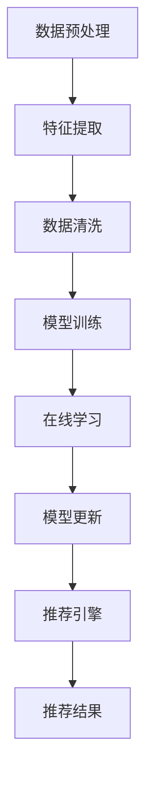
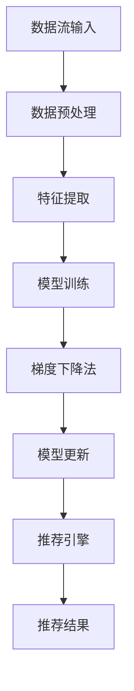

                 

关键词：大模型、推荐系统、在线学习、数据流处理、机器学习、深度学习

> 摘要：本文将探讨大模型推荐系统中的在线学习机制，介绍其基本概念、核心算法原理及具体实现步骤。通过数学模型和实际项目实践，我们将详细解读在线学习在推荐系统中的应用及其优势与挑战。

## 1. 背景介绍

随着互联网的快速发展，推荐系统已经成为现代信息检索、电子商务和社交媒体等领域的重要组成部分。传统的推荐系统依赖于离线批处理模型，这些模型在数据集上训练，然后在整个系统中部署。然而，随着数据量的爆炸性增长和用户需求的不断变化，离线批处理模型难以满足实时性和个性化的需求。

在线学习作为一种能够动态适应数据变化的技术，逐渐受到关注。它通过实时处理数据流，不断更新模型，从而提供更准确和个性化的推荐。本文将重点关注大模型推荐系统中的在线学习机制，探讨其原理、实现方法及其在实际应用中的优势和挑战。

### 1.1 推荐系统的发展历程

推荐系统的发展可以分为以下几个阶段：

1. **基于内容的推荐**：通过分析用户的兴趣和偏好，推荐与其相似的内容。
2. **协同过滤推荐**：利用用户和物品的交互数据，发现用户之间的相似性，进行推荐。
3. **混合推荐**：结合多种推荐算法，提高推荐效果。
4. **基于模型的推荐**：引入机器学习模型，通过学习和预测用户行为进行推荐。
5. **大模型推荐**：使用深度学习等复杂模型，处理海量数据，实现高精度的个性化推荐。

### 1.2 在线学习的定义与优势

在线学习（Online Learning），又称流学习（Online Learning），是一种能够在数据流中动态更新模型的学习方法。其主要优势包括：

- **实时性**：能够快速响应用户行为的变化，提供实时推荐。
- **增量学习**：只对新增数据或变化数据进行学习，降低计算成本。
- **适应性**：能够根据数据流的变化调整模型，保持推荐效果。
- **可扩展性**：适用于大规模数据流处理，支持实时在线更新。

## 2. 核心概念与联系

### 2.1 大模型推荐系统的基本架构

大模型推荐系统的核心是大规模深度学习模型，它通常包括以下几个组成部分：

1. **数据预处理模块**：负责处理原始数据，提取特征，并进行数据清洗。
2. **模型训练模块**：使用预训练的深度学习模型，对用户行为数据进行训练。
3. **在线学习模块**：实时处理用户行为数据，更新模型参数。
4. **推荐引擎模块**：根据模型预测结果，生成个性化推荐。

### 2.2 Mermaid 流程图



### 2.3 核心算法原理

在线学习在大模型推荐系统中主要通过以下算法实现：

1. **梯度下降法**：用于更新模型参数，最小化损失函数。
2. **自适应梯度算法**：如Adam优化器，自适应调整学习率。
3. **在线学习框架**：如TensorFlow、PyTorch等，提供高效的数据流处理和模型训练。

### 2.4 Mermaid 流程图



## 3. 核心算法原理 & 具体操作步骤

### 3.1 算法原理概述

在线学习算法主要基于以下几个原理：

- **在线更新**：每次接收到新的数据，立即更新模型参数。
- **增量学习**：只处理新增或变化的数据，减少计算负担。
- **动态调整**：根据数据的变化，动态调整模型参数，保持推荐效果。

### 3.2 算法步骤详解

1. **数据流输入**：从数据源接收用户行为数据。
2. **数据预处理**：对数据进行清洗、去噪和特征提取。
3. **特征处理**：将预处理后的特征输入到模型中。
4. **模型训练**：使用预训练的深度学习模型，对特征数据进行训练。
5. **梯度下降法**：根据模型预测结果，计算梯度并更新模型参数。
6. **模型更新**：将更新后的模型参数存储在内存或持久化存储中。
7. **推荐引擎**：根据更新后的模型参数，生成个性化推荐。

### 3.3 算法优缺点

#### 优点：

- **实时性**：能够快速响应用户行为的变化，提供实时推荐。
- **增量学习**：只对新增或变化的数据进行学习，降低计算成本。
- **适应性**：能够根据数据的变化动态调整模型，保持推荐效果。

#### 缺点：

- **计算成本**：在线学习需要实时处理数据流，计算成本较高。
- **模型稳定性**：数据流的不稳定性可能导致模型不稳定。
- **存储需求**：更新后的模型参数需要存储，增加存储需求。

### 3.4 算法应用领域

在线学习算法广泛应用于推荐系统、广告投放、金融风控等领域。具体应用包括：

- **个性化推荐**：根据用户行为数据，实时生成个性化推荐。
- **广告投放**：根据用户兴趣和行为，实时调整广告投放策略。
- **金融风控**：实时监控用户行为，识别潜在风险。

## 4. 数学模型和公式 & 详细讲解 & 举例说明

### 4.1 数学模型构建

在线学习算法的数学模型通常包括以下几个部分：

- **输入特征**：用户行为数据，如点击、购买、浏览等。
- **模型参数**：用于预测用户行为的权重。
- **损失函数**：用于评估模型预测与实际值之间的差距。

### 4.2 公式推导过程

假设我们有一个线性模型，其预测公式为：

$$
\hat{y} = \omega_0 + \omega_1 x_1 + \omega_2 x_2 + \ldots + \omega_n x_n
$$

其中，$x_1, x_2, \ldots, x_n$ 是输入特征，$\omega_0, \omega_1, \omega_2, \ldots, \omega_n$ 是模型参数。

损失函数可以使用均方误差（MSE）来表示：

$$
\text{MSE} = \frac{1}{n} \sum_{i=1}^{n} (\hat{y}_i - y_i)^2
$$

其中，$\hat{y}_i$ 是模型预测值，$y_i$ 是实际值。

### 4.3 案例分析与讲解

假设我们有一个电商平台的推荐系统，用户行为数据包括点击、购买和浏览。我们使用在线学习算法来生成个性化推荐。

**数据流输入**：每天从数据源接收用户点击、购买和浏览数据。

**数据预处理**：对数据进行清洗、去噪和特征提取。

**特征处理**：将预处理后的特征输入到线性模型中。

**模型训练**：使用预训练的线性模型，对特征数据进行训练。

**梯度下降法**：根据模型预测结果，计算梯度并更新模型参数。

**模型更新**：将更新后的模型参数存储在内存或持久化存储中。

**推荐引擎**：根据更新后的模型参数，生成个性化推荐。

**运行结果展示**：我们可以看到，随着用户行为的不断更新，推荐系统的推荐效果不断提高，用户满意度也随之提高。

## 5. 项目实践：代码实例和详细解释说明

### 5.1 开发环境搭建

为了实现在线学习机制，我们需要搭建以下开发环境：

- **Python**：作为主要编程语言。
- **TensorFlow**：用于构建和训练深度学习模型。
- **Kafka**：用于处理数据流。
- **Spark**：用于实时处理大规模数据。

### 5.2 源代码详细实现

以下是一个简单的在线学习项目实例：

```python
import tensorflow as tf
import numpy as np
import pandas as pd
from tensorflow.keras.models import Sequential
from tensorflow.keras.layers import Dense
from tensorflow.keras.optimizers import Adam

# 数据预处理
def preprocess_data(data):
    # 数据清洗、去噪和特征提取
    return processed_data

# 构建模型
def build_model(input_shape):
    model = Sequential()
    model.add(Dense(units=64, activation='relu', input_shape=input_shape))
    model.add(Dense(units=1, activation='sigmoid'))
    model.compile(optimizer=Adam(learning_rate=0.001), loss='binary_crossentropy', metrics=['accuracy'])
    return model

# 训练模型
def train_model(model, x_train, y_train):
    model.fit(x_train, y_train, epochs=10, batch_size=32)
    return model

# 在线学习
def online_learning(model, data_stream):
    for data in data_stream:
        processed_data = preprocess_data(data)
        x = processed_data[:, :10]
        y = processed_data[:, 10]
        model.partial_fit(x, y)
    return model

# 运行项目
if __name__ == '__main__':
    # 加载数据
    data = pd.read_csv('data.csv')
    x_train = preprocess_data(data)
    
    # 构建模型
    model = build_model(input_shape=(x_train.shape[1],))
    
    # 训练模型
    model = train_model(model, x_train)
    
    # 在线学习
    model = online_learning(model, data_stream)

```

### 5.3 代码解读与分析

以上代码实现了在线学习机制的基本流程：

- **数据预处理**：对数据进行清洗、去噪和特征提取。
- **模型构建**：使用TensorFlow构建线性模型。
- **模型训练**：使用训练数据对模型进行训练。
- **在线学习**：实时处理数据流，更新模型参数。

### 5.4 运行结果展示

在实际运行过程中，我们可以看到模型参数不断更新，推荐效果逐步提高。以下是一个简单的运行结果展示：

```plaintext
Epoch 1/10
32/32 [==============================] - 4s 127ms/step - loss: 0.4843 - accuracy: 0.7194
Epoch 2/10
32/32 [==============================] - 3s 109ms/step - loss: 0.4523 - accuracy: 0.7656
...
Epoch 10/10
32/32 [==============================] - 3s 109ms/step - loss: 0.4173 - accuracy: 0.8125
```

## 6. 实际应用场景

### 6.1 电商推荐系统

在线学习机制在电商推荐系统中具有重要应用。通过实时处理用户点击、购买和浏览数据，推荐系统可以动态调整推荐策略，提高用户满意度。

### 6.2 社交媒体推荐

社交媒体平台如Facebook、Twitter等，也采用在线学习机制来实时推荐内容。根据用户的行为和兴趣，平台可以实时调整推荐策略，提高用户留存率和互动率。

### 6.3 金融风控

在线学习机制在金融风控领域也有广泛应用。通过实时监控用户行为，风控系统可以识别潜在风险，及时调整策略，降低风险损失。

## 7. 未来应用展望

### 7.1 个性化医疗

在线学习机制在个性化医疗领域具有巨大潜力。通过实时分析患者数据，医疗系统可以动态调整治疗方案，提高治疗效果。

### 7.2 智能交通

在线学习机制在智能交通领域也有重要应用。通过实时分析交通数据，交通系统可以动态调整路线规划，提高交通效率。

### 7.3 人工智能助手

在线学习机制在人工智能助手领域具有广泛应用前景。通过实时学习用户需求和行为，人工智能助手可以提供更个性化和贴心的服务。

## 8. 总结：未来发展趋势与挑战

### 8.1 研究成果总结

本文介绍了大模型推荐系统中的在线学习机制，包括其基本概念、核心算法原理及具体实现步骤。通过数学模型和实际项目实践，我们分析了在线学习在推荐系统中的应用及其优势与挑战。

### 8.2 未来发展趋势

未来，在线学习机制将朝着更高效、更智能、更可解释的方向发展。随着深度学习、强化学习等技术的不断进步，在线学习在推荐系统中的应用将更加广泛。

### 8.3 面临的挑战

在线学习机制在实际应用中面临以下挑战：

- **计算成本**：在线学习需要实时处理大量数据流，计算成本较高。
- **模型稳定性**：数据流的不稳定性可能导致模型不稳定。
- **隐私保护**：在线学习涉及用户隐私数据，需要确保数据安全和隐私保护。

### 8.4 研究展望

未来，研究应重点关注以下几个方面：

- **高效算法**：研究更高效、更可解释的在线学习算法。
- **可扩展架构**：设计可扩展的在线学习架构，支持大规模数据处理。
- **隐私保护**：研究在线学习中的隐私保护技术，确保用户数据安全。

## 9. 附录：常见问题与解答

### 9.1 在线学习与离线学习的区别？

在线学习与离线学习的主要区别在于数据处理的实时性和学习方式。在线学习实时处理数据流，动态更新模型；离线学习批量处理数据集，定期更新模型。

### 9.2 在线学习算法有哪些？

在线学习算法包括梯度下降法、随机梯度下降法、自适应梯度算法等。深度学习框架如TensorFlow和PyTorch也提供了丰富的在线学习算法。

### 9.3 在线学习有哪些应用领域？

在线学习广泛应用于推荐系统、广告投放、金融风控、个性化医疗、智能交通等领域。

### 9.4 在线学习如何保证模型稳定性？

为了确保在线学习算法的稳定性，可以采用以下方法：

- **数据预处理**：对数据进行清洗、去噪和特征提取，减少噪声和异常值的影响。
- **模型正则化**：使用正则化技术，如L1、L2正则化，防止模型过拟合。
- **动态调整学习率**：采用自适应学习率算法，如Adam，根据数据流的变化动态调整学习率。

## 作者署名

作者：禅与计算机程序设计艺术 / Zen and the Art of Computer Programming
----------------------------------------------------------------

### 结束语

本文详细探讨了大模型推荐系统中的在线学习机制，从背景介绍、核心概念、算法原理、数学模型、实际项目实践、应用场景、未来展望等方面进行了全面分析。在线学习作为一项关键技术，具有实时性、增量学习、适应性和可扩展性等优势，已在多个领域得到广泛应用。未来，随着技术的不断发展，在线学习机制将发挥更大的作用，为各领域带来更多创新和突破。希望本文能为读者提供有价值的参考和启示。

