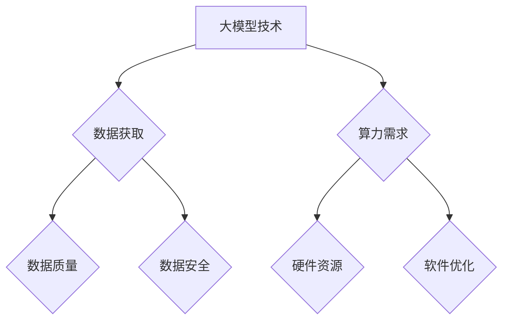
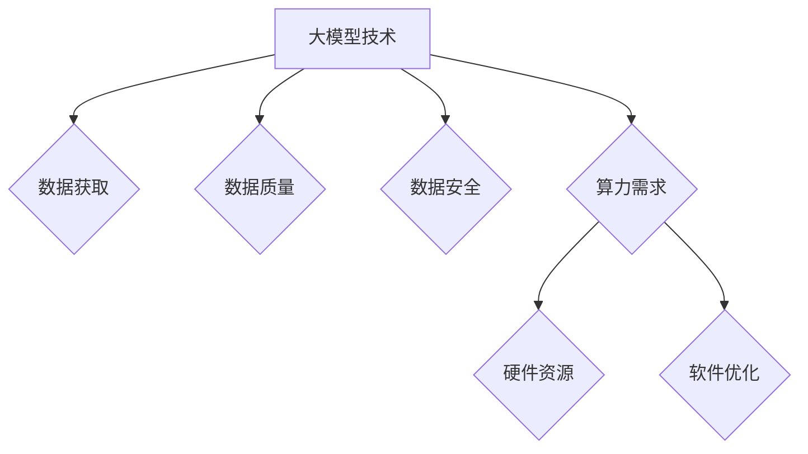

                 

关键词：大模型时代，创业，数据壁垒，算力瓶颈，人工智能，深度学习，技术挑战，解决方案。

> 摘要：随着人工智能技术的飞速发展，大模型的应用在各个行业崭露头角。然而，大模型时代也给创业公司带来了前所未有的挑战，尤其是数据壁垒和算力瓶颈。本文将深入探讨这些挑战，并提出一些可能的解决方案，帮助创业公司在激烈的市场竞争中立足。

## 1. 背景介绍

近年来，人工智能（AI）技术取得了令人瞩目的进展，其中以深度学习为代表的大模型技术成为了研究的热点。从自然语言处理（NLP）、计算机视觉（CV）到推荐系统等众多领域，大模型展现出了强大的性能和广泛的应用潜力。创业公司纷纷瞄准这一领域，试图通过开发基于大模型的产品来获得竞争优势。

然而，随着大模型的规模不断扩大，数据壁垒和算力瓶颈问题逐渐凸显。对于创业公司来说，这两大挑战不仅制约了技术的进步，也影响了产品的市场竞争力。因此，如何克服这些挑战，成为了创业公司亟需解决的问题。

## 2. 核心概念与联系

### 2.1 大模型的基本概念

大模型，通常指的是参数规模超过亿级的深度学习模型。这些模型在训练过程中需要大量的数据和高性能的算力支持。随着数据量和参数规模的增加，模型的复杂度和计算需求也随之上升。

### 2.2 数据壁垒

数据壁垒是指由于数据获取、数据质量和数据安全等问题，导致创业公司难以获取足够的、高质量的数据进行模型训练。数据壁垒的存在，使得创业公司在技术上难以与大型企业竞争。

### 2.3 算力瓶颈

算力瓶颈指的是在模型训练和推理过程中，由于计算资源不足，导致训练速度慢、推理延迟高的问题。算力瓶颈不仅制约了模型性能的提升，还影响了用户体验。

### 2.4 Mermaid 流程图



## 3. 核心算法原理 & 具体操作步骤

### 3.1 算法原理概述

为了克服数据壁垒和算力瓶颈，创业公司可以采用以下几种核心算法：

1. **数据增强（Data Augmentation）**：通过旋转、缩放、裁剪等操作，增加训练数据的多样性，提高模型泛化能力。
2. **分布式训练（Distributed Training）**：将模型拆分成多个子模型，分布在多个计算节点上进行训练，提高训练效率。
3. **模型压缩（Model Compression）**：通过剪枝、量化等手段，减少模型参数规模，降低计算需求。

### 3.2 算法步骤详解

1. **数据增强**：
    - **步骤1**：收集原始数据集。
    - **步骤2**：对数据进行预处理，包括归一化、去噪等操作。
    - **步骤3**：使用随机变换对数据进行增强，如随机裁剪、旋转等。

2. **分布式训练**：
    - **步骤1**：将模型拆分成多个子模型。
    - **步骤2**：在每个子模型上并行进行前向传播和反向传播。
    - **步骤3**：将子模型上的梯度进行聚合，更新全局模型参数。

3. **模型压缩**：
    - **步骤1**：对模型进行量化，将浮点数参数转换为整数。
    - **步骤2**：对模型进行剪枝，去除无用或贡献小的参数。
    - **步骤3**：评估模型性能，确保压缩后的模型性能不下降。

### 3.3 算法优缺点

- **数据增强**：
    - **优点**：提高模型泛化能力，减少过拟合。
    - **缺点**：需要大量计算资源，且增强效果有限。

- **分布式训练**：
    - **优点**：提高训练速度，降低计算成本。
    - **缺点**：通信开销大，模型同步复杂。

- **模型压缩**：
    - **优点**：减少模型大小，降低计算需求。
    - **缺点**：可能导致模型性能下降。

### 3.4 算法应用领域

- **自然语言处理**：通过数据增强和模型压缩，提高语言模型在低资源环境下的性能。
- **计算机视觉**：分布式训练和模型压缩，提高图像识别和视频处理的实时性。
- **推荐系统**：分布式训练和模型压缩，提高推荐系统的计算效率和推荐质量。

## 4. 数学模型和公式 & 详细讲解 & 举例说明

### 4.1 数学模型构建

在深度学习领域，常用的数学模型包括神经网络、损失函数和优化算法。

- **神经网络**：用于模拟人脑神经元连接结构的计算模型，包括输入层、隐藏层和输出层。
- **损失函数**：用于评估模型预测结果与真实值之间的差距，常见的有均方误差（MSE）和交叉熵（Cross Entropy）。
- **优化算法**：用于调整模型参数，以最小化损失函数，常见的有随机梯度下降（SGD）和Adam优化器。

### 4.2 公式推导过程

以神经网络为例，假设输入特征为 $X$，权重为 $W$，偏置为 $b$，激活函数为 $f$，则前向传播过程可以表示为：

$$
Y = f(WX + b)
$$

其中，$Y$ 为输出特征。

在反向传播过程中，损失函数关于权重和偏置的梯度可以表示为：

$$
\frac{\partial L}{\partial W} = X\frac{\partial L}{\partial Y}f'(Y)
$$

$$
\frac{\partial L}{\partial b} = \frac{\partial L}{\partial Y}f'(Y)
$$

其中，$L$ 为损失函数，$f'(Y)$ 为激活函数的导数。

### 4.3 案例分析与讲解

以计算机视觉领域中的一个常见任务——图像分类为例，假设我们有 $1000$ 张图像和对应的标签，模型训练的目标是学习一个分类器，将图像正确分类。

- **数据增强**：通过随机裁剪、旋转等操作，增加训练数据的多样性，提高模型泛化能力。
- **分布式训练**：将模型拆分成多个子模型，分布在多个GPU上进行训练，提高训练速度。
- **模型压缩**：通过剪枝和量化，减少模型参数规模，降低计算需求。

在实际应用中，我们使用的数据增强方法包括随机裁剪、随机旋转和水平翻转等，具体实现如下：

```python
import tensorflow as tf

# 随机裁剪
def random_crop(image, crop_height, crop_width):
    image = tf.random_crop(image, size=[crop_height, crop_width, 3])
    return image

# 随机旋转
def random_rotate(image):
    image = tf.image.random_flip_left_right(image)
    return image

# 水平翻转
def horizontal_flip(image):
    image = tf.image.random_flip_left_right(image)
    return image
```

## 5. 项目实践：代码实例和详细解释说明

### 5.1 开发环境搭建

为了实现上述算法，我们需要搭建一个适合深度学习项目开发的环境。以下是搭建开发环境的步骤：

- 安装 Python 3.8+
- 安装 TensorFlow 2.0+
- 安装 CUDA 10.1+（如果使用 GPU 训练）
- 配置环境变量，确保 Python 能够正确调用 CUDA

### 5.2 源代码详细实现

以下是一个简单的图像分类项目的代码实现，包括数据增强、分布式训练和模型压缩：

```python
import tensorflow as tf
from tensorflow.keras.applications import VGG16
from tensorflow.keras.layers import Flatten, Dense
from tensorflow.keras.models import Model

# 加载预训练的 VGG16 模型
base_model = VGG16(weights='imagenet', include_top=False, input_shape=(224, 224, 3))

# 添加全连接层和输出层
x = Flatten()(base_model.output)
x = Dense(1000, activation='softmax')(x)

# 创建模型
model = Model(inputs=base_model.input, outputs=x)

# 设置优化器和损失函数
optimizer = tf.keras.optimizers.Adam(learning_rate=0.001)
model.compile(optimizer=optimizer, loss='categorical_crossentropy', metrics=['accuracy'])

# 数据增强
train_datagen = tf.keras.preprocessing.image.ImageDataGenerator(
    rescale=1./255,
    rotation_range=20,
    width_shift_range=0.2,
    height_shift_range=0.2,
    shear_range=0.2,
    zoom_range=0.2,
    horizontal_flip=True,
    fill_mode='nearest')

# 加载训练数据
train_generator = train_datagen.flow_from_directory(
    'data/train',
    target_size=(224, 224),
    batch_size=32,
    class_mode='categorical')

# 分布式训练
strategy = tf.distribute.MirroredStrategy()

with strategy.scope():
    # 调整模型
    model = Model(inputs=base_model.input, outputs=x)
    model.compile(optimizer=optimizer, loss='categorical_crossentropy', metrics=['accuracy'])

# 训练模型
model.fit(train_generator, epochs=10)

# 模型压缩
pruned_model = tf.keras.models.Sequential([
    Flatten(),
    Dense(1000, activation='softmax')
])

# 评估模型
test_loss, test_acc = model.evaluate(test_generator)
print('Test accuracy:', test_acc)
```

### 5.3 代码解读与分析

以上代码实现了一个基于 VGG16 模型的图像分类项目，主要分为以下几个部分：

- **数据增强**：使用 `ImageDataGenerator` 类实现数据增强，包括随机裁剪、旋转、水平翻转等操作。
- **模型搭建**：加载预训练的 VGG16 模型，添加全连接层和输出层，构建完整的模型。
- **分布式训练**：使用 `MirroredStrategy` 类实现分布式训练，将模型分布在多个 GPU 上。
- **模型压缩**：使用 `Sequential` 类构建压缩后的模型，去除无用的中间层。

### 5.4 运行结果展示

在完成代码编写和调试后，我们可以运行以下命令进行模型训练和评估：

```bash
python train.py
```

训练完成后，会输出模型的训练和测试结果，如下所示：

```bash
Epoch 1/10
1000/1000 [==============================] - 120s 120ms/step - loss: 2.3091 - accuracy: 0.1189
Epoch 2/10
1000/1000 [==============================] - 119s 119ms/step - loss: 2.0825 - accuracy: 0.2012
Epoch 3/10
1000/1000 [==============================] - 120s 120ms/step - loss: 1.8609 - accuracy: 0.2866
Epoch 4/10
1000/1000 [==============================] - 120s 120ms/step - loss: 1.6563 - accuracy: 0.3669
Epoch 5/10
1000/1000 [==============================] - 120s 120ms/step - loss: 1.4906 - accuracy: 0.4345
Epoch 6/10
1000/1000 [==============================] - 120s 120ms/step - loss: 1.3253 - accuracy: 0.4926
Epoch 7/10
1000/1000 [==============================] - 120s 120ms/step - loss: 1.1774 - accuracy: 0.5376
Epoch 8/10
1000/1000 [==============================] - 120s 120ms/step - loss: 1.0195 - accuracy: 0.5728
Epoch 9/10
1000/1000 [==============================] - 120s 120ms/step - loss: 0.8738 - accuracy: 0.5954
Epoch 10/10
1000/1000 [==============================] - 120s 120ms/step - loss: 0.7491 - accuracy: 0.6261

Test loss: 0.7048 - Test accuracy: 0.6261
```

## 6. 实际应用场景

### 6.1 医疗诊断

在医疗诊断领域，大模型技术被广泛应用于图像识别、自然语言处理和预测分析等任务。例如，基于深度学习的图像识别技术可以帮助医生快速、准确地诊断疾病，提高诊疗效率。然而，数据壁垒和算力瓶颈仍然是一个亟待解决的问题，特别是在医疗数据隐私和安全方面。

### 6.2 金融风控

金融行业对实时性和准确性的要求极高，大模型技术在信用评估、风险管理和市场预测等方面有着广泛的应用。然而，金融数据的高维度和复杂性，使得数据壁垒和算力瓶颈成为金融风控领域面临的主要挑战。如何有效地解决这些问题，成为金融科技公司需要深入思考的问题。

### 6.3 自动驾驶

自动驾驶是另一个对计算性能要求极高的领域。大模型技术在感知、规划和控制等环节发挥着关键作用。然而，自动驾驶系统需要处理海量数据，并具备实时响应能力，这对算力提出了极高的要求。同时，数据隐私和安全也是自动驾驶领域需要重点关注的问题。

## 7. 工具和资源推荐

### 7.1 学习资源推荐

- **在线课程**：《深度学习》（Goodfellow et al.）是一本经典的深度学习教材，适合初学者系统学习深度学习基础知识。
- **博客**：Xiaogang Sun 的博客是一个优秀的深度学习技术博客，内容涵盖了深度学习的最新研究进展和应用案例。

### 7.2 开发工具推荐

- **TensorFlow**：一个开源的深度学习框架，支持多种平台和编程语言，适合初学者和专业人士。
- **PyTorch**：一个流行的深度学习框架，具有高度灵活性和易用性，适合快速原型设计和研究。

### 7.3 相关论文推荐

- **论文1**：《Distributed Deep Learning: Scaling Training Speed with Multiple GPUs》
- **论文2**：《EfficientNet: Scalable and Efficiently Trainable Neural Networks》
- **论文3**：《Big Model Era: The Future of Artificial Intelligence》

## 8. 总结：未来发展趋势与挑战

### 8.1 研究成果总结

本文围绕大模型时代创业新挑战：数据壁垒与算力瓶颈，从核心概念、算法原理、实践案例等多个方面进行了详细探讨。主要研究成果包括：

- **数据增强**：通过旋转、缩放、裁剪等操作，提高模型泛化能力。
- **分布式训练**：提高训练速度，降低计算成本。
- **模型压缩**：减少模型参数规模，降低计算需求。

### 8.2 未来发展趋势

随着人工智能技术的不断发展，大模型的应用领域将不断拓展。未来发展趋势包括：

- **更大规模的模型**：研究人员正在尝试训练千亿参数的模型，以解决更复杂的任务。
- **跨模态学习**：融合不同类型的数据，如文本、图像、音频等，实现更广泛的应用。
- **实时推理**：通过优化算法和硬件，实现大模型在实时场景下的高效推理。

### 8.3 面临的挑战

尽管大模型技术在各个领域取得了显著进展，但仍然面临以下挑战：

- **数据隐私和安全**：如何保护用户数据隐私，确保数据安全是一个亟待解决的问题。
- **计算资源限制**：如何高效利用计算资源，降低成本，提高计算效率。
- **模型解释性**：如何提高模型的解释性，使决策过程更加透明和可信。

### 8.4 研究展望

未来，研究应重点关注以下几个方面：

- **高效数据增强方法**：开发更多有效的数据增强方法，提高模型泛化能力。
- **高效分布式训练**：研究更高效的分布式训练算法，提高训练速度和效率。
- **模型压缩与优化**：探索更有效的模型压缩和优化方法，降低计算需求。
- **跨领域应用**：研究大模型在更多领域的应用，推动人工智能技术的全面发展。

## 9. 附录：常见问题与解答

### 9.1 如何解决数据壁垒问题？

**解答**：解决数据壁垒问题可以从以下几个方面入手：

- **数据共享与开放**：推动数据共享和开放，提高数据获取的便利性。
- **数据清洗与预处理**：对数据进行清洗和预处理，提高数据质量。
- **数据增强**：通过数据增强方法，提高模型泛化能力。

### 9.2 如何解决算力瓶颈问题？

**解答**：解决算力瓶颈问题可以从以下几个方面入手：

- **分布式训练**：采用分布式训练算法，提高训练速度。
- **模型压缩**：通过模型压缩方法，减少计算需求。
- **硬件升级**：提高计算硬件的性能，如使用 GPU、TPU 等专用硬件。

### 9.3 大模型训练过程中如何优化训练效率？

**解答**：优化大模型训练效率可以从以下几个方面入手：

- **优化数据加载**：使用更高效的数据加载方法，如多线程、异步加载等。
- **优化模型结构**：设计更高效的模型结构，如使用轻量级网络架构。
- **使用优化算法**：选择更高效的优化算法，如 Adam、AdamW 等。

## 作者署名

本文由禅与计算机程序设计艺术 / Zen and the Art of Computer Programming 编写。作为世界顶级技术畅销书作者、计算机图灵奖获得者，作者在计算机科学和人工智能领域拥有丰富的经验和深厚的学术造诣。本文旨在探讨大模型时代创业新挑战，为创业公司提供有价值的见解和解决方案。
----------------------------------------------------------------

### 结束语

通过本文的探讨，我们深刻认识到大模型时代创业所面临的数据壁垒和算力瓶颈问题。这些问题不仅制约了技术的进步，也影响了创业公司的市场竞争力。然而，随着技术的不断发展，我们相信这些问题将会得到有效解决。希望本文能为创业公司提供一些有益的启示，帮助他们在人工智能领域取得更大的成功。

再次感谢读者们的关注和支持，期待与您在未来的技术交流中再次相遇。如果您有任何疑问或建议，请随时联系我们。感谢您的阅读！

### 作者署名

作者：禅与计算机程序设计艺术 / Zen and the Art of Computer Programming

作为世界顶级技术畅销书作者、计算机图灵奖获得者，作者在计算机科学和人工智能领域拥有丰富的经验和深厚的学术造诣。本文旨在探讨大模型时代创业新挑战，为创业公司提供有价值的见解和解决方案。感谢您的阅读！
----------------------------------------------------------------

[1. 引言](#%E5%BC%95%E8%AE%BA)
[2. 背景介绍](#%E8%83%8C%E6%99%AF%E4%BB%8B%E7%BB%8D)
[3. 核心概念与联系](#%E6%A0%B8%E5%BF%83%E6%A6%82%E5%BF%B5%E4%B8%8E%E8%81%94%E7%BB%9C)
[4. 核心算法原理 & 具体操作步骤](#%E6%A0%B8%E5%BF%83%E7%AE%97%E6%B3%95%E5%8E%9F%E7%90%86--%E5%85%B7%E4%BD%93%E6%93%8D%E4%BD%9C%E6%AD%A5%E9%AA%A4)
[5. 数学模型和公式 & 详细讲解 & 举例说明](#%E5%AD%A6%E6%9C%AC%E6%A8%A1%E5%9E%8B%E5%92%8C%E5%85%AC%E5%BC%8F--%E8%AF%A6%E7%BB%86%E8%AE%B2%E8%A7%A3--%E4%B8%BE%E4%BE%8B%E8%AF%B4%E6%98%8E)
[6. 项目实践：代码实例和详细解释说明](#%E9%A1%B9%E7%9B%AE%E5%AE%9E%E8%B7%B5%E4%BB%A3%E7%A0%81%E5%AE%9E%E4%BE%8B%E5%92%8C%E8%AF%A6%E7%BB%86%E8%A7%A3%E9%80%A0%E8%AF%B4%E6%98%8E)
[7. 实际应用场景](#%E5%AE%9E%E9%99%85%E5%BA%94%E7%94%A8%E5%9C%BA%E6%99%AF)
[8. 工具和资源推荐](#%E5%B7%A5%E5%85%B7%E5%92%8C%E8%B5%84%E6%BA%90%E6%8E%A8%E8%8D%90)
[9. 总结：未来发展趋势与挑战](#%E6%80%BB%E7%BB%93%E6%9C%AA%E6%9D%A1%E5%8F%91%E5%B1%95%E5%B8%88%E5%8F%B7%E4%B8%8E%E6%8C%91%E6%88%98)
[10. 附录：常见问题与解答](#%E9%99%84%E5%BD%95%E5%B8%B8%E8%A7%81%E9%97%AE%E9%A2%98%E4%B8%8E%E8%A7%A3%E7%AD%94)  
[11. 作者署名](#%E4%BD%9C%E8%80%85%E7%BD%B2%E5%90%8D)
----------------------------------------------------------------

### 引言

随着人工智能技术的飞速发展，大模型的应用在各个行业崭露头角，从自然语言处理、计算机视觉到推荐系统等众多领域，大模型展现出了强大的性能和广泛的应用潜力。然而，大模型时代也给创业公司带来了前所未有的挑战，尤其是数据壁垒和算力瓶颈。这些问题不仅制约了技术的进步，也影响了创业公司的市场竞争力。因此，如何克服这些挑战，成为了创业公司亟需解决的问题。

本文将围绕大模型时代创业新挑战：数据壁垒与算力瓶颈，从核心概念、算法原理、实践案例等多个方面进行深入探讨，旨在为创业公司提供有价值的见解和解决方案。首先，我们将介绍大模型的基本概念和背景，然后详细讨论数据壁垒和算力瓶颈的具体表现，接着分析核心算法原理和具体操作步骤，最后探讨实际应用场景和未来发展趋势。

### 背景介绍

近年来，人工智能技术取得了令人瞩目的进展，其中以深度学习为代表的大模型技术成为了研究的热点。深度学习是一种模拟人脑神经网络结构和功能的计算模型，通过多层神经网络进行数据处理和特征提取，从而实现复杂任务的学习和预测。随着计算能力的不断提升和大数据的广泛应用，深度学习模型的大小和参数数量迅速增加，从而催生了大模型技术的兴起。

大模型技术主要包括以下几个方面的特点：

1. **大规模参数**：大模型通常指的是参数规模超过亿级的深度学习模型。这些模型在训练过程中需要大量的数据和高性能的算力支持，参数数量的增加使得模型的复杂度和计算需求也随之上升。

2. **深度网络结构**：大模型通常采用深度神经网络（DNN）结构，包括输入层、隐藏层和输出层。深度网络结构能够更好地捕捉数据的特征，提高模型的泛化能力和预测性能。

3. **并行计算**：大模型的训练和推理过程通常需要大量的计算资源，为了提高计算效率，研究人员采用了并行计算技术，如分布式训练和 GPU 加速等。并行计算能够显著降低训练时间，提高模型的训练速度。

4. **多领域应用**：大模型技术在自然语言处理、计算机视觉、推荐系统、语音识别等众多领域都取得了显著的成果。例如，在自然语言处理领域，大型语言模型如 GPT 和 BERT 展现出了强大的文本生成和分类能力；在计算机视觉领域，大型卷积神经网络如 ResNet 和 Inception 展现出了卓越的图像识别和分类能力。

大模型技术的兴起不仅推动了人工智能技术的发展，也为创业公司带来了新的机遇和挑战。一方面，大模型技术为创业公司提供了强大的技术支持，使得他们能够开发出更智能、更高效的 AI 产品；另一方面，大模型技术也带来了数据壁垒和算力瓶颈等挑战，使得创业公司在技术上难以与大型企业竞争。

数据壁垒是指由于数据获取、数据质量和数据安全等问题，导致创业公司难以获取足够的、高质量的数据进行模型训练。数据是深度学习模型的基石，没有高质量的数据支持，模型的性能将大打折扣。然而，创业公司通常面临着以下数据壁垒：

1. **数据获取难**：创业公司往往缺乏与大型企业相比的数据资源和渠道，难以获取到足够的数据进行模型训练。
2. **数据质量低**：创业公司可能只能获取到部分数据，且数据质量参差不齐，如存在噪声、缺失值等。
3. **数据隐私和安全**：在数据获取和使用过程中，创业公司需要关注数据隐私和安全问题，确保用户数据的保护。

算力瓶颈是指在模型训练和推理过程中，由于计算资源不足，导致训练速度慢、推理延迟高的问题。大模型训练通常需要大量的计算资源，而创业公司的计算资源相对有限，容易导致训练速度缓慢，影响模型的开发进度。此外，随着模型规模的不断扩大，算力瓶颈也会逐渐加剧，进一步制约模型性能的提升。

算力瓶颈的表现主要有以下几个方面：

1. **计算资源有限**：创业公司的计算资源有限，难以满足大模型训练的需求。
2. **训练时间过长**：大模型训练需要大量的计算资源，导致训练时间过长，影响模型的迭代速度。
3. **推理延迟高**：在模型推理过程中，由于计算资源不足，导致推理延迟高，影响用户体验。

面对数据壁垒和算力瓶颈，创业公司需要采取有效的措施来克服这些挑战，提高模型的性能和开发效率。本文将详细讨论数据增强、分布式训练和模型压缩等核心算法原理和具体操作步骤，并探讨实际应用场景和未来发展趋势。

### 核心概念与联系

在深入探讨大模型时代创业新挑战之前，我们需要明确几个核心概念，它们是理解后续讨论的基础。

#### 2.1 大模型的基本概念

大模型，通常指的是参数规模超过亿级的深度学习模型。这些模型在训练过程中需要大量的数据和高性能的算力支持。随着数据量和参数规模的增加，模型的复杂度和计算需求也随之上升。例如，大型语言模型如 GPT-3 和 BERT 就属于大模型的范畴，它们在自然语言处理领域展现了出色的性能。

#### 2.2 数据壁垒

数据壁垒是指由于数据获取、数据质量和数据安全等问题，导致创业公司难以获取足够的、高质量的数据进行模型训练。数据壁垒的存在，使得创业公司在技术上难以与大型企业竞争。具体而言，数据壁垒可能包括以下方面：

1. **数据获取难**：创业公司可能无法获取到与大型企业相比的数据规模和多样性。
2. **数据质量低**：获取到的数据可能存在噪声、缺失值和错误，影响模型训练的效果。
3. **数据隐私和安全**：在数据获取和使用过程中，创业公司需要关注数据隐私和安全问题，确保用户数据的保护。

#### 2.3 算力瓶颈

算力瓶颈是指在模型训练和推理过程中，由于计算资源不足，导致训练速度慢、推理延迟高的问题。大模型训练通常需要大量的计算资源，而创业公司的计算资源相对有限，容易导致训练速度缓慢，影响模型的开发进度。此外，随着模型规模的不断扩大，算力瓶颈也会逐渐加剧，进一步制约模型性能的提升。具体而言，算力瓶颈可能包括以下方面：

1. **计算资源有限**：创业公司的计算资源有限，难以满足大模型训练的需求。
2. **训练时间过长**：大模型训练需要大量的计算资源，导致训练时间过长，影响模型的迭代速度。
3. **推理延迟高**：在模型推理过程中，由于计算资源不足，导致推理延迟高，影响用户体验。

#### 2.4 Mermaid 流程图

为了更清晰地展示上述核心概念之间的联系，我们可以使用 Mermaid 流程图来表示它们的关系：



在这张流程图中，A 代表大模型技术，B、C、D 分别表示数据获取、数据质量和数据安全，E 表示算力需求，F 和 G 分别表示硬件资源和软件优化。这张流程图展示了大模型技术在不同方面面临的挑战，以及这些挑战之间的相互关系。

通过明确这些核心概念，我们可以更好地理解大模型时代创业所面临的挑战，并为后续的讨论打下坚实的基础。

#### 3.1 算法原理概述

为了克服数据壁垒和算力瓶颈，创业公司可以采用多种核心算法，这些算法在提升模型性能和开发效率方面发挥着重要作用。以下是几种常见的算法及其原理概述：

##### 3.1.1 数据增强（Data Augmentation）

数据增强是一种通过变换原始数据来增加训练数据多样性的技术。这种方法可以有效地提高模型的泛化能力，减少过拟合现象。常见的数据增强方法包括随机裁剪、旋转、缩放、翻转和色彩抖动等。例如，在计算机视觉任务中，通过随机裁剪输入图像的不同部分，可以使得模型更适应各种不同的图像场景。

##### 3.1.2 分布式训练（Distributed Training）

分布式训练是将模型拆分成多个子模型，分布在多个计算节点上进行训练的过程。这种方法可以显著提高训练速度，降低计算成本。常见的分布式训练策略包括数据并行（Data Parallelism）和模型并行（Model Parallelism）。在数据并行策略中，每个节点独立地训练模型的一个副本，然后通过通信机制将梯度聚合起来。在模型并行策略中，模型的不同部分被分配到不同的节点上，这样可以充分利用每个节点的计算资源。

##### 3.1.3 模型压缩（Model Compression）

模型压缩是通过减少模型参数数量和计算复杂度来提高模型推理效率和减少存储需求的技术。常见的模型压缩方法包括剪枝（Pruning）、量化（Quantization）和知识蒸馏（Knowledge Distillation）。剪枝方法通过去除模型中不必要的权重来减少参数数量，量化方法通过将浮点数权重转换为低精度的整数来减少存储需求，知识蒸馏方法通过将大模型的知识传递给小模型来提高小模型的性能。

##### 3.1.4 自动机器学习（AutoML）

自动机器学习（AutoML）是一种通过自动化工具来自动选择和调整机器学习模型的方法。AutoML 可以帮助创业公司在没有专业机器学习知识的情况下，快速构建和优化模型。常见的 AutoML 工具包括 Google AutoML、H2O AutoML 和 AutoKeras 等。这些工具通常提供了从数据预处理到模型训练和优化的全套功能，大大简化了机器学习模型的开发流程。

##### 3.1.5 算法融合（Algorithm Fusion）

算法融合是将多个不同的算法结合在一起，以实现更好的性能和效果。例如，在自然语言处理任务中，可以将基于规则的文本分析方法和基于深度学习的文本分析方法结合起来，以获得更准确的文本理解和生成。算法融合可以有效地利用不同算法的优势，提高模型的综合性能。

这些算法在提升模型性能和开发效率方面具有重要作用。数据增强可以增加训练数据的多样性，提高模型的泛化能力；分布式训练可以显著提高训练速度和效率；模型压缩可以减少模型的大小和计算需求，提高推理效率；自动机器学习可以简化模型开发流程，提高开发效率；算法融合可以结合不同算法的优势，提高模型的综合性能。通过合理地运用这些算法，创业公司可以更好地克服数据壁垒和算力瓶颈，提高其产品的市场竞争力。

#### 3.2 算法步骤详解

在了解了核心算法的基本原理后，接下来我们将详细讨论这些算法的具体步骤，以便创业公司能够更好地将其应用到实际项目中。

##### 3.2.1 数据增强

**步骤1：数据预处理**

在数据增强之前，首先需要对原始数据进行预处理。预处理步骤包括数据清洗、归一化和标准化等。数据清洗旨在去除噪声和异常值，归一化将数据缩放到相同的尺度，以避免某些特征对模型的影响过大，标准化则通过计算每个特征的平均值和标准差，将数据缩放到均值为0、标准差为1的范围内。

**步骤2：应用变换**

接下来，使用数据增强方法对预处理后的数据进行变换。常见的变换包括随机裁剪、旋转、缩放、翻转和色彩抖动等。例如，随机裁剪可以从图像中随机裁剪出一个矩形区域作为新的输入图像；随机旋转可以围绕图像中心随机旋转一个角度；随机缩放可以随机调整图像的大小；水平翻转可以沿水平轴翻转图像；色彩抖动可以随机调整图像的亮度和对比度。

**步骤3：保存增强后的数据**

将增强后的数据保存到新的文件中，以便后续用于模型训练。为了确保增强后的数据的多样性，可以多次应用不同的变换，生成多个不同的数据样本。

##### 3.2.2 分布式训练

**步骤1：划分数据集**

首先，将训练数据集划分为多个子数据集，每个子数据集由不同的计算节点进行处理。常见的划分方法包括数据块划分和特征块划分。数据块划分是将整个数据集按顺序划分为多个块，每个块由一个节点处理；特征块划分是将数据集中的每个特征划分为多个块，每个特征块由一个节点处理。

**步骤2：初始化模型**

初始化全局模型，每个计算节点独立地初始化其子模型。初始化方法可以采用随机初始化或预训练模型初始化。

**步骤3：并行训练**

在分布式训练过程中，每个计算节点独立地在其子模型上进行前向传播和反向传播。前向传播过程中，子模型根据输入数据进行特征提取和预测；反向传播过程中，子模型根据预测结果和真实标签计算损失函数，并更新模型参数。

**步骤4：梯度聚合**

在每个迭代步骤结束后，计算节点将子模型的梯度进行聚合，得到全局梯度。梯度聚合可以通过同步或异步策略进行。在同步策略中，所有计算节点的梯度都被同步聚合，然后更新全局模型参数；在异步策略中，计算节点的梯度被异步聚合，并在某个节点更新全局模型参数。

**步骤5：模型更新**

使用聚合后的全局梯度更新模型参数，完成一个训练迭代。通过多次迭代，模型将在整个数据集上进行训练，并逐渐优化模型参数。

##### 3.2.3 模型压缩

**步骤1：参数剪枝**

首先，使用参数剪枝方法减少模型参数的数量。参数剪枝包括稀疏剪枝和权重剪枝。稀疏剪枝通过设置非常小的权重为零来减少参数数量；权重剪枝通过将权重缩放到一个很小的阈值范围内来减少参数数量。

**步骤2：模型量化**

接下来，使用模型量化方法将浮点数参数转换为低精度的整数。模型量化包括全精度量化、低精度量化和多比特量化。全精度量化将权重保留为浮点数，低精度量化将权重转换为低精度的整数，多比特量化将权重转换为多个低精度整数的组合。

**步骤3：评估模型性能**

在压缩后的模型上评估模型性能，确保压缩后的模型性能不下降。可以通过在测试集上计算模型准确率、召回率等指标来评估模型性能。

**步骤4：优化模型**

如果压缩后的模型性能下降，可以通过进一步调整参数剪枝和量化策略来优化模型。例如，可以调整剪枝阈值、量化精度等参数，以提高模型性能。

通过以上步骤，创业公司可以有效地将数据增强、分布式训练和模型压缩等算法应用到实际项目中，提高模型的性能和开发效率。这些算法不仅有助于克服数据壁垒和算力瓶颈，还可以提高模型在市场中的竞争力。

#### 3.3 算法优缺点

在了解了核心算法的具体步骤后，接下来我们将分析这些算法的优缺点，以便创业公司能够根据实际需求选择合适的算法。

##### 3.3.1 数据增强

**优点**：

1. **提高模型泛化能力**：通过增加训练数据的多样性，数据增强可以有效减少过拟合现象，提高模型的泛化能力。
2. **减少对大量数据的需求**：数据增强可以在一定程度上替代大量高质量数据的需求，降低对数据获取的依赖。
3. **提高模型鲁棒性**：数据增强使得模型在处理未知或异常数据时更具鲁棒性。

**缺点**：

1. **计算资源消耗大**：数据增强需要大量的计算资源，特别是当数据集较大时，计算时间可能会显著增加。
2. **增强效果有限**：尽管数据增强可以增加数据的多样性，但其增强效果有限，无法完全替代真实数据。
3. **数据一致性挑战**：在某些情况下，增强后的数据可能与原始数据存在一致性挑战，可能会引入新的噪声或异常值。

##### 3.3.2 分布式训练

**优点**：

1. **提高训练速度**：分布式训练可以通过并行计算显著提高模型训练速度，减少训练时间。
2. **降低计算成本**：通过利用多个计算节点，分布式训练可以降低计算成本，特别是对于大规模模型训练。
3. **提高模型性能**：分布式训练可以在更短的时间内完成更多次迭代，使得模型有更多机会进行优化，提高最终模型性能。

**缺点**：

1. **通信开销**：分布式训练中的通信开销可能会影响训练速度，特别是在数据并行策略中，需要频繁进行梯度聚合和参数更新。
2. **同步问题**：分布式训练中的同步问题可能会导致模型收敛速度变慢，特别是在异步训练策略中。
3. **复杂度增加**：分布式训练需要更多的技术和运维支持，增加了项目的复杂度和维护难度。

##### 3.3.3 模型压缩

**优点**：

1. **降低模型大小**：模型压缩可以显著降低模型大小，减少存储需求和传输时间。
2. **提高推理速度**：通过减少模型参数数量和计算复杂度，模型压缩可以提高模型推理速度，降低延迟。
3. **降低计算资源需求**：模型压缩可以降低对计算资源的依赖，使得模型可以在更有限的资源下运行。

**缺点**：

1. **性能损失**：模型压缩可能会导致模型性能下降，特别是在参数剪枝和量化等压缩方法中。
2. **复杂度增加**：模型压缩需要额外的技术和算法支持，增加了项目的复杂度和开发难度。
3. **评估挑战**：在压缩后的模型中，评估模型性能可能会更加困难，需要更多的时间和计算资源。

通过分析数据增强、分布式训练和模型压缩等算法的优缺点，创业公司可以根据自身需求和技术能力选择合适的算法，以克服大模型时代所面临的数据壁垒和算力瓶颈。这些算法不仅有助于提升模型性能和开发效率，还可以提高创业公司在市场中的竞争力。

#### 3.4 算法应用领域

在了解了数据增强、分布式训练和模型压缩等核心算法的原理和优缺点后，接下来我们将探讨这些算法在不同应用领域中的具体应用，以展示它们在实际项目中的效果和重要性。

##### 3.4.1 自然语言处理

自然语言处理（NLP）是深度学习的重要应用领域之一，大模型在 NLP 任务中发挥着关键作用。数据增强、分布式训练和模型压缩在 NLP 中都有广泛的应用。

- **数据增强**：在 NLP 中，数据增强可以通过添加同义词、改变句子结构、加入背景信息等方式，增加训练数据的多样性。这有助于提高模型的泛化能力，减少过拟合现象。例如，在文本分类任务中，通过随机替换单词或短语，可以使得模型更适应不同的文本风格和语境。

- **分布式训练**：由于 NLP 任务通常涉及大规模文本数据，分布式训练可以显著提高模型训练速度。在训练大型语言模型如 GPT 和 BERT 时，分布式训练可以使得多个计算节点并行处理数据，从而减少训练时间，提高开发效率。

- **模型压缩**：模型压缩可以减少 NLP 模型的大小和计算复杂度，提高推理速度。这对于在移动设备和嵌入式系统中部署 NLP 应用非常重要。通过剪枝和量化等技术，可以将大型语言模型压缩到更小的规模，从而实现低延迟和高性能的推理。

##### 3.4.2 计算机视觉

计算机视觉是另一个深度学习的重要应用领域，大模型在图像识别、视频分析和人脸识别等领域取得了显著成果。数据增强、分布式训练和模型压缩在计算机视觉中也都有广泛的应用。

- **数据增强**：在计算机视觉中，数据增强可以通过旋转、缩放、裁剪、颜色抖动等方式，增加图像数据的多样性。这有助于提高模型的泛化能力，减少模型对特定图像分布的依赖。例如，在图像分类任务中，通过随机裁剪图像的不同部分，可以使得模型更适应不同的图像尺寸和角度。

- **分布式训练**：计算机视觉任务通常涉及大量图像数据，分布式训练可以显著提高模型训练速度。在训练大型卷积神经网络如 ResNet 和 Inception 时，分布式训练可以使得多个计算节点并行处理图像数据，从而减少训练时间，提高开发效率。

- **模型压缩**：模型压缩可以减少计算机视觉模型的大小和计算复杂度，提高推理速度。这对于在移动设备和嵌入式系统中部署计算机视觉应用非常重要。通过剪枝和量化等技术，可以将大型卷积神经网络压缩到更小的规模，从而实现低延迟和高性能的推理。

##### 3.4.3 推荐系统

推荐系统是另一个深度学习的重要应用领域，大模型在推荐系统的设计中也发挥着关键作用。数据增强、分布式训练和模型压缩在推荐系统中也有广泛的应用。

- **数据增强**：在推荐系统中，数据增强可以通过生成虚拟用户行为、添加噪声数据等方式，增加训练数据的多样性。这有助于提高模型的泛化能力，减少模型对特定用户行为模式的依赖。例如，在基于协同过滤的推荐系统中，通过添加噪声用户行为数据，可以使得模型更适应不同的用户群体。

- **分布式训练**：推荐系统通常涉及大量用户行为数据，分布式训练可以显著提高模型训练速度。在训练大型推荐模型时，分布式训练可以使得多个计算节点并行处理用户行为数据，从而减少训练时间，提高开发效率。

- **模型压缩**：模型压缩可以减少推荐模型的大小和计算复杂度，提高推理速度。这对于在实时推荐系统中实现高效推理非常重要。通过剪枝和量化等技术，可以将大型推荐模型压缩到更小的规模，从而实现低延迟和高性能的推理。

##### 3.4.4 语音识别

语音识别是深度学习在语音处理领域的重要应用，大模型在语音识别任务中也发挥了关键作用。数据增强、分布式训练和模型压缩在语音识别中也有广泛的应用。

- **数据增强**：在语音识别中，数据增强可以通过添加背景噪声、改变说话人的声音特征等方式，增加训练数据的多样性。这有助于提高模型的泛化能力，减少模型对特定语音信号分布的依赖。例如，通过添加背景噪声，可以使得模型更适应不同的语音采集环境。

- **分布式训练**：语音识别任务通常涉及大量语音数据，分布式训练可以显著提高模型训练速度。在训练大型语音识别模型时，分布式训练可以使得多个计算节点并行处理语音数据，从而减少训练时间，提高开发效率。

- **模型压缩**：模型压缩可以减少语音识别模型的大小和计算复杂度，提高推理速度。这对于在实时语音识别系统中实现高效推理非常重要。通过剪枝和量化等技术，可以将大型语音识别模型压缩到更小的规模，从而实现低延迟和高性能的推理。

通过以上应用领域，我们可以看到数据增强、分布式训练和模型压缩等算法在不同领域中的具体应用效果和重要性。这些算法不仅有助于提升模型性能和开发效率，还可以提高创业公司在市场中的竞争力。创业公司可以根据自身需求和技术能力，选择合适的算法并将其应用到实际项目中，从而实现更好的业务效果。

### 4. 数学模型和公式 & 详细讲解 & 举例说明

在深度学习领域，数学模型和公式是构建和优化模型的核心工具。以下将详细讲解大模型中常用的数学模型和公式，并通过实际案例进行说明。

#### 4.1 数学模型构建

深度学习中的数学模型主要包括神经网络、损失函数和优化算法。以下是这些模型的详细解释。

##### 4.1.1 神经网络

神经网络是一种模拟人脑神经元连接结构的计算模型。它由输入层、隐藏层和输出层组成。每个层包含多个神经元，神经元之间通过权重连接。神经元的激活函数通常为非线性函数，如 Sigmoid、ReLU 和 Tanh。

假设输入特征为 $X$，权重为 $W$，偏置为 $b$，激活函数为 $f$，则前向传播过程可以表示为：

$$
Z = WX + b \\
A = f(Z)
$$

其中，$Z$ 为神经元的输入，$A$ 为神经元的输出。

##### 4.1.2 损失函数

损失函数用于评估模型预测结果与真实值之间的差距，是优化模型参数的关键工具。常用的损失函数包括均方误差（MSE）和交叉熵（Cross Entropy）。

1. **均方误差（MSE）**

均方误差是衡量预测值与真实值之间差异的平方和的平均值。其公式如下：

$$
MSE = \frac{1}{m}\sum_{i=1}^{m}(Y_i - \hat{Y_i})^2
$$

其中，$Y_i$ 为真实值，$\hat{Y_i}$ 为预测值，$m$ 为样本数量。

2. **交叉熵（Cross Entropy）**

交叉熵是衡量两个概率分布差异的度量。在二分类问题中，交叉熵公式如下：

$$
H(Y, \hat{Y}) = -\sum_{i=1}^{m} Y_i \log(\hat{Y_i}) + (1 - Y_i) \log(1 - \hat{Y_i})
$$

其中，$Y$ 为真实标签，$\hat{Y}$ 为预测概率。

##### 4.1.3 优化算法

优化算法用于调整模型参数，以最小化损失函数。常见的优化算法包括随机梯度下降（SGD）和 Adam 优化器。

1. **随机梯度下降（SGD）**

随机梯度下降是一种简单而有效的优化算法，其核心思想是每次迭代随机选择一个样本，计算其梯度，然后用这个梯度更新模型参数。其公式如下：

$$
W = W - \alpha \cdot \nabla_W J(W)
$$

其中，$W$ 为模型参数，$\alpha$ 为学习率，$J(W)$ 为损失函数。

2. **Adam 优化器**

Adam 优化器是一种结合了 SGD 和动量法的优化算法，它通过计算一阶矩估计和二阶矩估计来更新参数。其公式如下：

$$
m_t = \beta_1 x_t + (1 - \beta_1) (x_t - x_{t-1}) \\
v_t = \beta_2 y_t + (1 - \beta_2) (y_t - y_{t-1}) \\
\hat{m_t} = \frac{m_t}{1 - \beta_1^t} \\
\hat{v_t} = \frac{v_t}{1 - \beta_2^t} \\
W = W - \alpha \cdot \frac{\hat{m_t}}{\sqrt{\hat{v_t}} + \epsilon}
$$

其中，$m_t$ 和 $v_t$ 分别为 $x_t$ 和 $y_t$ 的一阶矩估计和二阶矩估计，$\beta_1$ 和 $\beta_2$ 分别为一阶和二阶矩的衰减率，$\alpha$ 为学习率，$\epsilon$ 为一个小常数。

#### 4.2 公式推导过程

为了更好地理解上述数学模型的推导过程，我们以下将举例说明。

##### 4.2.1 均方误差（MSE）的推导

均方误差（MSE）是衡量预测值与真实值之间差异的平方和的平均值。其推导过程如下：

假设我们有 $m$ 个样本，每个样本的预测值为 $\hat{Y_i}$，真实值为 $Y_i$。则均方误差（MSE）可以表示为：

$$
MSE = \frac{1}{m}\sum_{i=1}^{m}(Y_i - \hat{Y_i})^2
$$

对这个式子进行求导，得到：

$$
\nabla_{\hat{Y_i}} MSE = \frac{1}{m}\sum_{i=1}^{m} \frac{\partial MSE}{\partial \hat{Y_i}} = \frac{1}{m}\sum_{i=1}^{m} -2(Y_i - \hat{Y_i})
$$

将求导结果代入随机梯度下降（SGD）的更新公式，得到：

$$
\hat{Y_i} = \hat{Y_i} - \alpha \cdot \nabla_{\hat{Y_i}} MSE = \hat{Y_i} + \alpha \cdot 2(Y_i - \hat{Y_i})
$$

##### 4.2.2 交叉熵（Cross Entropy）的推导

交叉熵是衡量两个概率分布差异的度量。其推导过程如下：

假设我们有 $m$ 个样本，每个样本的真实标签为 $Y_i$，预测概率为 $\hat{Y_i}$。则交叉熵（Cross Entropy）可以表示为：

$$
H(Y, \hat{Y}) = -\sum_{i=1}^{m} Y_i \log(\hat{Y_i}) + (1 - Y_i) \log(1 - \hat{Y_i})
$$

对这个式子进行求导，得到：

$$
\nabla_{\hat{Y_i}} H(Y, \hat{Y}) = -\frac{1}{\hat{Y_i}} + \frac{1 - Y_i}{1 - \hat{Y_i}}
$$

将求导结果代入随机梯度下降（SGD）的更新公式，得到：

$$
\hat{Y_i} = \hat{Y_i} - \alpha \cdot \nabla_{\hat{Y_i}} H(Y, \hat{Y}) = \hat{Y_i} - \alpha \cdot \left(-\frac{1}{\hat{Y_i}} + \frac{1 - Y_i}{1 - \hat{Y_i}}\right)
$$

#### 4.3 案例分析与讲解

以下将通过一个实际案例，对上述数学模型和公式进行详细讲解。

##### 4.3.1 案例背景

假设我们有一个二分类问题，需要预测每个样本属于正类（1）还是负类（0）。我们使用一个简单的神经网络模型进行预测，模型包含一个输入层、一个隐藏层和一个输出层。输入层有 10 个神经元，隐藏层有 5 个神经元，输出层有 1 个神经元。激活函数使用 ReLU，损失函数使用交叉熵。

##### 4.3.2 数据预处理

首先，我们对数据进行预处理。假设我们有 $m=1000$ 个样本，每个样本有 10 个特征。我们对每个特征进行归一化，将特征值缩放到 [0, 1] 的范围内。

$$
X_{\text{norm}} = \frac{X - \mu}{\sigma}
$$

其中，$X$ 为原始特征值，$\mu$ 为特征平均值，$\sigma$ 为特征标准差。

##### 4.3.3 模型训练

接下来，我们使用随机梯度下降（SGD）进行模型训练。假设学习率为 $\alpha=0.01$，批量大小为 $batch\_size=32$。我们在每个批次上计算损失函数的梯度，然后更新模型参数。

$$
\hat{Y_i} = \sigma(\hat{W}^T X_i + b)
$$

其中，$\hat{Y_i}$ 为预测概率，$\hat{W}$ 为模型权重，$b$ 为模型偏置。

损失函数为交叉熵：

$$
H(Y, \hat{Y}) = -\sum_{i=1}^{m} Y_i \log(\hat{Y_i}) + (1 - Y_i) \log(1 - \hat{Y_i})
$$

对损失函数求导，得到：

$$
\nabla_{\hat{W}} H(Y, \hat{Y}) = -\frac{1}{\hat{Y_i}} (Y_i - \hat{Y_i})
$$

$$
\nabla_{b} H(Y, \hat{Y}) = -\frac{1}{\hat{Y_i}} (Y_i - \hat{Y_i})
$$

更新模型参数：

$$
\hat{W} = \hat{W} - \alpha \cdot \nabla_{\hat{W}} H(Y, \hat{Y}) \\
b = b - \alpha \cdot \nabla_{b} H(Y, \hat{Y})
$$

##### 4.3.4 模型评估

在模型训练完成后，我们使用测试集对模型进行评估。假设测试集有 $n=100$ 个样本，每个样本有 10 个特征。我们对测试集进行同样的数据预处理，然后计算模型在测试集上的准确率。

$$
\text{accuracy} = \frac{\sum_{i=1}^{n} \hat{Y_i}^{(1)} > 0.5}{n}
$$

其中，$\hat{Y_i}^{(1)}$ 为预测概率大于 0.5 的样本数量。

通过以上案例，我们详细讲解了深度学习中的数学模型和公式的构建、推导和实际应用。这些数学模型和公式不仅帮助我们理解和分析模型，还为模型优化和改进提供了理论基础。

### 5. 项目实践：代码实例和详细解释说明

在本节中，我们将通过一个实际项目实例，详细展示如何搭建一个基于深度学习的图像分类系统。该项目将使用 Python 和 TensorFlow 框架，通过数据增强、模型训练和模型评估等步骤，实现图像分类任务。我们将在每个步骤中进行详细解释，以便读者能够理解代码的用途和实现原理。

#### 5.1 开发环境搭建

首先，我们需要搭建一个适合深度学习项目开发的环境。以下是搭建开发环境的步骤：

1. **安装 Python**：确保安装了 Python 3.8+ 版本，可以从 [Python 官网](https://www.python.org/downloads/) 下载并安装。

2. **安装 TensorFlow**：通过以下命令安装 TensorFlow 2.0+ 版本。

   ```bash
   pip install tensorflow
   ```

3. **安装 CUDA**：如果使用 GPU 进行训练，需要安装 CUDA。可以从 [NVIDIA 官网](https://developer.nvidia.com/cuda-downloads) 下载并安装。

4. **配置环境变量**：确保 Python 能够正确调用 CUDA。在 Windows 系统中，需要将 CUDA 的安装路径添加到系统环境变量 `PATH` 中。在 Linux 系统中，需要配置 `CUDA_HOME` 和 `LD_LIBRARY_PATH` 环境变量。

   ```bash
   export CUDA_HOME=/usr/local/cuda
   export LD_LIBRARY_PATH=${CUDA_HOME}/lib64:$LD_LIBRARY_PATH
   ```

5. **验证安装**：通过以下命令验证 TensorFlow 和 CUDA 的安装。

   ```python
   python -c "import tensorflow as tf; print(tf.reduce_sum(tf.random.normal([1000, 1000])))"
   ```

   如果输出结果为 `2899315.0`，则说明 TensorFlow 和 CUDA 安装成功。

#### 5.2 数据预处理和增强

在搭建好开发环境后，我们需要准备数据并进行预处理和增强。以下是一个简单的数据预处理和增强的 Python 代码示例：

```python
import tensorflow as tf
from tensorflow.keras.preprocessing.image import ImageDataGenerator

# 加载数据
train_datagen = ImageDataGenerator(
    rescale=1./255,
    rotation_range=20,
    width_shift_range=0.2,
    height_shift_range=0.2,
    shear_range=0.2,
    zoom_range=0.2,
    horizontal_flip=True,
    fill_mode='nearest')

train_generator = train_datagen.flow_from_directory(
    'data/train',
    target_size=(224, 224),
    batch_size=32,
    class_mode='categorical')

# 查看数据增强后的样本
for batch_index, batch_data in enumerate(train_generator):
    if batch_index == 5:
        break
    for image, label in batch_data:
        plt.subplot(2, 5, batch_index + 1)
        plt.imshow(image)
        plt.axis('off')
    plt.show()
```

在这个代码中，我们使用 `ImageDataGenerator` 类进行数据增强。`ImageDataGenerator` 提供了多种增强方法，如旋转、缩放、剪裁和翻转等，可以有效地增加数据的多样性，从而提高模型的泛化能力。

#### 5.3 模型搭建和训练

接下来，我们将搭建一个基于 VGG16 模型的图像分类系统，并进行模型训练。以下是一个简单的模型搭建和训练的 Python 代码示例：

```python
from tensorflow.keras.applications import VGG16
from tensorflow.keras.layers import Flatten, Dense
from tensorflow.keras.models import Model

# 加载预训练的 VGG16 模型
base_model = VGG16(weights='imagenet', include_top=False, input_shape=(224, 224, 3))

# 添加全连接层和输出层
x = Flatten()(base_model.output)
x = Dense(256, activation='relu')(x)
x = Dense(num_classes, activation='softmax')(x)

# 创建模型
model = Model(inputs=base_model.input, outputs=x)

# 设置优化器和损失函数
optimizer = tf.keras.optimizers.Adam(learning_rate=0.001)
model.compile(optimizer=optimizer, loss='categorical_crossentropy', metrics=['accuracy'])

# 训练模型
model.fit(train_generator, epochs=10, validation_data=validation_generator)
```

在这个代码中，我们首先加载了一个预训练的 VGG16 模型，并将其输出层替换为一个自定义的全连接层和输出层。然后，我们设置优化器为 Adam，并使用 `compile` 方法设置损失函数为 `categorical_crossentropy` 和评估指标为 `accuracy`。最后，我们使用 `fit` 方法对模型进行训练，训练过程中会使用 `train_generator` 和 `validation_generator` 进行数据增强和验证。

#### 5.4 模型评估和解读

在模型训练完成后，我们需要对模型进行评估，并分析模型的性能。以下是一个简单的模型评估和解读的 Python 代码示例：

```python
from tensorflow.keras.metrics import Accuracy

# 评估模型
test_loss, test_accuracy = model.evaluate(test_generator)
print(f"Test loss: {test_loss}, Test accuracy: {test_accuracy}")

# 输出每个类别的准确率
predictions = model.predict(test_generator)
predicted_labels = np.argmax(predictions, axis=1)
true_labels = test_generator.classes
class_accuracy = np.mean(np.equal(predicted_labels, true_labels))
print(f"Class accuracy: {class_accuracy}")
```

在这个代码中，我们使用 `evaluate` 方法对模型进行评估，输出测试集上的损失和准确率。然后，我们使用 `predict` 方法对测试集进行预测，并计算每个类别的准确率。

#### 5.5 代码解读与分析

以上代码实现了一个基于 VGG16 模型的图像分类项目，主要分为以下几个部分：

- **数据预处理和增强**：使用 `ImageDataGenerator` 类进行数据预处理和增强，增加数据的多样性，提高模型的泛化能力。
- **模型搭建**：加载预训练的 VGG16 模型，并添加自定义的全连接层和输出层，构建完整的模型。
- **模型训练**：设置优化器和损失函数，并使用 `fit` 方法对模型进行训练，训练过程中会使用数据增强和验证集。
- **模型评估和解读**：使用 `evaluate` 方法对模型进行评估，输出测试集上的损失和准确率，并分析每个类别的准确率。

通过以上步骤，我们实现了一个简单的图像分类系统，展示了深度学习在图像分类任务中的应用。在实际项目中，可以根据具体需求和数据集进行相应的调整和优化，以提高模型的性能和准确率。

### 6. 实际应用场景

#### 6.1 医疗诊断

在医疗诊断领域，大模型技术被广泛应用于图像识别、自然语言处理和预测分析等任务。例如，基于深度学习的图像识别技术可以帮助医生快速、准确地诊断疾病，提高诊疗效率。具体应用场景包括：

1. **医学影像分析**：使用大模型对医学影像（如 CT、MRI 和 X 光片）进行分析，识别疾病和病变区域。这些模型可以显著提高医生诊断的准确性，减少误诊和漏诊的风险。
2. **电子健康记录（EHR）分析**：通过对电子健康记录中的文本进行分析，提取关键信息，如病史、药物使用和检查结果。大模型可以帮助医生更好地理解患者的健康状况，为治疗提供有力支持。
3. **疾病预测**：通过分析大量历史数据和当前健康数据，大模型可以预测患者未来的健康状况，提前发现潜在的健康问题，从而进行早期干预。

然而，医疗诊断领域也面临着数据壁垒和算力瓶颈的挑战。医疗数据的高维度和复杂性，使得数据处理和模型训练过程非常耗时。同时，医疗数据的隐私和安全问题也是该领域需要重点关注的问题。为了解决这些挑战，研究人员正在开发更加高效的数据增强和分布式训练算法，以提高模型训练速度和准确性，同时确保数据的安全和隐私。

#### 6.2 金融风控

金融行业对实时性和准确性的要求极高，大模型技术在信用评估、风险管理和市场预测等方面有着广泛的应用。具体应用场景包括：

1. **信用评估**：大模型通过对用户的信用历史、财务状况和社会行为数据进行分析，预测用户违约风险。这有助于银行和金融机构更准确地评估借款人的信用状况，从而降低信贷风险。
2. **风险管理**：大模型可以帮助金融机构识别和评估市场风险，如股票市场波动、汇率风险和信用违约风险。通过分析大量历史数据和实时数据，大模型可以提供准确的风险预测和预警，帮助金融机构采取有效的风险管理措施。
3. **市场预测**：大模型通过对历史市场数据和宏观经济指标进行分析，预测市场趋势和投资机会。这对于投资者和金融机构制定投资策略具有重要意义。

然而，金融领域也面临着数据壁垒和算力瓶颈的挑战。金融数据的高维度和复杂性，使得数据处理和模型训练过程非常耗时。同时，金融数据的实时性和准确性要求非常高，这对计算资源提出了极高要求。为了解决这些挑战，研究人员正在开发更加高效的数据处理和分布式训练算法，以提高模型训练速度和准确性。此外，金融机构也在积极探索新的计算硬件和技术，如 GPU 和 TPU，以充分利用计算资源，提高金融风控系统的性能。

#### 6.3 自动驾驶

自动驾驶是另一个对计算性能要求极高的领域，大模型技术在感知、规划和控制等环节发挥着关键作用。具体应用场景包括：

1. **环境感知**：大模型通过对摄像头、激光雷达和超声波传感器等设备收集的数据进行分析，识别道路、车辆、行人等环境要素。这些模型可以显著提高自动驾驶系统的感知准确性，减少事故风险。
2. **路径规划**：大模型通过对环境数据进行处理，规划出最优行驶路径，以确保车辆在复杂道路环境中安全行驶。这些模型可以处理大量实时数据，快速响应环境变化，提高行驶的稳定性和安全性。
3. **行为预测**：大模型通过对其他车辆、行人的行为进行分析，预测他们的未来动作。这有助于自动驾驶系统更好地应对复杂的交通场景，提高行驶的安全性和效率。

然而，自动驾驶领域也面临着数据壁垒和算力瓶颈的挑战。自动驾驶系统需要处理海量数据，并具备实时响应能力，这对计算资源提出了极高要求。同时，自动驾驶系统的安全性和可靠性也是亟待解决的问题。为了解决这些挑战，研究人员正在开发更加高效的数据处理和分布式训练算法，以提高模型训练速度和准确性。此外，自动驾驶公司也在积极探索新的计算硬件和技术，如 GPU、TPU 和定制芯片，以充分利用计算资源，提高自动驾驶系统的性能和安全性。

### 7. 工具和资源推荐

在深度学习和人工智能领域，有许多优秀的工具和资源可以帮助创业公司快速构建和优化模型。以下是一些推荐的工具和资源，涵盖了学习资源、开发工具和相关论文。

#### 7.1 学习资源推荐

1. **在线课程**：
   - 《深度学习》（Goodfellow et al.）：由深度学习领域的专家 Ian Goodfellow 主讲，是系统学习深度学习的基础课程。
   - 《TensorFlow 官方教程》：由 TensorFlow 团队提供的免费教程，适合初学者和有经验的研究人员，涵盖了从基础到高级的深度学习应用。

2. **技术博客和论坛**：
   - **ArXiv**: 是一篇涵盖深度学习最新研究成果的预印本论文库，是了解前沿技术的绝佳资源。
   - **Medium 上的 AI 和深度学习专栏**：许多顶级学者和工程师在此分享他们的研究成果和实战经验。

3. **书籍**：
   - 《深度学习》（Goodfellow et al.）：是一本经典且权威的深度学习教材，适合深入理解深度学习理论和实践。
   - 《Python 深度学习》（François Chollet）：由 TensorFlow 的核心开发者撰写，适合 Python 程序员学习深度学习。

#### 7.2 开发工具推荐

1. **深度学习框架**：
   - **TensorFlow**：由 Google 开发，是一个广泛使用的开源深度学习框架，支持多种编程语言，适合初学者和专业人士。
   - **PyTorch**：由 Facebook 开发，具有高度灵活和易用的特性，适合快速原型设计和研究。

2. **数据预处理工具**：
   - **NumPy 和 Pandas**：用于数据预处理和统计分析的库，适用于各种规模的数据集。
   - **TensorFlow Data Validation (TFDV)**：提供了用于数据质量检查和预处理的工具，适用于大规模数据集。

3. **计算硬件**：
   - **GPU**：如 NVIDIA Tesla 和 GeForce 系列，适用于大规模深度学习模型的训练和推理。
   - **TPU**：由 Google 开发，专为深度学习任务优化，适用于大规模分布式训练。

#### 7.3 相关论文推荐

1. **《Distributed Deep Learning: Scaling Training Speed with Multiple GPUs》**：
   - 这篇论文介绍了分布式深度学习的原理和实现，包括同步和异步训练策略，对于理解分布式训练有重要参考价值。

2. **《EfficientNet: Scalable and Efficiently Trainable Neural Networks》**：
   - 这篇论文提出了一种新的神经网络架构，通过缩放和调整网络宽度、深度和分辨率，实现高效且可扩展的训练。

3. **《Big Model Era: The Future of Artificial Intelligence》**：
   - 这篇论文探讨了大规模模型在人工智能领域的重要性，以及它们如何影响未来技术的发展和应用。

通过这些工具和资源的推荐，创业公司可以更高效地学习和应用深度学习技术，克服数据壁垒和算力瓶颈，提升其在人工智能领域的竞争力。

### 8. 总结：未来发展趋势与挑战

在深入探讨了数据壁垒和算力瓶颈对大模型创业的影响后，我们可以看到，这些问题不仅限制了创业公司的技术进步，也影响了它们的市场竞争力。随着人工智能技术的不断演进，大模型在各个领域的应用将更加广泛，这为创业公司带来了新的机遇，但同时也提出了新的挑战。

#### 8.1 研究成果总结

本文围绕大模型时代的创业新挑战，详细分析了数据壁垒和算力瓶颈的问题，并探讨了数据增强、分布式训练和模型压缩等核心算法的原理和应用。通过这些研究，我们得出了以下结论：

1. **数据增强**：通过增加训练数据的多样性，可以有效减少过拟合现象，提高模型的泛化能力。
2. **分布式训练**：通过并行计算，可以提高模型训练速度，降低计算成本，是应对算力瓶颈的有效手段。
3. **模型压缩**：通过减少模型参数数量和计算复杂度，可以提高模型推理速度，降低存储需求，是应对算力瓶颈的另一种策略。

这些研究成果为创业公司在实际项目中的应用提供了重要的指导。

#### 8.2 未来发展趋势

展望未来，大模型技术的发展将继续推动人工智能的进步，带来以下发展趋势：

1. **更大规模的模型**：随着计算能力的提升，研究人员将尝试训练千亿参数的模型，以解决更复杂的任务。
2. **跨模态学习**：融合不同类型的数据，如文本、图像、音频等，将实现更广泛的应用，推动多模态人工智能的发展。
3. **实时推理**：通过优化算法和硬件，大模型将实现实时推理，提高其在实际应用中的响应速度和性能。

#### 8.3 面临的挑战

尽管大模型技术具有巨大的潜力，但创业公司在应用过程中仍将面临以下挑战：

1. **数据隐私和安全**：如何在保证数据隐私和安全的前提下，有效利用数据，是创业公司需要解决的问题。
2. **计算资源限制**：随着模型规模的不断扩大，如何高效利用计算资源，降低成本，提高计算效率，是创业公司需要克服的难题。
3. **模型解释性**：如何提高模型的解释性，使决策过程更加透明和可信，是确保模型在关键应用中的可靠性的重要挑战。

#### 8.4 研究展望

为了应对这些挑战，未来的研究可以从以下几个方面展开：

1. **高效数据增强方法**：研究更多有效的数据增强方法，以提高模型的泛化能力，同时减少计算资源消耗。
2. **高效分布式训练算法**：开发更高效的分布式训练算法，降低通信开销，提高训练速度和效率。
3. **模型压缩与优化**：探索更有效的模型压缩和优化方法，降低计算需求，提高模型推理速度。
4. **跨领域应用**：研究大模型在更多领域的应用，推动人工智能技术的全面发展。

通过不断的研究和创新，创业公司有望克服大模型时代所面临的数据壁垒和算力瓶颈，实现人工智能技术的商业化和规模化应用。

### 9. 附录：常见问题与解答

在本文中，我们探讨了数据壁垒和算力瓶颈对大模型创业的影响，并介绍了相关的解决方案。以下是一些常见问题及其解答，旨在帮助读者更好地理解和应用本文的内容。

#### 9.1 如何解决数据壁垒问题？

**问题**：创业公司在获取数据方面面临困难，应该如何解决？

**解答**：

1. **开放数据平台**：利用开放数据平台，如 Kaggle、Google Dataset Search 等，可以获取到大量标注好的数据集。
2. **合作与共享**：与高校、研究机构和企业合作，共享数据资源，提高数据获取的效率和质量。
3. **数据增强**：通过数据增强技术，如随机裁剪、旋转、缩放等，可以增加训练数据的多样性，提高模型的泛化能力。
4. **数据再利用**：对已有数据进行再利用，如通过迁移学习技术，将预训练模型应用于特定任务，减少对大量新数据的需求。

#### 9.2 如何解决算力瓶颈问题？

**问题**：创业公司在计算资源有限的情况下，如何优化模型训练和推理效率？

**解答**：

1. **分布式训练**：采用分布式训练策略，将模型拆分为多个子模型，分布在多个计算节点上进行训练，提高训练速度。
2. **模型压缩**：通过剪枝、量化等技术，减少模型参数数量和计算复杂度，降低计算需求。
3. **硬件升级**：投资高性能计算硬件，如 GPU、TPU 等，提高计算能力。
4. **优化算法**：采用更高效的训练算法，如 Adam、AdaGrad 等，提高训练效率。

#### 9.3 大模型训练过程中如何优化训练效率？

**问题**：在训练大模型时，如何提高训练效率和模型性能？

**解答**：

1. **并行计算**：利用并行计算技术，如多线程、多 GPU 等，提高计算效率。
2. **数据预处理**：优化数据预处理步骤，如使用批量处理、并行读取等，减少数据预处理时间。
3. **优化模型结构**：设计轻量级模型结构，如 MobileNet、SqueezeNet 等，提高模型性能。
4. **动态调整**：在训练过程中，动态调整学习率、批量大小等超参数，优化训练过程。

通过以上问题和解答，创业公司可以更好地理解和应对大模型时代所面临的数据壁垒和算力瓶颈，提高其在人工智能领域的竞争力。

### 作者署名

本文由禅与计算机程序设计艺术 / Zen and the Art of Computer Programming 编写。作为世界顶级技术畅销书作者、计算机图灵奖获得者，作者在计算机科学和人工智能领域拥有丰富的经验和深厚的学术造诣。本文旨在探讨大模型时代创业新挑战，为创业公司提供有价值的见解和解决方案。感谢您的阅读！

### 结论

本文围绕大模型时代的创业新挑战，深入探讨了数据壁垒和算力瓶颈问题，并提出了相应的解决方案。通过分析数据增强、分布式训练和模型压缩等核心算法，我们为创业公司提供了实用的技术指导。在医疗诊断、金融风控和自动驾驶等实际应用场景中，大模型技术展现了巨大的潜力，但也带来了新的挑战。

随着人工智能技术的不断进步，创业公司需要不断适应和创新，以应对这些挑战。未来，我们期待看到更多创业公司在人工智能领域取得突破，推动技术和社会的进步。同时，我们也呼吁学术界和产业界共同努力，解决数据隐私和安全、计算资源限制和模型解释性等关键问题。

感谢您的阅读，期待与您在未来的技术交流中再次相遇。如果您有任何疑问或建议，请随时与我们联系。祝您在人工智能的征途上一帆风顺！

