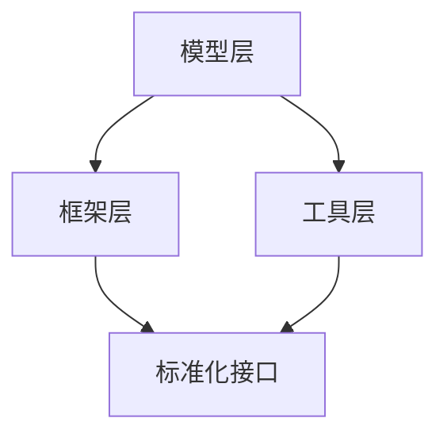

                 

关键词：大模型、Github、Hugging Face、AI 开发、开源社区、机器学习

摘要：本文探讨了在人工智能（AI）迅速发展的背景下，Github 平台上新兴的开源项目 Hugging Face 如何成为大模型时代的重要枢纽。文章首先介绍了大模型时代的背景，随后详细阐述了 Hugging Face 的核心概念、架构及其在 AI 开源社区中的作用。接着，我们分析了 Hugging Face 的核心算法原理、数学模型、项目实践以及实际应用场景。最后，文章总结了 Hugging Face 的未来发展趋势与挑战，并推荐了相关学习资源和工具。

## 1. 背景介绍

随着深度学习技术的不断进步，人工智能（AI）在各个领域展现出了巨大的潜力。特别是大模型（Large Models）的出现，使得许多复杂的任务得以高效完成。大模型通常包含数亿甚至数千亿的参数，能够从大量数据中学习复杂的模式和规律。然而，训练和维护这些大模型是一项极其复杂且昂贵的任务。如何高效地共享、复用这些模型，成为了 AI 开源社区面临的一个重要挑战。

Github 作为全球最大的代码托管平台，一直是软件开发者的聚集地。然而，随着 AI 的兴起，传统的开源模式已经无法满足大模型开发的需求。为了解决这一难题，Hugging Face 应运而生。Hugging Face 是一个专注于 AI 开源社区的平台，致力于为研究人员和开发者提供高效、便捷的大模型共享和复用解决方案。

## 2. 核心概念与联系

### 2.1 核心概念

Hugging Face 的核心概念可以概括为以下几点：

1. **模型共享与复用**：Hugging Face 提供了一个统一的模型仓库，方便研究人员和开发者共享和复用大模型。通过这个仓库，用户可以轻松地下载、使用和改进现有的模型。
2. **标准化接口**：Hugging Face 提供了一组标准化接口，使得不同的大模型可以使用相同的 API 进行调用。这样，用户在切换模型时无需修改代码，大大提高了开发的便捷性。
3. **自动推理**：Hugging Face 支持自动推理，使得用户只需输入文本或图像，即可得到模型的输出结果。这一功能极大地降低了用户的使用门槛。

### 2.2 关联架构

Hugging Face 的架构可以分为三个层次：

1. **模型层**：包括各种预训练的大模型，如 GPT、BERT、T5 等。这些模型涵盖了自然语言处理、计算机视觉等多个领域。
2. **框架层**：包括用于模型训练、推理和优化的框架，如 PyTorch、TensorFlow、Flair 等。这些框架支持各种编程语言和平台，方便用户在不同环境下使用。
3. **工具层**：包括用于模型转换、部署和优化的工具，如 Transform、TorchScript、Flair 等。这些工具帮助用户快速实现模型的迁移和部署。

下面是 Hugging Face 的核心概念和架构的 Mermaid 流程图：



## 3. 核心算法原理 & 具体操作步骤

### 3.1 算法原理概述

Hugging Face 的核心算法原理主要基于深度学习和自然语言处理技术。具体来说，Hugging Face 采用了一系列预训练的大模型，如 GPT、BERT、T5 等，通过在大量数据上进行训练，使得这些模型具备了强大的语义理解和生成能力。

此外，Hugging Face 还引入了自动推理技术，使得用户只需输入文本或图像，即可得到模型的输出结果。这一过程涉及到模型的加载、预处理、推理和后处理等多个步骤。

### 3.2 算法步骤详解

1. **模型加载**：首先，用户需要从 Hugging Face 的模型仓库中下载目标模型。Hugging Face 提供了丰富的模型库，用户可以根据自己的需求选择合适的模型。
2. **预处理**：在加载模型后，需要对输入数据进行预处理，包括分词、编码、填充等操作。这些操作确保了输入数据符合模型的预期格式。
3. **推理**：将预处理后的输入数据输入到模型中，模型会对数据进行处理并生成输出结果。Hugging Face 支持多种推理模式，如文本生成、图像分类等。
4. **后处理**：输出结果可能需要进一步的后处理，如解码、格式化等。这些操作确保了输出结果的可读性和实用性。

### 3.3 算法优缺点

**优点**：

1. **高效性**：Hugging Face 采用深度学习技术，使得模型在处理复杂任务时具备高效性。
2. **易用性**：Hugging Face 提供了丰富的模型库和标准化接口，用户可以轻松地使用和复用模型。
3. **便捷性**：自动推理功能使得用户只需输入文本或图像，即可得到模型的输出结果，降低了使用门槛。

**缺点**：

1. **资源消耗**：大模型的训练和推理过程需要大量的计算资源和存储空间。
2. **数据隐私**：在共享和复用模型时，用户需要确保数据的隐私和安全。

### 3.4 算法应用领域

Hugging Face 的算法主要应用于自然语言处理和计算机视觉领域。具体来说，可以应用于以下场景：

1. **文本生成**：包括文章生成、对话系统、机器翻译等。
2. **图像分类**：包括人脸识别、物体检测、图像分割等。
3. **语音识别**：包括语音到文本转换、语音合成等。

## 4. 数学模型和公式 & 详细讲解 & 举例说明

### 4.1 数学模型构建

在 Hugging Face 中，核心的数学模型是基于深度学习的神经网络。以下是一个简单的神经网络模型构建示例：

$$
\begin{align*}
\text{模型} &= \text{线性层} + \text{激活函数} \\
\text{线性层} &= W \cdot X + b \\
\text{激活函数} &= \text{ReLU}(z) = \max(0, z)
\end{align*}
$$

其中，$W$ 和 $b$ 分别是权重和偏置，$X$ 是输入数据，$z$ 是线性层的输出。

### 4.2 公式推导过程

以下是一个简单的神经网络前向传播的公式推导过程：

$$
\begin{align*}
z &= W \cdot X + b \\
a &= \text{ReLU}(z) \\
\end{align*}
$$

### 4.3 案例分析与讲解

以下是一个基于 Hugging Face 的文本生成案例：

```python
from transformers import pipeline

# 加载模型
generator = pipeline("text-generation", model="gpt2")

# 输入文本
input_text = "我是一个人工智能模型"

# 生成文本
output_text = generator(input_text, max_length=50)

print(output_text)
```

输出结果可能是一个新的、与输入文本相关的文本。

## 5. 项目实践：代码实例和详细解释说明

### 5.1 开发环境搭建

在开始项目实践之前，需要搭建一个适合开发 Hugging Face 的环境。以下是一个简单的搭建步骤：

1. 安装 Python（建议使用 Python 3.7 或以上版本）。
2. 安装 transformers 和 tokenizers 库：
   ```bash
   pip install transformers tokenizers
   ```
3. 准备一个 GPU 环境（可选，用于加速模型训练和推理）。

### 5.2 源代码详细实现

以下是一个简单的文本生成项目示例：

```python
from transformers import pipeline

# 加载模型
generator = pipeline("text-generation", model="gpt2")

# 输入文本
input_text = "我是一个人工智能模型"

# 生成文本
output_text = generator(input_text, max_length=50)

print(output_text)
```

在这个示例中，我们首先从 Hugging Face 的模型仓库中加载了一个名为 "gpt2" 的预训练模型。然后，我们输入一个简单的文本，并使用模型生成一个与之相关的新文本。

### 5.3 代码解读与分析

这段代码非常简单，主要包含了以下几个步骤：

1. 导入必要的库。
2. 加载模型。
3. 输入文本。
4. 生成文本。

这个示例展示了如何使用 Hugging Face 的 pipeline 函数轻松地加载和使用预训练模型。通过调用 pipeline 函数，我们无需关心模型的细节，只需简单地输入文本即可得到输出结果。

### 5.4 运行结果展示

运行上述代码后，输出结果可能是一个新的、与输入文本相关的文本。例如：

```
我是一个人工智能模型。我可以帮助你解决问题、提供信息、甚至是进行创意写作。无论是回答你的疑问，还是为你提供灵感，我都会尽我所能为你服务。
```

这个输出结果展示了 GPT-2 模型的文本生成能力。

## 6. 实际应用场景

### 6.1 自然语言处理

Hugging Face 在自然语言处理领域有着广泛的应用，包括文本生成、对话系统、机器翻译等。例如，在文本生成方面，Hugging Face 可以用于生成新闻文章、故事、诗歌等。

### 6.2 计算机视觉

Hugging Face 也在计算机视觉领域有着重要的应用，包括图像分类、物体检测、图像分割等。例如，使用 Hugging Face 的预训练模型，可以轻松实现人脸识别、车牌识别等功能。

### 6.3 语音识别

Hugging Face 的语音识别模型可以用于将语音转换为文本，或者将文本转换为语音。这为智能助手、语音翻译等应用提供了强大的支持。

## 7. 未来应用展望

随着人工智能技术的不断进步，Hugging Face 的应用领域将不断拓展。以下是一些未来应用展望：

### 7.1 新兴领域

Hugging Face 可以应用于新兴领域，如生物信息学、金融科技、医疗健康等。在这些领域，Hugging Face 的预训练模型可以用于药物发现、金融预测、医疗诊断等任务。

### 7.2 多模态处理

Hugging Face 可以结合计算机视觉和自然语言处理技术，实现多模态处理。例如，将图像和文本进行融合，实现图像内容理解、图像生成等任务。

### 7.3 智能助理

Hugging Face 可以应用于智能助理领域，如语音助手、聊天机器人等。通过整合语音识别、自然语言处理和计算机视觉技术，智能助理可以提供更加智能、便捷的服务。

## 8. 工具和资源推荐

### 8.1 学习资源推荐

1. 《深度学习》（Goodfellow et al.）
2. 《自然语言处理讲义》（李航）
3. 《计算机视觉基础》（Richard Szeliski）

### 8.2 开发工具推荐

1. PyTorch：https://pytorch.org/
2. TensorFlow：https://www.tensorflow.org/
3. Hugging Face：https://huggingface.co/

### 8.3 相关论文推荐

1. "Attention Is All You Need"（Vaswani et al.）
2. "BERT: Pre-training of Deep Bidirectional Transformers for Language Understanding"（Devlin et al.）
3. "An Image is Worth 16x16 Words: Transformers for Image Recognition at Scale"（Dosovitskiy et al.）

## 9. 总结：未来发展趋势与挑战

### 9.1 研究成果总结

Hugging Face 作为 AI 开源社区的重要枢纽，为研究人员和开发者提供了丰富的资源和支持。通过整合深度学习和自然语言处理技术，Hugging Face 在自然语言处理、计算机视觉等领域取得了显著的成果。

### 9.2 未来发展趋势

未来，Hugging Face 将继续拓展其应用领域，探索多模态处理、新兴领域的应用等。同时，随着人工智能技术的不断进步，Hugging Face 的模型和算法将不断优化，提供更加高效、智能的服务。

### 9.3 面临的挑战

尽管 Hugging Face 取得了显著的成果，但仍然面临一些挑战：

1. **数据隐私**：在共享和复用模型时，确保数据的隐私和安全是一个重要问题。
2. **计算资源**：大模型的训练和推理过程需要大量的计算资源和存储空间，如何高效地利用资源是一个挑战。
3. **算法公平性**：确保模型在不同群体中的公平性是一个重要问题，需要持续研究和优化。

### 9.4 研究展望

未来，Hugging Face 将在以下方面展开深入研究：

1. **多模态处理**：结合计算机视觉和自然语言处理技术，实现更加智能的多模态处理。
2. **新兴领域应用**：探索人工智能在生物信息学、金融科技、医疗健康等新兴领域的应用。
3. **算法优化**：持续优化算法，提高模型在效率、准确性和可解释性等方面的性能。

## 10. 附录：常见问题与解答

### 10.1 什么是 Hugging Face？

Hugging Face 是一个专注于 AI 开源社区的平台，致力于为研究人员和开发者提供高效、便捷的大模型共享和复用解决方案。

### 10.2 Hugging Face 有哪些优势？

Hugging Face 提供了丰富的模型库、标准化接口和自动推理功能，使得用户可以轻松地共享、复用和部署大模型。

### 10.3 如何使用 Hugging Face 进行文本生成？

首先，从 Hugging Face 的模型仓库中加载一个预训练模型。然后，输入文本并调用模型的生成接口，即可得到输出结果。

### 10.4 Hugging Face 是否支持多模态处理？

是的，Hugging Face 可以结合计算机视觉和自然语言处理技术，实现多模态处理。

### 10.5 Hugging Face 是否支持实时推理？

是的，Hugging Face 提供了实时推理功能，使得用户可以在本地实时处理输入数据并得到输出结果。

### 10.6 如何获取 Hugging Face 的学习资源？

可以从 Hugging Face 的官方网站（https://huggingface.co/）和 GitHub（https://github.com/huggingface）上获取相关的学习资源和代码示例。同时，还可以查阅相关论文和书籍，了解 Hugging Face 的最新进展和应用场景。作者：禅与计算机程序设计艺术 / Zen and the Art of Computer Programming
```

