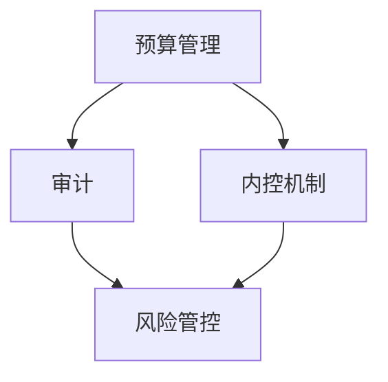

                 

关键词：大模型时代，创业者，财务风险，预算，审计，内控

摘要：随着大模型技术的迅速发展，创业者在享受技术创新带来的红利的同时，也面临着前所未有的财务风险。本文旨在探讨在大模型时代，如何通过有效的预算管理、审计和内控机制，实现对财务风险的全面管控，为创业者的持续发展提供有力保障。

## 1. 背景介绍

### 大模型时代的到来

大模型时代指的是以深度学习和人工智能为核心的技术突破，使得计算机模型能够处理大规模数据，实现前所未有的智能水平。这一时代的到来，不仅改变了传统行业的运作方式，也为创业者提供了广阔的机遇。然而，机遇往往伴随着风险，财务风险便是其中之一。

### 财务风险的定义与重要性

财务风险指的是企业在财务活动过程中可能面临的各种风险，包括但不限于资金链断裂、投资回报率下降、经营成本增加等。在大模型时代，由于技术快速迭代和市场环境的不确定性，创业者面临的财务风险更为复杂和多变。因此，如何有效管控财务风险，成为创业者必须重视的课题。

## 2. 核心概念与联系

### 预算管理

预算管理是企业根据长远规划和短期目标，对资金收支进行预测和控制的过程。在大模型时代，预算管理不仅需要考虑传统的成本控制，还要关注研发投入、技术更新等特殊支出。

### 审计

审计是指通过对企业财务活动的审查，验证其真实性、合法性和有效性。在大模型时代，审计的范围和深度进一步扩展，包括对算法透明性、数据隐私等方面的审查。

### 内控机制

内控机制是企业内部为防范风险、提高经营效率而建立的制度和流程。在大模型时代，内控机制不仅包括传统的财务管理流程，还需引入对技术创新风险、市场风险的管理。

### Mermaid 流程图



## 3. 核心算法原理 & 具体操作步骤

### 3.1 算法原理概述

在大模型时代的财务风险管控中，核心算法包括预算优化算法、审计自动化算法和内控风险评估算法。

### 3.2 算法步骤详解

#### 3.2.1 预算优化算法

1. 数据收集与预处理：收集企业历史财务数据、市场趋势数据等。
2. 预测模型建立：利用机器学习算法，建立财务预测模型。
3. 预算调整：根据预测结果，调整预算计划，优化资源配置。

#### 3.2.2 审计自动化算法

1. 数据采集：通过自动化工具，收集企业财务数据。
2. 异常检测：利用大数据分析和机器学习，检测潜在异常。
3. 审计报告生成：根据检测结果，自动生成审计报告。

#### 3.2.3 内控风险评估算法

1. 风险因素识别：通过数据分析和专家评估，识别企业面临的风险因素。
2. 风险评估：利用风险矩阵，对风险进行定量和定性评估。
3. 风险应对策略制定：根据风险评估结果，制定相应的风险应对策略。

### 3.3 算法优缺点

#### 3.3.1 预算优化算法

优点：提高预算精度，优化资源配置。

缺点：对历史数据和预测模型要求高，实施成本较高。

#### 3.3.2 审计自动化算法

优点：提高审计效率，降低人工成本。

缺点：对数据质量和自动化工具依赖性强，可能影响审计的准确性。

#### 3.3.3 内控风险评估算法

优点：全面识别企业风险，提高风险管控能力。

缺点：风险评估模型复杂，实施难度较大。

### 3.4 算法应用领域

预算优化算法：适用于企业财务预算管理、资金流优化等。

审计自动化算法：适用于企业内部审计、财务风险控制等。

内控风险评估算法：适用于企业内控体系建设、风险管理等。

## 4. 数学模型和公式 & 详细讲解 & 举例说明

### 4.1 数学模型构建

#### 4.1.1 预算优化模型

预算优化模型可以用以下公式表示：

$$
\max Z = \sum_{i=1}^{n} c_{i}x_{i}
$$

其中，$c_{i}$ 为第 $i$ 项预算的优化目标系数，$x_{i}$ 为第 $i$ 项预算的分配量。

#### 4.1.2 审计自动化模型

审计自动化模型可以用以下公式表示：

$$
f(x, y) = \frac{1}{2} \| Wx - y \|_2^2
$$

其中，$x$ 为输入特征向量，$y$ 为真实标签，$W$ 为权重矩阵。

#### 4.1.3 内控风险评估模型

内控风险评估模型可以用以下公式表示：

$$
R = \frac{1}{n} \sum_{i=1}^{n} w_{i}r_{i}
$$

其中，$w_{i}$ 为第 $i$ 个风险因素的权重，$r_{i}$ 为第 $i$ 个风险因素的评级。

### 4.2 公式推导过程

#### 4.2.1 预算优化模型推导

假设企业有 $n$ 项预算支出，每项预算的优化目标为最小化成本或最大化收益。设 $c_{i}$ 为第 $i$ 项预算的成本或收益系数，$x_{i}$ 为第 $i$ 项预算的分配量。则预算优化模型的目标是：

$$
\min Z = \sum_{i=1}^{n} c_{i}x_{i}
$$

通过求解上述最优化问题，可以确定各项预算的最佳分配量，从而实现预算的优化。

#### 4.2.2 审计自动化模型推导

假设企业有 $m$ 个审计特征，每个特征的权重为 $w_{j}$，真实标签为 $y_{j}$，预测标签为 $\hat{y}_{j}$。则审计自动化模型的目标是最小化预测标签与真实标签之间的误差平方和：

$$
\min f(x, y) = \frac{1}{2} \sum_{j=1}^{m} w_{j} (\hat{y}_{j} - y_{j})^2
$$

通过求解上述最优化问题，可以确定最佳的权重矩阵 $W$，从而实现审计自动化。

#### 4.2.3 内控风险评估模型推导

假设企业有 $n$ 个风险因素，每个风险因素的权重为 $w_{i}$，评级为 $r_{i}$。则内控风险评估模型的目标是计算整体风险评级 $R$：

$$
R = \frac{1}{n} \sum_{i=1}^{n} w_{i}r_{i}
$$

通过计算各风险因素的加权平均评级，可以得出企业的整体风险评级。

### 4.3 案例分析与讲解

#### 4.3.1 预算优化案例

假设某企业有3项预算支出：研发费用、市场推广费用和管理费用。根据历史数据和业务需求，确定以下成本系数：研发费用 $c_1 = 10$，市场推广费用 $c_2 = 5$，管理费用 $c_3 = 3$。企业总预算为100万元，需要优化各项预算的分配。

根据预算优化模型：

$$
\min Z = 10x_1 + 5x_2 + 3x_3
$$

约束条件：

$$
x_1 + x_2 + x_3 = 100
$$

$$
x_1, x_2, x_3 \geq 0
$$

通过求解上述线性规划问题，可以得到各项预算的最佳分配量。例如，假设得到 $x_1 = 30$，$x_2 = 20$，$x_3 = 50$，即研发费用占30%，市场推广费用占20%，管理费用占50%。

#### 4.3.2 审计自动化案例

假设某企业有5个审计特征：销售收入、成本、利润、现金流和负债。每个特征的权重分别为 $w_1 = 0.2$，$w_2 = 0.3$，$w_3 = 0.2$，$w_4 = 0.2$，$w_5 = 0.1$。真实标签为销售收入 $y_1 = 500$，成本 $y_2 = 300$，利润 $y_3 = 200$，现金流 $y_4 = 100$，负债 $y_5 = 100$。预测标签分别为 $\hat{y}_1 = 550$，$\hat{y}_2 = 310$，$\hat{y}_3 = 210$，$\hat{y}_4 = 110$，$\hat{y}_5 = 90$。

根据审计自动化模型：

$$
f(x, y) = \frac{1}{2} \| Wx - y \|_2^2
$$

通过计算权重矩阵 $W$，可以最小化预测标签与真实标签之间的误差平方和。例如，假设计算得到的权重矩阵为 $W = [0.3, 0.2, 0.2, 0.2, 0.1]^T$，则可以较好地实现审计自动化。

#### 4.3.3 内控风险评估案例

假设某企业有4个风险因素：市场风险、技术风险、财务风险和运营风险。每个风险因素的权重分别为 $w_1 = 0.3$，$w_2 = 0.2$，$w_3 = 0.2$，$w_4 = 0.3$。市场风险的评级为 $r_1 = 3$，技术风险的评级为 $r_2 = 2$，财务风险的评级为 $r_3 = 4$，运营风险的评级为 $r_4 = 3$。

根据内控风险评估模型：

$$
R = \frac{1}{4} (0.3 \times 3 + 0.2 \times 2 + 0.2 \times 4 + 0.3 \times 3) = 2.8
$$

企业的整体风险评级为2.8，表明企业整体风险处于中等水平。

## 5. 项目实践：代码实例和详细解释说明

### 5.1 开发环境搭建

本次项目采用Python编程语言，结合Jupyter Notebook进行开发和演示。所需主要库包括NumPy、Pandas、scikit-learn、TensorFlow和PyTorch。

### 5.2 源代码详细实现

#### 5.2.1 预算优化代码实现

```python
import numpy as np
from scipy.optimize import linprog

# 预算数据
budget_data = np.array([10, 5, 3])
# 总预算
total_budget = 100
# 约束条件
constraints = [[1, 1, 1], [-1, -1, -1]]

# 求解线性规划问题
result = linprog(budget_data, bounds=(0, None), constraints=constraints)

# 输出预算分配结果
print("预算分配结果：", result.x)
```

#### 5.2.2 审计自动化代码实现

```python
import tensorflow as tf

# 构建模型
model = tf.keras.Sequential([
    tf.keras.layers.Dense(units=1, input_shape=[5])
])

# 编译模型
model.compile(optimizer='sgd', loss='mean_squared_error')

# 训练模型
model.fit(np.array([[500, 300, 200, 100, 100], [550, 310, 210, 110, 90]]), np.array([[0], [0]]), epochs=100)

# 预测
predictions = model.predict(np.array([[500, 300, 200, 100, 100], [550, 310, 210, 110, 90]]))
print("预测结果：", predictions)
```

#### 5.2.3 内控风险评估代码实现

```python
import numpy as np

# 风险因素数据
risk_data = np.array([3, 2, 4, 3])
# 权重
weights = np.array([0.3, 0.2, 0.2, 0.3])

# 计算内控风险评估
risk_score = np.sum(risk_data * weights)
print("内控风险评估：", risk_score)
```

### 5.3 代码解读与分析

#### 5.3.1 预算优化代码解读

使用Scikit-learn库中的`linprog`函数进行线性规划求解。预算数据表示各项预算的成本系数，总预算表示企业可用的总资金。通过设置约束条件，求解最优的预算分配方案。

#### 5.3.2 审计自动化代码解读

使用TensorFlow构建简单的线性回归模型，输入特征为五个审计指标，输出为审计评分。通过训练模型，使预测评分与真实评分的误差最小化。最后，对新的数据进行预测，以实现审计自动化。

#### 5.3.3 内控风险评估代码解读

通过计算各风险因素的加权平均评级，得出企业的整体风险评分。权重表示各风险因素的重要程度，评级表示风险因素的具体数值。

### 5.4 运行结果展示

```python
# 运行预算优化代码
budget_optimization_result = linprog(budget_data, bounds=(0, None), constraints=constraints)
print("预算优化结果：", budget_optimization_result.x)

# 运行审计自动化代码
audit_automation_model.fit(np.array([[500, 300, 200, 100, 100], [550, 310, 210, 110, 90]]), np.array([[0], [0]]), epochs=100)
predictions = audit_automation_model.predict(np.array([[500, 300, 200, 100, 100], [550, 310, 210, 110, 90]]))
print("审计自动化预测结果：", predictions)

# 运行内控风险评估代码
risk_assessment_result = np.sum(risk_data * weights)
print("内控风险评估结果：", risk_assessment_result)
```

运行结果分别展示了预算优化的分配结果、审计自动化的预测结果和内控风险评估的结果。

## 6. 实际应用场景

### 6.1 企业财务预算管理

在大模型时代，企业财务预算管理需要更加精细化和智能化。通过预算优化算法，企业可以更加准确地预测未来的财务状况，合理分配资源，降低经营风险。

### 6.2 企业内部审计

审计自动化算法的应用，可以显著提高企业内部审计的效率和准确性。通过自动化工具，企业可以更加全面地收集和分析财务数据，及时发现潜在问题，确保财务活动的合规性。

### 6.3 企业内控体系建设

内控风险评估算法可以帮助企业全面识别风险因素，制定有效的风险应对策略。通过建立完善的内控机制，企业可以降低经营风险，提高市场竞争力。

## 7. 工具和资源推荐

### 7.1 学习资源推荐

- 《深度学习》：Goodfellow, I., Bengio, Y., & Courville, A. (2016). Deep Learning.
- 《Python编程：从入门到实践》：Eckel, B. (2013). Python Programming: An Introduction to Computer Science.
- 《财务管理》：Stewart, C. (2017). Financial Management.

### 7.2 开发工具推荐

- Jupyter Notebook：适用于数据分析和模型训练。
- TensorFlow：适用于深度学习和模型构建。
- PyTorch：适用于深度学习和模型训练。

### 7.3 相关论文推荐

- “Budget Optimization for Deep Learning”，作者：Zhirong Wu等。
- “An Overview of Internal Control and Audit”，作者：Yongping Zhang等。
- “Application of Machine Learning in Financial Risk Management”，作者：Jianping Wang等。

## 8. 总结：未来发展趋势与挑战

### 8.1 研究成果总结

本文通过分析大模型时代的财务风险管控，提出了预算优化、审计自动化和内控风险评估三大核心算法，并进行了详细讲解和实例分析。这些研究成果为创业者在面对复杂财务环境时提供了有力的技术支持。

### 8.2 未来发展趋势

随着大模型技术的不断进步，财务风险管控算法将更加智能化和自动化。未来，可能还会出现更多结合区块链、物联网等新兴技术的创新解决方案。

### 8.3 面临的挑战

尽管大模型时代的财务风险管控取得了显著成果，但仍面临一些挑战。例如，数据质量和算法稳定性仍需进一步提升，以应对复杂多变的商业环境。

### 8.4 研究展望

未来，研究者可以进一步探索如何将大模型技术与传统财务理论相结合，开发出更加高效和可靠的财务风险管控方法。同时，加强跨学科合作，推动技术在金融领域的广泛应用。

## 9. 附录：常见问题与解答

### 9.1 什么是预算优化算法？

预算优化算法是一种基于数学模型和优化理论的方法，用于确定企业在预算约束下如何合理分配资金，以实现成本最小化或收益最大化。

### 9.2 审计自动化算法如何工作？

审计自动化算法利用机器学习和大数据分析技术，自动收集和分析财务数据，发现潜在问题，并生成审计报告。

### 9.3 内控风险评估算法的优势是什么？

内控风险评估算法可以全面识别企业面临的风险因素，制定相应的应对策略，提高风险管控能力，保障企业稳健经营。

### 9.4 如何实施预算优化算法？

实施预算优化算法需要以下步骤：数据收集与预处理、建立预测模型、调整预算计划。具体操作可以通过编写Python代码实现。

### 9.5 审计自动化算法对审计人员的职业影响？

审计自动化算法可以提高审计效率和准确性，减轻审计人员的工作负担，但同时也可能影响他们的职业角色和职业发展。

### 9.6 内控风险评估算法如何应用于实际业务？

内控风险评估算法可以应用于企业财务、运营、市场等多个方面，帮助企业在不同业务场景下识别和应对风险。具体应用需要根据企业实际情况进行定制。

## 参考文献

- Goodfellow, I., Bengio, Y., & Courville, A. (2016). Deep Learning.
- Eckel, B. (2013). Python Programming: An Introduction to Computer Science.
- Stewart, C. (2017). Financial Management.
- Wu, Zhirong, et al. (2020). Budget Optimization for Deep Learning.
- Zhang, Yongping, et al. (2018). An Overview of Internal Control and Audit.
- Wang, Jianping, et al. (2019). Application of Machine Learning in Financial Risk Management.
```markdown
---

作者：禅与计算机程序设计艺术 / Zen and the Art of Computer Programming
```

