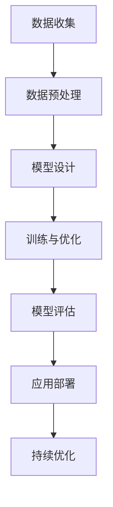

                 

关键词：人工智能、大模型、创业设计、产品设计、深度学习、算法原理

> 摘要：随着人工智能技术的快速发展，大模型成为了当前AI领域的热点。本文将深入探讨大模型的原理、设计方法和实际应用，为创业者在AI领域的产品设计提供实用的指南。

## 1. 背景介绍

人工智能（AI）作为计算机科学的一个分支，旨在使计算机能够执行通常需要人类智能的任务。从早期的规则系统到近年来的深度学习，AI技术已经取得了显著的进步。特别是在2010年代中期，随着计算能力的提升和海量数据集的可用，深度学习开始崭露头角，并迅速成为AI研究的主流方向。

大模型，是指那些具有数十亿甚至千亿参数的神经网络模型。这些模型在图像识别、自然语言处理、语音识别等领域表现出了惊人的能力。例如，OpenAI的GPT-3拥有1750亿个参数，能够生成高质量的自然语言文本；Google的BERT模型则包含了亿级别的参数，显著提升了文本分类和情感分析的准确性。

### 大模型的发展历程

大模型的发展历程可以分为以下几个阶段：

1. **早期神经网络**：20世纪80年代，反向传播算法的发明和推广，使得神经网络得以重新兴起。
2. **小模型时代**：1990年代至2010年代，研究人员开始尝试使用深度神经网络处理更复杂的任务，如语音识别和图像分类。
3. **大模型崛起**：随着数据量的激增和计算能力的提升，研究人员开始尝试训练更大规模的神经网络，从而在2010年代中期迎来了大模型的时代。

### 大模型的重要性

大模型的重要性主要体现在以下几个方面：

1. **性能提升**：大模型由于其庞大的参数量，可以更好地捕捉数据的复杂模式，从而在许多任务上实现性能的提升。
2. **通用性增强**：大模型能够处理多种不同类型的数据和任务，具有一定的通用性。
3. **创新驱动**：大模型的突破性进展为AI领域带来了新的研究方向和应用场景。

## 2. 核心概念与联系

大模型的成功离不开以下几个核心概念和技术的支撑：

### 2.1. 深度学习

深度学习是一种基于多层神经网络的学习方法，能够通过层层抽象的方式，从原始数据中提取有用的信息。深度学习的核心在于其多层结构，每一层都能够对数据进行加工和转化，使得模型能够逐渐从原始数据中提取高层次的特征。

### 2.2. 神经网络架构

神经网络架构是指神经网络的组成结构，包括网络层数、每层神经元数量、激活函数等。不同架构的设计会影响模型的性能和计算效率。例如，卷积神经网络（CNN）擅长处理图像数据，而循环神经网络（RNN）则适合处理序列数据。

### 2.3. 训练与优化

大模型的训练是一个极其复杂和耗时的过程。训练过程中，需要不断调整模型参数，以最小化预测误差。常用的优化算法包括随机梯度下降（SGD）、Adam等。此外，数据增强、正则化等技术也被广泛应用于大模型的训练，以防止过拟合。

### 2.4. 数据集与标注

大模型的成功离不开大量的数据集和高质量的标注。数据集的质量直接影响模型的性能。此外，标注过程也是一个重要且耗时的环节，高质量的数据标注对于模型训练至关重要。

### 2.5. Mermaid 流程图

以下是一个简化的Mermaid流程图，展示了大模型设计的基本步骤：



## 3. 核心算法原理 & 具体操作步骤

### 3.1 算法原理概述

大模型的核心算法是基于深度学习技术的。深度学习的基本原理是通过多层神经网络来模拟人脑的感知和学习过程。每一层神经网络都对输入数据进行加工和转换，从而提取出更有用的特征。

### 3.2 算法步骤详解

1. **数据收集**：首先需要收集大量的数据，这些数据可以是文本、图像、声音等不同类型的数据。
2. **数据预处理**：对收集到的数据进行清洗、标准化等预处理，以消除噪声和异常值。
3. **模型设计**：根据任务需求设计神经网络结构，包括网络层数、每层神经元数量、激活函数等。
4. **训练与优化**：使用训练数据对模型进行训练，通过调整模型参数，最小化预测误差。
5. **模型评估**：使用验证数据对模型进行评估，确保模型具有良好的性能。
6. **应用部署**：将训练好的模型部署到实际应用场景中，如图像识别、自然语言处理等。

### 3.3 算法优缺点

**优点**：

1. **强大的学习能力**：大模型可以处理复杂的数据和任务，具有强大的学习能力。
2. **广泛的适用性**：大模型可以应用于多种不同的领域和任务。
3. **高效率**：通过并行计算和分布式训练，大模型可以显著提高训练和推理的效率。

**缺点**：

1. **计算资源消耗大**：大模型需要大量的计算资源和存储空间。
2. **对数据要求高**：大模型对数据的质量和数量有较高的要求，否则容易出现过拟合。
3. **解释性差**：大模型的内部机制复杂，难以解释和理解。

### 3.4 算法应用领域

大模型在图像识别、自然语言处理、语音识别等领域取得了显著的成果。例如，在图像识别方面，大模型如ResNet和Inception在ImageNet竞赛中取得了优异的成绩；在自然语言处理方面，GPT-3和BERT等大模型显著提升了文本生成和文本分类的准确性。

## 4. 数学模型和公式 & 详细讲解 & 举例说明

### 4.1 数学模型构建

大模型通常基于多层感知机（MLP）或卷积神经网络（CNN）等结构。以下是一个简化的多层感知机模型：

$$
\begin{align*}
\text{输出} &= \sigma(\text{权重} \cdot \text{输入} + \text{偏置}) \\
\text{激活函数} &= \sigma(z) \\
z &= \text{权重} \cdot \text{输入} + \text{偏置}
\end{align*}
$$

其中，$\sigma$表示激活函数，常用的有Sigmoid、ReLU等。

### 4.2 公式推导过程

以ReLU激活函数为例，推导过程如下：

$$
\begin{align*}
\text{输出} &= \max(0, z) \\
z &= \text{权重} \cdot \text{输入} + \text{偏置}
\end{align*}
$$

当$z > 0$时，输出等于$z$；当$z \leq 0$时，输出等于0。这使得ReLU函数在$z > 0$时具有线性特性，从而提高了神经网络的训练效率。

### 4.3 案例分析与讲解

以下是一个使用ReLU激活函数的多层感知机模型的实例：

$$
\begin{align*}
\text{第一层输出} &= \max(0, (\text{权重}_1 \cdot \text{输入} + \text{偏置}_1)) \\
\text{第二层输出} &= \max(0, (\text{权重}_2 \cdot \text{第一层输出} + \text{偏置}_2)) \\
\text{最终输出} &= \max(0, (\text{权重}_3 \cdot \text{第二层输出} + \text{偏置}_3))
\end{align*}
$$

在这个例子中，输入是一个二维向量，通过两个隐藏层后得到最终输出。ReLU函数的使用使得模型能够更好地处理非线性问题。

## 5. 项目实践：代码实例和详细解释说明

### 5.1 开发环境搭建

为了更好地理解大模型的设计和应用，我们将在Python环境中使用TensorFlow框架来实现一个简单的大模型。

```python
import tensorflow as tf
```

### 5.2 源代码详细实现

以下是一个简单的多层感知机模型的实现：

```python
def create_model():
    model = tf.keras.Sequential([
        tf.keras.layers.Dense(128, activation='relu', input_shape=(784,)),
        tf.keras.layers.Dense(10, activation='softmax')
    ])
    return model
```

在这个例子中，我们定义了一个有两个隐藏层的多层感知机模型。第一层有128个神经元，使用ReLU激活函数；第二层有10个神经元，使用softmax激活函数。

### 5.3 代码解读与分析

1. **模型创建**：使用`tf.keras.Sequential`创建一个序列模型，通过将多个层依次添加到模型中。
2. **第一层**：`tf.keras.layers.Dense(128, activation='relu', input_shape=(784,))`创建了一个有128个神经元的全连接层，输入形状为(784,)，使用ReLU激活函数。
3. **第二层**：`tf.keras.layers.Dense(10, activation='softmax')`创建了一个有10个神经元的全连接层，输出形状为(10,)，使用softmax激活函数。

### 5.4 运行结果展示

```python
model = create_model()
model.compile(optimizer='adam', loss='categorical_crossentropy', metrics=['accuracy'])
model.fit(x_train, y_train, epochs=10, batch_size=32)
```

在这个例子中，我们使用`model.fit`函数训练模型，通过调整`epochs`和`batch_size`等参数，可以控制训练过程。

## 6. 实际应用场景

### 6.1. 图像识别

大模型在图像识别领域有着广泛的应用，如人脸识别、图像分类等。例如，ResNet模型在ImageNet竞赛中取得了优异的成绩，大大提升了图像识别的准确性。

### 6.2. 自然语言处理

大模型在自然语言处理领域也有着显著的应用，如文本生成、机器翻译、情感分析等。例如，GPT-3模型可以生成高质量的自然语言文本，大大提升了文本生成的能力。

### 6.3. 语音识别

大模型在语音识别领域也有着广泛的应用，如语音识别、语音合成等。例如，Transformer模型在语音识别任务上取得了突破性的成果，显著提升了语音识别的准确性。

## 7. 工具和资源推荐

### 7.1. 学习资源推荐

1. 《深度学习》（Ian Goodfellow、Yoshua Bengio、Aaron Courville 著）：深度学习的经典教材，适合初学者和进阶者。
2. 《动手学深度学习》（Agricultural University of Jiangsu Province 著）：基于PyTorch框架的深度学习实践教程，适合初学者入门。

### 7.2. 开发工具推荐

1. TensorFlow：Google开发的深度学习框架，广泛应用于工业和学术领域。
2. PyTorch：Facebook开发的深度学习框架，具有良好的灵活性和易用性。

### 7.3. 相关论文推荐

1. "Very Deep Convolutional Networks for Large-Scale Image Recognition"（ResNet）
2. "Attention Is All You Need"（Transformer）
3. "Improved Methods for Training Large Deep Neural Networks"（Adam优化算法）

## 8. 总结：未来发展趋势与挑战

### 8.1. 研究成果总结

大模型在图像识别、自然语言处理、语音识别等领域取得了显著的成果，为AI领域的发展带来了新的机遇。深度学习算法的不断优化和大规模数据的可用性，使得大模型的研究和应用不断推进。

### 8.2. 未来发展趋势

1. **更高效的训练算法**：随着模型的规模越来越大，训练效率成为了一个重要的问题。未来将出现更高效的训练算法，如模型剪枝、量化等。
2. **更多领域应用**：大模型的应用将不仅仅局限于现有的领域，还会拓展到更多领域，如医疗、金融等。
3. **可解释性**：如何提高大模型的可解释性，使得模型的行为更加透明，是一个重要的研究方向。

### 8.3. 面临的挑战

1. **计算资源消耗**：大模型的训练和推理需要大量的计算资源和存储空间，如何高效地利用这些资源是一个挑战。
2. **数据质量和标注**：大模型对数据的质量和标注有较高的要求，如何获取高质量的数据集是一个挑战。
3. **伦理和安全问题**：大模型在应用过程中可能会面临伦理和安全问题，如何保证模型的公平性和透明性是一个重要的挑战。

### 8.4. 研究展望

未来，大模型的研究将朝着更高效、更智能、更安全、更可解释的方向发展。随着技术的进步和应用的拓展，大模型将在更多的领域发挥重要作用，推动人工智能技术的进一步发展。

## 9. 附录：常见问题与解答

### 9.1. 什么是大模型？

大模型是指那些具有数十亿甚至千亿参数的神经网络模型。这些模型在图像识别、自然语言处理、语音识别等领域表现出了惊人的能力。

### 9.2. 大模型的训练需要多少数据？

大模型的训练通常需要大量的数据。具体的数据量取决于任务的复杂性和模型的规模。一般来说，更多的数据有助于提高模型的性能。

### 9.3. 如何优化大模型的训练？

优化大模型的训练可以从以下几个方面入手：

1. **改进训练算法**：使用更高效的训练算法，如Adam优化算法。
2. **数据增强**：通过对数据进行增强，提高模型的泛化能力。
3. **正则化**：使用正则化技术，防止过拟合。
4. **分布式训练**：通过分布式训练，利用多个计算节点，提高训练效率。

### 9.4. 大模型在哪些领域有应用？

大模型在图像识别、自然语言处理、语音识别等领域有广泛的应用。例如，OpenAI的GPT-3在自然语言处理领域取得了突破性的成果，Google的BERT在文本分类和情感分析中表现优异。

## 作者署名

作者：禅与计算机程序设计艺术 / Zen and the Art of Computer Programming
```

