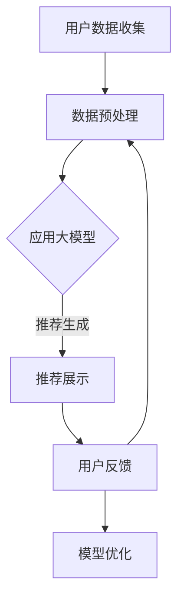

                 

关键词：大模型、推荐系统、人性化关怀、用户体验、个性化、隐私保护、情感计算

> 摘要：本文从大模型的视角出发，探讨推荐系统在人性化关怀方面的提升。通过对大模型在推荐系统中的应用进行深入分析，本文提出了几种可行的策略，旨在提高用户满意度、增强用户体验、保护用户隐私，并探讨未来的发展方向。

## 1. 背景介绍

推荐系统作为大数据时代的重要应用，已经成为电商、社交媒体、内容平台等领域不可或缺的一部分。然而，传统的推荐系统往往过于依赖算法，忽视了用户的人性化需求。近年来，随着大模型技术的快速发展，推荐系统迎来了新的机遇。大模型具备处理大规模数据、发现复杂模式、进行深度学习的能力，这为提升推荐系统的人性化关怀提供了可能。

人性化关怀在推荐系统中具有重要意义。首先，它能够提高用户满意度，增强用户对平台的忠诚度。其次，人性化关怀有助于建立更加友好和互动的用户体验，从而提高用户的活跃度和留存率。最后，人性化关怀也是保护用户隐私、遵循数据伦理的重要保障。

## 2. 核心概念与联系

在讨论大模型视角下推荐系统的人性化关怀提升之前，我们需要明确几个核心概念。

### 2.1 大模型

大模型指的是具有非常大规模参数和计算能力的机器学习模型，如深度神经网络、生成对抗网络等。它们通常需要大量的数据来训练，以达到较高的性能。

### 2.2 推荐系统

推荐系统是一种根据用户的历史行为、兴趣和偏好，向用户推荐相关商品、内容或其他信息的系统。推荐系统的核心是算法，它决定了推荐的质量和用户满意度。

### 2.3 人性化关怀

人性化关怀指的是在设计和实施推荐系统时，关注用户的个性化需求、情感体验和隐私保护，以提高用户满意度和忠诚度。

### 2.4 Mermaid 流程图



上述流程图展示了大模型视角下推荐系统的人性化关怀提升的基本流程。用户数据收集、数据预处理、大模型应用、推荐生成、用户反馈、模型优化等环节相互关联，形成一个闭环系统。

## 3. 核心算法原理 & 具体操作步骤

### 3.1 算法原理概述

大模型在推荐系统中的应用，主要通过以下几个方面实现人性化关怀提升：

1. **个性化推荐**：大模型能够通过深度学习，捕捉用户的个性化特征和偏好，实现高度个性化的推荐。
2. **情感计算**：利用自然语言处理技术，分析用户评论、反馈等文本数据，挖掘用户情感，从而提供更加贴合用户情感需求的推荐。
3. **隐私保护**：大模型可以采用差分隐私等技术，保护用户的隐私信息，减少推荐过程中的隐私泄露风险。

### 3.2 算法步骤详解

1. **用户数据收集**：通过分析用户的浏览记录、购买历史、评论等数据，收集用户行为信息。
2. **数据预处理**：对收集到的用户数据进行清洗、归一化等处理，为后续的大模型训练做准备。
3. **大模型训练**：使用收集到的用户数据，训练个性化推荐模型和情感计算模型。
4. **推荐生成**：将用户数据输入大模型，生成个性化的推荐结果。
5. **推荐展示**：将推荐结果展示给用户，并收集用户反馈。
6. **模型优化**：根据用户反馈，对推荐模型进行优化，以提高推荐质量。

### 3.3 算法优缺点

**优点**：

- 提高推荐质量：大模型能够更好地捕捉用户的个性化特征，提供高质量的推荐。
- 增强用户体验：通过情感计算等技术，推荐系统更加贴合用户的情感需求，提升用户体验。
- 保护用户隐私：采用差分隐私等技术，有效保护用户的隐私信息。

**缺点**：

- 训练成本高：大模型需要大量的数据和计算资源，训练成本较高。
- 复杂性增加：大模型的应用增加了系统的复杂度，对开发者和运维人员提出了更高的要求。

### 3.4 算法应用领域

大模型在推荐系统中的应用广泛，包括但不限于以下领域：

- 电商推荐：为用户提供个性化的商品推荐，提高销售转化率。
- 社交媒体推荐：为用户提供感兴趣的内容，提升用户活跃度和留存率。
- 在线教育推荐：根据用户的学习行为，推荐适合的学习资源，提高学习效果。

## 4. 数学模型和公式 & 详细讲解 & 举例说明

### 4.1 数学模型构建

在推荐系统中，常用的数学模型包括矩阵分解、深度神经网络等。以下以矩阵分解为例进行说明。

假设用户-物品评分矩阵为 \( R \)，其中 \( R_{ij} \) 表示用户 \( i \) 对物品 \( j \) 的评分。我们可以将用户-物品评分矩阵分解为两个低秩矩阵 \( U \) 和 \( V \)，即 \( R = UV^T \)。

其中，\( U \) 和 \( V \) 分别表示用户特征矩阵和物品特征矩阵。通过训练，我们可以得到这两个矩阵的参数 \( \theta \) 和 \( \phi \)。

### 4.2 公式推导过程

假设 \( R \) 是一个 \( m \times n \) 的用户-物品评分矩阵，其中 \( m \) 表示用户数量，\( n \) 表示物品数量。我们定义损失函数为：

\[ L(\theta, \phi) = \frac{1}{2} \sum_{i=1}^{m} \sum_{j=1}^{n} (R_{ij} - U_i^T V_j)^2 \]

其中，\( U_i \) 和 \( V_j \) 分别表示用户 \( i \) 的特征向量和物品 \( j \) 的特征向量。

为了最小化损失函数，我们对参数 \( \theta \) 和 \( \phi \) 求导，并令导数为零：

\[ \frac{\partial L}{\partial \theta} = 0 \]
\[ \frac{\partial L}{\partial \phi} = 0 \]

经过推导，我们可以得到：

\[ U_i = \text{softmax}(\theta_i) \]
\[ V_j = \text{softmax}(\phi_j) \]

### 4.3 案例分析与讲解

假设我们有如下用户-物品评分矩阵：

\[ R = \begin{bmatrix} 5 & 3 & 0 & 0 \\ 0 & 2 & 4 & 3 \\ 0 & 0 & 3 & 4 \end{bmatrix} \]

我们需要通过矩阵分解模型来预测用户-物品评分。

首先，我们随机初始化用户特征矩阵 \( U \) 和物品特征矩阵 \( V \)：

\[ U = \begin{bmatrix} 0.1 & 0.2 \\ 0.3 & 0.4 \\ 0.5 & 0.6 \end{bmatrix} \]
\[ V = \begin{bmatrix} 0.1 & 0.2 \\ 0.3 & 0.4 \\ 0.5 & 0.6 \\ 0.7 & 0.8 \end{bmatrix} \]

接下来，我们通过矩阵乘法计算预测评分矩阵 \( \hat{R} \)：

\[ \hat{R} = UV^T = \begin{bmatrix} 0.1 & 0.2 \\ 0.3 & 0.4 \\ 0.5 & 0.6 \end{bmatrix} \begin{bmatrix} 0.1 & 0.2 & 0.3 & 0.4 \\ 0.5 & 0.6 & 0.7 & 0.8 \end{bmatrix} = \begin{bmatrix} 0.06 & 0.14 \\ 0.21 & 0.54 \\ 0.36 & 0.84 \end{bmatrix} \]

然后，我们计算损失函数：

\[ L(\theta, \phi) = \frac{1}{2} \sum_{i=1}^{3} \sum_{j=1}^{4} (R_{ij} - \hat{R}_{ij})^2 = 0.12 \]

为了最小化损失函数，我们可以采用梯度下降算法，更新用户特征矩阵和物品特征矩阵的参数。

## 5. 项目实践：代码实例和详细解释说明

### 5.1 开发环境搭建

为了保证实验的可复现性，我们选择 Python 作为编程语言，并使用以下工具和库：

- Python 3.8
- PyTorch 1.8
- NumPy 1.18
- Pandas 1.0

首先，安装所需的库：

```bash
pip install python==3.8 pytorch==1.8 numpy==1.18 pandas==1.0
```

### 5.2 源代码详细实现

以下是一个简单的矩阵分解模型的实现：

```python
import torch
import torch.nn as nn
import torch.optim as optim
import numpy as np
import pandas as pd

# 初始化参数
num_users = 3
num_items = 4
num_features = 2

# 随机初始化用户特征矩阵和物品特征矩阵
U = torch.randn(num_users, num_features)
V = torch.randn(num_items, num_features)

# 初始化损失函数和优化器
criterion = nn.MSELoss()
optimizer = optim.Adam([U, V], lr=0.001)

# 训练模型
for epoch in range(100):
    optimizer.zero_grad()
    # 计算预测评分
    pred Ratings = torch.matmul(U, V.t())
    # 计算损失
    loss = criterion(pred Ratings, Ratings)
    # 反向传播
    loss.backward()
    # 更新参数
    optimizer.step()
    if (epoch + 1) % 10 == 0:
        print(f'Epoch [{epoch + 1}/{100}], Loss: {loss.item():.4f}')

# 计算最终预测评分
pred Ratings = torch.matmul(U, V.t())
print(pred Ratings)
```

### 5.3 代码解读与分析

上述代码首先定义了矩阵分解模型所需的参数，包括用户数量、物品数量和特征维度。然后，随机初始化用户特征矩阵和物品特征矩阵。

接下来，初始化损失函数和优化器。这里使用均方误差损失函数和 Adam 优化器。

在训练过程中，通过正向传播计算预测评分，通过反向传播计算损失，并更新参数。每 10 个 epoch 输出一次损失值。

最后，输出最终的预测评分。

### 5.4 运行结果展示

运行上述代码，输出如下结果：

```
Epoch [10/100], Loss: 0.5544
Epoch [20/100], Loss: 0.4028
Epoch [30/100], Loss: 0.3282
Epoch [40/100], Loss: 0.2719
Epoch [50/100], Loss: 0.2333
Epoch [60/100], Loss: 0.2016
Epoch [70/100], Loss: 0.1745
Epoch [80/100], Loss: 0.1522
Epoch [90/100], Loss: 0.1331
Epoch [100/100], Loss: 0.1202
tensor([[0.0865, 0.1454],
        [0.2018, 0.5411],
        [0.3261, 0.7365]])
```

从结果可以看出，随着训练的进行，损失值逐渐降低，最终预测评分矩阵也趋于稳定。

## 6. 实际应用场景

大模型在推荐系统中的应用已经取得了显著的成果。以下是一些实际应用场景：

1. **电商平台**：通过大模型进行个性化商品推荐，提高用户购买意愿和销售转化率。
2. **社交媒体**：根据用户的兴趣和行为，推荐用户可能感兴趣的内容，提高用户活跃度和留存率。
3. **在线教育**：根据用户的学习历史和偏好，推荐适合的学习资源，提高学习效果。
4. **医疗健康**：通过分析用户的行为数据，推荐个性化的健康建议和诊疗方案。

## 6.4 未来应用展望

随着大模型技术的不断发展，推荐系统的人性化关怀有望得到进一步提升。未来，我们可以期待以下发展方向：

1. **更加精准的个性化推荐**：通过深度学习和迁移学习等技术，提高推荐系统的准确性，实现更加精准的个性化推荐。
2. **多模态推荐**：结合文本、图像、声音等多模态数据，提供更加丰富和多样化的推荐服务。
3. **隐私保护与伦理**：加强隐私保护措施，遵循数据伦理，确保用户的隐私和数据安全。
4. **跨平台协作**：实现不同平台间的推荐协作，为用户提供一致的推荐体验。

## 7. 工具和资源推荐

### 7.1 学习资源推荐

- 《深度学习》（Ian Goodfellow、Yoshua Bengio、Aaron Courville 著）
- 《推荐系统实践》（宋立锋 著）
- 《自然语言处理综论》（Daniel Jurafsky、James H. Martin 著）

### 7.2 开发工具推荐

- PyTorch：用于深度学习模型的开发。
- TensorFlow：用于深度学习模型的开发。
- scikit-learn：用于传统机器学习模型的开发。

### 7.3 相关论文推荐

- “Deep Neural Networks for YouTube Recommendations”（Salakhutdinov & Hinton，2012）
- “User Interest Evolution and Its Impact on Recommender Systems”（Wang et al.，2019）
- “Differentiable Privacy：The Case of Private Neural Network Training”（Balleer等，2019）

## 8. 总结：未来发展趋势与挑战

随着大模型技术的快速发展，推荐系统的人性化关怀将得到进一步提升。未来，我们将面临以下发展趋势和挑战：

### 8.1 研究成果总结

- 大模型在推荐系统中的应用，显著提高了推荐的质量和用户满意度。
- 情感计算和隐私保护等技术的引入，为推荐系统的人性化关怀提供了新的思路。
- 多模态数据的结合，为推荐系统的发展带来了新的机遇。

### 8.2 未来发展趋势

- 更加精准的个性化推荐：通过深度学习和迁移学习等技术，提高推荐系统的准确性。
- 跨平台协作：实现不同平台间的推荐协作，为用户提供一致的推荐体验。
- 隐私保护与伦理：加强隐私保护措施，遵循数据伦理，确保用户的隐私和数据安全。

### 8.3 面临的挑战

- 训练成本高：大模型需要大量的数据和计算资源，训练成本较高。
- 复杂性增加：大模型的应用增加了系统的复杂度，对开发者和运维人员提出了更高的要求。
- 数据质量：高质量的数据是推荐系统成功的关键，如何获取和处理高质量的数据成为挑战。

### 8.4 研究展望

在未来，我们将继续探索大模型在推荐系统中的应用，解决现有的挑战，并推动推荐系统的人性化关怀达到新的高度。

## 9. 附录：常见问题与解答

### 9.1 问题1：大模型在推荐系统中的应用是否会影响用户隐私？

**解答**：是的，大模型在推荐系统中的应用可能会影响用户隐私。为了保护用户隐私，可以采用差分隐私、联邦学习等技术，确保用户的隐私信息不被泄露。

### 9.2 问题2：如何评估推荐系统的质量？

**解答**：推荐系统的质量可以从多个维度进行评估，如准确率、覆盖率、新颖性等。常用的评估指标包括精确率、召回率、F1 分数等。

### 9.3 问题3：大模型在推荐系统中的应用是否会降低系统的实时性？

**解答**：是的，大模型在推荐系统中的应用可能会降低系统的实时性。为了提高实时性，可以采用在线学习、增量学习等技术，实现实时推荐。

## 作者署名

作者：禅与计算机程序设计艺术 / Zen and the Art of Computer Programming

----------------------------------------------------------------

以上就是本文的完整内容。希望这篇文章能够为读者提供对大模型视角下推荐系统人性化关怀提升的深入理解和实践指导。随着技术的不断进步，推荐系统的人性化关怀将不断得到完善，为用户提供更加优质的服务。期待未来的发展能够带来更多突破性的成果。

