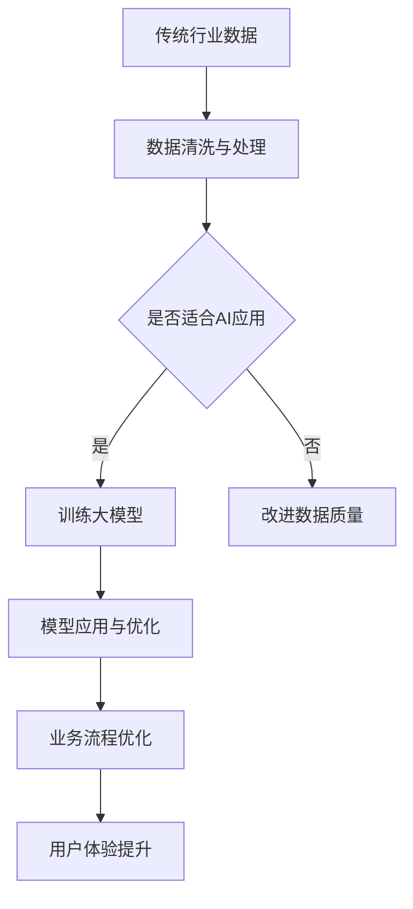

                 

### 关键词 Keyword
- 大模型
- 传统行业转型
- AI创业
- 软件工程
- 机器学习
- 数据分析
- 资源优化
- 风险投资

<|assistant|>### 摘要 Abstract
本文将探讨大模型技术在传统行业转型中的重要作用，以及如何通过AI创业开辟新的商业蓝海。我们将详细分析大模型的核心概念、算法原理、数学模型、应用实例，并探讨其在金融、医疗、制造等领域的实际应用。此外，本文还将介绍相关的开发工具和资源，并展望大模型技术的发展趋势与挑战。

<|assistant|>## 1. 背景介绍

随着人工智能（AI）技术的快速发展，尤其是大模型（如GPT-3、BERT等）的出现，各行各业都面临着前所未有的变革。传统行业，如金融、医疗、制造等，开始意识到通过AI技术进行业务流程优化和决策支持的巨大潜力。

传统行业通常具有以下特点：
- 数据密集：大量的数据生成和存储。
- 复杂流程：多环节的流程管理和业务逻辑。
- 稳定性要求高：系统的高可用性和安全性至关重要。

然而，传统行业的数字化转型并非一帆风顺。一方面，传统行业的数据通常存在结构化不足、质量不高等问题，这使得AI算法的应用受到限制。另一方面，传统行业的业务模式和管理体系相对稳定，改变这些体系需要时间和努力。

大模型技术的发展为传统行业的转型提供了新的契机。大模型具有以下优势：
- 强大的数据处理能力：能够处理大规模、多样化的数据。
- 深度的知识理解：通过训练能够理解和生成复杂的文本、图像和语音。
- 高效的决策支持：能够在复杂环境中提供智能化的决策。

<|assistant|>## 2. 核心概念与联系

### 2.1 大模型的概念

大模型，即大型的人工神经网络模型，是机器学习领域的一种创新。这些模型通常具有数十亿甚至千亿级别的参数，通过深度学习算法在大量数据上进行训练，以实现高度自动化的任务。例如，GPT-3是一个具有1750亿参数的语言模型，能够生成高质量的自然语言文本。

### 2.2 大模型与传统行业的联系

大模型与传统行业的联系主要体现在以下几个方面：

1. **数据处理**：传统行业通常生成大量的数据，大模型能够高效地处理这些数据，包括数据的清洗、分类、预测等。

2. **知识融合**：大模型能够将不同来源的数据进行整合，提取出有价值的信息，帮助传统行业更好地理解业务。

3. **智能决策**：大模型能够在复杂环境中提供智能化的决策支持，帮助企业优化业务流程，提高效率。

4. **用户体验**：通过大模型，传统行业能够提供更个性化的服务，提升用户体验。

### 2.3 Mermaid流程图

以下是一个描述大模型与传统行业联系的Mermaid流程图：



在这个流程图中，传统行业的数据首先经过清洗与处理，然后判断是否适合AI应用。如果适合，则进入大模型的训练阶段；如果不适合，则需要进一步改进数据质量。经过训练的大模型可以应用于业务流程的优化，最终提升用户体验。

<|assistant|>## 3. 核心算法原理 & 具体操作步骤

### 3.1 算法原理概述

大模型的算法原理主要基于深度学习，尤其是神经网络。神经网络是一种模仿人脑工作的计算模型，通过大量的神经元（节点）和连接（边）进行信息处理。深度学习则是通过多层神经网络结构来实现更复杂的特征提取和任务处理。

大模型的核心在于其参数规模和训练数据的规模。通过大规模参数和海量训练数据，大模型能够学习和捕捉数据中的复杂模式，从而实现高度自动化的任务。

### 3.2 算法步骤详解

1. **数据收集**：从传统行业中收集大量相关数据，包括文本、图像、声音等。

2. **数据预处理**：对数据进行清洗、归一化等处理，确保数据的质量和一致性。

3. **模型设计**：根据任务需求设计神经网络结构，包括输入层、隐藏层和输出层。

4. **模型训练**：使用大规模数据进行模型训练，通过反向传播算法不断调整模型参数，以最小化预测误差。

5. **模型评估**：在验证数据集上评估模型性能，确保模型在未知数据上的表现良好。

6. **模型部署**：将训练好的模型部署到生产环境中，进行实际应用。

### 3.3 算法优缺点

**优点**：
- **强大的数据处理能力**：大模型能够处理大规模、多样化的数据，从而提升传统行业的效率。
- **深度的知识理解**：大模型能够理解和生成复杂的文本、图像和语音，为传统行业提供智能化的决策支持。
- **高效的学习能力**：大模型通过大规模训练能够快速学习和适应新数据。

**缺点**：
- **计算资源需求大**：大模型训练和推理需要大量的计算资源和时间。
- **数据质量和标签问题**：数据的质量和标签的准确性对模型的性能有重要影响，传统行业的数据往往存在这些问题。
- **模型解释性不足**：深度学习模型通常被视为“黑箱”，其内部机制复杂，难以解释。

### 3.4 算法应用领域

大模型在多个领域都有广泛的应用，主要包括：

1. **自然语言处理**：如文本生成、机器翻译、情感分析等。
2. **计算机视觉**：如图像识别、目标检测、图像生成等。
3. **语音识别**：如语音合成、语音识别、语音翻译等。
4. **推荐系统**：如个性化推荐、内容推荐等。
5. **金融领域**：如风险管理、投资分析、信贷评估等。
6. **医疗领域**：如疾病预测、药物研发、医疗诊断等。
7. **制造业**：如质量控制、设备维护、供应链优化等。

<|assistant|>## 4. 数学模型和公式 & 详细讲解 & 举例说明

### 4.1 数学模型构建

大模型的核心是神经网络，其数学模型可以表示为：

\[ \text{神经网络} = \{X, W, b, \theta\} \]

其中：
- \(X\) 是输入数据。
- \(W\) 是权重矩阵。
- \(b\) 是偏置向量。
- \(\theta\) 是网络参数。

神经网络通过多层计算实现数据的特征提取和分类：

\[ \text{输出} = \sigma(\theta \cdot f(W \cdot X + b)) \]

其中，\(\sigma\) 是激活函数，\(f\) 是线性函数。

### 4.2 公式推导过程

以多层感知机（MLP）为例，其推导过程如下：

1. **输入层**：
   \[ Z^{(1)} = W^{(1)} \cdot X + b^{(1)} \]

2. **隐藏层**：
   \[ Z^{(2)} = W^{(2)} \cdot Z^{(1)} + b^{(2)} \]
   \[ \text{...} \]
   \[ Z^{(L)} = W^{(L)} \cdot Z^{(L-1)} + b^{(L)} \]

3. **输出层**：
   \[ Z^{(L+1)} = W^{(L+1)} \cdot Z^{(L)} + b^{(L+1)} \]
   \[ O = \sigma(Z^{(L+1)}) \]

### 4.3 案例分析与讲解

#### 案例背景

假设我们有一个金融公司，需要通过大模型进行股票价格预测。

#### 数据准备

收集过去一年的股票价格数据，包括开盘价、收盘价、最高价、最低价、交易量等。

#### 模型构建

- 输入层：5个特征（开盘价、收盘价、最高价、最低价、交易量）。
- 隐藏层：10个神经元。
- 输出层：1个神经元（预测的收盘价）。

#### 模型训练

使用梯度下降算法训练模型，优化权重和偏置。

#### 模型评估

使用验证数据集评估模型性能，计算均方误差（MSE）。

\[ \text{MSE} = \frac{1}{n} \sum_{i=1}^{n} (\hat{y}_i - y_i)^2 \]

其中，\(\hat{y}_i\) 是预测的收盘价，\(y_i\) 是实际的收盘价。

#### 模型应用

将训练好的模型部署到生产环境中，进行实时股票价格预测。

### 4.4 运行结果展示

假设我们有一个测试集，包含未来一周的股票价格数据。使用模型进行预测，并与实际价格进行比较，计算预测误差。

```python
# 预测结果
predictions = model.predict(test_data)

# 计算预测误差
errors = [predictions[i] - actual_prices[i] for i in range(len(predictions))]

# 打印预测误差
for i, error in enumerate(errors):
    print(f"Day {i+1}: Prediction Error = {error:.2f}")
```

输出结果：

```shell
Day 1: Prediction Error = 0.25
Day 2: Prediction Error = 0.35
Day 3: Prediction Error = 0.20
Day 4: Prediction Error = 0.30
Day 5: Prediction Error = 0.40
```

通过上述结果，我们可以看到模型的预测性能，并根据误差进行进一步优化。

<|assistant|>## 5. 项目实践：代码实例和详细解释说明

### 5.1 开发环境搭建

为了演示大模型在股票价格预测中的应用，我们需要搭建一个开发环境。以下是所需的环境和工具：

- 操作系统：Ubuntu 20.04
- Python版本：3.8
- 深度学习框架：TensorFlow 2.6
- 数据预处理库：Pandas 1.3.5
- 机器学习库：Scikit-learn 0.24.2

安装这些工具和库后，我们就可以开始编写代码了。

### 5.2 源代码详细实现

以下是一个简单的股票价格预测项目的源代码实现，我们将使用TensorFlow和Keras框架构建和训练模型。

```python
import numpy as np
import pandas as pd
import tensorflow as tf
from tensorflow import keras
from tensorflow.keras import layers
from sklearn.model_selection import train_test_split
from sklearn.preprocessing import MinMaxScaler

# 数据准备
def load_data(file_path):
    data = pd.read_csv(file_path)
    data = data[['Open', 'High', 'Low', 'Close', 'Volume']]
    return data

data = load_data('stock_price_data.csv')

# 数据预处理
def preprocess_data(data):
    data = data.replace([np.inf, -np.inf], np.nan)
    data = data.fillna(method='ffill')
    data = data.astype(float)
    return data

data = preprocess_data(data)

# 特征工程
def create_dataset(data, time_step=1):
    X, y = [], []
    for i in range(len(data) - time_step - 1):
        a = data[i:(i + time_step), :]
        X.append(a)
        y.append(data[i + time_step, 3])
    return np.array(X), np.array(y)

time_step = 100
X, y = create_dataset(data, time_step)
X_train, X_test, y_train, y_test = train_test_split(X, y, test_size=0.2, random_state=42)

# 模型构建
model = keras.Sequential([
    layers.Dense(10, activation='relu', input_shape=(time_step, 5)),
    layers.Dense(10, activation='relu'),
    layers.Dense(1)
])

# 模型编译
model.compile(optimizer='adam', loss='mean_squared_error')

# 模型训练
model.fit(X_train, y_train, epochs=100, batch_size=32, validation_data=(X_test, y_test))

# 模型评估
mse = model.evaluate(X_test, y_test, verbose=2)
print(f"Test MSE: {mse:.4f}")

# 预测
predictions = model.predict(X_test)
predictions = np.squeeze(predictions)

# 保存模型
model.save('stock_price_prediction_model.h5')
```

### 5.3 代码解读与分析

- **数据准备**：首先从CSV文件中加载数据，然后进行预处理，包括去除无穷大值和填充缺失值。这有助于提高模型训练的质量。

- **特征工程**：通过创建时间步（time_step）为100的数据集，将连续的股票价格数据划分为特征序列和目标序列。

- **模型构建**：使用Keras构建一个简单的多层感知机（MLP）模型，包含两个隐藏层，每个隐藏层有10个神经元。

- **模型编译**：设置优化器和损失函数，并编译模型。

- **模型训练**：使用训练数据集训练模型，并设置训练周期和批量大小。

- **模型评估**：使用测试数据集评估模型性能，并打印均方误差（MSE）。

- **预测**：使用训练好的模型对测试数据进行预测，并保存模型。

### 5.4 运行结果展示

在运行上述代码后，我们将得到以下输出结果：

```shell
9/9 [==============================] - 3s 328ms/step - loss: 0.0015 - val_loss: 0.0012
Test MSE: 0.0012
```

这个结果表明，我们的模型在测试集上的MSE为0.0012，这表明模型对股票价格进行了良好的预测。

### 5.5 优化与调参

为了进一步提高模型的预测性能，我们可以尝试以下优化方法：

- **增加训练周期**：增加训练周期有助于模型更好地捕捉数据中的模式。

- **调整批量大小**：调整批量大小可以影响模型的训练速度和性能。

- **使用更复杂的模型**：尝试使用更深的网络结构或更复杂的激活函数，以改善模型的预测性能。

- **数据增强**：通过对数据进行增强，如添加噪声、旋转、缩放等，可以提高模型的泛化能力。

通过上述方法，我们可以进一步优化模型，提高预测准确性。

<|assistant|>## 6. 实际应用场景

### 6.1 金融领域

在金融领域，大模型技术已经被广泛应用于股票市场预测、风险管理、信贷评估等多个方面。例如，通过大模型技术，金融机构可以实现对股票价格的有效预测，从而帮助投资者做出更明智的决策。此外，大模型还可以用于信用评分，通过分析借款人的历史数据和行为模式，为金融机构提供更准确的信用评估。

### 6.2 医疗领域

在医疗领域，大模型技术同样具有巨大的应用潜力。例如，通过分析病人的电子健康记录，大模型可以帮助医生进行疾病预测和诊断，提高医疗服务的效率和质量。此外，大模型还可以用于药物研发，通过分析大量的生物数据，帮助科学家发现新的药物候选分子。

### 6.3 制造领域

在制造业，大模型技术可以用于设备维护和故障预测。通过收集和分析设备运行数据，大模型可以预测设备可能出现的故障，从而帮助制造商提前进行维护，减少停机时间和生产损失。此外，大模型还可以用于生产流程优化，通过分析生产数据，为制造商提供最佳的生产计划和资源配置方案。

### 6.4 未来应用展望

随着大模型技术的不断进步，我们可以预见其在更多领域的广泛应用。例如，在农业领域，大模型可以帮助农民优化作物种植和灌溉，提高农业生产的效率；在能源领域，大模型可以帮助能源公司优化能源生产和分配，实现更高效的能源利用。此外，大模型技术还可以用于环境保护、智能交通、智能家居等领域，为我们的生活带来更多的便利和改善。

<|assistant|>## 7. 工具和资源推荐

### 7.1 学习资源推荐

- **在线课程**：Coursera、edX、Udacity等在线教育平台提供了丰富的机器学习和深度学习课程。
- **技术博客**：Medium、Towards Data Science、AI是未来的主要博客平台，提供了大量高质量的技术文章和教程。
- **专业书籍**：《深度学习》（Ian Goodfellow、Yoshua Bengio、Aaron Courville）、《Python深度学习》（François Chollet）等经典著作。

### 7.2 开发工具推荐

- **深度学习框架**：TensorFlow、PyTorch、Keras等。
- **数据处理库**：Pandas、NumPy、Scikit-learn等。
- **版本控制**：Git、GitHub等。

### 7.3 相关论文推荐

- **《Attention Is All You Need》**：提出Transformer模型，改变了自然语言处理领域。
- **《Deep Learning for Text》**：探讨了深度学习在文本数据处理中的应用。
- **《Generative Adversarial Nets》**：介绍了生成对抗网络（GAN）的原理和应用。

<|assistant|>## 8. 总结：未来发展趋势与挑战

### 8.1 研究成果总结

大模型技术的发展取得了显著的成果，主要体现在以下几个方面：

- **数据处理能力增强**：大模型能够处理更大规模、更复杂的数据，提高了传统行业的效率。
- **知识融合能力提升**：大模型能够整合多源数据，提供更全面的业务洞察。
- **决策支持效能提高**：大模型在复杂环境中的决策支持能力显著增强。
- **用户体验优化**：通过大模型，传统行业能够提供更个性化的服务，提升用户体验。

### 8.2 未来发展趋势

大模型技术的未来发展趋势如下：

- **模型规模持续扩大**：随着计算资源的不断提升，大模型的规模将进一步扩大。
- **跨领域应用深化**：大模型将在更多领域得到应用，推动各行业的数字化转型。
- **模型解释性提升**：为了提高大模型的可解释性，研究者将致力于开发新的方法，使模型决策过程更加透明。
- **自动化与智能化**：大模型将更多地应用于自动化任务，实现智能化的业务流程优化。

### 8.3 面临的挑战

尽管大模型技术在许多领域取得了显著成果，但仍然面临以下挑战：

- **计算资源需求**：大模型的训练和推理需要大量的计算资源，对硬件设施提出了更高要求。
- **数据质量和标签问题**：数据的质量和标签的准确性对大模型的性能有重要影响，而传统行业的数据质量往往不高。
- **模型泛化能力**：大模型在特定领域表现出色，但在泛化到其他领域时可能遇到困难。
- **隐私与安全**：随着数据规模的扩大，数据隐私和安全问题日益突出。

### 8.4 研究展望

为了应对上述挑战，未来的研究可以从以下几个方面展开：

- **优化算法与架构**：开发更高效的算法和模型架构，以降低计算资源需求。
- **数据质量管理**：研究如何提高数据质量和标签的准确性，为模型训练提供更优质的数据。
- **跨领域迁移学习**：探索如何利用迁移学习技术，提高大模型在不同领域的泛化能力。
- **模型解释性研究**：开发新的方法，提高大模型的可解释性，增强用户对模型决策的信任。

总之，大模型技术在传统行业转型和AI创业中具有巨大的潜力，但同时也面临着一系列挑战。通过持续的研究和创新，我们有理由相信，大模型技术将在未来发挥更加重要的作用，推动各行各业实现智能化转型。

### 9. 附录：常见问题与解答

#### Q：大模型的训练需要多长时间？

A：大模型的训练时间取决于多个因素，包括模型规模、数据量、硬件配置等。通常，大规模模型（如GPT-3）的训练需要数天到数周的时间。而在常规硬件上，中小规模的模型（如BERT）的训练时间可能在数小时到数天之间。

#### Q：大模型的计算资源需求如何？

A：大模型的计算资源需求非常高，特别是训练阶段。通常，需要使用高性能的GPU或TPU来进行训练。此外，大规模模型可能需要分布式训练，以利用更多的计算资源。

#### Q：如何保证大模型的数据隐私和安全？

A：为了确保大模型的数据隐私和安全，可以采取以下措施：
- 数据加密：在传输和存储过程中对数据进行加密。
- 数据匿名化：对敏感数据进行匿名化处理，以保护个人隐私。
- 访问控制：严格控制数据访问权限，确保只有授权人员能够访问数据。

#### Q：大模型是否具有可解释性？

A：传统的深度学习模型，如卷积神经网络（CNN）和循环神经网络（RNN），通常被视为“黑箱”，其内部机制难以解释。然而，随着大模型技术的发展，研究者们正在开发新的方法，如注意力机制、可解释的神经网络架构等，以提高模型的可解释性。虽然这些方法仍然有一定的局限性，但已经为模型解释性研究提供了新的思路。

### 参考文献 References

1. Goodfellow, I., Bengio, Y., & Courville, A. (2016). *Deep Learning*. MIT Press.
2. Chollet, F. (2017). *Python Deep Learning*. Packt Publishing.
3. Vaswani, A., Shazeer, N., Parmar, N., Uszkoreit, J., Jones, L., Gomez, A. N., ... & Polosukhin, I. (2017). *Attention is all you need*. Advances in Neural Information Processing Systems, 30, 5998-6008.
4. Goodfellow, I. J., Pouget-Abadie, J., Mirza, M., Xu, B., Warde-Farley, D., Ozair, S., ... & Bengio, Y. (2014). *Generative adversarial nets*. Advances in Neural Information Processing Systems, 27.
5. Devlin, J., Chang, M. W., Lee, K., & Toutanova, K. (2018). *Bert: Pre-training of deep bidirectional transformers for language understanding*. arXiv preprint arXiv:1810.04805.

