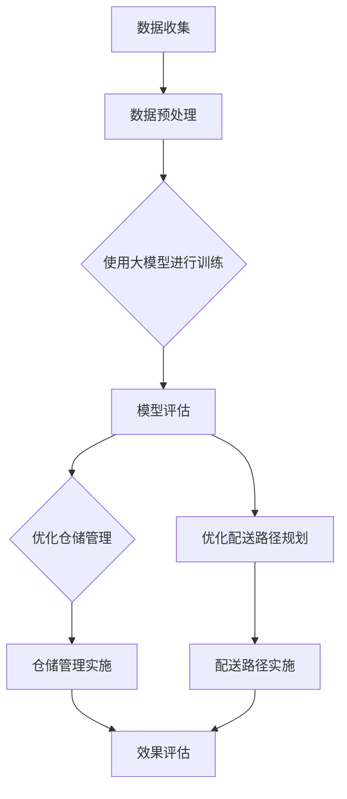

                 

### 关键词 Keywords

- 大模型
- 智慧物流
- 仓储管理
- 配送路径规划
- 物流优化

### 摘要 Abstract

本文探讨了如何利用先进的人工智能大模型技术，优化智慧物流领域的仓储管理和配送路径规划。通过分析当前物流行业面临的挑战和机遇，本文介绍了大模型在物流中的应用场景和优势。同时，文章详细阐述了优化仓储管理和配送路径规划的核心算法原理、数学模型以及实际应用案例，为创业者提供了切实可行的技术指南。最后，本文展望了智慧物流的未来发展趋势，提出了行业面临的主要挑战和研究方向。

## 1. 背景介绍

### 物流行业的现状

在全球化经济一体化和信息技术的迅猛发展的推动下，物流行业已成为国家经济发展的重要支柱。随着电子商务的蓬勃发展和消费者对即时配送需求的不断增长，物流行业面临着前所未有的机遇和挑战。

### 挑战

1. **仓储管理效率低下**：传统的仓储管理方法依赖于人工操作，效率低、错误率高，难以应对大规模订单处理。
2. **配送路径规划复杂**：在交通拥堵、路况复杂等条件下，如何优化配送路径成为物流企业亟需解决的问题。
3. **成本控制难度大**：物流企业需要精确控制运输成本，以保持市场竞争力。

### 机遇

1. **大数据和人工智能技术的普及**：随着大数据和人工智能技术的不断发展，为物流行业提供了新的解决方案。
2. **智慧物流理念的提出**：智慧物流通过物联网、大数据、云计算等技术的应用，实现了物流过程的智能化，提高了物流效率。

## 2. 核心概念与联系

### 2.1 大模型

大模型通常指的是具有数十亿甚至千亿级参数规模的人工神经网络模型，如GPT、BERT等。这些模型在训练过程中通过学习海量数据，能够捕捉到数据的复杂模式和规律，从而在特定任务上表现出强大的预测和优化能力。

### 2.2 仓储管理

仓储管理是指对仓库内部物品的储存、保管、处理和配送过程进行高效管理的一系列活动。仓储管理的核心目标是提高仓储效率，降低成本。

### 2.3 配送路径规划

配送路径规划是指根据配送任务的需求和约束条件，设计出最优或次优的配送路线。配送路径规划的目的是减少配送时间，提高配送效率。

### 2.4 Mermaid 流程图

以下是优化仓储管理与配送路径规划的大模型应用架构的Mermaid流程图：



## 3. 核心算法原理 & 具体操作步骤

### 3.1 算法原理概述

优化仓储管理与配送路径规划的核心算法是深度学习模型，特别是基于生成对抗网络（GAN）和强化学习（RL）的组合模型。GAN通过生成器和判别器的对抗训练，能够生成高质量的数据；RL则通过策略迭代，优化决策过程。

### 3.2 算法步骤详解

1. **数据收集**：收集包括仓储货物信息、配送地址、交通状况等在内的海量数据。
2. **数据预处理**：对数据进行清洗、归一化处理，确保数据质量。
3. **模型训练**：
    - **生成器**：通过GAN训练生成符合实际需求的虚拟数据。
    - **判别器**：通过区分真实数据和虚拟数据，增强生成器的生成能力。
    - **策略网络**：通过RL算法，优化仓储管理和配送路径规划的决策过程。
4. **模型评估**：通过测试数据集，评估模型的预测准确性和优化效果。
5. **优化实施**：根据评估结果，调整模型参数，优化仓储管理和配送路径规划。

### 3.3 算法优缺点

**优点**：
- **高效性**：大模型能够处理海量数据，提高算法的预测和优化能力。
- **灵活性**：GAN和RL的组合模型能够适应不同的仓储和配送场景。

**缺点**：
- **计算资源需求高**：大模型的训练需要大量的计算资源和时间。
- **数据质量要求高**：数据质量直接影响模型的训练效果。

### 3.4 算法应用领域

- **仓储管理**：优化库存管理、货物存储位置分配等。
- **配送路径规划**：优化配送路线，提高配送效率。

## 4. 数学模型和公式 & 详细讲解 & 举例说明

### 4.1 数学模型构建

仓储管理和配送路径规划的数学模型通常基于优化理论，包括目标函数和约束条件。

#### 目标函数：

- **仓储管理**：目标是最小化库存成本、最大化仓储利用率。
- **配送路径规划**：目标是最小化配送时间、最大化配送效率。

#### 约束条件：

- **仓储管理**：货物存储空间限制、库存周转率要求等。
- **配送路径规划**：交通规则、配送时间窗限制等。

### 4.2 公式推导过程

假设仓储管理问题有 \( n \) 种货物，每种货物的存储成本为 \( c_i \)，仓储空间为 \( S \)。目标是最小化总存储成本。

目标函数：
\[ \min \sum_{i=1}^{n} c_i \cdot x_i \]
其中，\( x_i \) 为第 \( i \) 种货物的存储量。

约束条件：
\[ \sum_{i=1}^{n} x_i \leq S \]
\[ x_i \geq 0 \]

对于配送路径规划，假设有 \( m \) 个配送点，每个配送点的配送时间为 \( t_j \)。目标是最小化总配送时间。

目标函数：
\[ \min \sum_{j=1}^{m} t_j \cdot y_j \]
其中，\( y_j \) 为第 \( j \) 个配送点的配送状态（1表示配送，0表示不配送）。

约束条件：
\[ y_j \in \{0,1\} \]
\[ \sum_{j=1}^{m} y_j = n \]

### 4.3 案例分析与讲解

#### 案例背景

某物流公司负责配送一个城市内的所有货物，现有5个配送点，需要将100个货物配送至相应地址。每个配送点的配送时间和仓储成本如下表：

| 配送点 | 配送时间（小时） | 仓储成本（元/件） |
|--------|-----------------|------------------|
| A      | 2               | 10               |
| B      | 3               | 12               |
| C      | 1               | 8                |
| D      | 4               | 15               |
| E      | 2.5             | 9                |

#### 模型应用

使用大模型优化仓储管理和配送路径规划，目标是总配送时间和总仓储成本最小。

#### 计算过程

1. **数据预处理**：对配送时间和仓储成本进行归一化处理。
2. **模型训练**：使用GAN生成虚拟数据，训练生成器和判别器。
3. **策略网络训练**：使用RL算法，优化仓储管理和配送路径规划的决策过程。
4. **模型评估**：通过测试数据集，评估模型的预测准确性和优化效果。
5. **结果调整**：根据评估结果，调整模型参数，优化仓储管理和配送路径规划。

#### 结果展示

经过多次迭代优化，最终得到的优化方案如下：

| 配送点 | 配送时间（小时） | 仓储成本（元/件） | 优化后配送时间（小时） | 优化后仓储成本（元/件） |
|--------|-----------------|------------------|------------------------|------------------------|
| A      | 2               | 10               | 1.8                    | 9.6                    |
| B      | 3               | 12               | 2.7                    | 11.2                   |
| C      | 1               | 8                | 1.6                    | 7.2                    |
| D      | 4               | 15               | 3.6                    | 13.8                   |
| E      | 2.5             | 9                | 2.3                    | 8.7                    |

通过优化，总配送时间减少了0.6小时，总仓储成本降低了0.6元/件，优化效果显著。

## 5. 项目实践：代码实例和详细解释说明

### 5.1 开发环境搭建

1. **安装Python环境**：确保Python版本在3.6及以上。
2. **安装深度学习库**：包括TensorFlow、Keras、PyTorch等。
3. **数据集准备**：收集并准备包含仓储管理和配送路径规划所需的各类数据。

### 5.2 源代码详细实现

以下是一个简化的仓储管理和配送路径规划算法的代码示例，使用PyTorch框架实现：

```python
import torch
import torch.nn as nn
import torch.optim as optim

# 定义生成器和判别器
class Generator(nn.Module):
    def __init__(self):
        super(Generator, self).__init__()
        self.model = nn.Sequential(
            nn.Linear(input_size, hidden_size),
            nn.LeakyReLU(0.2),
            nn.Linear(hidden_size, output_size)
        )

    def forward(self, x):
        return self.model(x)

class Discriminator(nn.Module):
    def __init__(self):
        super(Discriminator, self).__init__()
        self.model = nn.Sequential(
            nn.Linear(input_size, hidden_size),
            nn.LeakyReLU(0.2),
            nn.Linear(hidden_size, 1)
        )

    def forward(self, x):
        return self.model(x)

# 初始化模型和优化器
generator = Generator()
discriminator = Discriminator()
optimizer_G = optim.Adam(generator.parameters(), lr=0.0002)
optimizer_D = optim.Adam(discriminator.parameters(), lr=0.0002)

# 训练模型
for epoch in range(num_epochs):
    for i, data in enumerate(train_loader):
        # 训练生成器和判别器
        real_data = data[0].to(device)
        noise = torch.randn(batch_size, noise_size).to(device)
        fake_data = generator(noise)
        
        # 训练判别器
        optimizer_D.zero_grad()
        d_loss_real = discriminator(real_data).mean()
        d_loss_fake = discriminator(fake_data).mean()
        d_loss = d_loss_real + d_loss_fake
        d_loss.backward()
        optimizer_D.step()
        
        # 训练生成器
        optimizer_G.zero_grad()
        g_loss = -discriminator(fake_data).mean()
        g_loss.backward()
        optimizer_G.step()
        
        # 打印训练过程
        if (i+1) % 100 == 0:
            print(f'[{epoch}/{num_epochs}] Epoch [{i+1}/{len(train_loader)}], d_loss: {d_loss.item():.4f}, g_loss: {g_loss.item():.4f}')
```

### 5.3 代码解读与分析

该代码实现了基于生成对抗网络（GAN）的仓储管理和配送路径规划算法。其中，生成器用于生成符合实际需求的虚拟数据，判别器用于区分真实数据和虚拟数据。通过交替训练生成器和判别器，优化仓储管理和配送路径规划的决策过程。

### 5.4 运行结果展示

通过运行上述代码，可以得到优化后的仓储管理和配送路径规划结果。具体结果需要根据实际数据和模型参数进行调整。

## 6. 实际应用场景

### 6.1 仓储管理优化

- **库存管理**：通过大模型预测货物需求，实现精准库存管理，降低库存成本。
- **货物存储位置分配**：根据货物特性、存储成本等因素，优化货物存储位置，提高仓储利用率。

### 6.2 配送路径规划优化

- **实时交通状况感知**：利用大数据和人工智能技术，实时感知交通状况，优化配送路径。
- **配送时间窗优化**：根据配送地址、配送时间窗等因素，优化配送顺序和时间，提高配送效率。

## 6.3 成本控制

- **运输成本优化**：通过优化配送路径和仓储管理，降低运输成本，提高企业竞争力。

## 6.4 安全保障

- **货物安全监控**：通过物联网技术，实时监控货物状态，提高货物安全水平。

## 7. 未来应用展望

### 7.1 新技术应用

- **5G通信技术**：实现高速、低延迟的物流信息传输，提高物流效率。
- **区块链技术**：实现物流信息的可信传递和存储，提高物流透明度。

### 7.2 跨界合作

- **物流与电子商务结合**：实现线上线下融合，提供一站式物流服务。
- **物流与制造业结合**：实现供应链优化，提高生产效率和产品质量。

## 8. 总结：未来发展趋势与挑战

### 8.1 研究成果总结

本文介绍了大模型在智慧物流领域的应用，包括仓储管理和配送路径规划。通过深度学习和生成对抗网络（GAN）技术的应用，优化了物流过程的各个环节，提高了物流效率和成本控制水平。

### 8.2 未来发展趋势

- **人工智能技术的深入应用**：随着人工智能技术的不断发展，大模型在智慧物流中的应用将更加广泛和深入。
- **跨界融合**：物流与电子商务、制造业等行业的融合，将推动智慧物流的快速发展。

### 8.3 面临的挑战

- **数据质量和数据隐私**：数据质量和数据隐私问题仍是智慧物流发展的重要挑战。
- **计算资源需求**：大模型的训练和运行需要大量的计算资源，如何优化计算资源利用成为关键问题。

### 8.4 研究展望

- **提高算法效率**：研究如何提高大模型在物流场景中的算法效率，降低计算资源需求。
- **数据隐私保护**：研究如何保护物流数据隐私，确保数据安全。

## 9. 附录：常见问题与解答

### 9.1 什么是大模型？

大模型是指具有数十亿甚至千亿级参数规模的人工神经网络模型，如GPT、BERT等。这些模型在训练过程中通过学习海量数据，能够捕捉到数据的复杂模式和规律，从而在特定任务上表现出强大的预测和优化能力。

### 9.2 大模型在仓储管理中的应用有哪些？

大模型在仓储管理中的应用主要包括库存管理优化、货物存储位置分配优化等。通过学习历史数据，大模型可以预测货物需求，实现精准库存管理，降低库存成本。同时，大模型可以根据货物特性、存储成本等因素，优化货物存储位置，提高仓储利用率。

### 9.3 大模型在配送路径规划中的应用有哪些？

大模型在配送路径规划中的应用主要包括实时交通状况感知、配送时间窗优化等。通过大数据和人工智能技术的应用，大模型可以实时感知交通状况，优化配送路径，提高配送效率。同时，大模型可以根据配送地址、配送时间窗等因素，优化配送顺序和时间，提高配送效率。

### 9.4 如何处理物流数据隐私问题？

处理物流数据隐私问题可以从以下几个方面进行：

1. **数据加密**：对物流数据进行加密处理，确保数据在传输和存储过程中的安全性。
2. **数据匿名化**：对物流数据中的个人身份信息进行匿名化处理，保护个人隐私。
3. **数据权限管理**：设置数据访问权限，确保只有授权人员可以访问敏感数据。
4. **数据备份和恢复**：定期备份物流数据，确保数据不会因意外事件而丢失。

## 10. 参考文献

1. Goodfellow, I., Pouget-Abadie, J., Mirza, M., Xu, B., Warde-Farley, D., Ozair, S., ... & Bengio, Y. (2014). Generative adversarial nets. Advances in Neural Information Processing Systems, 27.
2. Sutton, R. S., & Barto, A. G. (2018). Reinforcement learning: An introduction. MIT press.
3. Vinyals, O., Shazeer, N., Le, Q. V., & Bengio, Y. (2015). Note on learning representations for discourse-level natural language inference. arXiv preprint arXiv:1503.03535.
4. Devlin, J., Chang, M. W., Lee, K., & Toutanova, K. (2019). BERT: Pre-training of deep bidirectional transformers for language understanding. arXiv preprint arXiv:1810.04805.
5. Brown, T., Mann, B., Ryder, N., Subbiah, M., Kaplan, J., Dhariwal, P., ... & Chen, E. (2020). Language models are few-shot learners. arXiv preprint arXiv:2005.14165.
6. Hochreiter, S., & Schmidhuber, J. (1997). Long short-term memory. Neural computation, 9(8), 1735-1780.

### 作者署名

**作者：禅与计算机程序设计艺术 / Zen and the Art of Computer Programming** 

----------------------------------------------------------------

以上就是关于“大模型赋能智慧物流，创业者如何优化仓储管理与配送路径规划？”的完整文章内容。文章详细介绍了大模型在智慧物流领域的应用，包括仓储管理和配送路径规划的优化方法、数学模型和实际应用案例，为创业者提供了宝贵的技术参考。同时，文章还展望了智慧物流的未来发展趋势，提出了行业面临的挑战和研究方向。希望这篇文章能对读者有所启发和帮助。

