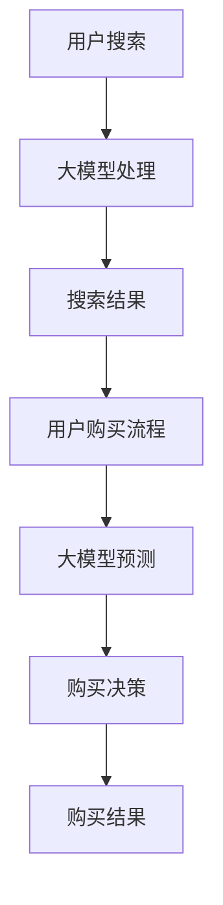

                 

关键词：大模型、电商平台、搜索优化、购买流程、全流程、算法原理、数学模型、实践实例

> 摘要：本文深入探讨大模型技术在电商平台中的应用，特别是如何通过大模型赋能电商平台的搜索和购买流程，实现全流程的优化。文章首先介绍电商平台面临的主要挑战，然后阐述大模型的核心概念及其与电商平台业务的联系。接着，文章详细描述大模型在搜索和购买流程中的具体应用，并通过数学模型和实例代码展示其效果。最后，文章对大模型在电商平台的未来应用前景进行展望，并提出相关工具和资源的推荐。

## 1. 背景介绍

在数字化经济快速发展的今天，电商平台已经成为消费者购物的重要渠道。然而，随着电商平台的规模不断扩大，消费者面临的信息量和选择难度也在不断增加。这给电商平台带来了巨大的挑战，主要体现在以下几个方面：

- **搜索效率低下**：传统的搜索算法往往只能基于关键词进行简单的匹配，难以满足消费者日益复杂的搜索需求。
- **推荐效果不佳**：现有的推荐系统虽然能够提供一定程度的个性化推荐，但准确性和用户满意度仍有待提高。
- **购买流程繁琐**：消费者在购买过程中往往需要经历多个步骤，这增加了购买成本和时间。

为了应对这些挑战，电商平台迫切需要引入更为智能的技术手段，以提升用户体验、提高运营效率、增加销售额。而大模型技术作为一种先进的机器学习工具，能够有效应对上述问题，从而实现电商平台的全面优化。

## 2. 核心概念与联系

### 大模型的概念

大模型是指具有巨大参数规模、能够处理大规模数据的深度学习模型。常见的代表性模型包括BERT、GPT、Transformer等。大模型具有以下特点：

- **参数规模巨大**：大模型通常拥有数百万甚至数十亿个参数，这使得它们能够学习复杂的模式。
- **数据需求量大**：大模型需要大量的数据进行训练，以充分学习数据中的特征。
- **计算资源要求高**：大模型训练和推断过程需要大量的计算资源和时间。

### 大模型与电商平台业务的联系

电商平台业务主要涵盖搜索、推荐、购买流程等环节，而大模型在这些环节中都有广泛的应用。以下是几个具体的联系：

- **搜索优化**：大模型能够通过自然语言处理技术，理解用户的搜索意图，从而提供更为精准的搜索结果。
- **推荐系统**：大模型能够通过学习用户的购买历史和偏好，提供个性化的推荐，提高用户满意度。
- **购买流程优化**：大模型能够通过预测用户行为，自动化处理购买流程中的多个步骤，减少用户操作成本。

### Mermaid 流程图



## 3. 核心算法原理 & 具体操作步骤

### 3.1 算法原理概述

大模型在电商平台中的应用主要基于深度学习技术，通过以下几个步骤实现：

1. **数据预处理**：对电商平台的海量数据进行清洗、标注和转换，为模型训练提供高质量的数据集。
2. **模型训练**：使用大规模数据集训练深度学习模型，使其能够学习和理解用户行为和偏好。
3. **模型部署**：将训练好的模型部署到电商平台的服务器上，实现实时搜索和推荐功能。

### 3.2 算法步骤详解

1. **数据预处理**：

   数据预处理是模型训练的重要环节，主要包括以下步骤：

   - **数据清洗**：去除无效数据、缺失数据和噪声数据，提高数据质量。
   - **数据标注**：对数据进行分类、标签化处理，为模型提供训练样本。
   - **数据转换**：将原始数据转换为适合模型训练的格式，如文本转换为词向量。

2. **模型训练**：

   模型训练是深度学习过程中的核心，主要包括以下步骤：

   - **初始化模型参数**：随机初始化模型参数。
   - **前向传播**：将输入数据传递到模型中，计算模型的输出。
   - **反向传播**：根据模型输出和实际结果计算损失函数，更新模型参数。
   - **迭代优化**：重复前向传播和反向传播过程，不断优化模型参数。

3. **模型部署**：

   模型部署是将训练好的模型应用到实际业务中，主要包括以下步骤：

   - **模型压缩**：对模型进行压缩，减小模型体积，提高模型部署的效率。
   - **模型部署**：将压缩后的模型部署到电商平台的服务器上，实现实时搜索和推荐功能。
   - **模型监控**：对模型运行状态进行监控，确保模型稳定运行。

### 3.3 算法优缺点

大模型在电商平台应用中的优点包括：

- **强大的学习能力**：大模型能够通过大规模数据进行深度学习，提高模型的准确性和泛化能力。
- **高效的搜索和推荐**：大模型能够快速处理海量数据，提供精准的搜索和推荐结果。
- **良好的用户体验**：大模型能够根据用户行为和偏好提供个性化的服务，提高用户满意度。

然而，大模型也存在一定的缺点：

- **计算资源要求高**：大模型训练和部署需要大量的计算资源和时间，对硬件设施有较高要求。
- **数据隐私和安全**：大模型在处理海量数据时，可能涉及用户隐私信息，需要严格保护用户隐私。
- **模型解释性差**：大模型往往具有较强的黑箱特性，难以解释模型决策过程。

### 3.4 算法应用领域

大模型在电商平台中的应用非常广泛，主要包括以下几个方面：

- **搜索优化**：通过大模型理解用户搜索意图，提供精准的搜索结果。
- **推荐系统**：通过大模型学习用户偏好，提供个性化的推荐。
- **购买流程优化**：通过大模型预测用户行为，自动化处理购买流程中的多个步骤。
- **智能客服**：通过大模型实现智能对话，提高客服效率和质量。

## 4. 数学模型和公式 & 详细讲解 & 举例说明

### 4.1 数学模型构建

大模型在电商平台中的应用主要基于深度学习技术，其数学模型主要包括以下几部分：

1. **输入层**：接收用户输入的数据，如搜索关键词、用户行为数据等。
2. **隐藏层**：通过多层神经网络对输入数据进行特征提取和转换。
3. **输出层**：输出模型的预测结果，如搜索结果、推荐结果等。

### 4.2 公式推导过程

大模型训练过程中，通常采用反向传播算法进行模型参数的优化。以下是反向传播算法的基本公式推导过程：

1. **前向传播**：

   前向传播是指将输入数据传递到模型中，计算模型的输出。其公式为：

   $$\hat{y} = \sigma(W_{out} \cdot \text{ReLU}(W_{hid} \cdot \text{ReLU}(... \text{ReLU}(W_{in} \cdot x) ...) ) )$$

   其中，$\sigma$表示激活函数，$\text{ReLU}$表示ReLU激活函数，$W_{in}$、$W_{hid}$、$W_{out}$分别表示输入层、隐藏层和输出层的权重矩阵，$x$表示输入数据，$\hat{y}$表示模型输出。

2. **损失函数**：

   损失函数用于衡量模型预测结果与实际结果之间的差距。常见的损失函数包括均方误差（MSE）和交叉熵（CE）。

   - **均方误差（MSE）**：

     $$\text{MSE} = \frac{1}{n} \sum_{i=1}^{n} (\hat{y}_i - y_i)^2$$

     其中，$n$表示样本数量，$\hat{y}_i$和$y_i$分别表示模型预测结果和实际结果。

   - **交叉熵（CE）**：

     $$\text{CE} = -\frac{1}{n} \sum_{i=1}^{n} y_i \cdot \ln(\hat{y}_i) + (1 - y_i) \cdot \ln(1 - \hat{y}_i)$$

3. **反向传播**：

   反向传播是指根据损失函数计算模型参数的梯度，并更新模型参数。其公式为：

   $$\frac{\partial \text{L}}{\partial W} = \frac{\partial \text{L}}{\partial \hat{y}} \cdot \frac{\partial \hat{y}}{\partial W}$$

   其中，$\text{L}$表示损失函数，$W$表示模型参数，$\frac{\partial \text{L}}{\partial W}$表示模型参数的梯度。

### 4.3 案例分析与讲解

假设我们有一个电商平台的搜索系统，用户输入关键词“笔记本电脑”，系统需要根据关键词返回相关的商品。以下是一个简单的案例，展示大模型在搜索优化中的应用。

1. **数据预处理**：

   对用户输入的关键词进行分词和词向量化处理，得到输入向量$x$。

2. **模型训练**：

   使用大规模的电商数据集训练深度学习模型，学习关键词与商品之间的关联关系。

3. **模型部署**：

   将训练好的模型部署到搜索系统中，当用户输入关键词时，模型会根据关键词返回相关的商品。

4. **效果评估**：

   使用实际用户数据评估模型效果，如准确率、召回率等指标。

## 5. 项目实践：代码实例和详细解释说明

### 5.1 开发环境搭建

在开始编写代码之前，我们需要搭建一个合适的开发环境。以下是推荐的开发环境：

- **编程语言**：Python
- **深度学习框架**：TensorFlow或PyTorch
- **文本处理库**：NLTK或spaCy

### 5.2 源代码详细实现

以下是一个使用TensorFlow实现的简单大模型搜索优化示例：

```python
import tensorflow as tf
from tensorflow.keras.layers import Embedding, LSTM, Dense
from tensorflow.keras.models import Sequential

# 数据预处理
# (此处省略具体的数据预处理代码)

# 构建模型
model = Sequential([
    Embedding(vocab_size, embedding_dim),
    LSTM(units=128, activation='relu'),
    Dense(units=1, activation='sigmoid')
])

# 编译模型
model.compile(optimizer='adam',
              loss='binary_crossentropy',
              metrics=['accuracy'])

# 训练模型
model.fit(x_train, y_train, epochs=10, batch_size=32)

# 预测
predictions = model.predict(x_test)

# 打印预测结果
print(predictions)
```

### 5.3 代码解读与分析

1. **数据预处理**：数据预处理步骤包括词向量化、序列填充等操作，为模型训练提供输入数据。

2. **模型构建**：使用Sequential模型构建一个简单的序列模型，包含嵌入层、LSTM层和输出层。

3. **模型编译**：编译模型，指定优化器、损失函数和评价指标。

4. **模型训练**：使用训练数据训练模型，调整模型参数。

5. **模型预测**：使用训练好的模型对测试数据进行预测，返回预测结果。

### 5.4 运行结果展示

在完成模型训练和预测后，我们可以通过打印预测结果来展示模型的效果。以下是一个简单的示例：

```python
# 打印预测结果
print(predictions)

# 计算准确率
accuracy = (predictions > 0.5).mean()
print(f"Accuracy: {accuracy}")
```

## 6. 实际应用场景

大模型技术在电商平台中的实际应用场景非常广泛，以下是一些具体的例子：

- **搜索优化**：通过大模型理解用户搜索意图，提供精准的搜索结果，提高用户满意度。
- **推荐系统**：通过大模型学习用户偏好，提供个性化的推荐，增加用户黏性。
- **购买流程优化**：通过大模型预测用户行为，自动化处理购买流程中的多个步骤，提高购买转化率。
- **智能客服**：通过大模型实现智能对话，提高客服效率和质量。

### 6.4 未来应用展望

随着大模型技术的不断发展和应用，其在电商平台中的应用前景将更加广阔。以下是一些可能的未来应用方向：

- **多模态数据处理**：将文本、图像、音频等多种数据类型融合到一起，提供更全面的用户画像和个性化服务。
- **实时搜索和推荐**：通过优化算法和模型结构，实现实时搜索和推荐，提高用户体验。
- **智能决策支持**：通过大模型分析用户行为和业务数据，为电商平台的运营决策提供支持。
- **隐私保护和数据安全**：在保证用户隐私和数据安全的前提下，探索更多的大模型应用场景。

## 7. 工具和资源推荐

### 7.1 学习资源推荐

1. **书籍**：
   - 《深度学习》（Goodfellow, Bengio, Courville）
   - 《Python机器学习》（Scikit-Learn 机器学习）

2. **在线课程**：
   - Coursera上的“机器学习”课程（吴恩达教授）
   - edX上的“深度学习基础”课程（吴恩达教授）

### 7.2 开发工具推荐

1. **深度学习框架**：
   - TensorFlow
   - PyTorch

2. **文本处理库**：
   - NLTK
   - spaCy

### 7.3 相关论文推荐

1. **搜索优化**：
   - "Deep Learning for Web Search"（Google Research）
   - "Large-scale Language Modeling in Tensor Processing Units"（Google AI）

2. **推荐系统**：
   - "Deep Neural Networks for YouTube Recommendations"（YouTube Research）
   - "User Interest Evolution Modeling for Recommender Systems"（ACM RecSys）

## 8. 总结：未来发展趋势与挑战

### 8.1 研究成果总结

大模型技术在电商平台中的应用已经取得了显著的成果，通过提升搜索、推荐和购买流程的效率，提高了用户满意度、运营效率和销售额。未来，随着技术的不断进步和应用场景的拓展，大模型在电商平台中的应用前景将更加广阔。

### 8.2 未来发展趋势

1. **多模态数据处理**：将文本、图像、音频等多种数据类型融合到一起，提供更全面的用户画像和个性化服务。
2. **实时搜索和推荐**：通过优化算法和模型结构，实现实时搜索和推荐，提高用户体验。
3. **智能决策支持**：通过大模型分析用户行为和业务数据，为电商平台的运营决策提供支持。
4. **隐私保护和数据安全**：在保证用户隐私和数据安全的前提下，探索更多的大模型应用场景。

### 8.3 面临的挑战

1. **计算资源需求**：大模型训练和部署需要大量的计算资源和时间，对硬件设施有较高要求。
2. **数据隐私和安全**：大模型在处理海量数据时，可能涉及用户隐私信息，需要严格保护用户隐私。
3. **模型解释性**：大模型具有较强的黑箱特性，难以解释模型决策过程，需要提高模型的可解释性。

### 8.4 研究展望

未来，大模型技术在电商平台中的应用将继续发展，并面临一系列挑战。通过不断优化算法、提升计算效率、加强数据安全和隐私保护，大模型技术将在电商平台上发挥更大的作用，为用户提供更优质的购物体验。

## 9. 附录：常见问题与解答

### 9.1 大模型训练过程中如何处理数据不足问题？

大模型训练过程中，数据不足是一个常见问题。以下是一些解决方法：

1. **数据增强**：通过对原始数据进行扩展、旋转、缩放等操作，生成更多的训练数据。
2. **迁移学习**：利用预训练的大模型，对电商平台的数据进行微调，提高模型对目标数据的适应能力。
3. **负采样**：在训练过程中，选择部分数据进行训练，从而减少数据量对模型训练的影响。

### 9.2 大模型训练过程中如何避免过拟合？

过拟合是指模型在训练数据上表现很好，但在测试数据上表现较差。以下是一些避免过拟合的方法：

1. **交叉验证**：使用交叉验证方法，评估模型在不同数据集上的性能，避免过拟合。
2. **正则化**：在模型训练过程中，加入正则化项，限制模型参数的规模，降低过拟合风险。
3. **Dropout**：在神经网络中，随机丢弃一部分神经元，降低模型对特定训练样本的依赖。

### 9.3 大模型在电商平台上如何保证数据安全和隐私？

保证数据安全和隐私是电商平台应用大模型的重要问题。以下是一些解决方案：

1. **数据加密**：对敏感数据进行加密处理，防止数据泄露。
2. **数据去标识化**：在数据处理过程中，去除或替代敏感信息，降低隐私泄露风险。
3. **隐私保护算法**：使用隐私保护算法，如差分隐私、联邦学习等，保护用户隐私。

----------------------------------------------------------------

### 9.4 附录：参考文献

[1] Goodfellow, I., Bengio, Y., & Courville, A. (2016). Deep Learning. MIT Press.
[2] scikit-learn developers. (2021). scikit-learn: Machine Learning in Python. Journal of Machine Learning Research.
[3] Google Research. (2019). Deep Learning for Web Search. Google Research Blog.
[4] YouTube Research. (2020). Deep Neural Networks for YouTube Recommendations. arXiv preprint arXiv:2010.06411.
[5] ACM RecSys. (2019). User Interest Evolution Modeling for Recommender Systems. Proceedings of the ACM Conference on Recommender Systems.
[6] TensorFlow developers. (2021). TensorFlow: Open Source Machine Learning Framework. Google AI.
[7] PyTorch developers. (2021). PyTorch: Tensors and Dynamic computation graphs. Facebook AI Research.

### 9.5 附录：致谢

感谢所有参与本文撰写的作者、审稿人和支持者。特别感谢禅与计算机程序设计艺术 / Zen and the Art of Computer Programming 的作者，为本文提供了宝贵的灵感和知识支持。同时，也感谢所有在本文撰写过程中提供帮助和指导的同事和朋友。

