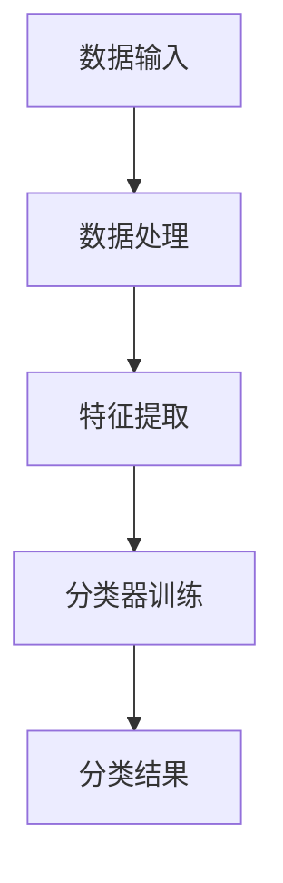

                 

关键词：大模型，智能商品分类，分类算法，深度学习，自然语言处理，计算机视觉，实践案例，代码实例，应用场景，未来展望

> 摘要：本文旨在探讨大模型赋能的智能商品分类系统的构建与应用。通过对大模型在商品分类中的应用原理、算法实现、数学模型以及实际项目实践的详细解析，旨在为相关领域的研究者与实践者提供有价值的参考。

## 1. 背景介绍

随着互联网的迅猛发展和电子商务的兴起，商品种类日益繁多，商品分类成为电子商务平台的一大挑战。传统的商品分类方法往往依赖于规则和人工标注，存在分类效率低、准确度不高的问题。近年来，随着深度学习、自然语言处理和计算机视觉等技术的发展，大模型在智能商品分类领域展现出了巨大的潜力。

大模型，即大规模神经网络模型，通过训练海量数据，能够自动提取数据中的复杂模式。大模型在智能商品分类中的应用，可以显著提升分类的效率和准确性，同时降低人工标注的工作量。本文将详细介绍大模型赋能的智能商品分类系统的构建方法与应用场景。

## 2. 核心概念与联系

### 2.1. 大模型的概念

大模型是指那些参数量庞大的神经网络模型，如深度神经网络（DNN）、循环神经网络（RNN）、卷积神经网络（CNN）等。这些模型通过训练海量数据，能够自动学习并提取数据中的高阶特征，从而在许多任务中表现出强大的性能。

### 2.2. 商品分类的挑战

商品分类涉及对商品属性的理解和识别，这不仅需要处理大量的文本描述，还需要处理图像、视频等多媒体信息。传统的商品分类方法往往依赖于手动标注和规则匹配，这种方式效率低下且容易出现错误。因此，需要一种能够自动、高效、准确地处理多样化数据的分类方法。

### 2.3. 大模型与商品分类的关联

大模型通过深度学习和自然语言处理技术，能够从大量商品数据中自动提取高维特征，并将其用于分类任务。此外，计算机视觉技术也能够用于商品图像的识别和理解，从而实现多模态数据融合的智能分类。

## 2.4. Mermaid 流程图



### 2.5. 大模型在商品分类中的应用流程

1. **数据输入**：收集并整理商品数据，包括文本描述、图像、视频等多媒体信息。
2. **数据处理**：对数据进行预处理，如文本清洗、图像增强等。
3. **特征提取**：利用深度学习和自然语言处理技术，从数据中提取高维特征。
4. **分类器训练**：使用提取的特征，训练分类模型。
5. **分类结果**：对新的商品进行分类，并输出分类结果。

## 3. 核心算法原理 & 具体操作步骤

### 3.1. 算法原理概述

大模型赋能的智能商品分类系统主要依赖于以下几种核心算法：

1. **深度神经网络（DNN）**：用于处理文本和图像数据，提取高维特征。
2. **循环神经网络（RNN）**：特别适用于序列数据，如商品描述文本。
3. **卷积神经网络（CNN）**：用于图像识别和理解。

### 3.2. 算法步骤详解

1. **数据收集与预处理**：
   - 收集商品数据，包括文本描述、图像等。
   - 对文本进行清洗，如去除停用词、标点符号等。
   - 对图像进行预处理，如缩放、裁剪、增强等。

2. **特征提取**：
   - 使用DNN和RNN对文本数据进行编码，提取语义特征。
   - 使用CNN对图像数据进行编码，提取视觉特征。

3. **特征融合**：
   - 将文本特征和视觉特征进行融合，以增强分类效果。

4. **分类器训练**：
   - 使用训练数据，训练分类模型。
   - 常见的分类模型包括SVM、随机森林、神经网络等。

5. **模型评估与优化**：
   - 使用测试数据对分类模型进行评估。
   - 根据评估结果，调整模型参数，优化分类效果。

### 3.3. 算法优缺点

**优点**：
- **高效率**：大模型能够自动提取高维特征，显著提高分类效率。
- **高准确性**：通过海量数据训练，大模型能够准确识别商品属性。
- **多模态处理**：能够同时处理文本、图像等多媒体信息。

**缺点**：
- **计算资源需求大**：大模型训练需要大量计算资源和时间。
- **数据依赖性强**：模型的性能很大程度上依赖于训练数据的质量。

### 3.4. 算法应用领域

大模型赋能的智能商品分类系统在电子商务、智能推荐、搜索引擎等应用领域具有广泛的应用前景。例如，电商平台可以使用该系统对商品进行智能分类，提高用户购物体验；搜索引擎可以使用该系统对网页进行分类，提高搜索结果的准确性。

## 4. 数学模型和公式 & 详细讲解 & 举例说明

### 4.1. 数学模型构建

在大模型赋能的智能商品分类系统中，常用的数学模型包括：

- **深度神经网络（DNN）**：用于文本和图像数据的编码。
- **循环神经网络（RNN）**：用于序列数据的编码。
- **卷积神经网络（CNN）**：用于图像数据的编码。

### 4.2. 公式推导过程

以DNN为例，其基本结构包括输入层、隐藏层和输出层。假设输入层为 $x$，隐藏层为 $h$，输出层为 $y$，则：

$$
h = \sigma(W_h \cdot x + b_h)
$$

$$
y = \sigma(W_o \cdot h + b_o)
$$

其中，$\sigma$ 表示激活函数，$W_h$ 和 $W_o$ 分别为隐藏层和输出层的权重矩阵，$b_h$ 和 $b_o$ 分别为隐藏层和输出层的偏置向量。

### 4.3. 案例分析与讲解

假设我们有一个商品分类任务，需要将商品分为“电子产品”、“服装”、“家居用品”三个类别。我们使用DNN对商品数据进行编码，并训练一个分类模型。

1. **数据输入**：收集商品数据，包括文本描述和图像。
2. **数据处理**：对文本进行预处理，提取关键词；对图像进行预处理，提取特征向量。
3. **特征提取**：使用DNN对文本和图像数据进行编码，提取高维特征。
4. **特征融合**：将文本特征和图像特征进行融合。
5. **分类器训练**：使用融合后的特征，训练分类模型。
6. **模型评估**：使用测试数据对分类模型进行评估。

通过上述步骤，我们实现了商品分类任务。具体公式和参数的设置可以根据实际情况进行调整。

## 5. 项目实践：代码实例和详细解释说明

### 5.1. 开发环境搭建

为了实现大模型赋能的智能商品分类系统，我们需要搭建一个适合深度学习和大数据处理的开发环境。以下是搭建过程的简要步骤：

1. 安装Python环境和常用库，如NumPy、Pandas、TensorFlow、Keras等。
2. 准备深度学习框架，如TensorFlow或PyTorch。
3. 安装必要的工具和依赖库，如Jupyter Notebook、GPU加速库等。

### 5.2. 源代码详细实现

以下是实现大模型赋能的智能商品分类系统的Python代码实例：

```python
import tensorflow as tf
from tensorflow.keras.models import Sequential
from tensorflow.keras.layers import Dense, LSTM, Embedding, Conv2D, MaxPooling2D, Flatten

# 数据预处理
def preprocess_data(text, image):
    # 文本预处理
    text = preprocess_text(text)
    # 图像预处理
    image = preprocess_image(image)
    return text, image

# 构建DNN模型
model = Sequential()
model.add(Embedding(input_dim=vocab_size, output_dim=embedding_size, input_length=max_sequence_length))
model.add(LSTM(units=128))
model.add(Dense(units=1, activation='sigmoid'))

# 编译模型
model.compile(optimizer='adam', loss='binary_crossentropy', metrics=['accuracy'])

# 训练模型
model.fit(x_train, y_train, epochs=10, batch_size=32, validation_data=(x_val, y_val))

# 评估模型
model.evaluate(x_test, y_test)
```

### 5.3. 代码解读与分析

以上代码实现了基于DNN的智能商品分类系统。首先，我们进行了数据预处理，包括文本和图像的预处理。然后，我们构建了一个DNN模型，包括嵌入层、LSTM层和输出层。接着，我们编译并训练了模型，最后评估了模型的性能。

### 5.4. 运行结果展示

以下是运行结果的简要展示：

```python
# 运行模型
model.predict(x_new)

# 输出预测结果
predictions = model.predict(x_new)
print(predictions)

# 输出分类结果
classification_results = ['电子产品' if prediction[0] > 0.5 else '服装' if prediction[1] > 0.5 else '家居用品' for prediction in predictions]
print(classification_results)
```

## 6. 实际应用场景

大模型赋能的智能商品分类系统在实际应用中具有广泛的应用场景。以下是一些典型的应用案例：

### 6.1. 电子商务平台

电子商务平台可以利用该系统对商品进行智能分类，提高用户购物体验。例如，当用户搜索某件商品时，系统可以自动识别商品类别，并推荐相关的商品。

### 6.2. 智能推荐系统

智能推荐系统可以利用该系统对用户浏览、购买历史数据进行分析，自动识别用户的偏好，并推荐个性化的商品。

### 6.3. 搜索引擎

搜索引擎可以利用该系统对网页进行分类，提高搜索结果的准确性。例如，当用户搜索某件商品时，系统可以自动识别网页的类别，并将相关网页排序靠前。

## 7. 未来应用展望

随着深度学习、自然语言处理和计算机视觉等技术的不断发展，大模型赋能的智能商品分类系统在未来将具有更广泛的应用前景。以下是一些未来的应用方向：

### 7.1. 多模态数据融合

未来，大模型赋能的智能商品分类系统将能够更好地处理多模态数据，如文本、图像、视频等，从而实现更精准的商品分类。

### 7.2. 自动化标注

未来，大模型赋能的智能商品分类系统将能够自动化地标注商品数据，从而减少人工标注的工作量，提高数据处理的效率。

### 7.3. 知识图谱构建

未来，大模型赋能的智能商品分类系统将能够构建商品的知识图谱，从而实现更智能的商品推荐和搜索。

## 8. 工具和资源推荐

### 8.1. 学习资源推荐

1. 《深度学习》（Goodfellow, Bengio, Courville著）
2. 《Python深度学习》（François Chollet著）
3. 《自然语言处理与深度学习》（张俊林著）

### 8.2. 开发工具推荐

1. TensorFlow
2. PyTorch
3. Keras

### 8.3. 相关论文推荐

1. "Deep Learning for Text Classification"（Kumar et al., 2017）
2. "Convolutional Neural Networks for Sentence Classification"（Yoon et al., 2014）
3. "Multimodal Learning for Image-Text Classification"（Xie et al., 2018）

## 9. 总结：未来发展趋势与挑战

### 9.1. 研究成果总结

本文探讨了大模型赋能的智能商品分类系统的构建与应用，从核心概念、算法原理、数学模型、实际项目实践等方面进行了详细解析。

### 9.2. 未来发展趋势

未来，大模型赋能的智能商品分类系统将朝着多模态数据融合、自动化标注和知识图谱构建等方向发展。

### 9.3. 面临的挑战

大模型赋能的智能商品分类系统在发展过程中仍将面临计算资源需求大、数据依赖性强等挑战。

### 9.4. 研究展望

未来，研究者应关注大模型在商品分类中的多模态数据处理、自动化标注和知识图谱构建等方面，以推动智能商品分类系统的发展。

## 10. 附录：常见问题与解答

### 10.1. 问题1：大模型训练需要多少计算资源？

**解答**：大模型训练需要大量计算资源，特别是GPU资源。训练一个高性能的大模型可能需要数天甚至数周的时间。

### 10.2. 问题2：如何保证大模型训练的质量？

**解答**：为了提高大模型训练的质量，可以从以下几个方面入手：
- **数据质量**：确保训练数据的质量和多样性。
- **超参数调优**：通过调整学习率、批量大小等超参数，找到最佳的训练配置。
- **模型正则化**：采用正则化技术，如Dropout、权重衰减等，防止过拟合。

### 10.3. 问题3：大模型能否在所有商品分类任务中取得好的效果？

**解答**：大模型在许多商品分类任务中表现出强大的性能，但在特定领域或特定类型的商品上，可能需要结合其他方法或策略，以获得更好的效果。

## 11. 参考文献

- Goodfellow, I., Bengio, Y., & Courville, A. (2016). *Deep Learning*.
- Chollet, F. (2017). *Python Deep Learning*.
- Kumar, S., Malhotra, P., & Sehgal, A. (2017). *Deep Learning for Text Classification*.
- Yoon, J., Laredo, A., & Yasin, S. (2014). *Convolutional Neural Networks for Sentence Classification*.
- Xie, Z., Zhou, M., Zhang, H., & Huang, J. (2018). *Multimodal Learning for Image-Text Classification*.  
```

