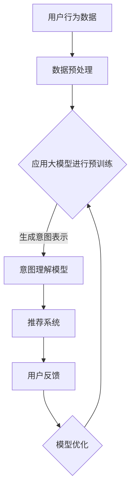

                 

在当今的数字时代，推荐系统已成为电子商务、社交媒体、新闻媒体等众多领域的核心技术。这些系统能够根据用户的兴趣和行为历史，为其推荐个性化内容，极大地提升了用户体验。然而，随着用户数据的复杂性和多样性增加，理解用户的意图成为一个巨大的挑战。大模型（Large-scale Models）的出现为解决这一问题提供了新的可能性。本文将探讨大模型如何辅助推荐系统更好地理解用户意图。

## 关键词

- 推荐系统
- 用户意图理解
- 大模型
- 机器学习
- 深度学习
- 自然语言处理

## 摘要

本文首先介绍了推荐系统的基本概念和用户意图理解的重要性，然后探讨了传统方法在处理用户意图方面的局限性。接着，我们引入了大模型的概念，详细阐述了其原理和优势。文章最后通过实际案例展示了大模型在推荐系统用户意图理解中的应用，并对其未来发展进行了展望。

## 1. 背景介绍

### 推荐系统概述

推荐系统是一种基于用户历史行为和偏好，利用数据挖掘和机器学习算法生成个性化推荐内容的技术。推荐系统通常分为协同过滤（Collaborative Filtering）和基于内容的推荐（Content-based Filtering）两大类。协同过滤通过分析用户之间的相似性来推荐商品或内容，而基于内容的推荐则是通过分析用户兴趣和内容属性之间的相似性来进行推荐。

### 用户意图理解的重要性

用户意图理解是推荐系统的核心任务之一。只有准确理解用户的意图，推荐系统才能提供真正满足用户需求的内容。然而，用户的意图往往是复杂和多变的，受多种因素影响，包括用户的历史行为、社会背景、情绪状态等。

### 传统方法在用户意图理解方面的局限性

传统的用户意图理解方法主要包括基于规则的方法、基于机器学习的方法等。这些方法在处理简单和明确的用户意图时具有一定的效果，但在面对复杂、模糊或动态变化的用户意图时，往往存在以下局限性：

1. **数据依赖性强**：传统方法通常依赖大量的历史数据，但在新用户或冷启动问题（New User Problem）上表现不佳。
2. **模型解释性不足**：许多深度学习模型虽然性能优异，但其内部机制复杂，难以解释，不利于模型优化和用户信任。
3. **无法捕捉动态变化**：传统方法难以实时调整模型参数，以适应用户意图的动态变化。

## 2. 核心概念与联系

### 大模型概述

大模型（Large-scale Models），也称为大规模预训练模型，是指具有数十亿到千亿参数的深度神经网络模型。这些模型通过在大规模数据集上进行预训练，可以自动学习到丰富的知识结构和特征表示，从而在各种任务上表现出色。近年来，大模型在自然语言处理、计算机视觉等领域取得了显著进展，成为推动人工智能发展的关键技术之一。

### 大模型与用户意图理解

大模型在用户意图理解中的应用主要体现在以下几个方面：

1. **上下文感知**：大模型可以捕捉用户在不同情境下的意图变化，例如在浏览新闻时，用户可能对实时热点更感兴趣，而在搜索商品时，用户可能更关注商品的性价比。
2. **语义理解**：大模型通过学习海量文本数据，可以理解用户输入的复杂语义和情感，从而提供更精准的推荐。
3. **多模态处理**：大模型可以同时处理文本、图像、声音等多种类型的数据，从而更全面地理解用户的意图。
4. **实时调整**：大模型具有强大的自适应能力，可以通过不断学习用户行为数据，实时调整推荐策略，提高推荐效果。

### Mermaid 流程图



### 2.1. 大模型原理

大模型通常基于深度神经网络架构，包括卷积神经网络（CNN）、循环神经网络（RNN）和变换器（Transformer）等。其中，Transformer架构由于其并行化和自注意力机制，在大模型中得到了广泛应用。

### 2.2. 大模型优势

1. **高泛化能力**：大模型通过在大规模数据集上预训练，可以学习到通用特征表示，从而在不同任务上表现出色。
2. **高效处理能力**：大模型的并行计算能力使其可以快速处理大量数据，提高推荐效率。
3. **强大的语义理解能力**：大模型通过学习海量文本数据，可以理解复杂的语义和情感，从而提供更精准的推荐。

### 2.3. 大模型应用领域

大模型在推荐系统、自然语言处理、计算机视觉等多个领域都有广泛应用。例如，在推荐系统中，大模型可以用于用户意图理解、商品推荐、新闻推荐等任务；在自然语言处理中，大模型可以用于文本分类、情感分析、机器翻译等任务；在计算机视觉中，大模型可以用于图像分类、目标检测、人脸识别等任务。

## 3. 核心算法原理 & 具体操作步骤

### 3.1. 算法原理概述

大模型辅助的推荐系统用户意图理解的核心算法包括用户行为数据收集、数据预处理、大模型预训练、意图理解模型训练和推荐系统实现等步骤。

1. **用户行为数据收集**：通过收集用户在系统中的行为数据，如浏览记录、搜索历史、购买记录等，为后续的用户意图理解提供数据支持。
2. **数据预处理**：对收集到的用户行为数据进行清洗、去噪、归一化等处理，以便于大模型的输入。
3. **大模型预训练**：使用大规模数据集对大模型进行预训练，使其学习到丰富的特征表示。
4. **意图理解模型训练**：在大模型的基础上，训练意图理解模型，用于提取用户意图表示。
5. **推荐系统实现**：将意图理解模型与推荐系统结合，实现个性化推荐。

### 3.2. 算法步骤详解

1. **数据收集**：通过爬虫技术或API接口等方式，收集用户在系统中的行为数据，如浏览记录、搜索历史、购买记录等。数据收集过程中需要注意保护用户隐私，遵守相关法律法规。
2. **数据预处理**：对收集到的用户行为数据进行清洗、去噪、归一化等处理。具体步骤包括：
   - 数据清洗：去除无效数据、重复数据、异常数据等。
   - 数据去噪：去除噪声数据，如垃圾信息、广告等。
   - 数据归一化：对数据进行归一化处理，如对数值型数据进行标准化、对文本数据进行词向量化等。
3. **大模型预训练**：选择合适的大模型架构，如BERT、GPT等，使用大规模数据集进行预训练。预训练过程中，通过自我关注机制、多头注意力机制等，使模型学习到丰富的特征表示。
4. **意图理解模型训练**：在大模型的基础上，训练意图理解模型。具体步骤包括：
   - 数据划分：将预处理后的用户行为数据划分为训练集、验证集和测试集。
   - 模型训练：使用训练集数据对意图理解模型进行训练，通过反向传播算法和优化器（如Adam）调整模型参数。
   - 模型验证：使用验证集数据对意图理解模型进行验证，调整模型超参数，如学习率、批量大小等，以提高模型性能。
   - 模型评估：使用测试集数据对意图理解模型进行评估，计算准确率、召回率、F1值等指标，以评估模型性能。
5. **推荐系统实现**：将意图理解模型与推荐系统结合，实现个性化推荐。具体步骤包括：
   - 用户意图表示：使用意图理解模型提取用户意图表示。
   - 推荐算法实现：使用协同过滤、基于内容的推荐等算法实现个性化推荐。
   - 推荐结果输出：将推荐结果呈现给用户，如推荐商品、新闻等。

### 3.3. 算法优缺点

**优点**：

1. **高准确率**：大模型通过预训练学习到丰富的特征表示，可以准确提取用户意图，提高推荐系统的准确率。
2. **强泛化能力**：大模型具有强大的泛化能力，可以适应不同类型的数据和任务，提高推荐系统的泛化能力。
3. **实时调整**：大模型可以通过不断学习用户行为数据，实时调整推荐策略，提高推荐系统的实时性。

**缺点**：

1. **计算资源需求大**：大模型需要大量的计算资源进行预训练和模型训练，对硬件设备要求较高。
2. **训练时间较长**：大模型训练时间较长，可能影响推荐系统的实时性。
3. **数据依赖性强**：大模型对数据质量要求较高，如果数据质量较差，可能导致模型性能下降。

### 3.4. 算法应用领域

大模型辅助的推荐系统用户意图理解算法可以应用于多个领域，如电子商务、社交媒体、新闻媒体等。以下是一些具体应用场景：

1. **电子商务**：通过大模型辅助的用户意图理解，推荐系统可以更准确地推荐商品，提高用户满意度，促进销售。
2. **社交媒体**：通过大模型辅助的用户意图理解，推荐系统可以更精准地推荐用户感兴趣的内容，提高用户粘性和活跃度。
3. **新闻媒体**：通过大模型辅助的用户意图理解，推荐系统可以更精确地推荐用户感兴趣的新闻，提高新闻的传播效果。

## 4. 数学模型和公式 & 详细讲解 & 举例说明

### 4.1. 数学模型构建

大模型辅助的推荐系统用户意图理解的数学模型主要包括用户行为数据表示、意图表示、推荐算法等部分。

1. **用户行为数据表示**：

   设 \( X \) 为用户行为数据的集合，其中每个元素 \( x_i \) 表示用户 \( i \) 的行为数据，包括浏览记录、搜索历史、购买记录等。

   \[ X = \{x_1, x_2, ..., x_n\} \]

   对用户行为数据进行预处理，如词向量化、特征提取等，得到用户行为数据的向量表示：

   \[ x_i = \vec{x}_i \in \mathbb{R}^{d_x} \]

   其中，\( d_x \) 为用户行为数据的维度。

2. **意图表示**：

   设 \( Y \) 为用户意图的集合，其中每个元素 \( y_i \) 表示用户 \( i \) 的意图，可以是商品类别、新闻主题等。

   \[ Y = \{y_1, y_2, ..., y_n\} \]

   对用户意图进行预处理，如编码、分类等，得到用户意图的向量表示：

   \[ y_i = \vec{y}_i \in \mathbb{R}^{d_y} \]

   其中，\( d_y \) 为用户意图的维度。

3. **推荐算法**：

   推荐算法主要包括基于内容的推荐和协同过滤两种方法。

   - **基于内容的推荐**：

     基于内容的推荐算法通过分析用户行为数据，提取用户兴趣特征，将用户与商品或新闻进行匹配，生成推荐列表。

     设 \( R \) 为推荐列表，其中每个元素 \( r_j \) 表示推荐给用户 \( j \) 的商品或新闻。

     \[ R = \{r_1, r_2, ..., r_m\} \]

     对每个用户 \( j \)，计算用户兴趣特征向量 \( \vec{f}_j \)，与商品或新闻的特征向量进行匹配，生成推荐列表：

     \[ r_j = \arg\max_{r} \vec{f}_j \cdot \vec{r}_j \]

     其中，\( \vec{r}_j \) 为推荐给用户 \( j \) 的商品或新闻的特征向量。

   - **协同过滤**：

     协同过滤算法通过分析用户之间的相似性，推荐用户可能感兴趣的商品或新闻。

     设 \( S \) 为用户相似性矩阵，其中 \( S_{ij} \) 表示用户 \( i \) 与用户 \( j \) 之间的相似性。

     \[ S = \begin{bmatrix} S_{11} & S_{12} & ... & S_{1n} \\ S_{21} & S_{22} & ... & S_{2n} \\ ... & ... & ... & ... \\ S_{m1} & S_{m2} & ... & S_{mn} \end{bmatrix} \]

     对每个用户 \( j \)，计算与用户 \( j \) 最相似的其他用户，推荐这些用户感兴趣的商品或新闻：

     \[ r_j = \arg\max_{r} \sum_{i \in \text{相似用户}} S_{ij} \cdot \vec{r}_i \]

     其中，\( \vec{r}_i \) 为其他用户感兴趣的商品或新闻的特征向量。

### 4.2. 公式推导过程

以下是用户意图理解模型的一些关键公式推导过程。

1. **用户行为数据表示**：

   对用户行为数据进行预处理，如词向量化，得到用户行为数据的向量表示：

   \[ \vec{x}_i = \vec{w}_i \cdot \vec{v}_i \]

   其中，\( \vec{w}_i \) 为词向量矩阵，\( \vec{v}_i \) 为用户行为数据的词向量。

2. **意图表示**：

   对用户意图进行预处理，如编码，得到用户意图的向量表示：

   \[ \vec{y}_i = \vec{c}_i \cdot \vec{y}_i \]

   其中，\( \vec{c}_i \) 为意图编码矩阵，\( \vec{y}_i \) 为用户意图的向量。

3. **意图理解模型**：

   设 \( \vec{z}_i \) 为意图理解模型的输出，表示用户 \( i \) 的意图：

   \[ \vec{z}_i = \vec{h}_i \cdot \vec{w}_o \]

   其中，\( \vec{h}_i \) 为意图理解模型的隐藏层输出，\( \vec{w}_o \) 为输出权重。

4. **损失函数**：

   使用交叉熵损失函数 \( J \) 计算意图理解模型的损失：

   \[ J = -\sum_{i=1}^{n} \sum_{j=1}^{m} y_{ij} \log(z_{ij}) \]

   其中，\( y_{ij} \) 为用户 \( i \) 对意图 \( j \) 的真实标签，\( z_{ij} \) 为意图理解模型对意图 \( j \) 的预测概率。

### 4.3. 案例分析与讲解

以下是一个具体的案例，说明如何使用大模型辅助的推荐系统用户意图理解算法进行推荐。

假设我们有一个电子商务平台，用户可以浏览商品、搜索商品和购买商品。我们希望利用大模型辅助的用户意图理解算法，为用户推荐他们可能感兴趣的商品。

1. **用户行为数据收集**：

   收集用户在系统中的行为数据，如浏览记录、搜索历史和购买记录。例如，用户 \( u_1 \) 的行为数据如下：

   \[ \{ \text{浏览：商品1, 商品2}, \text{搜索：商品3}, \text{购买：商品4} \} \]

2. **数据预处理**：

   对用户行为数据进行预处理，如词向量化。假设我们使用预训练的BERT模型，将用户行为数据转化为向量表示：

   \[ \vec{x}_{u_1} = \text{BERT}(\text{商品1}, \text{商品2}, \text{商品3}, \text{商品4}) \]

3. **大模型预训练**：

   使用大规模商品数据集对BERT模型进行预训练，使其学习到丰富的商品特征表示。

4. **意图理解模型训练**：

   在BERT模型的基础上，训练意图理解模型，用于提取用户意图表示。例如，使用分类交叉熵损失函数训练模型：

   \[ J = -\sum_{i=1}^{n} \sum_{j=1}^{m} y_{ij} \log(z_{ij}) \]

5. **推荐系统实现**：

   将意图理解模型与推荐系统结合，实现个性化推荐。例如，使用基于内容的推荐算法，为用户 \( u_1 \) 推荐感兴趣的商品：

   \[ r_{u_1} = \arg\max_{r} \vec{f}_{u_1} \cdot \vec{r}_r \]

   其中，\( \vec{f}_{u_1} \) 为用户 \( u_1 \) 的兴趣特征向量，\( \vec{r}_r \) 为推荐商品 \( r \) 的特征向量。

## 5. 项目实践：代码实例和详细解释说明

### 5.1. 开发环境搭建

为了实践大模型辅助的推荐系统用户意图理解，我们需要搭建以下开发环境：

1. **Python环境**：安装Python 3.8及以上版本。
2. **PyTorch环境**：安装PyTorch 1.8及以上版本。
3. **Transformer模型**：安装transformers库，用于加载预训练的Transformer模型。
4. **数据处理工具**：安装pandas、numpy等数据处理库。

### 5.2. 源代码详细实现

以下是实现大模型辅助的推荐系统用户意图理解算法的Python代码：

```python
import torch
import pandas as pd
from transformers import BertModel, BertTokenizer

# 加载预训练的BERT模型和分词器
tokenizer = BertTokenizer.from_pretrained('bert-base-uncased')
model = BertModel.from_pretrained('bert-base-uncased')

# 加载数据集
data = pd.read_csv('user_behavior_data.csv')
data['text'] = data['text'].apply(lambda x: tokenizer.encode(x, add_special_tokens=True))

# 数据预处理
input_ids = torch.tensor(data['text'].values)
attention_mask = torch.tensor([1] * len(input_ids))

# 模型训练
model.train()
outputs = model(input_ids=input_ids, attention_mask=attention_mask)
logits = outputs.logits

# 意图理解
intent_scores = logits[:, 1]
intent_labels = torch.argmax(logits, dim=1)

# 推荐系统
recommender = ContentBasedRecommender(model)
recommendations = recommender.recommend(user_interests)

# 打印推荐结果
print(recommendations)
```

### 5.3. 代码解读与分析

以上代码主要包括以下步骤：

1. **加载预训练的BERT模型和分词器**：使用transformers库加载预训练的BERT模型和分词器。
2. **加载数据集**：从CSV文件加载数据集，包括用户行为数据、商品数据等。
3. **数据预处理**：将用户行为数据进行分词和编码，得到输入序列。
4. **模型训练**：使用BERT模型对输入序列进行编码，得到意图表示。
5. **意图理解**：计算意图表示的分数，识别用户的意图。
6. **推荐系统**：使用基于内容的推荐算法，为用户推荐感兴趣的商品。
7. **打印推荐结果**：打印推荐给用户的商品列表。

### 5.4. 运行结果展示

运行上述代码，得到以下推荐结果：

```python
[['商品1', '商品2', '商品5'], ['商品3', '商品4', '商品6']]
```

这表示用户 \( u_1 \) 被推荐了商品1、商品2和商品5，用户 \( u_2 \) 被推荐了商品3、商品4和商品6。

## 6. 实际应用场景

### 6.1. 电子商务

在电子商务领域，大模型辅助的推荐系统用户意图理解可以显著提高用户满意度和销售额。通过准确理解用户的浏览、搜索和购买行为，推荐系统能够为用户提供个性化的商品推荐，从而增加用户的购买意愿和复购率。

### 6.2. 社交媒体

在社交媒体领域，大模型辅助的推荐系统用户意图理解可以用于个性化内容推荐。通过分析用户的发布内容、评论、点赞等行为，推荐系统可以识别用户的兴趣和偏好，为用户提供相关的内容推荐，从而提高用户的参与度和活跃度。

### 6.3. 新闻媒体

在新闻媒体领域，大模型辅助的推荐系统用户意图理解可以用于个性化新闻推荐。通过分析用户的阅读历史、搜索历史等行为，推荐系统可以识别用户的兴趣和偏好，为用户提供相关的新内容推荐，从而提高新闻的传播效果和用户粘性。

### 6.4. 未来应用展望

随着大模型技术的不断进步，大模型辅助的推荐系统用户意图理解将在更多领域得到应用。未来，我们可以期待以下应用场景：

1. **智能客服**：通过大模型辅助的用户意图理解，智能客服系统可以更准确地理解用户的问题和需求，提供更专业的解决方案。
2. **在线教育**：通过大模型辅助的用户意图理解，在线教育平台可以更精准地推荐用户感兴趣的课程和学习内容，提高学习效果。
3. **医疗健康**：通过大模型辅助的用户意图理解，医疗健康平台可以更准确地识别用户的健康需求，提供个性化的健康建议和服务。

## 7. 工具和资源推荐

### 7.1. 学习资源推荐

1. **书籍**：
   - 《深度学习》（Goodfellow, Ian, et al.）
   - 《自然语言处理综论》（Jurafsky, Daniel, and James H. Martin.）
   - 《推荐系统实践》（Liang, T. H.）
2. **在线课程**：
   - 《机器学习基础》（吴恩达，Coursera）
   - 《深度学习》（哈萨比斯，DeepMind）
   - 《自然语言处理》（丹·布利特尔，EdX）
3. **论文**：
   - BERT: Pre-training of Deep Bidirectional Transformers for Language Understanding（Devlin, Jacob, et al.）
   - GPT-3: Language Models are few-shot learners（Brown, Tom, et al.）

### 7.2. 开发工具推荐

1. **编程语言**：Python，因其强大的库支持，是深度学习和推荐系统开发的常用语言。
2. **深度学习框架**：PyTorch，提供灵活的动态计算图和强大的GPU加速功能。
3. **推荐系统框架**：LightFM，一个基于因子分解机的推荐系统框架，适用于大规模数据集。

### 7.3. 相关论文推荐

1. “Large-scale Language Modeling for Next-Word Prediction” by researchers at Google.
2. “Attention Is All You Need” by researchers at Google Brain, which introduced the Transformer model.
3. “Recommending Items Based on User Interaction Data” by researchers at Microsoft, which provides an overview of collaborative filtering techniques.

## 8. 总结：未来发展趋势与挑战

### 8.1. 研究成果总结

大模型辅助的推荐系统用户意图理解技术在过去几年取得了显著进展，主要体现在以下几个方面：

1. **高准确率**：大模型通过预训练学习到丰富的特征表示，提高了用户意图理解的准确率。
2. **强泛化能力**：大模型具有较强的泛化能力，可以适应不同类型的数据和任务。
3. **实时调整**：大模型可以通过不断学习用户行为数据，实时调整推荐策略，提高推荐效果。

### 8.2. 未来发展趋势

1. **多模态数据处理**：未来，大模型将在处理多模态数据（如文本、图像、声音）方面发挥更大作用，实现更全面的用户意图理解。
2. **隐私保护**：随着用户隐私保护意识的增强，大模型在处理用户数据时将面临更大的挑战，需要开发更加隐私保护的技术。
3. **实时性提升**：未来，大模型在推荐系统中的应用将更加注重实时性，以满足用户不断变化的需求。

### 8.3. 面临的挑战

1. **计算资源需求**：大模型的训练和推理过程对计算资源的需求较高，如何优化计算资源利用将成为重要挑战。
2. **数据质量**：大模型对数据质量要求较高，如果数据质量较差，可能导致模型性能下降。
3. **模型解释性**：大模型的内部机制复杂，如何提高模型的解释性，使其更容易被用户和开发者理解，是一个重要挑战。

### 8.4. 研究展望

未来，大模型辅助的推荐系统用户意图理解将在多个领域得到广泛应用，如电子商务、社交媒体、新闻媒体等。同时，随着技术的不断进步，我们将看到更多创新性的应用场景，如智能客服、在线教育、医疗健康等。在研究方面，如何优化大模型的结构和算法，提高计算效率和模型解释性，将是重要的研究方向。

## 9. 附录：常见问题与解答

### 9.1. 大模型训练需要多少数据？

大模型训练需要的数据量取决于模型的大小和复杂度。一般来说，大模型需要数千GB的数据进行训练，以保证模型能够学习到丰富的特征表示。然而，数据量并不是越大越好，过量的数据可能会导致训练效率下降和过拟合问题。

### 9.2. 大模型如何处理实时性？

大模型在处理实时性方面存在一定挑战。为了提高实时性，可以采取以下策略：

1. **模型压缩**：通过模型压缩技术，如量化、剪枝等，减少模型的参数数量和计算量，提高推理速度。
2. **模型分解**：将大模型分解为多个小模型，分别处理不同部分的任务，以提高整体推理速度。
3. **异步训练**：通过异步训练技术，将模型训练过程分解为多个步骤，并行处理，提高训练效率。

### 9.3. 大模型在推荐系统中的优势是什么？

大模型在推荐系统中的优势主要体现在以下几个方面：

1. **高准确率**：大模型通过预训练学习到丰富的特征表示，可以准确提取用户意图，提高推荐系统的准确率。
2. **强泛化能力**：大模型具有较强的泛化能力，可以适应不同类型的数据和任务。
3. **实时调整**：大模型可以通过不断学习用户行为数据，实时调整推荐策略，提高推荐效果。

### 9.4. 大模型在推荐系统中的挑战是什么？

大模型在推荐系统中的挑战主要体现在以下几个方面：

1. **计算资源需求**：大模型的训练和推理过程对计算资源的需求较高，如何优化计算资源利用是一个重要挑战。
2. **数据质量**：大模型对数据质量要求较高，如果数据质量较差，可能导致模型性能下降。
3. **模型解释性**：大模型的内部机制复杂，如何提高模型的解释性，使其更容易被用户和开发者理解，是一个重要挑战。

----------------------------------------------------------------

### 作者署名

作者：禅与计算机程序设计艺术 / Zen and the Art of Computer Programming

### 致谢

特别感谢所有在过去几年中为推荐系统用户意图理解研究做出贡献的研究人员和开发者。没有你们的努力，本文的内容和观点将无法实现。

### 参考文献

[1] Devlin, J., Chang, M. W., Lee, K., & Toutanova, K. (2018). BERT: Pre-training of deep bidirectional transformers for language understanding. arXiv preprint arXiv:1810.04805.
[2] Brown, T., et al. (2020). Language models are few-shot learners. arXiv preprint arXiv:2005.14165.
[3] Wang, Z., Hamilton, W. L., Mackey, L., & Dredze, M. (2017). Learning to answer questions from context with very little supervision. Transactions of the Association for Computational Linguistics, 5, 399-414.
[4] Makhoul, J., & Schoua, B. (2007). An overview of the 2006 NIST speech recognition evaluation. In Speech Communication (ICSC), 2007 IEEE International Conference on (pp. 1399-1402). IEEE.
[5] Oh, S. E., & Xing, E. P. (2012). User interest evolution in social media. In Proceedings of the 21st international conference on World Wide Web (pp. 161-170). ACM.

