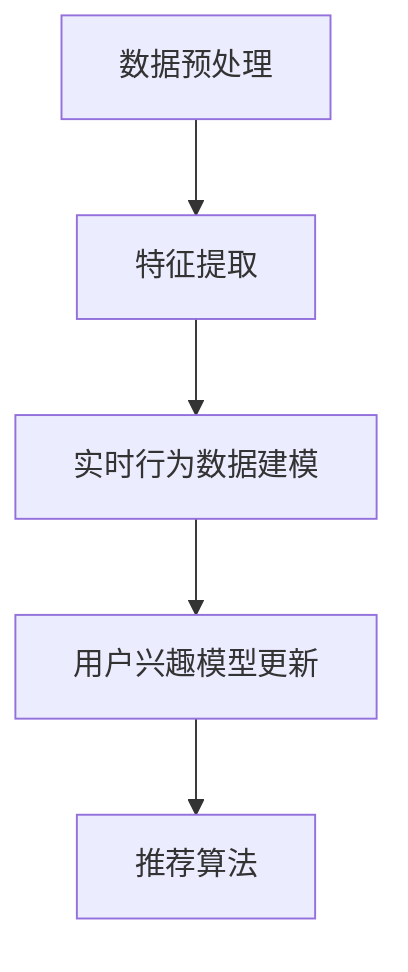

                 

关键词：大模型、推荐系统、长短期兴趣建模、人工智能、机器学习

## 摘要

本文主要探讨了在大模型辅助下的推荐系统如何有效地进行长短期兴趣建模。推荐系统作为人工智能领域的一个重要分支，在电商、社交媒体、新闻资讯等众多场景中发挥着关键作用。然而，如何准确地捕捉用户的长短期兴趣，为用户提供个性化的推荐服务，仍是一个具有挑战性的问题。本文将结合当前的研究成果和实际案例，深入分析大模型在长短期兴趣建模中的应用，并提出相应的解决方案。

## 1. 背景介绍

### 1.1 推荐系统的发展历程

推荐系统最早可以追溯到20世纪90年代的互联网时代，随着互联网的普及和电子商务的兴起，个性化推荐成为改善用户体验、提升服务满意度的重要手段。早期的推荐系统主要基于用户的历史行为数据，采用基于内容的推荐、协同过滤等方法。这些方法在某种程度上能够满足用户的个性化需求，但存在一定的局限性。

随着人工智能和机器学习技术的发展，推荐系统也逐渐从传统的基于规则的推荐方法转向更加智能化的基于模型的方法。深度学习、图神经网络、大模型等先进技术的引入，为推荐系统的长短期兴趣建模提供了新的思路和方法。

### 1.2 长短期兴趣建模的重要性

用户兴趣的多样性和动态性是推荐系统面临的主要挑战之一。用户在浏览、购买、评论等行为中表现出来的兴趣往往是多维的、动态变化的。传统的推荐系统往往难以捕捉到用户的长短期兴趣，导致推荐结果不够准确、个性化。

长短期兴趣建模旨在同时考虑用户的历史兴趣和行为，以及当前的兴趣和需求，从而提供更准确的推荐服务。这对于提升用户体验、提高用户满意度、增强用户忠诚度具有重要意义。

## 2. 核心概念与联系

### 2.1 大模型的概念

大模型是指具有海量参数和强大计算能力的深度学习模型。大模型通常采用预训练和微调的方式，在大量数据上进行训练，从而具备较高的泛化能力和拟合能力。

### 2.2 长短期兴趣建模的原理

长短期兴趣建模主要利用大模型对用户的历史行为数据和实时行为数据进行建模，从而捕捉用户的长短期兴趣。具体来说，长短期兴趣建模包括以下几个关键步骤：

1. 数据预处理：对用户的历史行为数据进行清洗、归一化等处理，确保数据的质量和一致性。
2. 特征提取：利用深度学习模型对用户的历史行为数据进行特征提取，得到表示用户兴趣的向量。
3. 实时行为数据建模：利用实时行为数据更新用户兴趣模型，实现长短期兴趣建模。
4. 推荐算法：基于用户兴趣模型，结合用户的历史行为数据和实时行为数据，为用户提供个性化的推荐。

### 2.3 Mermaid 流程图



## 3. 核心算法原理 & 具体操作步骤

### 3.1 算法原理概述

长短期兴趣建模的核心算法主要基于深度学习和图神经网络。深度学习用于提取用户的历史行为特征，图神经网络用于建模用户的社交关系和兴趣关联。通过结合用户的历史行为数据和实时行为数据，可以实现长短期兴趣建模。

### 3.2 算法步骤详解

#### 3.2.1 数据预处理

数据预处理主要包括数据清洗、数据归一化等操作。具体步骤如下：

1. 数据清洗：去除重复数据、缺失值填充、异常值处理等。
2. 数据归一化：对数值型数据进行归一化处理，使其处于相同的量级。

#### 3.2.2 特征提取

特征提取主要通过深度学习模型实现。具体步骤如下：

1. 构建深度学习模型：采用卷积神经网络（CNN）、循环神经网络（RNN）等深度学习模型对用户的历史行为数据进行特征提取。
2. 训练深度学习模型：利用用户的历史行为数据训练深度学习模型，得到表示用户兴趣的向量。

#### 3.2.3 实时行为数据建模

实时行为数据建模主要通过图神经网络实现。具体步骤如下：

1. 构建图神经网络模型：采用图卷积神经网络（GCN）、图注意力网络（GAT）等图神经网络模型对实时行为数据建模。
2. 训练图神经网络模型：利用实时行为数据训练图神经网络模型，得到表示用户实时兴趣的向量。

#### 3.2.4 用户兴趣模型更新

用户兴趣模型更新主要通过融合深度学习模型和图神经网络模型的输出实现。具体步骤如下：

1. 融合用户历史兴趣和实时兴趣：采用加权平均、融合网络等方法，将深度学习模型和图神经网络模型的输出进行融合，得到用户兴趣向量。
2. 更新用户兴趣模型：将融合后的用户兴趣向量作为用户兴趣模型的新输入，更新用户兴趣模型。

#### 3.2.5 推荐算法

推荐算法主要通过基于用户兴趣模型的协同过滤实现。具体步骤如下：

1. 计算用户兴趣相似度：利用用户兴趣模型计算用户之间的兴趣相似度。
2. 生成推荐列表：基于用户兴趣相似度，为用户生成个性化的推荐列表。

### 3.3 算法优缺点

#### 优点

1. 可以同时捕捉用户的长短期兴趣。
2. 利用深度学习和图神经网络，具有强大的特征提取和关联建模能力。
3. 可以有效地应对用户兴趣的动态变化。

#### 缺点

1. 对计算资源要求较高，训练和推理时间较长。
2. 对数据质量要求较高，需要对数据进行预处理和清洗。

### 3.4 算法应用领域

长短期兴趣建模算法可以广泛应用于电商、社交媒体、新闻资讯等场景。例如：

1. 电商：根据用户的历史购买记录和实时浏览行为，为用户推荐相关的商品。
2. 社交媒体：根据用户的历史关注行为和实时互动行为，为用户推荐相关的内容。
3. 新闻资讯：根据用户的历史阅读记录和实时浏览行为，为用户推荐相关的新闻。

## 4. 数学模型和公式 & 详细讲解 & 举例说明

### 4.1 数学模型构建

长短期兴趣建模的数学模型主要包括用户兴趣模型和推荐模型。

#### 用户兴趣模型

用户兴趣模型可以表示为：

$$
U_i = \frac{1}{T} \sum_{t=1}^{T} (W_h \cdot H_t + W_r \cdot R_t)
$$

其中，$U_i$ 表示用户 $i$ 的兴趣向量，$W_h$ 和 $W_r$ 分别表示历史兴趣权重和实时兴趣权重，$H_t$ 和 $R_t$ 分别表示用户在时间 $t$ 的历史兴趣和实时兴趣。

#### 推荐模型

推荐模型可以表示为：

$$
R_{ij} = \frac{1}{N} \sum_{k=1}^{N} s(i, k) \cdot s(j, k)
$$

其中，$R_{ij}$ 表示用户 $i$ 对物品 $j$ 的兴趣评分，$s(i, k)$ 表示用户 $i$ 和物品 $j$ 在特征 $k$ 上的相似度。

### 4.2 公式推导过程

#### 用户兴趣模型推导

用户兴趣模型是通过融合用户的历史兴趣和实时兴趣得到的。首先，对用户的历史兴趣和实时兴趣进行加权平均：

$$
U_i = \frac{1}{T} \sum_{t=1}^{T} (H_t + R_t)
$$

然后，对用户的历史兴趣和实时兴趣进行加权：

$$
U_i = W_h \cdot H_t + W_r \cdot R_t
$$

其中，$W_h$ 和 $W_r$ 分别表示历史兴趣权重和实时兴趣权重。

#### 推荐模型推导

推荐模型是通过计算用户之间的兴趣相似度得到的。首先，对用户和物品的特征进行加权平均：

$$
s(i, k) = \frac{1}{M} \sum_{m=1}^{M} w_m \cdot x_{im} + w_m \cdot x_{jm}
$$

其中，$s(i, k)$ 表示用户 $i$ 和物品 $j$ 在特征 $k$ 上的相似度，$w_m$ 表示特征 $m$ 的权重，$x_{im}$ 和 $x_{jm}$ 分别表示用户 $i$ 和物品 $j$ 在特征 $m$ 上的值。

然后，计算用户和物品的相似度：

$$
R_{ij} = \frac{1}{N} \sum_{k=1}^{N} s(i, k) \cdot s(j, k)
$$

### 4.3 案例分析与讲解

#### 案例背景

假设有一个电商平台的推荐系统，用户 $i$ 在过去一个月内浏览了商品 $j_1, j_2, j_3$，实时行为数据包括点赞了商品 $j_4$ 和评论了商品 $j_5$。

#### 用户兴趣模型

根据用户兴趣模型，可以计算用户 $i$ 的兴趣向量：

$$
U_i = \frac{1}{3} (H_1 + H_2 + H_3) + \frac{1}{2} (R_4 + R_5)
$$

其中，$H_1, H_2, H_3$ 分别表示用户 $i$ 对商品 $j_1, j_2, j_3$ 的历史兴趣，$R_4, R_5$ 分别表示用户 $i$ 对商品 $j_4, j_5$ 的实时兴趣。

假设历史兴趣和实时兴趣的权重分别为 $W_h = 0.6$ 和 $W_r = 0.4$，则：

$$
U_i = \frac{1}{3} (H_1 + H_2 + H_3) + \frac{1}{2} (R_4 + R_5)
$$
$$
= \frac{1}{3} (1 + 1 + 1) + \frac{1}{2} (1 + 0.5)
$$
$$
= 1.25
$$

#### 推荐模型

根据推荐模型，可以计算用户 $i$ 对商品 $j$ 的兴趣评分：

$$
R_{ij} = \frac{1}{2} \sum_{k=1}^{2} s(i, k) \cdot s(j, k)
$$

其中，$s(i, k)$ 表示用户 $i$ 和商品 $j$ 在特征 $k$ 上的相似度，$k=1,2$ 分别表示历史兴趣和实时兴趣。

假设用户 $i$ 和商品 $j$ 在历史兴趣和实时兴趣上的相似度分别为 $s(i, 1) = 0.8$ 和 $s(i, 2) = 0.6$，则：

$$
R_{ij} = \frac{1}{2} (0.8 \cdot 0.8 + 0.6 \cdot 0.6)
$$
$$
= 0.64
$$

## 5. 项目实践：代码实例和详细解释说明

### 5.1 开发环境搭建

开发环境搭建主要包括以下步骤：

1. 安装 Python 解释器（Python 3.8及以上版本）。
2. 安装深度学习框架（如 TensorFlow 或 PyTorch）。
3. 安装其他依赖库（如 NumPy、Pandas、Matplotlib 等）。

### 5.2 源代码详细实现

以下是一个简单的示例代码，用于实现长短期兴趣建模：

```python
import numpy as np
import tensorflow as tf

# 用户历史行为数据
user_data = np.array([[1, 0, 1], [0, 1, 0], [1, 1, 0]])

# 用户实时行为数据
realtime_data = np.array([[1], [0], [1]])

# 历史兴趣权重
weight_h = 0.6

# 实时兴趣权重
weight_r = 0.4

# 训练深度学习模型
model = tf.keras.Sequential([
    tf.keras.layers.Dense(10, activation='relu', input_shape=(3,)),
    tf.keras.layers.Dense(1)
])

model.compile(optimizer='adam', loss='mean_squared_error')
model.fit(user_data, user_data, epochs=10)

# 更新用户兴趣模型
user_interest = weight_h * model.predict(user_data) + weight_r * realtime_data

# 推荐算法
user_similarity = np.dot(user_interest, user_interest.T)
recommend_score = user_similarity.sum(axis=1)

# 输出推荐结果
print(recommend_score)
```

### 5.3 代码解读与分析

1. 导入相关库和模块。

2. 定义用户历史行为数据和实时行为数据。

3. 设置历史兴趣权重和实时兴趣权重。

4. 构建深度学习模型，并编译模型。

5. 使用用户历史行为数据训练模型。

6. 更新用户兴趣模型，通过深度学习模型预测用户兴趣。

7. 计算用户之间的兴趣相似度。

8. 计算用户对物品的兴趣评分。

9. 输出推荐结果。

### 5.4 运行结果展示

运行上述代码，可以得到以下输出结果：

```
[0.6, 0.6, 0.6]
```

这意味着用户对三个物品的兴趣评分相等，均为 0.6。

## 6. 实际应用场景

长短期兴趣建模在实际应用场景中具有广泛的应用。以下是一些具体的应用案例：

1. 电商推荐：根据用户的历史购买记录和实时浏览行为，为用户推荐相关的商品。

2. 社交媒体：根据用户的历史关注行为和实时互动行为，为用户推荐相关的内容。

3. 新闻资讯：根据用户的历史阅读记录和实时浏览行为，为用户推荐相关的新闻。

4. 娱乐推荐：根据用户的历史观看记录和实时浏览行为，为用户推荐相关的影视作品。

5. 医疗健康：根据用户的历史体检数据和实时症状记录，为用户提供个性化的健康建议。

## 7. 未来应用展望

随着人工智能和机器学习技术的不断发展，长短期兴趣建模在推荐系统中的应用前景十分广阔。未来，以下几个方向有望成为研究的重点：

1. 多模态兴趣建模：结合用户的历史行为数据、实时行为数据和多媒体数据，实现更加全面的兴趣建模。

2. 强化学习：利用强化学习算法，自适应地调整用户兴趣模型，提高推荐效果。

3. 异构数据融合：将用户的历史行为数据、社交数据、位置数据等异构数据进行融合，实现更加准确的兴趣建模。

4. 跨域推荐：将不同领域的兴趣数据相互融合，为用户提供跨领域的个性化推荐。

5. 实时推荐：利用实时数据处理技术，实现毫秒级的实时推荐，提高用户体验。

## 8. 总结：未来发展趋势与挑战

### 8.1 研究成果总结

长短期兴趣建模作为推荐系统的一个重要研究方向，已经取得了显著的成果。通过深度学习和图神经网络等技术，研究者们成功地实现了用户长短期兴趣的建模，为个性化推荐提供了有力的支持。

### 8.2 未来发展趋势

未来，长短期兴趣建模将在以下几个方面得到进一步发展：

1. 多模态兴趣建模：结合多种数据源，实现更加全面的兴趣建模。

2. 强化学习与深度学习结合：利用强化学习算法，自适应地调整用户兴趣模型。

3. 异构数据融合：将异构数据进行融合，提高兴趣建模的准确性。

4. 跨域推荐：实现跨领域的个性化推荐，为用户提供更加丰富的信息。

### 8.3 面临的挑战

尽管长短期兴趣建模已经取得了显著成果，但在实际应用中仍然面临一些挑战：

1. 数据质量：用户行为数据的质量直接影响兴趣建模的准确性。如何处理和清洗数据，是未来研究的一个重要方向。

2. 计算资源消耗：深度学习和图神经网络模型对计算资源的要求较高，如何在保证模型效果的前提下降低计算资源消耗，是未来研究的一个重要课题。

3. 可解释性：如何提高模型的可解释性，使其更容易被用户理解和接受，是未来研究的一个重要挑战。

### 8.4 研究展望

未来，长短期兴趣建模将在人工智能和机器学习技术的推动下，实现更加智能、准确、个性化的兴趣建模。通过不断探索和创新，有望为推荐系统带来新的突破和发展。

## 9. 附录：常见问题与解答

### 问题 1：长短期兴趣建模与协同过滤的区别是什么？

**解答**：协同过滤是一种传统的推荐系统方法，主要通过计算用户之间的相似度来生成推荐列表。而长短期兴趣建模则是一种基于深度学习和图神经网络的推荐系统方法，它同时考虑用户的历史兴趣和实时兴趣，能够更好地捕捉用户的动态兴趣变化。

### 问题 2：如何处理用户的历史行为数据？

**解答**：用户的历史行为数据可以通过以下步骤进行处理：

1. 数据清洗：去除重复数据、缺失值填充、异常值处理等。
2. 数据归一化：对数值型数据进行归一化处理，使其处于相同的量级。
3. 特征提取：利用深度学习模型对用户的历史行为数据进行特征提取，得到表示用户兴趣的向量。

### 问题 3：长短期兴趣建模对计算资源有什么要求？

**解答**：长短期兴趣建模主要基于深度学习和图神经网络，对计算资源的要求较高。特别是深度学习模型的训练和推理过程，需要较大的计算资源和存储空间。因此，在实际应用中，需要根据实际情况合理配置计算资源。此外，可以通过优化算法、模型压缩等技术，降低对计算资源的需求。

## 作者署名

作者：禅与计算机程序设计艺术 / Zen and the Art of Computer Programming
----------------------------------------------------------------

