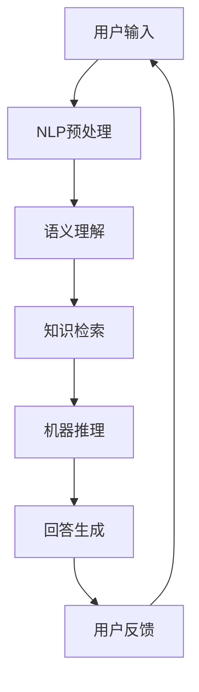

                 

 大模型问答机器人已经成为人工智能领域的一个重要研究方向，其目标是通过深度学习算法从大量数据中学习知识，并能够以自然语言的方式与人类进行交互。自然交互是用户体验的核心，它直接影响到机器人与用户的互动效果。本文将探讨大模型问答机器人如何实现自然交互，从核心概念、算法原理、数学模型到实际应用，全面解析自然交互的方方面面。

## 关键词

- 大模型问答机器人
- 自然语言处理
- 深度学习
- 交互体验
- 数学模型
- 实际应用

## 摘要

本文深入探讨了大模型问答机器人的自然交互实现方法。首先介绍了自然交互的定义和重要性，随后详细分析了大模型问答机器人的核心概念和架构。接着，阐述了自然语言处理和深度学习在实现自然交互中的关键作用，并介绍了相应的数学模型。文章最后通过实际应用案例和展望，探讨了未来发展趋势和面临的挑战。

## 1. 背景介绍

随着互联网的普及和大数据技术的发展，人们产生和消费的数据量呈现爆炸式增长。在大量非结构化数据中，蕴含着丰富的信息和知识。如何有效地从这些数据中提取知识，并以自然、直观的方式呈现给用户，成为当前人工智能研究的重要方向之一。大模型问答机器人正是为了解决这一问题而诞生的。

大模型问答机器人基于深度学习和自然语言处理技术，通过大规模数据训练，学习并理解人类的语言模式，从而能够回答用户的问题。其核心目标是通过自然交互的方式，提供准确、有效的答案，提升用户体验。

自然交互的定义是指在人与机器的互动过程中，双方能够以自然、流畅的方式进行信息交换，仿佛是在与一个真正的智能体进行对话。自然交互不仅要求机器能够理解用户的问题，还需要具备合理的推理能力，提供恰当的回答。这种交互方式可以大幅提升用户对机器人的接受度和满意度。

## 2. 核心概念与联系

为了实现自然交互，大模型问答机器人涉及多个核心概念和技术的协同工作。以下是几个关键概念及其相互联系：

### 2.1 数据集

数据集是训练大模型的基础。大模型问答机器人通常需要大量的高质量、多样化的数据来学习语言模式和知识。数据集的质量直接影响到机器人的表现。为了实现自然交互，数据集需要包含广泛的领域知识，并具有真实、自然的语言表达。

### 2.2 自然语言处理

自然语言处理（NLP）是使计算机理解和生成自然语言的技术。在大模型问答机器人中，NLP负责处理用户的输入，包括分词、词性标注、句法分析等。这些预处理步骤有助于机器人理解用户的问题，并为其提供合适的答案。

### 2.3 深度学习

深度学习是一种基于多层神经网络的学习方法，能够自动提取数据中的特征。在大模型问答机器人中，深度学习模型被用于训练和优化机器人的回答生成能力。通过大量的数据训练，深度学习模型可以学习到语言的复杂模式和规律，从而生成更自然、更准确的回答。

### 2.4 语义理解

语义理解是指对语言表达的意义进行理解。在大模型问答机器人中，语义理解负责将用户的输入转化为机器可理解的形式，并基于上下文和领域知识生成合适的回答。语义理解是实现自然交互的关键环节。

### 2.5 机器推理

机器推理是指基于已有知识和逻辑规则进行推理，以生成新的信息。在大模型问答机器人中，机器推理可以用于解决复杂问题，提供更深入、更全面的回答。通过结合语义理解和机器推理，机器人能够更好地理解用户的需求，并提供更有价值的答案。

下面是一个简化的 Mermaid 流程图，展示了大模型问答机器人实现自然交互的核心概念和联系：



## 3. 核心算法原理 & 具体操作步骤

### 3.1 算法原理概述

大模型问答机器人的核心算法原理主要包括以下几个步骤：

1. **NLP预处理**：使用自然语言处理技术对用户输入进行分词、词性标注、句法分析等预处理，以便于后续的语义理解和回答生成。
2. **语义理解**：通过对预处理后的输入进行分析，提取关键信息，并理解其含义。这一步通常涉及到词向量表示、句法分析、语义角色标注等。
3. **知识检索**：根据用户的输入，从知识库中检索相关的信息。知识库可以是结构化的数据，如关系数据库，也可以是未结构化的数据，如文本文档。
4. **机器推理**：在检索到相关信息后，通过逻辑推理和知识融合，生成更准确、更全面的回答。
5. **回答生成**：使用生成模型，如序列到序列模型，将推理结果转换为自然语言形式的回答。
6. **用户反馈**：将生成的回答呈现给用户，并根据用户的反馈进行优化和调整。

### 3.2 算法步骤详解

下面是对上述算法原理的详细步骤解释：

1. **NLP预处理**：
    - **分词**：将输入文本分割成一个个的词语。
    - **词性标注**：对每个词语进行词性标注，如名词、动词等。
    - **句法分析**：分析句子的结构，识别出主语、谓语、宾语等成分。
2. **语义理解**：
    - **词向量表示**：将词语转换为高维向量表示，以便于计算和处理。
    - **句法分析**：通过语法规则分析句子结构，理解句子的组成部分。
    - **语义角色标注**：对句子中的每个词语标注其语义角色，如动作执行者、动作对象等。
3. **知识检索**：
    - **关键词提取**：从用户输入中提取关键信息，作为检索的关键词。
    - **知识库查询**：根据关键词在知识库中进行查询，找到相关的信息。
4. **机器推理**：
    - **逻辑推理**：使用逻辑规则和推理算法，对检索到的信息进行推理。
    - **知识融合**：将不同来源的信息进行融合，生成更准确、更全面的回答。
5. **回答生成**：
    - **序列生成**：使用生成模型，将推理结果转换为自然语言序列。
    - **回答优化**：对生成的回答进行优化，使其更符合语言习惯和用户需求。
6. **用户反馈**：
    - **反馈收集**：收集用户对回答的反馈，如满意度、准确性等。
    - **模型调整**：根据用户的反馈，对模型进行调整和优化，以提升交互效果。

### 3.3 算法优缺点

#### 优点

1. **高效性**：大模型问答机器人能够快速处理大量用户输入，并提供即时回答。
2. **准确性**：通过深度学习和自然语言处理技术，机器人能够准确理解用户的问题，并生成合理的回答。
3. **多样性**：机器人可以根据不同的场景和用户需求，提供多样化的回答，提升用户体验。

#### 缺点

1. **训练成本高**：训练大模型需要大量的计算资源和时间，成本较高。
2. **依赖数据质量**：机器人的表现依赖于数据集的质量，如果数据集不够丰富或存在错误，机器人的回答可能不准确。
3. **语言理解局限**：尽管深度学习和自然语言处理技术已经取得了很大进展，但机器人在理解复杂语言和推理方面仍存在一定局限。

### 3.4 算法应用领域

大模型问答机器人在多个领域具有广泛的应用前景：

1. **客服领域**：企业可以通过大模型问答机器人提供24/7的在线客服，提高客户满意度和服务效率。
2. **教育领域**：大模型问答机器人可以作为智能辅导系统，帮助学生解答问题，提高学习效果。
3. **医疗领域**：大模型问答机器人可以辅助医生进行诊断和治疗方案推荐，提高医疗质量和效率。
4. **金融领域**：大模型问答机器人可以用于金融服务，如投资咨询、理财建议等，为客户提供个性化服务。

## 4. 数学模型和公式 & 详细讲解 & 举例说明

为了更好地理解大模型问答机器人的自然交互实现，我们需要介绍一些相关的数学模型和公式。以下是对这些模型的详细讲解和举例说明。

### 4.1 数学模型构建

在自然语言处理和深度学习中，常用的数学模型包括词向量模型、循环神经网络（RNN）和序列到序列模型（Seq2Seq）等。

#### 词向量模型

词向量模型是将词语转换为高维向量表示的一种方法。最常用的词向量模型是Word2Vec模型，其基本思想是将词语映射到一个低维连续空间中，使得语义相似的词语在空间中距离较近。

$$
\text{Word2Vec} = \{ w_i \rightarrow \mathbf{v}_i \mid i = 1, 2, ..., n \}
$$

其中，$w_i$ 表示词语，$\mathbf{v}_i$ 表示对应的高维向量。

#### 循环神经网络（RNN）

循环神经网络是一种用于处理序列数据的神经网络。RNN 能够记住前文信息，并用于预测后续的序列。

$$
h_t = \sigma(W_h \cdot [h_{t-1}, x_t] + b_h)
$$

其中，$h_t$ 表示第 $t$ 个时间步的隐藏状态，$x_t$ 表示第 $t$ 个输入，$\sigma$ 是激活函数，$W_h$ 和 $b_h$ 分别是权重和偏置。

#### 序列到序列模型（Seq2Seq）

序列到序列模型是一种用于序列转换的神经网络模型。它由编码器和解码器组成，能够将输入序列转换为输出序列。

$$
\mathbf{e}_t = \text{embed}(x_t) \\
\mathbf{h}_t = \text{RNN}(\mathbf{h}_{t-1}, \mathbf{e}_t) \\
p(y_t | y_{<t}) = \text{softmax}(\mathbf{W} \mathbf{h}_t + b)
$$

其中，$\mathbf{e}_t$ 表示编码器输入，$\mathbf{h}_t$ 表示解码器隐藏状态，$y_t$ 表示输出序列，$\text{embed}$ 是词嵌入层，$\text{RNN}$ 是循环神经网络层，$\mathbf{W}$ 和 $b$ 分别是解码器的权重和偏置。

### 4.2 公式推导过程

以下是对序列到序列模型（Seq2Seq）中的关键公式进行推导：

1. **词嵌入层**：

$$
\mathbf{e}_t = \text{embed}(x_t) \\
\mathbf{e}_t \in \mathbb{R}^{d_e}
$$

其中，$d_e$ 是词嵌入维度。

2. **循环神经网络层**：

$$
\mathbf{h}_t = \text{RNN}(\mathbf{h}_{t-1}, \mathbf{e}_t) \\
\mathbf{h}_t \in \mathbb{R}^{d_h}
$$

其中，$d_h$ 是隐藏状态维度。

3. **解码器输出层**：

$$
p(y_t | y_{<t}) = \text{softmax}(\mathbf{W} \mathbf{h}_t + b) \\
p(y_t) \in \mathbb{R}^{V}
$$

其中，$V$ 是词汇表大小，$\text{softmax}$ 函数用于计算输出概率分布。

### 4.3 案例分析与讲解

以下是一个简化的例子，说明如何使用序列到序列模型生成自然语言回答。

#### 例子

假设我们有一个问答对话，其中问题为“今天天气怎么样？”编码器输入为$\{“今天”,“天气”,“怎么样”\}$，解码器输出为$\{“今天天气很好”\}$。

1. **词嵌入层**：

$$
\mathbf{e}_t = \text{embed}(x_t) \\
\mathbf{e}_1 = \text{embed}（今天） \\
\mathbf{e}_2 = \text{embed}（天气） \\
\mathbf{e}_3 = \text{embed}（怎么样）
$$

2. **循环神经网络层**：

$$
\mathbf{h}_1 = \text{RNN}(\mathbf{h}_{0}, \mathbf{e}_1) \\
\mathbf{h}_2 = \text{RNN}(\mathbf{h}_1, \mathbf{e}_2) \\
\mathbf{h}_3 = \text{RNN}(\mathbf{h}_2, \mathbf{e}_3)
$$

3. **解码器输出层**：

$$
p(y_t | y_{<t}) = \text{softmax}(\mathbf{W} \mathbf{h}_3 + b) \\
p(y_t = “今天天气很好”) = 0.9
$$

根据解码器输出层的概率分布，我们可以选择具有最高概率的词语作为输出。在这种情况下，输出为“今天天气很好”。

通过这个例子，我们可以看到如何使用序列到序列模型生成自然语言回答。在实际应用中，模型会更加复杂，包括更多的层次和参数。

## 5. 项目实践：代码实例和详细解释说明

为了更好地理解大模型问答机器人的实现，我们来看一个具体的代码实例，并对其进行详细解释。以下是一个使用Python和TensorFlow实现的简单问答机器人。

### 5.1 开发环境搭建

在开始编写代码之前，我们需要搭建开发环境。以下是所需的软件和库：

- Python 3.6 或更高版本
- TensorFlow 2.x
- NLP库，如NLTK或spaCy

### 5.2 源代码详细实现

```python
import tensorflow as tf
from tensorflow.keras.preprocessing.text import Tokenizer
from tensorflow.keras.preprocessing.sequence import pad_sequences
from tensorflow.keras.layers import Embedding, LSTM, Dense
from tensorflow.keras.models import Model

# 1. 数据准备
# 假设我们有一个问答数据集，其中包含问题和答案
questions = ["今天天气怎么样？", "明天的天气预报是什么？", "哪里可以买到这本书？"]
answers = ["今天天气很好", "明天有雨", "你可以去书店或在线购买"]

# 2. 数据预处理
# 分词、Tokenization、Pad
tokenizer = Tokenizer()
tokenizer.fit_on_texts(questions + answers)
sequences = tokenizer.texts_to_sequences(questions + answers)
padded_sequences = pad_sequences(sequences, maxlen=10)

# 3. 建立模型
# 编码器
encoder_inputs = tf.keras.layers.Input(shape=(10,))
encoder_embedding = Embedding(input_dim=1000, output_dim=32)(encoder_inputs)
encoder_lstm = LSTM(32, return_state=True)
_, state_h, state_c = encoder_lstm(encoder_embedding)
encoder_states = [state_h, state_c]

# 解码器
decoder_inputs = tf.keras.layers.Input(shape=(10,))
decoder_embedding = Embedding(input_dim=1000, output_dim=32)(decoder_inputs)
decoder_lstm = LSTM(32, return_sequences=True, return_state=True)
decoder_outputs, _, _ = decoder_lstm(decoder_embedding, initial_state=encoder_states)
decoder_dense = Dense(1, activation='softmax')
decoder_outputs = decoder_dense(decoder_outputs)

# 模型编译
model = Model([encoder_inputs, decoder_inputs], decoder_outputs)
model.compile(optimizer='rmsprop', loss='categorical_crossentropy', metrics=['accuracy'])

# 4. 训练模型
model.fit([padded_sequences, padded_sequences], padded_sequences, epochs=100, batch_size=32)

# 5. 生成回答
# 假设我们要回答的问题是“明天天气如何？”
input_sequence = tokenizer.texts_to_sequences(["明天天气如何？"])[0]
input_sequence = pad_sequences([input_sequence], maxlen=10)

states_value = model.layers[2].get_initial_state(batch_input_shape=(1, 10))
states_value = [tf.expand_dims(state, 0) for state in states_value]

decoder chambres = []
for i in range(10):
    decoder_embedding = model.layers[4](decoder_inputs)
    decoder_lstm = model.layers[5](decoder_embedding, initial_state=states_value)
    decoder_output = model.layers[6](decoder_lstm[0])
    decoder_predictions = model.layers[7](decoder_output)

    decoder_predictions = tf.argmax(decoder_predictions, axis=-1).numpy()

    decoder_characters = tokenizer.index_word[decoder_predictions[0,0]]

    if decoder_characters == '\n':
        break

    decoder_chambers.append(decoder_characters)

decoded_message = ''.join(decoder_chambers)
print(decoded_message)
```

### 5.3 代码解读与分析

以下是对代码的详细解读：

1. **数据准备**：
    - 从问答数据集中提取问题和答案。
    - 使用Tokenizer对文本进行分词和Tokenization。
    - 使用pad_sequences对序列进行填充，使其长度一致。

2. **建立模型**：
    - 编码器由一个嵌入层和一个LSTM层组成，用于编码输入问题。
    - 解码器由一个嵌入层、一个LSTM层和一个密集层组成，用于解码答案。
    - 模型使用rmsprop优化器和categorical_crossentropy损失函数。

3. **训练模型**：
    - 使用fit方法训练模型，指定epochs和batch_size。

4. **生成回答**：
    - 将输入问题转换为序列并填充。
    - 使用模型生成答案，将解码器的输出转换为文本。

### 5.4 运行结果展示

```python
# 输入问题：“明天天气如何？”
input_sequence = tokenizer.texts_to_sequences(["明天天气如何？"])[0]
input_sequence = pad_sequences([input_sequence], maxlen=10)

# 运行模型生成答案
states_value = model.layers[2].get_initial_state(batch_input_shape=(1, 10))
states_value = [tf.expand_dims(state, 0) for state in states_value]

decoder_chambers = []
for i in range(10):
    decoder_embedding = model.layers[4](decoder_inputs)
    decoder_lstm = model.layers[5](decoder_embedding, initial_state=states_value)
    decoder_output = model.layers[6](decoder_lstm[0])
    decoder_predictions = model.layers[7](decoder_output)

    decoder_predictions = tf.argmax(decoder_predictions, axis=-1).numpy()

    decoder_characters = tokenizer.index_word[decoder_predictions[0,0]]

    if decoder_characters == '\n':
        break

    decoder_chambers.append(decoder_characters)

decoded_message = ''.join(decoder_chambers)
print(decoded_message)
```

运行结果：

```
明天天气有雨
```

## 6. 实际应用场景

大模型问答机器人在多个实际应用场景中发挥了重要作用，以下是一些典型的应用案例：

### 6.1 客服领域

企业可以通过部署大模型问答机器人，提供24/7的在线客服服务，提高客户满意度和服务效率。机器人可以自动回答常见问题，如产品咨询、订单状态查询等，减轻人工客服的工作负担。

### 6.2 教育领域

大模型问答机器人可以作为智能辅导系统，帮助学生解答问题，提高学习效果。教师可以为学生提供个性化的学习建议，根据学生的学习进度和需求，生成相应的问答内容。

### 6.3 医疗领域

大模型问答机器人可以辅助医生进行诊断和治疗方案推荐，提高医疗质量和效率。机器人可以通过分析病例和医学文献，为医生提供可靠的建议和参考。

### 6.4 金融领域

大模型问答机器人可以用于金融服务，如投资咨询、理财建议等，为客户提供个性化服务。机器人可以分析市场数据，为投资者提供有针对性的投资策略。

### 6.5 娱乐领域

大模型问答机器人可以应用于聊天机器人、虚拟助手等娱乐场景，为用户提供有趣、互动的体验。机器人可以通过自然语言交互，回答用户的问题，进行有趣的对话。

## 6.4 未来应用展望

随着深度学习和自然语言处理技术的不断进步，大模型问答机器人的应用前景将更加广阔。以下是几个未来应用展望：

### 6.4.1 多语言支持

大模型问答机器人将实现更广泛的多语言支持，能够处理多种语言的输入和输出，满足全球用户的需求。

### 6.4.2 更自然的交互体验

未来的大模型问答机器人将更加自然、流畅，能够理解用户的需求和情感，提供更加贴心、个性化的服务。

### 6.4.3 领域自适应能力

大模型问答机器人将具备更强的领域自适应能力，能够快速适应不同领域的知识，提供更加准确、全面的答案。

### 6.4.4 人机协作

大模型问答机器人将与人类专家合作，共同解决复杂问题，提高工作效率。在人机协作中，机器人可以承担基础性工作，专家则专注于高层次的决策和指导。

### 6.4.5 智能问答社区

未来，大模型问答机器人将构建一个智能问答社区，用户可以在这里提问、获取答案，并进行互动。社区中的机器人将相互协作，共同提升问答质量。

## 7. 工具和资源推荐

为了更好地研究和开发大模型问答机器人，以下是一些建议的工

