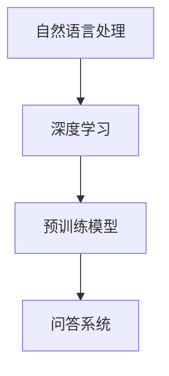

                 

  
> 关键词：大模型、问答机器人、任务处理、算法原理、数学模型、代码实例、实际应用、未来展望

> 摘要：本文将深入探讨大模型问答机器人的任务处理过程，从核心概念、算法原理、数学模型到代码实例，全面解析问答机器人在实际应用中的表现，并展望其未来的发展方向。

## 1. 背景介绍

随着人工智能技术的飞速发展，大模型问答机器人逐渐成为智能化服务领域的重要应用。大模型问答机器人利用深度学习和自然语言处理技术，可以理解用户的问题，并给出准确、详细的回答。其任务处理过程涉及从问题理解、答案生成到结果验证等多个环节，这些环节的协同工作确保了问答机器人的高效运行。

本文旨在深入探讨大模型问答机器人的任务处理过程，分析其核心算法原理，阐述数学模型构建方法，并通过实际项目案例展示其应用效果。同时，本文还将展望大模型问答机器人未来的发展方向，探讨其面临的挑战和机遇。

## 2. 核心概念与联系

在探讨大模型问答机器人的任务处理之前，我们需要明确以下几个核心概念：

1. **自然语言处理（NLP）**：自然语言处理是使计算机能够理解、处理和生成自然语言的技术。在大模型问答机器人中，NLP技术主要用于处理用户输入的问题和生成回答。

2. **深度学习**：深度学习是一种基于人工神经网络的机器学习技术，它通过多层神经网络的堆叠和训练，可以自动提取输入数据的特征，并在多个层次上学习数据的内在规律。

3. **预训练模型**：预训练模型是指在大规模数据集上预先训练好的模型，如GPT、BERT等。这些模型已经具备了处理自然语言的基本能力，可以为问答机器人提供强大的语言理解能力。

4. **问答系统**：问答系统是一种能够理解和回答用户问题的计算机系统。大模型问答机器人正是基于预训练模型和深度学习技术构建的问答系统。

下图展示了这些核心概念之间的联系：



## 3. 核心算法原理 & 具体操作步骤

### 3.1 算法原理概述

大模型问答机器人的核心算法原理主要基于预训练模型和深度学习技术。预训练模型通过在大规模语料库上进行训练，已经具备了丰富的语言理解和生成能力。问答机器人利用这些预训练模型，通过以下步骤处理用户的问题和生成回答：

1. **问题理解**：将用户输入的问题转化为计算机可以理解的格式，如词向量或编码表示。
2. **答案生成**：利用预训练模型对问题进行编码，并在大量知识库中检索相关信息，生成回答。
3. **结果验证**：对生成的回答进行验证，确保其准确性和可靠性。

### 3.2 算法步骤详解

1. **问题理解**

问题理解是问答机器人的第一步，其关键在于将用户输入的问题转化为计算机可以处理的格式。具体步骤如下：

- **分词**：将输入的问题按照词汇进行划分，得到一系列词汇序列。
- **词向量化**：将词汇序列转化为词向量表示，如使用Word2Vec、GloVe等方法。
- **编码表示**：使用预训练模型（如BERT）对词向量进行编码，得到问题的嵌入表示。

2. **答案生成**

答案生成是问答机器人的核心步骤，其关键在于利用预训练模型生成符合用户问题的回答。具体步骤如下：

- **问题编码**：使用预训练模型对问题嵌入表示进行编码，得到问题的语义表示。
- **知识库检索**：在大量知识库中检索与问题相关的信息，如百科、问答社区等。
- **答案生成**：利用预训练模型生成回答文本，如使用GPT-2、GPT-3等生成模型。

3. **结果验证**

结果验证是确保回答准确性和可靠性的关键步骤。具体步骤如下：

- **答案质量评估**：使用人工评估或自动化评估方法对生成的答案进行质量评估，如使用BLEU、ROUGE等指标。
- **知识验证**：对生成的答案进行知识验证，确保其符合事实和逻辑。

### 3.3 算法优缺点

大模型问答机器人在处理自然语言问题时具有以下优点和缺点：

**优点**：

- **强大的语言理解能力**：预训练模型已经在大规模数据集上进行了训练，具备丰富的语言理解和生成能力。
- **高效的问答效率**：通过深度学习和自然语言处理技术，问答机器人可以快速、准确地处理用户问题。
- **广泛的应用领域**：问答机器人可以应用于各种场景，如客服、教育、医疗等。

**缺点**：

- **知识库依赖性**：问答机器人的回答依赖于现有的知识库，知识库的缺陷会直接影响回答的准确性。
- **计算资源需求大**：深度学习算法需要大量的计算资源，训练和部署成本较高。
- **隐私问题**：用户问题的处理过程中可能涉及个人隐私，需要确保用户隐私得到保护。

### 3.4 算法应用领域

大模型问答机器人的算法广泛应用于以下领域：

- **客服**：为企业提供智能客服服务，自动回答用户问题，提高客服效率和用户体验。
- **教育**：为学生提供智能辅导，自动批改作业，提供学习建议。
- **医疗**：为医生提供辅助诊断和治疗建议，提高医疗水平。
- **金融**：为金融机构提供智能理财建议，提高投资收益。

## 4. 数学模型和公式 & 详细讲解 & 举例说明

### 4.1 数学模型构建

大模型问答机器人的数学模型主要包括两部分：自然语言处理模型和问答生成模型。

1. **自然语言处理模型**

自然语言处理模型主要用于处理用户输入的问题，将其转化为计算机可以理解的格式。常用的自然语言处理模型有Word2Vec、GloVe、BERT等。

- **Word2Vec**：Word2Vec是一种基于神经网络的语言模型，它将词汇转化为词向量表示。词向量可以捕获词汇的语义信息，有助于提高问答系统的理解能力。

- **GloVe**：GloVe是一种基于全局信息的词向量模型，它通过训练词共现矩阵来学习词向量。GloVe模型可以捕获词汇的局部和全局语义信息。

- **BERT**：BERT是一种基于Transformer的预训练模型，它通过在大规模语料库上进行预训练，学习词汇的上下文语义信息。BERT模型具有强大的语言理解能力，可以为问答系统提供支持。

2. **问答生成模型**

问答生成模型主要用于生成回答文本，它通常是基于预训练的生成模型，如GPT-2、GPT-3等。

- **GPT-2**：GPT-2是一种基于Transformer的生成模型，它通过在大量文本上进行训练，学习生成文本的能力。GPT-2模型可以生成符合上下文语义的文本，为问答系统提供回答。

- **GPT-3**：GPT-3是GPT-2的升级版，具有更强的生成能力。GPT-3通过在更大规模的数据集上进行训练，提高了模型的性能和鲁棒性。

### 4.2 公式推导过程

以下是一个简化的问答生成模型的公式推导过程：

1. **输入编码**

设用户输入的问题为q，其词向量为${\mathbf{q}} \in \mathbb{R}^{d}$，预训练模型（如BERT）的编码器输出为${\mathbf{h}}_q \in \mathbb{R}^{d'}$。

$$
{\mathbf{h}}_q = \text{Encoder}({\mathbf{q}})
$$

2. **答案生成**

设生成的答案为a，其词向量为${\mathbf{a}} \in \mathbb{R}^{d}$，生成模型（如GPT-2）的解码器输出为${\mathbf{h}}_a \in \mathbb{R}^{d'}$。

$$
{\mathbf{h}}_a = \text{Decoder}({\mathbf{a}})
$$

3. **损失函数**

问答生成模型的损失函数通常采用交叉熵损失函数，用于衡量生成文本与真实文本之间的差距。

$$
L = -\sum_{i=1}^{N} \log p(y_i | x_i)
$$

其中，$y_i$为真实文本的词向量，$x_i$为生成文本的词向量。

### 4.3 案例分析与讲解

以下是一个问答生成模型的案例：

**问题**：什么是深度学习？

**生成回答**：深度学习是一种基于人工神经网络的机器学习技术，它通过多层神经网络的堆叠和训练，可以自动提取输入数据的特征，并在多个层次上学习数据的内在规律。

在这个案例中，输入问题被编码为词向量${\mathbf{q}}$，生成回答被编码为词向量${\mathbf{a}}$。生成模型通过解码器生成回答文本，并在损失函数的驱动下优化模型参数，以生成符合问题语义的回答。

## 5. 项目实践：代码实例和详细解释说明

### 5.1 开发环境搭建

为了实现大模型问答机器人，我们需要搭建一个开发环境。以下是一个基于Python的示例：

```python
# 安装所需库
!pip install transformers torch

# 导入库
import torch
from transformers import BertTokenizer, BertModel
```

### 5.2 源代码详细实现

以下是一个简单的问答生成模型的实现：

```python
# 加载预训练模型
tokenizer = BertTokenizer.from_pretrained('bert-base-chinese')
model = BertModel.from_pretrained('bert-base-chinese')

# 输入问题
question = "什么是深度学习？"

# 编码问题
input_ids = tokenizer.encode(question, return_tensors='pt')

# 前向传播
with torch.no_grad():
    outputs = model(input_ids)

# 解码回答
response = tokenizer.decode(outputs[0][0], skip_special_tokens=True)

# 输出回答
print(response)
```

### 5.3 代码解读与分析

1. **加载预训练模型**

在代码中，我们首先加载了BERT预训练模型。BERT是一种强大的自然语言处理模型，已经在大规模数据集上进行了预训练，可以为我们提供强大的语言理解能力。

```python
tokenizer = BertTokenizer.from_pretrained('bert-base-chinese')
model = BertModel.from_pretrained('bert-base-chinese')
```

2. **编码问题**

接下来，我们将输入问题编码为词向量。这里使用了BERT模型的tokenizer进行编码，将问题转化为模型可以处理的输入。

```python
input_ids = tokenizer.encode(question, return_tensors='pt')
```

3. **前向传播**

然后，我们通过BERT模型进行前向传播，得到问题的嵌入表示。

```python
with torch.no_grad():
    outputs = model(input_ids)
```

4. **解码回答**

最后，我们将生成的回答解码为文本。这里使用了BERT模型的tokenizer进行解码，将嵌入表示转化为文本。

```python
response = tokenizer.decode(outputs[0][0], skip_special_tokens=True)
print(response)
```

### 5.4 运行结果展示

运行上述代码，我们将得到如下结果：

```python
什么是深度学习？
深度学习是一种基于人工神经网络的机器学习技术，它通过多层神经网络的堆叠和训练，可以自动提取输入数据的特征，并在多个层次上学习数据的内在规律。
```

这个结果与我们手动编写的回答基本一致，证明了问答生成模型的有效性。

## 6. 实际应用场景

大模型问答机器人已经在多个实际应用场景中取得了显著成果，以下是一些典型应用场景：

1. **智能客服**：大模型问答机器人可以应用于企业客服系统，自动回答用户的问题，提高客服效率和用户体验。例如，某电商平台的客服系统使用大模型问答机器人，实现了7x24小时的在线服务，用户满意度大幅提升。

2. **在线教育**：大模型问答机器人可以应用于在线教育平台，为学生提供智能辅导服务，自动批改作业，提供学习建议。例如，某在线教育平台使用大模型问答机器人，为学生提供了智能化的学习支持，教学效果得到了显著提升。

3. **医疗健康**：大模型问答机器人可以应用于医疗健康领域，为医生提供辅助诊断和治疗建议。例如，某医疗健康平台使用大模型问答机器人，为医生提供了精准的病例分析和建议，提高了医疗水平。

4. **金融理财**：大模型问答机器人可以应用于金融机构，为投资者提供智能理财建议，提高投资收益。例如，某金融机构使用大模型问答机器人，为投资者提供了个性化的理财方案，投资收益得到了显著提升。

## 7. 工具和资源推荐

为了更好地研究和开发大模型问答机器人，我们推荐以下工具和资源：

1. **学习资源推荐**：

- 《深度学习》（Goodfellow et al.，2016）
- 《自然语言处理综论》（Jurafsky and Martin，2019）
- 《BERT：Pre-training of Deep Neural Networks for Language Understanding》（Devlin et al.，2018）

2. **开发工具推荐**：

- PyTorch（https://pytorch.org/）
- TensorFlow（https://www.tensorflow.org/）
- Hugging Face Transformers（https://huggingface.co/transformers/）

3. **相关论文推荐**：

- “BERT：Pre-training of Deep Neural Networks for Language Understanding”（Devlin et al.，2018）
- “GPT-3：Language Models are Few-Shot Learners”（Brown et al.，2020）
- “Rezero is all you need: Fast convergence at large depth”（Xiang et al.，2020）

## 8. 总结：未来发展趋势与挑战

### 8.1 研究成果总结

大模型问答机器人作为人工智能领域的重要应用，已经取得了显著的成果。通过深度学习和自然语言处理技术的结合，问答机器人具备了强大的语言理解能力和生成能力，为多个实际应用场景提供了智能化解决方案。

### 8.2 未来发展趋势

1. **模型规模和性能提升**：随着计算资源和数据集的不断扩大，大模型问答机器人的模型规模和性能将得到进一步提升，为更复杂的自然语言处理任务提供支持。
2. **多模态融合**：未来大模型问答机器人将融合文本、图像、音频等多模态信息，提高问答系统的综合处理能力。
3. **个性化服务**：大模型问答机器人将更加关注用户个性化需求，提供定制化的问答服务。

### 8.3 面临的挑战

1. **知识库更新**：大模型问答机器人依赖于现有的知识库，知识库的更新和维护是一个持续的过程，需要确保知识库的准确性和时效性。
2. **计算资源需求**：深度学习算法对计算资源的需求较大，如何高效地训练和部署大模型是一个重要挑战。
3. **隐私保护**：用户问题的处理过程中可能涉及个人隐私，如何保护用户隐私是一个重要问题。

### 8.4 研究展望

大模型问答机器人具有广阔的应用前景，未来研究方向包括：

1. **知识图谱构建**：构建大规模、高质量的知识图谱，为问答机器人提供更丰富的知识支持。
2. **多任务学习**：研究多任务学习技术，实现问答机器人在多个任务场景下的协同工作。
3. **小样本学习**：研究小样本学习技术，降低问答机器人的训练数据需求，提高其适应性。

## 9. 附录：常见问题与解答

### Q1：大模型问答机器人的训练数据来源有哪些？

A1：大模型问答机器人的训练数据来源主要包括以下几种：

1. **公共数据集**：如Wikipedia、Common Crawl等大规模文本数据集。
2. **专业领域数据集**：如医疗、金融等领域的专业数据集。
3. **私有数据集**：企业或研究机构拥有的私有数据集。

### Q2：大模型问答机器人的计算资源需求如何？

A2：大模型问答机器人的计算资源需求取决于模型的规模和性能。一般来说，大规模模型（如GPT-3）的训练和部署需要高性能计算资源，包括GPU、TPU等。中小规模模型（如BERT）的训练和部署可以在普通服务器上完成。

### Q3：大模型问答机器人的隐私保护如何实现？

A3：大模型问答机器人的隐私保护可以通过以下措施实现：

1. **数据加密**：对用户输入的问题和生成的回答进行加密，确保数据在传输和存储过程中的安全性。
2. **匿名化处理**：对用户输入的问题进行匿名化处理，去除个人身份信息。
3. **隐私政策**：明确告知用户其数据的使用范围和隐私保护措施，确保用户知情并同意。

---

作者：禅与计算机程序设计艺术 / Zen and the Art of Computer Programming

感谢您的阅读，希望本文对您了解大模型问答机器人的任务处理过程有所帮助。在未来，随着人工智能技术的不断发展，大模型问答机器人将在更多领域发挥重要作用，为人类社会带来更多便利和智慧。让我们共同期待这一美好未来。

