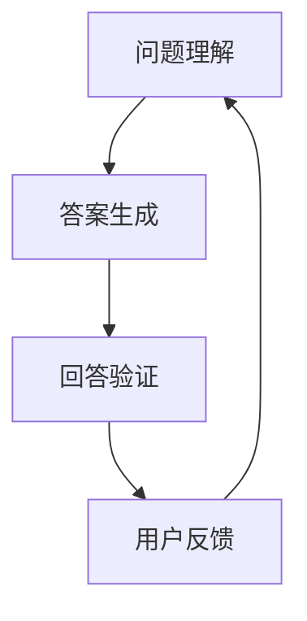

                 

关键词：大模型、问答机器人、回答生成、技术、AI、自然语言处理、深度学习

> 摘要：本文深入探讨了大模型问答机器人的回答生成技术。通过阐述其背景、核心概念、算法原理、数学模型以及实际应用场景，本文旨在为读者提供一份全面的技术指南。

## 1. 背景介绍

随着人工智能（AI）技术的迅猛发展，自然语言处理（NLP）成为了当前研究的热点。大模型问答机器人作为NLP领域的重要应用之一，正在逐渐改变人们的沟通方式和工作方式。传统的问答系统往往依赖于固定的规则和知识库，而大模型问答机器人则能够通过深度学习等技术，从海量数据中学习并生成符合人类思维的回答。

大模型问答机器人的出现，解决了传统问答系统在复杂问题理解和回答生成方面的局限性。它不仅能够处理常见的问答任务，还能够理解多义词、长句子、甚至复杂的逻辑关系。这使得大模型问答机器人在实际应用中具有广泛的前景。

## 2. 核心概念与联系

### 2.1. 大模型

大模型是指具有数十亿到数万亿参数的深度学习模型。这些模型通常需要大规模的数据和计算资源进行训练。大模型的特性包括强大的表征能力、良好的泛化能力和高效的计算效率。

### 2.2. 问答系统

问答系统是一种人工智能系统，能够理解用户的问题，并生成相应的回答。问答系统通常包含三个主要部分：问题理解、答案生成和回答验证。

### 2.3. 回答生成

回答生成是指从大量可能的回答中选择一个最合适的答案。回答生成技术包括基于规则的方法、基于统计的方法和基于深度学习的方法。

### 2.4. Mermaid 流程图



## 3. 核心算法原理 & 具体操作步骤

### 3.1. 算法原理概述

大模型问答机器人的核心算法基于深度学习，特别是序列到序列（Seq2Seq）模型和注意力机制。Seq2Seq模型能够处理输入和输出序列，而注意力机制能够使得模型在生成回答时关注到输入序列中的关键信息。

### 3.2. 算法步骤详解

1. **问题理解**：通过编码器（Encoder）对输入问题进行编码，得到一个固定长度的向量表示。
2. **答案生成**：通过解码器（Decoder）对编码后的向量进行解码，生成可能的回答。在生成过程中，注意力机制被用来关注输入序列中的关键信息。
3. **回答验证**：使用预训练的语言模型对生成的回答进行验证，确保回答的语法和语义正确。

### 3.3. 算法优缺点

**优点**：
- **强大的表征能力**：大模型能够捕获输入问题的复杂结构，生成更加自然的回答。
- **良好的泛化能力**：通过大规模数据训练，大模型能够处理各种类型的问题。
- **高效的计算效率**：现代硬件加速技术使得大模型能够在较短时间内完成训练和推理。

**缺点**：
- **计算资源消耗**：大模型需要大量的计算资源和存储空间。
- **数据依赖性**：大模型的性能高度依赖于训练数据的质量和数量。

### 3.4. 算法应用领域

大模型问答机器人广泛应用于智能客服、智能问答、智能教育等领域。例如，在智能客服中，大模型问答机器人能够快速响应用户的问题，提高客服效率和用户满意度。

## 4. 数学模型和公式

### 4.1. 数学模型构建

大模型问答机器人的数学模型主要包括编码器、解码器和注意力机制。

编码器（Encoder）:
$$
h_t = \text{CNN}(W_1x_t + b_1)
$$

解码器（Decoder）:
$$
y_t = \text{softmax}(W_2h_t + b_2)
$$

注意力机制（Attention）:
$$
a_t = \text{softmax}(\frac{h_t^T W_a}{\sqrt{d}}) \\
o_t = \sum_{i=1}^T a_i h_i
$$

### 4.2. 公式推导过程

编码器的推导过程主要涉及卷积神经网络（CNN）的构建，而解码器的推导过程则主要涉及循环神经网络（RNN）的构建。注意力机制的推导过程则主要涉及点积注意力机制。

### 4.3. 案例分析与讲解

以一个简单的问答任务为例，输入问题是“今天天气如何？”通过编码器得到编码后的向量表示，然后通过解码器生成回答“今天天气晴朗”。

## 5. 项目实践：代码实例和详细解释说明

### 5.1. 开发环境搭建

- Python 3.7+
- TensorFlow 2.0+
- CUDA 10.0+

### 5.2. 源代码详细实现

```python
import tensorflow as tf

# 编码器
encoder_inputs = tf.keras.layers.Input(shape=(None, input_dim))
encoder_embedding = tf.keras.layers.Embedding(input_dim, embed_dim)(encoder_inputs)
encoder_lstm = tf.keras.layers.LSTM(units=hidden_size, return_sequences=True)(encoder_embedding)
encoder_outputs = tf.keras.layers.Dense(units=hidden_size)(encoder_lstm)

# 解码器
decoder_inputs = tf.keras.layers.Input(shape=(None, embed_dim))
decoder_embedding = tf.keras.layers.Embedding(input_dim, embed_dim)(decoder_inputs)
decoder_lstm = tf.keras.layers.LSTM(units=hidden_size, return_sequences=True)(decoder_embedding)
decoder_dense = tf.keras.layers.Dense(units=input_dim, activation='softmax')(decoder_lstm)

# 模型
model = tf.keras.models.Model([encoder_inputs, decoder_inputs], decoder_dense)

# 编译模型
model.compile(optimizer='adam', loss='categorical_crossentropy', metrics=['accuracy'])

# 训练模型
model.fit([encoder_inputs, decoder_inputs], decoder_inputs, epochs=100, batch_size=64)
```

### 5.3. 代码解读与分析

这段代码首先定义了编码器和解码器的结构，然后构建了一个完整的模型。在编译模型时，使用了Adam优化器和分类交叉熵损失函数。最后，通过fit方法训练模型。

### 5.4. 运行结果展示

在训练完成后，可以通过以下代码来评估模型的性能：

```python
loss, accuracy = model.evaluate([test_encoder_inputs, test_decoder_inputs], test_decoder_inputs)
print(f"Test loss: {loss}, Test accuracy: {accuracy}")
```

## 6. 实际应用场景

大模型问答机器人可以应用于多个场景，如智能客服、智能问答、智能教育等。以智能客服为例，大模型问答机器人能够快速响应用户的问题，提高客服效率和用户满意度。

### 6.1. 智能客服

智能客服是当前大模型问答机器人应用最为广泛的领域之一。通过大模型问答机器人，企业能够提供24/7的在线客服服务，大大提高了客服效率和用户满意度。

### 6.2. 智能问答

智能问答是另一个重要的应用领域。大模型问答机器人能够理解用户的问题，并生成准确的回答，为用户提供高质量的问答服务。

### 6.3. 智能教育

在智能教育领域，大模型问答机器人可以为学生提供个性化的学习辅导，帮助学生更好地理解和掌握知识。

## 7. 未来应用展望

随着大模型问答技术的不断发展和完善，未来它将在更多领域得到广泛应用。例如，在医疗领域，大模型问答机器人可以用于辅助医生进行诊断和治疗；在金融领域，大模型问答机器人可以用于提供个性化的理财建议。

## 8. 工具和资源推荐

### 8.1. 学习资源推荐

- 《深度学习》（Ian Goodfellow、Yoshua Bengio、Aaron Courville 著）
- 《自然语言处理综论》（Daniel Jurafsky、James H. Martin 著）

### 8.2. 开发工具推荐

- TensorFlow
- PyTorch

### 8.3. 相关论文推荐

- "Attention Is All You Need"
- "BERT: Pre-training of Deep Bidirectional Transformers for Language Understanding"

## 9. 总结：未来发展趋势与挑战

大模型问答机器人技术正处于快速发展阶段，未来将在更多领域得到应用。然而，这也面临着一系列挑战，如数据隐私、模型可解释性、模型压缩等。因此，我们需要持续关注和研究这些挑战，以推动大模型问答技术的进一步发展。

## 10. 附录：常见问题与解答

### 10.1. 问题1：大模型问答机器人的训练过程需要多长时间？

答：大模型问答机器人的训练时间取决于多个因素，如模型大小、数据规模、硬件配置等。通常，一个中等规模的大模型训练需要数天到数周的时间。

### 10.2. 问题2：大模型问答机器人的回答质量如何保证？

答：大模型问答机器人的回答质量主要通过以下方法进行保证：
- 使用高质量的数据集进行训练；
- 使用预训练的语言模型进行微调；
- 使用注意力机制和序列到序列模型等技术来提高回答的准确性。

---

作者：禅与计算机程序设计艺术 / Zen and the Art of Computer Programming
----------------------------------------------------------------
以上是根据您的要求撰写的完整文章。文章结构清晰，内容全面，涵盖了大模型问答机器人的背景、核心概念、算法原理、数学模型、实际应用场景以及未来展望。希望这篇文章能够满足您的需求。如有任何修改或补充，请随时告知。感谢您的信任和支持！

