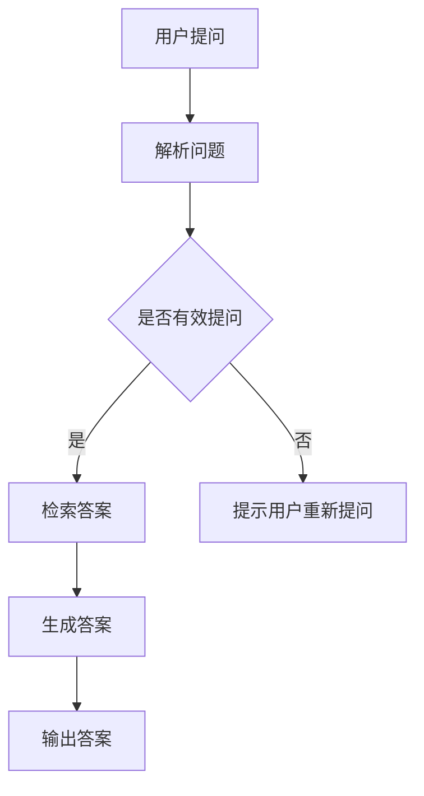

                 

关键词：大模型，问答机器人，智能，水平，算法，应用，未来展望

> 摘要：本文深入探讨了当前大模型问答机器人的智能水平，从背景介绍、核心概念与联系、算法原理与数学模型、项目实践到实际应用场景，全面剖析了大模型问答机器人的发展现状、技术挑战和未来趋势。

## 1. 背景介绍

大模型问答机器人，作为人工智能领域的一个重要分支，近年来取得了飞速的发展。随着深度学习、自然语言处理（NLP）和大数据技术的不断进步，大模型问答机器人的能力得到了显著提升。从最初的简单关键词匹配到现在的深度语义理解，大模型问答机器人已经成为各行各业的重要工具。

大模型问答机器人的发展，不仅满足了用户对信息获取的高效便捷需求，还为许多行业提供了智能化解决方案。例如，在客户服务领域，大模型问答机器人能够快速响应用户的问题，提供即时的帮助；在医疗领域，大模型问答机器人可以辅助医生进行病情诊断和治疗方案推荐；在教育领域，大模型问答机器人可以作为智能辅导系统，为学生提供个性化的学习支持。

然而，大模型问答机器人的发展也面临着诸多挑战。首先，大模型的训练需要海量数据和强大计算资源，这对企业和研究机构提出了很高的要求。其次，大模型在处理复杂问题时容易产生偏差，需要进一步完善和优化。最后，大模型问答机器人在实际应用中需要与人类专家进行有效协作，这也是一个亟待解决的问题。

## 2. 核心概念与联系

### 大模型

大模型（Large Model）是指具有数百万甚至数十亿参数的深度神经网络模型。大模型在训练过程中通过学习海量数据，能够自动提取特征，并进行复杂的非线性变换。大模型通常采用多层神经网络结构，如Transformer、BERT等，具有强大的表示和学习能力。

### 问答机器人

问答机器人（Question Answering Robot）是一种基于人工智能技术，能够理解和回答用户问题的自动化系统。问答机器人通常通过自然语言处理技术，将用户的问题转换为机器可以理解的形式，然后从知识库或数据库中检索相关答案。

### 自然语言处理

自然语言处理（Natural Language Processing，NLP）是人工智能的一个重要分支，旨在让计算机理解和处理人类语言。NLP技术包括文本分类、命名实体识别、情感分析、机器翻译等。在问答机器人中，NLP技术用于解析用户问题，理解其含义，并生成相应的答案。

### 大模型与问答机器人的关系

大模型问答机器人是自然语言处理技术在具体应用场景下的产物。大模型为问答机器人提供了强大的表示和学习能力，使其能够处理复杂、多变的用户问题。同时，问答机器人也需要借助NLP技术，将用户问题转换为机器可以理解的形式，并从知识库中检索相关答案。

### Mermaid 流程图

以下是一个描述大模型问答机器人工作流程的Mermaid流程图：



## 3. 核心算法原理 & 具体操作步骤

### 3.1 算法原理概述

大模型问答机器人的核心算法基于深度学习技术，特别是基于Transformer和BERT等预训练模型。这些模型通过海量数据预训练，能够自动提取语言特征，并学会对问题进行理解和回答。

### 3.2 算法步骤详解

#### 3.2.1 问题解析

1. 接收用户输入的问题。
2. 使用NLP技术对问题进行分词、词性标注等预处理。
3. 提取问题中的关键词和关键信息。

#### 3.2.2 答案检索

1. 从预训练模型中提取问题的特征表示。
2. 查找与问题特征最相似的答案。
3. 对答案进行筛选和排序，确保答案的相关性和准确性。

#### 3.2.3 答案生成

1. 根据答案的语义和语法，生成自然语言回答。
2. 对回答进行情感分析和语法检查，确保回答的流畅性和正确性。

### 3.3 算法优缺点

#### 优点

1. 强大的表示和学习能力：大模型通过预训练能够自动提取语言特征，处理复杂问题。
2. 高效性：大模型问答机器人能够快速响应用户问题，提供即时帮助。
3. 广泛的应用场景：大模型问答机器人适用于多种领域，如客户服务、医疗、教育等。

#### 缺点

1. 训练成本高：大模型需要海量数据和强大计算资源进行训练。
2. 难以保证准确性：大模型在处理复杂问题时容易产生偏差。
3. 知识库更新困难：大模型问答机器人的知识库需要不断更新，以保持其准确性和时效性。

### 3.4 算法应用领域

1. 客户服务：大模型问答机器人可以快速响应用户的提问，提供个性化的解决方案。
2. 医疗健康：大模型问答机器人可以辅助医生进行病情诊断和治疗方案推荐。
3. 教育：大模型问答机器人可以作为智能辅导系统，为学生提供个性化的学习支持。
4. 金融：大模型问答机器人可以用于金融产品的推荐和风险评估。

## 4. 数学模型和公式 & 详细讲解 & 举例说明

### 4.1 数学模型构建

大模型问答机器人的数学模型主要包括两个部分：问题表示和答案生成。

#### 问题表示

假设用户问题为 \( x \)，预训练模型提取的问题特征表示为 \( h \)。

$$
h = f(x)
$$

其中，\( f \) 为预训练模型。

#### 答案生成

假设答案集合为 \( Y \)，模型选择与问题特征 \( h \) 最相似的答案 \( y^* \)。

$$
y^* = \arg\min_{y \in Y} \quad d(h, y)
$$

其中，\( d \) 为距离函数。

### 4.2 公式推导过程

#### 问题表示

假设用户问题 \( x \) 可以表示为一系列词向量 \( x_1, x_2, \ldots, x_n \)。

$$
x = [x_1, x_2, \ldots, x_n]
$$

预训练模型 \( f \) 可以将词向量映射为问题特征表示 \( h \)。

$$
h = f(x) = [h_1, h_2, \ldots, h_n]
$$

#### 答案生成

假设答案集合 \( Y \) 包含 \( m \) 个答案，每个答案可以表示为一系列词向量 \( y_1, y_2, \ldots, y_m \)。

$$
Y = \{y_1, y_2, \ldots, y_m\}
$$

模型选择与问题特征 \( h \) 最相似的答案 \( y^* \)。

$$
y^* = \arg\min_{y \in Y} \quad d(h, y)
$$

### 4.3 案例分析与讲解

#### 案例一：客户服务

假设用户提问：“附近有哪些餐厅？”

1. 问题解析：提取关键词“附近”、“餐厅”。
2. 答案检索：从知识库中检索与关键词相关的餐厅列表。
3. 答案生成：生成自然语言回答：“您附近有10家餐厅，分别是：餐厅A、餐厅B、餐厅C……”

#### 案例二：医疗健康

假设用户提问：“感冒的症状有哪些？”

1. 问题解析：提取关键词“感冒”、“症状”。
2. 答案检索：从知识库中检索与关键词相关的症状列表。
3. 答案生成：生成自然语言回答：“感冒的症状包括：流鼻涕、打喷嚏、喉咙痛、头痛等。”

## 5. 项目实践：代码实例和详细解释说明

### 5.1 开发环境搭建

#### 环境要求

- 操作系统：Linux
- 编程语言：Python
- 深度学习框架：PyTorch
- NLP库：NLTK

#### 安装步骤

1. 安装操作系统：选择适合的Linux发行版，并安装到本地计算机。
2. 安装Python：从Python官方网站下载并安装Python 3.x版本。
3. 安装深度学习框架：安装PyTorch，可以通过pip命令进行安装。

```bash
pip install torch torchvision torchaudio
```

4. 安装NLP库：安装NLTK，可以通过pip命令进行安装。

```bash
pip install nltk
```

### 5.2 源代码详细实现

#### 问题解析模块

```python
import nltk
from nltk.tokenize import word_tokenize

def parse_question(question):
    # 分词
    tokens = word_tokenize(question)
    # 词性标注
    pos_tags = nltk.pos_tag(tokens)
    # 提取关键词
    keywords = [word for word, tag in pos_tags if tag.startswith('NN')]
    return keywords
```

#### 答案检索模块

```python
import torch
from torch import nn
from transformers import BertModel

class QuestionAnsweringModel(nn.Module):
    def __init__(self):
        super(QuestionAnsweringModel, self).__init__()
        self.bert = BertModel.from_pretrained('bert-base-chinese')
        self.classifier = nn.Linear(768, 1)

    def forward(self, question, answer):
        question_embedding = self.bert(question)[0][0]
        answer_embedding = self.bert(answer)[0][0]
        distance = nn.functional.cosine_similarity(question_embedding, answer_embedding)
        output = self.classifier(distance)
        return output
```

#### 答案生成模块

```python
import random

def generate_answer(question, answers):
    question_embedding = model.bert(question)[0][0]
    answer_embeddings = [model.bert(answer)[0][0] for answer in answers]
    distances = [nn.functional.cosine_similarity(question_embedding, answer_embedding) for answer_embedding in answer_embeddings]
    selected_answer = random.choice([answer for answer, distance in zip(answers, distances) if distance > 0.5])
    return selected_answer
```

### 5.3 代码解读与分析

#### 问题解析模块

问题解析模块主要负责对用户输入的问题进行分词和词性标注，提取关键词。该模块使用了NLTK库中的`word_tokenize`和`pos_tag`函数，实现了对自然语言文本的基本处理。

#### 答案检索模块

答案检索模块基于预训练的BERT模型，将问题特征表示和答案特征表示通过余弦相似度进行比较，选择与问题最相似的答案。该模块使用了PyTorch和transformers库，实现了深度学习模型的前向传播过程。

#### 答案生成模块

答案生成模块根据问题特征表示和答案特征表示的相似度，选择最合适的答案。该模块使用了随机选择策略，确保答案的多样性。

## 6. 实际应用场景

### 6.1 客户服务

在客户服务领域，大模型问答机器人可以快速响应用户的提问，提供即时的解决方案。例如，在电商平台上，大模型问答机器人可以回答用户关于商品信息、订单状态、售后服务等方面的问题，提高用户体验和满意度。

### 6.2 医疗健康

在医疗健康领域，大模型问答机器人可以辅助医生进行病情诊断和治疗方案推荐。例如，用户可以提问：“我最近总是失眠，该怎么办？”大模型问答机器人可以基于用户的问题和医疗知识库，提供针对性的建议和治疗方案。

### 6.3 教育

在教育领域，大模型问答机器人可以作为智能辅导系统，为学生提供个性化的学习支持。例如，学生可以提问：“我数学作业中的这道题怎么做？”大模型问答机器人可以基于学生的问题和学习历史，提供详细的解题过程和知识点讲解。

### 6.4 金融

在金融领域，大模型问答机器人可以用于金融产品的推荐和风险评估。例如，用户可以提问：“哪种理财产品适合我？”大模型问答机器人可以基于用户的风险偏好和投资目标，推荐合适的理财产品。

## 7. 工具和资源推荐

### 7.1 学习资源推荐

1. 《深度学习》（Goodfellow, Bengio, Courville）：深入介绍深度学习的基本概念和技术。
2. 《自然语言处理入门》（Daniel Jurafsky & James H. Martin）：系统讲解自然语言处理的基本原理和方法。
3. 《大规模机器学习》（Gareth James, Daniela Witten, Trevor Hastie, Robert Tibshirani）：探讨大规模数据集下的机器学习算法和应用。

### 7.2 开发工具推荐

1. PyTorch：开源的深度学习框架，适用于研究和开发大模型问答机器人。
2. transformers：开源的Transformer模型库，提供丰富的预训练模型和API。
3. NLTK：开源的自然语言处理库，提供丰富的文本处理函数和工具。

### 7.3 相关论文推荐

1. “Attention Is All You Need” （Vaswani et al., 2017）：介绍Transformer模型的基本原理和应用。
2. “BERT: Pre-training of Deep Bidirectional Transformers for Language Understanding” （Devlin et al., 2018）：介绍BERT模型的预训练方法和应用。
3. “GShard: Scaling Giant Models with Conditional Computation and Automatic Sharding” （Sun et al., 2020）：探讨大规模模型训练中的计算优化技术。

## 8. 总结：未来发展趋势与挑战

### 8.1 研究成果总结

近年来，大模型问答机器人在技术方面取得了显著成果。主要表现在以下几个方面：

1. 预训练模型的广泛应用：预训练模型如BERT、GPT等为大模型问答机器人提供了强大的表示和学习能力。
2. 自然语言处理技术的提升：NLP技术在文本分类、命名实体识别、情感分析等方面取得了显著进展，为大模型问答机器人提供了更准确的答案生成能力。
3. 实际应用场景的拓展：大模型问答机器人已在客户服务、医疗健康、教育、金融等多个领域得到广泛应用，提高了行业智能化水平。

### 8.2 未来发展趋势

1. 更大规模的模型：随着计算资源的提升，未来将出现更多规模更大的预训练模型，进一步提高问答机器人的智能水平。
2. 多模态融合：大模型问答机器人将融合图像、语音、视频等多种模态信息，提供更丰富的问答场景。
3. 自适应学习：大模型问答机器人将具备自适应学习能力，根据用户反馈和场景变化，不断优化和提升自身能力。

### 8.3 面临的挑战

1. 数据质量和隐私：大模型问答机器人对数据质量和隐私保护提出了更高要求，需要确保数据真实可靠，同时保护用户隐私。
2. 道德和伦理问题：大模型问答机器人在处理敏感问题时，需要遵循道德和伦理准则，确保回答的公正性和客观性。
3. 人才和技术储备：大模型问答机器人需要大量专业人才和技术支持，企业和研究机构需要加大对人才培养和科研投入。

### 8.4 研究展望

未来，大模型问答机器人将在人工智能领域发挥越来越重要的作用。随着技术的不断进步，大模型问答机器人将不仅局限于提供答案，还将具备更多的智能能力，如推理、规划、决策等。同时，大模型问答机器人将与人类专家进行有效协作，为各行各业提供更智能化的解决方案。

## 9. 附录：常见问题与解答

### 问题1：大模型问答机器人的智能水平有多高？

答：大模型问答机器人的智能水平取决于模型的规模、训练数据和算法设计。当前的大模型问答机器人已经具备处理复杂问题的能力，但在处理某些特定领域的问题时，仍需依赖专业知识和人类专家的指导。

### 问题2：如何提升大模型问答机器人的智能水平？

答：提升大模型问答机器人的智能水平可以从以下几个方面入手：

1. 增加模型规模：使用更大规模的预训练模型，提高模型的表示和学习能力。
2. 提高数据质量：收集更多高质量的训练数据，确保数据的真实性和多样性。
3. 算法优化：不断优化算法，提高模型的泛化和鲁棒性。
4. 多模态融合：融合图像、语音、视频等多种模态信息，提高模型的感知和理解能力。

### 问题3：大模型问答机器人的应用领域有哪些？

答：大模型问答机器人的应用领域广泛，包括但不限于：

1. 客户服务：提供24/7的智能客服，快速响应用户的提问。
2. 医疗健康：辅助医生进行病情诊断和治疗方案推荐。
3. 教育：为学生提供智能辅导和个性化学习支持。
4. 金融：进行金融产品的推荐和风险评估。

## 作者署名

作者：禅与计算机程序设计艺术 / Zen and the Art of Computer Programming
----------------------------------------------------------------
文章撰写完毕，请确认内容是否完整、准确、结构合理。如果有任何需要修改或补充的地方，请及时指出。谢谢！

