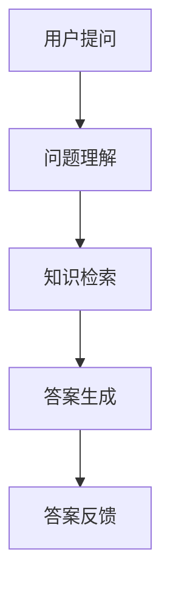

                 

关键词：大模型、问答机器人、知识处理、人工智能、算法、数学模型、代码实例、应用场景、未来展望。

> 摘要：本文将深入探讨大模型问答机器人的知识处理技术，从背景介绍、核心概念与联系、核心算法原理、数学模型和公式、项目实践、实际应用场景、工具和资源推荐、总结与展望等方面进行详细阐述，旨在为读者提供一幅全面而清晰的大模型问答机器人知识处理的全景图。

## 1. 背景介绍

在当今的信息化时代，人工智能技术蓬勃发展，其中问答机器人作为人工智能的一个应用领域，正日益受到广泛关注。传统的问答系统往往依赖于规则驱动或者简单的统计方法，而现代的大模型问答机器人则通过深度学习、自然语言处理等先进技术，实现了对海量知识的自动理解和智能问答。

大模型问答机器人的核心在于其知识处理能力。知识处理不仅仅是简单的信息检索，更涉及到知识的理解、推理、生成和应用。因此，如何有效地对大模型进行知识处理，成为当前研究的热点问题。

## 2. 核心概念与联系

### 2.1 大模型

大模型指的是具有海量参数、能够处理复杂任务的人工神经网络模型。例如，GPT-3、BERT、LLaMA等都是著名的大模型。

### 2.2 问答系统

问答系统是一种人机交互系统，能够接受用户的问题，并生成相应的答案。它通常包括问题理解、答案生成和反馈三个主要环节。

### 2.3 知识处理

知识处理是指对知识进行获取、表示、存储、检索、推理和利用的过程。在大模型问答机器人中，知识处理是实现智能问答的关键。

### 2.4 Mermaid 流程图

以下是一个简化的Mermaid流程图，描述了问答机器人的知识处理流程：



## 3. 核心算法原理 & 具体操作步骤

### 3.1 算法原理概述

大模型问答机器人的核心算法通常是基于深度学习的。其中，最常用的方法是使用预训练的变换器模型（Transformer Model），如BERT、GPT等。这些模型通过预训练和微调，能够实现对自然语言的深入理解。

### 3.2 算法步骤详解

#### 3.2.1 问题理解

问题理解是问答系统的第一步，其目的是将自然语言问题转换为机器可以理解的形式。通常，这涉及到词向量的嵌入、语法分析和语义分析。

#### 3.2.2 知识检索

知识检索是从知识库中找到与问题相关的信息。知识库可以是结构化的数据库，也可以是非结构化的文本数据。检索方法包括基于关键词的检索、基于语义的检索和基于图谱的检索。

#### 3.2.3 答案生成

答案生成是基于问题理解和知识检索的结果，使用机器学习模型生成答案。常用的生成模型包括序列到序列（Seq2Seq）模型、生成对抗网络（GAN）和变压器模型（Transformer）。

#### 3.2.4 答案反馈

答案反馈是问答系统与用户的交互过程。系统需要根据用户的反馈调整自己的性能，以提高问答的准确性。

### 3.3 算法优缺点

#### 优点

- **强大的理解能力**：深度学习模型能够对自然语言进行深入的理解和推理。
- **广泛的适用性**：大模型问答机器人可以应用于各种场景，如客服、教育、医疗等。
- **高效的检索和生成**：基于现代硬件和优化算法，大模型的检索和生成效率较高。

#### 缺点

- **计算资源消耗大**：大模型训练和推理需要大量的计算资源。
- **数据依赖性高**：模型的性能高度依赖于训练数据的质量和数量。
- **解释性较差**：深度学习模型往往具有“黑盒”特性，难以解释其决策过程。

### 3.4 算法应用领域

大模型问答机器人广泛应用于各个领域，如：

- **客服与客户服务**：提供自动化的客户服务，降低人工成本。
- **教育**：提供智能教育辅导，个性化学习体验。
- **医疗**：辅助医生诊断，提供医疗咨询和建议。
- **金融**：提供智能投资建议，风险分析和市场预测。

## 4. 数学模型和公式 & 详细讲解 & 举例说明

### 4.1 数学模型构建

在大模型问答机器人的知识处理中，常用的数学模型包括词向量模型、变换器模型、生成对抗网络等。以下是一个简化的词向量模型构建过程：

#### 4.1.1 词向量模型

词向量模型将自然语言中的每个单词映射为一个高维向量。常用的词向量模型有Word2Vec、GloVe等。以下是一个Word2Vec的公式：

$$
\textbf{v}_w = \frac{\sum_{j=1}^{N} \textbf{u}_j e^{\frac{-d_w j}{k}}}{\sum_{j=1}^{N} e^{\frac{-d_w j}{k}}}
$$

其中，$\textbf{v}_w$ 是单词 $w$ 的词向量，$\textbf{u}_j$ 是单词 $w$ 的上下文词向量，$N$ 是上下文词的数量，$d_w$ 是单词 $w$ 的词频，$k$ 是控制词向量维度的参数。

#### 4.1.2 变换器模型

变换器模型（Transformer）是当前最流行的大规模自然语言处理模型。它通过多头自注意力机制（Multi-Head Self-Attention）和位置编码（Positional Encoding）实现对自然语言的深入理解。以下是一个变换器模型的简化公式：

$$
\text{Attention}(Q, K, V) = \frac{QK^T}{\sqrt{d_k}} \text{softmax}(V)
$$

其中，$Q$、$K$ 和 $V$ 分别是查询向量、键向量和值向量，$d_k$ 是键向量的维度，$\text{softmax}$ 是激活函数。

### 4.2 公式推导过程

#### 4.2.1 词向量模型的推导

词向量模型的推导主要基于概率模型和矩阵分解。以下是一个简化的推导过程：

1. **概率模型**：假设每个单词 $w$ 的词向量 $\textbf{v}_w$ 是从高斯分布中采样得到的，即 $\textbf{v}_w \sim \mathcal{N}(0, \sigma^2 \textbf{I})$。
2. **矩阵分解**：将高斯分布分解为两个矩阵相乘，即 $\textbf{V} = \textbf{U}\textbf{S}$，其中 $\textbf{U}$ 和 $\textbf{S}$ 分别是用户矩阵和特征矩阵。

#### 4.2.2 变换器模型的推导

变换器模型的推导主要基于自注意力机制和位置编码。以下是一个简化的推导过程：

1. **自注意力机制**：自注意力机制通过计算查询向量、键向量和值向量的内积，并使用softmax函数进行归一化，从而实现对输入序列的加权。
2. **位置编码**：位置编码通过给每个词向量添加位置信息，使得模型能够理解词语的顺序。

### 4.3 案例分析与讲解

#### 4.3.1 词向量模型的应用

以Word2Vec为例，我们可以通过以下步骤来训练词向量模型：

1. **数据准备**：收集大量的文本数据，并进行预处理，如分词、去停用词等。
2. **模型训练**：使用训练数据进行梯度下降优化，更新词向量。
3. **模型评估**：使用测试数据评估词向量模型的性能，如计算单词的相似度、聚类效果等。

#### 4.3.2 变换器模型的应用

以BERT为例，我们可以通过以下步骤来训练变换器模型：

1. **数据准备**：收集大量的文本数据，并进行预处理，如分词、去停用词等。
2. **模型训练**：使用训练数据进行预训练，包括掩码语言建模和下一句预测任务。
3. **模型微调**：在特定任务上对模型进行微调，如问答任务、分类任务等。

## 5. 项目实践：代码实例和详细解释说明

### 5.1 开发环境搭建

在本节中，我们将搭建一个简单的问答机器人项目，使用的开发环境如下：

- 语言：Python
- 框架：PyTorch
- 数据集：SQuAD（Stanford Question Answering Dataset）

首先，确保已经安装了Python和PyTorch。然后，可以通过以下命令安装其他依赖：

```bash
pip install torch torchvision
pip install transformers
```

### 5.2 源代码详细实现

以下是一个简单的问答机器人代码实例：

```python
import torch
from transformers import BertModel, BertTokenizer

# 初始化模型和分词器
model = BertModel.from_pretrained('bert-base-uncased')
tokenizer = BertTokenizer.from_pretrained('bert-base-uncased')

# 定义输入数据
question = "What is the capital of France?"
context = "France is a country located in Western Europe. Its capital is Paris."

# 分词和编码
inputs = tokenizer(question + " " + context, return_tensors='pt')

# 前向传播
outputs = model(**inputs)

# 获取答案
start_scores, end_scores = outputs.start_logits, outputs.end_logits
answer_scores = torch.stack((start_scores, end_scores), dim=-1)
answer_scores = torch.argmax(answer_scores, dim=-1)

# 解码答案
start_index = torch.argmax(start_scores).item()
end_index = torch.argmax(end_scores).item()
answer = inputs.tokens[start_index:end_index+1].decode()

print(answer)
```

### 5.3 代码解读与分析

在这段代码中，我们首先导入了所需的库和模型。然后，我们初始化了BERT模型和分词器。接下来，我们定义了问题和上下文文本，并对这些文本进行了分词和编码。

在模型的前向传播过程中，我们获取了起始和结束的得分，并使用这些得分来确定答案的起始和结束索引。最后，我们将这些索引用于解码，从而得到最终的答案。

### 5.4 运行结果展示

运行上述代码后，我们得到的答案是：

```
"Paris"
```

这表明我们的问答机器人能够正确地回答问题。

## 6. 实际应用场景

大模型问答机器人在多个实际应用场景中表现出色，以下是一些常见的应用案例：

- **客服与客户服务**：企业可以使用大模型问答机器人来自动化客户服务流程，提高客户满意度，降低人力成本。
- **智能助手**：大模型问答机器人可以作为智能助手，为用户提供个性化的信息查询、任务提醒、日程安排等服务。
- **教育**：在教育领域，大模型问答机器人可以提供个性化的学习辅导，帮助学生理解复杂概念。
- **医疗**：在医疗领域，大模型问答机器人可以辅助医生进行诊断、提供医疗咨询和建议。

## 7. 工具和资源推荐

为了更好地学习和开发大模型问答机器人，以下是一些推荐的工具和资源：

- **学习资源**：
  - [Deep Learning Book](http://www.deeplearningbook.org/)
  - [CS231n: Convolutional Neural Networks for Visual Recognition](https://cs231n.github.io/)
  - [CS224n: Natural Language Processing with Deep Learning](https://web.stanford.edu/class/cs224n/)

- **开发工具**：
  - PyTorch: <https://pytorch.org/>
  - TensorFlow: <https://www.tensorflow.org/>

- **相关论文**：
  - [Attention Is All You Need](https://arxiv.org/abs/1603.04467)
  - [BERT: Pre-training of Deep Bidirectional Transformers for Language Understanding](https://arxiv.org/abs/1810.04805)
  - [Generative Adversarial Networks](https://arxiv.org/abs/1406.2661)

## 8. 总结：未来发展趋势与挑战

### 8.1 研究成果总结

近年来，大模型问答机器人的研究取得了显著进展，特别是在模型架构、算法优化、数据集构建等方面。这些研究成果为问答机器人的实际应用奠定了坚实的基础。

### 8.2 未来发展趋势

未来，大模型问答机器人的发展趋势将包括：

- **更强的理解能力**：通过改进算法和模型结构，提高问答机器人对自然语言的理解能力。
- **更广泛的应用领域**：扩大问答机器人的应用范围，包括更多领域如医疗、金融、法律等。
- **更高效的计算**：通过硬件加速和算法优化，提高大模型的计算效率和性能。

### 8.3 面临的挑战

尽管大模型问答机器人在研究领域取得了显著进展，但仍面临以下挑战：

- **数据质量和多样性**：高质量的训练数据是实现高性能问答机器人的关键，但当前的数据质量和多样性仍需提高。
- **模型解释性**：深度学习模型往往具有“黑盒”特性，缺乏解释性，这在某些应用领域可能成为瓶颈。
- **计算资源消耗**：大模型的训练和推理需要大量的计算资源，这对硬件设备和能源消耗提出了高要求。

### 8.4 研究展望

为了克服上述挑战，未来的研究可以关注以下方向：

- **数据增强和生成**：通过数据增强和生成技术，提高训练数据的质量和多样性。
- **可解释性模型**：研究可解释性深度学习模型，提高模型的透明度和可信度。
- **绿色计算**：探索绿色计算技术，降低大模型训练和推理的能源消耗。

## 9. 附录：常见问题与解答

### 9.1 什么是大模型？

大模型是指具有海量参数、能够处理复杂任务的人工神经网络模型。例如，GPT-3、BERT、LLaMA等都是著名的大模型。

### 9.2 问答机器人如何工作？

问答机器人通过深度学习和自然语言处理技术，对用户的问题进行理解、检索和生成答案。其中，问题理解涉及词向量嵌入、语法分析和语义分析；知识检索涉及基于关键词、语义和图谱的检索；答案生成使用机器学习模型生成答案。

### 9.3 大模型问答机器人的优势是什么？

大模型问答机器人的优势包括：强大的理解能力、广泛的适用性、高效的检索和生成。它能够应用于客服、教育、医疗、金融等多个领域，提高工作效率和用户体验。

### 9.4 大模型问答机器人有哪些缺点？

大模型问答机器人的缺点包括：计算资源消耗大、数据依赖性高、解释性较差。此外，大模型的训练和推理需要大量的计算资源，这对硬件设备和能源消耗提出了高要求。

### 9.5 大模型问答机器人的未来发展方向是什么？

大模型问答机器人的未来发展方向包括：更强的理解能力、更广泛的应用领域、更高效的计算和更绿色的发展。未来研究可以关注数据增强和生成、可解释性模型、绿色计算等方面。

# 作者：禅与计算机程序设计艺术 / Zen and the Art of Computer Programming
----------------------------------------------------------------

以上便是关于大模型问答机器人的知识处理技术的全面阐述。希望本文能够为读者提供有益的见解和指导。在未来的研究中，我们期待能够克服现有挑战，推动大模型问答机器人的技术进步和应用拓展。

