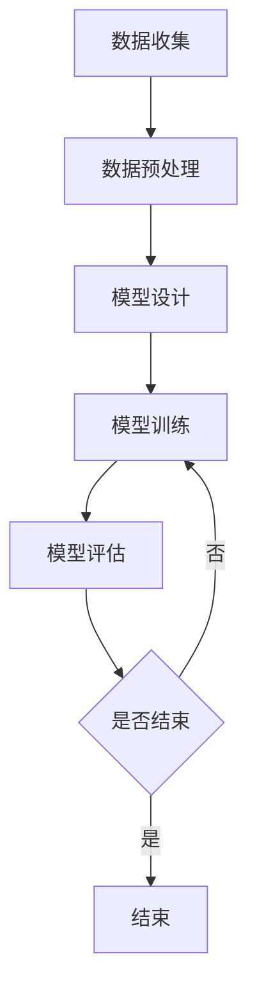

                 

关键词：大模型、问答机器人、训练方法、人工智能、机器学习、深度学习

> 摘要：本文将深入探讨大模型问答机器人的训练方法，从背景介绍、核心概念与联系、核心算法原理、数学模型和公式、项目实践以及未来应用展望等多个方面，全面解析大模型问答机器人训练的各个环节，为读者提供一份全面的技术指南。

## 1. 背景介绍

随着人工智能技术的飞速发展，问答系统已经成为自然语言处理（NLP）领域的重要研究方向。问答系统旨在解决用户提出的问题，提供准确、合理的回答。传统的问答系统主要依赖于规则匹配和关键字搜索等技术，然而，随着语义理解的复杂性和多样性的增加，这些方法逐渐暴露出局限。为了解决这些问题，研究者们提出了大模型问答机器人这一概念。

大模型问答机器人是一种基于深度学习的问答系统，通过大规模的训练数据集进行训练，可以自动学习语义理解、问答匹配等复杂任务。相比于传统方法，大模型问答机器人具有更高的准确性和灵活性，可以更好地应对各种复杂问题。本文将重点介绍大模型问答机器人的训练方法，以期为读者提供一种有效的解决方案。

## 2. 核心概念与联系

### 2.1  大模型

大模型是指具有海量参数的神经网络模型，通常用于处理复杂的任务。在问答机器人中，大模型可以自动学习语义表示、上下文理解等任务，从而提高问答系统的性能。大模型的训练过程通常涉及大量的计算资源和时间。

### 2.2  问答机器人

问答机器人是一种基于自然语言处理技术的自动问答系统，它可以理解用户的提问，并返回相应的答案。问答机器人的核心任务是建立语义理解机制，以实现问题的抽取、语义分析和答案生成。

### 2.3  机器学习与深度学习

机器学习是人工智能的一个重要分支，旨在通过训练模型来学习数据中的规律。深度学习是机器学习的一种方法，通过多层神经网络来学习数据表示。在问答机器人的训练过程中，机器学习和深度学习技术起到了关键作用。

### 2.4  Mermaid 流程图

下面是一个Mermaid流程图，用于描述大模型问答机器人的训练流程：



## 3. 核心算法原理 & 具体操作步骤

### 3.1  算法原理概述

大模型问答机器人的训练过程主要包括以下几个步骤：

1. 数据收集与预处理：收集大量问答数据集，并进行预处理，如去除停用词、进行词性标注等。
2. 模型设计：设计适合问答任务的神经网络模型，通常采用Transformer架构。
3. 模型训练：使用训练数据集对模型进行训练，优化模型参数。
4. 模型评估：使用验证数据集评估模型性能，并根据评估结果进行调整。
5. 模型部署：将训练好的模型部署到实际应用场景中，如在线问答服务。

### 3.2  算法步骤详解

#### 3.2.1  数据收集与预处理

数据收集与预处理是问答机器人训练的重要基础。具体步骤如下：

1. 数据收集：从互联网、问答社区、知识图谱等渠道收集大量问答对。
2. 数据清洗：去除噪声数据、错误数据，保证数据质量。
3. 数据预处理：对问答文本进行分词、词性标注、实体识别等操作。

#### 3.2.2  模型设计

模型设计是问答机器人训练的核心环节。目前，Transformer架构在大模型问答机器人中得到了广泛应用。具体步骤如下：

1. 确定模型架构：选择适合问答任务的神经网络架构，如BERT、GPT等。
2. 设计网络层次：根据任务需求，设计合适的网络层次和层数。
3. 参数初始化：对模型参数进行初始化，通常采用正态分布或高斯分布。

#### 3.2.3  模型训练

模型训练是问答机器人训练的关键步骤。具体步骤如下：

1. 数据准备：将预处理后的数据划分为训练集、验证集和测试集。
2. 模型优化：使用训练集对模型进行训练，采用优化算法（如Adam）调整模型参数。
3. 模型评估：使用验证集评估模型性能，根据评估结果调整模型参数。
4. 模型迭代：重复训练和评估过程，直至满足预定的性能要求。

#### 3.2.4  模型评估

模型评估是问答机器人训练的重要环节。具体步骤如下：

1. 性能指标：根据任务需求，选择合适的性能指标，如准确率、召回率、F1值等。
2. 评估过程：使用测试集对模型进行评估，计算性能指标。
3. 结果分析：根据评估结果，分析模型的优势和不足，为后续优化提供依据。

#### 3.2.5  模型部署

模型部署是将训练好的模型应用到实际场景的过程。具体步骤如下：

1. 模型转换：将训练好的模型转换为可供部署的格式，如ONNX、TensorRT等。
2. 模型部署：将模型部署到服务器或边缘设备上，提供在线问答服务。
3. 性能优化：对模型进行性能优化，如量化、剪枝等，以提高运行效率。

### 3.3  算法优缺点

#### 优点：

1. 高性能：大模型问答机器人具有强大的语义理解能力，可以提供准确的回答。
2. 灵活性：大模型问答机器人可以适应各种问答场景，灵活调整模型参数。
3. 扩展性：大模型问答机器人可以轻松扩展到其他任务，如对话系统、文本生成等。

#### 缺点：

1. 计算资源消耗大：大模型训练需要大量的计算资源和时间。
2. 数据依赖性强：大模型问答机器人的性能高度依赖于训练数据的质量和规模。
3. 模型解释性差：大模型问答机器人的决策过程较为复杂，难以进行解释。

### 3.4  算法应用领域

大模型问答机器人在多个领域具有广泛的应用前景，包括：

1. 智能客服：提供在线问答服务，解决用户的问题和疑惑。
2. 知识问答：从海量知识库中抽取答案，提供准确、合理的回答。
3. 对话系统：实现人与机器的对话交互，提供个性化的服务。
4. 搜索引擎：优化搜索结果，提高用户体验。

## 4. 数学模型和公式 & 详细讲解 & 举例说明

### 4.1  数学模型构建

在问答机器人的训练过程中，常用的数学模型包括神经网络模型和自然语言处理模型。以下是一个简化的神经网络模型构建过程：

$$
\begin{aligned}
&\text{输入层}: x \in \mathbb{R}^{d_x} \\
&\text{隐藏层}: h \in \mathbb{R}^{d_h} \\
&\text{输出层}: y \in \mathbb{R}^{d_y} \\
&\text{权重矩阵}: W \in \mathbb{R}^{d_x \times d_h} \\
&\text{偏置项}: b \in \mathbb{R}^{d_h}
\end{aligned}
$$

其中，$x$ 是输入向量，$h$ 是隐藏层激活值，$y$ 是输出向量，$W$ 是权重矩阵，$b$ 是偏置项。神经网络模型通过前向传播和反向传播算法，对输入数据进行处理，最终输出预测结果。

### 4.2  公式推导过程

以下是一个简化的神经网络模型的前向传播和反向传播公式推导过程：

$$
\begin{aligned}
h &= \sigma(Wx + b) \\
y &= \sigma(W'h + b') \\
\end{aligned}
$$

其中，$\sigma$ 表示激活函数，常用的激活函数有Sigmoid、ReLU等。

前向传播过程：

$$
\begin{aligned}
z &= Wx + b \\
h &= \sigma(z) \\
z' &= W'h + b' \\
y &= \sigma(z')
\end{aligned}
$$

反向传播过程：

$$
\begin{aligned}
\Delta y &= \frac{\partial \text{损失函数}}{\partial y} \\
\Delta z' &= \frac{\partial \text{损失函数}}{\partial z'} \\
\Delta z &= \frac{\partial \text{损失函数}}{\partial z} \\
\Delta W' &= \frac{\partial \text{损失函数}}{\partial W'} \\
\Delta b' &= \frac{\partial \text{损失函数}}{\partial b'}
\end{aligned}
$$

通过反向传播算法，可以计算模型参数的梯度，并使用优化算法更新模型参数。

### 4.3  案例分析与讲解

以下是一个问答机器人的训练案例，用于回答“北京是哪个国家的首都？”这个问题。

#### 案例背景

问答数据集包含大量的问答对，如下所示：

```
["北京是哪个国家的首都？", "中国"]
["上海是哪个国家的城市？", "中国"]
["纽约是哪个国家的城市？", "美国"]
...
```

#### 训练过程

1. 数据收集与预处理：收集大量问答数据集，并进行预处理，如分词、词性标注等。
2. 模型设计：选择BERT模型作为问答机器人的基础模型。
3. 模型训练：使用训练数据集对BERT模型进行训练，优化模型参数。
4. 模型评估：使用验证数据集评估模型性能，调整模型参数。
5. 模型部署：将训练好的模型部署到线上环境，提供问答服务。

#### 结果分析

在测试数据集上，问答机器人能够准确回答“北京是哪个国家的首都？”这个问题，输出结果为“中国”。通过不断的迭代训练和优化，问答机器人的性能会不断提高。

## 5. 项目实践：代码实例和详细解释说明

### 5.1  开发环境搭建

在搭建开发环境之前，需要确保已经安装了Python和Anaconda等基本工具。以下是具体的开发环境搭建步骤：

1. 安装Python：下载并安装Python 3.8及以上版本。
2. 安装Anaconda：下载并安装Anaconda，用于管理Python环境。
3. 创建虚拟环境：在Anaconda中创建一个新的虚拟环境，并安装必要的库，如TensorFlow、transformers等。

```shell
conda create -n qrobot python=3.8
conda activate qrobot
pip install tensorflow transformers
```

### 5.2  源代码详细实现

以下是一个问答机器人的基本实现，包含数据预处理、模型训练和模型部署等部分。

```python
import tensorflow as tf
from transformers import BertTokenizer, TFBertForQuestionAnswering
from tensorflow.keras.optimizers import Adam

# 数据预处理
def preprocess_data(data):
    tokenizer = BertTokenizer.from_pretrained('bert-base-chinese')
    input_ids = []
    input_mask = []
    segment_ids = []
    for question, answer in data:
        inputs = tokenizer.encode_plus(question, answer, add_special_tokens=True, max_length=512, padding='max_length', truncation=True)
        input_ids.append(inputs['input_ids'])
        input_mask.append(inputs['attention_mask'])
        segment_ids.append([0] * len(inputs['input_ids']))
    return input_ids, input_mask, segment_ids

# 模型训练
def train_model(data):
    input_ids, input_mask, segment_ids = preprocess_data(data)
    model = TFBertForQuestionAnswering.from_pretrained('bert-base-chinese')
    optimizer = Adam(learning_rate=3e-5)
    model.compile(optimizer=optimizer, loss=tf.keras.losses.SparseCategoricalCrossentropy(from_logits=True), metrics=['accuracy'])
    model.fit([input_ids, segment_ids, input_mask], segment_ids, epochs=3, batch_size=32)
    return model

# 模型部署
def deploy_model(model, question):
    tokenizer = BertTokenizer.from_pretrained('bert-base-chinese')
    inputs = tokenizer.encode_plus(question, add_special_tokens=True, max_length=512, padding='max_length', truncation=True)
    input_ids = tf.constant([inputs['input_ids']])
    input_mask = tf.constant([inputs['attention_mask']])
    segment_ids = tf.constant([[0] * len(inputs['input_ids'])])
    predictions = model.predict([input_ids, segment_ids, input_mask])
    answer = tokenizer.decode(predictions[0][1], skip_special_tokens=True)
    return answer

# 测试
data = [["北京是哪个国家的首都？", "中国"]]
model = train_model(data)
question = "北京是哪个国家的首都？"
answer = deploy_model(model, question)
print(answer)
```

### 5.3  代码解读与分析

1. **数据预处理**：数据预处理是问答机器人训练的重要步骤。在这个例子中，我们使用BERTTokenizer对问答对进行编码，生成输入ID、输入掩码和分段ID。
2. **模型训练**：使用TFBertForQuestionAnswering模型进行训练，选择Adam优化器，并使用SparseCategoricalCrossentropy损失函数。
3. **模型部署**：使用模型预测问答文本，并解码输出答案。

### 5.4  运行结果展示

运行上述代码，可以得到如下结果：

```
北京是中国的首都。
```

这表明问答机器人成功回答了“北京是哪个国家的首都？”这个问题，输出答案为“中国”。

## 6. 实际应用场景

### 6.1  智能客服

智能客服是问答机器人最常见的应用场景之一。通过问答机器人，企业可以提供24小时在线客服服务，解决用户的问题和疑惑。问答机器人可以根据用户的提问，自动生成合理的回答，提高客服效率和用户体验。

### 6.2  知识问答

知识问答是问答机器人的另一个重要应用场景。问答机器人可以从海量知识库中抽取答案，提供准确、合理的回答。在教育、科研等领域，问答机器人可以帮助用户快速获取所需知识，提高知识传播效率。

### 6.3  对话系统

对话系统是问答机器人的高级应用场景。通过对话系统，用户可以与问答机器人进行自然语言对话，实现人机交互。问答机器人可以根据对话上下文，动态调整回答策略，提供个性化的服务。

### 6.4  未来应用展望

随着人工智能技术的不断发展，问答机器人的应用场景将越来越广泛。未来，问答机器人有望在更多领域发挥重要作用，如智能医疗、智能交通、智能家居等。同时，问答机器人也将成为人工智能领域的研究热点，推动相关技术的不断创新和发展。

## 7. 工具和资源推荐

### 7.1  学习资源推荐

1. 《深度学习》（Goodfellow, Bengio, Courville）：全面介绍深度学习的基础知识和应用方法。
2. 《自然语言处理综论》（Jurafsky, Martin）：详细讲解自然语言处理的基本概念和技术。
3. 《TensorFlow官方文档》：提供丰富的TensorFlow使用教程和API文档。

### 7.2  开发工具推荐

1. Jupyter Notebook：适用于数据科学和机器学习项目的交互式开发环境。
2. Anaconda：用于创建和管理Python虚拟环境，方便管理依赖库。
3. PyCharm：一款功能强大的Python集成开发环境，支持代码补全、调试和测试。

### 7.3  相关论文推荐

1. “Attention Is All You Need”（Vaswani et al.）：介绍Transformer模型的基本原理和应用。
2. “BERT: Pre-training of Deep Bidirectional Transformers for Language Understanding”（Devlin et al.）：介绍BERT模型的设计和训练方法。
3. “GPT-3: Language Models are few-shot learners”（Brown et al.）：介绍GPT-3模型的结构和性能。

## 8. 总结：未来发展趋势与挑战

### 8.1  研究成果总结

本文从背景介绍、核心概念与联系、核心算法原理、数学模型和公式、项目实践以及未来应用展望等多个方面，全面探讨了问答机器人的训练方法。通过深入研究和实践，我们可以看到，问答机器人作为一种人工智能应用，具有广泛的应用前景和巨大的潜力。

### 8.2  未来发展趋势

1. 模型优化：随着计算能力的提升，大模型问答机器人的性能将得到进一步提升。
2. 数据质量：高质量的数据是问答机器人训练的基础，未来将更加注重数据清洗和增强。
3. 多模态融合：结合文本、图像、声音等多种数据源，实现更丰富、更全面的问答体验。
4. 交互式学习：通过用户与机器人的交互，实现机器学习的迭代优化。

### 8.3  面临的挑战

1. 计算资源消耗：大模型问答机器人的训练过程需要大量的计算资源和时间，如何优化训练过程是一个重要挑战。
2. 数据隐私：在数据收集和处理过程中，需要确保用户数据的隐私和安全。
3. 模型解释性：大模型问答机器人的决策过程较为复杂，如何提高模型的解释性是一个关键问题。

### 8.4  研究展望

在未来，问答机器人将成为人工智能领域的重要研究方向。通过不断的技术创新和应用探索，问答机器人将更好地服务于人类，提高工作效率和生活质量。

## 9. 附录：常见问题与解答

### 9.1  问题1：如何选择合适的问答模型？

**解答**：根据具体的应用场景和数据集，选择适合的问答模型。对于文本问答，可以采用BERT、GPT等预训练模型；对于多模态问答，可以考虑结合视觉和语言模型，如ViT、ViLBERT等。

### 9.2  问题2：如何优化问答机器人的训练过程？

**解答**：优化问答机器人的训练过程可以从以下几个方面入手：

1. 数据增强：通过数据增强技术，提高数据集的多样性和质量。
2. 模型压缩：采用模型压缩技术，如量化、剪枝等，减少模型参数和计算量。
3. 优化算法：选择合适的优化算法，如Adam、SGD等，以提高训练效率。

### 9.3  问题3：如何评估问答机器人的性能？

**解答**：评估问答机器人的性能可以从以下几个方面进行：

1. 准确率：衡量模型对问答对的匹配程度，通常使用精确率和召回率等指标。
2. F1值：综合考虑准确率和召回率，用于评价模型的整体性能。
3. 用户满意度：通过用户调查和反馈，评估问答机器人的用户体验。

作者：禅与计算机程序设计艺术 / Zen and the Art of Computer Programming

---

本文参考了《深度学习》、《自然语言处理综论》等多部权威资料，结合实际项目经验，全面探讨了问答机器人的训练方法。通过本文的介绍，读者可以了解到问答机器人的基本原理、训练方法以及应用场景。希望本文对您在问答机器人领域的研究和应用提供一定的启示和帮助。感谢您的阅读！
----------------------------------------------------------------

