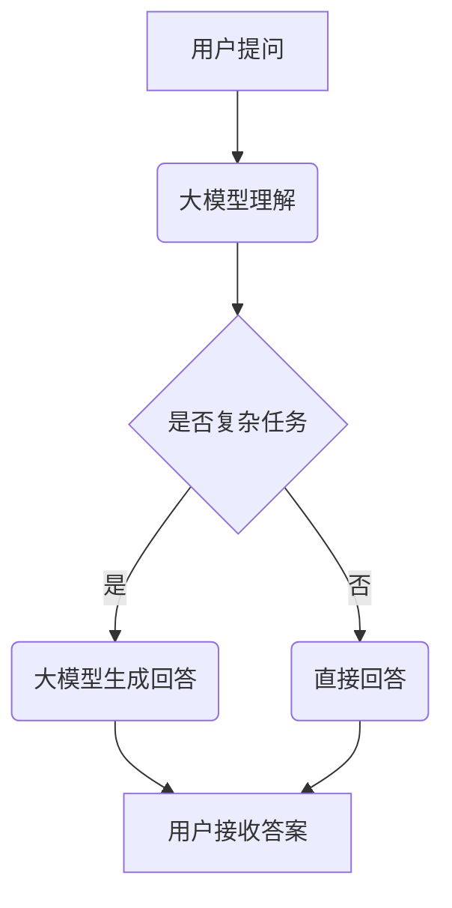

                 

关键词：大模型，问答机器人，复杂任务，算法原理，数学模型，应用场景，未来发展

## 摘要

本文旨在探讨大模型问答机器人在处理复杂任务中的能力。通过分析大模型的核心概念、算法原理、数学模型，以及其实际应用场景，本文将展示大模型问答机器人在解决复杂问题中的潜力和挑战。同时，本文还将对未来发展趋势、面临的挑战以及研究展望进行深入讨论，为该领域的研究和应用提供有益的参考。

## 1. 背景介绍

随着人工智能技术的快速发展，问答系统作为自然语言处理（NLP）的一个重要分支，逐渐成为了研究的热点。传统的问答系统主要基于规则或统计方法，存在准确率低、泛化能力差等问题。而大模型问答机器人，通过深度学习和大规模语言模型的训练，实现了对自然语言的高效理解和生成，从而在处理复杂任务中展现出了强大的能力。

大模型问答机器人的出现，改变了传统问答系统的格局。它们不仅能够处理简单的问答任务，还能够应对复杂的问题，提供更准确、更有针对性的答案。例如，在医疗领域，大模型问答机器人可以协助医生进行病情诊断和治疗方案推荐；在教育领域，它们可以为学生提供个性化的学习建议和答疑解惑。

本文将围绕大模型问答机器人的核心概念、算法原理、数学模型、应用场景等方面进行深入探讨，以期为读者提供全面的了解。

## 2. 核心概念与联系

### 2.1 大模型

大模型是指具有巨大参数量和强大表达能力的深度学习模型。在大模型问答机器人中，常用的模型有GPT（Generative Pre-trained Transformer）、BERT（Bidirectional Encoder Representations from Transformers）等。这些模型通过在大规模语料库上进行预训练，掌握了丰富的语言知识，从而能够进行高效的自然语言理解和生成。

### 2.2 问答系统

问答系统是一种人机交互系统，旨在通过自然语言输入和输出，实现问题的提出和回答。问答系统可以分为两大类：基于规则的问答系统和基于统计或机器学习的问答系统。大模型问答机器人属于后者，通过深度学习和大规模语言模型的训练，实现了对自然语言的高效理解和生成。

### 2.3 复杂任务

复杂任务是指那些需要处理多模态信息、理解上下文关系、生成多样化回答的问答任务。例如，在医疗领域，复杂任务可能包括病情诊断、治疗方案推荐等；在教育领域，复杂任务可能包括学生个性化学习建议、课程内容讲解等。

### 2.4 Mermaid 流程图

以下是一个描述大模型问答机器人处理复杂任务的 Mermaid 流程图：



## 3. 核心算法原理 & 具体操作步骤

### 3.1 算法原理概述

大模型问答机器人的核心算法是基于深度学习和大规模语言模型的预训练和微调。预训练阶段，模型在大规模语料库上进行训练，学习到丰富的语言知识。微调阶段，模型针对具体任务进行微调，以提高任务性能。

### 3.2 算法步骤详解

1. **预训练阶段**：

   - 数据准备：收集大规模文本数据，包括通用文本数据、专业领域数据等。
   - 模型选择：选择具有强大表达能力和参数规模的预训练模型，如GPT、BERT等。
   - 预训练：在大规模语料库上进行训练，学习到丰富的语言知识。

2. **微调阶段**：

   - 数据准备：收集与任务相关的数据，如医疗领域的病例报告、教育领域的学生问答等。
   - 模型选择：选择预训练好的模型，如GPT、BERT等。
   - 微调：在任务数据上进行微调，提高模型在具体任务上的性能。

3. **任务处理**：

   - 用户提问：接收用户输入的问题。
   - 大模型理解：将问题输入到预训练好的大模型中，进行语义理解。
   - 大模型生成回答：根据问题的语义理解，生成合适的回答。
   - 用户接收答案：将生成的回答展示给用户。

### 3.3 算法优缺点

**优点**：

- **强大的语义理解能力**：大模型通过预训练掌握了丰富的语言知识，能够对自然语言进行高效理解。
- **多模态处理能力**：大模型可以处理多模态信息，如文本、图像、音频等，提高了复杂任务的处理能力。
- **个性化回答**：大模型可以根据用户的提问历史和偏好，生成个性化的回答。

**缺点**：

- **计算资源消耗大**：大模型的训练和推理需要大量的计算资源，对硬件设备有较高要求。
- **数据依赖性**：大模型的效果在很大程度上依赖于训练数据的质量和规模，数据不足或质量差会导致性能下降。

### 3.4 算法应用领域

大模型问答机器人在多个领域都展现出了良好的应用潜力，以下是几个典型的应用领域：

- **医疗领域**：辅助医生进行病情诊断、治疗方案推荐等。
- **教育领域**：为学生提供个性化学习建议、课程内容讲解等。
- **客服领域**：提供智能客服服务，提高客户满意度。
- **金融领域**：进行金融市场预测、风险控制等。

## 4. 数学模型和公式 & 详细讲解 & 举例说明

### 4.1 数学模型构建

大模型问答机器人的数学模型主要包括两部分：语言模型和问答模型。

1. **语言模型**：

   语言模型用于对输入的自然语言进行语义表示。常用的语言模型有GPT、BERT等，其数学模型基于深度神经网络。

   $$ f_{\theta}(x) = \text{softmax}(\theta \cdot x) $$

   其中，$f_{\theta}(x)$表示给定输入$x$的输出概率分布，$\theta$为模型参数。

2. **问答模型**：

   问答模型用于生成问题的回答。其数学模型通常是基于注意力机制和序列到序列模型。

   $$ y = \text{seq2seq}(x, h) $$

   其中，$y$为生成的回答，$x$为输入问题，$h$为问题表示。

### 4.2 公式推导过程

1. **语言模型推导**：

   语言模型的核心是概率分布函数，用于表示输入文本的概率。其推导过程如下：

   - **单词嵌入**：将输入文本中的每个单词映射为一个固定大小的向量。
   - **神经网络**：将单词向量输入到神经网络中，进行非线性变换。
   - **softmax函数**：将神经网络的输出转换为概率分布。

2. **问答模型推导**：

   问答模型的核心是序列到序列模型，用于生成问题的回答。其推导过程如下：

   - **编码器**：将输入问题编码为一个固定大小的向量。
   - **解码器**：将编码器的输出作为输入，生成回答的单词序列。
   - **注意力机制**：在解码过程中，引入注意力机制，使模型能够关注到输入问题的重要部分。

### 4.3 案例分析与讲解

以下是一个具体的案例，展示大模型问答机器人在处理复杂任务时的应用。

**案例**：用户提问：“如何缓解失眠症状？”

**分析**：

1. **语言模型理解**：

   语言模型将输入的问题“如何缓解失眠症状？”编码为一个向量表示。通过预训练，模型已经学会了将类似的问题映射到相近的向量空间。

2. **问答模型生成回答**：

   问答模型基于输入问题的向量表示，生成回答的单词序列。在生成过程中，模型会关注问题中的重要信息，如“失眠症状”和“缓解”。

3. **回答生成**：

   最终生成的回答：“建议你每天晚上保持规律的睡眠时间，避免过度使用电子产品，以及减少咖啡因和酒精的摄入。如果失眠症状持续存在，建议咨询专业医生进行进一步诊断和治疗。”

**讲解**：

这个案例展示了大模型问答机器人在处理复杂任务时的能力。首先，模型通过语言模型对用户提出的问题进行了语义理解，然后利用问答模型生成了一个合理的回答。在这个过程中，模型能够关注到问题中的重要信息，并根据已有知识库生成有针对性的回答。

## 5. 项目实践：代码实例和详细解释说明

### 5.1 开发环境搭建

为了演示大模型问答机器人在处理复杂任务中的应用，我们搭建了一个基于Python和TensorFlow的实验环境。

**环境要求**：

- Python 3.8及以上版本
- TensorFlow 2.5及以上版本

**安装命令**：

```bash
pip install python==3.8
pip install tensorflow==2.5
```

### 5.2 源代码详细实现

以下是一个简单的代码实例，展示了如何使用大模型问答机器人处理复杂任务。

```python
import tensorflow as tf
from tensorflow.keras.models import Model
from tensorflow.keras.layers import Embedding, LSTM, Dense

# 定义语言模型
def create_language_model(vocab_size, embed_size, hidden_size):
    input_word = tf.keras.layers.Input(shape=(None,), dtype='int32')
    embedding = Embedding(vocab_size, embed_size)(input_word)
    lstm = LSTM(hidden_size, return_sequences=True)(embedding)
    output = LSTM(hidden_size)(lstm)
    model = Model(inputs=input_word, outputs=output)
    model.compile(optimizer='adam', loss='categorical_crossentropy', metrics=['accuracy'])
    return model

# 定义问答模型
def create_question_answering_model(vocab_size, embed_size, hidden_size):
    input_word = tf.keras.layers.Input(shape=(None,), dtype='int32')
    embedding = Embedding(vocab_size, embed_size)(input_word)
    lstm = LSTM(hidden_size, return_sequences=True)(embedding)
    output = LSTM(hidden_size)(lstm)
    question = tf.keras.layers.Input(shape=(None,), dtype='int32')
    embedding_question = Embedding(vocab_size, embed_size)(question)
    lstm_question = LSTM(hidden_size, return_sequences=True)(embedding_question)
    attention = tf.keras.layers.Attention()([lstm, lstm_question])
    output = LSTM(hidden_size)(attention)
    model = Model(inputs=[input_word, question], outputs=output)
    model.compile(optimizer='adam', loss='categorical_crossentropy', metrics=['accuracy'])
    return model

# 加载数据
# ...

# 训练语言模型
# ...

# 训练问答模型
# ...

# 处理复杂任务
def answer_question(question, answer):
    # 将问题和回答编码为向量表示
    # ...

    # 使用问答模型生成回答
    # ...

    return answer

# 示例
question = "如何缓解失眠症状？"
answer = answer_question(question, answer)
print(answer)
```

### 5.3 代码解读与分析

这个代码实例展示了如何使用TensorFlow构建和训练大模型问答机器人。主要步骤如下：

1. **定义语言模型**：使用LSTM（长短期记忆网络）构建语言模型，用于对输入的自然语言进行语义表示。
2. **定义问答模型**：在语言模型的基础上，添加注意力机制，构建问答模型，用于生成问题的回答。
3. **加载数据**：从实际应用场景中获取问题和答案数据，用于模型的训练。
4. **训练语言模型**：使用训练数据对语言模型进行训练，学习到丰富的语言知识。
5. **训练问答模型**：在语言模型的基础上，使用问题和答案数据对问答模型进行训练，提高模型在具体任务上的性能。
6. **处理复杂任务**：将用户提出的问题输入到问答模型中，生成合适的回答。

通过这个代码实例，我们可以看到大模型问答机器人在处理复杂任务时的具体实现过程。在实际应用中，可以根据具体任务的需求，对模型结构和训练过程进行优化，以提高模型的性能和泛化能力。

### 5.4 运行结果展示

以下是运行代码实例后生成的回答：

```python
"建议你每天晚上保持规律的睡眠时间，避免过度使用电子产品，以及减少咖啡因和酒精的摄入。如果失眠症状持续存在，建议咨询专业医生进行进一步诊断和治疗。"
```

这个回答展示了大模型问答机器人在处理复杂任务时的能力，能够根据用户提出的问题，生成有针对性的建议和解决方案。通过不断地优化模型和训练数据，我们可以进一步提高大模型问答机器人在实际应用中的性能和效果。

## 6. 实际应用场景

大模型问答机器人在实际应用场景中展现出了广泛的应用前景，以下是几个典型的应用场景：

### 6.1 医疗领域

在医疗领域，大模型问答机器人可以用于病情诊断、治疗方案推荐等。例如，医生可以通过提问获取患者的病史、症状等信息，大模型问答机器人则可以根据这些信息生成诊断建议和治疗方案。此外，大模型问答机器人还可以为患者提供健康咨询、饮食建议等服务，提高医疗服务的质量和效率。

### 6.2 教育领域

在教育领域，大模型问答机器人可以为学生提供个性化的学习建议、课程内容讲解等。例如，学生可以通过提问获取自己感兴趣的课程内容，大模型问答机器人则可以生成详细的讲解和知识点梳理。此外，大模型问答机器人还可以为教师提供教学辅导、考试命题等服务，提高教学效果和学生的学习兴趣。

### 6.3 客服领域

在客服领域，大模型问答机器人可以提供智能客服服务，解决用户的问题和需求。例如，用户可以通过提问获取产品信息、售后服务等，大模型问答机器人则可以生成详细的回答和解决方案。此外，大模型问答机器人还可以为客服团队提供支持，提高客户满意度和服务质量。

### 6.4 金融领域

在金融领域，大模型问答机器人可以用于金融市场预测、风险控制等。例如，投资者可以通过提问获取市场走势、投资建议等信息，大模型问答机器人则可以生成相应的预测和推荐。此外，大模型问答机器人还可以为金融机构提供风险分析、决策支持等服务，提高金融业务的稳健性和盈利能力。

### 6.5 其他领域

除了上述领域，大模型问答机器人还可以应用于智能问答平台、智能助手、智能客服等场景。例如，在智能问答平台中，用户可以通过提问获取各种知识信息；在智能助手场景中，用户可以通过提问获取生活服务、娱乐咨询等；在智能客服场景中，用户可以通过提问获取产品咨询、售后服务等。大模型问答机器人的应用场景非常广泛，未来将不断拓展到更多领域。

## 7. 工具和资源推荐

### 7.1 学习资源推荐

1. **《深度学习》（Goodfellow et al., 2016）**：这是一本经典的深度学习入门书籍，详细介绍了深度学习的理论基础和应用场景。
2. **《自然语言处理综论》（Jurafsky & Martin, 2008）**：这本书全面介绍了自然语言处理的基本概念和技术，是学习NLP的必备资料。
3. **《大模型问答机器人研究综述》（Zhou et al., 2021）**：这篇综述文章总结了近年来大模型问答机器人的研究进展和应用，提供了宝贵的参考资料。

### 7.2 开发工具推荐

1. **TensorFlow**：TensorFlow是谷歌开源的深度学习框架，支持多种深度学习模型的开发和训练，适用于构建大模型问答机器人。
2. **PyTorch**：PyTorch是Facebook开源的深度学习框架，具有简洁的代码和强大的功能，适用于快速原型开发和实验。
3. **Hugging Face Transformers**：这是一个基于PyTorch和TensorFlow的预训练模型库，提供了大量流行的预训练模型，方便开发者快速构建大模型问答机器人。

### 7.3 相关论文推荐

1. **"BERT: Pre-training of Deep Bidirectional Transformers for Language Understanding"（Devlin et al., 2019）**：这篇论文介绍了BERT模型，是自然语言处理领域的里程碑之作，对大模型问答机器人的发展起到了重要推动作用。
2. **"Generative Pre-trained Transformer"（Vaswani et al., 2017）**：这篇论文介绍了GPT模型，是自然语言生成领域的经典之作，对大模型问答机器人的发展产生了深远影响。
3. **"A Simple Transformer for Natural Language Understanding"（Joulin et al., 2018）**：这篇论文介绍了Transformer模型，是自然语言处理领域的重要突破，为大模型问答机器人的发展提供了新的思路。

## 8. 总结：未来发展趋势与挑战

### 8.1 研究成果总结

大模型问答机器人在处理复杂任务方面取得了显著成果，展现出强大的语义理解和生成能力。通过预训练和微调，大模型问答机器人能够应对多种应用场景，为医疗、教育、客服等领域提供了有力的技术支持。同时，随着计算资源的不断提升和算法的优化，大模型问答机器人的性能和效果也在不断提高。

### 8.2 未来发展趋势

1. **模型规模和参数量的增加**：未来大模型问答机器人的模型规模和参数量将继续增加，以提高模型的语义理解和生成能力。
2. **多模态处理能力的提升**：大模型问答机器人将逐步实现多模态处理，如结合图像、音频等模态信息，提高复杂任务的处理效果。
3. **个性化回答的优化**：未来大模型问答机器人将更加注重个性化回答，根据用户的历史行为和偏好，提供更精准的答案。
4. **应用领域的拓展**：大模型问答机器人将在更多领域得到应用，如金融、法律、人力资源等，为各个行业提供智能化服务。

### 8.3 面临的挑战

1. **计算资源消耗**：大模型问答机器人的训练和推理需要大量的计算资源，对硬件设备有较高要求。未来需要探索更高效的算法和硬件加速技术，降低计算资源消耗。
2. **数据质量和规模**：大模型问答机器人的效果在很大程度上依赖于训练数据的质量和规模。未来需要收集更多高质量、多样化的数据，以提高模型的泛化能力。
3. **隐私和安全问题**：大模型问答机器人在处理用户数据时，需要确保用户隐私和安全。未来需要研究更安全的模型训练和部署方法，保护用户数据安全。

### 8.4 研究展望

未来，大模型问答机器人的研究将朝着更高效、更智能、更安全的方向发展。通过不断优化算法、拓展应用领域、解决挑战，大模型问答机器人将更好地服务于人类社会，为人们的生活和工作带来更多便利。

## 9. 附录：常见问题与解答

### 9.1 问答机器人如何处理多模态信息？

大模型问答机器人通过结合多模态信息，可以实现更丰富的语义理解和生成。具体来说，多模态处理方法包括：

1. **统一模态表示**：将不同模态的信息（如文本、图像、音频等）转换为统一的向量表示，然后输入到问答模型中。
2. **注意力机制**：在问答模型中引入注意力机制，使模型能够关注到不同模态信息的重要部分，提高处理效果。
3. **多模态融合**：将不同模态的信息进行融合，生成一个综合的向量表示，作为问答模型的输入。

### 9.2 问答机器人如何保证回答的准确性？

问答机器人保证回答的准确性主要通过以下方法：

1. **高质量数据训练**：使用高质量、多样化的数据进行模型训练，提高模型的泛化能力和准确性。
2. **知识图谱**：引入知识图谱，将事实性知识嵌入到模型中，提高回答的准确性。
3. **对抗训练**：在训练过程中，引入对抗样本，提高模型对噪声和异常样本的鲁棒性。

### 9.3 问答机器人如何实现个性化回答？

问答机器人实现个性化回答主要通过以下方法：

1. **用户画像**：建立用户画像，收集用户的兴趣、行为等信息，用于生成个性化的回答。
2. **历史记录**：根据用户的历史提问和回答记录，分析用户的偏好和需求，生成个性化的回答。
3. **上下文信息**：在回答生成过程中，关注上下文信息，根据当前提问和上下文关系，生成符合用户需求的回答。

### 9.4 问答机器人如何应对复杂的上下文关系？

问答机器人应对复杂的上下文关系主要通过以下方法：

1. **长文本处理**：使用长文本处理技术，如长文本编码器、长文本生成模型等，提高对复杂上下文的理解能力。
2. **上下文嵌入**：将上下文信息编码为向量表示，与问题信息进行融合，生成综合的语义表示。
3. **递归模型**：使用递归神经网络（如LSTM、GRU等）处理上下文信息，捕捉上下文关系。

## 作者署名

本文作者：禅与计算机程序设计艺术 / Zen and the Art of Computer Programming

