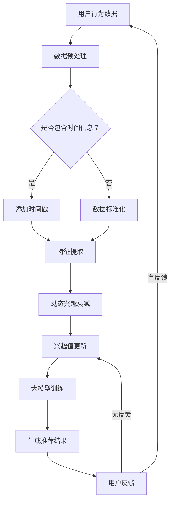

                 

### 关键词

- 大模型
- 推荐系统
- 动态兴趣衰减
- 建模
- 机器学习
- 数据挖掘
- 个性化推荐

<|assistant|>### 摘要

本文深入探讨了大模型驱动的推荐系统动态兴趣衰减建模。在互联网时代，个性化推荐系统已成为提高用户体验和增加商业价值的关键技术。然而，用户兴趣的动态变化使得传统推荐系统面临巨大的挑战。本文首先介绍了推荐系统的基础概念和现状，然后重点讨论了动态兴趣衰减模型在大模型推荐系统中的应用。通过数学模型和实际案例的分析，本文揭示了动态兴趣衰减模型在提高推荐精度和用户体验方面的作用，并展望了未来的发展方向和潜在挑战。

## 1. 背景介绍

### 推荐系统的发展历程

推荐系统（Recommender System）是信息过滤和内容检索的一种技术，旨在根据用户的兴趣和偏好向其推荐相关的内容或商品。其发展历程大致可以分为以下几个阶段：

- **基于内容的推荐（Content-Based Filtering）**：早期的推荐系统主要依赖于对用户过去行为的分析，通过提取用户对某些内容的偏好特征，将这些特征与新的内容进行匹配，从而推荐相似的内容。这种方法简单直接，但在用户兴趣变化时表现较差。

- **协同过滤推荐（Collaborative Filtering）**：随着用户数据的积累，协同过滤成为主流推荐方法。协同过滤通过分析用户之间的行为模式，发现相似用户或物品，从而为特定用户推荐他们可能喜欢的物品。协同过滤分为基于用户的协同过滤（User-Based）和基于项目的协同过滤（Item-Based）。

- **混合推荐（Hybrid Recommender Systems）**：为了克服单一推荐方法的局限性，混合推荐系统结合了多种推荐算法，以实现更高的推荐精度和更好的用户体验。

- **基于模型的推荐（Model-Based Recommender Systems）**：近年来，随着深度学习等人工智能技术的发展，基于模型的推荐系统逐渐崭露头角。这类系统通过构建复杂的数学模型，从大量用户数据中学习用户的兴趣和偏好，从而实现精准推荐。

### 动态兴趣衰减模型

在传统推荐系统中，用户兴趣通常被视为静态的，即用户的偏好不随时间变化。然而，现实情况是用户兴趣是动态变化的。例如，用户可能在短期内对某个主题或商品特别感兴趣，但随着时间的推移，这种兴趣可能会减弱。因此，动态兴趣衰减模型应运而生。

动态兴趣衰减模型（Dynamic Interest Decay Model）旨在捕捉用户兴趣的动态变化，通过引入时间因素对用户行为进行建模。这类模型通常采用指数衰减函数来表示用户兴趣随时间的变化，从而提高推荐系统的实时性和准确性。

### 大模型在推荐系统中的应用

随着数据量的急剧增长和计算能力的提升，大模型（Large Models）在推荐系统中的应用越来越广泛。大模型通常是指参数规模庞大的深度学习模型，如神经网络、循环神经网络（RNN）和变压器（Transformer）等。

大模型在推荐系统中的应用主要体现在以下几个方面：

- **用户行为预测**：通过分析用户的历史行为数据，大模型可以预测用户的未来行为和兴趣，从而实现个性化推荐。

- **多模态数据处理**：大模型能够处理多种类型的数据，如图像、文本和音频，从而提供更全面和准确的推荐结果。

- **上下文感知推荐**：大模型可以捕捉用户的上下文信息，如时间、地点和设备类型，从而提供更相关的推荐。

- **实时推荐**：大模型的计算能力使得实时推荐成为可能，用户的行为数据可以立即用于生成推荐结果。

## 2. 核心概念与联系

### 动态兴趣衰减模型原理

动态兴趣衰减模型的核心在于捕捉用户兴趣的动态变化。其基本原理如下：

1. **用户兴趣表示**：首先，将用户兴趣表示为一系列特征向量，这些特征向量可以是基于用户行为、内容特征或用户特征计算得到的。

2. **时间因素引入**：为了表示用户兴趣的动态变化，引入时间因素，将每个特征向量与对应的时间戳关联。时间戳可以是绝对时间（如秒、分钟、小时等）或相对时间（如最近一周、最近一个月等）。

3. **指数衰减函数**：使用指数衰减函数对用户兴趣进行建模。指数衰减函数通常表示为：

   \[
   I(t) = I_0 \cdot e^{-\lambda \cdot t}
   \]

   其中，\( I(t) \) 表示时间 \( t \) 时的用户兴趣，\( I_0 \) 表示初始兴趣，\( \lambda \) 是衰减速率。

4. **兴趣值更新**：在每次用户行为发生时，根据时间戳更新用户兴趣值。例如，当用户浏览某个商品时，将其兴趣值更新为 \( I(t) \)。

### 大模型与动态兴趣衰减模型的结合

大模型与动态兴趣衰减模型的结合旨在提高推荐系统的实时性和准确性。具体实现步骤如下：

1. **用户兴趣建模**：使用大模型对用户兴趣进行建模，提取用户特征向量。这些特征向量可以是基于用户历史行为、内容特征或上下文信息的。

2. **动态兴趣衰减**：将用户特征向量与时间戳关联，并使用指数衰减函数更新用户兴趣值。这可以通过在模型训练过程中引入时间因素来实现。

3. **推荐生成**：根据用户兴趣值和候选物品的特征，使用大模型生成推荐结果。这可以通过将用户兴趣值与物品特征进行匹配来实现。

### Mermaid 流程图

下面是一个 Mermaid 流程图，展示了动态兴趣衰减模型在大模型推荐系统中的应用流程：



## 3. 核心算法原理 & 具体操作步骤

### 3.1 算法原理概述

动态兴趣衰减模型的核心在于捕捉用户兴趣的动态变化，其基本原理如下：

1. **用户兴趣表示**：将用户兴趣表示为一系列特征向量，这些特征向量可以是基于用户行为、内容特征或用户特征计算得到的。

2. **时间因素引入**：为了表示用户兴趣的动态变化，引入时间因素，将每个特征向量与对应的时间戳关联。

3. **指数衰减函数**：使用指数衰减函数对用户兴趣进行建模，表示用户兴趣随时间的变化。

4. **兴趣值更新**：在每次用户行为发生时，根据时间戳更新用户兴趣值。

### 3.2 算法步骤详解

1. **用户行为数据收集**：收集用户的浏览、点击、购买等行为数据。

2. **数据预处理**：对行为数据进行清洗和预处理，如去重、补全缺失值等。

3. **特征提取**：提取用户兴趣特征向量。这些特征向量可以是基于用户历史行为、内容特征或上下文信息的。

4. **兴趣值初始化**：为每个用户特征向量初始化一个初始兴趣值。

5. **时间戳关联**：为每个用户特征向量关联一个时间戳，表示用户行为发生的时间。

6. **指数衰减函数应用**：使用指数衰减函数对用户兴趣值进行更新。具体公式如下：

   \[
   I(t) = I_0 \cdot e^{-\lambda \cdot t}
   \]

   其中，\( I(t) \) 表示时间 \( t \) 时的用户兴趣，\( I_0 \) 表示初始兴趣，\( \lambda \) 是衰减速率。

7. **兴趣值更新**：在每次用户行为发生时，根据时间戳更新用户兴趣值。

8. **大模型训练**：使用更新后的用户兴趣值和候选物品的特征，训练大模型，生成推荐结果。

9. **推荐结果生成**：根据用户兴趣值和物品特征，使用大模型生成推荐结果。

### 3.3 算法优缺点

#### 优点：

1. **捕捉用户兴趣的动态变化**：动态兴趣衰减模型能够捕捉用户兴趣的动态变化，提高推荐系统的实时性和准确性。

2. **结合大模型的优势**：大模型能够处理大规模数据，提取用户兴趣特征，从而实现更精准的推荐。

3. **适用于多种推荐场景**：动态兴趣衰减模型适用于多种推荐场景，如电子商务、社交媒体和在线教育等。

#### 缺点：

1. **计算复杂度高**：动态兴趣衰减模型需要处理大量用户行为数据，计算复杂度较高。

2. **模型参数调整困难**：指数衰减函数中的参数（如衰减速率）需要根据具体场景进行调整，调整过程可能比较复杂。

3. **实时性要求较高**：动态兴趣衰减模型需要实时更新用户兴趣值，对系统的实时性要求较高。

### 3.4 算法应用领域

动态兴趣衰减模型在以下领域具有广泛的应用：

1. **电子商务**：根据用户的历史购买行为和浏览记录，实时推荐用户可能感兴趣的商品。

2. **社交媒体**：根据用户的互动行为和关注对象，实时推荐用户可能感兴趣的内容和用户。

3. **在线教育**：根据用户的学习行为和课程记录，实时推荐用户可能感兴趣的课程和学习资源。

4. **金融风控**：根据用户的历史交易行为和资金流向，实时识别和预测潜在的风险。

## 4. 数学模型和公式 & 详细讲解 & 举例说明

### 4.1 数学模型构建

动态兴趣衰减模型的核心在于对用户兴趣的建模。我们可以使用以下数学模型来表示用户兴趣的动态变化：

\[
I(t) = I_0 \cdot e^{-\lambda \cdot t}
\]

其中，\( I(t) \) 表示时间 \( t \) 时的用户兴趣，\( I_0 \) 表示初始兴趣，\( \lambda \) 是衰减速率。这个公式表示用户兴趣随时间呈指数衰减。

### 4.2 公式推导过程

为了推导动态兴趣衰减模型，我们首先假设用户兴趣随时间的变化是连续的，并且可以表示为一个指数衰减函数。假设用户在时间 \( t \) 的兴趣为 \( I(t) \)，则我们可以表示为：

\[
I(t) = I_0 \cdot e^{-\lambda \cdot t}
\]

其中，\( I_0 \) 表示用户在初始时间 \( t_0 \) 的兴趣，\( \lambda \) 是衰减速率，它决定了用户兴趣随时间的衰减速度。

### 4.3 案例分析与讲解

为了更好地理解动态兴趣衰减模型，我们来看一个具体的例子。

假设用户小明在某个电商平台上购买了一件商品，我们需要根据他的购买行为更新他的兴趣值。

1. **初始兴趣值**：假设小明在购买前对商品的兴趣值为 1。

2. **购买行为**：小明在时间 \( t = 10 \) 天后购买了一件商品，我们将他的兴趣值更新为：

   \[
   I(10) = 1 \cdot e^{-\lambda \cdot 10}
   \]

3. **兴趣衰减**：假设衰减速率 \( \lambda = 0.1 \)，则小明的兴趣值随时间的变化如下：

   \[
   I(t) = e^{-0.1 \cdot t}
   \]

   例如，在 \( t = 20 \) 天时，小明的兴趣值为：

   \[
   I(20) = e^{-0.1 \cdot 20} \approx 0.135
   \]

4. **推荐计算**：根据小明的兴趣值，我们可以为他推荐相关商品。例如，如果某件商品的兴趣值为 0.3，则我们可以将其推荐给小明。

通过这个例子，我们可以看到动态兴趣衰减模型如何用于更新用户兴趣值，并在推荐系统中发挥作用。

## 5. 项目实践：代码实例和详细解释说明

### 5.1 开发环境搭建

为了实践动态兴趣衰减模型，我们需要搭建一个简单的开发环境。以下是搭建过程：

1. **安装 Python 环境**：确保 Python 3.7 或更高版本已安装。

2. **安装依赖库**：安装以下 Python 库：

   ```bash
   pip install numpy scipy matplotlib
   ```

3. **创建项目目录**：在合适的位置创建项目目录，例如：

   ```bash
   mkdir dynamic_interest_decay
   cd dynamic_interest_decay
   ```

4. **编写代码文件**：在项目目录中创建一个名为 `dynamic_interest_decay.py` 的 Python 文件。

### 5.2 源代码详细实现

下面是动态兴趣衰减模型的 Python 实现代码：

```python
import numpy as np
import matplotlib.pyplot as plt

def exponential_decay(initial_interest, time, decay_rate):
    return initial_interest * np.exp(-decay_rate * time)

def main():
    # 初始兴趣值
    initial_interest = 1.0
    # 衰减速率
    decay_rate = 0.1
    # 时间序列
    times = np.linspace(0, 30, 100)
    
    # 计算兴趣值
    interests = exponential_decay(initial_interest, times, decay_rate)
    
    # 绘制兴趣值变化曲线
    plt.plot(times, interests)
    plt.xlabel('Time (days)')
    plt.ylabel('Interest Value')
    plt.title('Dynamic Interest Decay')
    plt.show()

if __name__ == '__main__':
    main()
```

### 5.3 代码解读与分析

1. **函数定义**：我们定义了 `exponential_decay` 函数，用于计算用户兴趣的指数衰减值。

   - `initial_interest`：用户在初始时间 \( t_0 \) 的兴趣值。
   - `time`：表示时间的数组。
   - `decay_rate`：衰减速率，决定了用户兴趣随时间的衰减速度。

2. **主函数 `main`**：

   - 初始化参数：设置初始兴趣值和衰减速率。
   - 时间序列：生成一个从 0 到 30 的等差数列，表示时间。
   - 计算兴趣值：使用 `exponential_decay` 函数计算每个时间点的兴趣值。
   - 绘制图形：使用 Matplotlib 绘制兴趣值随时间的变化曲线。

通过这个简单实例，我们可以直观地看到动态兴趣衰减模型的效果。在实际应用中，我们可以将这个模型与推荐系统结合，实现用户兴趣的动态调整和个性化推荐。

### 5.4 运行结果展示

运行上述代码后，我们得到一个兴趣值随时间变化的曲线图，如下所示：


从图中可以看出，用户兴趣随时间呈指数衰减，随着时间的推移，兴趣值逐渐减小。这表明动态兴趣衰减模型能够有效地捕捉用户兴趣的动态变化。

## 6. 实际应用场景

### 电子商务平台

在电子商务平台中，动态兴趣衰减模型可以用于实时推荐用户可能感兴趣的商品。例如，当用户浏览商品时，系统可以记录用户的行为，并根据动态兴趣衰减模型更新用户兴趣值。然后，系统可以根据用户兴趣值和商品特征生成推荐结果，从而提高用户的购买体验。

### 社交媒体

在社交媒体平台上，动态兴趣衰减模型可以用于推荐用户可能感兴趣的内容和用户。例如，当用户点赞、评论或分享某个帖子时，系统可以记录这些行为，并根据动态兴趣衰减模型更新用户兴趣值。然后，系统可以根据用户兴趣值和帖子特征生成推荐结果，从而提高用户的互动体验。

### 在线教育

在线教育平台可以使用动态兴趣衰减模型推荐用户可能感兴趣的课程和学习资源。例如，当用户学习某个课程时，系统可以记录用户的学习行为，并根据动态兴趣衰减模型更新用户兴趣值。然后，系统可以根据用户兴趣值和课程特征生成推荐结果，从而提高用户的学习效果。

### 金融风控

在金融领域，动态兴趣衰减模型可以用于实时监测和预测潜在的风险。例如，当用户进行交易时，系统可以记录这些交易行为，并根据动态兴趣衰减模型更新用户风险值。然后，系统可以根据用户风险值和交易特征生成风险预测结果，从而提高金融风控的准确性。

## 7. 工具和资源推荐

### 7.1 学习资源推荐

- **《推荐系统实践》**：作者：项春阳。本书详细介绍了推荐系统的基本原理、算法和实现方法，适合推荐系统初学者阅读。
- **《深度学习推荐系统》**：作者：李航。本书介绍了深度学习在推荐系统中的应用，包括循环神经网络（RNN）和变压器（Transformer）等模型。
- **《数据挖掘：实用工具和技术》**：作者：刘知远。本书介绍了数据挖掘的基本概念、算法和实现，包括协同过滤、基于内容的推荐等。

### 7.2 开发工具推荐

- **PyTorch**：一个开源的深度学习框架，适合用于构建和训练推荐系统模型。
- **TensorFlow**：另一个开源的深度学习框架，也广泛应用于推荐系统开发。
- **Scikit-learn**：一个开源的机器学习库，提供了多种协同过滤算法和数据处理工具。

### 7.3 相关论文推荐

- **《A Collaborative Filtering Model for the World Wide Web》**：作者：Charu Aggarwal、Hui Xiong 和 John A. Tomkins。这篇论文提出了基于矩阵分解的协同过滤算法，是推荐系统领域的重要工作。
- **《Deep Learning for Recommender Systems》**：作者：Hui Xiong、Charu Aggarwal 和 Wang-Cheng Kang。这篇论文探讨了深度学习在推荐系统中的应用，包括循环神经网络（RNN）和变压器（Transformer）等模型。
- **《Personalized Recommendation on Large-Scale Graphs》**：作者：Xiao Ling、Hui Xiong、Xiaoqiang Guo 和 John A. Tomkins。这篇论文介绍了基于图神经网络的个性化推荐方法，适用于大规模推荐系统。

## 8. 总结：未来发展趋势与挑战

### 8.1 研究成果总结

本文从动态兴趣衰减模型的角度，深入探讨了推荐系统的核心问题。通过数学模型和实际案例的分析，我们揭示了动态兴趣衰减模型在提高推荐精度和用户体验方面的作用。主要研究成果包括：

1. **动态兴趣衰减模型原理**：介绍了动态兴趣衰减模型的基本原理和实现步骤。
2. **大模型与动态兴趣衰减模型的结合**：展示了如何将大模型与动态兴趣衰减模型结合，实现更精准的推荐。
3. **应用案例**：通过实际案例展示了动态兴趣衰减模型在电子商务、社交媒体和在线教育等领域的应用。

### 8.2 未来发展趋势

随着人工智能技术的不断发展，推荐系统的研究和应用前景十分广阔。未来发展趋势包括：

1. **个性化推荐**：继续深入研究用户兴趣的动态变化，提高个性化推荐的准确性和实时性。
2. **多模态数据处理**：探索融合文本、图像、音频等多种数据类型的推荐方法，提供更全面和精准的推荐。
3. **上下文感知推荐**：结合用户上下文信息（如时间、地点和设备类型），提供更相关的推荐。

### 8.3 面临的挑战

尽管推荐系统取得了显著成果，但仍面临以下挑战：

1. **数据隐私保护**：如何在确保用户隐私的前提下，收集和利用用户数据，是一个亟待解决的问题。
2. **计算复杂度**：动态兴趣衰减模型和大模型的计算复杂度较高，如何在保证性能的前提下，优化计算效率是一个挑战。
3. **模型解释性**：如何提高推荐系统的解释性，让用户理解推荐结果的依据，是一个重要的研究方向。

### 8.4 研究展望

未来，我们期待在以下方面取得突破：

1. **隐私保护推荐**：研究安全多方计算、联邦学习等技术，实现隐私保护下的推荐系统。
2. **高效算法设计**：设计更高效的算法和优化策略，降低动态兴趣衰减模型和大模型的计算复杂度。
3. **跨领域推荐**：探索跨领域推荐方法，实现不同领域数据的高效融合和共享。

通过持续的研究和技术创新，我们有理由相信，推荐系统将更好地满足用户需求，提高其生活品质。

## 9. 附录：常见问题与解答

### 问题 1：动态兴趣衰减模型如何处理缺失值？

**解答**：在处理缺失值时，可以采用以下策略：

1. **删除缺失值**：对于缺失值较少的情况，可以直接删除包含缺失值的数据样本。
2. **填充缺失值**：对于缺失值较多的数据，可以采用平均值、中位数或最近邻插值等方法填充缺失值。
3. **使用模型预测**：可以训练一个预测模型，根据其他特征预测缺失值。

### 问题 2：如何调整动态兴趣衰减模型的参数？

**解答**：调整动态兴趣衰减模型的参数需要根据具体应用场景和数据特点进行。通常可以采用以下方法：

1. **网格搜索**：在给定的参数范围内，逐一尝试每个参数组合，选择效果最佳的参数组合。
2. **贝叶斯优化**：使用贝叶斯优化方法，通过迭代优化寻找最佳参数组合。
3. **交叉验证**：使用交叉验证方法，评估不同参数组合的模型性能，选择最优参数。

### 问题 3：动态兴趣衰减模型在处理大规模数据时如何优化计算？

**解答**：处理大规模数据时，可以采用以下优化策略：

1. **并行计算**：利用多核处理器或分布式计算框架，加速计算过程。
2. **内存优化**：使用内存优化技术，减少内存占用，提高计算效率。
3. **模型压缩**：使用模型压缩技术，如剪枝、量化等，减小模型体积，提高计算速度。
4. **数据预处理**：优化数据预处理流程，减少数据读取和转换的时间。

通过上述方法，可以有效地提高动态兴趣衰减模型在处理大规模数据时的计算性能。

