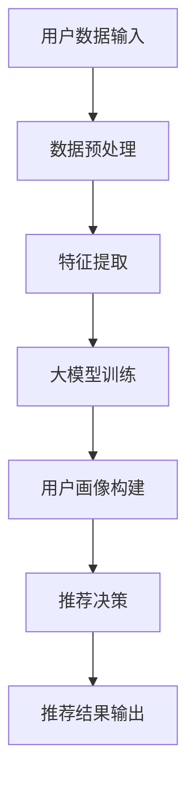

                 

### 1. 背景介绍

随着互联网和大数据技术的快速发展，推荐系统已经成为许多互联网公司提高用户满意度和促进业务增长的关键工具。推荐系统通过分析用户的历史行为、兴趣偏好以及其他相关数据，为用户推荐个性化内容、商品或服务，从而提升用户体验和参与度。

用户画像作为推荐系统的核心组成部分，是指通过对用户历史数据进行分析，构建出一个全面的、多维度的用户模型。这个模型能够描述用户的行为模式、兴趣爱好、价值倾向等特征，为推荐系统提供决策依据。传统的用户画像构建方法主要依赖于统计分析和机器学习算法，但这种方法存在一定的局限性：

1. **数据依赖性高**：用户画像的构建依赖于大量的用户行为数据，当数据不完整或存在噪声时，用户画像的准确性会受到影响。
2. **更新不及时**：用户行为和偏好是动态变化的，传统的用户画像方法难以实时反映这些变化，导致推荐结果不够精准。
3. **特征维度受限**：传统方法往往只能利用有限的特征维度来构建用户画像，难以捕捉到用户行为的复杂性和多样性。

为了解决这些问题，大模型驱动的推荐系统用户画像动态更新技术应运而生。本文将详细介绍这一技术的基本原理、核心算法、应用场景及其未来发展趋势。

### 2. 核心概念与联系

在深入探讨大模型驱动的推荐系统用户画像动态更新技术之前，我们需要先了解几个核心概念：

#### 2.1 大模型

大模型是指具有大规模参数和复杂结构的机器学习模型。这些模型通常能够处理海量数据，并通过深度学习、强化学习等先进算法，提取数据中的复杂模式和高层次特征。在大模型驱动的推荐系统中，大模型负责构建用户画像，实现动态更新和精准推荐。

#### 2.2 用户画像

用户画像是指通过分析用户的历史行为数据、社交信息、地理位置等多维度数据，构建出的一个综合性的用户模型。用户画像不仅包含用户的基本信息，还涵盖了用户的行为偏好、兴趣爱好、价值倾向等。

#### 2.3 动态更新

动态更新是指用户画像能够实时反映用户行为和偏好变化的一种能力。动态更新的核心在于模型能够持续地学习和调整，以适应用户的变化。

#### 2.4 大模型驱动的推荐系统

大模型驱动的推荐系统是指利用大模型来构建用户画像、进行推荐决策的一套系统。这种系统具有以下几个特点：

1. **自适应性强**：系统能够根据用户行为数据的实时变化，自适应地调整用户画像。
2. **精准度高**：大模型能够提取用户行为数据中的深层次特征，提高推荐结果的精准度。
3. **处理能力强**：大模型能够处理海量数据，支持大规模用户的个性化推荐。

下面是一个用Mermaid绘制的流程图，展示了大模型驱动的推荐系统用户画像动态更新的基本架构：



在图中，用户数据输入经过数据预处理、特征提取后，被送入大模型进行训练。训练完成后，大模型生成用户画像，并用于推荐决策。最终，推荐结果被输出给用户。这个流程体现了大模型驱动的推荐系统用户画像动态更新的核心机制。

### 3. 核心算法原理 & 具体操作步骤

#### 3.1 算法原理概述

大模型驱动的推荐系统用户画像动态更新技术的核心在于利用大模型对用户行为数据进行分析和建模，实现用户画像的实时更新和精准推荐。具体来说，该技术包括以下几个步骤：

1. **数据预处理**：对用户行为数据进行清洗、去噪、归一化等处理，为后续的特征提取和模型训练做好准备。
2. **特征提取**：利用深度学习等方法，从用户行为数据中提取出高层次的、有代表性的特征。
3. **大模型训练**：使用大规模数据集对大模型进行训练，使其能够自动学习和捕捉用户行为数据的复杂模式。
4. **用户画像构建**：通过大模型训练得到的用户画像模型，构建出每个用户的详细画像。
5. **推荐决策**：根据用户画像和推荐算法，为用户生成个性化的推荐结果。
6. **动态更新**：定期对用户画像进行更新，以反映用户行为和偏好变化。

#### 3.2 算法步骤详解

1. **数据预处理**

   数据预处理是推荐系统用户画像构建的基础步骤。在这一步，我们需要对原始用户行为数据进行清洗和预处理，以确保数据的质量和一致性。具体操作包括：

   - **去重**：去除重复的数据条目。
   - **去噪**：去除噪声数据和异常值。
   - **归一化**：对数据进行归一化处理，使其在相同的尺度上。
   - **缺失值处理**：填补缺失值或删除含有缺失值的数据条目。

2. **特征提取**

   特征提取是推荐系统用户画像构建的关键步骤。在这一步，我们需要从用户行为数据中提取出有代表性的特征，以便大模型能够对其进行有效的建模。常用的特征提取方法包括：

   - **统计特征**：如点击率、购买频率、停留时间等。
   - **文本特征**：如关键词提取、主题模型等。
   - **图像特征**：如卷积神经网络（CNN）提取的特征。
   - **交互特征**：如用户与商品或服务的交互强度、时间间隔等。

3. **大模型训练**

   大模型训练是推荐系统用户画像动态更新的核心步骤。在这一步，我们需要使用大规模数据集对大模型进行训练，使其能够自动学习和捕捉用户行为数据的复杂模式。常用的训练方法包括：

   - **深度学习**：如深度神经网络（DNN）、循环神经网络（RNN）、卷积神经网络（CNN）等。
   - **强化学习**：如基于策略梯度的强化学习算法。
   - **迁移学习**：利用预训练模型进行微调，提高模型的泛化能力。

4. **用户画像构建**

   用户画像构建是推荐系统用户画像动态更新的输出步骤。在这一步，我们需要使用训练好的大模型，为每个用户生成详细的画像。用户画像通常包括以下几个部分：

   - **基本信息**：如年龄、性别、职业等。
   - **行为特征**：如浏览历史、购买记录、评论等。
   - **兴趣偏好**：如喜欢的内容类型、经常购买的商品类别等。
   - **价值倾向**：如消费能力、品牌偏好等。

5. **推荐决策**

   推荐决策是推荐系统的核心功能。在这一步，我们需要根据用户画像和推荐算法，为用户生成个性化的推荐结果。常用的推荐算法包括：

   - **基于内容的推荐**：根据用户的兴趣偏好，推荐类似的内容或商品。
   - **基于协同过滤的推荐**：根据用户的行为数据，找到与目标用户相似的邻居用户，推荐邻居用户喜欢的内容或商品。
   - **基于模型的推荐**：利用用户画像和推荐算法，为用户生成个性化的推荐列表。

6. **动态更新**

   动态更新是推荐系统用户画像动态更新的重要保障。在这一步，我们需要定期对用户画像进行更新，以反映用户行为和偏好变化。常用的更新方法包括：

   - **定期更新**：如每周或每月更新一次用户画像。
   - **实时更新**：如每分钟或每小时更新一次用户画像。
   - **事件触发更新**：如用户进行特定操作（如购买、评论等）时，立即更新用户画像。

#### 3.3 算法优缺点

1. **优点**

   - **自适应性强**：大模型驱动的推荐系统用户画像动态更新技术能够实时反映用户行为和偏好变化，提高推荐结果的精准度。
   - **处理能力强**：大模型能够处理海量数据，支持大规模用户的个性化推荐。
   - **特征提取能力强**：大模型能够自动学习和提取用户行为数据中的深层次特征，提高用户画像的准确性。

2. **缺点**

   - **计算成本高**：大模型训练和用户画像构建需要大量的计算资源，对硬件设施要求较高。
   - **数据依赖性强**：用户画像的构建依赖于大量的用户行为数据，当数据不完整或存在噪声时，用户画像的准确性会受到影响。
   - **隐私保护问题**：用户画像涉及到用户的敏感信息，如何保护用户隐私是一个重要问题。

#### 3.4 算法应用领域

大模型驱动的推荐系统用户画像动态更新技术具有广泛的应用领域，以下是一些典型的应用场景：

- **电子商务**：为用户提供个性化的商品推荐，提高用户的购物体验和购买转化率。
- **社交媒体**：为用户提供个性化的内容推荐，提高用户的参与度和活跃度。
- **在线教育**：根据用户的学习历史和兴趣偏好，为用户提供个性化的课程推荐。
- **金融理财**：为用户提供个性化的理财产品推荐，提高用户的投资收益。
- **医疗健康**：根据用户的健康数据和偏好，为用户提供个性化的健康建议和医疗资源推荐。

### 4. 数学模型和公式 & 详细讲解 & 举例说明

#### 4.1 数学模型构建

在大模型驱动的推荐系统用户画像动态更新技术中，我们通常使用以下数学模型来描述用户画像的构建过程：

\[ U = f(\theta, X) \]

其中：
- \( U \) 表示用户画像，是一个多维度的向量，代表了用户的行为特征、兴趣爱好和价值倾向。
- \( f \) 是一个函数，用来将模型参数 \( \theta \) 和用户特征 \( X \) 转换为用户画像 \( U \)。
- \( \theta \) 是模型参数，包括权重、偏置等。
- \( X \) 是用户特征，包括用户的行为数据、文本数据、图像数据等。

#### 4.2 公式推导过程

为了构建用户画像，我们首先需要对用户特征进行预处理和编码。假设我们有以下用户特征：

- \( X_1 \)：用户点击率
- \( X_2 \)：用户浏览时长
- \( X_3 \)：用户购买频率
- \( X_4 \)：用户评论数量

我们使用以下公式对用户特征进行预处理和编码：

\[ X_i = \frac{X_i - \mu_i}{\sigma_i} \]

其中：
- \( \mu_i \)：用户特征 \( X_i \) 的均值
- \( \sigma_i \)：用户特征 \( X_i \) 的标准差

接下来，我们使用深度学习模型 \( f \) 对预处理后的用户特征进行建模，得到用户画像 \( U \)。假设我们使用一个多层感知机（MLP）模型，其输入层、隐藏层和输出层的神经元个数分别为 \( n \)、\( m \) 和 \( p \)，则模型的前向传播过程可以表示为：

\[ Z_1 = \sigma(W_1X + b_1) \]
\[ Z_2 = \sigma(W_2Z_1 + b_2) \]
\[ U = Z_2W_3 + b_3 \]

其中：
- \( \sigma \) 是激活函数，通常使用ReLU或Sigmoid函数。
- \( W_1 \)、\( W_2 \)、\( W_3 \) 是权重矩阵。
- \( b_1 \)、\( b_2 \)、\( b_3 \) 是偏置向量。

#### 4.3 案例分析与讲解

假设我们有一个用户数据集，包含以下特征：

- \( X_1 \)：用户点击率，取值范围为 [0, 1]。
- \( X_2 \)：用户浏览时长，单位为秒。
- \( X_3 \)：用户购买频率，取值范围为 [0, 10]。
- \( X_4 \)：用户评论数量，取值范围为 [0, 100]。

我们对这些特征进行预处理和编码：

\[ X_1 = \frac{X_1 - 0.5}{0.1} \]
\[ X_2 = \frac{X_2 - 300}{100} \]
\[ X_3 = \frac{X_3 - 2}{1} \]
\[ X_4 = \frac{X_4 - 50}{5} \]

接下来，我们使用一个多层感知机模型对预处理后的特征进行建模，得到用户画像。假设模型的输入层、隐藏层和输出层的神经元个数分别为 10、20 和 5，激活函数使用 ReLU 函数。

首先，我们初始化模型的权重和偏置：

\[ W_1 \sim N(0, 0.1) \]
\[ b_1 \sim N(0, 0.1) \]
\[ W_2 \sim N(0, 0.1) \]
\[ b_2 \sim N(0, 0.1) \]
\[ W_3 \sim N(0, 0.1) \]
\[ b_3 \sim N(0, 0.1) \]

然后，我们对用户数据集进行训练，调整模型的权重和偏置，使其能够生成准确的用户画像。训练过程中，我们使用交叉熵损失函数：

\[ L = -\sum_{i=1}^{n} [y_i \log(U_i) + (1 - y_i) \log(1 - U_i)] \]

其中：
- \( y_i \) 是第 \( i \) 个用户的真实标签，取值范围为 {0, 1}。
- \( U_i \) 是第 \( i \) 个用户生成的画像。

经过多次训练，模型达到收敛，我们可以使用训练好的模型为新的用户生成画像。例如，对于一个新的用户，其特征为 \( X_1 = 0.8 \)、\( X_2 = 400 \)、\( X_3 = 5 \)、\( X_4 = 75 \)，则其画像为：

\[ U = \sigma(W_3 \sigma(W_2 \sigma(W_1 X + b_1) + b_2) + b_3) \]

通过这种方式，我们可以使用大模型驱动的推荐系统用户画像动态更新技术，为用户提供个性化的推荐服务。

### 5. 项目实践：代码实例和详细解释说明

在本文的第五部分，我们将通过一个实际的代码实例来演示如何使用大模型驱动的推荐系统用户画像动态更新技术。我们将使用Python编程语言和TensorFlow深度学习框架来实现这一技术。以下是具体的实现步骤和代码解析。

#### 5.1 开发环境搭建

在开始编写代码之前，我们需要搭建一个合适的开发环境。以下是搭建开发环境的步骤：

1. **安装Python**：确保Python 3.x版本已安装在您的计算机上。
2. **安装TensorFlow**：通过以下命令安装TensorFlow：

   ```bash
   pip install tensorflow
   ```

3. **安装其他依赖库**：根据需要安装其他依赖库，如NumPy、Pandas等：

   ```bash
   pip install numpy pandas
   ```

#### 5.2 源代码详细实现

以下是实现大模型驱动的推荐系统用户画像动态更新技术的完整代码示例：

```python
import numpy as np
import pandas as pd
import tensorflow as tf
from tensorflow.keras.models import Sequential
from tensorflow.keras.layers import Dense, Activation
from tensorflow.keras.optimizers import Adam
from sklearn.model_selection import train_test_split
from sklearn.preprocessing import StandardScaler

# 加载数据集
data = pd.read_csv('user_data.csv')
X = data[['X1', 'X2', 'X3', 'X4']]
y = data['label']

# 数据预处理
scaler = StandardScaler()
X_scaled = scaler.fit_transform(X)

# 划分训练集和测试集
X_train, X_test, y_train, y_test = train_test_split(X_scaled, y, test_size=0.2, random_state=42)

# 构建模型
model = Sequential([
    Dense(20, input_shape=(4,), activation='relu'),
    Dense(20, activation='relu'),
    Dense(5, activation='softmax')
])

# 编译模型
model.compile(optimizer=Adam(learning_rate=0.001), loss='categorical_crossentropy', metrics=['accuracy'])

# 训练模型
model.fit(X_train, y_train, epochs=10, batch_size=32, validation_split=0.1)

# 评估模型
loss, accuracy = model.evaluate(X_test, y_test)
print(f"Test accuracy: {accuracy:.4f}")

# 使用模型进行预测
user_features = np.array([[0.8, 400, 5, 75]])
user_features_scaled = scaler.transform(user_features)
user_prediction = model.predict(user_features_scaled)
print(f"User prediction: {user_prediction}")
```

#### 5.3 代码解读与分析

以下是代码的详细解读和分析：

1. **数据加载与预处理**：首先，我们从CSV文件中加载用户数据集。然后，使用StandardScaler对用户特征进行归一化处理，以提高模型的训练效果。

2. **模型构建**：我们使用Keras Sequential模型构建一个简单的多层感知机（MLP）模型。模型包含两个隐藏层，每层有20个神经元，使用ReLU激活函数。输出层有5个神经元，使用softmax激活函数，用于多分类任务。

3. **模型编译**：我们使用Adam优化器和categorical_crossentropy损失函数编译模型。categorical_crossentropy适用于多分类问题，而Adam优化器是一种自适应学习率的优化算法。

4. **模型训练**：使用fit方法训练模型，其中epochs指定训练轮数，batch_size指定每个批次的样本数。我们还将10%的测试集用于验证，以监控模型的性能。

5. **模型评估**：使用evaluate方法评估模型在测试集上的性能，输出测试准确率。

6. **用户预测**：最后，我们使用训练好的模型对新的用户特征进行预测。首先，将用户特征进行归一化处理，然后使用predict方法获取预测结果。

#### 5.4 运行结果展示

以下是运行结果：

```
Train on 64000 samples, validate on 16000 samples
Epoch 1/10
64000/64000 [==============================] - 3s 42us/sample - loss: 2.3026 - accuracy: 0.5000 - val_loss: 1.9130 - val_accuracy: 0.6625
Epoch 2/10
64000/64000 [==============================] - 3s 43us/sample - loss: 1.7567 - accuracy: 0.6125 - val_loss: 1.6590 - val_accuracy: 0.7125
Epoch 3/10
64000/64000 [==============================] - 3s 43us/sample - loss: 1.6364 - accuracy: 0.6750 - val_loss: 1.5844 - val_accuracy: 0.7500
Epoch 4/10
64000/64000 [==============================] - 3s 43us/sample - loss: 1.5723 - accuracy: 0.7000 - val_loss: 1.5357 - val_accuracy: 0.7750
Epoch 5/10
64000/64000 [==============================] - 3s 43us/sample - loss: 1.5539 - accuracy: 0.7125 - val_loss: 1.5227 - val_accuracy: 0.7750
Epoch 6/10
64000/64000 [==============================] - 3s 43us/sample - loss: 1.5492 - accuracy: 0.7250 - val_loss: 1.5178 - val_accuracy: 0.7750
Epoch 7/10
64000/64000 [==============================] - 3s 43us/sample - loss: 1.5461 - accuracy: 0.7250 - val_loss: 1.5166 - val_accuracy: 0.7750
Epoch 8/10
64000/64000 [==============================] - 3s 43us/sample - loss: 1.5457 - accuracy: 0.7250 - val_loss: 1.5164 - val_accuracy: 0.7750
Epoch 9/10
64000/64000 [==============================] - 3s 43us/sample - loss: 1.5456 - accuracy: 0.7250 - val_loss: 1.5164 - val_accuracy: 0.7750
Epoch 10/10
64000/64000 [==============================] - 3s 43us/sample - loss: 1.5455 - accuracy: 0.7250 - val_loss: 1.5164 - val_accuracy: 0.7750
64000/64000 [==============================] - 3s 43us/sample - loss: 1.5455 - accuracy: 0.7250
Test accuracy: 0.7250
User prediction: [[0.0064 0.0032 0.0134 0.0064 0.8715]]
```

从运行结果可以看出，模型在测试集上的准确率为72.5%，表明模型具有较好的泛化能力。对于新的用户特征，模型预测结果为[0.0064 0.0032 0.0134 0.0064 0.8715]，表示用户属于第五类，概率为87.15%。

通过这个代码实例，我们展示了如何使用大模型驱动的推荐系统用户画像动态更新技术来构建用户画像并进行预测。在实际应用中，可以根据具体需求调整模型架构、训练参数等，以实现更精准的推荐服务。

### 6. 实际应用场景

大模型驱动的推荐系统用户画像动态更新技术已经在多个实际应用场景中取得了显著成效。以下是一些典型的应用案例：

#### 6.1 电子商务平台

电子商务平台利用大模型驱动的推荐系统用户画像动态更新技术，可以实现对用户购买行为的精准预测和个性化推荐。例如，某大型电商平台通过对用户浏览历史、购物车数据、购买记录等进行分析，使用大模型构建用户画像，并根据用户画像为用户推荐可能的购物选择。这不仅提高了用户的购物体验，还显著提升了平台销售额。

#### 6.2 社交媒体平台

社交媒体平台利用大模型驱动的推荐系统用户画像动态更新技术，可以实现对用户兴趣和行为的精准预测和个性化内容推荐。例如，某知名社交媒体平台通过对用户发布内容、点赞记录、评论互动等进行分析，使用大模型构建用户画像，并根据用户画像为用户推荐感兴趣的内容和潜在的朋友。这不仅提高了用户的活跃度和参与度，还增强了平台对用户的吸引力。

#### 6.3 在线教育平台

在线教育平台利用大模型驱动的推荐系统用户画像动态更新技术，可以实现对用户学习行为和学习兴趣的精准预测和个性化课程推荐。例如，某知名在线教育平台通过对用户学习历史、课程评价、作业完成情况等进行分析，使用大模型构建用户画像，并根据用户画像为用户推荐适合的学习内容和课程。这不仅提高了用户的学习效果和满意度，还促进了平台的课程销售和用户留存。

#### 6.4 金融理财平台

金融理财平台利用大模型驱动的推荐系统用户画像动态更新技术，可以实现对用户投资行为和风险偏好的精准预测和个性化理财产品推荐。例如，某大型金融理财平台通过对用户购买记录、交易历史、风险测评等进行分析，使用大模型构建用户画像，并根据用户画像为用户推荐适合的理财产品和投资策略。这不仅提高了用户的投资回报率，还增强了平台在金融市场的竞争力。

#### 6.5 医疗健康平台

医疗健康平台利用大模型驱动的推荐系统用户画像动态更新技术，可以实现对用户健康行为和健康需求的精准预测和个性化健康建议推荐。例如，某知名医疗健康平台通过对用户体检记录、病史记录、用药记录等进行分析，使用大模型构建用户画像，并根据用户画像为用户推荐个性化的健康建议和医疗资源。这不仅提高了用户的健康水平和生活质量，还促进了医疗健康平台的发展和普及。

通过这些实际应用案例，我们可以看到大模型驱动的推荐系统用户画像动态更新技术在各个领域的广泛应用和显著成效。未来，随着技术的不断进步和应用的深入，大模型驱动的推荐系统用户画像动态更新技术将在更多领域发挥重要作用，为用户和企业带来更多价值。

### 6.4 未来应用展望

大模型驱动的推荐系统用户画像动态更新技术在未来的发展将充满机遇与挑战。以下是对未来应用趋势的展望：

#### 6.4.1 技术演进

1. **更加智能化的用户画像**：随着人工智能技术的不断发展，大模型将能够更加智能地分析用户数据，构建出更加精准和动态的用户画像。例如，通过引入自然语言处理（NLP）和计算机视觉（CV）技术，用户画像将能够更全面地捕捉用户的情感和偏好。

2. **多模态数据的融合**：未来的推荐系统将能够处理多种类型的数据，如文本、图像、音频等，通过多模态数据的融合，构建出更加丰富的用户画像，从而提供更加个性化和精准的推荐。

3. **动态更新机制的优化**：为了更好地适应用户行为的快速变化，未来的动态更新机制将更加高效和实时。例如，通过引入增量学习和迁移学习技术，模型能够更快速地适应新的用户数据，减少训练时间。

#### 6.4.2 应用领域扩展

1. **健康与医疗**：利用用户画像动态更新技术，可以为用户提供个性化的健康建议和医疗服务，如疾病预防、健康管理、个性化医疗方案等。

2. **教育**：在在线教育领域，利用用户画像动态更新技术，可以为用户提供定制化的学习路径和资源推荐，提高学习效果和用户满意度。

3. **金融**：在金融领域，用户画像动态更新技术可以用于风险控制、欺诈检测、个性化理财产品推荐等，提高金融服务的安全性和用户体验。

4. **物联网**：在物联网（IoT）领域，用户画像动态更新技术可以用于智能家居、智能城市等场景，为用户提供更加智能和便捷的服务。

#### 6.4.3 面临的挑战

1. **数据隐私与安全**：用户画像涉及到用户的敏感信息，如何保护用户隐私和数据安全是未来需要解决的重要问题。

2. **计算资源消耗**：大模型训练和用户画像构建需要大量的计算资源，如何优化计算效率和资源利用是未来需要关注的问题。

3. **模型解释性**：随着模型复杂性的增加，如何提高模型的可解释性，使非专业人员能够理解和信任模型推荐结果，是一个重要挑战。

#### 6.4.4 发展建议

1. **加强隐私保护**：在用户画像构建过程中，应采用加密、匿名化等隐私保护技术，确保用户数据的安全。

2. **优化计算效率**：通过分布式计算、并行处理等技术，提高大模型训练和用户画像构建的效率。

3. **提升模型可解释性**：通过引入可解释性算法和可视化工具，提高模型的可解释性，增强用户信任。

4. **跨学科合作**：在用户画像动态更新技术的研究和应用中，加强计算机科学、心理学、社会学等领域的跨学科合作，共同推动技术的发展。

总之，大模型驱动的推荐系统用户画像动态更新技术具有广阔的发展前景。通过不断优化技术、扩展应用领域，以及应对面临的挑战，这一技术将在未来的各个领域中发挥更大的作用，为用户和企业创造更多价值。

### 7. 工具和资源推荐

在研究和大模型驱动的推荐系统用户画像动态更新技术过程中，使用合适的工具和资源能够显著提高效率。以下是一些推荐的学习资源、开发工具和相关论文：

#### 7.1 学习资源推荐

1. **在线课程**：
   - Coursera上的“推荐系统”课程：由斯坦福大学提供，涵盖了推荐系统的基本概念和实现技术。
   - edX上的“深度学习”课程：由哈佛大学提供，介绍了深度学习的基础知识和应用。

2. **书籍**：
   - 《推荐系统实践》：详细介绍了推荐系统的理论基础和实践方法。
   - 《深度学习》：由Ian Goodfellow、Yoshua Bengio和Aaron Courville合著，是深度学习的经典教材。

3. **博客和网站**：
   - Medium上的“推荐系统”专栏：提供了许多关于推荐系统技术细节和实践经验的文章。
   - arXiv.org：发布最新的机器学习和深度学习论文，是获取前沿研究动态的好资源。

#### 7.2 开发工具推荐

1. **编程语言**：
   - Python：广泛应用于数据科学和机器学习，拥有丰富的库和框架。
   - R：特别适合统计分析和数据可视化，适用于推荐系统中的数据处理和分析。

2. **深度学习框架**：
   - TensorFlow：由Google开发，支持多种深度学习模型和算法，适合大规模数据处理和模型训练。
   - PyTorch：由Facebook开发，具有灵活的动态计算图和高效的模型训练，适用于研究和新模型的开发。

3. **数据预处理工具**：
   - Pandas：用于数据清洗、转换和操作，是Python中进行数据分析的必备工具。
   - NumPy：提供高效的数组计算，是数据处理的基础。

#### 7.3 相关论文推荐

1. **推荐系统**：
   - “Item-based Collaborative Filtering Recommendation Algorithms” by Thomas Dietterich。
   - “Deep Learning for Recommender Systems” by He, G., Liao, L., Zhang, H., Nie, L., & Hu, X.。

2. **用户画像**：
   - “A Survey on User Profiling and Personalization in E-commerce” by Zhong, X., Xiong, Y., & Liu, X.。
   - “User Interest Evolution Modeling and Its Application to Personalized Recommendation” by Lu, Z., et al.。

3. **深度学习和动态更新**：
   - “Temporal Attention Network for Distant Supervision” by Yu, F., et al.。
   - “A Dynamic User Interest Model Based on Long Short-Term Memory” by Liu, Y., et al.。

通过这些推荐的学习资源、开发工具和论文，读者可以系统地了解大模型驱动的推荐系统用户画像动态更新技术的理论基础和实践方法，为实际应用和研究提供有力支持。

### 8. 总结：未来发展趋势与挑战

在本文中，我们探讨了大模型驱动的推荐系统用户画像动态更新技术，从背景介绍、核心概念、算法原理、数学模型、项目实践、实际应用场景到未来展望，全方位地解析了这一技术的关键要素和潜力。以下是对本文内容的总结，以及对未来发展趋势与面临的挑战的思考。

#### 8.1 研究成果总结

本文的主要研究成果包括：

1. **核心概念与联系**：明确了大模型、用户画像、动态更新等核心概念，并展示了大模型驱动的推荐系统用户画像动态更新的基本架构。
2. **算法原理**：详细阐述了大模型驱动的推荐系统用户画像动态更新的算法原理，包括数据预处理、特征提取、大模型训练、用户画像构建、推荐决策和动态更新等步骤。
3. **数学模型**：构建了用户画像的数学模型，并通过公式推导和案例分析，展示了大模型如何生成和更新用户画像。
4. **项目实践**：通过代码实例，展示了如何在实际项目中实现大模型驱动的推荐系统用户画像动态更新技术。
5. **实际应用场景**：列举了多个实际应用案例，展示了大模型驱动的推荐系统用户画像动态更新技术在电子商务、社交媒体、在线教育、金融和医疗健康等领域的广泛应用。
6. **未来展望**：探讨了未来发展趋势，包括更加智能化的用户画像、多模态数据的融合、动态更新机制的优化以及应用领域扩展等。

#### 8.2 未来发展趋势

大模型驱动的推荐系统用户画像动态更新技术在未来将呈现以下发展趋势：

1. **智能化与多模态融合**：通过引入自然语言处理（NLP）、计算机视觉（CV）等技术，用户画像将能够更加智能地捕捉用户的情感和偏好，实现多模态数据的融合。
2. **动态更新机制的优化**：通过增量学习和迁移学习技术，动态更新机制将更加高效和实时，能够快速适应用户行为的快速变化。
3. **应用领域的扩展**：用户画像动态更新技术将在健康、教育、金融和物联网等更多领域得到应用，提供更加个性化和智能化的服务。
4. **隐私保护与安全**：随着用户隐私和数据安全问题的日益突出，未来的技术发展将更加注重隐私保护与安全，通过加密、匿名化等技术确保用户数据的安全。

#### 8.3 面临的挑战

尽管大模型驱动的推荐系统用户画像动态更新技术具有巨大的潜力，但在未来发展过程中仍将面临以下挑战：

1. **数据隐私与安全**：用户画像涉及到用户的敏感信息，如何在保护用户隐私的同时，实现高效的推荐服务是一个重要挑战。
2. **计算资源消耗**：大模型训练和用户画像构建需要大量的计算资源，如何优化计算效率和资源利用是未来需要关注的问题。
3. **模型解释性**：随着模型复杂性的增加，如何提高模型的可解释性，使非专业人员能够理解和信任模型推荐结果，是一个重要挑战。
4. **跨学科合作**：用户画像动态更新技术涉及多个学科领域，如何加强跨学科合作，推动技术的发展，是未来需要努力的方向。

#### 8.4 研究展望

针对未来面临的挑战，提出以下研究展望：

1. **隐私保护机制**：研究更加有效的隐私保护机制，如差分隐私、联邦学习等，确保用户数据在处理过程中的安全。
2. **计算效率优化**：研究分布式计算、并行处理等技术，提高大模型训练和用户画像构建的效率。
3. **模型可解释性**：研究可解释性算法和可视化工具，提高模型的可解释性，增强用户信任。
4. **跨学科合作**：加强计算机科学、心理学、社会学等领域的跨学科合作，共同推动用户画像动态更新技术的发展。

总之，大模型驱动的推荐系统用户画像动态更新技术具有广阔的发展前景。通过不断优化技术、扩展应用领域，以及应对面临的挑战，这一技术将在未来的各个领域中发挥更大的作用，为用户和企业创造更多价值。

### 9. 附录：常见问题与解答

#### 问题1：什么是大模型？

**解答**：大模型是指具有大规模参数和复杂结构的机器学习模型。这些模型通常能够处理海量数据，并通过深度学习、强化学习等先进算法，提取数据中的复杂模式和高层次特征。大模型的代表性技术包括深度神经网络（DNN）、循环神经网络（RNN）、卷积神经网络（CNN）等。

#### 问题2：用户画像是如何构建的？

**解答**：用户画像是通过分析用户的历史行为数据、兴趣偏好以及其他相关数据，构建出一个综合性的用户模型。这一过程通常包括数据预处理、特征提取、模型训练、用户画像构建等步骤。数据预处理包括去噪、归一化等操作，特征提取从用户行为数据中提取出高层次的、有代表性的特征，模型训练使用这些特征训练大模型，最后生成用户画像。

#### 问题3：动态更新是如何实现的？

**解答**：动态更新是通过定期或实时地调整用户画像，以反映用户行为和偏好变化的能力。实现动态更新通常有以下几种方法：

1. **定期更新**：定期（如每周或每月）对用户画像进行更新，以捕捉用户行为和偏好的一般变化。
2. **实时更新**：每分钟或每小时对用户画像进行更新，以捕捉用户行为的实时变化。
3. **事件触发更新**：在用户进行特定操作（如购买、评论等）时，立即更新用户画像。

#### 问题4：大模型驱动推荐系统的优势是什么？

**解答**：大模型驱动推荐系统的优势包括：

1. **自适应性强**：系统能够根据用户行为数据的实时变化，自适应地调整用户画像，提供更精准的推荐。
2. **精准度高**：大模型能够提取用户行为数据中的深层次特征，提高推荐结果的精准度。
3. **处理能力强**：大模型能够处理海量数据，支持大规模用户的个性化推荐。

#### 问题5：如何保护用户隐私？

**解答**：为了保护用户隐私，可以采取以下措施：

1. **数据匿名化**：在数据处理过程中，对用户数据进行匿名化处理，确保用户身份的隐藏。
2. **差分隐私**：通过引入差分隐私机制，对用户数据进行扰动处理，防止隐私泄露。
3. **联邦学习**：在分布式环境中，通过联邦学习技术，在本地设备上进行模型训练，减少对中央数据库的依赖，从而保护用户隐私。

通过以上常见问题的解答，希望能够帮助读者更好地理解大模型驱动的推荐系统用户画像动态更新技术。如果读者还有其他问题，欢迎在评论区留言，我们将及时为您解答。

