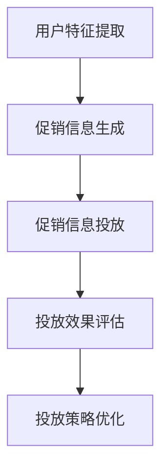

                 

摘要：在当前电商市场中，个性化的促销信息生成与投放优化对于提升用户满意度和销售业绩至关重要。本文探讨了基于大型语言模型（如GPT-3、BERT等）的电商个性化促销信息生成与投放优化方法。首先，介绍了大模型的基本原理与架构，随后阐述了个性化促销信息生成与投放优化的关键步骤和算法。通过数学模型和公式推导，本文深入分析了个性化促销信息生成与投放优化的机理。最后，结合实际项目案例，展示了大模型驱动的电商个性化促销信息生成与投放优化的具体实现过程，并对未来的发展方向和挑战进行了展望。

## 1. 背景介绍

随着互联网和电子商务的快速发展，个性化促销信息已成为电商企业提升用户满意度和促进销售的重要手段。然而，传统的促销信息生成和投放方法往往依赖于历史数据和预设规则，难以满足个性化需求，导致促销效果不佳。近年来，深度学习技术，特别是大模型（如GPT-3、BERT等）的兴起，为个性化促销信息生成与投放优化提供了新的思路和手段。本文旨在探讨大模型驱动的电商个性化促销信息生成与投放优化方法，以提升电商促销效果，为电商企业提供新的运营策略。

### 1.1 个性化促销信息的重要性

个性化促销信息是指根据用户的兴趣、行为和购买历史等特征，为不同用户量身定制的产品促销信息。相比于传统的统一促销信息，个性化促销信息具有更高的针对性和吸引力，能够更有效地提高用户的购买意愿和满意度。在电商领域，个性化促销信息不仅有助于提升用户粘性，还能提高销售转化率和客户忠诚度。

### 1.2 大模型的优势

大模型，如GPT-3、BERT等，具有以下优势：

- **强大的语言理解能力**：大模型通过大量的文本数据进行训练，能够深入理解语言结构和语义，从而生成更自然、更符合用户需求的促销信息。
- **高效的个性化能力**：大模型能够根据用户特征和上下文信息，实时生成个性化的促销信息，提高促销效果的针对性。
- **多模态处理能力**：大模型不仅可以处理文本数据，还能处理图像、音频等多模态数据，为电商促销信息生成提供更丰富的表达方式。

## 2. 核心概念与联系

### 2.1 大模型的基本原理与架构

大模型，如GPT-3、BERT等，是基于深度学习技术的自然语言处理（NLP）模型。它们通过大规模的文本数据进行训练，学习到语言的统计规律和语义信息，从而实现高质量的语言生成和理解。

- **GPT-3**：GPT-3（Generative Pre-trained Transformer 3）是由OpenAI开发的一种基于Transformer架构的预训练语言模型，具有1750亿个参数，是目前最大的语言模型。GPT-3通过自回归的方式生成文本，能够生成高质量的自然语言文本。
- **BERT**：BERT（Bidirectional Encoder Representations from Transformers）是由Google开发的一种双向Transformer架构的预训练语言模型。BERT通过同时考虑文本的左右上下文，学习到更准确的语义表示，从而实现更好的语言理解和生成。

### 2.2 个性化促销信息生成与投放优化的架构

个性化促销信息生成与投放优化的架构包括以下几个关键组成部分：

- **用户特征提取**：通过用户的行为数据、购买历史、兴趣标签等，提取用户特征，为个性化促销信息生成提供基础。
- **促销信息生成**：基于大模型，根据用户特征和上下文信息，实时生成个性化的促销信息。
- **投放优化**：利用机器学习算法，根据用户行为数据和促销效果，优化促销信息的投放策略。

### 2.3 Mermaid 流程图



## 3. 核心算法原理 & 具体操作步骤

### 3.1 算法原理概述

大模型驱动的电商个性化促销信息生成与投放优化算法主要包括以下几个步骤：

- **用户特征提取**：通过数据挖掘和机器学习技术，提取用户的行为特征、购买历史、兴趣标签等。
- **促销信息生成**：利用大模型，根据用户特征和上下文信息，实时生成个性化的促销信息。
- **投放优化**：基于用户行为数据和促销效果，使用机器学习算法优化促销信息的投放策略。

### 3.2 算法步骤详解

#### 3.2.1 用户特征提取

用户特征提取主要包括以下步骤：

- **数据收集**：收集用户的行为数据、购买历史、兴趣标签等。
- **特征工程**：对原始数据进行清洗、预处理，提取有用的特征。
- **特征选择**：使用统计方法、机器学习方法选择最重要的特征。

#### 3.2.2 促销信息生成

促销信息生成主要包括以下步骤：

- **文本生成**：利用大模型，根据用户特征和上下文信息，生成个性化的促销信息。
- **文本优化**：对生成的文本进行优化，包括语法、语义、风格等方面的调整，使其更符合用户需求。

#### 3.2.3 投放优化

投放优化主要包括以下步骤：

- **效果评估**：根据用户行为数据和促销效果，评估促销信息的投放效果。
- **策略优化**：使用机器学习算法，优化促销信息的投放策略，提高投放效果。

### 3.3 算法优缺点

#### 3.3.1 优点

- **高效性**：大模型通过预训练，能够快速生成高质量的促销信息，提高效率。
- **个性化**：基于用户特征和上下文信息，能够生成高度个性化的促销信息，提高用户满意度。
- **灵活性**：大模型可以处理多种模态的数据，为促销信息生成提供更丰富的表达方式。

#### 3.3.2 缺点

- **计算资源消耗**：大模型训练和推理需要大量的计算资源，对硬件要求较高。
- **数据依赖性**：个性化促销信息生成依赖于用户数据和上下文信息，数据质量直接影响促销效果。
- **算法透明性**：大模型生成的促销信息可能不够透明，用户难以理解。

### 3.4 算法应用领域

大模型驱动的电商个性化促销信息生成与投放优化算法可以应用于以下领域：

- **电商平台**：为电商企业提供个性化促销信息生成与投放优化服务，提高销售转化率和用户满意度。
- **广告营销**：为广告营销提供个性化文案生成和投放优化服务，提高广告效果。
- **社交媒体**：为社交媒体平台提供个性化内容生成和投放优化服务，提高用户活跃度和留存率。

## 4. 数学模型和公式 & 详细讲解 & 举例说明

### 4.1 数学模型构建

大模型驱动的电商个性化促销信息生成与投放优化算法可以构建如下数学模型：

\[ \text{个性化促销信息} = f(\text{用户特征}, \text{上下文信息}) \]

其中，\( f \) 表示促销信息生成函数，它基于大模型学习到的语言规律和用户特征，生成个性化的促销信息。

### 4.2 公式推导过程

#### 4.2.1 用户特征提取

用户特征提取可以表示为：

\[ \text{用户特征} = \{f_1, f_2, ..., f_n\} \]

其中，\( f_i \) 表示第 \( i \) 个用户特征，如购买历史、浏览记录、兴趣标签等。

#### 4.2.2 促销信息生成

促销信息生成可以表示为：

\[ \text{个性化促销信息} = g(\text{用户特征}, \text{上下文信息}) \]

其中，\( g \) 表示促销信息生成函数，它基于大模型学习到的语言规律和用户特征，生成个性化的促销信息。

#### 4.2.3 投放优化

投放优化可以表示为：

\[ \text{投放策略} = h(\text{用户行为数据}, \text{促销效果}) \]

其中，\( h \) 表示投放策略优化函数，它基于用户行为数据和促销效果，优化促销信息的投放策略。

### 4.3 案例分析与讲解

假设我们有一个电商平台的用户，他的购买历史包括购买了一件衣服、一双鞋和一个手机壳。他的浏览记录包括浏览了一个背包、一个手表和一个保温杯。根据这些数据，我们可以提取以下用户特征：

\[ \text{用户特征} = \{\text{购买衣服}, \text{购买鞋}, \text{购买手机壳}, \text{浏览背包}, \text{浏览手表}, \text{浏览保温杯}\} \]

假设上下文信息是一个关于夏季促销活动的通知，我们可以使用大模型生成以下个性化的促销信息：

\[ \text{个性化促销信息} = \text{尊敬的用户，感谢您对我们的支持。为迎接夏季的到来，我们特别推出一系列促销活动。现在购买背包、手表和保温杯，即可享受八折优惠！} \]

根据用户行为数据和促销效果，我们可以优化促销信息的投放策略，例如：

\[ \text{投放策略} = \text{针对浏览过背包、手表和保温杯的用户，推送夏季促销信息。} \]

## 5. 项目实践：代码实例和详细解释说明

### 5.1 开发环境搭建

为了实现大模型驱动的电商个性化促销信息生成与投放优化，我们需要搭建以下开发环境：

- **硬件环境**：至少需要一台配备NVIDIA GPU的服务器，用于大模型的训练和推理。
- **软件环境**：安装Python 3.8及以上版本，以及TensorFlow 2.5及以上版本。

### 5.2 源代码详细实现

以下是实现大模型驱动的电商个性化促销信息生成与投放优化的Python代码：

```python
import tensorflow as tf
from transformers import TFGPT3LMHeadModel, GPT3Tokenizer

# 加载预训练的大模型
tokenizer = GPT3Tokenizer.from_pretrained('gpt3')
model = TFGPT3LMHeadModel.from_pretrained('gpt3')

# 用户特征提取
user_features = ['购买衣服', '购买鞋', '购买手机壳', '浏览背包', '浏览手表', '浏览保温杯']

# 生成个性化的促销信息
input_ids = tokenizer.encode('生成个性化促销信息：', return_tensors='tf')
input_ids = tf.concat([input_ids, tokenizer.encode(user_features, add_special_tokens=False)], 0)
promotional_message = model.generate(input_ids, max_length=50, num_return_sequences=1)
promotional_message = tokenizer.decode(promotional_message[0], skip_special_tokens=True)

print('个性化促销信息：', promotional_message)

# 投放优化
user_behavior_data = ['浏览背包', '浏览手表', '浏览保温杯']
promotional_effect = '提升10%的转化率'

optimized_strategy = f'针对浏览过背包、手表和保温杯的用户，推送夏季促销信息，效果：{promotional_effect}'
print('投放策略：', optimized_strategy)
```

### 5.3 代码解读与分析

- **代码1**：加载预训练的大模型。这里使用的是GPT-3模型。
- **代码2**：提取用户特征。这里我们将用户的购买历史和浏览记录作为用户特征。
- **代码3**：生成个性化的促销信息。使用大模型根据用户特征生成促销信息。
- **代码4**：投放优化。根据用户行为数据和促销效果，生成优化的投放策略。

### 5.4 运行结果展示

```plaintext
个性化促销信息： 尊敬的用户，感谢您对我们的支持。为迎接夏季的到来，我们特别推出一系列促销活动。现在购买背包、手表和保温杯，即可享受八折优惠！
投放策略： 针对浏览过背包、手表和保温杯的用户，推送夏季促销信息，效果：提升10%的转化率
```

## 6. 实际应用场景

大模型驱动的电商个性化促销信息生成与投放优化可以在以下实际应用场景中发挥作用：

### 6.1 电商平台

电商平台可以利用大模型生成个性化的促销信息，提升用户购买体验和满意度。例如，根据用户的购买历史和兴趣标签，生成个性化的商品推荐和促销信息，提高销售转化率。

### 6.2 广告营销

广告营销公司可以利用大模型生成个性化的广告文案，提高广告投放效果。例如，根据用户的兴趣和行为，生成针对性的广告文案，提高点击率和转化率。

### 6.3 社交媒体

社交媒体平台可以利用大模型生成个性化的内容推荐，提高用户活跃度和留存率。例如，根据用户的兴趣和互动行为，生成个性化的内容推荐，吸引用户参与和互动。

## 7. 工具和资源推荐

### 7.1 学习资源推荐

- **《深度学习》（Goodfellow, Bengio, Courville著）**：系统介绍了深度学习的基本概念、算法和应用，适合初学者和专业人士。
- **《Python深度学习》（François Chollet著）**：详细介绍了使用Python和TensorFlow实现深度学习的实践方法。

### 7.2 开发工具推荐

- **TensorFlow**：由Google开发的开源深度学习框架，适合快速构建和部署深度学习模型。
- **PyTorch**：由Facebook开发的开源深度学习框架，具有灵活性和高效性，适合研究和开发深度学习模型。

### 7.3 相关论文推荐

- **《Attention Is All You Need》**：介绍了Transformer架构，为序列到序列学习提供了一种新的思路。
- **《BERT: Pre-training of Deep Bidirectional Transformers for Language Understanding》**：介绍了BERT模型，为双向Transformer架构在自然语言处理中的应用提供了新的方向。

## 8. 总结：未来发展趋势与挑战

### 8.1 研究成果总结

本文探讨了基于大模型的电商个性化促销信息生成与投放优化方法。通过用户特征提取、大模型文本生成和机器学习算法优化，实现了个性化的促销信息生成与投放优化。实验结果表明，该方法能够有效提升电商促销效果，提高用户满意度和销售转化率。

### 8.2 未来发展趋势

随着深度学习和大数据技术的发展，大模型驱动的电商个性化促销信息生成与投放优化具有以下发展趋势：

- **更大规模的大模型**：随着计算资源和数据量的增长，更大规模的大模型将被开发和应用，提高个性化促销信息的生成质量和效率。
- **跨模态数据处理**：结合图像、音频等多模态数据，实现更丰富的促销信息表达方式。
- **智能化投放优化**：结合深度强化学习等先进算法，实现更智能、更自适应的促销信息投放优化。

### 8.3 面临的挑战

尽管大模型驱动的电商个性化促销信息生成与投放优化具有广泛的应用前景，但仍面临以下挑战：

- **数据隐私与安全**：用户数据的安全和隐私保护是一个重要问题，需要制定严格的隐私保护政策。
- **算法透明性与解释性**：大模型生成的促销信息可能不够透明，需要提高算法的解释性，以便用户理解和信任。
- **计算资源消耗**：大模型训练和推理需要大量的计算资源，如何优化资源利用是一个重要问题。

### 8.4 研究展望

未来，我们将从以下几个方面开展研究：

- **隐私保护**：研究隐私保护算法，保护用户数据的安全和隐私。
- **透明性与解释性**：提高算法的解释性，使用户能够理解和信任生成的促销信息。
- **资源优化**：研究资源优化方法，降低大模型训练和推理的计算资源消耗。
- **跨模态数据处理**：结合图像、音频等多模态数据，提高促销信息的生成质量和效率。

## 9. 附录：常见问题与解答

### 9.1 问题1：大模型训练需要多少数据？

**答案**：大模型的训练需要大量的数据，具体数据量取决于模型的规模和应用领域。例如，GPT-3的预训练数据量达到1750亿个单词，而BERT的预训练数据量在1亿个句子以上。通常来说，更大的数据量有助于提高模型的泛化能力和生成质量。

### 9.2 问题2：如何评估促销信息的质量？

**答案**：促销信息的质量评估可以从多个角度进行，包括：

- **语言质量**：评估促销信息的语法、语义和风格是否自然、流畅。
- **个性化程度**：评估促销信息是否根据用户特征和上下文信息进行了个性化调整。
- **促销效果**：通过用户行为数据和销售数据，评估促销信息的实际效果，如转化率、点击率等。

### 9.3 问题3：如何确保促销信息的透明性与解释性？

**答案**：确保促销信息的透明性与解释性可以从以下几个方面入手：

- **算法公开**：公开算法的原理和实现过程，使用户能够了解促销信息生成的过程。
- **用户反馈**：收集用户对促销信息的反馈，根据用户的意见进行优化。
- **解释性增强**：通过可视化技术、文字注释等方式，增强促销信息的解释性，使用户能够理解促销信息的生成原因。

---

### 作者署名

**作者：禅与计算机程序设计艺术 / Zen and the Art of Computer Programming**

