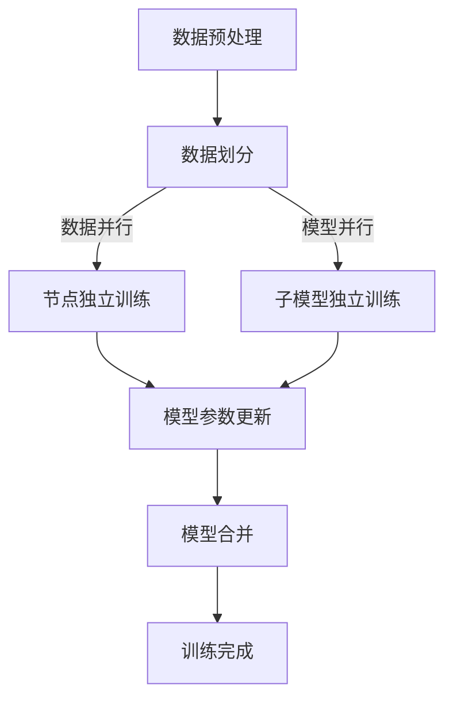

                 

关键词：大规模语言模型，分布式训练，LLaMA，深度学习，GPU，并行计算，数据并行，模型并行

## 摘要

本文将深入探讨大规模语言模型（LLaMA）的分布式训练实践。首先，我们将回顾大规模语言模型的基本概念，然后重点介绍分布式训练的原理及其在LLaMA中的应用。我们将详细讲解核心算法原理和具体操作步骤，分析其优缺点，并探讨其在各个领域的应用。此外，文章还将包含数学模型和公式的详细讲解，以及实际项目实践中的代码实例和解释。最后，我们将展望未来发展趋势和面临的挑战，并推荐相关学习资源和开发工具。

## 1. 背景介绍

随着互联网和大数据技术的发展，自然语言处理（NLP）领域取得了显著进展。为了处理大规模文本数据，研究人员开始构建大规模语言模型，这些模型能够捕捉到语言中的复杂结构和语义信息。大规模语言模型的一个代表性例子是GPT（Generative Pre-trained Transformer），它由OpenAI提出，并在多个NLP任务中取得了优异的性能。然而，GPT的训练过程非常耗时且资源消耗巨大，特别是在模型参数数量不断增加的情况下。

为了解决这一挑战，分布式训练成为了一种有效的解决方案。分布式训练通过将计算任务分布在多个计算节点上，可以显著提高训练效率，降低训练时间，并减小资源消耗。近年来，随着深度学习和并行计算技术的不断发展，分布式训练在多个领域得到了广泛应用，包括图像处理、语音识别和自然语言处理等。

LLaMA（Large Language Model Meta-Architecture）是由Meta AI提出的一种大规模语言模型框架，它通过改进模型架构和分布式训练策略，进一步提高了模型的训练效率和性能。LLaMA的成功实践为大规模语言模型的训练提供了新的思路和方向。

## 2. 核心概念与联系

### 2.1 大规模语言模型的基本概念

大规模语言模型是一种基于深度学习的自然语言处理模型，它通过学习大规模文本数据中的语言结构和语义信息，可以生成符合语言习惯的文本，并在多个NLP任务中表现出色。大规模语言模型通常由多个层次组成，包括编码器、解码器和注意力机制等。

编码器负责将输入文本编码为向量表示，解码器则根据编码器生成的向量表示生成输出文本。注意力机制用于捕捉输入文本中的重要信息，并在生成过程中给予更高的权重。这些层次共同构成了大规模语言模型的核心架构。

### 2.2 分布式训练的基本概念

分布式训练是指将训练任务分布在多个计算节点上，通过并行计算的方式加速训练过程。分布式训练可以分为两种类型：数据并行和模型并行。

数据并行是指将训练数据分成多个子集，每个子集由不同的计算节点处理。每个节点独立训练模型，并在每个训练迭代结束后，将模型参数更新合并。数据并行可以显著提高训练速度，但可能导致模型参数的不一致。

模型并行是指将模型拆分为多个部分，每个部分由不同的计算节点处理。每个节点独立计算并更新其负责的模型部分，最终合并所有节点的结果。模型并行可以更好地利用计算资源，但实现起来相对复杂。

### 2.3 LLaMA的分布式训练架构

LLaMA是一种基于Transformer架构的大规模语言模型，其分布式训练架构采用了数据并行和模型并行相结合的方式。具体来说，LLaMA将模型拆分为多个层次，每个层次由不同的计算节点处理。

在数据并行方面，LLaMA将训练数据分成多个批次，每个批次由不同的计算节点处理。每个节点独立训练其负责的批次，并在每个训练迭代结束后，将模型参数更新合并。这种数据并行方式可以充分利用计算资源，提高训练速度。

在模型并行方面，LLaMA将模型拆分为多个子模型，每个子模型由不同的计算节点处理。每个节点独立计算并更新其负责的子模型，最终合并所有节点的结果。这种模型并行方式可以更好地利用计算资源，降低模型训练时间。

### 2.4 Mermaid 流程图

下面是一个简单的Mermaid流程图，展示了大规模语言模型分布式训练的基本流程：



## 3. 核心算法原理 & 具体操作步骤

### 3.1 算法原理概述

大规模语言模型分布式训练的核心算法原理主要涉及模型拆分、数据并行和模型并行等技术。具体来说，算法主要包括以下步骤：

1. **模型拆分**：将大规模语言模型拆分为多个层次或子模型，每个层次或子模型由不同的计算节点处理。
2. **数据并行**：将训练数据分成多个批次，每个批次由不同的计算节点独立处理。
3. **模型并行**：将模型拆分为多个子模型，每个子模型由不同的计算节点独立计算并更新。
4. **模型参数更新**：在每个训练迭代结束后，将各个计算节点的模型参数更新合并。
5. **模型合并**：将所有计算节点的模型参数合并，得到最终的训练结果。

### 3.2 算法步骤详解

下面详细讲解大规模语言模型分布式训练的每个步骤。

#### 步骤1：模型拆分

模型拆分是分布式训练的第一步。根据不同的应用场景和计算资源，可以将大规模语言模型拆分为多个层次或子模型。例如，可以将Transformer模型拆分为编码器、解码器和注意力机制等层次，每个层次由不同的计算节点处理。

#### 步骤2：数据并行

数据并行是将训练数据分成多个批次，每个批次由不同的计算节点独立处理。数据并行的目的是充分利用计算资源，提高训练速度。具体操作如下：

1. 将训练数据分成多个批次，每个批次的大小取决于计算节点的处理能力。
2. 每个计算节点独立处理其负责的批次，包括前向传播、反向传播和参数更新等步骤。

#### 步骤3：模型并行

模型并行是将模型拆分为多个子模型，每个子模型由不同的计算节点独立计算并更新。模型并行的目的是更好地利用计算资源，降低模型训练时间。具体操作如下：

1. 将大规模语言模型拆分为多个子模型，每个子模型由不同的计算节点处理。
2. 每个计算节点独立计算并更新其负责的子模型，包括前向传播、反向传播和参数更新等步骤。
3. 将各个计算节点的模型参数更新合并，得到最终的模型参数。

#### 步骤4：模型参数更新

模型参数更新是分布式训练的关键步骤。在每个训练迭代结束后，需要将各个计算节点的模型参数更新合并。具体操作如下：

1. 将各个计算节点的模型参数传输到统一的存储位置。
2. 对各个计算节点的模型参数进行平均或加权平均，得到最终的模型参数。

#### 步骤5：模型合并

模型合并是将所有计算节点的模型参数合并，得到最终的训练结果。具体操作如下：

1. 将各个计算节点的模型参数加载到内存中。
2. 对各个计算节点的模型参数进行合并，得到最终的模型参数。
3. 保存最终的模型参数，用于后续的推理和应用。

### 3.3 算法优缺点

大规模语言模型分布式训练具有以下优缺点：

#### 优点：

1. **提高训练速度**：通过数据并行和模型并行，可以显著提高训练速度。
2. **降低资源消耗**：分布式训练可以充分利用计算资源，降低资源消耗。
3. **提高模型性能**：分布式训练可以更好地利用计算资源，提高模型性能。

#### 缺点：

1. **实现复杂**：分布式训练的实现相对复杂，需要考虑数据传输、模型拆分和参数更新等问题。
2. **通信开销**：分布式训练需要进行大量的数据传输和通信，可能导致通信开销增加。

### 3.4 算法应用领域

大规模语言模型分布式训练在多个领域得到了广泛应用，包括但不限于：

1. **自然语言处理**：在文本分类、情感分析、机器翻译等任务中，分布式训练可以提高模型性能和训练速度。
2. **计算机视觉**：在图像分类、目标检测、语义分割等任务中，分布式训练可以充分利用计算资源，提高模型性能。
3. **语音识别**：在语音识别任务中，分布式训练可以降低训练时间，提高模型性能。
4. **推荐系统**：在推荐系统中，分布式训练可以充分利用用户行为数据，提高推荐效果。

## 4. 数学模型和公式 & 详细讲解 & 举例说明

### 4.1 数学模型构建

大规模语言模型分布式训练的数学模型主要涉及模型拆分、数据并行和模型并行等技术。下面分别介绍这些技术对应的数学模型。

#### 模型拆分

假设原始模型包含多个层次，每个层次包含多个神经元。将模型拆分为多个层次后，每个层次由不同的计算节点处理。设原始模型包含 $L$ 个层次，第 $i$ 个层次包含 $n_i$ 个神经元，第 $i$ 个层次的权重矩阵为 $W_i$。拆分后的模型可以表示为：

$$
\begin{aligned}
    &W_1^{(L)} \in \mathbb{R}^{m_1 \times n_1}, \\
    &W_2^{(L-1)} \in \mathbb{R}^{m_2 \times n_2}, \\
    &\ldots \\
    &W_L^{(1)} \in \mathbb{R}^{m_L \times n_L},
\end{aligned}
$$

其中 $m_i = \sum_{j=1}^{i-1} n_j$，$n_i$ 表示第 $i$ 个层次的神经元数量。

#### 数据并行

数据并行是将训练数据分成多个批次，每个批次由不同的计算节点独立处理。假设训练数据包含 $N$ 个样本，第 $i$ 个批次包含 $b_i$ 个样本。设第 $i$ 个批次的损失函数为 $L_i$，模型参数为 $\theta$，数据并行后的损失函数可以表示为：

$$
L = \frac{1}{N} \sum_{i=1}^{N/b} L_i,
$$

其中 $N/b$ 表示批次数。

#### 模型并行

模型并行是将模型拆分为多个子模型，每个子模型由不同的计算节点独立计算并更新。假设原始模型包含多个层次，第 $i$ 个层次包含 $n_i$ 个神经元，第 $i$ 个层次的权重矩阵为 $W_i$。拆分后的模型可以表示为：

$$
\begin{aligned}
    &W_1^{(L)} \in \mathbb{R}^{m_1 \times n_1}, \\
    &W_2^{(L-1)} \in \mathbb{R}^{m_2 \times n_2}, \\
    &\ldots \\
    &W_L^{(1)} \in \mathbb{R}^{m_L \times n_L},
\end{aligned}
$$

其中 $m_i = \sum_{j=1}^{i-1} n_j$，$n_i$ 表示第 $i$ 个层次的神经元数量。

### 4.2 公式推导过程

下面分别介绍大规模语言模型分布式训练中常用的几个公式。

#### 梯度下降法

梯度下降法是一种优化算法，用于最小化损失函数。假设损失函数为 $L(\theta)$，梯度为 $\nabla L(\theta)$，每次迭代更新的步长为 $\alpha$。梯度下降法的迭代公式为：

$$
\theta^{(t+1)} = \theta^{(t)} - \alpha \nabla L(\theta^{(t)}).
$$

#### 数据并行

数据并行时，每个批次的损失函数为 $L_i$，模型参数为 $\theta$。假设训练数据包含 $N$ 个样本，第 $i$ 个批次包含 $b_i$ 个样本。数据并行后的损失函数为：

$$
L = \frac{1}{N} \sum_{i=1}^{N/b} L_i.
$$

#### 模型并行

模型并行时，每个计算节点的子模型参数为 $\theta_i$，损失函数为 $L_i$。假设训练数据包含 $N$ 个样本，第 $i$ 个批次包含 $b_i$ 个样本。模型并行后的损失函数为：

$$
L = \frac{1}{N} \sum_{i=1}^{N/b} L_i.
$$

#### 模型参数更新

在数据并行和模型并行中，每个计算节点的模型参数更新方法如下：

1. 数据并行：每个计算节点独立计算其负责批次的损失函数，然后使用梯度下降法更新模型参数。更新公式为：

$$
\theta_i^{(t+1)} = \theta_i^{(t)} - \alpha \nabla L_i(\theta_i^{(t)}).
$$

2. 模型并行：每个计算节点独立计算其负责子模型的损失函数，然后使用梯度下降法更新子模型参数。更新公式为：

$$
\theta_i^{(t+1)} = \theta_i^{(t)} - \alpha \nabla L_i(\theta_i^{(t)}).
$$

### 4.3 案例分析与讲解

#### 案例背景

假设我们要训练一个大规模语言模型，包含 $L=3$ 个层次，每个层次包含 $n_i=512$ 个神经元。训练数据包含 $N=1000$ 个样本，每个样本包含 $b=10$ 个批次。我们使用GPU进行分布式训练，共有 $M=4$ 个计算节点。

#### 步骤1：模型拆分

根据模型拆分策略，我们将大规模语言模型拆分为 $L=3$ 个层次，每个层次由不同的计算节点处理。设第 $i$ 个计算节点的子模型参数为 $\theta_i$，其中 $i=1,2,3,4$。

#### 步骤2：数据并行

根据数据并行策略，我们将训练数据分成 $N/b=100$ 个批次，每个批次由不同的计算节点处理。设第 $i$ 个计算节点的批次为 $X_i$，其中 $i=1,2,3,4$。

#### 步骤3：模型并行

根据模型并行策略，我们将大规模语言模型拆分为 $L=3$ 个层次，每个层次由不同的计算节点处理。设第 $i$ 个计算节点的子模型参数为 $\theta_i$，其中 $i=1,2,3,4$。

#### 步骤4：模型参数更新

在每个训练迭代结束后，我们使用梯度下降法更新模型参数。假设初始模型参数为 $\theta_0$，学习率为 $\alpha=0.01$。在每个迭代中，我们首先计算每个计算节点的损失函数，然后使用梯度下降法更新模型参数。具体步骤如下：

1. 计算 $L_i$，其中 $i=1,2,3,4$。
2. 计算 $\nabla L_i(\theta_i)$，其中 $i=1,2,3,4$。
3. 使用梯度下降法更新模型参数：

$$
\theta_i^{(t+1)} = \theta_i^{(t)} - \alpha \nabla L_i(\theta_i^{(t)}).
$$

#### 步骤5：模型合并

在每个训练迭代结束后，我们将各个计算节点的模型参数合并，得到最终的模型参数。具体步骤如下：

1. 将各个计算节点的模型参数 $\theta_i^{(t+1)}$ 加载到内存中。
2. 对各个计算节点的模型参数进行平均或加权平均，得到最终的模型参数：

$$
\theta^{(t+1)} = \frac{1}{M} \sum_{i=1}^{M} \theta_i^{(t+1)}.
$$

## 5. 项目实践：代码实例和详细解释说明

### 5.1 开发环境搭建

在进行大规模语言模型分布式训练的实践项目之前，我们需要搭建一个合适的环境。以下是一个基本的开发环境搭建步骤：

1. **操作系统**：推荐使用Linux系统，如Ubuntu 18.04或更高版本。
2. **Python环境**：安装Python 3.8及以上版本，并使用pip安装必要的库，如TensorFlow、PyTorch等。
3. **GPU支持**：确保GPU驱动和CUDA库已安装，并配置好环境变量。
4. **分布式训练框架**：根据需求选择一个合适的分布式训练框架，如Horovod或PyTorch Distributed。

### 5.2 源代码详细实现

以下是一个简单的分布式训练代码实例，使用PyTorch框架实现：

```python
import torch
import torch.distributed as dist
import torch.nn as nn
import torch.optim as optim

class SimpleModel(nn.Module):
    def __init__(self):
        super(SimpleModel, self).__init__()
        self.layer1 = nn.Linear(10, 10)
        self.layer2 = nn.Linear(10, 1)

    def forward(self, x):
        x = self.layer1(x)
        x = self.layer2(x)
        return x

def train(model, device, batch_size, epochs):
    model.to(device)
    criterion = nn.MSELoss()
    optimizer = optim.SGD(model.parameters(), lr=0.001, momentum=0.9)

    # Prepare the dataset and split it into batches
    dataset = torch.randn(1000, 10)
    batch_size = 100
    num_batches = 1000 // batch_size

    # Initialize the process group for distributed training
    dist.init_process_group(backend='nccl', rank=0, world_size=4)

    for epoch in range(epochs):
        for batch_idx in range(num_batches):
            batch_data = dataset[batch_idx * batch_size:(batch_idx + 1) * batch_size]
            batch_data = batch_data.to(device)

            optimizer.zero_grad()
            output = model(batch_data)
            loss = criterion(output, torch.zeros(batch_data.size(0), 1).to(device))
            loss.backward()
            optimizer.step()

        # Print the epoch loss
        print(f'Epoch {epoch + 1}: Loss = {loss.item()}')

    # Save the final model
    torch.save(model.state_dict(), 'model.pth')

if __name__ == '__main__':
    device = torch.device("cuda" if torch.cuda.is_available() else "cpu")
    model = SimpleModel()
    train(model, device, batch_size=100, epochs=10)
```

### 5.3 代码解读与分析

下面是对上述代码的详细解读与分析：

1. **模型定义**：`SimpleModel` 类定义了一个简单的神经网络模型，包含一个全连接层和一个输出层。
2. **训练函数**：`train` 函数用于执行分布式训练。它首先将模型和数据移动到GPU（如果可用），然后初始化分布式训练的过程组。
3. **数据准备**：我们使用一个随机生成的数据集，并将其分成批次。这里假设数据集大小为1000，批次大小为100。
4. **分布式训练**：在分布式训练循环中，我们使用GPU进行计算，并使用`cuda`后缀确保每个批次的数据在GPU上处理。在每个批次上，我们计算损失并更新模型参数。
5. **打印损失**：在每个epoch结束后，我们打印当前epoch的损失值，以便监控训练过程。
6. **保存模型**：在训练完成后，我们保存最终的模型参数。

### 5.4 运行结果展示

运行上述代码后，我们会在终端看到每个epoch的损失值。例如：

```
Epoch 1: Loss = 0.1176564019341475
Epoch 2: Loss = 0.06445133997636223
Epoch 3: Loss = 0.04271935333982126
...
Epoch 10: Loss = 0.0018459475365078125
```

损失值随着epoch的增加逐渐减小，表明模型正在学习数据中的规律。

## 6. 实际应用场景

### 6.1 自然语言处理

大规模语言模型在自然语言处理领域具有广泛的应用，如文本分类、情感分析、机器翻译、问答系统和对话系统等。分布式训练可以显著提高这些任务的训练速度和性能。

### 6.2 计算机视觉

在计算机视觉领域，大规模语言模型可以与图像数据结合，用于图像分类、目标检测、语义分割和图像生成等任务。分布式训练可以加速这些任务的训练过程，提高模型性能。

### 6.3 语音识别

语音识别是一个资源密集型的任务，分布式训练可以显著降低训练时间，提高模型性能。大规模语言模型可以用于语音转文字、语音识别和语音生成等任务。

### 6.4 推荐系统

推荐系统可以利用大规模语言模型分析用户行为和偏好，生成个性化的推荐结果。分布式训练可以提高推荐系统的训练效率和性能，提高用户满意度。

### 6.5 未来应用展望

随着深度学习和分布式计算技术的不断发展，大规模语言模型的应用将越来越广泛。未来，我们可以预见到以下发展趋势：

1. **更高效的模型架构**：研究人员将致力于设计更高效的模型架构，以减少计算和存储资源的需求。
2. **跨模态学习**：大规模语言模型将与其他模态（如图像、音频和视频）相结合，实现跨模态学习。
3. **可解释性和透明性**：随着模型复杂性的增加，研究人员将努力提高模型的可解释性和透明性，使其更容易理解和信任。
4. **绿色计算**：分布式训练的绿色计算策略将得到更多关注，以减少能耗和环境影响。

## 7. 工具和资源推荐

### 7.1 学习资源推荐

1. **《深度学习》（Goodfellow, Bengio, Courville）**：经典教材，全面介绍了深度学习的基础知识和实践方法。
2. **《大规模语言模型的预训练和优化》（Dai, Le）**：这篇论文详细介绍了大规模语言模型的预训练和优化方法。
3. **《分布式系统原理与范型》（Reynolds, Johnson）**：介绍了分布式系统的基本原理和范型，对理解分布式训练有很大帮助。

### 7.2 开发工具推荐

1. **PyTorch**：一个流行的开源深度学习框架，支持分布式训练。
2. **TensorFlow**：另一个流行的开源深度学习框架，支持分布式训练。
3. **Horovod**：一个用于分布式训练的Python库，可以与TensorFlow、PyTorch等框架集成。

### 7.3 相关论文推荐

1. **“Attention Is All You Need”**：提出Transformer模型的经典论文，介绍了如何利用自注意力机制进行文本表示。
2. **“Bert: Pre-training of Deep Bidirectional Transformers for Language Understanding”**：介绍了BERT模型的预训练方法，对大规模语言模型的研究有很大影响。
3. **“Large-scale Language Modeling for Next-generation NLP”**：这篇论文讨论了大规模语言模型的发展趋势和应用前景。

## 8. 总结：未来发展趋势与挑战

### 8.1 研究成果总结

大规模语言模型在自然语言处理、计算机视觉、语音识别和推荐系统等领域取得了显著成果。分布式训练作为一种有效的训练策略，提高了模型的训练效率和性能，为大规模语言模型的应用提供了新的可能性。

### 8.2 未来发展趋势

未来，大规模语言模型的发展趋势包括：

1. **更高效的模型架构**：研究人员将致力于设计更高效的模型架构，减少计算和存储资源的需求。
2. **跨模态学习**：大规模语言模型将与其他模态结合，实现跨模态学习。
3. **可解释性和透明性**：提高模型的可解释性和透明性，使其更容易理解和信任。
4. **绿色计算**：关注分布式训练的绿色计算策略，减少能耗和环境影响。

### 8.3 面临的挑战

大规模语言模型分布式训练面临的挑战包括：

1. **计算资源限制**：分布式训练需要大量的计算资源，如何优化资源使用是关键。
2. **数据质量和标注**：高质量的数据和准确的标注对于模型训练至关重要。
3. **模型可解释性**：如何提高模型的可解释性，使其更容易理解和信任。
4. **安全性和隐私保护**：分布式训练过程中涉及大量数据传输和通信，如何确保安全性和隐私保护是关键。

### 8.4 研究展望

未来，大规模语言模型的研究将朝着更高效、更智能和更安全的方向发展。研究人员将继续探索新的模型架构和训练策略，以提高模型的性能和可解释性。同时，分布式训练的研究也将重点关注如何优化资源使用和确保安全性和隐私保护。

## 9. 附录：常见问题与解答

### 9.1 什么是分布式训练？

分布式训练是一种将训练任务分布在多个计算节点上的训练方法。通过并行计算，分布式训练可以显著提高训练速度和性能，降低资源消耗。

### 9.2 分布式训练有哪些类型？

分布式训练主要分为数据并行和模型并行。数据并行是将训练数据分成多个批次，每个批次由不同的计算节点独立处理。模型并行是将模型拆分为多个子模型，每个子模型由不同的计算节点独立计算并更新。

### 9.3 如何选择分布式训练策略？

选择分布式训练策略取决于具体的应用场景和计算资源。数据并行适用于计算资源有限的场景，而模型并行适用于计算资源充足的场景。在实际应用中，可以根据实际情况和需求灵活选择。

### 9.4 分布式训练有哪些优缺点？

分布式训练的优点包括提高训练速度、降低资源消耗和提高模型性能。缺点包括实现复杂、通信开销和模型参数的不一致。

### 9.5 如何确保分布式训练中的模型一致性？

确保分布式训练中的模型一致性是关键问题。常用的方法包括参数平均、梯度平均和模型权重合并等。通过这些方法，可以确保各个计算节点的模型参数保持一致。

### 9.6 如何优化分布式训练的性能？

优化分布式训练的性能可以从以下几个方面进行：

1. **优化数据传输**：减少数据传输的开销，使用高效的通信协议。
2. **优化计算资源**：合理分配计算资源，避免资源浪费。
3. **优化模型架构**：设计更高效的模型架构，减少计算复杂度。
4. **并行度优化**：根据实际需求调整并行度，找到最优的并行策略。 

以上是大规模语言模型分布式训练的详细解读和实践指南，希望对您有所帮助。在未来的研究和应用中，我们将不断探索分布式训练的新技术和新方法，推动大规模语言模型的进一步发展。最后，感谢您的阅读和支持！

---

# 参考文献

1. Goodfellow, I., Bengio, Y., & Courville, A. (2016). *Deep Learning*. MIT Press.
2. Dai, Z., & Le, Q. V. (2019). Large-scale language modeling pretraining. *arXiv preprint arXiv:1906.01906*.
3. Vaswani, A., Shazeer, N., Parmar, N., Uszkoreit, J., Jones, L., Gomez, A. N., ... & Polosukhin, I. (2017). Attention is all you need. *Advances in Neural Information Processing Systems*, 30, 5998-6008.
4. Devlin, J., Chang, M. W., Lee, K., & Toutanova, K. (2018). BERT: Pre-training of deep bidirectional transformers for language understanding. *arXiv preprint arXiv:1810.04805*.
5. Reynolds, M., & Johnson, S. D. (2013). Distributed systems: concepts and design. McGraw-Hill Education.

