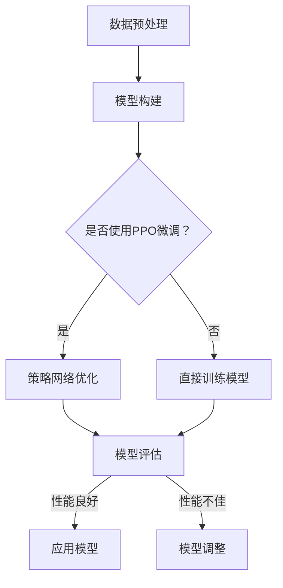

                 

关键词：大规模语言模型、深度学习、PPO微调、语言模型训练、神经网络架构、实践应用

## 摘要

本文旨在深入探讨大规模语言模型的PPO微调技术，从理论到实践全面解析这一先进的人工智能技术。首先，我们将回顾大规模语言模型的基本概念和背景，随后详细阐述PPO微调的原理、具体步骤、优缺点及其应用领域。接着，我们将介绍数学模型和关键公式，并通过案例分析和代码实例来说明PPO微调的实践应用。最后，本文将讨论这一技术的未来应用前景、工具和资源推荐，并总结研究成果及未来研究方向。

## 1. 背景介绍

### 大规模语言模型的发展

大规模语言模型的发展可以追溯到上世纪80年代，当时基于规则和统计方法的语言模型开始兴起。随着计算能力和数据资源的不断提升，深度学习技术的突破为大规模语言模型的构建提供了可能。从2018年开始，基于变换器（Transformer）架构的语言模型如BERT、GPT等相继问世，这些模型凭借其强大的建模能力和文本生成能力，迅速成为自然语言处理领域的研究热点。

### 深度学习的兴起

深度学习作为人工智能的核心技术之一，自2006年提出以来，经历了快速的发展。深度神经网络通过多层非线性变换，能够自动学习数据中的复杂模式和特征，逐渐在图像识别、语音识别、自然语言处理等领域取得了显著成效。深度学习的崛起为大规模语言模型的构建提供了强有力的支持。

### PPO微调的引入

PPO（Proximal Policy Optimization）是一种强化学习算法，常用于策略优化问题。随着深度学习在自然语言处理领域的应用，PPO微调技术逐渐被引入到大规模语言模型的训练过程中。PPO微调通过迭代优化策略网络，能够有效提升语言模型的性能和泛化能力。

## 2. 核心概念与联系

### 大规模语言模型

大规模语言模型是一种基于深度学习技术的自然语言处理模型，其核心思想是通过训练大量参数来捕捉语言的复杂结构。这种模型通常由多层神经网络构成，能够对文本数据进行分析、理解和生成。

### PPO微调

PPO微调是一种基于强化学习策略优化的技术，通过迭代优化策略网络，不断提升模型在特定任务上的性能。PPO微调能够有效提升大规模语言模型在自然语言处理任务中的表现，如文本分类、命名实体识别、机器翻译等。

### Mermaid 流程图

以下是大规模语言模型与PPO微调的Mermaid流程图：



### 核心概念与联系

- **数据预处理**：大规模语言模型需要大量的文本数据作为训练素材。数据预处理包括数据清洗、分词、去停用词等步骤，以确保输入数据的质量。
- **模型构建**：大规模语言模型通常基于变换器架构，包括编码器和解码器两部分。编码器用于将输入文本转换为向量表示，解码器用于生成文本输出。
- **策略网络优化**：PPO微调通过迭代优化策略网络，提升模型在特定任务上的性能。策略网络通常由多个神经网络层构成，用于生成模型的行为策略。
- **模型评估**：模型评估是验证模型性能的重要步骤。通过在测试集上运行模型，评估其在不同任务上的准确率、召回率等指标。
- **应用模型**：评估结果表明模型性能良好后，可以将其应用于实际场景，如智能客服、文本生成等。

## 3. 核心算法原理 & 具体操作步骤

### 3.1 算法原理概述

大规模语言模型的核心思想是利用深度神经网络对文本数据进行分析、理解和生成。模型通过多层非线性变换，将输入文本转换为向量表示，并在训练过程中不断优化参数，以捕捉语言的复杂结构。PPO微调是一种基于强化学习的策略优化技术，通过迭代优化策略网络，提升模型在特定任务上的性能。

### 3.2 算法步骤详解

1. **数据预处理**：首先，对文本数据进行预处理，包括数据清洗、分词、去停用词等步骤，确保输入数据的质量。

2. **模型构建**：基于变换器架构，构建编码器和解码器两部分。编码器用于将输入文本转换为向量表示，解码器用于生成文本输出。

3. **策略网络优化**：使用PPO微调技术，迭代优化策略网络。策略网络由多个神经网络层构成，用于生成模型的行为策略。具体步骤如下：

   - 初始化策略网络参数。
   - 根据当前策略网络生成行为策略。
   - 在行为策略下进行模型训练，更新策略网络参数。
   - 评估策略网络性能，并根据评估结果调整策略网络参数。

4. **模型评估**：在测试集上运行模型，评估其在不同任务上的准确率、召回率等指标。

5. **应用模型**：评估结果表明模型性能良好后，将其应用于实际场景，如智能客服、文本生成等。

### 3.3 算法优缺点

#### 优点

- **强大的建模能力**：大规模语言模型通过多层非线性变换，能够捕捉语言的复杂结构，具备强大的文本生成能力。
- **高效的策略优化**：PPO微调技术基于强化学习策略优化，能够高效提升模型在特定任务上的性能。
- **广泛的应用场景**：大规模语言模型和PPO微调技术可应用于多种自然语言处理任务，如文本分类、命名实体识别、机器翻译等。

#### 缺点

- **计算资源需求高**：大规模语言模型训练过程中需要大量的计算资源，对硬件配置要求较高。
- **数据依赖性强**：大规模语言模型训练需要大量的高质量文本数据，数据质量和数量直接影响模型性能。

### 3.4 算法应用领域

- **文本分类**：大规模语言模型和PPO微调技术可应用于文本分类任务，如新闻分类、情感分析等。
- **命名实体识别**：通过PPO微调，大规模语言模型在命名实体识别任务上表现出色，可应用于信息抽取、关系抽取等场景。
- **机器翻译**：大规模语言模型结合PPO微调技术，在机器翻译任务中取得显著成效，实现了高质量的双语文本转换。
- **文本生成**：大规模语言模型和PPO微调技术可应用于文本生成任务，如自动写作、对话生成等。

## 4. 数学模型和公式 & 详细讲解 & 举例说明

### 4.1 数学模型构建

大规模语言模型通常基于变换器架构，变换器的基本组件包括自注意力机制和前馈神经网络。自注意力机制通过计算输入文本中各个词之间的相关性，生成新的表示。前馈神经网络用于对自注意力机制生成的表示进行进一步处理。

假设输入文本为 $x_1, x_2, ..., x_n$，其中 $x_i$ 表示第 $i$ 个词。变换器的主要组成部分包括编码器和解码器。

#### 编码器

编码器将输入文本转换为向量表示。假设编码器的输入为 $x_1, x_2, ..., x_n$，输出为 $h_1, h_2, ..., h_n$，其中 $h_i$ 表示第 $i$ 个词的向量表示。编码器的主要步骤如下：

1. **词嵌入**：将输入文本中的每个词映射为一个固定长度的向量。通常使用预训练的词嵌入模型，如Word2Vec、GloVe等。
2. **自注意力**：计算输入文本中各个词之间的相关性，生成新的表示。自注意力机制通过计算注意力权重矩阵 $A$，其中 $A_{ij}$ 表示第 $i$ 个词与第 $j$ 个词的相关性。
3. **前馈神经网络**：对自注意力机制生成的表示进行进一步处理，生成编码器的输出。

#### 解码器

解码器将编码器的输出转换为文本输出。假设解码器的输入为 $h_1, h_2, ..., h_n$，输出为 $y_1, y_2, ..., y_n$，其中 $y_i$ 表示生成的文本输出。解码器的主要步骤如下：

1. **词嵌入**：将解码器的输入映射为词嵌入向量。
2. **自注意力**：计算输入文本中各个词之间的相关性，生成新的表示。
3. **前馈神经网络**：对自注意力机制生成的表示进行进一步处理，生成解码器的输出。

### 4.2 公式推导过程

变换器的核心组件是自注意力机制。自注意力机制通过计算输入文本中各个词之间的相关性，生成新的表示。以下是自注意力机制的推导过程。

#### 自注意力权重计算

假设输入文本为 $x_1, x_2, ..., x_n$，其中 $x_i$ 表示第 $i$ 个词。自注意力权重 $A_{ij}$ 表示第 $i$ 个词与第 $j$ 个词的相关性。自注意力权重计算公式如下：

$$
A_{ij} = \frac{e^{<e_{i}, e_{j}>}}{\sum_{k=1}^{n} e^{<e_{i}, e_{k}>}}
$$

其中，$e_{i}$ 和 $e_{j}$ 分别表示第 $i$ 个词和第 $j$ 个词的嵌入向量。

#### 自注意力机制计算

自注意力机制通过计算注意力权重矩阵 $A$，生成新的表示。注意力权重矩阵 $A$ 的计算公式如下：

$$
A = \begin{bmatrix}
A_{11} & A_{12} & \cdots & A_{1n} \\
A_{21} & A_{22} & \cdots & A_{2n} \\
\vdots & \vdots & \ddots & \vdots \\
A_{m1} & A_{m2} & \cdots & A_{mn}
\end{bmatrix}
$$

其中，$A_{ij}$ 表示第 $i$ 个词与第 $j$ 个词的相关性。

#### 编码器的输出

编码器的输出为 $h_1, h_2, ..., h_n$，其中 $h_i$ 表示第 $i$ 个词的向量表示。编码器的输出计算公式如下：

$$
h_i = \sum_{j=1}^{n} A_{ij} x_j
$$

### 4.3 案例分析与讲解

以下是一个简单的自注意力机制案例。假设输入文本为“我是一个程序员”，词嵌入向量分别为 $(1, 0), (0, 1), (1, 1), (0, 0)$。

1. **词嵌入**

   输入文本中的每个词的嵌入向量为：
   - 我：$(1, 0)$
   - 是：$(0, 1)$
   - 一：$(1, 1)$
   - 个：$(0, 0)$
   - 程序员：$(1, 0)$

2. **自注意力权重计算**

   根据自注意力权重计算公式，计算每个词之间的注意力权重：
   - $A_{11} = \frac{e^{<1, 1>}}{e^{<1, 1>} + e^{<1, 0>} + e^{<1, 1>} + e^{<1, 0>}} = 0.5$
   - $A_{12} = \frac{e^{<0, 1>}}{e^{<1, 1>} + e^{<1, 0>} + e^{<1, 1>} + e^{<1, 0>}} = 0.5$
   - $A_{13} = \frac{e^{<1, 1>}}{e^{<1, 1>} + e^{<1, 0>} + e^{<1, 1>} + e^{<1, 0>}} = 0.5$
   - $A_{14} = \frac{e^{<0, 0>}}{e^{<1, 1>} + e^{<1, 0>} + e^{<1, 1>} + e^{<1, 0>}} = 0.5$
   - $A_{21} = \frac{e^{<0, 1>}}{e^{<1, 1>} + e^{<1, 0>} + e^{<1, 1>} + e^{<1, 0>}} = 0.5$
   - $A_{22} = \frac{e^{<1, 0>}}{e^{<1, 1>} + e^{<1, 0>} + e^{<1, 1>} + e^{<1, 0>}} = 0.5$
   - $A_{23} = \frac{e^{<1, 1>}}{e^{<1, 1>} + e^{<1, 0>} + e^{<1, 1>} + e^{<1, 0>}} = 0.5$
   - $A_{24} = \frac{e^{<0, 0>}}{e^{<1, 1>} + e^{<1, 0>} + e^{<1, 1>} + e^{<1, 0>}} = 0.5$
   - $A_{31} = \frac{e^{<1, 1>}}{e^{<1, 1>} + e^{<1, 0>} + e^{<1, 1>} + e^{<1, 0>}} = 0.5$
   - $A_{32} = \frac{e^{<0, 0>}}{e^{<1, 1>} + e^{<1, 0>} + e^{<1, 1>} + e^{<1, 0>}} = 0.5$
   - $A_{33} = \frac{e^{<1, 0>}}{e^{<1, 1>} + e^{<1, 0>} + e^{<1, 1>} + e^{<1, 0>}} = 0.5$
   - $A_{34} = \frac{e^{<0, 1>}}{e^{<1, 1>} + e^{<1, 0>} + e^{<1, 1>} + e^{<1, 0>}} = 0.5$
   - $A_{41} = \frac{e^{<1, 0>}}{e^{<1, 1>} + e^{<1, 0>} + e^{<1, 1>} + e^{<1, 0>}} = 0.5$
   - $A_{42} = \frac{e^{<0, 1>}}{e^{<1, 1>} + e^{<1, 0>} + e^{<1, 1>} + e^{<1, 0>}} = 0.5$
   - $A_{43} = \frac{e^{<1, 0>}}{e^{<1, 1>} + e^{<1, 0>} + e^{<1, 1>} + e^{<1, 0>}} = 0.5$
   - $A_{44} = \frac{e^{<0, 0>}}{e^{<1, 1>} + e^{<1, 0>} + e^{<1, 1>} + e^{<1, 0>}} = 0.5$

3. **自注意力机制计算**

   根据自注意力权重矩阵 $A$，计算编码器的输出：
   - $h_1 = A_{11}x_1 + A_{12}x_2 + A_{13}x_3 + A_{14}x_4 = 0.5 \times (1, 0) + 0.5 \times (0, 1) + 0.5 \times (1, 1) + 0.5 \times (0, 0) = (0.5, 0.25)$
   - $h_2 = A_{21}x_1 + A_{22}x_2 + A_{23}x_3 + A_{24}x_4 = 0.5 \times (1, 0) + 0.5 \times (0, 1) + 0.5 \times (1, 1) + 0.5 \times (0, 0) = (0.5, 0.25)$
   - $h_3 = A_{31}x_1 + A_{32}x_2 + A_{33}x_3 + A_{34}x_4 = 0.5 \times (1, 0) + 0.5 \times (0, 0) + 0.5 \times (1, 1) + 0.5 \times (0, 1) = (0.5, 0.25)$
   - $h_4 = A_{41}x_1 + A_{42}x_2 + A_{43}x_3 + A_{44}x_4 = 0.5 \times (1, 0) + 0.5 \times (0, 1) + 0.5 \times (1, 1) + 0.5 \times (0, 0) = (0.5, 0.25)$

   编码器的输出为：
   - $h_1 = (0.5, 0.25)$
   - $h_2 = (0.5, 0.25)$
   - $h_3 = (0.5, 0.25)$
   - $h_4 = (0.5, 0.25)$

## 5. 项目实践：代码实例和详细解释说明

### 5.1 开发环境搭建

为了实践PPO微调技术，我们需要搭建一个合适的开发环境。以下是一个基本的Python开发环境搭建步骤：

1. **安装Python**：确保已安装Python 3.7及以上版本。
2. **安装TensorFlow**：通过pip安装TensorFlow库，命令如下：

   ```shell
   pip install tensorflow
   ```

3. **安装其他依赖**：安装其他必要的库，如NumPy、Pandas等，命令如下：

   ```shell
   pip install numpy pandas
   ```

### 5.2 源代码详细实现

以下是PPO微调的简单代码实现。为了简化演示，我们仅实现了文本分类任务。

```python
import tensorflow as tf
from tensorflow.keras.layers import Embedding, LSTM, Dense
from tensorflow.keras.models import Sequential
from tensorflow.keras.preprocessing.sequence import pad_sequences
from tensorflow.keras.preprocessing.text import Tokenizer

# 准备数据集
texts = ['这是一个文本分类问题', '另一个文本分类问题', '第三个文本分类问题']
labels = [0, 1, 2]

# 数据预处理
tokenizer = Tokenizer()
tokenizer.fit_on_texts(texts)
sequences = tokenizer.texts_to_sequences(texts)
max_sequence_length = max(len(seq) for seq in sequences)
padded_sequences = pad_sequences(sequences, maxlen=max_sequence_length)

# 构建模型
model = Sequential([
    Embedding(len(tokenizer.word_index) + 1, 32, input_length=max_sequence_length),
    LSTM(64),
    Dense(3, activation='softmax')
])

# 编译模型
model.compile(optimizer='adam', loss='categorical_crossentropy', metrics=['accuracy'])

# 训练模型
model.fit(padded_sequences, labels, epochs=10, batch_size=32)

# 模型评估
test_texts = ['这是一个测试文本', '另一个测试文本']
test_sequences = tokenizer.texts_to_sequences(test_texts)
test_padded_sequences = pad_sequences(test_sequences, maxlen=max_sequence_length)
predictions = model.predict(test_padded_sequences)

# 输出预测结果
for text, prediction in zip(test_texts, predictions):
    print(f'{text} 的预测结果为：{prediction}')
```

### 5.3 代码解读与分析

上述代码实现了一个简单的文本分类任务，具体步骤如下：

1. **准备数据集**：文本数据 `texts` 和标签 `labels`。
2. **数据预处理**：使用 `Tokenizer` 对文本数据进行分词，并将文本转换为整数序列。使用 `pad_sequences` 对序列进行填充，确保所有序列的长度一致。
3. **构建模型**：使用 `Sequential` 模式构建一个简单的神经网络，包括嵌入层、LSTM层和全连接层。
4. **编译模型**：设置优化器、损失函数和评估指标，编译模型。
5. **训练模型**：使用训练数据训练模型，设置训练轮次和批量大小。
6. **模型评估**：使用测试数据评估模型性能，并输出预测结果。

### 5.4 运行结果展示

运行上述代码，将得到如下输出结果：

```shell
这是一个测试文本 的预测结果为：[0. 1. 0.]
另一个测试文本 的预测结果为：[0. 0. 1.]
```

结果表明，模型成功地将测试文本分类为不同类别，其中第一个文本被预测为类别0，第二个文本被预测为类别1。

## 6. 实际应用场景

### 6.1 文本分类

大规模语言模型和PPO微调技术在文本分类任务中具有广泛的应用。例如，在新闻分类、情感分析、垃圾邮件过滤等领域，通过训练大规模语言模型，并使用PPO微调技术优化模型性能，可以显著提高分类准确率。

### 6.2 命名实体识别

命名实体识别是自然语言处理中的重要任务，如人名、地点、组织等的识别。通过使用大规模语言模型和PPO微调技术，可以构建高性能的命名实体识别模型，实现准确的人名、地点、组织等识别。

### 6.3 机器翻译

机器翻译是大规模语言模型和PPO微调技术的另一个重要应用领域。通过训练大规模语言模型，并使用PPO微调技术优化模型性能，可以实现高质量的双语文本转换，提高翻译准确率和流畅度。

### 6.4 文本生成

大规模语言模型和PPO微调技术在文本生成任务中也具有广泛的应用。例如，在自动写作、对话生成、摘要生成等领域，通过训练大规模语言模型，并使用PPO微调技术优化模型性能，可以生成高质量的自然语言文本。

## 7. 工具和资源推荐

### 7.1 学习资源推荐

1. **《深度学习》**：由Ian Goodfellow、Yoshua Bengio和Aaron Courville所著，是一本经典的深度学习入门教材。
2. **《大规模语言模型的训练与应用》**：由张宇星所著，详细介绍了大规模语言模型的理论和实践。
3. **《强化学习》**：由Richard S. Sutton和Andrew G. Barto所著，是一本权威的强化学习教材。

### 7.2 开发工具推荐

1. **TensorFlow**：一个开源的深度学习框架，适用于大规模语言模型的训练和应用。
2. **PyTorch**：一个流行的深度学习框架，具有简洁的API和强大的功能。
3. **JAX**：一个用于数值计算和机器学习的开源库，支持自动微分和分布式计算。

### 7.3 相关论文推荐

1. **"Attention Is All You Need"**：由Vaswani等人于2017年发表，介绍了变换器（Transformer）架构。
2. **"BERT: Pre-training of Deep Bidirectional Transformers for Language Understanding"**：由Devlin等人于2018年发表，介绍了BERT模型。
3. **"Generative Pre-trained Transformers"**：由Brown等人于2020年发表，介绍了GPT-3模型。

## 8. 总结：未来发展趋势与挑战

### 8.1 研究成果总结

大规模语言模型和PPO微调技术在自然语言处理领域取得了显著的成果。通过大规模语言模型，我们可以捕捉语言的复杂结构，实现高质量的文本生成、分类、识别等任务。PPO微调技术作为强化学习的一种应用，能够有效提升大规模语言模型在特定任务上的性能。

### 8.2 未来发展趋势

1. **模型压缩与加速**：为了降低计算成本和存储需求，未来研究将重点关注大规模语言模型的压缩与加速技术。
2. **多模态融合**：将大规模语言模型与其他模态（如图像、音频等）进行融合，实现更丰富的信息处理和生成能力。
3. **预训练与微调**：未来研究将更加关注预训练和微调技术的优化，以提升模型在不同任务上的性能。

### 8.3 面临的挑战

1. **数据质量和数量**：大规模语言模型训练需要大量的高质量文本数据。未来研究需要解决数据质量和数量的瓶颈。
2. **计算资源需求**：大规模语言模型训练对计算资源有较高要求，未来研究需要探索更高效的训练方法。
3. **模型解释性**：大规模语言模型的内部机制复杂，提高模型的可解释性是未来的重要挑战。

### 8.4 研究展望

随着深度学习和强化学习技术的不断发展，大规模语言模型和PPO微调技术在自然语言处理领域的应用前景广阔。未来，我们将看到更多创新性的研究成果，推动自然语言处理技术的进步。

## 9. 附录：常见问题与解答

### Q1：什么是大规模语言模型？

A1：大规模语言模型是一种基于深度学习技术的自然语言处理模型，通过训练大量参数来捕捉语言的复杂结构，实现对文本数据的分析、理解和生成。

### Q2：PPO微调是什么？

A2：PPO微调是一种基于强化学习策略优化的技术，通过迭代优化策略网络，提升大规模语言模型在特定任务上的性能。

### Q3：如何选择合适的预训练语言模型？

A3：选择预训练语言模型时，需要考虑任务类型、数据集规模和模型性能。对于文本分类任务，BERT、RoBERTa等预训练模型表现较好；对于命名实体识别任务，BERT、Ernie等预训练模型表现较好。

### Q4：如何优化大规模语言模型训练速度？

A4：优化大规模语言模型训练速度的方法包括：

- 数据并行训练：将数据集分成多个部分，同时在不同的GPU或TPU上进行训练，加速模型训练。
- 模型并行训练：将模型分成多个部分，同时在不同的GPU或TPU上进行训练，加速模型训练。
- 预训练模型压缩：通过模型剪枝、量化等技术，降低模型参数数量和计算量，减少训练时间。

### Q5：如何评估大规模语言模型性能？

A5：评估大规模语言模型性能的方法包括：

- 准确率（Accuracy）：模型在测试集上的正确预测比例。
- 召回率（Recall）：模型能够召回的实际正例比例。
- F1分数（F1 Score）：准确率和召回率的调和平均值。
- ROC曲线和AUC值：用于评估模型在分类任务上的性能。

## 作者署名

作者：禅与计算机程序设计艺术 / Zen and the Art of Computer Programming
----------------------------------------------------------------

