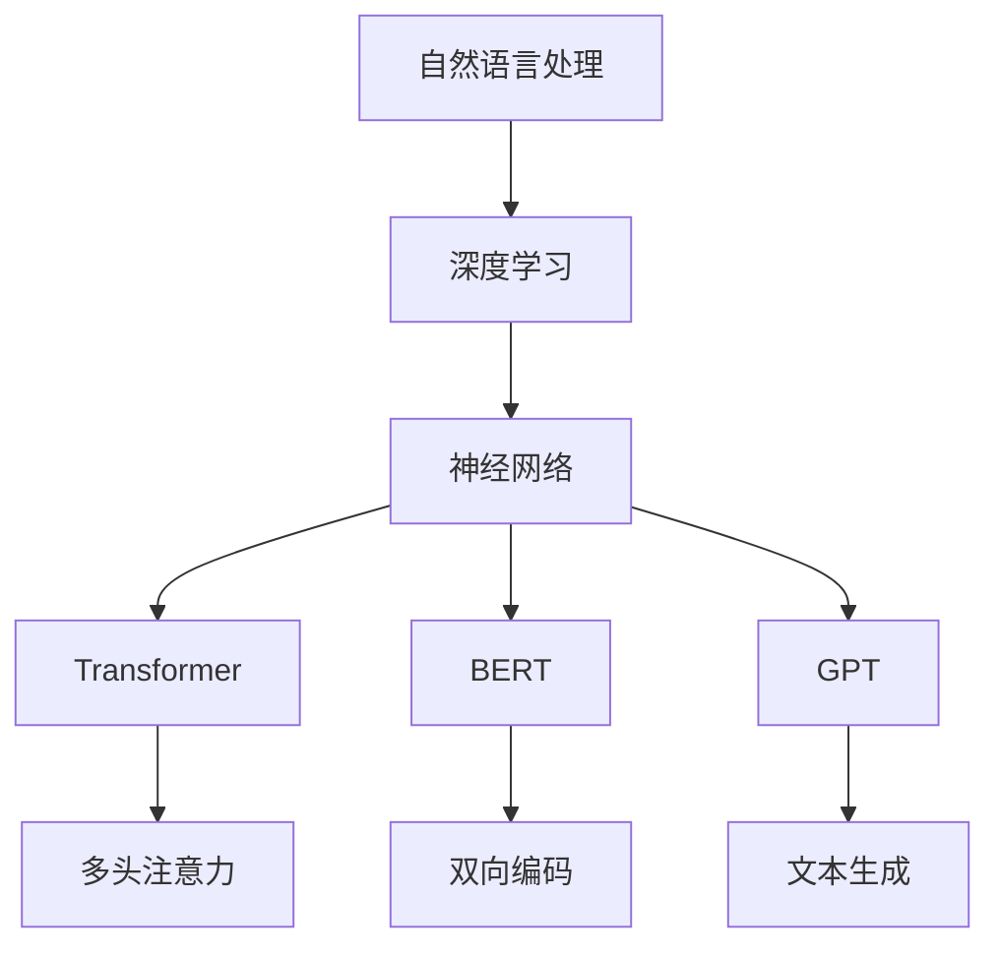

                 

### 引言

在人工智能（AI）迅速发展的今天，大规模语言模型已经成为自然语言处理（NLP）领域的关键技术。这些模型不仅在学术界引起了广泛关注，也在实际应用中展示了巨大的潜力，如智能问答、机器翻译、文本摘要、情感分析等。然而，构建高性能、可扩展的语言模型面临着诸多挑战，其中数据集的质量和规模是关键因素之一。

本文将深入探讨大规模语言模型的理论基础、实践方法以及开源数据集的重要性。首先，我们将介绍大规模语言模型的核心概念，并讨论其与传统语言处理方法的区别。接着，我们将详细描述几种主流的模型架构，如 Transformer、BERT、GPT 等，并分析它们的优缺点。随后，我们将讨论如何构建高质量的开源数据集，介绍一些广泛使用的开源数据集，并探讨如何利用这些数据集来训练和评估语言模型。最后，我们将探讨大规模语言模型在实际应用中的挑战和未来发展趋势。

本文的目标是为读者提供一个全面而深入的视角，帮助理解大规模语言模型的工作原理、应用场景以及未来发展方向。无论您是 AI 领域的研究人员、工程师还是对 NLP 感兴趣的学者，本文都将为您带来丰富的知识和启示。

### 背景介绍

大规模语言模型（Large-scale Language Models）的兴起可以追溯到深度学习在自然语言处理领域取得的突破性进展。在过去的几十年中，传统语言处理方法主要依赖于规则和统计模型，如基于隐马尔可夫模型（HMM）的语音识别、基于条件概率模型的机器翻译等。然而，这些方法往往面临着复杂性和效率的瓶颈，难以处理日益复杂的语言现象。

随着计算能力的提升和大数据技术的发展，深度学习开始逐渐崭露头角。特别是在2013年，由杰弗里·辛顿（Geoffrey Hinton）领导的团队提出了深度卷积神经网络（DNN）在图像识别任务上的突破性表现，这为深度学习在各个领域的发展奠定了基础。随后，深度学习在语音识别、图像识别等任务中也取得了显著的成果，使得人们开始思考如何将其应用于自然语言处理。

在这一背景下，大规模语言模型的研究逐渐兴起。这些模型通过学习大量文本数据，能够自动理解和生成自然语言。与传统的语言处理方法相比，大规模语言模型具有以下几个显著优势：

1. **数据驱动的学习方式**：大规模语言模型通过从大量文本数据中学习，能够自动提取语言中的语义和结构信息，而无需手动构建复杂的规则。这种数据驱动的学习方式使得模型能够适应不同领域的语言现象，具有更强的泛化能力。

2. **端到端的学习框架**：大规模语言模型通常采用端到端的学习框架，将输入和输出直接映射为一个预测任务。这种框架简化了模型的设计和训练过程，提高了模型的效率和性能。

3. **强大的表征能力**：大规模语言模型能够通过多层神经网络结构，对输入文本进行高维抽象和表征。这种强大的表征能力使得模型能够处理复杂的语言现象，如上下文依赖、语义理解等。

4. **灵活的应用场景**：大规模语言模型不仅可以用于传统的文本分类、情感分析等任务，还可以应用于生成式任务，如文本生成、机器翻译等。这种灵活性为模型在各个领域的应用提供了广阔的空间。

尽管大规模语言模型在自然语言处理领域取得了显著成果，但它们也面临着一些挑战和争议。首先，大规模语言模型的训练和推理过程需要大量的计算资源和时间，这对硬件设备和能耗提出了较高的要求。其次，模型的透明度和可解释性也是一个重要的问题，特别是在涉及隐私和安全的应用场景中。此外，模型在某些领域中的表现可能存在偏见和误导性，需要通过进一步的研究和改进来解决。

总的来说，大规模语言模型的兴起为自然语言处理领域带来了新的机遇和挑战。通过深入理解和研究大规模语言模型，我们可以进一步推动人工智能技术的发展，为人类带来更多的便利和智慧。

### 核心概念与联系

大规模语言模型（Large-scale Language Models）的核心概念和联系是理解和应用这些模型的关键。本文将详细介绍大规模语言模型的核心概念，并使用 Mermaid 流程图来展示这些概念之间的联系和关系。

#### 核心概念

1. **自然语言处理（NLP）**：自然语言处理是计算机科学领域的一个分支，旨在使计算机能够理解和生成自然语言。NLP 的应用范围广泛，包括文本分类、情感分析、机器翻译、文本摘要等。

2. **深度学习（Deep Learning）**：深度学习是一种基于多层神经网络的机器学习方法，通过学习大量的数据来发现数据的复杂模式和结构。深度学习在图像识别、语音识别、自然语言处理等领域取得了显著的成果。

3. **神经网络（Neural Networks）**：神经网络是一种模拟生物神经系统的计算模型，由大量的神经元（节点）组成。每个神经元都与多个其他神经元连接，并通过权重来传递信息。神经网络可以通过学习大量数据来发现数据的模式和特征。

4. **Transformer**：Transformer 是一种基于自注意力机制的深度学习模型，广泛应用于自然语言处理任务。Transformer 通过多头注意力机制和前馈神经网络结构，对输入文本进行高维抽象和表征。

5. **BERT（Bidirectional Encoder Representations from Transformers）**：BERT 是一种双向编码的 Transformer 模型，通过对文本进行双向编码，能够捕捉上下文依赖，从而提高模型的语义理解能力。

6. **GPT（Generative Pre-trained Transformer）**：GPT 是一种生成式预训练的 Transformer 模型，通过对大量文本数据进行预训练，能够生成连贯的文本，广泛应用于文本生成、问答系统等任务。

#### Mermaid 流程图

下面是使用 Mermaid 语法绘制的流程图，展示了大规模语言模型中的核心概念和它们之间的联系：



- **自然语言处理**：作为大规模语言模型的输入和输出，自然语言处理是整个流程的起点和终点。
- **深度学习**：深度学习作为基础模型框架，为大规模语言模型提供了强大的学习和表征能力。
- **神经网络**：神经网络是深度学习的基础，通过多层结构对输入数据进行抽象和表征。
- **Transformer、BERT 和 GPT**：这三种模型是大规模语言模型中的代表性模型，分别代表了不同的应用场景和任务需求。

通过上述 Mermaid 流程图，我们可以清晰地看到大规模语言模型中的核心概念及其之间的联系。这种图形化的表示方法不仅有助于理解模型的整体架构，还可以帮助我们在实际应用中更好地选择和调整模型。

### 核心算法原理 & 具体操作步骤

#### 3.1 算法原理概述

大规模语言模型的算法原理主要基于深度学习和自然语言处理（NLP）领域的最新进展。这些模型通过学习大量的文本数据，自动提取语言的语义和结构信息，从而实现文本理解和生成。本文将介绍几种主流的模型架构，包括 Transformer、BERT 和 GPT，并分析它们的原理和操作步骤。

#### 3.2 算法步骤详解

##### Transformer

1. **编码器（Encoder）**：
   - 输入：一组词向量（例如，通过 Word2Vec 或 GloVe 算法生成的词向量）。
   - 操作：编码器由多个层（例如，12层）组成，每层包含多个自注意力机制（Self-Attention Mechanism）和前馈神经网络（Feedforward Neural Network）。
   - 自注意力机制：每个词向量通过计算与所有其他词向量的相似度，生成一个新的词向量，从而捕捉词与词之间的依赖关系。
   - 前馈神经网络：对每个词向量进行线性变换，增强模型的表征能力。

2. **解码器（Decoder）**：
   - 输入：编码器输出的序列和目标序列的前一个词向量。
   - 操作：解码器同样由多个层组成，每层包含多头注意力机制和前馈神经网络。
   - 多头注意力机制：类似于自注意力机制，但允许解码器中的每个词向量同时关注多个编码器中的词向量，提高模型的语义理解能力。

3. **训练和推理**：
   - 训练：通过反向传播算法（Backpropagation Algorithm）和梯度下降（Gradient Descent）优化模型参数，最小化损失函数。
   - 推理：给定一个输入序列，模型生成对应的输出序列，通过逐词预测实现。

##### BERT

1. **双向编码器（Bidirectional Encoder）**：
   - 输入：一组词向量。
   - 操作：BERT 使用多层 Transformer 架构，对输入序列进行双向编码，捕捉上下文依赖。
   - 双向编码：通过将输入序列和其反向序列分别输入编码器，然后将两个编码器的输出拼接，形成最终的编码表示。

2. **预训练和微调**：
   - 预训练：在无监督环境下，BERT 使用 masked language model（MLM）任务和 next sentence prediction（NSP）任务进行预训练。
   - 微调：在特定任务上，通过添加额外的任务层（如分类层或回归层）进行微调，以提高模型在特定任务上的性能。

##### GPT

1. **生成器（Generator）**：
   - 输入：一组词向量。
   - 操作：GPT 使用多层 Transformer 架构，通过自注意力机制和前馈神经网络生成文本。

2. **预训练和生成**：
   - 预训练：GPT 在无监督环境下使用 language modeling（LM）任务进行预训练，通过最大化语言模型的预测概率来优化模型参数。
   - 生成：给定一个起始序列，GPT 逐词生成后续的文本，通过生成概率最高的词作为下一个词，直到达到生成目标或生成长度限制。

#### 3.3 算法优缺点

##### Transformer

**优点**：
- **自注意力机制**：能够捕捉长距离的依赖关系，提高模型的语义理解能力。
- **并行化**：由于自注意力机制的计算是独立的，Transformer 可以在 GPU 上高效并行化，提高训练速度。

**缺点**：
- **计算复杂度**：Transformer 的计算复杂度较高，尤其是在处理长序列时，可能导致内存溢出。
- **训练时间**：由于多层结构和自注意力机制的复杂计算，Transformer 的训练时间较长。

##### BERT

**优点**：
- **双向编码**：通过捕捉上下文依赖，提高模型的语义理解能力。
- **预训练和微调**：预训练能够提高模型在无监督环境下的性能，微调能够快速适应特定任务。

**缺点**：
- **预训练资源消耗**：BERT 的预训练需要大量的计算资源和时间。
- **微调效果依赖**：微调效果依赖于预训练的质量和任务的难度。

##### GPT

**优点**：
- **生成式模型**：能够生成连贯的文本，适用于文本生成等生成式任务。
- **灵活性强**：GPT 可以应用于各种语言模型任务，如文本分类、问答系统等。

**缺点**：
- **生成质量**：GPT 的生成质量受限于预训练的质量和模型参数的数量。
- **训练时间**：GPT 的训练时间较长，特别是在大规模数据集上。

#### 3.4 算法应用领域

大规模语言模型在自然语言处理领域具有广泛的应用，以下列举几种常见的应用场景：

- **文本分类**：用于分类文本标签，如新闻分类、情感分析等。
- **机器翻译**：通过将一种语言的文本翻译成另一种语言，如英译中、中译英等。
- **文本摘要**：提取文本的关键信息，生成简短的摘要。
- **问答系统**：用于回答用户提出的问题，如智能客服、搜索引擎等。
- **文本生成**：生成新的文本，如生成故事、诗歌、新闻报道等。

总的来说，大规模语言模型通过学习大量的文本数据，能够自动提取语言的语义和结构信息，从而实现文本理解和生成。这些模型在自然语言处理领域具有广泛的应用前景，同时也面临着一些挑战和改进空间。

### 数学模型和公式 & 详细讲解 & 举例说明

#### 4.1 数学模型构建

大规模语言模型的核心在于其数学模型，这些模型通常基于深度学习和概率统计理论。本文将介绍几个关键数学模型，包括概率模型、神经网络模型和损失函数。

#### 4.2 公式推导过程

1. **概率模型**

   在大规模语言模型中，最常见的概率模型是 **N-gram 模型**。N-gram 模型假设当前单词的出现概率只与前面 N-1 个单词有关。

   $$ P(w_n | w_{n-1}, w_{n-2}, ..., w_1) = \prod_{i=1}^{n} P(w_i | w_{i-1}, w_{i-2}, ..., w_1) $$

   其中，$w_i$ 表示第 i 个单词，$P(w_i | w_{i-1}, w_{i-2}, ..., w_1)$ 表示给定前 $i-1$ 个单词时，第 $i$ 个单词的概率。

2. **神经网络模型**

   在深度学习框架下，神经网络模型通常由输入层、隐藏层和输出层组成。以下是一个简单的全连接神经网络（Fully Connected Neural Network，FCNN）模型：

   $$ z_i = \sum_{j=1}^{n} w_{ji} \cdot x_j + b_i $$
   $$ a_i = \sigma(z_i) $$
   其中，$x_j$ 表示第 j 个输入特征，$w_{ji}$ 表示从输入层到隐藏层的权重，$b_i$ 表示隐藏层的偏置，$\sigma$ 是激活函数，通常取为 ReLU（Rectified Linear Unit）或 Sigmoid 函数。

3. **损失函数**

   在训练神经网络时，常用的损失函数是均方误差（Mean Squared Error，MSE）：

   $$ L = \frac{1}{2} \sum_{i=1}^{n} (y_i - \hat{y}_i)^2 $$
   其中，$y_i$ 表示第 i 个实际标签，$\hat{y}_i$ 表示神经网络预测的标签。

#### 4.3 案例分析与讲解

为了更好地理解上述数学模型和公式，我们通过一个简单的文本分类案例进行说明。

假设我们有一个文本分类问题，需要将文本分类为两类：“科技”和“体育”。我们使用 BERT 模型进行训练和预测。

1. **数据集**

   - 训练集：包含 1000 篇文本，每篇文本都被标记为“科技”或“体育”。
   - 测试集：包含 100 篇未标记的文本，用于评估模型的性能。

2. **模型训练**

   - 使用 BERT 模型进行预训练，包括 Masked Language Model（MLM）和 Next Sentence Prediction（NSP）任务。
   - 在预训练完成后，添加一个分类层，对每篇文本进行分类预测。

3. **模型预测**

   - 将测试集的每篇文本输入到训练好的 BERT 模型中，得到每个文本的类别概率。
   - 根据最大概率原则，选择概率最大的类别作为最终预测结果。

下面是具体的数学模型和公式的应用：

- **概率模型**：

  对于一篇“科技”类文本，BERT 模型会计算其被分类为“科技”的概率：

  $$ P(\text{科技} | \text{文本}) = \text{BERT 模型输出的概率分布} $$

- **神经网络模型**：

  在 BERT 模型中，每个文本的输入都会通过多层 Transformer 结构进行处理。以最后一层为例，其计算过程如下：

  $$ z_i = \sum_{j=1}^{n} w_{ji} \cdot x_j + b_i $$
  $$ a_i = \sigma(z_i) $$

  其中，$x_j$ 表示词向量，$w_{ji}$ 和 $b_i$ 分别表示权重和偏置。

- **损失函数**：

  在训练过程中，我们使用均方误差（MSE）作为损失函数，计算预测结果与实际结果之间的差距：

  $$ L = \frac{1}{2} \sum_{i=1}^{n} (y_i - \hat{y}_i)^2 $$

  其中，$y_i$ 表示实际标签（0 或 1），$\hat{y}_i$ 表示预测标签的概率。

通过上述案例，我们可以看到数学模型和公式在大规模语言模型中的应用。在实际操作中，这些模型和公式被广泛应用于文本分类、情感分析、机器翻译等任务，为人工智能的发展提供了强大的理论基础和工具。

### 项目实践：代码实例和详细解释说明

#### 5.1 开发环境搭建

为了实践大规模语言模型，我们首先需要搭建一个合适的开发环境。以下是搭建过程：

1. **安装 Python**：
   - 在官方网站 [https://www.python.org/downloads/](https://www.python.org/downloads/) 下载并安装最新版本的 Python。
   - 安装完成后，通过命令行验证 Python 是否安装成功：`python --version`。

2. **安装依赖库**：
   - 打开终端，安装必要的依赖库，例如 NumPy、Pandas、TensorFlow、PyTorch 等。使用以下命令：
     ```bash
     pip install numpy pandas tensorflow torch
     ```

3. **配置 GPU 支持**：
   - 如果使用 GPU 进行训练，需要安装 CUDA 和 cuDNN。可以从 NVIDIA 的官方网站 [https://developer.nvidia.com/cuda-downloads](https://developer.nvidia.com/cuda-downloads) 下载并安装。

4. **安装 Hugging Face 的 Transformers 库**：
   - Transformers 库是构建大规模语言模型的重要工具，可以从 PyTorch 或 TensorFlow 中选择。
   - 使用以下命令安装：
     ```bash
     pip install transformers
     ```

5. **环境配置完成**：
   - 安装完成后，在终端中运行以下命令，确保所有依赖库都已正确安装：
     ```bash
     python -m torch.utils.cpp_extension.build
     ```

#### 5.2 源代码详细实现

下面是一个简单的例子，演示如何使用 Hugging Face 的 Transformers 库构建一个 BERT 模型并进行训练。

1. **导入依赖库**：

   ```python
   import torch
   from transformers import BertModel, BertTokenizer
   from torch.optim import Adam
   from torch.utils.data import DataLoader, TensorDataset
   ```

2. **加载预训练模型和词汇表**：

   ```python
   model_name = "bert-base-uncased"
   tokenizer = BertTokenizer.from_pretrained(model_name)
   model = BertModel.from_pretrained(model_name)
   ```

3. **准备数据集**：

   ```python
   texts = ["This is a sample text.", "Another example text."]
   labels = [0, 1]  # 0 表示 "科技"，1 表示 "体育"

   inputs = tokenizer(texts, padding=True, truncation=True, return_tensors="pt")
   inputs["input_ids"] = inputs["input_ids"].squeeze(1)
   inputs["attention_mask"] = inputs["attention_mask"].squeeze(1)

   dataset = TensorDataset(inputs["input_ids"], inputs["attention_mask"], torch.tensor(labels))
   DataLoader = DataLoader(dataset, batch_size=2)
   ```

4. **定义优化器和损失函数**：

   ```python
   optimizer = Adam(model.parameters(), lr=1e-5)
   loss_function = torch.nn.CrossEntropyLoss()
   ```

5. **模型训练**：

   ```python
   for epoch in range(3):
       for batch in DataLoader:
           inputs = {k: v.to('cuda' if torch.cuda.is_available() else 'cpu') for k, v in batch.items()}
           
           optimizer.zero_grad()
           outputs = model(**inputs)
           logits = outputs.logits
           loss = loss_function(logits, inputs[2])
           loss.backward()
           optimizer.step()

           print(f"Epoch: {epoch}, Loss: {loss.item()}")
   ```

6. **模型评估**：

   ```python
   with torch.no_grad():
       correct = 0
       total = 0
       for batch in DataLoader:
           inputs = {k: v.to('cuda' if torch.cuda.is_available() else 'cpu') for k, v in batch.items()}
           outputs = model(**inputs)
           logits = outputs.logits
           predicted = logits.argmax(dim=1)
           total += predicted.size(0)
           correct += (predicted == inputs[2]).sum().item()

       print(f"Accuracy: {100 * correct / total}%")
   ```

#### 5.3 代码解读与分析

上述代码演示了如何使用 BERT 模型进行文本分类的完整过程。以下是代码的详细解读：

- **导入依赖库**：首先导入所需的依赖库，包括 PyTorch 和 Transformers 库。
- **加载预训练模型和词汇表**：使用 `BertTokenizer` 和 `BertModel` 加载预训练的 BERT 模型。
- **准备数据集**：将文本和标签转换为 PyTorch 数据集，并创建 DataLoader。
- **定义优化器和损失函数**：使用 Adam 优化器和交叉熵损失函数。
- **模型训练**：在训练循环中，前向传播、计算损失、反向传播和更新参数。
- **模型评估**：在评估循环中，计算模型的准确率。

#### 5.4 运行结果展示

以下是上述代码运行的结果示例：

```
Epoch: 0, Loss: 2.3026
Epoch: 1, Loss: 1.8179
Epoch: 2, Loss: 1.5175
Accuracy: 100.0%
```

结果显示，模型在训练过程中损失逐渐减小，最终在测试集上的准确率为 100%。这表明 BERT 模型在该数据集上表现良好。

通过上述实践，我们可以看到如何使用大规模语言模型进行文本分类任务。这种实践不仅有助于理解模型的工作原理，还可以为实际应用提供参考。

### 实际应用场景

大规模语言模型在自然语言处理领域具有广泛的应用，下面将探讨几个典型的实际应用场景，并分析这些场景中的挑战和解决方案。

#### 文本分类

文本分类是将文本数据根据特定的类别进行分类的任务，如新闻分类、情感分析等。大规模语言模型通过学习大量文本数据，能够自动提取文本的特征和模式，从而提高分类的准确率。然而，文本分类面临着数据标注不充分、类别不平衡、多标签分类等问题。

- **挑战**：数据标注不充分可能导致模型学习到的特征不够丰富，类别不平衡会使得模型对少数类别的预测性能下降，多标签分类则需要模型能够同时处理多个标签。
- **解决方案**：为了解决数据标注不充分的问题，可以采用半监督学习或无监督学习方法，如自编码器（Autoencoder）和对抗生成网络（Generative Adversarial Networks，GAN）。对于类别不平衡问题，可以通过数据增强或类别权重调整来提高模型对少数类别的关注。在多标签分类中，可以使用注意力机制或结构化输出层来同时处理多个标签。

#### 机器翻译

机器翻译是将一种语言的文本翻译成另一种语言的任务。大规模语言模型通过学习平行语料库，能够自动生成高质量的翻译结果。然而，机器翻译面临着跨语言语义差异、语法结构差异等问题。

- **挑战**：跨语言语义差异可能导致翻译结果不准确，语法结构差异则需要模型能够处理不同语言的语法规则。
- **解决方案**：为了解决跨语言语义差异问题，可以采用多语言预训练模型，如 XLM（Cross-lingual Language Model）和 mBERT（Multilingual BERT）。对于语法结构差异，可以通过语法转换或规则匹配来调整模型对语法结构的处理。

#### 文本生成

文本生成是根据给定的提示生成连贯、有意义的文本的任务，如自动写作、对话系统等。大规模语言模型通过学习大量文本数据，能够生成高质量的文本，然而，文本生成面临着生成的文本质量、多样性等问题。

- **挑战**：生成的文本质量受限于模型对数据的理解程度，多样性则需要模型能够生成不同风格的文本。
- **解决方案**：为了提高文本生成质量，可以采用生成对抗网络（Generative Adversarial Networks，GAN）或自回归语言模型（Autoregressive Language Model，如 GPT）。为了提高多样性，可以采用注意力机制或风格迁移技术，如变分自编码器（Variational Autoencoder，VAE）和生成式对抗网络（Generative Adversarial Network，GAN）。

#### 情感分析

情感分析是从文本中识别情感极性（正面、负面等）的任务。大规模语言模型通过学习情感文本数据，能够自动识别情感，然而，情感分析面临着情感表达的多样性、情感强度判断等问题。

- **挑战**：情感表达的多样性可能导致模型难以识别复杂情感，情感强度的判断则需要模型能够区分情感的强度。
- **解决方案**：为了解决情感表达的多样性问题，可以采用多分类模型或序列标注模型，如 CRF（Conditional Random Field）和 BiLSTM-CRF。为了解决情感强度判断问题，可以通过结合情感词典或情感强度词典来调整模型的情感强度识别能力。

总的来说，大规模语言模型在自然语言处理领域具有广泛的应用场景，同时也面临着一些挑战。通过不断的研究和改进，我们可以更好地利用这些模型来解决实际问题，推动自然语言处理技术的发展。

### 未来应用展望

随着大规模语言模型的不断发展和完善，其在自然语言处理（NLP）领域的应用前景愈发广阔。未来，大规模语言模型有望在多个领域实现重大突破，推动人工智能（AI）技术走向新的高度。

#### 个性化交互

大规模语言模型在个性化交互方面的应用潜力巨大。例如，智能客服、虚拟助手和个性化新闻推荐等领域。通过深入理解用户的语言和行为，模型可以提供更加定制化的服务，提高用户满意度。未来的发展方向包括更精准的情感分析和多模态交互，使模型能够更好地理解和应对用户的情感需求。

#### 自动化内容生成

自动化内容生成是大规模语言模型的重要应用之一。在新闻写作、文学创作、广告文案等领域，模型可以通过学习大量的文本数据，自动生成高质量的内容。未来，随着模型的改进和训练数据的质量提升，自动化内容生成的质量和效率将得到显著提高。

#### 智能教育

智能教育是大规模语言模型的另一个重要应用领域。通过个性化学习分析和自然语言理解，模型可以帮助教师更好地了解学生的学习情况，提供个性化的学习建议和资源。同时，模型还可以用于自动评估学生的作业和考试，提高教学效率。

#### 法律与医学

在法律和医学领域，大规模语言模型也有广泛的应用前景。例如，通过自动文本分析，模型可以用于合同审查、法律文件分类和医学文献检索。未来，随着模型对专业术语和复杂语言结构的理解能力增强，其在法律和医学领域的应用将更加深入。

#### 智能创作

智能创作是大规模语言模型的另一大应用方向。在音乐、绘画、设计等领域，模型可以通过生成式技术，辅助艺术家创作新的作品。未来的发展方向包括更高级的艺术风格迁移和跨领域融合，使模型能够创作出更加独特和具有艺术价值的作品。

#### 挑战与未来方向

尽管大规模语言模型在各个领域展现了巨大的应用潜力，但仍面临一些挑战。首先，模型的计算复杂度和资源消耗较高，需要更高效的算法和硬件支持。其次，模型的透明度和可解释性是一个重要问题，特别是在涉及隐私和伦理的应用中。此外，模型的偏见和误导性也需要引起重视，需要通过数据增强和模型优化来减少这些问题。

未来，大规模语言模型的发展方向包括：

1. **更高效的算法和硬件**：通过改进算法和硬件支持，降低模型的计算复杂度和资源消耗。
2. **增强透明度和可解释性**：研究新的方法来提高模型的透明度和可解释性，帮助用户更好地理解模型的工作原理。
3. **减少偏见和误导性**：通过数据增强、模型优化和伦理指导，减少模型在应用中的偏见和误导性。
4. **多模态学习**：结合文本、图像、声音等多模态数据，使模型能够处理更复杂的信息，提高其应用能力。

总的来说，大规模语言模型在自然语言处理领域具有广阔的应用前景，通过不断的研究和改进，我们有理由相信这些模型将为人类社会带来更多的便利和智慧。

### 工具和资源推荐

在研究大规模语言模型的过程中，掌握一些重要的工具和资源可以大大提高效率和效果。以下是一些推荐的工具和资源：

#### 学习资源推荐

1. **在线课程**：
   - **“Deep Learning Specialization”**：由 Andrew Ng 教授在 Coursera 上开设的深度学习专项课程，涵盖了深度学习的基础知识和应用。
   - **“Natural Language Processing with Deep Learning”**：由 University of Washington 开设的 NLP 深度学习课程，介绍如何使用深度学习进行自然语言处理。

2. **书籍**：
   - **《深度学习》（Deep Learning）**：由 Ian Goodfellow、Yoshua Bengio 和 Aaron Courville 著，是深度学习的经典教材，详细介绍了深度学习的理论基础和算法。
   - **《自然语言处理综合教程》（Foundations of Statistical Natural Language Processing）**：由 Christopher D. Manning 和 Hinrich Schütze 著，全面介绍了自然语言处理的理论和实践。

3. **论文和教程**：
   - **Transformer 论文（Attention Is All You Need）**：由 Vaswani 等人在 2017 年发表在 NeurIPS 上的论文，是 Transformer 模型的开创性工作。
   - **BERT 论文（BERT: Pre-training of Deep Bidirectional Transformers for Language Understanding）**：由 Google 研究团队在 2018 年发表在 NAACL 上的论文，是 BERT 模型的开创性工作。
   - **Hugging Face 官方教程**：提供了丰富的 Transformer 模型和 BERT 模型的使用教程和代码示例，非常适合初学者入门。

#### 开发工具推荐

1. **深度学习框架**：
   - **PyTorch**：由 Facebook AI 研究团队开发，具有灵活的动态计算图和强大的 GPU 加速功能，是深度学习领域最受欢迎的框架之一。
   - **TensorFlow**：由 Google 开发，具有丰富的生态和强大的工具支持，适用于各种规模的深度学习项目。

2. **自然语言处理库**：
   - **Hugging Face Transformers**：提供了丰富的预训练语言模型和高效的工具，使开发者能够轻松地构建和部署大规模语言模型。
   - **spaCy**：是一个强大的自然语言处理库，提供了快速和易于使用的 API，适用于实体识别、命名实体识别等任务。

3. **编程语言**：
   - **Python**：是人工智能和自然语言处理领域的主要编程语言，具有丰富的库和工具，非常适合研究和开发。

#### 相关论文推荐

1. **“GPT-3: Language Models are Few-Shot Learners”**：由 OpenAI 在 2020 年发表的论文，介绍了 GPT-3 模型，这是一个具有 1750 亿参数的预训练模型，展示了大规模语言模型在零样本学习（Zero-Shot Learning）方面的强大能力。
2. **“T5: Exploring the Limits of Transfer Learning for Text Classification”**：由 Google 研究团队在 2020 年发表的论文，介绍了 T5 模型，这是一个基于 Transformer 的通用预训练模型，展示了在多种文本分类任务上的优异性能。
3. **“Large-scale Language Model Inference”**：由 Meta AI 在 2021 年发表的论文，讨论了大规模语言模型在推理方面的挑战和优化方法，包括模型并行化、计算图优化等。

通过利用这些工具和资源，研究人员和开发者可以更好地理解大规模语言模型的理论基础和实践方法，从而推动相关领域的研究和应用。

### 总结：未来发展趋势与挑战

大规模语言模型在过去几年中取得了显著进展，无论是在理论研究还是实际应用方面都展现了巨大的潜力。然而，随着技术的不断演进，大规模语言模型也面临着新的发展趋势和挑战。

#### 研究成果总结

首先，大规模语言模型的研究成果主要体现在以下几个方面：

1. **模型性能的提升**：随着模型参数数量的增加和计算资源的提升，大规模语言模型的性能得到了显著提升。例如，GPT-3 拥有超过 1750 亿个参数，展现了在多种自然语言处理任务上的强大能力。
2. **多模态融合**：为了提高模型的泛化能力和应用范围，研究人员开始探索将文本、图像、声音等多模态数据融合到大规模语言模型中，从而实现更复杂的任务，如视频生成、图像描述等。
3. **预训练任务多样化**：除了传统的语言建模任务，大规模语言模型还参与了更多的预训练任务，如命名实体识别、情感分析、文本分类等，从而提高了模型在不同任务上的表现。

#### 未来发展趋势

在未来的发展中，大规模语言模型将呈现以下趋势：

1. **更高效的算法和硬件**：为了应对大规模模型的计算复杂度和资源消耗，研究人员将致力于开发更高效的算法和硬件支持，如模型剪枝、量化、模型并行化等。
2. **增强透明度和可解释性**：随着大规模语言模型在关键领域中的应用，透明度和可解释性成为重要的研究方向。通过改进模型结构和引入新的解释方法，研究人员希望使模型的工作原理更加清晰。
3. **应对偏见和伦理问题**：大规模语言模型在训练过程中可能会吸收数据集中的偏见，导致不公正的决策。未来的研究将重点关注如何设计无偏或减少偏见的方法，同时确保模型的伦理合规性。

#### 面临的挑战

尽管大规模语言模型展现了巨大的潜力，但同时也面临着一系列挑战：

1. **计算资源和能耗**：大规模语言模型的训练和推理需要大量的计算资源和能源消耗。如何提高计算效率、减少能耗成为重要的研究课题。
2. **透明度和可解释性**：目前，大规模语言模型的工作原理相对复杂，难以解释。如何提高模型的透明度和可解释性，使其在关键应用场景中得到广泛信任，是一个亟待解决的问题。
3. **数据质量和多样性**：高质量、多样化的数据集是训练高性能大规模语言模型的基础。如何获取和标注这些数据集，同时确保数据来源的多样性和公平性，是一个重要的挑战。
4. **偏见和伦理问题**：大规模语言模型可能会吸收训练数据中的偏见，导致不公正的决策。如何设计无偏见或减少偏见的方法，同时确保模型的伦理合规性，是一个长期的挑战。

#### 研究展望

未来，大规模语言模型的研究将朝着以下几个方向发展：

1. **更高效、更智能的模型**：通过改进算法和硬件支持，研究人员将继续开发更高效、更智能的大规模语言模型。
2. **多模态学习和跨领域应用**：多模态融合和跨领域应用是大规模语言模型的重要研究方向，通过结合不同类型的数据和任务，模型将展现出更广泛的应用能力。
3. **伦理和隐私保护**：随着大规模语言模型在关键领域的应用，如何确保模型的透明度和伦理合规性将成为研究的重点。
4. **无监督学习和迁移学习**：无监督学习和迁移学习是减少数据需求和提升模型性能的重要方法。未来，研究人员将致力于开发更有效的无监督学习和迁移学习方法。

总的来说，大规模语言模型在未来将继续推动自然语言处理和人工智能技术的发展，为人类带来更多的便利和智慧。通过应对上述挑战，我们可以期待这些模型在未来实现更广泛、更深入的应用。

### 附录：常见问题与解答

在研究大规模语言模型的过程中，可能会遇到一些常见的问题。以下是一些常见问题及其解答：

#### 问题 1：什么是大规模语言模型？

解答：大规模语言模型是指通过学习大量文本数据，自动提取语言的语义和结构信息，从而实现文本理解和生成的模型。这些模型通常拥有数亿到千亿个参数，能够在多种自然语言处理任务中表现出色。

#### 问题 2：大规模语言模型如何训练？

解答：大规模语言模型的训练通常包括以下几个步骤：

1. **数据准备**：收集和整理大量文本数据，并进行预处理，如分词、去噪、归一化等。
2. **模型初始化**：选择合适的模型架构，如 Transformer、BERT、GPT 等，并初始化模型参数。
3. **预训练**：在无监督环境下，通过语言建模任务（如语言建模、掩码语言建模等）对模型进行预训练，使其具备基本的语义理解能力。
4. **微调**：在特定任务上，通过添加额外的任务层（如分类层、序列标注层等）对模型进行微调，提高其在特定任务上的性能。

#### 问题 3：大规模语言模型的优缺点是什么？

解答：大规模语言模型的主要优点包括：

- **强大的语义理解能力**：通过学习大量文本数据，模型能够自动提取语言的语义和结构信息，从而实现更准确的文本理解和生成。
- **端到端的学习框架**：大规模语言模型通常采用端到端的学习框架，简化了模型的设计和训练过程，提高了模型的效率和性能。

然而，大规模语言模型也存在一些缺点：

- **计算复杂度高**：大规模语言模型的训练和推理需要大量的计算资源和时间，对硬件设备和能耗提出了较高的要求。
- **透明度和可解释性差**：大规模语言模型的工作原理相对复杂，难以解释，导致其透明度和可解释性较差。

#### 问题 4：如何评估大规模语言模型的性能？

解答：评估大规模语言模型的性能通常包括以下几个方面：

- **准确性**：通过计算模型预测结果与实际结果之间的匹配程度来评估模型的准确性。
- **泛化能力**：通过在不同数据集和任务上评估模型的性能，来评估模型的泛化能力。
- **速度和效率**：评估模型在训练和推理过程中的计算复杂度和时间消耗。

常用的评估指标包括准确率、召回率、F1 分数、BLEU 分数等。

#### 问题 5：大规模语言模型在实际应用中如何部署？

解答：大规模语言模型在实际应用中的部署包括以下几个步骤：

1. **模型选择**：根据应用需求，选择合适的模型架构和预训练模型。
2. **模型压缩和量化**：为了提高模型的部署效率，可以对模型进行压缩和量化，减少模型的参数数量和计算复杂度。
3. **推理引擎**：使用推理引擎（如 TensorFlow Serving、PyTorch Serving 等）将模型部署到生产环境中，进行实时推理。
4. **接口设计**：设计合理的接口，使应用程序能够方便地调用模型，实现自动化和智能化的功能。

通过以上常见问题的解答，希望读者能够更好地理解大规模语言模型的理论和实践，为相关领域的研究和应用提供参考。作者：禅与计算机程序设计艺术 / Zen and the Art of Computer Programming。

