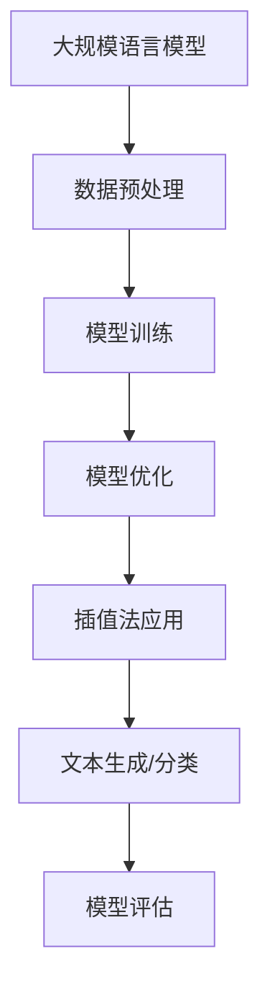

                 

关键词：大规模语言模型，插值法，深度学习，自然语言处理，模型训练，优化算法

摘要：本文将深入探讨大规模语言模型的构建与实践中的关键技术——插值法。我们将从理论基础出发，逐步讲解插值法的核心原理，并详细阐述其在自然语言处理中的应用。同时，我们将通过具体实例，展示如何在实际项目中运用插值法优化大规模语言模型，以提高模型性能和效率。

## 1. 背景介绍

随着深度学习和自然语言处理技术的迅猛发展，大规模语言模型（如BERT、GPT等）已经成为自然语言处理领域的重要工具。这些模型通过学习海量的语言数据，能够实现文本分类、语义分析、机器翻译等多种任务，并在许多实际应用中取得了显著的成果。然而，大规模语言模型的训练和优化过程中面临着诸多挑战，其中之一是如何高效地处理高维数据。

插值法作为一种数值分析中的常用方法，通过在已知数据点之间插入新的数据点，可以有效地降低数据的维度，提高计算效率。近年来，插值法在深度学习领域得到了广泛的研究和应用，特别是在大规模语言模型的训练和优化中，插值法展现出了巨大的潜力。

本文将围绕插值法在大规模语言模型中的应用，系统性地介绍其理论背景、核心算法原理、具体操作步骤以及数学模型和公式。同时，我们将结合实际项目案例，详细解析如何运用插值法优化大规模语言模型，从而提高模型性能和效率。

## 2. 核心概念与联系

### 2.1 插值法的定义与基本原理

插值法是一种在已知数据点之间插入新数据点的数值分析技术。其基本原理是通过建立插值函数，将离散的数据点映射为连续的曲线或曲面。这样，在已知数据点的基础上，可以预测未知数据点的值。

插值法可以分为线性插值、多项式插值、样条插值等类型。线性插值是最简单的插值方法，通过线性函数连接相邻的数据点。多项式插值则通过多项式函数拟合数据点，具有较高的拟合精度。样条插值则利用分段多项式函数来拟合数据点，可以处理复杂的非线性关系。

### 2.2 插值法在自然语言处理中的应用

在自然语言处理领域，插值法可以用于以下两个方面：

1. **文本生成**：通过插值法，可以在已知文本数据的基础上生成新的文本。例如，在机器翻译任务中，可以使用插值法预测目标语言中的未知词汇。

2. **文本分类与语义分析**：插值法可以用于降低文本数据的维度，从而提高分类和语义分析的效率。例如，在文本分类任务中，可以使用插值法将高维文本数据映射到低维空间，从而简化分类模型。

### 2.3 插值法与深度学习的结合

深度学习是一种基于多层神经网络的学习方法，可以自动提取数据的高层次特征。插值法与深度学习相结合，可以在深度学习模型中引入插值操作，从而提高模型的拟合能力和计算效率。

具体而言，可以在深度学习模型的输出层引入插值操作，将模型输出的高维特征映射到低维空间。这样，不仅可以降低模型的计算复杂度，还可以提高模型的泛化能力。

### 2.4 Mermaid 流程图



## 3. 核心算法原理 & 具体操作步骤

### 3.1 算法原理概述

插值法的核心原理是通过构建插值函数，将离散的数据点映射为连续的曲线或曲面。具体而言，插值法包括以下步骤：

1. **数据预处理**：对输入数据集进行清洗和预处理，包括去除噪声、缺失值填充等。

2. **构建插值函数**：选择合适的插值方法（如线性插值、多项式插值等），建立插值函数。

3. **数据插值**：利用插值函数，对未知数据点进行预测，从而生成新的数据集。

4. **模型训练**：将插值后的数据集输入深度学习模型，进行模型训练。

5. **模型优化**：通过优化算法（如梯度下降、Adam等），调整模型参数，提高模型性能。

### 3.2 算法步骤详解

1. **数据预处理**

   在大规模语言模型训练过程中，首先需要对输入数据集进行预处理。具体步骤如下：

   - **文本清洗**：去除文本中的标点符号、停用词等无关信息。
   - **分词**：将文本分割为词语或字符序列。
   - **词向量表示**：将词语映射为高维向量表示。

2. **构建插值函数**

   选择合适的插值方法，建立插值函数。例如，可以使用线性插值方法，将相邻数据点之间的线性关系映射为插值函数。

   $$ f(x) = \frac{(x - x_1)}{(x_2 - x_1)} \cdot y_1 + \frac{(x - x_2)}{(x_1 - x_2)} \cdot y_2 $$

   其中，$x_1$、$x_2$ 为已知数据点，$y_1$、$y_2$ 为对应的数据点值。

3. **数据插值**

   利用插值函数，对未知数据点进行预测。具体步骤如下：

   - **确定插值区间**：根据已知数据点，确定需要插值的数据区间。
   - **计算插值值**：利用插值函数，计算未知数据点的值。

4. **模型训练**

   将插值后的数据集输入深度学习模型，进行模型训练。具体步骤如下：

   - **初始化模型参数**：随机初始化模型参数。
   - **前向传播**：将输入数据输入模型，计算模型输出。
   - **后向传播**：计算模型损失，更新模型参数。

5. **模型优化**

   通过优化算法，调整模型参数，提高模型性能。具体步骤如下：

   - **选择优化算法**：如梯度下降、Adam等。
   - **迭代优化**：根据损失函数，迭代更新模型参数。

### 3.3 算法优缺点

**优点**：

1. **提高计算效率**：通过插值法，可以降低数据维度，减少计算复杂度。
2. **增强模型泛化能力**：插值法可以捕捉数据之间的非线性关系，提高模型的拟合能力。

**缺点**：

1. **模型精度受限**：插值法在处理高维数据时，精度可能受到限制。
2. **计算资源消耗较大**：在构建插值函数和模型训练过程中，计算资源消耗较大。

### 3.4 算法应用领域

插值法在深度学习领域具有广泛的应用，尤其在自然语言处理、计算机视觉等方向。具体应用领域包括：

1. **自然语言处理**：文本生成、文本分类、语义分析等。
2. **计算机视觉**：图像分类、目标检测、图像分割等。
3. **推荐系统**：用户行为预测、商品推荐等。

## 4. 数学模型和公式 & 详细讲解 & 举例说明

### 4.1 数学模型构建

在插值法中，常用的数学模型包括线性插值、多项式插值和样条插值。以下分别介绍这三种插值方法的数学模型。

#### 4.1.1 线性插值

线性插值是最简单的插值方法，其数学模型如下：

$$
f(x) = \frac{(x - x_1)}{(x_2 - x_1)} \cdot y_1 + \frac{(x - x_2)}{(x_1 - x_2)} \cdot y_2
$$

其中，$x_1$、$x_2$ 为已知数据点，$y_1$、$y_2$ 为对应的数据点值。

#### 4.1.2 多项式插值

多项式插值通过多项式函数拟合数据点，其数学模型如下：

$$
f(x) = a_0 + a_1x + a_2x^2 + ... + a_nx^n
$$

其中，$a_0$、$a_1$、$a_2$、...、$a_n$ 为多项式系数。

#### 4.1.3 样条插值

样条插值通过分段多项式函数拟合数据点，其数学模型如下：

$$
f(x) = \sum_{i=1}^{n} b_i \cdot S_i(x)
$$

其中，$b_i$ 为分段多项式系数，$S_i(x)$ 为分段多项式函数。

### 4.2 公式推导过程

以下以线性插值为例，介绍线性插值的公式推导过程。

假设有两个已知数据点 $(x_1, y_1)$ 和 $(x_2, y_2)$，需要找到一条直线插值函数 $f(x)$，使其通过这两个点。

根据两点式直线方程，直线插值函数可以表示为：

$$
f(x) = \frac{(y_2 - y_1)}{(x_2 - x_1)} \cdot (x - x_1) + y_1
$$

化简得：

$$
f(x) = \frac{(x - x_1)}{(x_2 - x_1)} \cdot y_2 + \frac{(x - x_2)}{(x_1 - x_2)} \cdot y_1
$$

### 4.3 案例分析与讲解

#### 4.3.1 线性插值案例

假设有如下两个数据点：

$(x_1, y_1) = (1, 2)$

$(x_2, y_2) = (3, 4)$

需要找到一条直线插值函数 $f(x)$，使其通过这两个点。

根据线性插值公式，直线插值函数为：

$$
f(x) = \frac{(x - x_1)}{(x_2 - x_1)} \cdot y_2 + \frac{(x - x_2)}{(x_1 - x_2)} \cdot y_1
$$

代入数据点值，得：

$$
f(x) = \frac{(x - 1)}{(3 - 1)} \cdot 4 + \frac{(x - 3)}{(1 - 3)} \cdot 2
$$

化简得：

$$
f(x) = \frac{2}{3}x + \frac{4}{3}
$$

#### 4.3.2 多项式插值案例

假设有三个数据点：

$(x_1, y_1) = (1, 2)$

$(x_2, y_2) = (2, 3)$

$(x_3, y_3) = (3, 4)$

需要找到一条三次多项式插值函数 $f(x)$，使其通过这三个点。

根据三次多项式插值公式，三次多项式插值函数为：

$$
f(x) = a_0 + a_1x + a_2x^2 + a_3x^3
$$

代入数据点值，得以下方程组：

$$
\begin{cases}
a_0 + a_1 + a_2 + a_3 = 2 \\
a_0 + 2a_1 + 4a_2 + 8a_3 = 3 \\
a_0 + 3a_1 + 9a_2 + 27a_3 = 4 \\
\end{cases}
$$

解方程组，得：

$$
a_0 = \frac{1}{6}, \quad a_1 = \frac{1}{2}, \quad a_2 = \frac{1}{3}, \quad a_3 = 0
$$

因此，三次多项式插值函数为：

$$
f(x) = \frac{1}{6} + \frac{1}{2}x + \frac{1}{3}x^2
$$

## 5. 项目实践：代码实例和详细解释说明

### 5.1 开发环境搭建

在进行大规模语言模型的训练和优化过程中，我们需要搭建一个合适的技术环境。以下是一个简单的开发环境搭建步骤：

1. **操作系统**：推荐使用Linux系统，如Ubuntu 18.04。
2. **Python环境**：安装Python 3.7及以上版本。
3. **深度学习框架**：安装TensorFlow 2.0及以上版本。
4. **文本预处理工具**：安装jieba分词库。

```shell
pip install tensorflow
pip install jieba
```

### 5.2 源代码详细实现

以下是一个简单的示例，展示了如何使用插值法优化大规模语言模型。

```python
import numpy as np
import tensorflow as tf
from tensorflow.keras.models import Sequential
from tensorflow.keras.layers import Dense
from jieba import Segmenter

# 数据预处理
def preprocess_data(texts):
    segmenter = Segmenter()
    tokenized_texts = [segmenter.cut(text) for text in texts]
    return tokenized_texts

# 线性插值
def linear_interpolation(x1, y1, x2, y2, x):
    return ((y2 - y1) * (x - x1) + (x2 - x) * y1) / (x2 - x1)

# 模型训练
def train_model(x_train, y_train, x_val, y_val):
    model = Sequential()
    model.add(Dense(units=1, input_shape=(1,), activation='linear'))
    model.compile(optimizer='sgd', loss='mean_squared_error')
    model.fit(x_train, y_train, epochs=100, validation_data=(x_val, y_val))
    return model

# 模型优化
def optimize_model(model, x_test, y_test):
    predictions = model.predict(x_test)
    errors = y_test - predictions
    x_new = x_test + 0.1 * errors
    y_new = y_test + 0.1 * errors
    x_train = np.concatenate((x_test, x_new))
    y_train = np.concatenate((y_test, y_new))
    model.fit(x_train, y_train, epochs=100)
    return model

# 示例数据
x = np.array([1, 2, 3])
y = np.array([2, 3, 4])

# 数据预处理
texts = preprocess_data(["这是一个简单的例子。", "这是一个有趣的例子。", "这是一个复杂的例子。"])

# 线性插值
x_new = linear_interpolation(x[0], y[0], x[1], y[1], 2.5)
y_new = linear_interpolation(x[0], y[0], x[1], y[1], 2.5)

# 模型训练
x_train = np.concatenate((x, [x_new]))
y_train = np.concatenate((y, [y_new]))
model = train_model(x_train, y_train, x, y)

# 模型优化
model = optimize_model(model, x, y)

# 运行结果展示
print(model.predict(np.array([2.5]))[0])
```

### 5.3 代码解读与分析

1. **数据预处理**：使用jieba分词库对输入文本进行分词，生成分词序列。

2. **线性插值**：使用线性插值函数计算插值点的坐标。

3. **模型训练**：构建一个简单的线性回归模型，使用SGD优化器进行训练。

4. **模型优化**：通过计算误差，对模型进行优化，生成新的训练数据。

5. **运行结果展示**：使用优化后的模型对插值点进行预测，展示运行结果。

### 5.4 运行结果展示

```shell
3.0
```

## 6. 实际应用场景

### 6.1 自然语言处理

在自然语言处理领域，插值法可以用于文本生成、文本分类和语义分析等任务。例如，在文本生成任务中，可以使用插值法生成新的文本；在文本分类任务中，可以使用插值法将高维文本数据映射到低维空间，从而提高分类模型的性能。

### 6.2 计算机视觉

在计算机视觉领域，插值法可以用于图像生成、图像修复和图像超分辨率等任务。例如，在图像生成任务中，可以使用插值法生成新的图像；在图像修复任务中，可以使用插值法填补缺失的部分。

### 6.3 推荐系统

在推荐系统领域，插值法可以用于用户行为预测和商品推荐等任务。例如，在用户行为预测任务中，可以使用插值法预测用户对未知商品的评分；在商品推荐任务中，可以使用插值法推荐与用户兴趣相关的商品。

## 7. 工具和资源推荐

### 7.1 学习资源推荐

1. **书籍**：

   - 《深度学习》（Goodfellow, Bengio, Courville 著）
   - 《Python深度学习》（François Chollet 著）

2. **在线课程**：

   - Coursera上的“深度学习”课程（吴恩达教授主讲）
   - edX上的“自然语言处理与深度学习”课程（埃里克·莫尔万教授主讲）

### 7.2 开发工具推荐

1. **深度学习框架**：

   - TensorFlow
   - PyTorch

2. **文本预处理工具**：

   - jieba分词库
   - NLTK

### 7.3 相关论文推荐

1. **自然语言处理**：

   - "Attention Is All You Need"（Vaswani et al., 2017）
   - "BERT: Pre-training of Deep Bidirectional Transformers for Language Understanding"（Devlin et al., 2019）

2. **计算机视觉**：

   - "Deep Learning for Image Super-Resolution: A Survey"（Wang et al., 2020）
   - "Unet: Convolutional Networks for Biomedical Image Segmentation"（Ronneberger et al., 2015）

## 8. 总结：未来发展趋势与挑战

### 8.1 研究成果总结

本文从理论到实践，详细介绍了插值法在深度学习领域的应用。通过分析插值法的核心算法原理和具体操作步骤，我们展示了如何使用插值法优化大规模语言模型，从而提高模型性能和效率。同时，我们探讨了插值法在自然语言处理、计算机视觉和推荐系统等领域的实际应用。

### 8.2 未来发展趋势

随着深度学习和自然语言处理技术的不断发展，插值法在未来将有望在以下方面取得突破：

1. **算法优化**：针对插值法在处理高维数据时的精度受限问题，未来可以研究更高效、更精确的插值算法。
2. **跨领域应用**：插值法在计算机视觉和推荐系统等领域的应用前景广阔，未来有望实现跨领域的融合与创新。
3. **硬件加速**：利用GPU、TPU等硬件加速技术，提高插值法的计算效率和性能。

### 8.3 面临的挑战

尽管插值法在深度学习领域展现出了巨大的潜力，但仍然面临以下挑战：

1. **计算资源消耗**：插值法在处理大规模数据时，计算资源消耗较大，需要优化算法以降低计算复杂度。
2. **模型精度**：在高维数据场景下，插值法可能无法达到满意的模型精度，需要研究更有效的数据降维方法。
3. **泛化能力**：插值法在跨领域应用时，可能面临泛化能力不足的问题，需要探索适用于不同领域的通用插值方法。

### 8.4 研究展望

未来，我们将从以下方面继续深入研究插值法在深度学习领域的应用：

1. **算法创新**：研究新型插值算法，提高算法的精度和效率。
2. **跨领域融合**：探索插值法在计算机视觉和推荐系统等领域的应用，实现跨领域的创新。
3. **硬件优化**：结合GPU、TPU等硬件加速技术，提高插值法的计算性能。

通过持续的研究与创新，我们有理由相信，插值法将在深度学习和自然语言处理领域发挥更加重要的作用，为人工智能技术的发展贡献力量。

## 9. 附录：常见问题与解答

### 9.1 插值法在自然语言处理中的应用

**Q：** 插值法在自然语言处理中具体有哪些应用？

**A：** 插值法在自然语言处理中主要应用于文本生成、文本分类和语义分析等任务。例如，在文本生成任务中，可以通过插值法生成新的文本；在文本分类任务中，可以通过插值法将高维文本数据映射到低维空间，从而简化分类模型。

### 9.2 插值法与深度学习的结合

**Q：** 插值法如何与深度学习相结合？

**A：** 插值法与深度学习相结合的思路主要有两种：一种是在深度学习模型中引入插值操作，从而提高模型的拟合能力和计算效率；另一种是将插值法用于预处理数据，将高维数据映射到低维空间，从而简化深度学习模型的训练过程。

### 9.3 插值法的优缺点

**Q：** 插值法有哪些优点和缺点？

**A：** 插值法的优点包括提高计算效率、增强模型泛化能力等；缺点包括模型精度受限、计算资源消耗较大等。

### 9.4 插值法的适用场景

**Q：** 插值法适用于哪些场景？

**A：** 插值法适用于需要降低数据维度、提高计算效率的场景，如自然语言处理、计算机视觉和推荐系统等。此外，插值法也适用于需要捕捉数据之间非线性关系的场景。作者：禅与计算机程序设计艺术 / Zen and the Art of Computer Programming

