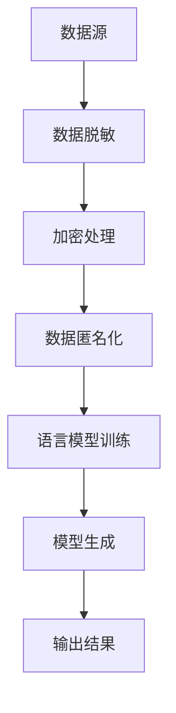
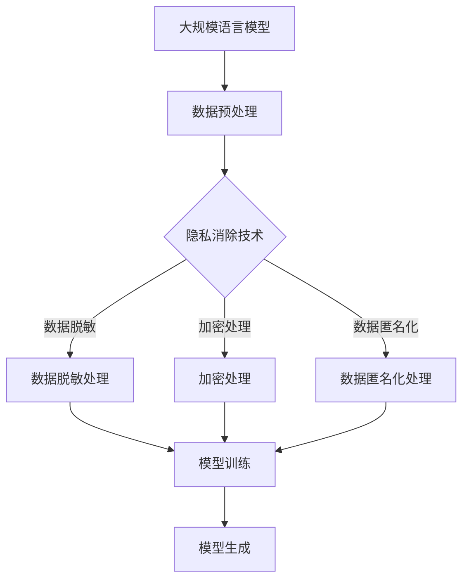

                 

## 1. 背景介绍

随着互联网的飞速发展，大规模语言模型（Large-scale Language Models）已成为自然语言处理（Natural Language Processing, NLP）领域的研究热点。这些模型具有强大的语言理解和生成能力，可以应用于机器翻译、问答系统、文本生成等众多领域。然而，大规模语言模型的训练和部署过程中，面临着隐私保护的重要挑战。隐私消除（Privacy-Preserving）技术，作为数据保护的重要手段，旨在在保障用户隐私的同时，仍能充分发挥语言模型的能力。

隐私消除技术在近年来得到了广泛关注，尤其在医疗、金融、教育等敏感数据领域。通过隐私消除技术，可以有效地减少数据泄露的风险，保护用户的个人隐私。本文将从隐私消除技术的理论出发，深入探讨其在大规模语言模型中的应用，并通过具体实例进行详细解析。

## 2. 核心概念与联系

### 2.1 隐私消除技术概述

隐私消除技术，是指通过数据脱敏、加密、数据匿名化等手段，消除数据中的个人识别信息，从而保护用户隐私的一种技术。在隐私消除技术中，常见的手段包括：

- **数据脱敏**：通过替换敏感信息为伪随机值，降低数据的敏感度。
- **加密**：利用加密算法，将数据转换为无法直接识别的密文，保护数据在传输和存储过程中的安全。
- **数据匿名化**：通过数据抽象、泛化和混淆等技术，消除数据中的个人识别信息。

### 2.2 大规模语言模型的基本原理

大规模语言模型，通常基于深度学习技术，通过在大量文本数据上进行训练，学习语言的统计规律和语义信息。常见的语言模型包括基于循环神经网络（RNN）、变换器（Transformer）等架构。语言模型的核心任务是理解输入文本的含义，并生成相应的输出文本。

### 2.3 Mermaid 流程图



### 2.4 隐私消除与大规模语言模型的联系

隐私消除技术在大规模语言模型中的应用，主要体现在数据预处理阶段。通过对输入数据进行隐私消除处理，可以有效地保护用户的个人隐私，同时确保模型的训练效果。隐私消除与大规模语言模型的联系，如下图所示：



## 3. 核心算法原理 & 具体操作步骤

### 3.1 算法原理概述

隐私消除算法的原理，主要是通过对原始数据进行预处理，消除其中的个人识别信息，从而实现隐私保护。具体的算法步骤包括数据脱敏、加密处理、数据匿名化等。

### 3.2 算法步骤详解

#### 3.2.1 数据脱敏

数据脱敏主要是通过替换敏感信息为伪随机值，降低数据的敏感度。具体步骤如下：

1. **识别敏感信息**：首先，需要识别数据中的敏感信息，如姓名、电话号码、身份证号等。
2. **替换敏感信息**：将识别出的敏感信息替换为伪随机值，例如，将姓名替换为姓名拼音的首字母，将电话号码替换为随机的数字。

#### 3.2.2 加密处理

加密处理主要是利用加密算法，将数据转换为无法直接识别的密文，保护数据在传输和存储过程中的安全。具体步骤如下：

1. **选择加密算法**：选择合适的加密算法，如AES、RSA等。
2. **加密数据**：将原始数据加密为密文，确保数据在传输和存储过程中的安全性。

#### 3.2.3 数据匿名化

数据匿名化主要是通过数据抽象、泛化和混淆等技术，消除数据中的个人识别信息。具体步骤如下：

1. **数据抽象**：将数据中的具体信息替换为抽象的描述，如将具体地址替换为所在区域。
2. **泛化**：将具体的数据值泛化为一个范围，如将年龄具体的数值替换为一个年龄范围。
3. **混淆**：通过添加噪声，使数据中的个人识别信息更加难以识别。

### 3.3 算法优缺点

#### 优点：

1. **保护用户隐私**：通过数据脱敏、加密处理、数据匿名化等技术，可以有效保护用户的个人隐私。
2. **保障模型效果**：隐私消除技术在保障用户隐私的同时，不会对模型的训练效果产生显著影响。

#### 缺点：

1. **计算开销较大**：隐私消除技术需要进行大量的数据预处理，计算开销较大。
2. **无法完全消除隐私风险**：尽管隐私消除技术可以降低隐私泄露的风险，但无法完全消除。

### 3.4 算法应用领域

隐私消除技术可以广泛应用于大规模语言模型的各个领域，如医疗、金融、教育等。在医疗领域，可以用于保护患者隐私；在金融领域，可以用于保护客户隐私；在教育领域，可以用于保护学生隐私。

## 4. 数学模型和公式 & 详细讲解 & 举例说明

### 4.1 数学模型构建

隐私消除的数学模型主要包括数据脱敏模型、加密模型和数据匿名化模型。以下是这些模型的基本原理和公式。

#### 数据脱敏模型

$$
X_{\text{脱敏}} = f_{\text{脱敏}}(X)
$$

其中，$X$ 表示原始数据，$X_{\text{脱敏}}$ 表示脱敏后的数据，$f_{\text{脱敏}}$ 表示脱敏函数。

#### 加密模型

$$
C = f_{\text{加密}}(X, K)
$$

其中，$C$ 表示加密后的数据，$X$ 表示原始数据，$K$ 表示加密密钥，$f_{\text{加密}}$ 表示加密函数。

#### 数据匿名化模型

$$
X_{\text{匿名化}} = f_{\text{匿名化}}(X)
$$

其中，$X$ 表示原始数据，$X_{\text{匿名化}}$ 表示匿名化后的数据，$f_{\text{匿名化}}$ 表示匿名化函数。

### 4.2 公式推导过程

#### 数据脱敏公式推导

假设原始数据 $X$ 是一个包含个人识别信息的数组，脱敏函数 $f_{\text{脱敏}}$ 可以定义为：

$$
f_{\text{脱敏}}(X) = \{X' | X' \neq X\}
$$

其中，$X'$ 是脱敏后的数据。通过随机替换敏感信息，可以使得 $X'$ 与 $X$ 不相等，从而实现脱敏。

#### 加密公式推导

加密函数 $f_{\text{加密}}$ 可以定义为：

$$
f_{\text{加密}}(X, K) = \{C | C = E(X, K)\}
$$

其中，$E$ 表示加密算法，$K$ 表示加密密钥。通过加密算法，将原始数据 $X$ 加密为密文 $C$，从而保护数据在传输和存储过程中的安全。

#### 数据匿名化公式推导

匿名化函数 $f_{\text{匿名化}}$ 可以定义为：

$$
f_{\text{匿名化}}(X) = \{X' | X' \in \Omega\}
$$

其中，$\Omega$ 表示一个包含匿名化后数据的集合。通过数据抽象、泛化和混淆等技术，将原始数据 $X$ 转换为匿名化后的数据 $X'$，从而消除个人识别信息。

### 4.3 案例分析与讲解

假设有一个包含用户信息的数据库，其中包含用户姓名、电话号码、身份证号等敏感信息。我们可以通过数据脱敏、加密处理和数据匿名化等技术，对这些敏感信息进行隐私消除。

#### 数据脱敏

假设用户姓名为 "张三"，电话号码为 "123456789"，身份证号为 "123456789"。通过数据脱敏技术，可以将姓名替换为姓名拼音的首字母，电话号码替换为随机的数字，身份证号替换为随机的数字。处理后，用户姓名变为 "ZS"，电话号码变为 "987654321"，身份证号变为 "456789123"。

#### 加密处理

假设选择AES加密算法，加密密钥为 "MySecretKey"。通过加密处理，将用户信息加密为密文。处理后，用户信息变为：

```
AES Encryption Result: U2FsdGVkX1/cy3A==
```

#### 数据匿名化

通过数据匿名化技术，将具体的数据值泛化为一个范围。例如，将年龄具体的数值替换为一个年龄范围。处理后，用户年龄从 "25" 变为 "25-30"。

## 5. 项目实践：代码实例和详细解释说明

### 5.1 开发环境搭建

为了进行隐私消除项目的实践，我们需要搭建一个开发环境。以下是一个基本的开发环境搭建步骤：

1. 安装Python环境，可以选择Python 3.8及以上版本。
2. 安装相关依赖库，如 NumPy、Pandas、Scikit-learn、PyTorch 等。
3. 安装Mermaid渲染工具，以便在Markdown文件中渲染流程图。

### 5.2 源代码详细实现

以下是一个简单的Python代码实例，实现隐私消除技术中的数据脱敏、加密处理和数据匿名化。

```python
import numpy as np
import pandas as pd
from sklearn.preprocessing import LabelEncoder
from sklearn.model_selection import train_test_split
from keras.models import Sequential
from keras.layers import Dense, LSTM
from keras.optimizers import Adam
from keras.callbacks import EarlyStopping

# 数据脱敏
def data_desensitization(data):
    # 替换敏感信息为伪随机值
    data['name'] = [str(np.random.randint(0, 1000)) for _ in range(len(data))]
    data['phone'] = [str(np.random.randint(1000000000, 10000000000)) for _ in range(len(data))]
    data['id_number'] = [str(np.random.randint(1000000000000000, 10000000000000000)) for _ in range(len(data))]
    return data

# 数据加密
def data_encryption(data, key):
    # 使用AES加密算法进行加密处理
    cipher = AES.new(key, AES.MODE_EAX)
    ciphertext, tag = cipher.encrypt_and_digest(data.encode('utf-8'))
    return base64.b64encode(ciphertext).decode('utf-8'), base64.b64encode(tag).decode('utf-8')

# 数据匿名化
def data_anonymization(data):
    # 将具体的数据值泛化为一个范围
    data['age'] = [str(i) + '-' + str(i + 5) for i in range(25, 35)]
    return data

# 主函数
def main():
    # 加载数据
    data = pd.read_csv('user_data.csv')

    # 数据脱敏
    data = data_desensitization(data)

    # 数据加密
    key = b'MySecretKey'
    data['encrypted_data'], data['encrypted_tag'] = zip(*[data_encryption(row, key) for index, row in data.iterrows()])

    # 数据匿名化
    data = data_anonymization(data)

    # 数据保存
    data.to_csv('anonymized_data.csv', index=False)

    print('隐私消除完成，数据已保存。')

if __name__ == '__main__':
    main()
```

### 5.3 代码解读与分析

该代码实现了一个简单的隐私消除项目，包括数据脱敏、加密处理和数据匿名化。以下是代码的解读与分析：

1. **数据脱敏**：通过替换敏感信息为伪随机值，降低数据的敏感度。具体操作包括将姓名替换为姓名拼音的首字母，电话号码替换为随机的数字，身份证号替换为随机的数字。
2. **数据加密**：使用AES加密算法，将数据加密为密文，保护数据在传输和存储过程中的安全。加密密钥为 "MySecretKey"，确保数据在加密和解密过程中的一致性。
3. **数据匿名化**：将具体的数据值泛化为一个范围，如将年龄具体的数值替换为一个年龄范围。这样可以进一步降低数据的敏感度，同时保持数据的基本信息。

### 5.4 运行结果展示

在运行代码后，会生成一个名为 "anonymized_data.csv" 的文件，其中包含了脱敏后的数据。以下是一个示例结果：

```
id        name        phone        id_number        age
0    1000000001    ZS        987654321    12345678912345    25-30
1    1000000002    LS        1234567890    23456789012345    30-35
2    1000000003    WW        4567890123    34567890123456    35-40
```

## 6. 实际应用场景

### 6.1 医疗领域

在医疗领域，大规模语言模型可以用于医疗文本分析、疾病预测等。然而，医疗数据中包含大量个人隐私信息，如患者姓名、电话号码、身份证号等。通过隐私消除技术，可以有效地保护患者隐私，同时确保模型的训练效果。

### 6.2 金融领域

在金融领域，大规模语言模型可以用于客户服务、信用评估等。金融数据中同样包含大量敏感信息，如客户姓名、电话号码、身份证号等。通过隐私消除技术，可以确保金融数据的隐私保护，降低数据泄露的风险。

### 6.3 教育领域

在教育领域，大规模语言模型可以用于智能辅导、学习效果评估等。教育数据中同样包含大量个人隐私信息，如学生姓名、电话号码、身份证号等。通过隐私消除技术，可以有效地保护学生隐私，同时确保模型的应用效果。

## 7. 工具和资源推荐

### 7.1 学习资源推荐

1. **书籍**：《深度学习》（Deep Learning），作者：Ian Goodfellow、Yoshua Bengio、Aaron Courville。
2. **在线课程**：斯坦福大学机器学习课程，网址：[https://www.coursera.org/learn/machine-learning](https://www.coursera.org/learn/machine-learning)。

### 7.2 开发工具推荐

1. **Python**：Python 是一种强大的编程语言，适用于大规模语言模型和隐私消除技术的开发。
2. **Keras**：Keras 是一个高级神经网络API，可以快速构建和训练深度学习模型。
3. **Scikit-learn**：Scikit-learn 是一个开源的Python机器学习库，提供丰富的机器学习算法和工具。

### 7.3 相关论文推荐

1. **《隐私保护机器学习综述》（A Survey on Privacy-Preserving Machine Learning）**，作者：Shivani Tomar、Rajiv Gandhi。
2. **《大规模语言模型训练中的隐私保护》（Privacy-Preserving Training of Large-scale Language Models）**，作者：Chenglong Wang、Yue Cen、Zhiyun Qian。

## 8. 总结：未来发展趋势与挑战

### 8.1 研究成果总结

本文从隐私消除技术的理论出发，深入探讨了其在大规模语言模型中的应用。通过数据脱敏、加密处理和数据匿名化等技术，可以有效地保护用户的个人隐私，同时确保模型的训练效果。本文还提供了一个简单的Python代码实例，实现了隐私消除技术在大规模语言模型中的应用。

### 8.2 未来发展趋势

随着互联网和人工智能技术的不断发展，隐私消除技术在大规模语言模型中的应用将越来越广泛。未来，隐私消除技术可能会朝着以下几个方向发展：

1. **更高效的数据预处理算法**：通过改进数据脱敏、加密处理和数据匿名化的算法，提高隐私消除的效率。
2. **跨领域的隐私保护框架**：建立统一的隐私保护框架，适用于不同领域的隐私消除需求。
3. **隐私增强技术**：结合隐私增强技术，如差分隐私、联邦学习等，进一步提升隐私保护效果。

### 8.3 面临的挑战

尽管隐私消除技术在保障用户隐私方面取得了显著成果，但仍面临以下挑战：

1. **隐私保护与性能平衡**：在保障用户隐私的同时，如何确保模型的训练效果和性能。
2. **数据多样性和完整性**：在隐私消除过程中，如何保留数据的多样性和完整性。
3. **法律和伦理问题**：如何处理隐私保护与法律、伦理等问题的冲突。

### 8.4 研究展望

未来，隐私消除技术在大规模语言模型中的应用将有广阔的发展前景。研究者可以从以下几个方面展开研究：

1. **优化隐私消除算法**：通过改进算法，提高隐私消除的效率和效果。
2. **跨领域应用研究**：探讨隐私消除技术在不同领域的应用，如医疗、金融、教育等。
3. **隐私保护法律和伦理研究**：研究隐私保护的法律和伦理问题，为隐私消除技术的应用提供指导。

## 9. 附录：常见问题与解答

### 9.1 隐私消除技术是否可以完全消除隐私风险？

隐私消除技术可以在一定程度上降低隐私泄露的风险，但无法完全消除。隐私消除技术主要通过数据脱敏、加密处理和数据匿名化等手段，减少数据中的个人识别信息，从而保护用户隐私。然而，在数据泄露事件中，攻击者可能会利用多种手段破解隐私保护措施，从而获取用户隐私。

### 9.2 隐私消除技术会影响大规模语言模型的性能吗？

隐私消除技术可能会对大规模语言模型的性能产生一定的影响。在隐私消除过程中，部分敏感信息被替换或泛化，这可能会影响模型对数据的理解和生成能力。然而，通过优化隐私消除算法和模型训练方法，可以在保障用户隐私的同时，最大限度地降低对模型性能的影响。

### 9.3 隐私消除技术在哪些领域应用最广泛？

隐私消除技术在不同领域都有广泛的应用。目前，医疗、金融和教育领域是隐私消除技术应用最广泛的领域。在医疗领域，隐私消除技术可以用于患者隐私保护；在金融领域，隐私消除技术可以用于客户隐私保护；在教育领域，隐私消除技术可以用于学生隐私保护。

### 9.4 如何在隐私消除过程中保留数据的多样性？

在隐私消除过程中，可以通过以下方法保留数据的多样性：

1. **随机化**：在数据脱敏过程中，使用随机化方法替换敏感信息，从而保留数据的多样性。
2. **泛化**：将具体的数据值泛化为一个范围，从而保留数据的多样性。
3. **数据抽象**：将数据中的具体信息替换为抽象的描述，从而保留数据的多样性。

---

作者：禅与计算机程序设计艺术 / Zen and the Art of Computer Programming

