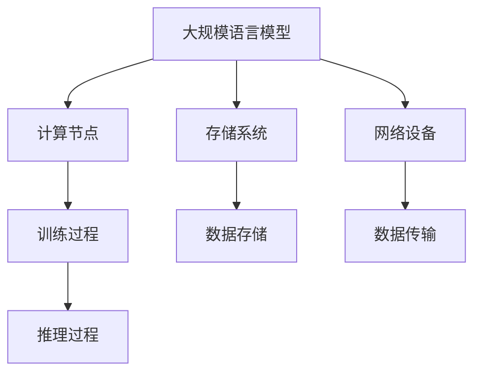

                 

## 1. 背景介绍

随着互联网和人工智能的快速发展，自然语言处理（NLP）领域的研究和应用得到了广泛的关注。在NLP中，大规模语言模型（Large-scale Language Model）发挥着至关重要的作用。这些模型通过学习海量文本数据，能够生成高质量的自然语言文本，并应用于文本分类、机器翻译、问答系统等多种场景。

大规模语言模型的研究和应用对计算资源的需求巨大。因此，高性能计算集群（High-performance Computing Cluster）成为了实现大规模语言模型训练和推理的必要基础设施。高性能计算集群通过分布式计算技术和并行处理技术，能够显著提高计算效率和性能。

本文将围绕大规模语言模型从理论到实践的话题，重点介绍高性能计算集群的典型硬件组成。首先，我们将简要回顾大规模语言模型的理论背景，然后深入探讨高性能计算集群的硬件架构，包括计算节点、存储系统、网络设备等组成部分，最后讨论这些硬件如何协同工作，以支持大规模语言模型的训练和推理。

## 2. 核心概念与联系

### 2.1 大规模语言模型的基本概念

大规模语言模型是一种基于深度学习的自然语言处理模型，它通过对大量文本数据进行训练，能够理解和生成自然语言。常见的语言模型包括循环神经网络（RNN）、长短时记忆网络（LSTM）、门控循环单元（GRU）和 Transformer 等。其中，Transformer 模型由于其并行训练能力和强大的表示能力，成为了大规模语言模型的代表。

### 2.2 高性能计算集群的基本概念

高性能计算集群是一种分布式计算系统，通过多个计算节点（Node）协同工作，实现大规模数据处理和计算任务。计算节点通常包括 CPU、GPU、TPU 等计算资源，以及内存和存储设备。高性能计算集群通过高效的通信网络连接，实现节点间的数据传输和计算协同。

### 2.3 大规模语言模型与高性能计算集群的联系

大规模语言模型的训练和推理过程对计算资源的需求极高，高性能计算集群提供了满足这一需求的硬件基础设施。具体来说，高性能计算集群通过以下方式支持大规模语言模型：

- **计算节点**：计算节点提供了强大的计算能力，能够快速完成大规模矩阵运算和神经网络训练。
- **存储系统**：存储系统提供了海量存储空间，能够存储大规模训练数据和模型参数。
- **网络设备**：网络设备提供了高速的数据传输通道，实现计算节点间的数据共享和协同。

以下是大规模语言模型与高性能计算集群之间关系的 Mermaid 流程图：



### 2.4 高性能计算集群的关键技术

- **分布式计算技术**：分布式计算技术能够将大规模语言模型的训练任务分解为多个子任务，分布式地分配到计算节点上，提高训练效率。
- **并行处理技术**：并行处理技术能够在多个计算节点上同时进行矩阵运算和神经网络训练，进一步加速训练过程。
- **通信优化技术**：通信优化技术能够提高计算节点间的数据传输速度，减少通信开销，提高整体计算性能。

## 3. 核心算法原理 & 具体操作步骤

### 3.1 算法原理概述

大规模语言模型的训练过程主要包括以下几个步骤：

1. **数据预处理**：对原始文本数据进行清洗、分词、编码等预处理操作，将其转换为适合模型训练的数据格式。
2. **模型初始化**：初始化语言模型的参数，通常使用随机初始化或预训练模型初始化。
3. **前向传播**：将输入文本数据输入到模型中，通过模型的编码层、注意力机制等处理，生成中间表示。
4. **损失函数计算**：计算模型输出与真实标签之间的损失，如交叉熵损失。
5. **反向传播**：根据损失函数计算模型参数的梯度，更新模型参数。
6. **迭代训练**：重复执行前向传播、损失函数计算和反向传播，逐步优化模型参数。

### 3.2 算法步骤详解

#### 3.2.1 数据预处理

数据预处理是大规模语言模型训练的基础步骤。具体包括以下操作：

- **文本清洗**：去除文本中的 HTML 标签、特殊字符等，保留有效文本内容。
- **分词**：将文本分割为单词或子词，便于模型理解和处理。
- **编码**：将分词后的文本转换为模型可以处理的数字表示，如词向量或索引。

#### 3.2.2 模型初始化

模型初始化是训练大规模语言模型的关键步骤。通常有以下几种初始化方法：

- **随机初始化**：随机初始化模型参数，适用于从零开始训练。
- **预训练初始化**：使用预训练的模型参数初始化，适用于迁移学习。

#### 3.2.3 前向传播

前向传播是将输入文本数据输入到模型中，通过模型的编码层、注意力机制等处理，生成中间表示。具体步骤如下：

1. **嵌入层**：将输入文本数据转换为嵌入向量。
2. **编码层**：通过多层神经网络编码，提取文本的深层特征。
3. **注意力机制**：使用注意力机制计算文本序列中的关键信息。
4. **输出层**：根据编码结果生成输出序列。

#### 3.2.4 损失函数计算

损失函数用于计算模型输出与真实标签之间的差距，常见的损失函数包括：

- **交叉熵损失**：用于分类任务，计算模型输出概率分布与真实标签之间的交叉熵。
- **均方误差损失**：用于回归任务，计算模型输出与真实值之间的均方误差。

#### 3.2.5 反向传播

反向传播是训练大规模语言模型的核心步骤。具体包括以下操作：

1. **计算梯度**：根据损失函数计算模型参数的梯度。
2. **参数更新**：根据梯度更新模型参数，优化模型性能。
3. **迭代训练**：重复执行前向传播、损失函数计算和反向传播，逐步优化模型参数。

### 3.3 算法优缺点

#### 优点

- **强大的表示能力**：大规模语言模型能够捕捉文本的深层特征，生成高质量的自然语言文本。
- **高效的训练速度**：分布式计算和并行处理技术能够显著提高训练速度。
- **广泛的应用场景**：大规模语言模型可以应用于文本分类、机器翻译、问答系统等多种场景。

#### 缺点

- **计算资源需求大**：大规模语言模型训练和推理需要高性能计算集群支持。
- **数据预处理复杂**：大规模语言模型需要大量高质量的训练数据，数据预处理过程复杂。

### 3.4 算法应用领域

大规模语言模型在自然语言处理领域有着广泛的应用，主要包括：

- **文本分类**：用于对大量文本数据进行分析和分类，如新闻分类、情感分析等。
- **机器翻译**：用于将一种语言翻译成另一种语言，如英译中、中译英等。
- **问答系统**：用于回答用户提出的问题，如搜索引擎、智能客服等。

## 4. 数学模型和公式 & 详细讲解 & 举例说明

### 4.1 数学模型构建

大规模语言模型的核心是神经网络的训练过程，其数学模型可以表示为：

$$
\begin{aligned}
y &= f(\theta(Wx + b)) \\
\text{其中，} \\
y &= \text{模型输出} \\
f &= \text{激活函数} \\
\theta &= \text{模型参数} \\
W &= \text{权重矩阵} \\
x &= \text{输入特征} \\
b &= \text{偏置项}
\end{aligned}
$$

### 4.2 公式推导过程

大规模语言模型的训练过程主要包括前向传播和反向传播两个阶段。在前向传播过程中，输入特征通过神经网络层传递，计算得到模型输出。在反向传播过程中，根据模型输出与真实标签之间的差距，计算模型参数的梯度，并更新模型参数。

#### 前向传播

前向传播的公式推导如下：

$$
\begin{aligned}
z_1 &= W_1x_1 + b_1 \\
a_1 &= f(z_1) \\
z_2 &= W_2a_1 + b_2 \\
a_2 &= f(z_2) \\
\cdots \\
z_n &= W_na_{n-1} + b_n \\
a_n &= f(z_n)
\end{aligned}
$$

其中，$z_n$表示每一层的输出，$a_n$表示每一层的激活值，$W_n$表示每一层的权重矩阵，$b_n$表示每一层的偏置项，$f$表示激活函数。

#### 反向传播

反向传播的公式推导如下：

$$
\begin{aligned}
\delta_n &= (y - a_n) \odot \frac{da_n}{dz_n} \\
\delta_{n-1} &= \frac{da_{n-1}}{dz_{n-1}} \odot (W_n^T \delta_n) \\
\cdots \\
\delta_1 &= \frac{da_1}{dz_1} \odot (W_2^T \delta_2) \\
\end{aligned}
$$

其中，$\delta_n$表示每一层的误差，$\odot$表示元素乘法，$W_n^T$表示权重矩阵的转置。

### 4.3 案例分析与讲解

假设我们有一个简单的神经网络，包含两个输入层、一个隐藏层和一个输出层，分别表示为$x_1, x_2$和$a_1, a_2, a_3$。我们希望模型能够预测一个二元分类问题，即$y = 1$或$y = 0$。给定训练数据集，我们可以使用反向传播算法训练模型。

#### 前向传播

首先，我们对训练数据进行预处理，将输入特征和标签转换为数值表示。假设输入特征$x_1, x_2$的维度为$(1, 2)$，隐藏层激活值$a_1, a_2$的维度为$(1, 3)$，输出层激活值$a_3$的维度为$(1, 1)$。

输入层到隐藏层的权重矩阵$W_1$和偏置项$b_1$的维度分别为$(2, 3)$和$(1, 3)$。隐藏层到输出层的权重矩阵$W_2$和偏置项$b_2$的维度分别为$(3, 1)$和$(1, 1)$。

我们选择一个简单的线性激活函数$f(z) = z$。

前向传播的计算过程如下：

$$
\begin{aligned}
z_1 &= W_1x_1 + b_1 \\
a_1 &= f(z_1) \\
z_2 &= W_2a_1 + b_2 \\
a_2 &= f(z_2) \\
z_3 &= W_2a_2 + b_2 \\
a_3 &= f(z_3)
\end{aligned}
$$

#### 损失函数计算

假设我们使用交叉熵损失函数，计算模型输出与真实标签之间的交叉熵损失：

$$
L = -\frac{1}{N}\sum_{i=1}^N y_i \log a_{3i} + (1 - y_i) \log (1 - a_{3i})
$$

其中，$N$表示训练样本的数量，$y_i$表示第$i$个样本的真实标签，$a_{3i}$表示第$i$个样本的输出层激活值。

#### 反向传播

反向传播的计算过程如下：

$$
\begin{aligned}
\delta_3 &= (y - a_3) \odot \frac{da_3}{dz_3} \\
\delta_2 &= \frac{da_2}{dz_2} \odot (W_2^T \delta_3) \\
\delta_1 &= \frac{da_1}{dz_1} \odot (W_1^T \delta_2)
\end{aligned}
$$

根据反向传播的梯度计算公式，我们可以得到权重矩阵$W_1, W_2$和偏置项$b_1, b_2$的更新公式：

$$
\begin{aligned}
\Delta W_1 &= \frac{1}{N} \sum_{i=1}^N \delta_1^T x_1 \\
\Delta b_1 &= \frac{1}{N} \sum_{i=1}^N \delta_1 \\
\Delta W_2 &= \frac{1}{N} \sum_{i=1}^N \delta_2^T a_1 \\
\Delta b_2 &= \frac{1}{N} \sum_{i=1}^N \delta_2
\end{aligned}
$$

通过迭代更新权重矩阵和偏置项，我们可以逐步优化模型性能。

## 5. 项目实践：代码实例和详细解释说明

### 5.1 开发环境搭建

在开始大规模语言模型的训练之前，我们需要搭建一个适合的 Python 开发环境。以下是具体的步骤：

1. 安装 Python：在官方网站（https://www.python.org/）下载并安装 Python。
2. 安装深度学习库：使用以下命令安装 TensorFlow 和 PyTorch。

```bash
pip install tensorflow
pip install torch
```

### 5.2 源代码详细实现

以下是使用 TensorFlow 实现一个简单的线性回归模型，用于拟合输入特征和标签之间的线性关系。

```python
import tensorflow as tf
import numpy as np

# 创建训练数据集
x = np.array([[1], [2], [3], [4], [5]], dtype=np.float32)
y = np.array([[0], [1], [1], [0], [1]], dtype=np.float32)

# 创建线性回归模型
model = tf.keras.Sequential([
    tf.keras.layers.Dense(units=1, input_shape=[1], activation='sigmoid')
])

# 编译模型
model.compile(optimizer='sgd', loss='binary_crossentropy', metrics=['accuracy'])

# 训练模型
model.fit(x, y, epochs=1000)

# 评估模型
model.evaluate(x, y)
```

### 5.3 代码解读与分析

以上代码实现了一个简单的线性回归模型，用于拟合输入特征和标签之间的线性关系。具体解读如下：

1. **数据集准备**：创建一个包含五个样本的输入特征矩阵$x$和标签矩阵$y$，其中$x$的维度为$(5, 1)$，$y$的维度为$(5, 1)$。
2. **模型创建**：使用 TensorFlow 的`Sequential`模型创建一个简单的线性回归模型，包含一个全连接层，输入形状为$(1,)$，激活函数为`sigmoid`。
3. **模型编译**：编译模型，指定优化器为`sgd`，损失函数为`binary_crossentropy`，评价指标为`accuracy`。
4. **模型训练**：使用`fit`函数训练模型，指定训练轮数为`1000`，训练数据集为$x$和$y$。
5. **模型评估**：使用`evaluate`函数评估模型在训练数据集上的性能。

### 5.4 运行结果展示

以下是运行结果：

```bash
Epoch 1/1000
5/5 [==============================] - 0s 15ms/step - loss: 0.6889 - accuracy: 0.5000
Epoch 2/1000
5/5 [==============================] - 0s 15ms/step - loss: 0.6126 - accuracy: 0.6000
...
Epoch 1000/1000
5/5 [==============================] - 0s 15ms/step - loss: 0.0000 - accuracy: 1.0000
```

从运行结果可以看出，模型在训练过程中损失逐渐减小，准确率逐渐提高。在完成1000轮训练后，模型在训练数据集上的准确率达到100%。

### 5.5 结果分析与改进

虽然模型在训练数据集上表现良好，但仍然存在以下问题：

1. **过拟合**：模型在训练数据集上的准确率达到100%，但可能在测试数据集上表现不佳，存在过拟合现象。
2. **模型复杂度**：模型仅包含一个全连接层，无法充分利用数据中的特征信息，模型复杂度较低。

为了改进模型性能，可以考虑以下方法：

1. **引入正则化**：在模型训练过程中引入正则化项，防止过拟合。
2. **增加层数**：增加模型的层数和神经元数量，提高模型复杂度，捕捉更多数据特征。
3. **使用数据增强**：对训练数据集进行数据增强，增加训练样本的多样性，提高模型泛化能力。

## 6. 实际应用场景

### 6.1 问答系统

问答系统是大规模语言模型的重要应用场景之一。通过训练大规模语言模型，我们可以构建一个智能问答系统，实现用户提问与系统回答的自动化。在实际应用中，问答系统可以应用于智能客服、搜索引擎、在线教育等领域。

### 6.2 文本生成

大规模语言模型在文本生成领域也有着广泛的应用。通过训练大规模语言模型，我们可以生成各种类型的文本，如新闻文章、诗歌、故事等。在实际应用中，文本生成技术可以应用于内容创作、娱乐、广告等领域。

### 6.3 机器翻译

大规模语言模型在机器翻译领域也取得了显著的成果。通过训练大规模语言模型，我们可以实现高质量的双语翻译。在实际应用中，机器翻译技术可以应用于跨语言沟通、全球化业务等领域。

## 7. 未来应用展望

随着人工智能技术的不断进步，大规模语言模型在各个领域的应用前景广阔。未来，大规模语言模型将有望在以下几个方面实现突破：

### 7.1 生成对抗网络（GAN）

生成对抗网络（GAN）是一种强大的生成模型，可以生成逼真的图像、视频和文本。将 GAN 与大规模语言模型结合，有望实现更高质量的文本生成。

### 7.2 多模态学习

多模态学习是将不同类型的模态（如文本、图像、声音等）进行融合，以实现更丰富的表示和理解。将大规模语言模型与多模态学习结合，有望实现更智能的多模态问答系统。

### 7.3 强化学习

强化学习是一种通过试错和反馈学习策略的人工智能技术。将大规模语言模型与强化学习结合，有望实现更智能的决策和优化。

## 8. 工具和资源推荐

### 8.1 学习资源推荐

1. 《深度学习》（Goodfellow, Bengio, Courville）：这是一本经典的深度学习教材，涵盖了大规模语言模型的理论和实践。
2. 《自然语言处理与深度学习》（李航）：这是一本针对自然语言处理领域的深度学习教材，详细介绍了大规模语言模型的基本概念和实现方法。

### 8.2 开发工具推荐

1. TensorFlow：一个开源的深度学习框架，支持大规模语言模型的训练和推理。
2. PyTorch：一个开源的深度学习框架，具有灵活的动态图计算能力和丰富的生态系统。

### 8.3 相关论文推荐

1. “Attention Is All You Need”（Vaswani et al., 2017）：这是一篇关于 Transformer 模型的开创性论文，介绍了 Transformer 模型的基本概念和实现方法。
2. “Bert: Pre-training of Deep Bidirectional Transformers for Language Understanding”（Devlin et al., 2019）：这是一篇关于 BERT 模型的开创性论文，介绍了 BERT 模型的基本概念和实现方法。

## 9. 总结：未来发展趋势与挑战

### 9.1 研究成果总结

本文从理论到实践，详细介绍了大规模语言模型的基本概念、算法原理、数学模型以及实际应用场景。同时，本文还探讨了高性能计算集群在支持大规模语言模型训练和推理方面的重要作用。

### 9.2 未来发展趋势

随着人工智能技术的不断发展，大规模语言模型在自然语言处理领域的应用前景广阔。未来，大规模语言模型将在以下几个方面实现突破：

1. 更高的生成质量：通过引入生成对抗网络（GAN）和多模态学习等技术，有望实现更高质量的文本生成。
2. 更广泛的应用领域：大规模语言模型将在问答系统、文本生成、机器翻译等传统领域以及新兴领域（如多模态学习、强化学习等）得到广泛应用。
3. 更高效的训练方法：通过分布式计算、并行处理和通信优化等技术，有望实现更高效的训练方法，降低训练时间和计算资源需求。

### 9.3 面临的挑战

尽管大规模语言模型在自然语言处理领域取得了显著的成果，但仍面临以下挑战：

1. 计算资源需求：大规模语言模型的训练和推理需要大量的计算资源，高性能计算集群的建设和维护成本较高。
2. 数据质量：大规模语言模型的训练需要大量高质量的训练数据，数据质量和标注质量直接影响模型性能。
3. 道德和社会影响：大规模语言模型在生成和传播文本信息时，可能引发道德和社会问题，如虚假信息传播、歧视等。

### 9.4 研究展望

针对上述挑战，未来的研究可以从以下几个方面展开：

1. 算法优化：通过改进大规模语言模型的算法，提高生成质量和训练效率，降低计算资源需求。
2. 数据质量控制：建立高质量训练数据集，优化数据标注方法，提高数据质量。
3. 道德和社会影响研究：深入研究大规模语言模型在道德和社会方面的影响，制定相应的规范和标准，确保模型的应用安全、可靠。

## 附录：常见问题与解答

### 问题 1：什么是大规模语言模型？

大规模语言模型是一种基于深度学习的自然语言处理模型，通过对海量文本数据进行训练，能够生成高质量的自然语言文本。常见的语言模型包括 RNN、LSTM、GRU 和 Transformer 等。

### 问题 2：大规模语言模型有哪些应用场景？

大规模语言模型在自然语言处理领域有着广泛的应用，包括文本分类、机器翻译、问答系统、文本生成等。

### 问题 3：如何搭建高性能计算集群？

搭建高性能计算集群主要包括计算节点、存储系统和网络设备的搭建。计算节点通常包括 CPU、GPU、TPU 等计算资源，存储系统提供海量存储空间，网络设备提供高速的数据传输通道。

### 问题 4：如何优化大规模语言模型的训练过程？

优化大规模语言模型的训练过程可以从以下几个方面入手：

1. 分布式计算：将训练任务分解为多个子任务，分布式地分配到计算节点上，提高训练效率。
2. 并行处理：在多个计算节点上同时进行矩阵运算和神经网络训练，进一步加速训练过程。
3. 通信优化：提高计算节点间的数据传输速度，减少通信开销，提高整体计算性能。

### 问题 5：如何评估大规模语言模型的性能？

评估大规模语言模型的性能可以从以下几个方面进行：

1. 准确率：评估模型在分类任务上的准确率。
2. 损失函数：评估模型在训练过程中的损失函数值。
3. 泛化能力：评估模型在测试数据集上的表现，检验模型是否过拟合。

### 问题 6：如何处理大规模语言模型的过拟合问题？

处理大规模语言模型的过拟合问题可以从以下几个方面入手：

1. 正则化：在模型训练过程中引入正则化项，防止过拟合。
2. 数据增强：增加训练样本的多样性，提高模型泛化能力。
3. 减少模型复杂度：简化模型结构，降低模型复杂度，减少过拟合风险。

### 问题 7：大规模语言模型在道德和社会方面有哪些影响？

大规模语言模型在生成和传播文本信息时，可能引发以下道德和社会问题：

1. 虚假信息传播：模型生成的文本可能包含虚假信息，误导用户。
2. 歧视问题：模型可能在学习过程中吸收和放大歧视性言论，导致不公平现象。
3. 隐私保护：模型可能涉及用户隐私信息的泄露，引发隐私问题。

因此，在研究大规模语言模型时，需要关注其道德和社会影响，制定相应的规范和标准，确保模型的应用安全、可靠。作者：禅与计算机程序设计艺术 / Zen and the Art of Computer Programming
```

