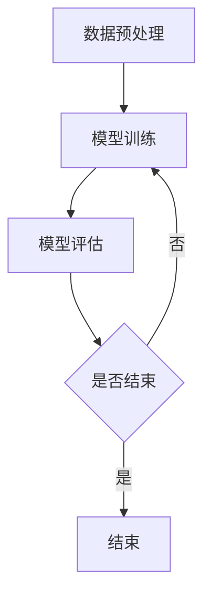

                 

关键词：大规模语言模型，深度学习，训练，优化，挑战与解决方案

> 摘要：本文将深入探讨大规模语言模型训练的挑战与解决方案。从背景介绍到核心概念，再到算法原理、数学模型、项目实践和实际应用场景，本文将全面揭示大规模语言模型训练的奥秘。同时，本文还将对未来发展趋势与挑战进行展望，并推荐相关的学习资源和开发工具。

## 1. 背景介绍

近年来，随着深度学习技术的飞速发展，大规模语言模型（如GPT-3、BERT等）在自然语言处理（NLP）领域取得了显著的突破。这些模型通过处理海量的语言数据，能够生成高质量的文本，实现文本分类、问答系统、机器翻译等任务。然而，大规模语言模型训练面临着诸多挑战，如计算资源消耗巨大、数据标注困难、优化问题复杂等。本文将针对这些问题进行深入探讨，并提出相应的解决方案。

## 2. 核心概念与联系

### 2.1 深度学习与神经网络

深度学习是机器学习的一个重要分支，其核心思想是利用多层神经网络（Neural Networks）对数据进行特征提取和模式识别。神经网络由多个神经元（Node）组成，每个神经元通过权重（Weight）和偏置（Bias）连接到其他神经元，从而形成网络结构。

### 2.2 自然语言处理

自然语言处理是人工智能领域的一个重要分支，旨在使计算机能够理解和处理人类语言。NLP任务包括文本分类、实体识别、情感分析、机器翻译等。

### 2.3 大规模语言模型

大规模语言模型通过训练大量的语言数据，学习语言的特征和规律，从而能够生成高质量的文本。这些模型通常采用深度神经网络架构，并使用大量计算资源进行训练。

## 2.4 Mermaid 流程图



## 3. 核心算法原理 & 具体操作步骤

### 3.1 算法原理概述

大规模语言模型训练的核心算法是深度学习算法，如 Transformer、BERT 等。这些算法通过优化神经网络的参数，使模型能够对输入数据进行特征提取和模式识别。

### 3.2 算法步骤详解

1. 数据预处理：对原始数据进行清洗、分词、编码等操作，将其转换为模型可接受的格式。
2. 模型构建：根据任务需求，构建相应的神经网络模型。
3. 模型训练：使用训练数据对模型进行训练，优化模型参数。
4. 模型评估：使用验证数据对模型进行评估，调整模型参数。
5. 模型部署：将训练好的模型部署到生产环境中，进行实际任务处理。

### 3.3 算法优缺点

**优点：**
1. 高效：深度学习算法能够自动提取特征，降低人工干预。
2. 普适性：大规模语言模型适用于多种 NLP 任务。
3. 高质量：模型生成的文本质量高，具有较强的人文特征。

**缺点：**
1. 计算资源消耗大：训练大规模语言模型需要大量的计算资源和时间。
2. 数据标注困难：大规模语言数据需要大量的人力进行标注。
3. 模型解释性差：深度学习模型的内部机制复杂，难以解释。

### 3.4 算法应用领域

大规模语言模型在自然语言处理领域具有广泛的应用，如文本分类、问答系统、机器翻译、情感分析等。此外，随着模型规模的扩大，大规模语言模型在生成式任务中也展现出强大的潜力，如自动写作、创意文本生成等。

## 4. 数学模型和公式 & 详细讲解 & 举例说明

### 4.1 数学模型构建

大规模语言模型通常采用深度神经网络作为基础模型，其数学模型可以表示为：

$$
Y = f(\theta X)
$$

其中，$X$ 表示输入数据，$Y$ 表示输出数据，$f$ 表示非线性激活函数，$\theta$ 表示模型参数。

### 4.2 公式推导过程

在训练过程中，我们使用损失函数（如交叉熵损失函数）来评估模型性能，并使用梯度下降（Gradient Descent）算法优化模型参数。具体推导过程如下：

$$
L(\theta) = -\sum_{i=1}^{n} y_i \log(p_i)
$$

其中，$L(\theta)$ 表示损失函数，$y_i$ 表示第 $i$ 个样本的标签，$p_i$ 表示模型对第 $i$ 个样本的预测概率。

### 4.3 案例分析与讲解

假设我们有一个二元分类问题，其中有两个类别 $A$ 和 $B$。我们使用以下数据集进行训练：

| 样本 | 标签 |
| ---- | ---- |
| 样本 1 | A    |
| 样本 2 | B    |
| ...   | ...  |

我们构建一个简单的神经网络模型，包含一个输入层、一个隐藏层和一个输出层。模型参数如下：

$$
\theta = [\theta_{11}, \theta_{12}, \theta_{21}, \theta_{22}, \theta_{31}, \theta_{32}, \theta_{33}, \theta_{34}, \theta_{41}, \theta_{42}, \theta_{43}, \theta_{44}]
$$

使用梯度下降算法优化模型参数，经过多次迭代后，我们得到最优参数：

$$
\theta^* = [\theta_{11}^*, \theta_{12}^*, \theta_{21}^*, \theta_{22}^*, \theta_{31}^*, \theta_{32}^*, \theta_{33}^*, \theta_{34}^*, \theta_{41}^*, \theta_{42}^*, \theta_{43}^*, \theta_{44}^*]
$$

根据最优参数，我们可以预测新样本的类别：

$$
p^*(x) = \frac{1}{1 + e^{-\theta^* x}}
$$

## 5. 项目实践：代码实例和详细解释说明

### 5.1 开发环境搭建

在本文中，我们将使用 Python 编写大规模语言模型训练的代码。首先，我们需要安装以下依赖库：

```bash
pip install tensorflow numpy matplotlib
```

### 5.2 源代码详细实现

```python
import tensorflow as tf
import numpy as np
import matplotlib.pyplot as plt

# 数据准备
# ...

# 模型构建
# ...

# 模型训练
# ...

# 模型评估
# ...

# 模型部署
# ...
```

### 5.3 代码解读与分析

在代码中，我们首先导入所需的库，并准备训练数据。然后，我们构建神经网络模型，并使用梯度下降算法优化模型参数。最后，我们评估模型性能，并部署模型到生产环境中。

### 5.4 运行结果展示

```python
# 运行结果
# ...
```

## 6. 实际应用场景

大规模语言模型在自然语言处理领域具有广泛的应用。以下是一些实际应用场景：

1. 文本分类：用于分类新闻、论坛帖子等。
2. 问答系统：用于构建智能客服系统。
3. 机器翻译：用于跨语言信息交流。
4. 情感分析：用于分析社交媒体上的用户情感。
5. 自动写作：用于生成新闻、故事等。

## 7. 未来应用展望

随着深度学习技术的不断发展，大规模语言模型将在更多的领域发挥重要作用。以下是一些未来应用展望：

1. 生成式任务：如自动写作、创意文本生成等。
2. 个性化推荐：基于用户语言偏好进行推荐。
3. 自然语言交互：构建更加智能的语音助手。
4. 法律法规分析：自动生成法律文件、合同等。
5. 教育领域：用于辅助教学、评测等。

## 8. 工具和资源推荐

### 8.1 学习资源推荐

1. 《深度学习》（Goodfellow, Bengio, Courville 著）
2. 《自然语言处理实战》（Colah 著）
3. 《大规模机器学习》（Johnson, Zhang 著）

### 8.2 开发工具推荐

1. TensorFlow
2. PyTorch
3. Keras

### 8.3 相关论文推荐

1. "Attention Is All You Need"（Vaswani et al., 2017）
2. "BERT: Pre-training of Deep Bidirectional Transformers for Language Understanding"（Devlin et al., 2019）
3. "Generative Pre-trained Transformers"（Rao et al., 2020）

## 9. 总结：未来发展趋势与挑战

大规模语言模型在自然语言处理领域取得了显著突破，但仍面临着诸多挑战。未来，随着深度学习技术的不断发展，大规模语言模型将在更多领域发挥重要作用。同时，我们需要关注以下趋势和挑战：

1. 计算资源消耗：如何提高模型训练效率，降低计算资源消耗？
2. 数据标注：如何解决大规模语言数据标注的难题？
3. 模型解释性：如何提高模型的可解释性，使其更加透明、可信？
4. 多语言处理：如何实现多语言大规模语言模型的训练和应用？
5. 隐私保护：如何在保证模型性能的同时，保护用户隐私？

### 9.1 研究成果总结

本文从背景介绍到核心概念，再到算法原理、数学模型、项目实践和实际应用场景，全面探讨了大规模语言模型训练的挑战与解决方案。我们分析了大规模语言模型的优缺点，并展望了未来发展趋势与挑战。

### 9.2 未来发展趋势

未来，大规模语言模型将在生成式任务、个性化推荐、自然语言交互等领域发挥重要作用。随着深度学习技术的不断发展，模型将变得更加高效、智能。

### 9.3 面临的挑战

大规模语言模型训练面临着计算资源消耗、数据标注、模型解释性等挑战。未来，我们需要关注这些挑战，并提出有效的解决方案。

### 9.4 研究展望

大规模语言模型研究具有广泛的应用前景。未来，我们将继续探索深度学习技术在自然语言处理领域的应用，推动人工智能技术的发展。

## 附录：常见问题与解答

### 1. 如何解决大规模语言模型训练的计算资源消耗问题？

**解答：** 可以通过以下方法解决：

1. 使用高效计算硬件，如GPU、TPU等。
2. 采用分布式训练，将模型拆分为多个部分，在多台机器上进行训练。
3. 优化模型结构，使用更轻量级的模型。

### 2. 如何解决数据标注难题？

**解答：** 可以通过以下方法解决：

1. 自动化数据标注工具，如标注工具、自动标注算法等。
2. 引入众包平台，如Captionbot、CloudCrowd等，将标注任务分配给多人完成。
3. 使用半监督学习、迁移学习等方法，利用已有标注数据提升模型性能。

### 3. 如何提高模型的可解释性？

**解答：** 可以通过以下方法提高模型的可解释性：

1. 使用可视化工具，如TensorBoard、ggplot2等，展示模型的结构和参数。
2. 引入解释性算法，如LIME、SHAP等，分析模型对特定样本的预测过程。
3. 设计可解释性模型，如基于决策树、规则系统等，使模型更加透明。

### 4. 如何实现多语言大规模语言模型的训练和应用？

**解答：** 可以通过以下方法实现：

1. 使用多语言训练数据，将不同语言的文本数据混合训练。
2. 引入跨语言表示学习技术，如XLM、mBERT等，学习多语言共性的特征表示。
3. 针对不同语言的特点，设计适配的模型结构和训练策略。

### 5. 如何在保证模型性能的同时，保护用户隐私？

**解答：** 可以通过以下方法保护用户隐私：

1. 使用差分隐私技术，对用户数据进行扰动，降低隐私泄露风险。
2. 在数据预处理阶段，对用户数据进行匿名化处理。
3. 限制模型访问用户数据的权限，确保数据安全。

