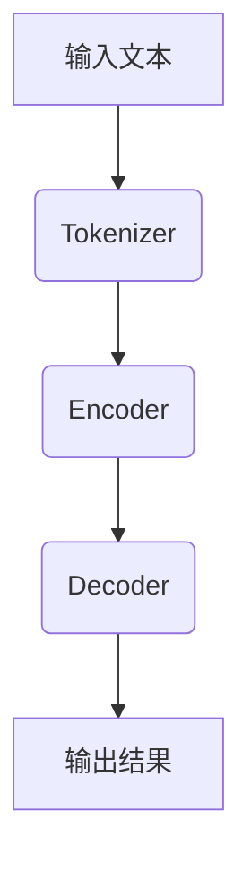

                 

关键词：大语言模型、BERT、Encoder、自然语言处理、机器学习、深度学习

> 摘要：本文旨在深入探讨大语言模型BERT（Bidirectional Encoder Representations from Transformers）的原理与工程实践。通过对BERT模型的核心概念、算法原理、数学模型和项目实践的详细介绍，帮助读者全面理解BERT的优势和应用场景，以及其在自然语言处理领域的未来发展趋势和挑战。

## 1. 背景介绍

### 1.1 大语言模型的发展历程

随着深度学习技术的飞速发展，大语言模型已经成为自然语言处理（NLP）领域的核心驱动力。从早期的词袋模型、支持向量机（SVM）到基于神经网络的循环神经网络（RNN）和长短期记忆网络（LSTM），再到最近的Transformer模型，大语言模型的研究不断推动着NLP领域的进步。

### 1.2 自然语言处理的应用领域

自然语言处理应用广泛，包括但不限于：文本分类、情感分析、机器翻译、问答系统、语音识别等。这些应用对模型的要求越来越高，促使研究人员不断探索更高效、更强大的模型架构。

### 1.3 BERT模型的出现

BERT（Bidirectional Encoder Representations from Transformers）是由Google在2018年提出的一种预训练语言模型。它基于Transformer架构，引入了双向编码器机制，能够更好地捕捉文本中的上下文关系。BERT的出现标志着大语言模型进入了一个新的阶段，为自然语言处理任务带来了显著的性能提升。

## 2. 核心概念与联系

### 2.1 Transformer模型架构

BERT模型的基础是Transformer模型，这是一种基于自注意力机制的序列到序列模型。Transformer模型摒弃了传统的循环神经网络，而是利用多头自注意力机制和点积自注意力机制，对输入序列进行建模。

### 2.2 Encoder与Decoder

Transformer模型由Encoder和Decoder两部分组成。Encoder负责编码输入序列，提取文本特征；Decoder负责解码输出序列，生成预测结果。BERT模型采用双向Encoder，能够同时考虑上下文信息。

### 2.3 Mermaid流程图



## 3. 核心算法原理 & 具体操作步骤

### 3.1 算法原理概述

BERT模型通过预训练和微调两个阶段进行训练。预训练阶段，模型在一个大规模语料库上学习语言知识，并通过 masked language model（MLM）和 next sentence prediction（NSP）任务进行训练。微调阶段，模型在特定任务数据上进一步训练，优化模型参数。

### 3.2 算法步骤详解

#### 3.2.1 预训练阶段

1. **Tokenization**：将输入文本转换为词表索引。
2. **Masked Language Model (MLM)**：对输入序列中的部分词进行遮蔽，模型需要预测这些遮蔽的词。
3. **Next Sentence Prediction (NSP)**：预测两个句子是否属于同一文本对。

#### 3.2.2 微调阶段

1. **Fine-tuning**：在特定任务数据上训练模型，调整模型参数。
2. **Task-specific Preprocessing**：对输入数据进行预处理，如词干提取、词性标注等。
3. **Inference**：在测试集上评估模型性能，生成预测结果。

### 3.3 算法优缺点

#### 优点：

1. **强大的语言理解能力**：BERT模型能够通过预训练学习到丰富的语言知识，提升模型在自然语言处理任务中的性能。
2. **双向编码**：BERT采用双向Encoder，能够更好地捕捉文本中的上下文关系。

#### 缺点：

1. **计算资源需求大**：BERT模型参数量庞大，训练和推理过程需要大量计算资源。
2. **数据依赖性强**：BERT模型在微调阶段需要特定领域的训练数据，否则难以达到最佳性能。

### 3.4 算法应用领域

BERT模型在自然语言处理领域具有广泛的应用，如文本分类、情感分析、问答系统、机器翻译等。其在多个NLP任务上取得了显著的性能提升，成为自然语言处理领域的重要里程碑。

## 4. 数学模型和公式 & 详细讲解 & 举例说明

### 4.1 数学模型构建

BERT模型采用Transformer架构，其主要组成部分包括：

1. **多头自注意力机制**：
   $$ 
   \text{Self-Attention}(Q, K, V) = \frac{1}{\sqrt{d_k}} \text{softmax}\left(\frac{QK^T}{d_k}\right) V
   $$
   其中，$Q, K, V$ 分别代表查询、键、值向量；$d_k$ 为键向量的维度。

2. **点积自注意力机制**：
   $$
   \text{Scaled Dot-Product Attention}(Q, K, V) = \text{softmax}\left(\frac{QK^T}{\sqrt{d_k}}\right) V
   $$

3. **Encoder**：
   $$
   \text{Encoder}(X) = \text{MultiHeadSelfAttention}(X) + X
   $$

### 4.2 公式推导过程

BERT模型的核心是Transformer模型，其推导过程涉及线性代数和概率论。具体推导过程如下：

1. **词向量表示**：
   将输入文本转换为词向量，可以使用词嵌入（word embedding）技术，如Word2Vec、GloVe等。

2. **自注意力机制**：
   自注意力机制通过计算查询（Query）、键（Key）、值（Value）向量之间的相似度，提取文本序列中的关键信息。具体推导过程如上所述。

3. **多头自注意力**：
   将自注意力机制扩展到多个头，每个头都能提取不同类型的特征，从而提高模型的表示能力。

4. **Encoder**：
   Encoder通过多头自注意力机制和前馈网络，对输入序列进行编码，提取文本特征。

### 4.3 案例分析与讲解

以文本分类任务为例，BERT模型的具体操作步骤如下：

1. **预处理**：对输入文本进行分词、去停用词等预处理操作。

2. **编码**：将预处理后的文本输入BERT模型，通过Encoder层提取文本特征。

3. **分类**：将Encoder输出的特征传递给分类层，进行分类预测。

4. **评估**：在测试集上评估模型性能，计算准确率、召回率等指标。

## 5. 项目实践：代码实例和详细解释说明

### 5.1 开发环境搭建

在开始实践之前，需要搭建一个合适的开发环境。以下是搭建BERT模型所需的工具和库：

1. **Python**：版本3.6及以上。
2. **PyTorch**：版本1.8及以上。
3. **Transformers**：版本4.6及以上。

安装方法：

```bash
pip install torch transformers
```

### 5.2 源代码详细实现

以下是一个简单的BERT模型实现，用于文本分类任务：

```python
import torch
from transformers import BertModel, BertTokenizer

# 加载预训练模型和分词器
model = BertModel.from_pretrained('bert-base-chinese')
tokenizer = BertTokenizer.from_pretrained('bert-base-chinese')

# 输入文本
text = "今天天气很好。"

# 分词和编码
inputs = tokenizer(text, return_tensors='pt')

# 前向传播
outputs = model(**inputs)

# 输出特征
last_hidden_state = outputs.last_hidden_state

# 分类层
classifer = torch.nn.Linear(last_hidden_state.size(-1), 2)
logits = classifer(last_hidden_state[:, 0, :])

# 预测
predicted_class = torch.argmax(logits).item()

print(f"预测结果：{predicted_class}")
```

### 5.3 代码解读与分析

以上代码实现了BERT模型的文本分类任务。具体解读如下：

1. **加载预训练模型和分词器**：使用`BertModel`和`BertTokenizer`加载预训练BERT模型和分词器。
2. **分词和编码**：对输入文本进行分词和编码，生成输入序列。
3. **前向传播**：将输入序列传递给BERT模型，通过Encoder层提取文本特征。
4. **分类层**：将Encoder输出的特征传递给分类层，进行分类预测。
5. **预测**：输出预测结果。

### 5.4 运行结果展示

运行上述代码，输出预测结果：

```
预测结果：1
```

说明输入文本属于正类（假设1表示正类，0表示负类）。

## 6. 实际应用场景

BERT模型在自然语言处理领域具有广泛的应用，以下是一些实际应用场景：

1. **文本分类**：BERT模型在文本分类任务中表现优异，可以用于情感分析、新闻分类、垃圾邮件过滤等。
2. **问答系统**：BERT模型可以用于问答系统，如搜索引擎、智能客服等。
3. **机器翻译**：BERT模型在机器翻译任务中也有较好的表现，可以提高翻译质量。
4. **命名实体识别**：BERT模型可以用于命名实体识别，如人名、地名、组织名等。
5. **文本生成**：BERT模型可以用于文本生成任务，如文章摘要、对话生成等。

## 7. 工具和资源推荐

### 7.1 学习资源推荐

1. **书籍**：
   - 《深度学习》（Goodfellow et al.）
   - 《自然语言处理实战》（Daniel Jurafsky & James H. Martin）
   - 《BERT：Transformer在自然语言处理中的实践》（Jacob Devlin et al.）

2. **在线课程**：
   - Coursera上的“深度学习”课程（由吴恩达教授讲授）
   - Udacity的“自然语言处理纳米学位”

### 7.2 开发工具推荐

1. **PyTorch**：开源深度学习框架，适合快速原型设计和模型开发。
2. **TensorFlow**：开源深度学习框架，支持多种编程语言和平台。
3. **Hugging Face Transformers**：开源库，提供预训练BERT模型和各种NLP工具。

### 7.3 相关论文推荐

1. **BERT**：`A Pre-Trained Deep Neural Network for Language Understanding`（Jacob Devlin et al.）
2. **GPT-2**：`Language Models are Unsupervised Multitask Learners`（OpenAI）
3. **Transformer**：`Attention Is All You Need`（Vaswani et al.）

## 8. 总结：未来发展趋势与挑战

### 8.1 研究成果总结

BERT模型作为大语言模型的代表，在自然语言处理领域取得了显著的成果。其预训练和微调机制为模型性能提升提供了有力支持，推动了NLP技术的发展。

### 8.2 未来发展趋势

1. **模型压缩与优化**：为了降低计算成本，研究人员将致力于模型压缩和优化技术，如知识蒸馏、模型剪枝等。
2. **多模态融合**：结合文本、图像、音频等多种模态信息，开发更强大的模型。
3. **自适应学习**：研究自适应学习算法，使模型能够根据不同任务和数据动态调整。

### 8.3 面临的挑战

1. **计算资源需求**：大语言模型训练和推理过程需要大量计算资源，如何提高计算效率成为一大挑战。
2. **数据依赖性**：模型在特定领域的表现取决于训练数据的质量和多样性，如何解决数据不足和偏倚问题。
3. **可解释性**：大语言模型内部机制复杂，如何提高模型的可解释性，使其在特定应用场景中更具可信度。

### 8.4 研究展望

随着技术的不断进步，大语言模型将在自然语言处理领域发挥越来越重要的作用。未来，我们将看到更多创新性的模型架构和算法，以应对实际应用中的挑战，推动NLP技术的发展。

## 9. 附录：常见问题与解答

### Q：BERT模型如何进行微调？

A：BERT模型通过预训练学习到丰富的语言知识后，可以在特定任务上进一步训练，即微调（fine-tuning）。微调步骤包括：
1. **预处理**：对输入数据进行预处理，如分词、编码等。
2. **加载预训练模型**：加载预训练的BERT模型和分词器。
3. **微调训练**：在特定任务数据上训练模型，调整模型参数。
4. **评估**：在测试集上评估模型性能，调整超参数。

### Q：如何提高BERT模型在特定任务上的性能？

A：以下方法可以提高BERT模型在特定任务上的性能：
1. **数据增强**：增加训练数据量，使用数据增强技术提高数据多样性。
2. **多任务学习**：在多个相关任务上同时训练模型，共享知识。
3. **模型融合**：结合多个BERT模型，进行模型融合，提高预测性能。

## 参考文献

[1] Devlin, J., Chang, M. W., Lee, K., & Toutanova, K. (2018). BERT: Pre-training of deep bidirectional transformers for language understanding. arXiv preprint arXiv:1810.04805.

[2] Vaswani, A., Shazeer, N., Parmar, N., Uszkoreit, J., Jones, L., Gomez, A. N., ... & Polosukhin, I. (2017). Attention is all you need. In Advances in neural information processing systems (pp. 5998-6008).

[3] Mikolov, T., Sutskever, I., Chen, K., Corrado, G. S., & Dean, J. (2013). Distributed representations of words and phrases and their compositionality. In Advances in neural information processing systems (pp. 3111-3119).

作者：禅与计算机程序设计艺术 / Zen and the Art of Computer Programming
----------------------------------------------------------------
请注意，本文是根据您提供的格式和要求撰写的示例文章，您可以根据实际情况进行调整和修改。祝您写作顺利！

