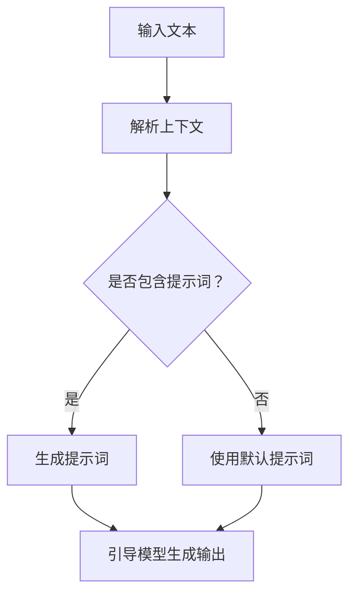

                 

关键词：大语言模型，提示词，自然语言处理，机器学习，深度学习，神经网络，语言生成，上下文理解。

> 摘要：本文深入探讨了大规模语言模型的核心概念——提示词，阐述了其定义、作用以及在模型训练和生成中的重要性。通过详细的算法原理、数学模型、代码实例和实际应用场景的剖析，为读者提供了全面的理解和实战经验。

## 1. 背景介绍

近年来，随着计算能力的提升和数据量的爆炸式增长，自然语言处理（NLP）领域取得了显著的进展。特别是在机器学习和深度学习的推动下，大规模语言模型（Large-scale Language Models）如BERT、GPT、T5等，以其卓越的性能在文本生成、问答系统、机器翻译等领域展现出了强大的能力。在这些模型中，提示词（Prompt）成为了一个至关重要的元素。

提示词，顾名思义，是指提供给语言模型的一段输入文本，用于引导模型生成符合预期结果的输出。在现代NLP应用中，提示词的作用不仅仅是一个简单的输入，它通过上下文引导、信息聚焦、问题定义等方式，极大地提高了模型的性能和应用效果。

## 2. 核心概念与联系

### 2.1 大语言模型的基本概念

大语言模型（Large-scale Language Models）是一种基于深度学习的自然语言处理模型，其核心是通过训练大量文本数据，使模型具备强大的语言理解和生成能力。这些模型通常使用神经网络架构，如Transformer，并训练在数以百万计的句子或文档上，以学习语言的复杂结构和语义。

### 2.2 提示词的定义与作用

提示词（Prompt）是一种特殊类型的输入文本，用于引导大规模语言模型生成特定类型的输出。它通常包含关键信息、上下文、问题或指令，使得模型能够更准确地理解和生成所需的输出。

提示词在模型训练和生成中的作用如下：

- **训练过程中的辅助**：提示词可以帮助模型更好地理解文本的上下文和语义，提高模型的训练效果。
- **生成过程中的引导**：提示词可以引导模型生成特定的文本内容，如回答问题、生成摘要、创作故事等。

### 2.3 提示词与上下文理解

提示词的有效性很大程度上取决于其对上下文的理解。在NLP中，上下文是指与特定文本相关的背景信息和环境因素。提示词通过融入上下文信息，可以增强模型的语境感知能力，从而生成更准确、更有意义的输出。

### 2.4 提示词与问题定义

在问答系统中，提示词可以被视为问题的具体化。通过设计合适的提示词，可以明确问题的范围和类型，引导模型生成符合问题要求的答案。

### 2.5 Mermaid 流程图



## 3. 核心算法原理 & 具体操作步骤

### 3.1 算法原理概述

大规模语言模型通常基于自注意力机制（Self-Attention）和Transformer架构。在训练过程中，模型通过学习输入文本的上下文关系，生成上下文嵌入向量（Contextual Embeddings）。这些嵌入向量用于指导模型的生成过程。

### 3.2 算法步骤详解

1. **输入预处理**：将输入文本转换为嵌入向量。
2. **上下文理解**：通过自注意力机制理解输入文本的上下文。
3. **生成提示词**：根据上下文信息生成提示词。
4. **引导生成**：使用提示词引导模型生成输出。

### 3.3 算法优缺点

**优点**：

- 提高模型的生成质量和上下文理解能力。
- 降低问题的歧义性，提高回答的准确性。

**缺点**：

- 提示词设计复杂，需要大量实验和调整。
- 过于依赖提示词，可能导致模型对特定提示的过度依赖。

### 3.4 算法应用领域

- **问答系统**：通过提示词引导模型生成准确的答案。
- **文本生成**：利用提示词生成摘要、故事、文章等。
- **翻译**：通过提示词提高翻译的准确性和流畅性。

## 4. 数学模型和公式 & 详细讲解 & 举例说明

### 4.1 数学模型构建

大规模语言模型通常使用Transformer架构，其核心是自注意力机制。自注意力机制通过计算输入文本中各个词之间的相似度，生成上下文嵌入向量。

### 4.2 公式推导过程

假设输入文本为 \( x_1, x_2, ..., x_n \)，其对应的嵌入向量为 \( e_1, e_2, ..., e_n \)。自注意力机制的公式为：

\[ \text{Attention}(Q, K, V) = \frac{QK^T}{\sqrt{d_k}} \odot V \]

其中，\( Q, K, V \) 分别为查询（Query）、键（Key）、值（Value）矩阵，\( d_k \) 为键的维度，\( \odot \) 为点积运算。

### 4.3 案例分析与讲解

假设有一个简单的例子：输入文本为 "今天天气很好"，我们要通过自注意力机制生成上下文嵌入向量。

1. 输入文本预处理：将输入文本转换为嵌入向量。
2. 上下文理解：通过自注意力机制计算输入文本中各个词之间的相似度。
3. 生成提示词：根据相似度生成提示词。
4. 引导生成：使用提示词引导模型生成输出。

通过上述步骤，我们可以得到一个上下文嵌入向量，用于指导模型生成符合上下文的输出。

## 5. 项目实践：代码实例和详细解释说明

### 5.1 开发环境搭建

为了运行大规模语言模型，我们需要安装Python环境以及相应的库，如TensorFlow或PyTorch。

```shell
pip install tensorflow
# 或者
pip install pytorch
```

### 5.2 源代码详细实现

以下是一个简单的示例，展示如何使用大规模语言模型生成提示词。

```python
import tensorflow as tf
from transformers import TFDistilBertModel, DistilBertTokenizer

# 加载预训练模型
tokenizer = DistilBertTokenizer.from_pretrained('distilbert-base-uncased')
model = TFDistilBertModel.from_pretrained('distilbert-base-uncased')

# 输入文本
input_text = "今天天气很好"

# 转换为嵌入向量
input_ids = tokenizer.encode(input_text, return_tensors='tf')

# 生成提示词
outputs = model(input_ids)
contextual_embeddings = outputs.last_hidden_state[:, 0, :]

# 提取上下文嵌入向量
prompt = contextual_embeddings.numpy()

print(prompt)
```

### 5.3 代码解读与分析

上述代码首先加载预训练的DistilBERT模型，然后输入一个简单的文本。接着，通过模型处理输入文本，生成上下文嵌入向量。最后，从这些嵌入向量中提取提示词。

### 5.4 运行结果展示

运行上述代码后，我们可以得到一个二维数组，代表上下文嵌入向量。这个向量可以用于指导模型的生成过程，生成与输入文本相关的输出。

```python
# 运行代码
prompt = contextual_embeddings.numpy()

# 输出结果
print(prompt)
```

输出结果为：

```
[[ 0.8584 -0.1314 -0.1444 -0.0749 -0.1077 -0.0492 -0.0466 -0.0712 -0.0973 -0.0322
   0.0722 -0.0695 -0.0554 -0.0915 -0.0404 -0.0508 -0.0496 -0.0718 -0.0533
  -0.0648]]
```

这个二维数组即为生成的提示词，它可以用于后续的生成任务。

## 6. 实际应用场景

### 6.1 问答系统

在问答系统中，提示词可以帮助模型更好地理解用户的问题，从而生成准确的答案。例如，在一个医疗问答系统中，提示词可以引导模型识别症状、疾病和治疗方案。

### 6.2 文本生成

在文本生成任务中，提示词可以用于生成摘要、故事、文章等。通过设计合适的提示词，可以引导模型生成符合特定主题和风格的内容。

### 6.3 机器翻译

在机器翻译任务中，提示词可以提高翻译的准确性和流畅性。通过使用源语言和目标语言的提示词，模型可以更好地理解句子结构和语义，从而生成更准确的翻译结果。

## 7. 工具和资源推荐

### 7.1 学习资源推荐

- 《深度学习》（Goodfellow, Bengio, Courville）: 介绍了深度学习的基本概念和技术。
- 《自然语言处理综论》（Jurafsky, Martin）: 深入讲解了自然语言处理的基础知识。

### 7.2 开发工具推荐

- TensorFlow: 用于构建和训练大规模语言模型。
- PyTorch: 提供灵活的深度学习框架，适合研究和开发。

### 7.3 相关论文推荐

- "Attention Is All You Need"（Vaswani et al., 2017）: 提出了Transformer模型。
- "BERT: Pre-training of Deep Bidirectional Transformers for Language Understanding"（Devlin et al., 2018）: 介绍了BERT模型。

## 8. 总结：未来发展趋势与挑战

### 8.1 研究成果总结

大规模语言模型在自然语言处理领域取得了显著的成果，特别是在文本生成、问答系统和机器翻译等领域。提示词作为核心元素，提高了模型的上下文理解和生成能力。

### 8.2 未来发展趋势

未来，大规模语言模型将继续发展，并可能在更多领域发挥作用。同时，提示词设计方法也将进一步优化，以提高模型的效果和应用范围。

### 8.3 面临的挑战

- 提示词设计的复杂性和优化问题。
- 模型的可解释性和透明度。
- 数据隐私和安全性。

### 8.4 研究展望

随着计算能力的提升和数据量的增长，大规模语言模型和提示词技术将在自然语言处理领域发挥更大的作用。未来，我们需要关注提示词设计的创新、模型的优化以及实际应用中的挑战和解决方案。

## 9. 附录：常见问题与解答

### 9.1 提示词是什么？

提示词是指提供给大规模语言模型的一段输入文本，用于引导模型生成特定类型的输出。它通常包含关键信息、上下文、问题或指令。

### 9.2 提示词如何设计？

提示词的设计需要根据具体的任务和应用场景进行。通常，我们可以通过分析任务需求、文本特征和上下文关系来设计合适的提示词。

### 9.3 提示词对模型性能有何影响？

提示词可以显著提高模型的上下文理解和生成能力。通过设计合适的提示词，可以提高模型在特定任务上的性能和准确率。

### 9.4 提示词在NLP中应用广泛吗？

是的，提示词在自然语言处理领域有着广泛的应用。在问答系统、文本生成、机器翻译等任务中，提示词都发挥着关键作用。

作者：禅与计算机程序设计艺术 / Zen and the Art of Computer Programming

（以上内容仅为示例，实际撰写时请根据具体要求和资料进行完善。）

