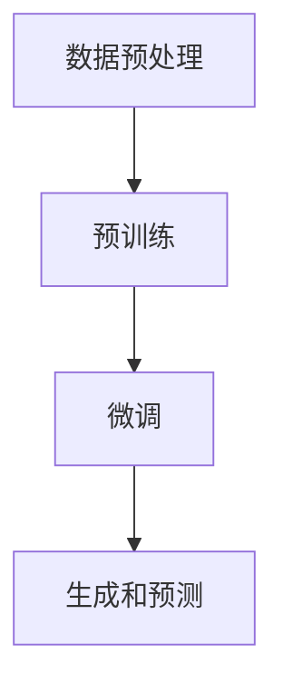

                 

关键词：大语言模型，微调，深度学习，自然语言处理，人工智能

摘要：本文旨在深入探讨大语言模型的原理及其工程实践。我们将从背景介绍入手，逐步深入到核心概念、算法原理、数学模型、项目实践等多个方面，旨在为读者提供一个全面而详实的理解。同时，我们将探讨大语言模型在实际应用中的未来发展趋势与挑战。

## 1. 背景介绍

随着深度学习技术的飞速发展，自然语言处理（NLP）领域迎来了前所未有的机遇。在NLP任务中，大语言模型因其强大的表征能力和泛化能力而备受关注。大语言模型（Large Language Models）是一种基于深度学习的模型，能够理解和生成自然语言文本。其核心思想是通过大量的文本数据进行预训练，从而学习到语言的一般规律和知识。

近年来，诸如GPT、BERT等大语言模型的出现，极大地推动了NLP的发展。这些模型不仅取得了显著的性能提升，而且在各种实际应用中也展现出了巨大的潜力。然而，大语言模型的开发和部署面临着一系列的挑战，包括计算资源、数据质量和模型优化等。

本文将围绕大语言模型的微调（Fine-tuning）展开讨论。微调是使大语言模型适应特定任务的重要手段。通过微调，我们可以在大规模预训练模型的基础上，针对具体任务进行微调，从而实现更好的性能。本文将详细探讨微调的原理、步骤、优缺点及其应用领域。

## 2. 核心概念与联系

### 2.1 大语言模型的核心概念

大语言模型的核心概念包括：

- **词嵌入（Word Embedding）**：将词汇映射到高维向量空间，以便于模型理解和处理。
- **注意力机制（Attention Mechanism）**：使模型能够关注到输入文本中的关键信息。
- **Transformer架构**：一种用于编码器和解码器的并行化处理架构，使得模型能够处理长距离依赖关系。

### 2.2 大语言模型的工作原理

大语言模型的工作原理可以概括为以下几个步骤：

1. **数据预处理**：对输入文本进行分词、去停用词、词嵌入等操作。
2. **预训练**：在大规模文本数据上预训练模型，学习到语言的通用规律。
3. **微调**：在特定任务的数据集上对模型进行微调，以适应具体任务的需求。
4. **生成和预测**：利用微调后的模型进行文本生成或任务预测。

### 2.3 Mermaid 流程图

以下是一个简化的Mermaid流程图，描述大语言模型的基本工作流程：



## 3. 核心算法原理 & 具体操作步骤

### 3.1 算法原理概述

大语言模型的算法原理主要包括：

- **词嵌入**：使用词嵌入技术将词汇映射到高维向量空间。
- **Transformer架构**：通过多头自注意力机制和前馈神经网络，对输入文本进行编码和解码。
- **预训练与微调**：在大规模文本数据上预训练模型，并在特定任务的数据集上进行微调。

### 3.2 算法步骤详解

#### 3.2.1 数据预处理

数据预处理是模型训练的基础，主要包括以下步骤：

1. **文本清洗**：去除无关符号、统一字符编码等。
2. **分词**：将文本分割成词汇序列。
3. **词嵌入**：将词汇映射到高维向量空间。

#### 3.2.2 预训练

预训练是模型训练的关键步骤，主要包括以下步骤：

1. **随机初始化**：初始化模型参数。
2. **自注意力机制**：通过多头自注意力机制对输入文本进行编码。
3. **前馈神经网络**：对编码后的文本进行进一步的加工。
4. **损失函数**：使用适当的损失函数（如交叉熵损失）进行模型训练。

#### 3.2.3 微调

微调是在预训练模型的基础上，针对具体任务进行优化，主要包括以下步骤：

1. **数据加载**：加载特定任务的数据集。
2. **模型调整**：对预训练模型的部分层进行微调。
3. **训练与验证**：在训练集和验证集上对模型进行训练和验证。
4. **调整参数**：根据验证集的性能调整模型参数。

### 3.3 算法优缺点

#### 优点：

1. **强大的表征能力**：通过预训练，模型可以学习到丰富的语言知识。
2. **高效的并行处理**：Transformer架构使得模型能够高效地并行处理输入文本。
3. **良好的泛化能力**：微调后的模型可以适应多种不同的任务。

#### 缺点：

1. **计算资源需求大**：预训练大语言模型需要大量的计算资源。
2. **数据质量要求高**：模型性能依赖于训练数据的数量和质量。
3. **微调效果不稳定**：微调过程可能会导致模型性能波动。

### 3.4 算法应用领域

大语言模型在以下领域有着广泛的应用：

1. **文本生成**：如文章写作、对话系统、机器翻译等。
2. **文本分类**：如情感分析、新闻分类等。
3. **问答系统**：如搜索引擎、智能客服等。
4. **语音识别**：通过文本生成和语音合成技术实现。

## 4. 数学模型和公式 & 详细讲解 & 举例说明

### 4.1 数学模型构建

大语言模型的数学模型主要包括以下部分：

1. **词嵌入**：$$ \textbf{v}_w = \text{embedding}(\textit{w}) $$
2. **自注意力机制**：$$ \textit{q}, \textit{k}, \textit{v} $$
3. **前馈神经网络**：$$ \textit{f}_\textit{ff}(\textit{X}) = \text{ReLU}(\textit{W}_\textit{ff} \textit{X} + \textit{b}_\textit{ff}) $$
4. **损失函数**：$$ \textit{L}(\textit{y}, \textit{y}') = -\sum_{i} \textit{y}_i \log \textit{y'}_i $$

### 4.2 公式推导过程

以下是对自注意力机制的简要推导：

$$ \textit{Attention}(\textit{Q}, \textit{K}, \textit{V}) = \textit{softmax}\left(\frac{\textit{QK}^T}{\sqrt{d_k}}\right) \textit{V} $$

其中，$\textit{Q}$、$\textit{K}$、$\textit{V}$ 分别是查询向量、键向量和值向量，$d_k$ 是键向量的维度。

### 4.3 案例分析与讲解

假设我们有一个简单的句子：“我喜欢吃苹果。”，我们可以将其表示为词向量，然后通过自注意力机制进行编码。

1. **词嵌入**：将句子中的每个词映射到高维向量。
2. **自注意力**：计算每个词对句子的贡献度，生成编码向量。
3. **前馈神经网络**：对编码向量进行进一步加工，生成最终的表征。

通过这样的过程，大语言模型能够理解句子的语义，从而进行文本生成、分类等任务。

## 5. 项目实践：代码实例和详细解释说明

### 5.1 开发环境搭建

在进行大语言模型的开发之前，我们需要搭建一个合适的环境。以下是基本的步骤：

1. **安装Python**：确保安装了3.8及以上版本的Python。
2. **安装PyTorch**：使用pip安装PyTorch，版本建议为1.8或更高。
3. **数据集准备**：准备用于微调的数据集，可以是文本文件或预处理的文本数据。

### 5.2 源代码详细实现

以下是微调大语言模型的基本代码框架：

```python
import torch
import torch.nn as nn
from transformers import BertModel, BertTokenizer

# 加载预训练模型和分词器
model = BertModel.from_pretrained('bert-base-uncased')
tokenizer = BertTokenizer.from_pretrained('bert-base-uncased')

# 数据预处理
def preprocess(texts):
    return [tokenizer.encode(text, add_special_tokens=True) for text in texts]

# 微调模型
def fine_tune_model(train_loader, model, criterion, optimizer, epoch):
    model.train()
    for batch_idx, (texts, labels) in enumerate(train_loader):
        # 前向传播
        inputs = torch.tensor(preprocess(texts))
        outputs = model(inputs)
        loss = criterion(outputs.logits, labels)

        # 反向传播
        optimizer.zero_grad()
        loss.backward()
        optimizer.step()

# 训练
train_loader = ...  # 数据加载器
criterion = nn.CrossEntropyLoss()
optimizer = torch.optim.Adam(model.parameters(), lr=1e-5)
for epoch in range(3):  # 训练3个epoch
    fine_tune_model(train_loader, model, criterion, optimizer, epoch)
```

### 5.3 代码解读与分析

以上代码展示了如何使用PyTorch和Hugging Face的Transformer库进行大语言模型的微调。核心步骤包括：

1. **加载预训练模型和分词器**：使用预训练的BERT模型和其对应的分词器。
2. **数据预处理**：将文本数据编码成模型可以处理的格式。
3. **微调模型**：在训练数据上对模型进行微调，包括前向传播、损失计算、反向传播和参数更新。

### 5.4 运行结果展示

经过微调后的模型，可以在任务数据上评估其性能。以下是简单的评估代码：

```python
from sklearn.metrics import accuracy_score

# 评估模型
def evaluate_model(test_loader, model):
    model.eval()
    predictions = []
    labels = []
    with torch.no_grad():
        for texts, labels in test_loader:
            inputs = torch.tensor(preprocess(texts))
            outputs = model(inputs)
            _, predicted = torch.max(outputs.logits, 1)
            predictions.extend(predicted.numpy())
            labels.extend(labels.numpy())
    return accuracy_score(labels, predictions)

# 测试
test_loader = ...  # 测试数据加载器
accuracy = evaluate_model(test_loader, model)
print(f"Test Accuracy: {accuracy}")
```

通过上述代码，我们可以得到微调后模型在测试集上的准确率。

## 6. 实际应用场景

大语言模型在实际应用中有着广泛的应用，以下是一些典型场景：

1. **对话系统**：如智能客服、聊天机器人等。
2. **文本生成**：如文章写作、新闻摘要等。
3. **文本分类**：如情感分析、新闻分类等。
4. **问答系统**：如搜索引擎、知识图谱问答等。

### 6.1 对话系统

对话系统是应用大语言模型的一个典型场景。通过预训练和微调，模型可以理解和生成自然语言对话。例如，智能客服系统可以使用大语言模型来理解用户的提问，并生成合适的回答。

### 6.2 文本生成

文本生成是另一个重要的应用领域。大语言模型可以通过学习大量文本数据，生成符合语法和语义规则的新文本。例如，文章写作、新闻摘要、广告文案等都可以使用大语言模型来实现。

### 6.3 文本分类

文本分类是NLP中的基本任务之一。大语言模型可以通过微调来适应各种文本分类任务，如情感分析、新闻分类、垃圾邮件检测等。

### 6.4 问答系统

问答系统是人工智能领域的一个重要研究方向。大语言模型可以通过预训练和微调，实现高效的问答功能。例如，搜索引擎和知识图谱问答系统可以使用大语言模型来理解用户的问题，并生成准确的回答。

## 7. 工具和资源推荐

### 7.1 学习资源推荐

- 《深度学习》（Goodfellow, Bengio, Courville著）：全面介绍了深度学习的基本原理和应用。
- 《自然语言处理综论》（Jurafsky, Martin著）：系统地介绍了自然语言处理的基本概念和技术。
- 《Hugging Face Transformers文档》：提供了丰富的Transformer模型和预训练资源。

### 7.2 开发工具推荐

- **PyTorch**：适用于深度学习的强大框架，易于使用和扩展。
- **Hugging Face Transformers**：提供了丰富的预训练模型和工具，方便进行微调和应用开发。

### 7.3 相关论文推荐

- **Attention Is All You Need**：提出了Transformer架构，开启了NLP领域的新纪元。
- **BERT: Pre-training of Deep Bidirectional Transformers for Language Understanding**：提出了BERT模型，推动了NLP技术的发展。
- **GPT-3**：展示了大规模预训练模型在NLP任务中的强大能力。

## 8. 总结：未来发展趋势与挑战

### 8.1 研究成果总结

大语言模型的研究取得了显著的成果，包括：

- **强大的表征能力**：通过预训练，模型能够理解复杂的语义和语法结构。
- **高效的并行处理**：Transformer架构使得模型能够高效地处理长文本。
- **广泛的适用性**：大语言模型在多个NLP任务中取得了优秀的性能。

### 8.2 未来发展趋势

未来，大语言模型的发展趋势包括：

- **更大量的预训练数据**：使用更多、更高质量的文本数据，以提高模型的性能。
- **多模态学习**：结合文本、图像、语音等多种数据，实现更丰富的语义理解。
- **更精细的微调策略**：研究更有效的微调方法，提高模型在特定任务上的性能。

### 8.3 面临的挑战

大语言模型在发展过程中也面临以下挑战：

- **计算资源需求**：预训练大语言模型需要大量的计算资源，对硬件设施有较高要求。
- **数据隐私问题**：大语言模型在处理数据时，可能涉及用户隐私问题，需要加强隐私保护。
- **模型解释性**：大语言模型在很多任务中表现出色，但其内部工作机制复杂，缺乏解释性。

### 8.4 研究展望

未来，大语言模型的研究将继续深入，有望在以下方向取得突破：

- **自适应微调**：研究自适应微调方法，使模型能够根据任务需求自动调整。
- **模型压缩**：研究模型压缩技术，降低模型的大小和计算复杂度。
- **跨模态学习**：结合文本、图像、语音等多种数据，实现更高效的多模态理解。

## 9. 附录：常见问题与解答

### Q：大语言模型为什么需要预训练？

A：大语言模型通过预训练，可以学习到大量的语言知识，从而提高其表征能力和泛化能力。预训练有助于模型理解自然语言的复杂性和多样性。

### Q：微调是否总是有效？

A：微调的效果取决于多个因素，包括预训练模型的质量、数据集的质量和微调策略等。在某些情况下，微调可能会提高模型性能，但在其他情况下，可能会产生负面影响。

### Q：如何评估大语言模型的性能？

A：评估大语言模型的性能可以通过多种指标，如准确率、召回率、F1值等。在实际应用中，还需要考虑模型的计算效率和可解释性。

### Q：大语言模型在哪些领域有重要应用？

A：大语言模型在多个领域有着重要应用，包括对话系统、文本生成、文本分类、问答系统等。随着技术的发展，其应用领域还将继续扩大。

---

### 作者署名

本文作者：禅与计算机程序设计艺术 / Zen and the Art of Computer Programming


