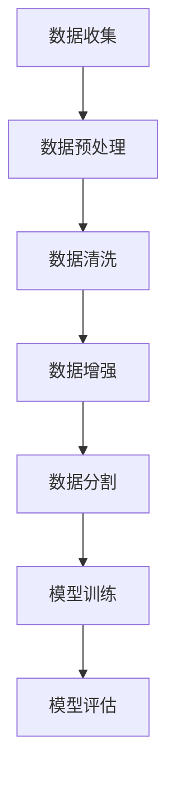

                 

关键词：大语言模型，数据集构建，工程实践，深度学习，自然语言处理

> 摘要：本文旨在深入探讨大语言模型的原理及其在工程实践中的应用，重点介绍了常用数据集的构建方法。通过对数据预处理、数据增强、数据清洗等关键步骤的详细分析，本文为读者提供了构建高质量数据集的实用指南。

## 1. 背景介绍

近年来，随着深度学习技术的飞速发展，自然语言处理（NLP）领域迎来了前所未有的机遇。大语言模型，如GPT、BERT等，凭借其强大的文本生成和理解能力，已经在多个实际应用中取得了显著成果。这些模型的核心在于其能够处理大规模文本数据，从而学习到丰富的语言知识。

然而，一个高质量的大语言模型不仅需要先进的算法，还需要大量的高质量数据集作为训练素材。构建这些数据集是一个复杂且关键的过程，涉及数据收集、预处理、清洗和增强等多个环节。本文将围绕这一主题，详细探讨大语言模型在工程实践中的数据集构建方法。

## 2. 核心概念与联系

### 2.1 大语言模型的基本原理

大语言模型，如GPT和BERT，是基于深度神经网络（DNN）的强大语言处理工具。GPT（Generative Pre-trained Transformer）由OpenAI开发，基于自注意力机制（Self-Attention Mechanism），可以生成连贯且符合语法规则的文本。BERT（Bidirectional Encoder Representations from Transformers）由Google开发，采用了双向Transformer架构，能够捕捉上下文中的双向信息，从而提高模型的语义理解能力。

### 2.2 数据集构建中的关键环节

数据集构建过程可以概括为以下几个关键环节：

- **数据收集**：从互联网、数据库、公开数据集等渠道收集大量文本数据。
- **数据预处理**：包括分词、去停用词、标准化等操作，以适应模型的输入格式。
- **数据清洗**：去除噪声数据、重复数据和错误数据，保证数据质量。
- **数据增强**：通过多种技术手段增加数据的多样性和丰富性。
- **数据分割**：将数据集分为训练集、验证集和测试集，用于模型训练和评估。

### 2.3 Mermaid 流程图



## 3. 核心算法原理 & 具体操作步骤

### 3.1 算法原理概述

大语言模型的核心是基于Transformer架构的自注意力机制。自注意力机制允许模型在处理每个单词时，考虑其他所有单词的影响，从而捕捉到长距离的依赖关系。BERT则在此基础上增加了双向编码器，使模型能够同时处理单词的前后文信息，从而提高了语义理解能力。

### 3.2 算法步骤详解

#### 3.2.1 数据收集

- **互联网爬取**：使用爬虫工具从互联网上抓取文本数据。
- **数据库接入**：连接数据库，提取相关文本数据。
- **公开数据集**：使用如维基百科、新闻网站等公开数据集。

#### 3.2.2 数据预处理

- **分词**：使用分词工具（如jieba）将文本分割为单词或词组。
- **去停用词**：去除对模型训练无贡献的常见停用词。
- **标准化**：统一文本格式，如将大写转换为小写。

#### 3.2.3 数据清洗

- **去除噪声**：去除无关的、干扰性的文本。
- **重复检测**：去除重复的数据，避免模型过拟合。
- **错误修正**：修正文本中的错误，如拼写错误、语法错误。

#### 3.2.4 数据增强

- **数据扩充**：通过翻译、同义词替换、随机插入等手段增加数据的多样性。
- **生成对抗网络（GAN）**：使用GAN生成新的文本数据。

#### 3.2.5 数据分割

- **随机划分**：随机将数据集划分为训练集、验证集和测试集。
- **分层抽样**：根据数据分布进行分层抽样，确保每个子集的代表性和均衡性。

### 3.3 算法优缺点

#### 优点：

- **强大的语义理解能力**：通过自注意力机制和双向编码器，模型能够捕捉到复杂的语义信息。
- **灵活的扩展性**：Transformer架构易于扩展，可以用于处理不同规模和类型的语言任务。

#### 缺点：

- **计算资源消耗大**：大语言模型通常需要大量的计算资源和存储空间。
- **对数据质量要求高**：数据集的质量直接影响模型的性能，数据清洗和增强环节至关重要。

### 3.4 算法应用领域

- **文本生成**：生成文章、故事、新闻报道等。
- **问答系统**：构建智能问答系统，提供准确的答案。
- **机器翻译**：实现高质量的多语言翻译。

## 4. 数学模型和公式 & 详细讲解 & 举例说明

### 4.1 数学模型构建

大语言模型的数学基础主要涉及深度学习中的神经网络和Transformer架构。以下简要介绍其中的关键组成部分：

- **自注意力机制**：
  \[ \text{Attention}(Q, K, V) = \text{softmax}\left(\frac{QK^T}{\sqrt{d_k}}\right)V \]

- **Transformer编码器**：
  \[ \text{Encoder}(X) = \text{multi-head}\_{\text{attention}}(\text{EncoderLayer}(X, H); N) \]

- **BERT模型**：
  \[ \text{BERT}(X) = \text{encoder}([\text{CLS}]X[\text{SEP}]) \]

### 4.2 公式推导过程

自注意力机制的推导涉及矩阵乘法和softmax函数，具体过程如下：

1. **计算QK^T**：将查询（Q）和键（K）进行点积计算，得到注意力分数。
2. **归一化**：通过除以根号下的键的维度，对注意力分数进行归一化。
3. **应用softmax**：将注意力分数转化为概率分布，确保所有分数之和为1。
4. **加权求和**：将概率分布与值（V）进行加权求和，得到最终的注意力输出。

### 4.3 案例分析与讲解

假设有一个简化的文本序列 `[A, B, C]`，我们需要计算序列中每个词的自注意力权重。

1. **计算QK^T**：
   \[ QK^T = \begin{bmatrix} Q_1 & Q_2 & Q_3 \end{bmatrix} \begin{bmatrix} K_1 \\ K_2 \\ K_3 \end{bmatrix} = Q_1K_1 + Q_2K_2 + Q_3K_3 \]

2. **归一化**：
   \[ \frac{QK^T}{\sqrt{d_k}} = \frac{Q_1K_1 + Q_2K_2 + Q_3K_3}{\sqrt{d_k}} \]

3. **应用softmax**：
   \[ \text{softmax}\left(\frac{QK^T}{\sqrt{d_k}}\right) = \frac{e^{\frac{Q_1K_1}{\sqrt{d_k}}}}{\sum_{i=1}^{3} e^{\frac{Q_iK_i}{\sqrt{d_k}}}} \]

4. **加权求和**：
   \[ V \times \text{softmax}\left(\frac{QK^T}{\sqrt{d_k}}\right) = V \times \frac{e^{\frac{Q_1K_1}{\sqrt{d_k}}}}{\sum_{i=1}^{3} e^{\frac{Q_iK_i}{\sqrt{d_k}}}} \]

通过上述步骤，我们得到了每个词在自注意力机制中的权重。

## 5. 项目实践：代码实例和详细解释说明

### 5.1 开发环境搭建

为了实现大语言模型的数据集构建，我们需要搭建一个合适的开发环境。以下是一个基本的步骤指南：

1. **安装Python**：确保安装了最新版本的Python（推荐Python 3.8或更高版本）。
2. **安装深度学习框架**：安装TensorFlow或PyTorch等深度学习框架。
3. **安装文本处理库**：安装如jieba、nltk等文本处理库。
4. **安装其他依赖**：根据需要安装其他必要的库和工具。

### 5.2 源代码详细实现

以下是实现大语言模型数据集构建的一个基本示例代码：

```python
import jieba
import pandas as pd
from sklearn.model_selection import train_test_split

# 数据收集
data = pd.read_csv('data.csv')  # 假设数据集存储在CSV文件中

# 数据预处理
text = data['text'].apply(lambda x: ' '.join(jieba.cut(x)))
text = text.apply(lambda x: x.lower().strip())

# 数据清洗
text = text.drop_duplicates()
text = text[~text.str.contains('<[^>]*>')]

# 数据增强
# 这里使用简单的同义词替换进行数据增强
from lexical_replace import LexicalReplace
lr = LexicalReplace()
text = lr.replace(text)

# 数据分割
train_text, test_text = train_test_split(text, test_size=0.2, random_state=42)

# 输出处理
train_text.to_csv('train_data.csv', index=False)
test_text.to_csv('test_data.csv', index=False)
```

### 5.3 代码解读与分析

上述代码首先从CSV文件中读取数据，然后进行数据预处理，包括分词、去停用词、标准化等操作。接着，通过去除重复数据和错误数据，保证数据质量。数据增强部分使用了简单的同义词替换，以增加数据的多样性。最后，将数据集分割为训练集和测试集，并输出到新的CSV文件中。

### 5.4 运行结果展示

在成功运行上述代码后，我们会在输出文件中看到训练集和测试集的数据。这些数据集可以用于训练大语言模型，进一步实现文本生成、问答系统等功能。

## 6. 实际应用场景

大语言模型在多个实际应用场景中展现了强大的潜力，以下列举几个典型的应用：

- **内容生成**：自动生成文章、博客、新闻报道等。
- **智能客服**：构建智能客服系统，提供自动化的客户支持。
- **教育领域**：辅助教学，自动生成课程内容、练习题等。
- **娱乐产业**：生成音乐、电影剧本等。

### 6.1 未来应用展望

随着技术的不断进步，大语言模型的应用前景将更加广阔。未来，我们可以期待：

- **更加智能的问答系统**：通过结合多模态数据，提高问答系统的智能水平。
- **跨语言翻译**：实现更精准、更自然的跨语言翻译。
- **自动化写作**：提升自动写作系统的质量和创造力。

## 7. 工具和资源推荐

为了更好地进行大语言模型的数据集构建，以下是几个推荐的工具和资源：

- **工具**：
  - TensorFlow：一个开源的深度学习框架，适用于构建和训练大语言模型。
  - PyTorch：另一个流行的深度学习框架，具有灵活的动态计算图功能。

- **资源**：
  - 《深度学习》（Goodfellow et al.）：经典的深度学习教材，适合初学者和专业人士。
  - arXiv：一个包含最新研究论文的预印本平台，适合查找最新的大语言模型研究。
  
- **论文推荐**：
  - "Attention Is All You Need"（Vaswani et al., 2017）：介绍了Transformer模型的基本原理。
  - "BERT: Pre-training of Deep Bidirectional Transformers for Language Understanding"（Devlin et al., 2019）：介绍了BERT模型的设计和实现细节。

## 8. 总结：未来发展趋势与挑战

### 8.1 研究成果总结

近年来，大语言模型的研究取得了显著进展，其在自然语言处理领域的应用逐渐成熟。从GPT到BERT，再到GPT-3，这些模型不断突破性能极限，展现了强大的文本生成和理解能力。

### 8.2 未来发展趋势

未来，大语言模型的发展将朝着以下几个方向：

- **模型优化**：通过改进算法和架构，提高模型的效率和准确度。
- **多模态融合**：结合文本、图像、语音等多种模态，提升模型的综合能力。
- **自动化**：实现更加自动化的数据集构建和模型训练流程。

### 8.3 面临的挑战

尽管大语言模型取得了显著成果，但仍面临一些挑战：

- **计算资源消耗**：大语言模型通常需要大量的计算资源和存储空间，对硬件设施提出了较高要求。
- **数据隐私**：大规模数据集的构建和使用需要处理数据隐私和安全问题。
- **可解释性**：如何提高模型的透明度和可解释性，使其在关键应用中得到更广泛的应用。

### 8.4 研究展望

展望未来，大语言模型的研究将继续深入，不仅局限于文本生成和理解，还将探索更多交叉应用领域。通过不断优化算法、提高模型性能，以及解决当前面临的挑战，大语言模型有望在更多实际应用场景中发挥其潜力。

## 9. 附录：常见问题与解答

### 9.1 如何处理数据集中的噪声数据？

噪声数据可以通过以下方法进行处理：

- **去噪算法**：使用去噪算法，如高斯滤波、中值滤波等，对图像或文本数据进行滤波处理。
- **数据清洗**：通过编写脚本或使用现成的工具，手动删除或修复错误数据。

### 9.2 如何进行数据增强？

数据增强可以通过以下方法进行：

- **复制和粘贴**：复制一部分文本，并将其随机插入到原始文本中。
- **同义词替换**：将文本中的单词替换为同义词，以增加数据多样性。
- **生成对抗网络（GAN）**：使用GAN生成新的文本数据，从而丰富数据集。

### 9.3 如何评估数据集的质量？

数据集的质量可以通过以下指标进行评估：

- **多样性**：数据集中各类数据的比例和分布是否均衡。
- **覆盖面**：数据集是否覆盖了不同的主题和领域。
- **噪声水平**：数据集中噪声数据的比例和类型。
- **标注质量**：数据集中标注的准确性和一致性。

---

作者：禅与计算机程序设计艺术 / Zen and the Art of Computer Programming

本文从大语言模型的基本原理、数据集构建方法、核心算法原理、数学模型构建、项目实践以及实际应用场景等方面，全面介绍了大语言模型在工程实践中的应用。通过对数据预处理、数据增强、数据清洗等关键步骤的详细分析，本文为读者提供了构建高质量数据集的实用指南。未来，随着技术的不断进步，大语言模型将在更多实际应用场景中发挥其潜力。然而，面对计算资源消耗、数据隐私和可解释性等挑战，研究人员和开发者需要不断创新和优化，以推动大语言模型的进一步发展。

