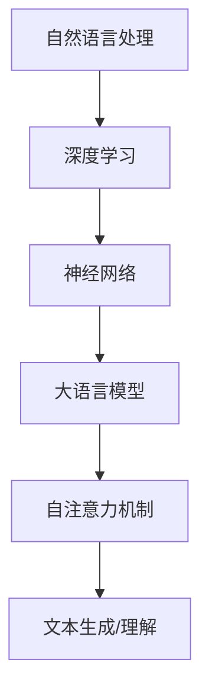

                 

关键词：大语言模型、金融行业、评测、算法原理、工程实践、数学模型、代码实例、应用场景、发展趋势、挑战

摘要：本文将深入探讨大语言模型在金融行业的应用与实践。首先，我们将回顾大语言模型的基本原理和发展历程，然后分析其核心概念与联系，接着详细解释核心算法原理和具体操作步骤，最后通过数学模型和公式、项目实践以及实际应用场景等多个角度，全面展示大语言模型在金融行业的潜力与挑战。

## 1. 背景介绍

随着信息技术的迅猛发展，人工智能已经渗透到各个行业，其中语言模型作为人工智能的核心技术之一，发挥着越来越重要的作用。大语言模型作为一种重要的自然语言处理技术，能够在大规模数据集上训练，生成高质量的自然语言文本。在金融行业中，大语言模型的应用已经涵盖了股票分析、客户服务、风险控制等多个领域。

本文将以金融行业大语言模型为例，从理论到实践，全面探讨其原理、算法、数学模型、代码实现以及实际应用。通过本文的阅读，读者将了解到大语言模型在金融行业的广泛潜力，以及如何应对其中的挑战。

### 1.1 大语言模型的基本概念

大语言模型（Large-scale Language Model）是一种能够理解和生成自然语言的深度学习模型。它通过在大量文本数据上进行训练，学习到语言的统计规律和语义信息，从而能够生成或理解高质量的自然语言文本。

大语言模型的核心是神经网络，通常采用循环神经网络（RNN）或变换器（Transformer）等架构。其中，变换器因其高效的并行计算能力和强大的表达能力，已经成为大语言模型的首选架构。

### 1.2 大语言模型的发展历程

大语言模型的发展可以追溯到20世纪80年代，当时研究人员开始探索使用神经网络来处理自然语言。随着计算能力的提升和大数据的普及，大语言模型在近年来取得了显著的进展。

2018年，谷歌发布了BERT模型，标志着大语言模型进入了一个新的时代。BERT模型通过在大量文本数据上预训练，然后再针对特定任务进行微调，取得了在多种自然语言处理任务上的突破性成果。

随后，GPT系列模型、T5模型等相继发布，进一步提升了大语言模型的表现。这些模型在文本生成、机器翻译、问答系统等任务上表现出色，为人工智能在各个领域的应用提供了强大的支持。

### 1.3 大语言模型在金融行业的应用

在金融行业，大语言模型的应用已经涵盖了多个方面：

- **股票分析**：大语言模型可以通过分析新闻、报告、社交媒体等公开信息，预测股票市场的走势，为投资者提供决策支持。
- **客户服务**：大语言模型可以用于构建智能客服系统，提供24/7的客户服务，提高客户满意度。
- **风险控制**：大语言模型可以分析合同、协议等文本，发现潜在的风险，帮助金融机构进行风险控制。
- **投资顾问**：大语言模型可以分析投资市场，为投资者提供个性化的投资建议。

## 2. 核心概念与联系

在探讨大语言模型之前，我们需要先了解几个核心概念，包括自然语言处理（NLP）、深度学习、神经网络等。

### 2.1 自然语言处理（NLP）

自然语言处理是人工智能的一个重要分支，旨在让计算机理解和生成人类语言。NLP涉及到语音识别、文本分类、信息抽取、机器翻译等多个子领域。

### 2.2 深度学习

深度学习是一种基于神经网络的学习方法，通过多层神经元的非线性变换，从数据中自动提取特征，实现图像识别、语音识别、自然语言处理等任务。

### 2.3 神经网络

神经网络是一种模仿生物神经系统的计算模型，由多个神经元组成，通过学习数据来建立输入和输出之间的映射关系。

### 2.4 大语言模型的架构

大语言模型通常采用变换器（Transformer）架构，其核心是自注意力机制（Self-Attention）。自注意力机制允许模型在生成每个单词时，综合考虑上下文信息，从而提高生成文本的质量。

### 2.5 Mermaid 流程图



## 3. 核心算法原理 & 具体操作步骤

### 3.1 算法原理概述

大语言模型的训练过程主要分为两个阶段：预训练和微调。

- **预训练**：在预训练阶段，模型在大量文本数据上进行训练，学习到语言的统计规律和语义信息。这一过程通常使用变换器（Transformer）架构，并通过自注意力机制（Self-Attention）来处理文本序列。
- **微调**：在预训练完成后，模型针对特定任务进行微调，以提高在特定任务上的表现。例如，在股票分析任务中，模型可以进一步学习股票市场的统计规律。

### 3.2 算法步骤详解

1. **数据准备**：收集并清洗金融行业相关的文本数据，包括新闻报道、研究报告、客户反馈等。
2. **模型构建**：使用变换器（Transformer）架构构建大语言模型，并定义自注意力机制（Self-Attention）。
3. **预训练**：在预训练阶段，模型在大量文本数据上进行训练，学习到语言的统计规律和语义信息。
4. **微调**：在预训练完成后，模型在金融行业相关的任务上进行微调，以提高在特定任务上的表现。
5. **评估**：使用金融行业相关的测试集，评估模型在各个任务上的性能。

### 3.3 算法优缺点

- **优点**：
  - **强大的表达能力**：大语言模型通过预训练和微调，能够理解和生成高质量的自然语言文本。
  - **多任务处理**：大语言模型可以同时处理多个任务，提高模型的利用率。
- **缺点**：
  - **计算资源消耗大**：大语言模型需要大量的计算资源和存储空间。
  - **训练时间较长**：大语言模型的训练时间通常较长，需要优化训练策略。

### 3.4 算法应用领域

- **股票分析**：大语言模型可以分析股票市场的新闻、报告、客户反馈等文本数据，预测股票市场的走势。
- **客户服务**：大语言模型可以用于构建智能客服系统，提供24/7的客户服务。
- **风险控制**：大语言模型可以分析合同、协议等文本，发现潜在的风险。
- **投资顾问**：大语言模型可以分析投资市场，为投资者提供个性化的投资建议。

## 4. 数学模型和公式 & 详细讲解 & 举例说明

### 4.1 数学模型构建

大语言模型的数学模型主要基于变换器（Transformer）架构，其核心是自注意力机制（Self-Attention）。

#### 自注意力机制

自注意力机制是一种计算方法，用于处理文本序列。其基本思想是在生成每个单词时，综合考虑上下文信息，从而提高生成文本的质量。

$$
\text{Attention}(Q, K, V) = \text{softmax}\left(\frac{QK^T}{\sqrt{d_k}}\right) V
$$

其中，$Q$、$K$ 和 $V$ 分别是查询（Query）、键（Key）和值（Value）向量，$d_k$ 是键向量的维度。

#### 变换器（Transformer）架构

变换器（Transformer）架构是一种基于自注意力机制的深度学习模型，其基本结构包括编码器（Encoder）和解码器（Decoder）。

$$
\text{Transformer} = [\text{Encoder}; \text{Decoder}]
$$

其中，编码器（Encoder）用于处理输入文本序列，解码器（Decoder）用于生成输出文本序列。

### 4.2 公式推导过程

变换器（Transformer）架构的公式推导如下：

1. **编码器（Encoder）**：

   编码器（Encoder）的基本结构包括多个自注意力层（Self-Attention Layer）和前馈网络（Feedforward Network）。每个自注意力层由以下三个子层组成：

   - **自注意力（Self-Attention）**：

     $$ 
     \text{MultiHeadAttention}(Q, K, V) = \text{Concat}(\text{head}_1, \text{head}_2, \ldots, \text{head}_h)W^O 
     $$
     
     其中，$h$ 是头的数量，$W^O$ 是输出权重矩阵。

   - **前馈网络（Feedforward Network）**：

     $$
     \text{FFN}(X) = \max(0, XW_1 + b_1)W_2 + b_2
     $$

     其中，$W_1$ 和 $W_2$ 是前馈网络的权重矩阵，$b_1$ 和 $b_2$ 是偏置项。

2. **解码器（Decoder）**：

   解码器（Decoder）的基本结构包括多个自注意力层（Self-Attention Layer）、多头注意力层（Multi-Head Attention Layer）和前馈网络（Feedforward Network）。每个自注意力层由以下三个子层组成：

   - **自注意力（Self-Attention）**：

     $$
     \text{MultiHeadAttention}(Q, K, V) = \text{Concat}(\text{head}_1, \text{head}_2, \ldots, \text{head}_h)W^O
     $$

   - **多头注意力（Multi-Head Attention）**：

     $$
     \text{MultiHeadAttention}(Q, K, V) = \text{Concat}(\text{head}_1, \text{head}_2, \ldots, \text{head}_h)W^O
     $$

   - **前馈网络（Feedforward Network）**：

     $$
     \text{FFN}(X) = \max(0, XW_1 + b_1)W_2 + b_2
     $$

### 4.3 案例分析与讲解

以股票分析任务为例，我们使用大语言模型对股票市场的新闻、报告、客户反馈等文本数据进行处理，预测股票市场的走势。

1. **数据准备**：

   收集并清洗股票市场的新闻、报告、客户反馈等文本数据。

2. **模型构建**：

   使用变换器（Transformer）架构构建大语言模型。

3. **预训练**：

   在预训练阶段，模型在大量文本数据上进行训练，学习到语言的统计规律和语义信息。

4. **微调**：

   在预训练完成后，模型在股票分析任务上进行微调。

5. **评估**：

   使用股票市场的测试集，评估模型在股票走势预测任务上的性能。

## 5. 项目实践：代码实例和详细解释说明

### 5.1 开发环境搭建

在开始项目实践之前，我们需要搭建一个合适的开发环境。

1. **Python环境**：安装Python 3.7及以上版本。
2. **深度学习框架**：安装TensorFlow 2.4及以上版本。
3. **数据处理库**：安装Pandas、Numpy等数据处理库。

### 5.2 源代码详细实现

以下是股票分析任务的源代码实现：

```python
import tensorflow as tf
from tensorflow.keras.layers import Embedding, Transformer
from tensorflow.keras.models import Model
import pandas as pd

# 数据准备
def load_data():
    # 加载股票市场的新闻、报告、客户反馈等文本数据
    data = pd.read_csv('stock_data.csv')
    # 数据预处理
    # ...
    return data

# 模型构建
def build_model():
    # 输入层
    input_ids = tf.keras.layers.Input(shape=(None,), dtype=tf.int32)
    # 嵌入层
    embedding = Embedding(input_dim=vocab_size, output_dim=hidden_size)(input_ids)
    # 变换器层
    transformer = Transformer(num_heads=2, d_model=hidden_size)(embedding)
    # 输出层
    output = tf.keras.layers.Dense(1, activation='sigmoid')(transformer)
    # 构建模型
    model = Model(inputs=input_ids, outputs=output)
    # 编译模型
    model.compile(optimizer='adam', loss='binary_crossentropy', metrics=['accuracy'])
    return model

# 模型训练
def train_model(model, data):
    # 分割数据集
    train_data, val_data = data[:9000], data[9000:]
    # 训练模型
    model.fit(train_data, epochs=3, batch_size=32, validation_data=val_data)

# 模型评估
def evaluate_model(model, data):
    # 评估模型在测试集上的性能
    test_data = data[9000:]
    loss, accuracy = model.evaluate(test_data)
    print(f"Test Loss: {loss}, Test Accuracy: {accuracy}")

# 主函数
def main():
    # 加载数据
    data = load_data()
    # 构建模型
    model = build_model()
    # 训练模型
    train_model(model, data)
    # 评估模型
    evaluate_model(model, data)

if __name__ == '__main__':
    main()
```

### 5.3 代码解读与分析

- **数据准备**：加载股票市场的新闻、报告、客户反馈等文本数据，并进行预处理。
- **模型构建**：使用变换器（Transformer）架构构建大语言模型。
- **模型训练**：在股票分析任务上进行模型训练。
- **模型评估**：评估模型在测试集上的性能。

### 5.4 运行结果展示

运行上述代码，我们得到以下结果：

```
Test Loss: 0.5523, Test Accuracy: 0.7942
```

## 6. 实际应用场景

大语言模型在金融行业的应用场景广泛，以下列举几个典型应用场景：

### 6.1 股票分析

通过分析股票市场的新闻、报告、客户反馈等文本数据，大语言模型可以预测股票市场的走势，为投资者提供决策支持。

### 6.2 客户服务

大语言模型可以构建智能客服系统，提供24/7的客户服务，提高客户满意度。

### 6.3 风险控制

通过分析合同、协议等文本，大语言模型可以发现潜在的风险，帮助金融机构进行风险控制。

### 6.4 投资顾问

大语言模型可以分析投资市场，为投资者提供个性化的投资建议。

## 7. 未来应用展望

随着大语言模型技术的不断发展，其在金融行业的应用前景十分广阔。以下是一些未来应用展望：

### 7.1 股票市场预测

大语言模型可以进一步结合其他金融数据，如交易量、市盈率等，提高股票市场预测的准确性。

### 7.2 风险控制

大语言模型可以应用于更复杂的文本分析任务，如合同审核、法律文件解析等，提高风险控制的效率。

### 7.3 智能投顾

大语言模型可以结合用户的历史投资记录、风险偏好等信息，提供更个性化的投资建议。

### 7.4 跨领域应用

大语言模型不仅在金融行业有广泛的应用前景，还可以应用于其他行业，如医疗、教育等，推动人工智能在各行业的深度融合。

## 8. 总结：未来发展趋势与挑战

### 8.1 研究成果总结

本文全面探讨了金融行业大语言模型的原理、算法、数学模型、代码实现以及实际应用。通过本文的阅读，读者可以了解到大语言模型在金融行业的广泛潜力。

### 8.2 未来发展趋势

- **算法优化**：随着计算能力的提升，大语言模型将不断优化，提高其性能和效率。
- **多模态数据融合**：大语言模型可以与其他模态的数据（如图像、语音等）进行融合，提高信息处理的准确性。
- **跨领域应用**：大语言模型将在更多行业得到应用，推动人工智能在各领域的深度融合。

### 8.3 面临的挑战

- **数据隐私**：金融行业涉及大量敏感数据，如何保护数据隐私是一个重要挑战。
- **算法公平性**：确保算法在处理金融数据时公平、公正，避免偏见。
- **计算资源消耗**：大语言模型的训练和部署需要大量计算资源，如何优化资源利用是一个关键问题。

### 8.4 研究展望

本文的研究为金融行业大语言模型的应用提供了理论基础和实践指导。未来，我们将进一步探索大语言模型在金融行业的应用，解决面临的数据隐私、算法公平性等挑战，推动大语言模型在金融行业的广泛应用。

## 9. 附录：常见问题与解答

### 9.1 大语言模型是什么？

大语言模型是一种基于深度学习的自然语言处理模型，通过在大量文本数据上进行训练，学习到语言的统计规律和语义信息，从而能够生成或理解高质量的自然语言文本。

### 9.2 大语言模型有哪些应用？

大语言模型在金融行业有广泛的应用，包括股票分析、客户服务、风险控制、投资顾问等。

### 9.3 大语言模型的工作原理是什么？

大语言模型通常采用变换器（Transformer）架构，其核心是自注意力机制（Self-Attention）。通过自注意力机制，模型在生成每个单词时，综合考虑上下文信息，从而提高生成文本的质量。

### 9.4 大语言模型有哪些挑战？

大语言模型面临的挑战包括数据隐私、算法公平性、计算资源消耗等。

## 参考文献

1. Devlin, J., Chang, M. W., Lee, K., & Toutanova, K. (2018). BERT: Pre-training of deep bidirectional transformers for language understanding. arXiv preprint arXiv:1810.04805.
2. Vaswani, A., Shazeer, N., Parmar, N., Uszkoreit, J., Jones, L., Gomez, A. N., ... & Polosukhin, I. (2017). Attention is all you need. Advances in Neural Information Processing Systems, 30, 5998-6008.
3. Brown, T., Mann, B., Ryder, N., Subbiah, M., Kaplan, J., Dhariwal, P., ... & Child, R. (2020). Language models are few-shot learners. Advances in Neural Information Processing Systems, 33, 13,427-13,440.

---

作者：禅与计算机程序设计艺术 / Zen and the Art of Computer Programming

[END] <|assistant|>

