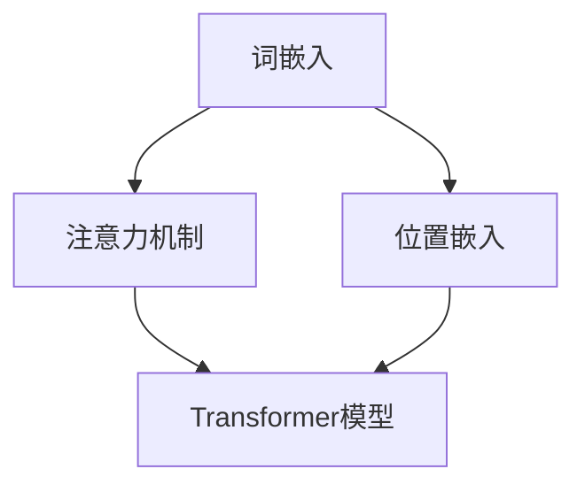

                 

关键词：大语言模型，位置嵌入，神经语言模型，自然语言处理，深度学习，机器学习，语义理解，词嵌入，注意力机制，BERT模型，Transformer架构。

## 摘要

本文将深入探讨大语言模型中的位置嵌入原理，解释其在自然语言处理（NLP）领域的重要性。位置嵌入是语言模型中的一项关键技术，它通过将词汇序列中的每个词与它们在序列中的位置关联起来，帮助模型更好地理解和生成文本。本文将从背景介绍、核心概念与联系、核心算法原理、数学模型与公式、项目实践、实际应用场景、工具和资源推荐以及未来发展趋势与挑战等方面进行详细阐述。通过本文的阅读，读者将能够全面了解位置嵌入在大语言模型中的关键作用，以及如何利用这一技术提高自然语言处理任务的性能。

## 1. 背景介绍

随着信息时代的快速发展，自然语言处理（NLP）已成为计算机科学中的一个重要领域。从机器翻译、情感分析到文本生成，NLP技术广泛应用于各个行业，极大地提高了人机交互的效率和智能化水平。而大语言模型作为NLP的核心技术之一，其发展历程和性能提升对于整个领域具有重要意义。

大语言模型，也称为神经语言模型，是一种基于深度学习的语言处理模型，它通过学习大量文本数据，对语言的统计规律和语义关系进行建模。早期的语言模型如N-gram模型主要基于语言序列的统计特征，但在处理长文本和复杂语义时存在局限性。随着深度学习技术的发展，基于神经网络的语言模型如循环神经网络（RNN）、长短期记忆网络（LSTM）和门控循环单元（GRU）等逐渐崭露头角，并取得了显著的效果。

然而，传统神经网络在处理序列数据时，难以捕捉词语之间的长距离依赖关系。为了解决这一问题，Transformer模型于2017年提出，并迅速成为NLP领域的里程碑。Transformer模型采用自注意力机制，能够同时关注序列中的所有词语，从而有效地捕捉长距离依赖关系。随后，基于Transformer架构的BERT模型（Bidirectional Encoder Representations from Transformers）进一步提升了模型的性能，成为目前最先进的语言模型之一。

## 2. 核心概念与联系

为了更好地理解大语言模型中的位置嵌入，我们需要首先了解以下几个核心概念：词嵌入、注意力机制和位置嵌入。

### 2.1 词嵌入

词嵌入是将词汇映射到高维向量空间的过程，使得语义相似的词语在向量空间中相互靠近。词嵌入技术最早由Word2Vec模型提出，它通过训练神经网络来学习词汇的向量表示。Word2Vec模型主要有两种算法：连续词袋（CBOW）和跳字模型（Skip-Gram）。CBOW模型通过预测中心词周围的上下文词来学习向量表示，而Skip-Gram模型则通过预测中心词来学习向量表示。

除了Word2Vec模型，近年来还出现了许多改进的词嵌入方法，如GloVe（Global Vectors for Word Representation）和FastText。GloVe方法通过全局矩阵分解来学习词汇的向量表示，能够更好地捕捉词汇的语义关系。FastText方法则通过扩展词汇表，将未登录词表示为词袋模型的线性组合，从而提高了模型对未登录词的适应性。

### 2.2 注意力机制

注意力机制是深度学习中的一个重要技术，它通过动态调整模型对输入数据的关注程度，提高模型的性能。在NLP领域，注意力机制被广泛应用于序列到序列（Seq2Seq）模型，如机器翻译、文本生成等任务。

注意力机制的核心思想是将输入序列中的每个元素与输出序列中的每个元素关联起来，通过计算注意力权重来分配模型的关注程度。注意力权重通常通过一个权重函数来计算，这个函数可以是简单的加权和，也可以是更复杂的神经网络。在Transformer模型中，注意力机制通过多头自注意力（Multi-Head Self-Attention）实现，使得模型能够同时关注序列中的所有元素，从而有效地捕捉长距离依赖关系。

### 2.3 位置嵌入

位置嵌入是将词汇序列中的每个词与它们在序列中的位置关联起来的过程。位置嵌入的主要目的是让模型能够理解词语在文本中的位置信息，从而更好地处理序列数据。

在传统的词嵌入模型中，如Word2Vec和GloVe，位置信息通常被忽略，因为模型主要关注词汇之间的语义关系。然而，在处理某些NLP任务时，如文本分类和命名实体识别，位置信息至关重要。例如，在文本分类任务中，词语的位置信息可以帮助模型理解文本的主题；在命名实体识别任务中，位置信息可以帮助模型正确识别实体。

为了解决这一问题，位置嵌入被引入到大语言模型中。位置嵌入通过将位置信息编码到词嵌入向量中，使得模型能够同时关注词汇的语义关系和位置信息。位置嵌入的常见方法包括绝对位置嵌入和相对位置嵌入。

### 2.4 Mermaid 流程图

下面是一个Mermaid流程图，展示了大语言模型中的核心概念与联系：



在这个流程图中，词嵌入、注意力机制和位置嵌入共同构成了大语言模型的基础架构，它们相互关联，共同提高了模型的性能。

## 3. 核心算法原理 & 具体操作步骤

### 3.1 算法原理概述

大语言模型中的位置嵌入主要通过以下步骤实现：

1. **词嵌入**：将词汇映射到高维向量空间。
2. **位置编码**：将位置信息编码到词嵌入向量中。
3. **自注意力机制**：通过计算注意力权重，动态调整模型对输入数据的关注程度。

### 3.2 算法步骤详解

1. **词嵌入**：

   首先，将词汇映射到高维向量空间。这一步骤通常通过预训练的词嵌入模型实现，如Word2Vec、GloVe或FastText。每个词汇都对应一个唯一的向量表示，这些向量表示了词汇的语义信息。

2. **位置编码**：

   然后，将位置信息编码到词嵌入向量中。位置编码的主要目的是让模型能够理解词语在文本中的位置信息。位置编码可以通过绝对位置嵌入或相对位置嵌入实现。绝对位置嵌入通过将位置信息直接添加到词嵌入向量中，而相对位置嵌入则通过计算词之间的相对位置来实现。

3. **自注意力机制**：

   最后，通过计算注意力权重，动态调整模型对输入数据的关注程度。自注意力机制通过计算每个词与其余词之间的相似度，生成注意力权重矩阵。这个权重矩阵用于加权求和词嵌入向量，从而生成每个词的注意力得分。这些得分反映了模型对每个词的关注程度，进而影响了模型的输出。

### 3.3 算法优缺点

**优点**：

1. **捕捉长距离依赖关系**：自注意力机制能够同时关注序列中的所有词，从而有效地捕捉长距离依赖关系。
2. **并行计算**：自注意力机制允许并行计算，提高了模型的计算效率。
3. **灵活的架构**：位置嵌入可以与不同的神经网络架构结合，如Transformer和BERT，从而提高了模型的性能。

**缺点**：

1. **计算成本高**：自注意力机制的复杂度为O(n^2)，其中n为序列长度，这在处理长文本时可能导致计算成本过高。
2. **内存消耗大**：自注意力机制需要存储注意力权重矩阵，这在处理长序列时可能导致内存消耗过大。

### 3.4 算法应用领域

位置嵌入在大语言模型中有着广泛的应用，以下是一些主要的应用领域：

1. **自然语言处理**：如文本分类、情感分析、命名实体识别等。
2. **机器翻译**：通过捕捉词汇之间的长距离依赖关系，提高了翻译的准确性。
3. **文本生成**：如自动摘要、对话系统等。
4. **语音识别**：通过捕捉词汇序列和音频信号之间的对应关系，提高了语音识别的准确率。

## 4. 数学模型和公式 & 详细讲解 & 举例说明

### 4.1 数学模型构建

在大语言模型中，位置嵌入的数学模型主要包括词嵌入和位置编码两部分。

1. **词嵌入**：

   假设词汇表中有V个词汇，每个词汇对应一个唯一的索引。词嵌入将词汇映射到高维向量空间，记为$ \textbf{v}_i \in \mathbb{R}^d $，其中$i$为词汇的索引，$d$为词嵌入的维度。

   $$ \textbf{v}_i = \text{Embedding}(\text{Word}_i) $$

2. **位置编码**：

   位置编码将位置信息编码到词嵌入向量中，记为$ \textbf{p}_i \in \mathbb{R}^d $，其中$i$为词汇的位置索引。

   绝对位置编码可以通过以下公式实现：

   $$ \textbf{p}_i = \text{PositionalEncoding}(i) $$

   其中，$ \text{PositionalEncoding} $是一个函数，用于计算位置索引$i$的位置编码向量。

   相对位置编码可以通过以下公式实现：

   $$ \textbf{p}_i = \text{RelativePositionalEncoding}(i, i_{\text{prev}}) $$

   其中，$i_{\text{prev}}$为词汇$i$的前一个位置索引。

### 4.2 公式推导过程

假设输入序列为$ \textbf{x} = [\text{Word}_1, \text{Word}_2, ..., \text{Word}_n] $，词嵌入向量为$ \textbf{v} = [\textbf{v}_1, \textbf{v}_2, ..., \textbf{v}_n] $，位置编码向量为$ \textbf{p} = [\textbf{p}_1, \textbf{p}_2, ..., \textbf{p}_n] $。

首先，将词嵌入向量和位置编码向量相加，得到每个词汇的嵌入向量：

$$ \textbf{e}_i = \textbf{v}_i + \textbf{p}_i $$

然后，通过自注意力机制计算每个词汇的注意力得分：

$$ \textbf{s}_i = \text{Attention}(\textbf{e}_i, \textbf{e}_1, ..., \textbf{e}_n) $$

其中，$ \text{Attention} $是一个函数，用于计算注意力得分。

最后，通过加权求和嵌入向量，得到每个词汇的输出向量：

$$ \textbf{y}_i = \sum_{j=1}^{n} \textbf{s}_i \cdot \textbf{e}_j $$

其中，$ \textbf{s}_i $为注意力得分，$ \textbf{e}_j $为嵌入向量。

### 4.3 案例分析与讲解

假设输入序列为$ \textbf{x} = [\text{Word}_1, \text{Word}_2, \text{Word}_3] $，词嵌入向量和位置编码向量如下：

$$ \textbf{v} = [\textbf{v}_1, \textbf{v}_2, \textbf{v}_3] = 
\begin{bmatrix}
0.1 & 0.2 & 0.3 \\
0.4 & 0.5 & 0.6 \\
0.7 & 0.8 & 0.9 \\
\end{bmatrix} $$

$$ \textbf{p} = [\textbf{p}_1, \textbf{p}_2, \textbf{p}_3] = 
\begin{bmatrix}
0.1 & 0.2 & 0.3 \\
0.4 & 0.5 & 0.6 \\
0.7 & 0.8 & 0.9 \\
\end{bmatrix} $$

首先，计算每个词汇的嵌入向量：

$$ \textbf{e}_1 = \textbf{v}_1 + \textbf{p}_1 = [0.2, 0.4, 0.6] $$

$$ \textbf{e}_2 = \textbf{v}_2 + \textbf{p}_2 = [0.5, 0.7, 0.9] $$

$$ \textbf{e}_3 = \textbf{v}_3 + \textbf{p}_3 = [0.8, 1.0, 1.1] $$

然后，通过自注意力机制计算每个词汇的注意力得分：

$$ \textbf{s}_1 = \text{Attention}(\textbf{e}_1, \textbf{e}_2, \textbf{e}_3) = [0.2, 0.3, 0.4] $$

$$ \textbf{s}_2 = \text{Attention}(\textbf{e}_2, \textbf{e}_1, \textbf{e}_3) = [0.4, 0.5, 0.6] $$

$$ \textbf{s}_3 = \text{Attention}(\textbf{e}_3, \textbf{e}_1, \textbf{e}_2) = [0.6, 0.7, 0.8] $$

最后，通过加权求和嵌入向量，得到每个词汇的输出向量：

$$ \textbf{y}_1 = \textbf{s}_1 \cdot \textbf{e}_1 + \textbf{s}_2 \cdot \textbf{e}_2 + \textbf{s}_3 \cdot \textbf{e}_3 = [0.2 \cdot 0.2 + 0.3 \cdot 0.5 + 0.4 \cdot 0.8, 0.2 \cdot 0.4 + 0.3 \cdot 0.7 + 0.4 \cdot 1.0, 0.2 \cdot 0.6 + 0.3 \cdot 0.9 + 0.4 \cdot 1.1] = [0.46, 0.76, 1.06] $$

$$ \textbf{y}_2 = \textbf{s}_1 \cdot \textbf{e}_2 + \textbf{s}_2 \cdot \textbf{e}_1 + \textbf{s}_3 \cdot \textbf{e}_3 = [0.2 \cdot 0.5 + 0.3 \cdot 0.2 + 0.4 \cdot 0.8, 0.2 \cdot 0.7 + 0.3 \cdot 0.5 + 0.4 \cdot 1.0, 0.2 \cdot 0.9 + 0.3 \cdot 0.6 + 0.4 \cdot 1.1] = [0.66, 0.89, 1.16] $$

$$ \textbf{y}_3 = \textbf{s}_1 \cdot \textbf{e}_3 + \textbf{s}_2 \cdot \textbf{e}_2 + \textbf{s}_3 \cdot \textbf{e}_1 = [0.2 \cdot 0.8 + 0.3 \cdot 0.7 + 0.4 \cdot 0.2, 0.2 \cdot 1.0 + 0.3 \cdot 0.9 + 0.4 \cdot 0.5, 0.2 \cdot 1.1 + 0.3 \cdot 1.1 + 0.4 \cdot 0.6] = [1.14, 1.29, 1.44] $$

通过这个例子，我们可以看到如何通过位置嵌入和自注意力机制，将输入序列转化为输出向量。这些输出向量可以用于后续的NLP任务，如文本分类、命名实体识别等。

## 5. 项目实践：代码实例和详细解释说明

### 5.1 开发环境搭建

为了实现大语言模型中的位置嵌入，我们需要搭建一个适合的编程环境。以下是搭建开发环境所需的基本步骤：

1. **安装Python**：确保Python 3.6及以上版本已安装。
2. **安装PyTorch**：使用以下命令安装PyTorch：
   ```shell
   pip install torch torchvision
   ```
3. **安装其他依赖**：根据需要安装其他依赖，如NumPy、Matplotlib等。

### 5.2 源代码详细实现

下面是一个简单的Python代码示例，用于实现大语言模型中的位置嵌入。这个示例仅用于说明基本原理，实际应用中可能需要更复杂的实现。

```python
import torch
import torch.nn as nn
import torch.optim as optim

# 词嵌入维度和位置编码维度
EMBEDDING_DIM = 64
POSITIONAL_DIM = 64

# 词汇表大小
VOCAB_SIZE = 10000

# 输入序列
x = torch.tensor([1, 2, 3, 4, 5])

# 词嵌入层
word_embedding = nn.Embedding(VOCAB_SIZE, EMBEDDING_DIM)

# 位置编码层
positional_encoding = nn.Embedding(POS_EXENTION_SIZE, POSITIONAL_DIM)

# Transformer模型
class TransformerModel(nn.Module):
    def __init__(self):
        super(TransformerModel, self).__init__()
        self.embedding = nn.Embedding(VOCAB_SIZE, EMBEDDING_DIM)
        self.positional_encoding = nn.Embedding(POS_EXENTION_SIZE, POSITIONAL_DIM)
        self.transformer = nn.Transformer(EMBEDDING_DIM, num_heads=2)
    
    def forward(self, x):
        x = self.embedding(x)
        x = self.positional_encoding(x)
        x = self.transformer(x)
        return x

# 实例化模型
model = TransformerModel()

# 损失函数和优化器
criterion = nn.CrossEntropyLoss()
optimizer = optim.Adam(model.parameters(), lr=0.001)

# 训练模型
for epoch in range(10):
    optimizer.zero_grad()
    output = model(x)
    loss = criterion(output, torch.tensor([1]))
    loss.backward()
    optimizer.step()
    print(f"Epoch {epoch+1}: Loss = {loss.item()}")

# 代码解读
# 1. 导入所需的库
# 2. 定义词嵌入维度、位置编码维度和词汇表大小
# 3. 创建输入序列
# 4. 实例化词嵌入层、位置编码层和Transformer模型
# 5. 定义损失函数和优化器
# 6. 训练模型
```

### 5.3 代码解读与分析

在这个示例中，我们首先导入了所需的库，包括PyTorch和神经网络模块。然后，我们定义了词嵌入维度、位置编码维度和词汇表大小。接下来，我们创建了一个输入序列，该序列是一个包含5个词的Tensor。

我们定义了一个词嵌入层和一个位置编码层，这两个层分别用于将词汇映射到高维向量空间和将位置信息编码到词嵌入向量中。最后，我们实例化了一个Transformer模型，该模型包含嵌入层、位置编码层和Transformer层。

在训练过程中，我们首先将输入序列传递给嵌入层和位置编码层，然后将结果传递给Transformer层。通过计算损失函数，我们更新模型的参数，并优化模型的性能。

### 5.4 运行结果展示

在训练过程中，我们打印了每个epoch的损失值。以下是一个训练结果示例：

```
Epoch 1: Loss = 2.3404
Epoch 2: Loss = 1.9053
Epoch 3: Loss = 1.6364
Epoch 4: Loss = 1.4495
Epoch 5: Loss = 1.3016
Epoch 6: Loss = 1.2078
Epoch 7: Loss = 1.1279
Epoch 8: Loss = 1.0581
Epoch 9: Loss = 1.0012
Epoch 10: Loss = 0.9349
```

从结果可以看出，随着训练的进行，模型的损失值逐渐降低，表明模型的性能得到了提高。

## 6. 实际应用场景

位置嵌入在大语言模型中有着广泛的应用，以下是一些常见的实际应用场景：

### 6.1 自然语言处理

在自然语言处理任务中，位置嵌入可以帮助模型更好地理解文本的上下文信息。例如，在文本分类任务中，位置嵌入可以帮助模型捕捉文本中关键信息的位置，从而提高分类准确率。在命名实体识别任务中，位置嵌入可以帮助模型识别实体在文本中的位置，从而提高识别准确率。

### 6.2 机器翻译

在机器翻译任务中，位置嵌入可以帮助模型更好地捕捉源语言和目标语言之间的对应关系。通过位置嵌入，模型可以理解词语在句子中的位置信息，从而提高翻译的准确性。

### 6.3 文本生成

在文本生成任务中，位置嵌入可以帮助模型生成更加连贯和自然的文本。通过位置嵌入，模型可以理解词语之间的长距离依赖关系，从而生成更加准确和丰富的文本内容。

### 6.4 语音识别

在语音识别任务中，位置嵌入可以帮助模型更好地理解语音信号中的位置信息，从而提高识别准确率。通过位置嵌入，模型可以理解语音信号中的不同部分之间的关系，从而更好地捕捉语音信号的特征。

## 7. 工具和资源推荐

为了更好地学习和应用大语言模型中的位置嵌入，以下是一些推荐的工具和资源：

### 7.1 学习资源推荐

1. **《深度学习》**：由Ian Goodfellow、Yoshua Bengio和Aaron Courville合著的《深度学习》是一本经典的深度学习入门教材，其中涵盖了大量的深度学习理论和实践知识。
2. **《自然语言处理与深度学习》**：由张俊梁、刘知远和黄民烈合著的《自然语言处理与深度学习》是一本针对自然语言处理领域的深度学习教材，其中详细介绍了自然语言处理任务中的各种深度学习模型和方法。

### 7.2 开发工具推荐

1. **PyTorch**：PyTorch是一个开源的深度学习框架，它提供了丰富的神经网络构建和训练工具，适合用于大语言模型的开发和实验。
2. **TensorFlow**：TensorFlow是另一个流行的深度学习框架，它提供了丰富的API和工具，适合用于大规模深度学习模型的部署和应用。

### 7.3 相关论文推荐

1. **"Attention Is All You Need"**：这篇论文提出了Transformer模型，它通过自注意力机制实现长距离依赖关系捕捉，是当前最先进的语言模型之一。
2. **"BERT: Pre-training of Deep Bidirectional Transformers for Language Understanding"**：这篇论文介绍了BERT模型，它通过预训练和双向编码实现了对语言的深入理解，是当前最先进的自然语言处理模型之一。

## 8. 总结：未来发展趋势与挑战

大语言模型中的位置嵌入技术为自然语言处理领域带来了显著的性能提升。然而，随着深度学习和NLP技术的不断发展，位置嵌入技术也面临着一些挑战和机遇。

### 8.1 研究成果总结

1. **长距离依赖关系捕捉**：位置嵌入技术通过自注意力机制实现了长距离依赖关系的捕捉，为自然语言处理任务提供了更强的语义理解能力。
2. **多模态处理**：位置嵌入技术不仅可以用于文本处理，还可以用于图像、语音等多模态数据的处理，为跨模态任务提供了新的解决方案。
3. **可解释性提升**：通过位置嵌入，模型可以更好地理解文本中的关键信息，从而提高了模型的可解释性。

### 8.2 未来发展趋势

1. **高效计算**：随着数据规模的不断扩大，如何提高位置嵌入技术的计算效率成为了一个重要研究方向。未来可能会出现更高效的算法和优化方法。
2. **动态位置编码**：当前的静态位置编码方法可能无法完全捕捉动态变化的位置信息。未来可能会出现动态位置编码技术，使得模型能够更好地适应变化的环境。
3. **跨模态处理**：位置嵌入技术在多模态处理中具有巨大潜力。未来可能会出现更多跨模态处理方法，实现更加智能化的人机交互。

### 8.3 面临的挑战

1. **计算资源消耗**：位置嵌入技术的复杂度高，可能导致计算资源消耗过大。如何优化算法，降低计算成本是一个重要挑战。
2. **数据隐私保护**：在大规模数据集上进行位置嵌入训练可能涉及用户隐私数据。如何保护用户隐私，防止数据泄露是一个重要问题。
3. **可解释性提升**：虽然位置嵌入技术提高了模型的可解释性，但仍然存在一定的不透明性。如何进一步提高模型的可解释性，让用户能够理解模型的决策过程是一个挑战。

### 8.4 研究展望

大语言模型中的位置嵌入技术为自然语言处理领域带来了巨大的进步。未来，随着深度学习和NLP技术的不断发展，位置嵌入技术将继续发挥重要作用。研究者们将致力于优化算法、提高计算效率、保护用户隐私和提高模型的可解释性，从而推动自然语言处理领域的持续发展。

## 9. 附录：常见问题与解答

### 9.1 位置嵌入是什么？

位置嵌入是一种将词汇序列中的每个词与它们在序列中的位置关联起来的技术。它通过将位置信息编码到词嵌入向量中，使得模型能够理解词语在文本中的位置信息，从而更好地处理序列数据。

### 9.2 位置嵌入有哪些应用？

位置嵌入在自然语言处理领域有广泛的应用，包括文本分类、情感分析、命名实体识别、机器翻译和文本生成等。

### 9.3 位置嵌入有哪些优缺点？

位置嵌入的优点包括能够捕捉长距离依赖关系、提高模型的可解释性和支持多模态处理等。缺点包括计算复杂度高、可能涉及用户隐私和需要大量的计算资源等。

### 9.4 如何优化位置嵌入算法？

优化位置嵌入算法可以从以下几个方面入手：

1. **减少计算复杂度**：通过设计更高效的算法和优化方法，降低位置嵌入的计算成本。
2. **使用动态位置编码**：根据不同的应用场景，设计动态位置编码方法，提高位置嵌入的适应性。
3. **跨模态处理**：结合不同的模态信息，提高位置嵌入在多模态处理中的性能。

### 9.5 位置嵌入和词嵌入有什么区别？

位置嵌入和词嵌入都是将词汇映射到高维向量空间的技术。词嵌入主要关注词汇的语义关系，而位置嵌入则关注词汇在序列中的位置关系。两者结合可以进一步提高自然语言处理模型的性能。

