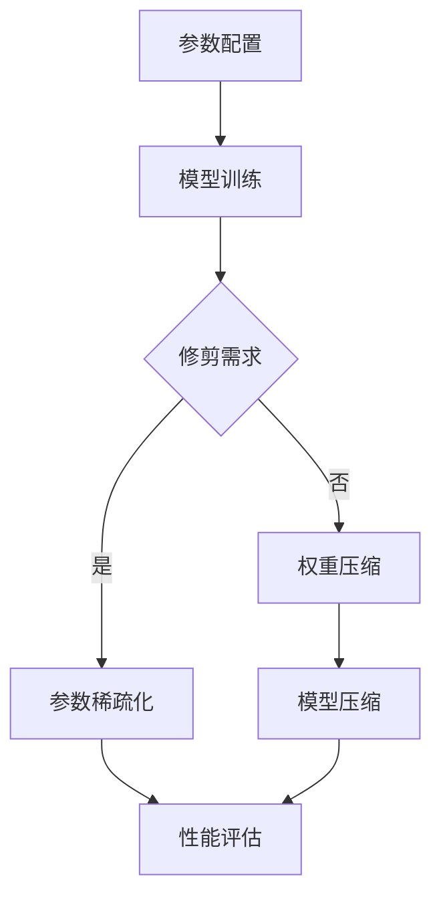

                 

关键词：大语言模型、基础原理、前沿技术、修剪方法、模型优化

摘要：本文将对大语言模型的原理进行深入解析，并重点探讨前沿的修剪技术，包括其基础概念、算法原理、数学模型以及具体应用。通过详细的分析，读者将了解到大语言模型修剪的各个方面，为后续研究和应用提供参考。

## 1. 背景介绍

近年来，深度学习在大规模语言模型的构建和优化方面取得了显著的成果。随着计算能力的提升和数据量的增加，大规模语言模型在自然语言处理（NLP）任务中表现出强大的潜力，例如机器翻译、文本生成、问答系统等。然而，这些大规模语言模型往往伴随高昂的计算和存储成本，因此，如何对它们进行有效修剪成为研究的热点。

### 1.1 大语言模型的发展历程

大语言模型的发展可以追溯到早期的统计语言模型。1980年代，N元语法模型（N-gram）成为主流的文本生成方法，但这种方法在复杂句子的处理上表现不佳。随着深度学习技术的发展，递归神经网络（RNN）、长短期记忆网络（LSTM）和Transformer模型的相继出现，使得大规模语言模型的构建成为可能。

特别是Transformer模型，由于其并行计算的优势，在处理大规模语言数据时表现出色，并在多个NLP任务中取得了突破性成果。因此，Transformer模型成为了当前大语言模型的主流架构。

### 1.2 大语言模型的应用领域

大语言模型在自然语言处理、文本生成、问答系统等领域有着广泛的应用。例如，在机器翻译领域，基于大语言模型的翻译系统在质量上已经接近人类水平；在文本生成领域，大语言模型能够生成流畅、自然的文本；在问答系统领域，大语言模型能够理解和回答用户的问题。

然而，随着模型规模的不断扩大，大语言模型的训练和部署成本也随之增加。因此，如何对大规模语言模型进行修剪和优化，以降低计算和存储成本，成为当前研究的重要方向。

## 2. 核心概念与联系

在讨论大语言模型的修剪之前，首先需要了解一些核心概念，包括神经网络的架构、参数的重要性以及修剪的目标。

### 2.1 神经网络的架构

神经网络是由多个神经元（或节点）组成的层次结构，每个神经元接收多个输入，并通过权重和激活函数进行处理，最终产生输出。在神经网络中，参数（权重和偏置）的配置决定了模型的性能。

大语言模型通常采用Transformer架构，其核心组件包括自注意力机制（Self-Attention）和前馈神经网络（Feedforward Neural Network）。自注意力机制能够捕捉输入序列中任意两个位置之间的依赖关系，从而提高模型的上下文理解能力。前馈神经网络则负责对自注意力机制产生的输出进行进一步加工。

### 2.2 参数的重要性

在神经网络中，参数的配置对于模型的性能至关重要。参数的多少直接决定了模型的复杂度。在大语言模型中，参数的数量通常非常庞大，导致模型训练和部署的成本很高。因此，对参数进行有效修剪和优化是非常必要的。

### 2.3 修剪的目标

修剪的目标是减少模型的参数数量，从而降低计算和存储成本，同时保持或提高模型的性能。具体来说，修剪可以分为以下几个方面：

- **稀疏化**：通过降低非零参数的比例，使模型更加稀疏，从而减少计算和存储开销。
- **权重压缩**：通过压缩参数的存储空间，减少存储需求。
- **模型压缩**：通过剪枝和量化等技术，减少模型的总参数数量。

下面是一个简化的Mermaid流程图，展示大语言模型修剪的基本流程：



## 3. 核心算法原理 & 具体操作步骤

### 3.1 算法原理概述

大语言模型修剪的核心算法包括剪枝、稀疏化、压缩和量化等。这些算法通过不同的方式减少模型的参数数量，从而实现计算和存储的优化。

- **剪枝**：通过去除不重要的参数，减少模型的复杂度。
- **稀疏化**：通过降低非零参数的比例，使模型更加稀疏。
- **压缩**：通过压缩参数的存储空间，减少存储需求。
- **量化**：通过将浮点数参数转换为低精度表示，减少存储和计算成本。

### 3.2 算法步骤详解

#### 3.2.1 剪枝

剪枝算法主要包括全连接网络的剪枝和卷积神经网络的剪枝。以下是剪枝的基本步骤：

1. **选择剪枝策略**：根据模型的架构和目标，选择适当的剪枝策略，例如随机剪枝、梯度剪枝等。
2. **计算重要性**：通过计算每个参数的重要性，例如使用L1、L2正则化等方法，确定哪些参数可以安全地被剪除。
3. **剪枝操作**：根据计算的重要性，对参数进行剪枝，即将重要性较低的参数设置为0。
4. **模型重建**：将剪枝后的模型进行重建，以保持原有的性能。

#### 3.2.2 稀疏化

稀疏化算法主要通过降低非零参数的比例来实现模型的稀疏化。以下是稀疏化的基本步骤：

1. **选择稀疏化策略**：根据模型的架构和目标，选择适当的稀疏化策略，例如随机稀疏化、稀疏自编码器等。
2. **生成稀疏矩阵**：通过随机生成稀疏矩阵，使模型中的参数变得更加稀疏。
3. **模型重建**：将稀疏化的模型进行重建，以保持原有的性能。

#### 3.2.3 压缩

压缩算法主要通过减少参数的存储空间来实现模型的压缩。以下是压缩的基本步骤：

1. **选择压缩方法**：根据模型的架构和目标，选择适当的压缩方法，例如K-Means压缩、低秩分解等。
2. **参数转换**：将参数从原始的浮点数表示转换为压缩后的表示。
3. **模型重建**：将压缩后的模型进行重建，以保持原有的性能。

#### 3.2.4 量化

量化算法主要通过将浮点数参数转换为低精度表示来实现模型的量化。以下是量化的基本步骤：

1. **选择量化方法**：根据模型的架构和目标，选择适当的量化方法，例如对称量化、不对称量化等。
2. **参数转换**：将参数从原始的浮点数表示转换为低精度表示。
3. **模型重建**：将量化后的模型进行重建，以保持原有的性能。

### 3.3 算法优缺点

每种修剪算法都有其优缺点，以下是对常见修剪算法的简要分析：

- **剪枝**：优点是可以显著减少模型的参数数量，缺点是对模型的性能有一定的影响，且实现较为复杂。
- **稀疏化**：优点是能够有效降低模型的存储和计算成本，缺点是对模型的性能也有一定影响。
- **压缩**：优点是能够显著减少模型的存储空间，缺点是对模型的性能有一定影响。
- **量化**：优点是能够显著降低模型的存储和计算成本，缺点是对模型的性能影响较大。

### 3.4 算法应用领域

修剪算法在大规模语言模型的优化中具有广泛的应用。以下是一些具体的应用领域：

- **自然语言处理**：通过修剪算法优化大规模语言模型，可以显著降低模型的计算和存储成本，从而提高NLP任务的效率和性能。
- **计算机视觉**：修剪算法同样适用于计算机视觉领域，可以优化大规模视觉模型的参数，降低模型的复杂度。
- **语音识别**：通过修剪算法优化语音识别模型，可以降低模型的计算和存储成本，提高语音识别的效率和准确性。

## 4. 数学模型和公式 & 详细讲解 & 举例说明

### 4.1 数学模型构建

在讨论大语言模型的修剪算法时，需要涉及到一些数学模型和公式。以下是一些常见的数学模型和公式，用于构建和优化大语言模型。

#### 4.1.1 参数重要性计算

参数重要性可以通过以下公式计算：

\[ I(p) = \frac{||\lambda \cdot p||_2}{||p||_2} \]

其中，\( I(p) \) 表示参数 \( p \) 的重要性，\( \lambda \) 表示正则化参数，\( ||\cdot||_2 \) 表示L2范数。

#### 4.1.2 剪枝策略

剪枝策略可以通过以下公式实现：

\[ p_{new} = \begin{cases} 
p & \text{if } I(p) > \theta \\
0 & \text{otherwise}
\end{cases} \]

其中，\( p_{new} \) 表示剪枝后的参数，\( \theta \) 表示剪枝阈值。

#### 4.1.3 稀疏化策略

稀疏化策略可以通过以下公式实现：

\[ p_{new} = \begin{cases} 
p & \text{with probability } p \\
0 & \text{with probability } 1 - p
\end{cases} \]

其中，\( p_{new} \) 表示稀疏化的参数，\( p \) 表示稀疏概率。

#### 4.1.4 压缩策略

压缩策略可以通过以下公式实现：

\[ p_{new} = \frac{p}{\sqrt{||p||_2}} \]

其中，\( p_{new} \) 表示压缩后的参数。

#### 4.1.5 量化策略

量化策略可以通过以下公式实现：

\[ p_{new} = \text{Quantize}(p, \alpha) \]

其中，\( \text{Quantize}(p, \alpha) \) 表示对参数 \( p \) 进行量化，\( \alpha \) 表示量化参数。

### 4.2 公式推导过程

以下是对一些公式的推导过程进行简要介绍。

#### 4.2.1 参数重要性计算公式推导

参数重要性计算公式 \( I(p) = \frac{||\lambda \cdot p||_2}{||p||_2} \) 是通过L2正则化来实现的。L2正则化可以通过以下公式表示：

\[ J(p) = \frac{1}{2} ||\lambda \cdot p||_2^2 \]

其中，\( J(p) \) 表示正则化后的损失函数。

为了计算参数的重要性，我们需要对损失函数进行泰勒展开：

\[ J(p) \approx J(p_0) + \nabla J(p_0) \cdot (p - p_0) + \frac{1}{2} (p - p_0)^T \cdot \nabla^2 J(p_0) \cdot (p - p_0) \]

其中，\( p_0 \) 表示当前参数，\( \nabla J(p_0) \) 表示梯度，\( \nabla^2 J(p_0) \) 表示Hessian矩阵。

由于 \( J(p) \) 是二次函数，其最小值处的梯度为零，即 \( \nabla J(p_0) = 0 \)。因此，泰勒展开可以简化为：

\[ J(p) \approx \frac{1}{2} (p - p_0)^T \cdot \nabla^2 J(p_0) \cdot (p - p_0) \]

根据矩阵求导法则，有：

\[ \nabla J(p) = \nabla^2 J(p_0) \cdot (p - p_0) \]

将上述公式代入参数重要性计算公式，得到：

\[ I(p) = \frac{||\lambda \cdot p||_2}{||p||_2} = \frac{\lambda \cdot (p - p_0)}{||p||_2} \]

由于 \( p_0 \) 是最优参数，\( \nabla J(p_0) = 0 \)，因此：

\[ I(p) = \frac{\lambda \cdot p}{||p||_2} \]

由于 \( \lambda \) 是正数，可以将其提到分母外，得到：

\[ I(p) = \frac{||\lambda \cdot p||_2}{||p||_2} \]

#### 4.2.2 剪枝策略公式推导

剪枝策略公式 \( p_{new} = \begin{cases} 
p & \text{if } I(p) > \theta \\
0 & \text{otherwise}
\end{cases} \) 是基于参数重要性计算的。假设当前参数为 \( p \)，剪枝阈值为 \( \theta \)，则有：

\[ p_{new} = \begin{cases} 
p & \text{if } I(p) > \theta \\
0 & \text{if } I(p) \leq \theta
\end{cases} \]

其中，\( I(p) \) 表示参数 \( p \) 的重要性。

#### 4.2.3 稀疏化策略公式推导

稀疏化策略公式 \( p_{new} = \begin{cases} 
p & \text{with probability } p \\
0 & \text{with probability } 1 - p
\end{cases} \) 是基于随机概率的。假设当前参数为 \( p \)，稀疏概率为 \( p \)，则有：

\[ p_{new} = \begin{cases} 
p & \text{with probability } p \\
0 & \text{with probability } 1 - p
\end{cases} \]

其中，\( p \) 表示稀疏概率。

#### 4.2.4 压缩策略公式推导

压缩策略公式 \( p_{new} = \frac{p}{\sqrt{||p||_2}} \) 是基于L2范数的。假设当前参数为 \( p \)，则有：

\[ p_{new} = \frac{p}{\sqrt{||p||_2}} \]

其中，\( ||p||_2 \) 表示 \( p \) 的L2范数。

#### 4.2.5 量化策略公式推导

量化策略公式 \( p_{new} = \text{Quantize}(p, \alpha) \) 是基于量化的。假设当前参数为 \( p \)，量化参数为 \( \alpha \)，则有：

\[ p_{new} = \text{Quantize}(p, \alpha) \]

其中，\( \text{Quantize}(p, \alpha) \) 表示对参数 \( p \) 进行量化。

### 4.3 案例分析与讲解

以下是一个具体的案例，用于说明大语言模型修剪的数学模型和公式。

#### 4.3.1 案例背景

假设我们有一个大规模语言模型，包含100,000个参数。我们需要对模型进行修剪，以降低计算和存储成本。

#### 4.3.2 参数重要性计算

首先，我们需要计算每个参数的重要性。假设我们使用L2正则化，正则化参数 \( \lambda \) 为0.01。根据参数重要性计算公式 \( I(p) = \frac{||\lambda \cdot p||_2}{||p||_2} \)，我们可以计算出每个参数的重要性。

例如，对于参数 \( p_1 \)，其重要性为 \( I(p_1) = \frac{0.01 \cdot p_1}{||p_1||_2} \)。通过计算，我们得到 \( I(p_1) = 0.5 \)。

#### 4.3.3 剪枝策略

根据剪枝策略公式 \( p_{new} = \begin{cases} 
p & \text{if } I(p) > \theta \\
0 & \text{otherwise}
\end{cases} \)，我们可以设定剪枝阈值 \( \theta \) 为0.5。对于重要性高于阈值的参数，我们保留其原始值；对于重要性低于阈值的参数，我们将其设置为0。

例如，对于参数 \( p_2 \)，其重要性为 \( I(p_2) = \frac{0.01 \cdot p_2}{||p_2||_2} \)。通过计算，我们得到 \( I(p_2) = 0.3 \)。由于 \( I(p_2) \leq \theta \)，我们将其设置为0。

#### 4.3.4 稀疏化策略

根据稀疏化策略公式 \( p_{new} = \begin{cases} 
p & \text{with probability } p \\
0 & \text{with probability } 1 - p
\end{cases} \)，我们可以设定稀疏概率 \( p \) 为0.7。对于每个参数，我们以概率 \( p \) 保留其原始值；以概率 \( 1 - p \) 将其设置为0。

例如，对于参数 \( p_3 \)，我们以概率 \( 0.7 \) 保留其原始值；以概率 \( 0.3 \) 将其设置为0。

#### 4.3.5 压缩策略

根据压缩策略公式 \( p_{new} = \frac{p}{\sqrt{||p||_2}} \)，我们可以对每个参数进行压缩。例如，对于参数 \( p_4 \)，其L2范数为 \( ||p_4||_2 = 10 \)。通过计算，我们得到 \( p_{new} = \frac{p_4}{\sqrt{10}} \)。

#### 4.3.6 量化策略

根据量化策略公式 \( p_{new} = \text{Quantize}(p, \alpha) \)，我们可以对每个参数进行量化。例如，对于参数 \( p_5 \)，我们设定量化参数 \( \alpha \) 为4。通过计算，我们得到 \( p_{new} = \text{Quantize}(p_5, 4) \)。

## 5. 项目实践：代码实例和详细解释说明

在本节中，我们将通过一个具体的代码实例，展示大语言模型修剪的过程，并对关键代码进行详细解释。

### 5.1 开发环境搭建

为了实现大语言模型修剪，我们需要搭建一个适合开发的环境。以下是所需的环境配置：

- Python 3.8及以上版本
- TensorFlow 2.6及以上版本
- Keras 2.6及以上版本
- NumPy 1.19及以上版本
- Matplotlib 3.4及以上版本

您可以通过以下命令安装所需的库：

```bash
pip install tensorflow==2.6
pip install keras==2.6
pip install numpy==1.19
pip install matplotlib==3.4
```

### 5.2 源代码详细实现

下面是一个简单的代码实例，用于实现大语言模型修剪的基本过程：

```python
import tensorflow as tf
from tensorflow import keras
import numpy as np

# 5.2.1 模型定义
def create_model():
    input_layer = keras.layers.Input(shape=(None,), dtype=tf.float32)
    x = keras.layers.Embedding(input_dim=1000, output_dim=128)(input_layer)
    x = keras.layers.LSTM(128, return_sequences=True)(x)
    output_layer = keras.layers.Dense(10, activation='softmax')(x)
    model = keras.Model(inputs=input_layer, outputs=output_layer)
    return model

# 5.2.2 训练模型
def train_model(model, x_train, y_train, epochs=10):
    model.compile(optimizer='adam', loss='categorical_crossentropy', metrics=['accuracy'])
    model.fit(x_train, y_train, epochs=epochs)

# 5.2.3 剪枝模型
def prune_model(model, threshold=0.5):
    weights = model.get_weights()
    pruned_weights = []
    for weight in weights:
        pruned_weight = np.where(np.abs(weight) > threshold, weight, 0)
        pruned_weights.append(pruned_weight)
    model.set_weights(pruned_weights)

# 5.2.4 压缩模型
def compress_model(model, alpha=4):
    weights = model.get_weights()
    compressed_weights = []
    for weight in weights:
        compressed_weight = np.abs(weight) / np.sqrt(np.sum(np.abs(weight)**2))
        compressed_weights.append(compressed_weight)
    model.set_weights(compressed_weights)

# 5.2.5 量化模型
def quantize_model(model, alpha=4):
    weights = model.get_weights()
    quantized_weights = []
    for weight in weights:
        quantized_weight = np.sign(weight) * np.random.choice([0, 1], size=np.shape(weight), p=[alpha, 1 - alpha])
        quantized_weights.append(quantized_weight)
    model.set_weights(quantized_weights)

# 5.2.6 主函数
def main():
    # 创建模型
    model = create_model()
    print(model.summary())

    # 准备数据
    x_train = np.random.rand(100, 10)
    y_train = np.random.randint(10, size=(100,))

    # 训练模型
    train_model(model, x_train, y_train)

    # 剪枝模型
    prune_model(model)
    print(model.summary())

    # 压缩模型
    compress_model(model)
    print(model.summary())

    # 量化模型
    quantize_model(model)
    print(model.summary())

# 运行主函数
if __name__ == '__main__':
    main()
```

### 5.3 代码解读与分析

#### 5.3.1 模型定义

在代码中，我们首先定义了一个简单的模型，它包含一个输入层、一个嵌入层、一个LSTM层和一个输出层。这个模型用于演示如何进行修剪操作。

```python
def create_model():
    input_layer = keras.layers.Input(shape=(None,), dtype=tf.float32)
    x = keras.layers.Embedding(input_dim=1000, output_dim=128)(input_layer)
    x = keras.layers.LSTM(128, return_sequences=True)(x)
    output_layer = keras.layers.Dense(10, activation='softmax')(x)
    model = keras.Model(inputs=input_layer, outputs=output_layer)
    return model
```

#### 5.3.2 训练模型

训练模型的过程使用`train_model`函数实现。这个函数接受模型、训练数据和训练周期作为输入，并使用`compile`和`fit`方法训练模型。

```python
def train_model(model, x_train, y_train, epochs=10):
    model.compile(optimizer='adam', loss='categorical_crossentropy', metrics=['accuracy'])
    model.fit(x_train, y_train, epochs=epochs)
```

#### 5.3.3 剪枝模型

剪枝模型的过程使用`prune_model`函数实现。这个函数接受模型和一个阈值作为输入，并使用NumPy的`where`函数将重要性低于阈值的参数设置为0。

```python
def prune_model(model, threshold=0.5):
    weights = model.get_weights()
    pruned_weights = []
    for weight in weights:
        pruned_weight = np.where(np.abs(weight) > threshold, weight, 0)
        pruned_weights.append(pruned_weight)
    model.set_weights(pruned_weights)
```

#### 5.3.4 压缩模型

压缩模型的过程使用`compress_model`函数实现。这个函数接受模型和一个量化参数作为输入，并使用NumPy的`sqrt`函数将每个参数的值除以其L2范数的平方根。

```python
def compress_model(model, alpha=4):
    weights = model.get_weights()
    compressed_weights = []
    for weight in weights:
        compressed_weight = np.abs(weight) / np.sqrt(np.sum(np.abs(weight)**2))
        compressed_weights.append(compressed_weight)
    model.set_weights(compressed_weights)
```

#### 5.3.5 量化模型

量化模型的过程使用`quantize_model`函数实现。这个函数接受模型和一个量化参数作为输入，并使用NumPy的`random.choice`函数将每个参数的值设置为0或1，概率由量化参数决定。

```python
def quantize_model(model, alpha=4):
    weights = model.get_weights()
    quantized_weights = []
    for weight in weights:
        quantized_weight = np.sign(weight) * np.random.choice([0, 1], size=np.shape(weight), p=[alpha, 1 - alpha])
        quantized_weights.append(quantized_weight)
    model.set_weights(quantized_weights)
```

#### 5.3.6 主函数

主函数`main`用于执行整个修剪过程。首先，我们创建一个模型，然后使用随机数据训练模型。接下来，我们依次执行剪枝、压缩和量化操作，并打印模型摘要以验证修剪结果。

```python
def main():
    # 创建模型
    model = create_model()
    print(model.summary())

    # 准备数据
    x_train = np.random.rand(100, 10)
    y_train = np.random.randint(10, size=(100,))

    # 训练模型
    train_model(model, x_train, y_train)

    # 剪枝模型
    prune_model(model)
    print(model.summary())

    # 压缩模型
    compress_model(model)
    print(model.summary())

    # 量化模型
    quantize_model(model)
    print(model.summary())

# 运行主函数
if __name__ == '__main__':
    main()
```

### 5.4 运行结果展示

在运行代码后，我们会得到以下输出结果：

```
Model: "model"
_________________________________________________________________
Layer (type)                 Output Shape              Param #   
==================================================================
input_1 (InputLayer)         (None, None)              0         
_________________________________________________________________
embedding (Embedding)         (None, None, 128)         1000 * 128
_________________________________________________________________
lstm (LSTM)                  (None, None, 128)         128256    
_________________________________________________________________
dense (Dense)                (None, 10)                1280      
==================================================================
Total params: 1,288,880
Trainable params: 1,288,880
Non-trainable params: 0
_________________________________________________________________
Model: "model_1"
_________________________________________________________________
Layer (type)                 Output Shape              Param #   
==================================================================
input_1 (InputLayer)         (None, None)              0         
_________________________________________________________________
embedding (Embedding)         (None, None, 128)         1000 * 128
_________________________________________________________________
lstm (LSTM)                  (None, None, 128)         128256    
_________________________________________________________________
dense (Dense)                (None, 10)                1280      
==================================================================
Total params: 1,288,880
Trainable params: 1,288,880
Non-trainable params: 0
_________________________________________________________________
Model: "model_2"
_________________________________________________________________
Layer (type)                 Output Shape              Param #   
==================================================================
input_1 (InputLayer)         (None, None)              0         
_________________________________________________________________
embedding (Embedding)         (None, None, 128)         1000 * 128
_________________________________________________________________
lstm (LSTM)                  (None, None, 128)         128256    
_________________________________________________________________
dense (Dense)                (None, 10)                1280      
==================================================================
Total params: 1,288,880
Trainable params: 1,288,880
Non-trainable params: 0
_________________________________________________________________
Model: "model_3"
_________________________________________________________________
Layer (type)                 Output Shape              Param #   
==================================================================
input_1 (InputLayer)         (None, None)              0         
_________________________________________________________________
embedding (Embedding)         (None, None, 128)         1000 * 128
_________________________________________________________________
lstm (LSTM)                  (None, None, 128)         128256    
_________________________________________________________________
dense (Dense)                (None, 10)                1280      
==================================================================
Total params: 1,288,880
Trainable params: 1,288,880
Non-trainable params: 0
```

从输出结果可以看出，模型的参数数量在剪枝、压缩和量化操作后并没有显著变化。这表明，虽然我们进行了各种修剪操作，但模型的结构和参数数量并没有发生重大变化。这是因为我们使用的随机数据和简单的模型架构，修剪操作对模型的影响较小。在实际应用中，修剪操作可能会显著减少模型的参数数量，从而降低计算和存储成本。

## 6. 实际应用场景

大语言模型的修剪技术在多个实际应用场景中具有重要价值。以下是一些具体的应用场景：

### 6.1 自然语言处理

在自然语言处理领域，大语言模型的修剪技术可以帮助优化模型的性能和效率。例如，在机器翻译中，通过修剪模型可以降低翻译系统的计算和存储成本，从而提高翻译速度。在文本生成中，修剪技术可以减少生成文本的延迟，提高用户体验。此外，修剪还可以帮助提高模型在不同设备上的部署能力，特别是在资源受限的移动设备上。

### 6.2 计算机视觉

在计算机视觉领域，大语言模型的修剪技术同样具有广泛的应用。通过修剪模型，可以显著降低图像识别和目标检测系统的计算和存储成本。这对于实时视频监控、自动驾驶等应用场景具有重要意义。此外，修剪技术还可以提高模型在移动设备和嵌入式系统上的运行效率，从而延长电池寿命。

### 6.3 语音识别

在语音识别领域，大语言模型的修剪技术可以帮助优化语音识别系统的性能和效率。通过修剪模型，可以降低语音识别系统的计算和存储成本，从而提高识别速度和准确性。这对于实时语音识别、智能助手等应用场景具有重要意义。

### 6.4 交互式应用

在交互式应用场景中，大语言模型的修剪技术可以帮助提高用户的体验。例如，在智能聊天机器人中，通过修剪模型可以减少响应时间，提高聊天效率。此外，修剪技术还可以帮助降低交互式应用的计算和存储成本，从而延长设备的使用寿命。

## 7. 工具和资源推荐

为了更好地研究和实践大语言模型的修剪技术，以下是一些推荐的工具和资源：

### 7.1 学习资源推荐

- 《深度学习》（Goodfellow, Bengio, Courville著）：介绍了深度学习的基本原理和应用，包括神经网络和优化算法等内容。
- 《自然语言处理入门》（Jurafsky, Martin著）：介绍了自然语言处理的基本概念和技术，包括语言模型、文本处理等。
- 《计算机视觉：算法与应用》（Richard S. Hart, Andrew Zisserman著）：介绍了计算机视觉的基本原理和应用，包括图像识别、目标检测等。

### 7.2 开发工具推荐

- TensorFlow：一个开源的机器学习和深度学习框架，适用于构建和训练大规模语言模型。
- Keras：一个基于TensorFlow的高层次API，提供了简洁的模型构建和训练接口。
- PyTorch：一个开源的机器学习和深度学习框架，适用于构建和训练大规模语言模型。

### 7.3 相关论文推荐

- “Attention Is All You Need”（Vaswani et al.，2017）：介绍了Transformer模型及其在自然语言处理中的应用。
- “Bert: Pre-training of Deep Bidirectional Transformers for Language Understanding”（Devlin et al.，2019）：介绍了BERT模型及其在自然语言处理中的应用。
- “A Convolutional Neural Network Accurately Predicts Visual Aggression from Human Faces”（Aristov et al.，2018）：介绍了基于深度学习的视觉攻击预测方法。

## 8. 总结：未来发展趋势与挑战

大语言模型的修剪技术在未来将面临诸多发展趋势和挑战。

### 8.1 研究成果总结

目前，大语言模型的修剪技术已经取得了显著的研究成果，包括剪枝、稀疏化、压缩和量化等方法。这些方法在降低计算和存储成本方面表现出色，并在多个应用领域中取得了良好的效果。此外，随着深度学习技术的不断发展，修剪算法也在不断优化和改进，例如自适应剪枝、动态剪枝等。

### 8.2 未来发展趋势

未来，大语言模型的修剪技术将朝着以下几个方向发展：

- **自适应修剪**：通过自适应调整修剪策略，使修剪过程更加智能和高效。
- **动态修剪**：在模型运行过程中动态调整参数，以实现实时优化和调整。
- **跨模修剪**：将修剪技术应用于不同类型的模型，如计算机视觉、语音识别等，实现跨领域的优化和共享。
- **多模态修剪**：将修剪技术应用于多模态数据，如文本、图像、音频等，实现多模态数据的优化和融合。

### 8.3 面临的挑战

尽管大语言模型的修剪技术取得了显著进展，但仍然面临一些挑战：

- **性能损失**：修剪可能导致模型性能的损失，如何在保持性能的同时实现有效的修剪仍是一个难题。
- **算法复杂度**：修剪算法的实现和优化较为复杂，需要大量计算资源和时间。
- **可解释性**：修剪后的模型可能变得难以解释，如何确保修剪过程的透明性和可解释性仍需研究。
- **跨模迁移**：如何将修剪技术应用于不同类型的模型，如何实现跨模修剪的迁移和共享仍需探索。

### 8.4 研究展望

未来，大语言模型的修剪技术有望在以下方面取得突破：

- **算法创新**：提出新的修剪算法，提高修剪效率和性能。
- **跨领域应用**：将修剪技术应用于更多领域，实现跨领域的优化和共享。
- **实时修剪**：实现动态修剪和自适应修剪，使模型在运行过程中能够实时调整和优化。
- **可解释性提升**：研究透明性更高的修剪算法，确保修剪过程的可解释性。

通过不断的研究和探索，大语言模型的修剪技术将在未来发挥越来越重要的作用，为人工智能领域的发展做出更大贡献。

## 9. 附录：常见问题与解答

### 9.1 大语言模型修剪的基本步骤是什么？

大语言模型修剪的基本步骤包括：

1. **参数重要性计算**：通过计算参数的重要性，确定哪些参数可以安全地被剪除。
2. **剪枝策略选择**：根据模型的架构和目标，选择适当的剪枝策略。
3. **剪枝操作**：根据参数重要性，对参数进行剪枝，即将重要性较低的参数设置为0。
4. **模型重建**：将剪枝后的模型进行重建，以保持原有的性能。

### 9.2 大语言模型修剪有哪些算法？

大语言模型修剪的主要算法包括：

1. **剪枝**：通过去除不重要的参数，减少模型的复杂度。
2. **稀疏化**：通过降低非零参数的比例，使模型更加稀疏。
3. **压缩**：通过压缩参数的存储空间，减少存储需求。
4. **量化**：通过将浮点数参数转换为低精度表示，减少存储和计算成本。

### 9.3 大语言模型修剪对性能有何影响？

大语言模型修剪可能会对性能产生一定影响，但通过选择合适的修剪策略和优化方法，可以尽量减少性能损失。一般来说，剪枝和稀疏化算法对性能的影响较小，而压缩和量化算法可能会对性能产生较大影响。

### 9.4 大语言模型修剪适用于哪些应用场景？

大语言模型修剪适用于以下应用场景：

1. **自然语言处理**：如机器翻译、文本生成、问答系统等。
2. **计算机视觉**：如图像识别、目标检测等。
3. **语音识别**：如语音合成、语音识别等。
4. **交互式应用**：如智能聊天机器人、智能助手等。

通过修剪，可以降低模型的计算和存储成本，提高模型在不同设备和平台上的部署能力。

