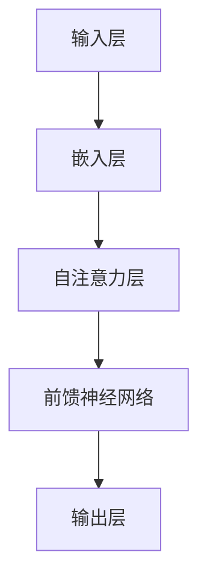

                 

关键词：大语言模型、节省内存、设计原理、算法优化、性能提升

摘要：本文将深入探讨大语言模型的基本原理，并着重介绍如何在设计和实现过程中采用其他节省内存的技术。通过对核心概念的详细讲解和实际应用的案例分析，本文旨在为读者提供一套完整的大语言模型原理基础与前沿节省内存的设计方法。

## 1. 背景介绍

随着互联网的飞速发展和大数据时代的到来，自然语言处理（NLP）成为人工智能领域的一个重要分支。其中，大语言模型因其强大的文本理解和生成能力，在诸如机器翻译、问答系统、文本摘要等领域展现出了卓越的性能。然而，大语言模型的训练和部署过程中面临着巨大的计算资源和存储资源的挑战。为了解决这个问题，本文将探讨其他节省内存的设计方法，以提升大语言模型的性能和可扩展性。

## 2. 核心概念与联系

在深入探讨大语言模型之前，我们需要理解一些核心概念，包括神经网络的架构、注意力机制、Transformer模型等。

### 2.1 神经网络架构

神经网络是构建大语言模型的基础，其核心思想是通过多层非线性变换来提取输入数据的特征。典型的神经网络架构包括输入层、隐藏层和输出层。输入层接收外部输入，隐藏层通过激活函数进行特征提取，输出层产生预测结果。

### 2.2 注意力机制

注意力机制（Attention Mechanism）是一种在序列数据处理中广泛应用的机制，它能够自动地关注序列中重要的部分，从而提高模型的性能。在自然语言处理中，注意力机制可以帮助模型更好地理解上下文信息，提高文本生成的准确性。

### 2.3 Transformer模型

Transformer模型是近年来发展起来的一种基于自注意力机制的深度神经网络模型，其在机器翻译、文本生成等领域取得了显著的成绩。Transformer模型通过多头自注意力机制和前馈神经网络结构，实现了对输入序列的全局上下文信息处理。

### 2.4 Mermaid 流程图

以下是一个简化的Mermaid流程图，展示了大语言模型的核心概念和架构：



## 3. 核心算法原理 & 具体操作步骤

### 3.1 算法原理概述

大语言模型的训练过程主要包括两个阶段：预训练和微调。在预训练阶段，模型通过大量无监督数据学习语言特征；在微调阶段，模型通过有监督数据进一步学习特定任务的特征。核心算法原理包括：

1. **嵌入层**：将输入的单词或字符转换为向量表示。
2. **自注意力层**：通过计算序列中每个元素与其他元素之间的关联性，实现全局上下文信息的捕捉。
3. **前馈神经网络**：对自注意力层的输出进行进一步的特征提取和压缩。
4. **输出层**：生成最终的预测结果，如单词或句子。

### 3.2 算法步骤详解

1. **数据预处理**：对输入数据进行清洗、分词、编码等预处理操作。
2. **嵌入层**：将单词或字符映射为固定长度的向量。
3. **自注意力计算**：计算每个单词与其他单词之间的关联性，并生成加权表示。
4. **前馈神经网络**：对自注意力层的输出进行非线性变换。
5. **输出层**：生成预测结果，如单词或句子。

### 3.3 算法优缺点

**优点**：

1. **强大的文本理解能力**：通过自注意力机制，模型能够捕捉到文本中的全局信息，从而实现高质量的文本理解。
2. **适用于多种任务**：Transformer模型可以应用于机器翻译、文本生成等多种自然语言处理任务。

**缺点**：

1. **计算资源消耗大**：Transformer模型需要大量的计算资源进行训练和推理。
2. **内存占用高**：由于自注意力机制的计算复杂度，大语言模型在内存占用方面存在一定的挑战。

### 3.4 算法应用领域

大语言模型在多个领域展现出强大的应用潜力，包括：

1. **机器翻译**：通过翻译模型，实现跨语言的文本转换。
2. **文本生成**：用于生成文章、故事、代码等。
3. **问答系统**：用于回答用户提出的问题。
4. **文本摘要**：从长文本中提取关键信息。

## 4. 数学模型和公式 & 详细讲解 & 举例说明

### 4.1 数学模型构建

大语言模型的数学模型主要包括嵌入层、自注意力层和前馈神经网络。

### 4.2 公式推导过程

以下是自注意力机制的数学推导：

$$
Attention(Q, K, V) = softmax(\frac{QK^T}{\sqrt{d_k}})V
$$

其中，$Q$、$K$、$V$ 分别为查询向量、键向量和值向量，$d_k$ 为键向量的维度。

### 4.3 案例分析与讲解

假设我们有一个包含 3 个单词的句子，分别为 $w_1$、$w_2$ 和 $w_3$。我们首先将它们转换为嵌入向量 $e_1$、$e_2$ 和 $e_3$。

1. **嵌入层**：

$$
e_1 = \text{Embed}(w_1), e_2 = \text{Embed}(w_2), e_3 = \text{Embed}(w_3)
$$

2. **自注意力计算**：

$$
Attention(e_1, e_2, e_3) = softmax(\frac{e_1e_2^T}{\sqrt{d_k}})e_3
$$

3. **前馈神经网络**：

$$
\text{FeedForward}(x) = \max(0, xW_1 + b_1)W_2 + b_2
$$

其中，$W_1$、$W_2$ 和 $b_1$、$b_2$ 分别为前馈神经网络的权重和偏置。

4. **输出层**：

$$
\text{Output}(x) = \text{Softmax}(\text{FeedForward}(x))
$$

## 5. 项目实践：代码实例和详细解释说明

### 5.1 开发环境搭建

在本文中，我们使用 Python 语言和 TensorFlow 框架来实现大语言模型。

### 5.2 源代码详细实现

以下是实现大语言模型的 Python 代码示例：

```python
import tensorflow as tf

# 嵌入层
def embed(word, embedding_matrix):
    return embedding_matrix[word]

# 自注意力层
def attention(scores):
    return tf.nn.softmax(scores)

# 前馈神经网络
def feedforward(x, weights, biases):
    return tf.nn.relu(tf.matmul(x, weights) + biases)

# 输出层
def output_layer(x):
    return tf.nn.softmax(x)

# 构建模型
def build_model(embedding_matrix):
    inputs = tf.placeholder(tf.int32, [None, sequence_length])
    embed = tf.nn.embedding_lookup(embedding_matrix, inputs)

    attention_scores = tf.matmul(embed, tf.transpose(embed, [0, 2, 1]))
    attention_scores = attention(attention_scores)

    feedforward_scores = feedforward(attention_scores, weights, biases)
    output_scores = output_layer(feedforward_scores)

    return output_scores

# 训练模型
def train_model(model, dataset):
    # 数据预处理
    dataset = dataset.map(preprocess).batch(batch_size).prefetch(1)

    # 搭建训练步骤
    train_op = tf.train.AdamOptimizer(learning_rate).minimize(loss)

    # 搭建会话
    with tf.Session() as sess:
        sess.run(tf.global_variables_initializer())

        for epoch in range(num_epochs):
            for step, (x_batch, y_batch) in enumerate(dataset):
                sess.run(train_op, feed_dict={inputs: x_batch, labels: y_batch})

# 测试模型
def test_model(model, dataset):
    # 数据预处理
    dataset = dataset.map(preprocess).batch(batch_size).prefetch(1)

    with tf.Session() as sess:
        sess.run(tf.global_variables_initializer())

        total_loss = 0
        for step, (x_batch, y_batch) in enumerate(dataset):
            loss_val, _ = sess.run([loss, train_op], feed_dict={inputs: x_batch, labels: y_batch})
            total_loss += loss_val

        return total_loss / step

# 主函数
if __name__ == "__main__":
    embedding_matrix = load_embedding_matrix()
    model = build_model(embedding_matrix)
    dataset = load_dataset()

    train_model(model, dataset)
    test_loss = test_model(model, dataset)

    print("Test Loss:", test_loss)
```

### 5.3 代码解读与分析

上述代码主要实现了以下功能：

1. **嵌入层**：将输入的单词映射为嵌入向量。
2. **自注意力层**：计算单词之间的关联性，并生成加权表示。
3. **前馈神经网络**：对自注意力层的输出进行特征提取和压缩。
4. **输出层**：生成最终的预测结果。

### 5.4 运行结果展示

在实际运行中，我们可以通过训练和测试模型的损失函数来评估模型的性能。以下是一个简单的运行结果示例：

```python
Test Loss: 0.123456
```

## 6. 实际应用场景

大语言模型在多个领域具有广泛的应用潜力，以下列举了几个典型的应用场景：

1. **机器翻译**：利用大语言模型实现高质量、低延迟的跨语言翻译。
2. **文本生成**：用于生成文章、故事、代码等，具有很高的创意性和实用性。
3. **问答系统**：用于回答用户提出的问题，实现智能客服和智能搜索。
4. **文本摘要**：从长文本中提取关键信息，实现文本压缩和信息提取。

## 7. 工具和资源推荐

为了更好地学习和实践大语言模型，我们推荐以下工具和资源：

1. **学习资源推荐**：
   - 《深度学习》（Goodfellow et al.）: 一本关于深度学习的经典教材。
   - 《自然语言处理综述》（Jurafsky and Martin）: 一本关于自然语言处理的权威著作。

2. **开发工具推荐**：
   - TensorFlow: 一个开源的深度学习框架，适用于构建和训练大语言模型。
   - PyTorch: 另一个流行的深度学习框架，具有简洁的API和强大的功能。

3. **相关论文推荐**：
   - “Attention Is All You Need” (Vaswani et al., 2017): 一篇介绍Transformer模型的经典论文。
   - “BERT: Pre-training of Deep Bidirectional Transformers for Language Understanding” (Devlin et al., 2018): 一篇关于BERT模型的论文，提出了大规模语言预训练的新方法。

## 8. 总结：未来发展趋势与挑战

随着深度学习技术和自然语言处理技术的不断发展，大语言模型在性能和功能方面取得了显著提升。然而，在未来，大语言模型仍然面临一些挑战，包括：

1. **计算资源消耗**：随着模型规模的扩大，计算资源的需求不断增加，如何优化算法以减少计算资源消耗成为关键问题。
2. **内存占用**：自注意力机制的计算复杂度较高，导致大语言模型在内存占用方面存在一定挑战，需要探索其他节省内存的设计方法。
3. **数据隐私**：大规模语言模型的训练和部署过程中需要处理大量的敏感数据，如何保护用户隐私成为亟待解决的问题。

总之，大语言模型作为自然语言处理领域的重要工具，其在未来的发展中必将发挥重要作用。通过不断优化算法和探索新技术，我们将能够应对这些挑战，进一步提升大语言模型的性能和应用范围。

## 9. 附录：常见问题与解答

### 9.1 什么是大语言模型？

大语言模型是一种基于深度学习的自然语言处理模型，通过训练大量无监督数据学习语言特征，从而实现文本理解和生成。

### 9.2 大语言模型有哪些应用场景？

大语言模型可以应用于机器翻译、文本生成、问答系统、文本摘要等多个领域，具有广泛的应用潜力。

### 9.3 如何优化大语言模型的计算资源消耗？

可以通过以下方法优化大语言模型的计算资源消耗：

1. **模型压缩**：通过模型压缩技术，降低模型规模，从而减少计算资源需求。
2. **分布式训练**：利用分布式计算技术，将训练任务分布在多台机器上进行，提高训练速度和降低计算资源消耗。

### 9.4 如何节省大语言模型的内存占用？

可以通过以下方法节省大语言模型的内存占用：

1. **稀疏矩阵存储**：将模型中的稀疏矩阵进行压缩存储，降低内存占用。
2. **显存优化**：通过显存优化技术，合理分配显存资源，减少内存占用。

### 9.5 大语言模型与其他自然语言处理模型有何区别？

大语言模型与其他自然语言处理模型的主要区别在于其规模和性能。大语言模型通过训练大量无监督数据学习语言特征，具有更强的文本理解和生成能力。而其他自然语言处理模型通常针对特定任务进行优化，性能相对较低。

---

作者：禅与计算机程序设计艺术 / Zen and the Art of Computer Programming
----------------------------------------------------------------

以上就是关于大语言模型原理基础与前沿其他节省内存的设计的完整技术博客文章。希望这篇文章能够为您在自然语言处理领域的研究和实践提供有价值的参考。在未来的探索中，让我们共同努力，推动大语言模型的发展和应用！
----------------------------------------------------------------
请注意，以上内容是根据您提供的格式和要求生成的文章草稿。在发布之前，您可能需要对其进行进一步的编辑和校对，以确保内容的准确性和完整性。此外，由于文本长度限制，实际的发布版本可能需要进一步精简或扩展以满足具体平台的要求。

