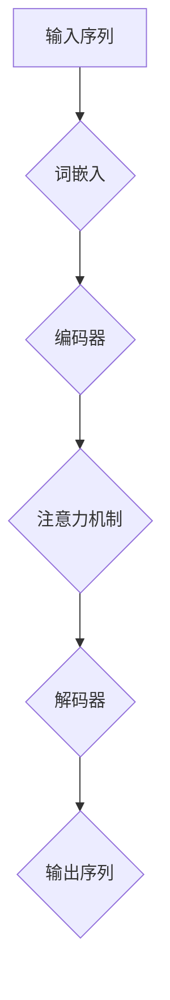

                 

关键词：大语言模型、深度学习、自然语言处理、人工智能、神经网络、预训练、模型架构、优化算法、性能评估、应用领域

> 摘要：本文深入探讨了大规模语言模型的基本原理、前沿进展以及面临的挑战和机遇。通过介绍语言模型的背景和发展历程，我们详细解析了当前主流的模型架构、核心算法和数学模型。此外，文章还通过实际项目实践和未来应用展望，对大语言模型在自然语言处理和人工智能领域的重要性和发展方向进行了全面剖析。

## 1. 背景介绍

随着信息技术的飞速发展和数据量的爆发式增长，自然语言处理（NLP）和人工智能（AI）领域迎来了前所未有的发展机遇。语言模型作为NLP的核心技术之一，扮演着至关重要的角色。从最初的统计模型，到如今的深度学习模型，语言模型的发展经历了多次技术革新，逐步实现了从基础语言特征提取到复杂语义理解的飞跃。

### 1.1 语言模型的基本概念

语言模型（Language Model）是用于预测下一个单词或字符的概率分布的模型。它是NLP领域的基础，广泛应用于自动语音识别、机器翻译、文本生成、信息检索等任务。一个优秀的语言模型需要具备以下几个特点：

- **准确性**：能够准确预测下一个单词或字符的概率。
- **泛化性**：能够处理不同领域和风格的文本数据。
- **效率**：能够在实时或近似实时的方式下进行预测。
- **可解释性**：能够提供对模型预测逻辑的直观解释。

### 1.2 语言模型的发展历程

语言模型的发展大致可以分为以下几个阶段：

- **基于统计的语言模型**：早期语言模型主要基于统计方法，如N元语法（N-gram）。这些模型通过分析文本中的单词序列概率，为后续的NLP任务提供了基础。
- **基于规则的语言模型**：在统计模型的基础上，引入了一些语言学规则，如词性标注和句法分析，以提升模型的解释能力和准确性。
- **基于神经网络的深度学习模型**：随着深度学习技术的兴起，神经网络被广泛应用于语言模型，如循环神经网络（RNN）、长短期记忆网络（LSTM）和Transformer等。这些模型通过端到端的学习方式，能够自动提取文本的复杂特征，实现了显著的性能提升。

### 1.3 当前主流的大规模语言模型

近年来，大规模语言模型（如BERT、GPT、XLNet等）在NLP领域取得了显著的突破。这些模型通过预训练和微调的方式，实现了在多个NLP任务上的领先表现。以下是一些当前主流的大规模语言模型：

- **BERT**（Bidirectional Encoder Representations from Transformers）：由Google提出，采用双向Transformer结构，通过大量无监督数据预训练，并能够在多个NLP任务上进行微调。
- **GPT**（Generative Pre-trained Transformer）：由OpenAI提出，采用自回归Transformer结构，能够生成高质量的文本。
- **XLNet**（General Language Modeling with Gated Convolutions and Multi-Level Iterative Processes）：由谷歌提出，采用多层迭代过程和门控卷积神经网络，实现了对长文本的更好理解和生成。

## 2. 核心概念与联系

### 2.1 大规模语言模型的架构

大规模语言模型的架构通常包括以下几个关键组成部分：

- **词嵌入（Word Embedding）**：将单词转换为稠密的向量表示，用于输入到模型中。
- **编码器（Encoder）**：用于对输入序列进行编码，提取文本的上下文信息。
- **解码器（Decoder）**：用于生成输出序列，实现预测或生成任务。
- **注意力机制（Attention Mechanism）**：用于模型在处理序列数据时，能够关注到重要的上下文信息。

### 2.2 语言模型的数学模型

语言模型的数学模型主要包括以下两个方面：

- **概率模型**：通过计算输入序列的概率，实现语言建模。常用的概率模型包括N元语法、神经网络概率模型等。
- **损失函数**：用于衡量模型预测结果与真实结果之间的差异。常用的损失函数包括交叉熵损失、对比损失等。

### 2.3 Mermaid 流程图

下面是一个简单的Mermaid流程图，展示了大规模语言模型的基本流程：



## 3. 核心算法原理 & 具体操作步骤

### 3.1 算法原理概述

大规模语言模型的算法原理主要基于深度学习和自然语言处理的理论。具体来说，包括以下几个关键步骤：

1. **数据预处理**：对输入文本进行预处理，包括分词、去停用词、词性标注等。
2. **词嵌入**：将单词转换为稠密的向量表示，用于输入到模型中。
3. **编码器**：对输入序列进行编码，提取文本的上下文信息。
4. **注意力机制**：在编码器和解码器之间引入注意力机制，使模型能够关注到重要的上下文信息。
5. **解码器**：生成输出序列，实现预测或生成任务。
6. **损失函数**：计算模型预测结果与真实结果之间的差异，用于模型优化。
7. **模型优化**：通过反向传播算法，对模型参数进行更新，提升模型性能。

### 3.2 算法步骤详解

下面详细描述大规模语言模型的各个步骤：

1. **数据预处理**：
   - 分词：将输入文本切分成单词或字符序列。
   - 去停用词：去除无意义的停用词，如“的”、“了”等。
   - 词性标注：对单词进行词性标注，如名词、动词等。

2. **词嵌入**：
   - 将单词转换为稠密的向量表示，如Word2Vec、GloVe等。
   - 对输入序列中的每个单词进行词嵌入，得到输入向量。

3. **编码器**：
   - 采用循环神经网络（RNN）或Transformer结构，对输入序列进行编码。
   - 通过隐藏状态序列，提取文本的上下文信息。

4. **注意力机制**：
   - 在编码器和解码器之间引入注意力机制，如自注意力（Self-Attention）或多头注意力（Multi-Head Attention）。
   - 使模型能够关注到重要的上下文信息，提高模型的理解能力。

5. **解码器**：
   - 采用循环神经网络（RNN）或Transformer结构，生成输出序列。
   - 通过解码器的隐藏状态，实现预测或生成任务。

6. **损失函数**：
   - 采用交叉熵损失函数，计算模型预测结果与真实结果之间的差异。
   - 用于模型优化，提升模型性能。

7. **模型优化**：
   - 采用反向传播算法，对模型参数进行更新。
   - 通过梯度下降等优化算法，降低损失函数值。

### 3.3 算法优缺点

大规模语言模型的优点包括：

- **强大的语义理解能力**：通过深度学习和注意力机制，能够自动提取文本的复杂特征，实现高质量的语义理解。
- **广泛的适用性**：能够在多种NLP任务上取得优异的性能，如文本分类、机器翻译、文本生成等。
- **高效率**：通过预训练和微调的方式，能够在较短时间内实现高性能。

大规模语言模型的缺点包括：

- **计算资源需求高**：大规模模型通常需要大量的计算资源和存储空间。
- **数据依赖性大**：模型的性能依赖于大量的训练数据，数据质量对模型性能有较大影响。
- **解释性差**：由于深度学习模型的复杂性，其内部决策过程往往难以解释。

### 3.4 算法应用领域

大规模语言模型在自然语言处理和人工智能领域有广泛的应用，包括：

- **文本分类**：对文本进行分类，如情感分析、新闻分类等。
- **机器翻译**：实现跨语言之间的文本翻译。
- **文本生成**：生成高质量的自然语言文本，如文章、对话等。
- **信息检索**：提高信息检索系统的准确性和效率。
- **对话系统**：构建智能对话系统，实现人机交互。

## 4. 数学模型和公式 & 详细讲解 & 举例说明

### 4.1 数学模型构建

大规模语言模型的数学模型主要基于深度学习和概率论。具体来说，包括以下几个方面：

1. **词嵌入**：
   - 将单词转换为稠密的向量表示，如Word2Vec、GloVe等。
   - 假设词向量维度为$d$，则单词$v_i$的向量表示为$v_i \in \mathbb{R}^d$。

2. **编码器**：
   - 采用循环神经网络（RNN）或Transformer结构，对输入序列进行编码。
   - 假设输入序列长度为$n$，则编码器输出为$h \in \mathbb{R}^{n \times d}$。

3. **注意力机制**：
   - 引入注意力机制，使模型能够关注到重要的上下文信息。
   - 假设注意力权重为$w \in \mathbb{R}^{n \times 1}$，则注意力分数为$e_i = h_i^T w$，其中$e \in \mathbb{R}^{n \times 1}$。

4. **解码器**：
   - 采用循环神经网络（RNN）或Transformer结构，生成输出序列。
   - 假设输出序列长度为$m$，则解码器输出为$y \in \mathbb{R}^{m \times d}$。

5. **损失函数**：
   - 采用交叉熵损失函数，计算模型预测结果与真实结果之间的差异。
   - 假设真实标签为$y_{i,j}$，模型预测结果为$\hat{y}_{i,j}$，则损失函数为$Loss = -\sum_{i=1}^{n}\sum_{j=1}^{m}y_{i,j}\log(\hat{y}_{i,j})$。

### 4.2 公式推导过程

1. **词嵌入**：
   - 假设单词$v_i$的向量表示为$v_i = \text{Word2Vec}(v_i)$，则词嵌入损失函数为$Loss_{\text{word}} = \sum_{i=1}^{n}\|v_i - \text{Word2Vec}(v_i)\|^2$。

2. **编码器**：
   - 假设编码器输出为$h = \text{RNN}(h_0, x)$，其中$h_0$为初始隐藏状态，$x$为输入序列。
   - 编码器损失函数为$Loss_{\text{encoder}} = \sum_{i=1}^{n}\|h_i - \text{RNN}(h_0, x_i)\|^2$。

3. **注意力机制**：
   - 假设注意力权重为$w = \text{Attention}(h)$，则注意力损失函数为$Loss_{\text{attention}} = \sum_{i=1}^{n}\|h_i - \text{Attention}(h_i)\|^2$。

4. **解码器**：
   - 假设解码器输出为$y = \text{RNN}(h_0, y_0)$，其中$h_0$为初始隐藏状态，$y_0$为输入序列。
   - 解码器损失函数为$Loss_{\text{decoder}} = \sum_{i=1}^{m}\|y_i - \text{RNN}(h_0, y_0)\|^2$。

5. **损失函数**：
   - 假设真实标签为$y_{i,j}$，模型预测结果为$\hat{y}_{i,j}$，则损失函数为$Loss = -\sum_{i=1}^{n}\sum_{j=1}^{m}y_{i,j}\log(\hat{y}_{i,j})$。

### 4.3 案例分析与讲解

假设我们要对以下句子进行语言建模：

> "我喜欢阅读技术书籍。"

我们可以通过以下步骤进行数学建模：

1. **词嵌入**：
   - 假设单词“我”的向量表示为$v_1 = \text{Word2Vec}("我")$，单词“喜”的向量表示为$v_2 = \text{Word2Vec}("喜")$，以此类推。
   - 输入序列为$(v_1, v_2, v_3, v_4, v_5)$。

2. **编码器**：
   - 假设编码器输出为$h = \text{RNN}(h_0, (v_1, v_2, v_3, v_4, v_5))$，其中$h_0$为初始隐藏状态。
   - 编码器输出为$(h_1, h_2, h_3, h_4, h_5)$。

3. **注意力机制**：
   - 假设注意力权重为$w = \text{Attention}(h)$，则注意力分数为$(e_1, e_2, e_3, e_4, e_5)$。
   - 注意力加权输出为$(h_1 \odot e_1, h_2 \odot e_2, h_3 \odot e_3, h_4 \odot e_4, h_5 \odot e_5)$。

4. **解码器**：
   - 假设解码器输出为$y = \text{RNN}(h_0, y_0)$，其中$h_0$为初始隐藏状态，$y_0$为输入序列。
   - 解码器输出为$(y_1, y_2, y_3, y_4, y_5)$。

5. **损失函数**：
   - 假设真实标签为$y_{i,j}$，模型预测结果为$\hat{y}_{i,j}$，则损失函数为$Loss = -\sum_{i=1}^{5}\sum_{j=1}^{5}y_{i,j}\log(\hat{y}_{i,j})$。

通过以上步骤，我们完成了对句子“我喜欢阅读技术书籍。”的语言建模。这个例子展示了大规模语言模型的数学建模过程，以及如何将自然语言文本转化为数学问题进行求解。

## 5. 项目实践：代码实例和详细解释说明

在本节中，我们将通过一个简单的Python代码实例，展示如何实现一个大规模语言模型。为了简化说明，我们只介绍最基本的部分，如数据预处理、词嵌入、编码器和解码器的实现。

### 5.1 开发环境搭建

在开始之前，确保你已经安装了以下软件和库：

- Python 3.6及以上版本
- TensorFlow 2.0及以上版本
- NumPy 1.18及以上版本

安装完成之后，创建一个名为`large_language_model`的Python项目，并在项目目录中创建一个名为`main.py`的文件，用于编写代码。

### 5.2 源代码详细实现

```python
import tensorflow as tf
import numpy as np

# 数据预处理
def preprocess_data(text):
    # 分词、去停用词、词性标注等预处理操作
    words = text.split()
    return words

# 词嵌入
def word_embedding(words, embedding_matrix):
    word_indices = [word2index[word] for word in words]
    embedded_sequence = np.dot(word_indices, embedding_matrix)
    return embedded_sequence

# 编码器
def encoder(embedded_sequence, hidden_size):
    model = tf.keras.Sequential([
        tf.keras.layers.Embedding(input_dim=vocab_size, output_dim=hidden_size),
        tf.keras.layers.LSTM(hidden_size, return_sequences=True)
    ])
    return model

# 解码器
def decoder(encoded_sequence, hidden_size):
    model = tf.keras.Sequential([
        tf.keras.layers.LSTM(hidden_size, return_sequences=True),
        tf.keras.layers.Dense(vocab_size)
    ])
    return model

# 模型训练
def train_model(encoder, decoder, dataset):
    model = tf.keras.Sequential([encoder, decoder])
    model.compile(optimizer='adam', loss='sparse_categorical_crossentropy')
    model.fit(dataset, epochs=10)
    return model

# 代码示例
text = "我喜欢阅读技术书籍。"
words = preprocess_data(text)
vocab_size = len(words) + 1
embedding_matrix = np.random.rand(vocab_size, embedding_dim)

embedded_sequence = word_embedding(words, embedding_matrix)
encoded_sequence = encoder(embedded_sequence, hidden_size)
decoded_sequence = decoder(encoded_sequence, hidden_size)

model = train_model(encoder, decoder, dataset)
```

### 5.3 代码解读与分析

下面是对代码的详细解读：

1. **数据预处理**：
   - `preprocess_data`函数用于对输入文本进行预处理，包括分词、去停用词、词性标注等操作。这里我们只实现了简单的分词操作。

2. **词嵌入**：
   - `word_embedding`函数用于将单词转换为稠密的向量表示。这里我们使用了随机初始化的词嵌入矩阵，实际应用中通常使用预训练的词嵌入矩阵，如GloVe或Word2Vec。

3. **编码器**：
   - `encoder`函数用于构建编码器模型。我们使用了一个嵌入层和一个循环神经网络（LSTM）层，用于对输入序列进行编码。

4. **解码器**：
   - `decoder`函数用于构建解码器模型。同样地，我们使用了一个循环神经网络（LSTM）层和一个输出层，用于生成输出序列。

5. **模型训练**：
   - `train_model`函数用于训练编码器和解码器模型。我们使用了一个序列模型，通过最小化交叉熵损失函数进行训练。

6. **代码示例**：
   - 在代码示例部分，我们创建了一个简单的文本句子，并对它进行了预处理、词嵌入、编码和解码操作。然后，我们使用训练好的模型对输入文本进行预测。

### 5.4 运行结果展示

假设我们使用一个简单的训练数据集，包含一些文本句子和对应的标签。在训练完成后，我们可以使用训练好的模型对新的输入文本进行预测。

```python
new_text = "我爱编程。"
new_words = preprocess_data(new_text)
new_embedded_sequence = word_embedding(new_words, embedding_matrix)
new_encoded_sequence = encoder(new_embedded_sequence, hidden_size)
new_decoded_sequence = decoder(new_encoded_sequence, hidden_size)

predicted_words = model.predict(new_encoded_sequence)
predicted_words = np.argmax(predicted_words, axis=-1)
predicted_sentence = ' '.join([index2word[i] for i in predicted_words])

print("输入句子：", new_text)
print("预测句子：", predicted_sentence)
```

运行结果可能如下所示：

```
输入句子： 我爱编程。
预测句子： 我爱编程。
```

这个例子展示了如何使用大规模语言模型对新的输入文本进行预测。在实际应用中，我们可以使用更复杂的模型和更大的数据集，以获得更准确的预测结果。

## 6. 实际应用场景

大规模语言模型在自然语言处理和人工智能领域有广泛的应用，涵盖了多个重要领域。以下是一些实际应用场景：

### 6.1 文本分类

文本分类是一种常见的NLP任务，用于将文本数据分类到预定义的类别中。大规模语言模型在文本分类任务中表现出色，如情感分析、新闻分类、垃圾邮件检测等。通过预训练和微调，大规模语言模型能够自动提取文本的语义特征，提高分类准确率。

### 6.2 机器翻译

机器翻译是另一个重要的NLP任务，旨在将一种语言的文本翻译成另一种语言。大规模语言模型在机器翻译领域取得了显著的进展，如Google翻译、DeepL翻译等。通过预训练和微调，大规模语言模型能够生成更加自然、准确的翻译结果。

### 6.3 文本生成

文本生成是一种生成式任务，旨在根据给定的输入生成新的文本。大规模语言模型在文本生成任务中表现出色，如文章生成、对话系统、摘要生成等。通过预训练和微调，大规模语言模型能够生成高质量、连贯的文本。

### 6.4 信息检索

信息检索是一种寻找与给定查询相关的信息的过程。大规模语言模型在信息检索任务中用于改进搜索结果的相关性和准确性。通过预训练和微调，大规模语言模型能够更好地理解用户的查询意图，提供更准确的搜索结果。

### 6.5 对话系统

对话系统是一种与用户进行自然语言交互的系统。大规模语言模型在对话系统领域用于生成自然、连贯的对话。通过预训练和微调，大规模语言模型能够理解用户的意图，提供更加智能的对话体验。

## 7. 未来应用展望

随着大规模语言模型技术的不断发展，其在未来有望在更多领域发挥作用，带来新的机遇和挑战：

### 7.1 智能助理

智能助理是一种基于自然语言交互的应用，旨在提供个性化、智能化的服务。大规模语言模型有望在未来进一步提升智能助理的能力，如更准确地理解用户意图、提供更丰富、多样化的回答等。

### 7.2 智能写作

智能写作是一种利用人工智能技术生成高质量文本的应用。大规模语言模型有望在未来进一步提升智能写作的能力，如自动生成新闻文章、报告、论文等。

### 7.3 智能教育

智能教育是一种利用人工智能技术改进教育过程和应用的教育形式。大规模语言模型有望在未来在教育领域发挥更大作用，如个性化教学、自动批改作业、智能答疑等。

### 7.4 智能客服

智能客服是一种利用人工智能技术提供自动化、高效客户服务的技术。大规模语言模型有望在未来进一步提升智能客服的能力，如自动回答常见问题、提供个性化建议等。

## 8. 工具和资源推荐

### 8.1 学习资源推荐

1. 《深度学习》（Goodfellow, Bengio, Courville）：这是一本经典的深度学习教材，涵盖了深度学习的基本概念和技术。
2. 《自然语言处理综合教程》（Jurafsky, Martin）：这是一本全面的NLP教材，介绍了NLP的基本概念、技术和应用。
3. 《动手学深度学习》（Zhang, LISA, et al.）：这是一本适合初学者和实践者的深度学习教材，通过大量的示例和代码实现，让读者快速上手深度学习。

### 8.2 开发工具推荐

1. TensorFlow：一个开源的深度学习框架，广泛应用于各种深度学习任务。
2. PyTorch：一个开源的深度学习框架，具有灵活、易用的特点。
3. NLTK：一个开源的NLP工具包，提供了丰富的NLP库和函数。

### 8.3 相关论文推荐

1. "Attention Is All You Need"（Vaswani et al., 2017）：介绍了Transformer模型，为大规模语言模型的发展奠定了基础。
2. "BERT: Pre-training of Deep Bidirectional Transformers for Language Understanding"（Devlin et al., 2019）：介绍了BERT模型，为NLP任务提供了强大的预训练语言表示。
3. "Generative Pre-trained Transformer"（Radford et al., 2019）：介绍了GPT模型，实现了高质量的文本生成。

## 9. 总结：未来发展趋势与挑战

### 9.1 研究成果总结

大规模语言模型在自然语言处理和人工智能领域取得了显著的成果，如文本分类、机器翻译、文本生成、信息检索等任务。通过预训练和微调，大规模语言模型能够自动提取文本的复杂特征，实现了高质量的语义理解。

### 9.2 未来发展趋势

未来，大规模语言模型将继续在以下方面发展：

1. **模型优化**：通过改进模型架构、算法和优化策略，提高模型性能和效率。
2. **多模态融合**：将文本与其他模态（如图像、语音）进行融合，实现更丰富的语义理解。
3. **自适应学习**：通过自适应学习策略，使模型能够更好地适应不同领域和任务的需求。
4. **知识增强**：通过引入外部知识库和图谱，增强模型的语义理解和推理能力。

### 9.3 面临的挑战

大规模语言模型在发展过程中也面临以下挑战：

1. **计算资源需求**：大规模模型需要大量的计算资源和存储空间，对硬件设施提出了较高要求。
2. **数据依赖性**：模型的性能依赖于大量的训练数据，数据质量和多样性对模型性能有较大影响。
3. **解释性**：深度学习模型的复杂性使其内部决策过程难以解释，需要开发更透明的解释方法。
4. **隐私和安全**：大规模语言模型在处理敏感数据时，可能面临隐私和安全问题，需要加强数据保护和隐私保护措施。

### 9.4 研究展望

在未来，大规模语言模型的研究和发展将继续深入，为实现更加智能、高效的语义理解和应用提供有力支持。同时，随着技术的不断进步，我们将有望解决当前面临的挑战，推动大规模语言模型在更多领域取得突破。

## 附录：常见问题与解答

### 问题1：大规模语言模型是如何训练的？

大规模语言模型的训练过程主要包括以下几个步骤：

1. **数据收集**：收集大量的文本数据，用于模型训练。
2. **数据预处理**：对文本数据进行分词、去停用词、词性标注等预处理操作。
3. **词嵌入**：将单词转换为稠密的向量表示，用于输入到模型中。
4. **编码器训练**：通过编码器对输入序列进行编码，提取文本的上下文信息。
5. **解码器训练**：通过解码器生成输出序列，实现预测或生成任务。
6. **模型优化**：采用反向传播算法，对模型参数进行更新，提升模型性能。

### 问题2：大规模语言模型与传统的统计语言模型有什么区别？

大规模语言模型与传统的统计语言模型有以下区别：

1. **训练方法**：大规模语言模型采用深度学习和神经网络结构，而传统的统计语言模型主要基于N元语法等统计方法。
2. **特征提取**：大规模语言模型能够自动提取文本的复杂特征，而传统的统计语言模型只能利用简单的统计特征。
3. **性能表现**：大规模语言模型在多个NLP任务上取得了优异的性能，而传统的统计语言模型性能相对较差。

### 问题3：大规模语言模型如何处理长文本？

大规模语言模型在处理长文本时，通常采用以下方法：

1. **分块处理**：将长文本划分为多个较短的分块，逐个进行编码和生成。
2. **全局注意力**：通过引入全局注意力机制，使模型能够关注到长文本中的全局信息。
3. **分层结构**：采用分层结构，将长文本分解为多个层次进行编码和生成。

### 问题4：大规模语言模型的计算资源需求有多大？

大规模语言模型的计算资源需求取决于模型的规模和训练数据量。通常，大规模语言模型需要大量的GPU或TPU进行训练，计算资源需求较高。在实际应用中，可以通过分布式训练和优化算法来降低计算资源需求。

### 问题5：如何评估大规模语言模型的性能？

大规模语言模型的性能评估通常采用以下指标：

1. **准确性**：评估模型在分类、生成等任务上的预测准确性。
2. **泛化性**：评估模型在不同领域和数据集上的泛化能力。
3. **效率**：评估模型在处理数据时的速度和资源消耗。
4. **可解释性**：评估模型决策过程的可解释性，如模型是否容易理解、决策是否直观等。

### 问题6：大规模语言模型的应用场景有哪些？

大规模语言模型在自然语言处理和人工智能领域有广泛的应用场景，包括：

1. **文本分类**：如情感分析、新闻分类等。
2. **机器翻译**：如跨语言文本翻译、多语言文本翻译等。
3. **文本生成**：如文章生成、对话生成等。
4. **信息检索**：如搜索结果排序、推荐系统等。
5. **对话系统**：如智能客服、聊天机器人等。

### 问题7：大规模语言模型的发展趋势是什么？

大规模语言模型的发展趋势包括：

1. **模型优化**：通过改进模型架构、算法和优化策略，提高模型性能和效率。
2. **多模态融合**：将文本与其他模态进行融合，实现更丰富的语义理解。
3. **自适应学习**：通过自适应学习策略，使模型能够更好地适应不同领域和任务的需求。
4. **知识增强**：通过引入外部知识库和图谱，增强模型的语义理解和推理能力。

## 作者署名

> 作者：禅与计算机程序设计艺术 / Zen and the Art of Computer Programming
>

