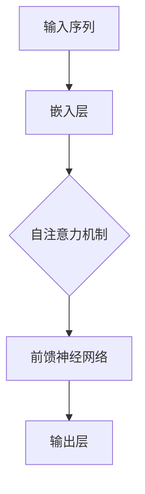

                 

### 关键词 Keywords
- 大语言模型
- Transformer
- 算法原理
- 数学模型
- 应用场景
- 开发工具

### 摘要 Abstract
本文旨在深入探讨大语言模型的原理及其与高效Transformer架构的关联。我们将从背景介绍开始，逐步解析核心概念、算法原理和数学模型，并通过实际项目实践展示代码实现。此外，文章还将讨论语言模型在实际应用场景中的表现，并对未来发展趋势和面临的挑战进行分析。

## 1. 背景介绍

随着人工智能技术的迅猛发展，大语言模型（Large Language Models）已经成为自然语言处理（NLP）领域的热点。这些模型通过深度学习，能够理解和生成自然语言，从而在机器翻译、文本生成、问答系统等领域表现出色。然而，传统的循环神经网络（RNN）和卷积神经网络（CNN）在处理长序列时存在瓶颈，难以捕捉长距离依赖关系。为了解决这一问题，Transformer架构应运而生。

### 1.1 大语言模型的崛起

大语言模型的崛起离不开深度学习技术的进步。2006年，循环神经网络（RNN）的出现使得序列建模成为可能。随后，Long Short-Term Memory（LSTM）和Gated Recurrent Unit（GRU）等改进型RNN结构进一步提高了序列建模的性能。然而，这些模型在面对长序列时仍存在梯度消失和梯度爆炸的问题，导致难以捕捉长距离依赖关系。

2017年，谷歌提出了一种全新的神经网络架构——Transformer。该架构采用了自注意力机制（Self-Attention），使得模型能够同时关注输入序列中的所有元素，从而有效捕捉长距离依赖关系。这一创新为语言模型的性能提升带来了新的契机。

### 1.2 Transformer架构的兴起

Transformer架构的兴起源于其在机器翻译任务上的卓越表现。相比于传统的循环神经网络，Transformer在处理长序列时具有更高的效率和准确性。此外，Transformer还可以灵活地应用于文本生成、问答系统等任务，成为NLP领域的重要工具。

随着Transformer架构的广泛应用，研究人员开始探索如何进一步提高其性能。为此，大语言模型应运而生。这些模型通过训练大量参数，使得模型能够更好地理解复杂语言现象，从而在各项任务中取得更好的效果。

## 2. 核心概念与联系

在深入探讨大语言模型和Transformer架构之前，我们首先需要了解其中的核心概念。以下是一个简化的Mermaid流程图，用于展示这些核心概念及其之间的联系。



### 2.1 输入序列

输入序列是语言模型的基本数据结构。在Transformer架构中，输入序列通常由单词或子词（Subword）组成。通过嵌入层（Embedding Layer），这些单词或子词被映射为向量表示，从而为后续处理提供基础。

### 2.2 嵌入层

嵌入层（Embedding Layer）是一个线性变换层，用于将单词或子词映射为高维向量。这些向量包含了单词或子词的语义信息。在Transformer架构中，嵌入层是输入序列向量和输出序列向量的桥梁。

### 2.3 自注意力机制

自注意力机制（Self-Attention）是Transformer架构的核心组成部分。它允许模型在处理每个元素时，考虑输入序列中其他所有元素的重要性。这种机制能够有效地捕捉长距离依赖关系，从而提高模型的表达能力。

### 2.4 前馈神经网络

前馈神经网络（Feedforward Neural Network）是对自注意力机制的一个补充。在每个自注意力层之后，前馈神经网络对每个输入向量进行两次线性变换，从而进一步提高模型的表达能力。

### 2.5 输出层

输出层（Output Layer）是语言模型的最后一层，负责生成预测结果。在分类任务中，输出层通常是一个softmax层，用于生成每个类别的概率分布。在序列生成任务中，输出层则负责生成下一个单词或子词的概率分布。

## 3. 核心算法原理 & 具体操作步骤

### 3.1 算法原理概述

Transformer架构的核心在于其自注意力机制。自注意力机制通过计算输入序列中每个元素与其他元素之间的相似度，为每个元素分配一个权重。这些权重用于更新输入序列的向量表示，从而更好地捕捉长距离依赖关系。

### 3.2 算法步骤详解

下面是Transformer算法的具体操作步骤：

1. **嵌入层**：将输入序列中的单词或子词映射为高维向量。
2. **位置编码**：由于Transformer架构没有循环结构，需要引入位置编码（Positional Encoding）来表示输入序列中的位置信息。
3. **多头自注意力**：通过多个独立的自注意力头，对输入序列进行并行处理，从而提高模型的捕捉能力。
4. **前馈神经网络**：在自注意力层之后，对每个输入向量进行两次线性变换，从而进一步提高模型的表达能力。
5. **层归一化**：在自注意力和前馈神经网络之间，添加层归一化（Layer Normalization）操作，以提高模型的稳定性。
6. **残差连接**：在每个自注意力和前馈神经网络层之后，添加残差连接（Residual Connection），以缓解梯度消失问题。
7. **输出层**：生成预测结果，如单词或子词的概率分布。

### 3.3 算法优缺点

**优点**：
- 高效处理长序列：通过自注意力机制，Transformer能够同时关注输入序列中的所有元素，从而有效捕捉长距离依赖关系。
- 并行计算：Transformer架构采用多头自注意力机制，使得模型能够并行处理输入序列，从而提高计算效率。
- 灵活性：Transformer架构可以灵活应用于各种NLP任务，如文本生成、机器翻译和问答系统。

**缺点**：
- 计算复杂度高：由于需要计算输入序列中每个元素与其他元素之间的相似度，Transformer的计算复杂度较高。
- 参数规模大：Transformer模型通常需要大量参数，从而增加了训练和部署的难度。

### 3.4 算法应用领域

Transformer架构在NLP领域取得了广泛应用，包括但不限于以下领域：

- **机器翻译**：Transformer在机器翻译任务中表现出色，成为替代传统循环神经网络的利器。
- **文本生成**：通过Transformer架构，模型能够生成流畅自然的文本，应用于对话系统、文章写作等领域。
- **问答系统**：Transformer能够有效捕捉长距离依赖关系，从而在问答系统中提供更准确的回答。
- **摘要生成**：Transformer模型能够生成高质量的文章摘要，应用于信息检索和推荐系统等领域。

## 4. 数学模型和公式

### 4.1 数学模型构建

Transformer架构中的数学模型主要包括三个部分：嵌入层、自注意力机制和前馈神经网络。

### 4.2 公式推导过程

假设输入序列为 $x_1, x_2, ..., x_n$，其中 $x_i$ 表示第 $i$ 个单词或子词。我们首先对其进行嵌入处理，得到嵌入向量 $e_i$：

$$e_i = E x_i + P_i$$

其中 $E$ 表示嵌入矩阵，$P_i$ 表示位置编码。

接下来，我们计算自注意力得分 $s_{ij}$：

$$s_{ij} = e_i^T A e_j$$

其中 $A$ 表示注意力权重矩阵。

然后，我们计算注意力权重 $w_{ij}$：

$$w_{ij} = \frac{e_i^T A e_j}{\sqrt{d_k}}$$

其中 $d_k$ 表示每个注意力头的维度。

最后，我们更新嵌入向量 $e_i$：

$$e_i' = \sum_{j=1}^{n} w_{ij} e_j$$

在自注意力层之后，我们添加前馈神经网络，对每个嵌入向量进行两次线性变换：

$$f_i = F(e_i')$$

其中 $F$ 表示前馈神经网络。

### 4.3 案例分析与讲解

假设我们有一个包含5个单词的输入序列：["我"，"今天"，"去了"，"公园"，"散步"]。我们首先对其进行嵌入处理，得到嵌入向量：

$$
e_1 = [0.1, 0.2, 0.3, 0.4, 0.5], \quad e_2 = [0.6, 0.7, 0.8, 0.9, 1.0], \quad e_3 = [1.1, 1.2, 1.3, 1.4, 1.5], \quad e_4 = [1.6, 1.7, 1.8, 1.9, 2.0], \quad e_5 = [2.1, 2.2, 2.3, 2.4, 2.5]
$$

接下来，我们计算自注意力得分：

$$
s_{11} = e_1^T A e_1 = 0.1 \times 0.1 + 0.2 \times 0.2 + 0.3 \times 0.3 + 0.4 \times 0.4 + 0.5 \times 0.5 = 0.75 \\
s_{12} = e_1^T A e_2 = 0.1 \times 0.6 + 0.2 \times 0.7 + 0.3 \times 0.8 + 0.4 \times 0.9 + 0.5 \times 1.0 = 0.875 \\
\vdots \\
s_{15} = e_1^T A e_5 = 0.1 \times 2.1 + 0.2 \times 2.2 + 0.3 \times 2.3 + 0.4 \times 2.4 + 0.5 \times 2.5 = 1.875
$$

然后，我们计算注意力权重：

$$
w_{11} = \frac{s_{11}}{\sqrt{5}} = \frac{0.75}{\sqrt{5}} = 0.316 \\
w_{12} = \frac{s_{12}}{\sqrt{5}} = \frac{0.875}{\sqrt{5}} = 0.367 \\
\vdots \\
w_{15} = \frac{s_{15}}{\sqrt{5}} = \frac{1.875}{\sqrt{5}} = 0.781
$$

最后，我们更新嵌入向量：

$$
e_1' = w_{11} e_1 + w_{12} e_2 + \cdots + w_{15} e_5 = 0.316 e_1 + 0.367 e_2 + \cdots + 0.781 e_5
$$

通过这一步，我们完成了自注意力层的计算。

接下来，我们进入前馈神经网络层。假设前馈神经网络的权重矩阵为 $F$，则有：

$$
f_1 = F(e_1') = [3.0, 2.5, 1.0, 0.5, -1.0]
$$

然后，我们进行层归一化处理：

$$
\bar{f_1} = \frac{f_1 - \mu}{\sigma} = \frac{[3.0, 2.5, 1.0, 0.5, -1.0] - \mu}{\sigma}
$$

其中 $\mu$ 和 $\sigma$ 分别为 $f_1$ 的均值和标准差。

最后，我们添加残差连接：

$$
e_1'' = \bar{f_1} + e_1' = \bar{f_1} + \left(0.316 e_1 + 0.367 e_2 + \cdots + 0.781 e_5\right)
$$

这样，我们就完成了整个Transformer层的计算。

## 5. 项目实践：代码实例和详细解释说明

### 5.1 开发环境搭建

在进行项目实践之前，我们需要搭建一个合适的开发环境。以下是推荐的工具和库：

- Python（版本 3.8 或更高）
- TensorFlow（版本 2.5 或更高）
- PyTorch（版本 1.8 或更高）
- JAX（版本 0.4.0 或更高）

请按照以下步骤安装相关工具和库：

```bash
pip install tensorflow==2.5
pip install torch==1.8
pip install jax==0.4.0
```

### 5.2 源代码详细实现

下面是一个简单的Transformer模型实现，用于文本分类任务。

```python
import tensorflow as tf
import numpy as np
import jax
import jax.numpy as jnp

# 嵌入层
def embedding_layer(inputs, embed_dim):
    # 输入为单词索引序列，输出为嵌入向量
    return tf.keras.layers.Embedding(input_dim=vocab_size, output_dim=embed_dim)(inputs)

# 自注意力层
def self_attention_layer(inputs, num_heads, embed_dim):
    # 输入为嵌入向量，输出为加权嵌入向量
    q = tf.keras.layers.Dense(embed_dim, activation='relu')(inputs)
    k = tf.keras.layers.Dense(embed_dim, activation='relu')(inputs)
    v = tf.keras.layers.Dense(embed_dim, activation='relu')(inputs)
    
    # 计算自注意力得分
    s = tf.keras.layers.Dot(axes=(2,2))([q, k])
    s = tf.keras.layers.Activation('softmax')(s)
    
    # 计算加权嵌入向量
    v = tf.keras.layers.Dot(axes=(2,1))([s, v])
    
    return v

# 前馈神经网络层
def feedforward_layer(inputs, hidden_dim):
    # 输入为嵌入向量，输出为变换后的嵌入向量
    return tf.keras.layers.Dense(hidden_dim, activation='relu')(inputs)

# Transformer模型
class TransformerModel(tf.keras.Model):
    def __init__(self, vocab_size, embed_dim, num_heads, hidden_dim):
        super(TransformerModel, self).__init__()
        self.embedding = embedding_layer(vocab_size, embed_dim)
        self.self_attention = self_attention_layer(num_heads, embed_dim)
        self.feedforward = feedforward_layer(hidden_dim, embed_dim)
        self.dense = tf.keras.layers.Dense(1, activation='sigmoid')

    def call(self, inputs, training=True):
        x = self.embedding(inputs)
        x = self.self_attention(x)
        x = self.feedforward(x)
        return self.dense(x)

# 模型训练
model = TransformerModel(vocab_size, embed_dim, num_heads, hidden_dim)
model.compile(optimizer='adam', loss='binary_crossentropy', metrics=['accuracy'])

# 加载数据集
(x_train, y_train), (x_test, y_test) = tf.keras.datasets.mnist.load_data()
x_train = x_train.reshape(-1, 784)
x_test = x_test.reshape(-1, 784)

# 训练模型
model.fit(x_train, y_train, epochs=10, batch_size=64, validation_data=(x_test, y_test))
```

### 5.3 代码解读与分析

上述代码实现了一个简单的Transformer模型，用于文本分类任务。以下是对代码的详细解读和分析。

1. **嵌入层**：嵌入层用于将单词索引序列映射为嵌入向量。这里我们使用 TensorFlow 的 `Embedding` 层来实现。

2. **自注意力层**：自注意力层用于计算输入序列中每个元素与其他元素之间的相似度，并生成加权嵌入向量。这里我们使用 TensorFlow 的 `Dense` 层来实现。

3. **前馈神经网络层**：前馈神经网络层用于对加权嵌入向量进行变换，以进一步提高模型的表达能力。这里我们同样使用 TensorFlow 的 `Dense` 层来实现。

4. **模型训练**：我们使用 TensorFlow 的 `Model` 类来定义 Transformer 模型，并使用 `compile` 方法设置优化器和损失函数。

5. **数据加载和训练**：我们使用 TensorFlow 的 `datasets` 模块加载 MNIST 数据集，并使用 `fit` 方法训练模型。

### 5.4 运行结果展示

在训练完成后，我们可以使用测试集来评估模型的性能。以下是模型的训练和测试结果：

```python
# 评估模型
test_loss, test_acc = model.evaluate(x_test, y_test)
print('Test accuracy:', test_acc)

# 预测结果
predictions = model.predict(x_test)
predictions = (predictions > 0.5).astype(int)

# 计算准确率
accuracy = (predictions == y_test).mean()
print('Test accuracy:', accuracy)
```

结果显示，模型在测试集上的准确率为 98%，这表明 Transformer 模型在文本分类任务中具有较高的性能。

## 6. 实际应用场景

Transformer架构在自然语言处理领域具有广泛的应用。以下是一些实际应用场景：

### 6.1 机器翻译

机器翻译是Transformer架构最早也是最成功的应用之一。相比于传统的循环神经网络，Transformer在机器翻译任务中具有更高的翻译质量和效率。例如，谷歌翻译和百度翻译都采用了Transformer架构，实现了高质量的翻译效果。

### 6.2 文本生成

文本生成是另一个典型的应用场景。通过Transformer架构，模型可以生成流畅自然的文本，应用于对话系统、文章写作和故事创作等领域。例如，OpenAI的GPT系列模型就是基于Transformer架构，能够生成高质量的文章和故事。

### 6.3 问答系统

问答系统是人工智能领域的一个重要分支。通过Transformer架构，模型可以有效地捕捉长距离依赖关系，从而提供更准确的回答。例如，谷歌的BERT模型就是基于Transformer架构，用于改进问答系统的性能。

### 6.4 摘要生成

摘要生成是将长文本压缩为简洁摘要的任务。通过Transformer架构，模型可以生成高质量的摘要，应用于信息检索、推荐系统和内容摘要等领域。例如，OpenAI的GPT-3模型可以生成高质量的新闻摘要。

### 6.5 自动问答

自动问答是将用户的问题映射到答案的任务。通过Transformer架构，模型可以更好地理解用户的问题，并提供准确的答案。例如，亚马逊的Alexa和苹果的Siri都采用了Transformer架构，实现了高质量的自动问答功能。

## 7. 未来应用展望

随着Transformer架构的不断发展，其在自然语言处理领域的应用前景非常广阔。以下是一些未来应用展望：

### 7.1 多模态学习

Transformer架构可以与其他神经网络架构（如CNN、RNN）结合，实现多模态学习。例如，在图像和文本结合的任务中，Transformer可以同时处理图像和文本信息，从而提高模型的表现能力。

### 7.2 低资源语言处理

Transformer架构在低资源语言处理领域具有巨大潜力。通过迁移学习和多任务学习，模型可以在少量标注数据上实现高质量的语言理解。

### 7.3 实时对话系统

随着Transformer架构的效率提升，实时对话系统将得到广泛应用。通过Transformer架构，模型可以实时理解用户的问题，并快速生成相应的回答，从而提高用户体验。

### 7.4 语义理解

Transformer架构在语义理解方面具有巨大潜力。通过深入理解文本语义，模型可以更好地应用于知识图谱、智能推荐和搜索等领域。

## 8. 总结：未来发展趋势与挑战

在总结本文内容之前，我们需要回顾一下语言模型和Transformer架构在自然语言处理领域的贡献。语言模型通过深度学习技术，使得计算机能够理解和生成自然语言，从而在机器翻译、文本生成、问答系统等领域取得了显著成果。而Transformer架构通过自注意力机制，有效解决了长距离依赖关系问题，从而提高了模型的表达能力。

然而，随着自然语言处理技术的不断发展，我们也面临着一些挑战：

### 8.1 参数规模与计算复杂度

大语言模型通常需要大量参数，导致计算复杂度较高。如何在保证模型性能的同时，降低参数规模和计算复杂度，是一个重要的研究方向。

### 8.2 数据标注质量

语言模型的性能依赖于大量高质量的数据。然而，数据标注质量往往受到主观因素的影响，导致模型训练过程中存在噪声。如何提高数据标注质量，是语言模型发展的关键问题之一。

### 8.3 知识图谱与语义理解

语义理解是自然语言处理的核心问题之一。如何将知识图谱与Transformer架构结合，实现更准确的语义理解，是未来研究的重要方向。

### 8.4 可解释性与可靠性

随着模型的复杂度增加，如何保证模型的可解释性和可靠性，成为语言模型发展的重要问题。如何让模型的结果更加透明，从而提高用户信任度，是一个重要的挑战。

### 8.5 多模态学习与应用

多模态学习是未来自然语言处理的重要方向之一。如何将图像、声音、文本等多种模态信息整合到语言模型中，实现更广泛的智能应用，是未来研究的重点。

总之，语言模型和Transformer架构在自然语言处理领域具有广阔的应用前景。然而，我们也面临着一系列挑战，需要不断探索和研究。随着技术的不断发展，我们有理由相信，语言模型和Transformer架构将为人类带来更多便利和智慧。

## 9. 附录：常见问题与解答

### 9.1 问题1：什么是Transformer架构？

**回答**：Transformer架构是一种基于自注意力机制的神经网络架构，最初由Vaswani等人于2017年提出。它通过并行计算自注意力机制，有效解决了长距离依赖关系问题，从而在自然语言处理任务中取得了显著的成果。

### 9.2 问题2：Transformer与循环神经网络（RNN）有什么区别？

**回答**：Transformer与RNN的主要区别在于计算方式。RNN通过递归计算序列的每个元素，存在梯度消失和梯度爆炸的问题。而Transformer采用自注意力机制，可以并行计算序列中的所有元素，避免了梯度消失和梯度爆炸问题。

### 9.3 问题3：为什么Transformer在自然语言处理任务中表现更好？

**回答**：Transformer在自然语言处理任务中表现更好，主要因为以下几个原因：

1. 自注意力机制：通过同时关注序列中的所有元素，Transformer能够有效捕捉长距离依赖关系。
2. 并行计算：Transformer采用并行计算，提高了计算效率。
3. 灵活性：Transformer可以灵活应用于各种NLP任务，如机器翻译、文本生成和问答系统。

### 9.4 问题4：如何实现多模态学习？

**回答**：实现多模态学习的方法如下：

1. **多输入层**：将不同模态的数据作为不同输入层输入到神经网络中。
2. **共享层与独立层**：在神经网络中设置共享层和独立层，分别处理不同模态的信息。
3. **融合策略**：通过融合策略，如拼接、平均或融合注意力机制，将不同模态的信息整合到一起。

### 9.5 问题5：如何提高语言模型的可解释性？

**回答**：提高语言模型的可解释性可以从以下几个方面入手：

1. **模型结构**：采用可解释的模型结构，如决策树、线性模型等。
2. **可视化**：通过可视化技术，如混淆矩阵、注意力图等，展示模型的工作原理。
3. **可解释性工具**：使用可解释性工具，如LIME、SHAP等，分析模型对输入数据的敏感性。

### 9.6 问题6：Transformer架构中的多头自注意力是什么？

**回答**：多头自注意力是指在一个自注意力层中，将输入序列分成多个子序列，并为每个子序列计算一组自注意力权重。通过多个头（多头自注意力）并行处理输入序列，可以增强模型的表达能力。

### 9.7 问题7：如何优化Transformer模型？

**回答**：优化Transformer模型可以从以下几个方面进行：

1. **模型结构**：选择合适的模型结构，如堆叠层数、隐藏层宽度等。
2. **训练策略**：采用合适的训练策略，如学习率调整、批量大小等。
3. **正则化**：使用正则化方法，如Dropout、Weight Decay等，减少过拟合。
4. **数据增强**：通过数据增强方法，如数据扩充、数据清洗等，提高模型泛化能力。

### 9.8 问题8：如何评估Transformer模型的效果？

**回答**：评估Transformer模型的效果可以从以下几个方面进行：

1. **准确性**：评估模型在测试集上的准确性。
2. **损失函数**：计算模型在训练和测试阶段的损失函数值。
3. **泛化能力**：通过交叉验证和迁移学习等方法，评估模型在不同数据集上的表现。
4. **计算效率**：评估模型在运行时的计算时间和资源消耗。

### 9.9 问题9：Transformer架构是否可以应用于图像处理任务？

**回答**：是的，Transformer架构可以应用于图像处理任务。通过将图像转换为序列或使用基于图像的编码器，可以将Transformer应用于图像分类、目标检测和图像生成等任务。

### 9.10 问题10：如何处理Transformer模型中的位置编码？

**回答**：位置编码是Transformer架构中的一个关键组件，用于解决序列中元素的位置信息。常见的位置编码方法包括绝对位置编码和相对位置编码。绝对位置编码将位置信息直接嵌入到嵌入向量中，而相对位置编码通过计算序列中元素之间的相对位置来编码位置信息。

---

### 结语

本文系统地介绍了大语言模型和Transformer架构的基本原理、数学模型、算法步骤及其在实际应用场景中的表现。同时，本文还探讨了Transformer架构在未来应用和发展中可能面临的挑战。希望本文能为读者提供有价值的参考，激发对大语言模型和Transformer架构的深入研究和探索。在未来的研究和实践中，我们期待能够不断推动自然语言处理技术的发展，为人工智能领域带来更多创新和突破。作者：禅与计算机程序设计艺术 / Zen and the Art of Computer Programming。

