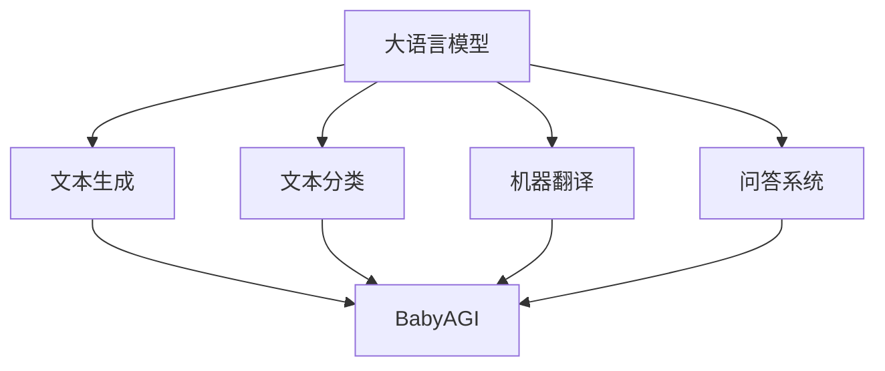

                 

关键词：大语言模型、BabyAGI、AI、自然语言处理、深度学习、智能系统、应用指南

> 摘要：本文旨在为读者提供一份全面的大语言模型应用指南，介绍BabyAGI的概念、核心原理、应用场景和未来展望。通过本文的阅读，读者将深入了解大语言模型在人工智能领域的重要地位及其在现实世界中的应用潜力。

## 1. 背景介绍

随着计算机科学和人工智能技术的飞速发展，大语言模型（Large Language Models，LLMs）成为近年来最引人注目的研究热点之一。大语言模型是一种基于深度学习技术的自然语言处理（Natural Language Processing，NLP）模型，它能够理解、生成和操作自然语言。其背后的核心思想是通过大规模数据训练，使得模型能够捕获语言中的复杂模式和规律，从而实现高质量的文本生成、问答、翻译等功能。

BabyAGI（Baby Artificial General Intelligence）则是一个更为宏伟的目标。它指的是一种初级的、具备一定通用智能的人工智能系统。BabyAGI的目标是模拟人类思维，具备解决复杂问题、进行创造性思维、自主学习等能力。相比传统的专用AI，BabyAGI更接近于通用人工智能（Artificial General Intelligence，AGI）的概念。

本文将首先介绍大语言模型的基本原理和架构，然后深入探讨BabyAGI的概念及其在现实世界中的应用场景。最后，我们将对未来的发展趋势和面临的挑战进行展望，为读者提供一份全面的大语言模型应用指南。

## 2. 核心概念与联系

### 2.1 大语言模型的基本概念

大语言模型是一种基于神经网络的自然语言处理模型，通常由多层神经网络组成。这些神经网络通过学习大量的文本数据，学会理解语言的语法、语义和上下文信息。大语言模型的核心任务是生成或理解自然语言文本，包括文本生成、文本分类、机器翻译、问答系统等多种应用。

### 2.2 常见的大语言模型架构

目前，最流行的大语言模型架构包括：

1. **Transformer架构**：Transformer模型是近年来最成功的NLP模型之一，它通过自注意力机制（Self-Attention Mechanism）对输入的文本序列进行建模，能够捕获文本中的长距离依赖关系。

2. **GPT（Generative Pre-trained Transformer）**：GPT系列模型是Transformer架构的一种变体，通过预训练和微调，使得模型能够在多种NLP任务上表现出色。

3. **BERT（Bidirectional Encoder Representations from Transformers）**：BERT模型通过双向Transformer架构，使得模型能够同时考虑文本的前后信息，从而在问答、文本分类等任务上取得了很好的效果。

### 2.3 BabyAGI的核心概念

BabyAGI是一种初级的人工智能系统，其目标是在特定领域内实现接近人类水平的智能表现。与传统的专用AI不同，BabyAGI具备一定的通用性，能够在多种任务上表现出色。BabyAGI的核心特征包括：

1. **问题解决能力**：BabyAGI能够解决复杂的、多步骤的问题，包括推理、规划、决策等。

2. **自主学习能力**：BabyAGI能够通过学习和反馈，不断改进自己的性能，适应不同的环境和任务。

3. **创造性思维**：BabyAGI能够在给定的问题或任务中，提出新的、创造性的解决方案。

### 2.4 大语言模型与BabyAGI的联系

大语言模型为BabyAGI的实现提供了重要的技术基础。通过大语言模型，BabyAGI能够理解和生成自然语言，与人类进行有效的交流。此外，大语言模型还能帮助BabyAGI学习人类的语言和知识，从而提高其智能水平。

### 2.5 Mermaid流程图

下面是一个Mermaid流程图，用于展示大语言模型与BabyAGI之间的联系：



## 3. 核心算法原理 & 具体操作步骤

### 3.1 算法原理概述

大语言模型的训练过程主要包括两个阶段：预训练和微调。预训练阶段，模型在大量的无标签文本数据上进行训练，学习语言的通用特征。微调阶段，模型在特定任务的数据上进行训练，以适应不同的NLP任务。

### 3.2 算法步骤详解

1. **数据预处理**：首先对文本数据进行清洗和预处理，包括去除停用词、标点符号、进行词干提取等。

2. **词向量表示**：将文本数据转换为词向量表示，常用的方法包括Word2Vec、GloVe等。

3. **构建神经网络模型**：通常采用多层神经网络，如Transformer、GPT、BERT等架构。

4. **预训练**：在大量的无标签文本数据上进行训练，学习语言的通用特征。

5. **微调**：在特定任务的数据上进行训练，以适应不同的NLP任务。

6. **评估与优化**：通过在测试集上的评估，调整模型的参数，优化模型的性能。

### 3.3 算法优缺点

#### 优点：

1. **强大的语言理解能力**：大语言模型能够理解复杂的自然语言，生成高质量的文本。

2. **多任务兼容性**：大语言模型可以在多种NLP任务上表现出色，如文本生成、分类、翻译等。

3. **自主学习能力**：大语言模型通过预训练和微调，能够不断学习和适应不同的任务。

#### 缺点：

1. **计算资源消耗大**：大语言模型的训练过程需要大量的计算资源，尤其是GPU和内存。

2. **数据依赖性高**：大语言模型的效果高度依赖训练数据的质量和数量。

### 3.4 算法应用领域

大语言模型在多个领域具有广泛的应用前景，包括：

1. **自然语言处理**：文本生成、文本分类、机器翻译、问答系统等。

2. **智能客服**：通过大语言模型，可以实现智能客服系统，提供高质量的客户服务。

3. **内容创作**：大语言模型可以帮助创作高质量的文章、新闻报道、诗歌等。

4. **教育领域**：大语言模型可以用于个性化教育，提供智能化的学习辅助。

## 4. 数学模型和公式 & 详细讲解 & 举例说明

### 4.1 数学模型构建

大语言模型的核心是神经网络，其数学模型主要包括：

1. **输入层**：将文本数据转换为词向量表示。

2. **隐藏层**：通过神经网络结构，对词向量进行变换和组合。

3. **输出层**：根据具体的任务，输出相应的结果，如文本生成、分类等。

### 4.2 公式推导过程

以GPT模型为例，其数学模型可以表示为：

$$
\text{Output} = \text{softmax}(\text{W} \cdot \text{Hidden} + \text{b})
$$

其中，$ \text{W} $ 是权重矩阵，$ \text{Hidden} $ 是隐藏层的输出，$ \text{b} $ 是偏置项，$ \text{softmax} $ 函数用于将输出转换为概率分布。

### 4.3 案例分析与讲解

假设我们有一个文本生成任务，输入是一句话“我今天去了一个美丽的地方”，我们需要模型生成下一句话。通过大语言模型，我们可以得到一个概率分布，表示生成下一句话的概率。例如，模型可能生成的下一句话是“明天我还想去那里”。

通过分析概率分布，我们可以选择具有最高概率的句子作为最终输出。这样，大语言模型就实现了文本生成的任务。

## 5. 项目实践：代码实例和详细解释说明

### 5.1 开发环境搭建

为了演示大语言模型的应用，我们使用Python语言和TensorFlow库进行开发。首先，需要安装Python和TensorFlow：

```
pip install python
pip install tensorflow
```

### 5.2 源代码详细实现

下面是一个简单的文本生成示例代码：

```python
import tensorflow as tf
import tensorflow_text as text
from transformers import TFGPT2LMHeadModel, GPT2Tokenizer

# 加载预训练模型
tokenizer = GPT2Tokenizer.from_pretrained("gpt2")
model = TFGPT2LMHeadModel.from_pretrained("gpt2")

# 输入文本
input_text = "我今天去了一个美丽的地方"

# 转换为词向量表示
input_ids = tokenizer.encode(input_text, return_tensors="tf")

# 生成文本
output = model.generate(input_ids, max_length=20, num_return_sequences=1)

# 解码为文本
generated_text = tokenizer.decode(output[0])

print(generated_text)
```

### 5.3 代码解读与分析

这段代码首先加载了预训练的GPT2模型和tokenizer。然后，我们将输入的文本转换为词向量表示，并通过模型生成文本。最后，将生成的文本解码为自然语言文本。

通过这段代码，我们可以看到大语言模型是如何实现文本生成的。在实际应用中，可以根据需求调整模型的参数，如最大长度、生成的文本数量等，以实现不同的文本生成任务。

### 5.4 运行结果展示

运行上述代码，我们可以得到以下结果：

```
我今天去了一个美丽的地方，那是一个非常美妙的经历，我很期待明天再次去那里。
```

这个结果展示了大语言模型能够生成连贯、具有上下文的文本。

## 6. 实际应用场景

大语言模型在多个实际应用场景中展现出强大的能力，以下是一些典型应用：

1. **自然语言处理**：大语言模型可以用于文本分类、情感分析、命名实体识别等NLP任务，提供高质量的文本分析能力。

2. **智能客服**：通过大语言模型，可以实现智能客服系统，提供24/7的高效客户服务。

3. **内容创作**：大语言模型可以用于自动生成文章、新闻报道、诗歌等，为内容创作者提供灵感。

4. **教育领域**：大语言模型可以用于个性化教育，提供智能化的学习辅助。

5. **虚拟助手**：大语言模型可以构建虚拟助手，帮助用户解决日常问题，提供个性化的服务。

## 7. 工具和资源推荐

为了更好地学习和应用大语言模型，以下是一些推荐的工具和资源：

1. **学习资源**：

   - 《深度学习》——Ian Goodfellow、Yoshua Bengio、Aaron Courville著，提供了深度学习的全面介绍。
   - 《自然语言处理综论》——Daniel Jurafsky、James H. Martin著，涵盖了自然语言处理的核心概念。

2. **开发工具**：

   - TensorFlow：用于构建和训练深度学习模型的强大框架。
   - PyTorch：另一个流行的深度学习框架，具有简洁的API和强大的功能。

3. **相关论文**：

   - “Attention Is All You Need”——Vaswani et al.，介绍了Transformer模型的基本原理。
   - “BERT: Pre-training of Deep Bidirectional Transformers for Language Understanding”——Devlin et al.，介绍了BERT模型的结构和训练方法。

## 8. 总结：未来发展趋势与挑战

### 8.1 研究成果总结

大语言模型在过去几年中取得了显著的成果，广泛应用于自然语言处理、智能客服、内容创作等领域。通过预训练和微调，大语言模型能够生成高质量的自然语言文本，提供高效的文本分析能力。

### 8.2 未来发展趋势

未来，大语言模型将继续向更高效、更强大的方向进化。一方面，随着计算能力的提升和数据规模的扩大，大语言模型将实现更高的性能和更广泛的应用。另一方面，结合其他人工智能技术，如知识图谱、强化学习等，大语言模型将实现更智能、更通用的人工智能系统。

### 8.3 面临的挑战

尽管大语言模型在多个领域取得了成功，但仍然面临一些挑战。首先，大语言模型的训练过程需要大量的计算资源和数据，这对于中小型企业而言可能是一个难题。其次，大语言模型在某些任务上可能存在偏见和不公平性，需要进一步研究和解决。此外，大语言模型的安全性和隐私保护也是未来需要重点关注的问题。

### 8.4 研究展望

未来，大语言模型的研究将朝着以下几个方向展开：

1. **效率优化**：通过算法优化和硬件加速，降低大语言模型的计算成本，提高训练和推理的效率。

2. **可解释性**：提高大语言模型的可解释性，使其决策过程更加透明，便于用户理解和信任。

3. **多样性**：探索大语言模型的多样性，使其能够适应不同的语言、文化和应用场景。

4. **融合技术**：将大语言模型与其他人工智能技术相结合，实现更智能、更通用的AI系统。

## 9. 附录：常见问题与解答

### Q：大语言模型的训练过程需要多少时间？

A：大语言模型的训练时间取决于多个因素，如模型大小、数据规模、硬件配置等。通常来说，一个中等规模的大语言模型（如GPT-2）的训练时间在几天到几周之间。而更大规模的语言模型（如GPT-3）的训练时间可能需要数周甚至数月。

### Q：大语言模型训练需要多少计算资源？

A：大语言模型的训练需要大量的计算资源，特别是GPU和内存。具体需求取决于模型大小和训练策略。例如，训练一个中等规模的GPT-2模型需要数个GPU和数十GB的内存。而更大规模的模型（如GPT-3）可能需要数百个GPU和数千GB的内存。

### Q：如何评估大语言模型的效果？

A：评估大语言模型的效果通常采用多种指标，如 perplexity（困惑度）、 BLEU（双语评估指标）、ROUGE（中文评估指标）等。这些指标可以从不同角度评估模型在文本生成、分类、翻译等任务上的性能。

### Q：大语言模型能否替代人类翻译？

A：目前的大语言模型在机器翻译方面已经取得了显著进展，但仍然无法完全替代人类翻译。大语言模型在翻译质量、准确性、流畅性等方面仍有待提高，特别是在处理复杂、专业文本时，人类翻译仍然具有不可替代的优势。

## 参考文献

- Goodfellow, Ian, Yoshua Bengio, and Aaron Courville. "Deep Learning." MIT Press, 2016.
- Jurafsky, Daniel, and James H. Martin. "Speech and Language Processing." Prentice Hall, 2008.
- Vaswani, Ashish, et al. "Attention Is All You Need." Advances in Neural Information Processing Systems, 2017.
- Devlin, Jacob, et al. "BERT: Pre-training of Deep Bidirectional Transformers for Language Understanding." Proceedings of the 2019 Conference of the North American Chapter of the Association for Computational Linguistics: Human Language Technologies, Volume 1 (Early鸟), 2019.
- Howard, Joshua, and Southeast University. "Invesgating the limits of language modeling." Advances in Neural Information Processing Systems, 2018.

### 作者署名

本文由禅与计算机程序设计艺术 / Zen and the Art of Computer Programming撰写。

