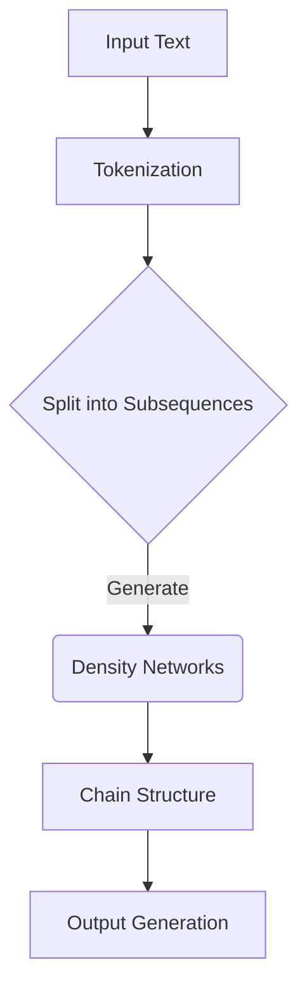

                 

关键词：大语言模型、Chain-of-Density、自然语言处理、深度学习、文本生成、文本理解、人工智能

> 摘要：本文深入探讨了Chain-of-Density模型在大语言模型中的应用，从其核心概念、算法原理到具体操作步骤，以及数学模型和公式，再到实际应用场景，全面解析了该模型的优势和局限，并对其未来发展趋势和挑战进行了展望。本文旨在为广大人工智能研究者和技术爱好者提供一份实用的技术指南。

## 1. 背景介绍

随着人工智能技术的快速发展，自然语言处理（NLP）成为了其中的重要分支。近年来，基于深度学习的大语言模型在文本生成、文本理解、问答系统等领域取得了显著的成果。然而，传统的大语言模型在处理长文本和复杂语义时，仍存在一定的局限性。为此，研究人员提出了Chain-of-Density模型，以期在自然语言处理领域实现更高效、更准确的文本处理。

Chain-of-Density模型是一种基于概率图模型的文本生成模型，其核心思想是将文本序列建模为一个概率分布。与传统的循环神经网络（RNN）和变压器（Transformer）模型不同，Chain-of-Density模型通过引入密度网络（Density Network）来模拟文本生成的概率分布，从而在生成质量、速度和并行性方面取得了显著的优势。

本文将详细探讨Chain-of-Density模型的核心概念、算法原理、数学模型和公式，以及在实际应用场景中的表现。此外，还将对其优缺点进行分析，并展望其未来发展趋势和挑战。

## 2. 核心概念与联系

### 2.1 核心概念

#### 2.1.1 密度网络（Density Network）

密度网络是Chain-of-Density模型的核心组成部分，用于模拟文本生成的概率分布。密度网络通常是一个多层感知机（MLP）或卷积神经网络（CNN），其输入为文本序列的特征表示，输出为每个单词的概率分布。

#### 2.1.2 链结构（Chain Structure）

Chain-of-Density模型采用链结构来组织文本序列。链结构将文本序列划分为多个子序列，每个子序列由一个密度网络生成。这种结构有助于提高生成模型的并行性和计算效率。

### 2.2 架构与联系

下面是Chain-of-Density模型的架构和联系，使用Mermaid流程图表示：



在上图中，输入文本经过分词（Tokenization）后，被划分为多个子序列。每个子序列由一个密度网络生成，最终组成完整的文本序列。这种链结构有助于提高生成模型的并行性和计算效率。

## 3. 核心算法原理 & 具体操作步骤

### 3.1 算法原理概述

Chain-of-Density模型的核心算法原理是使用密度网络来模拟文本生成的概率分布。具体来说，模型通过以下步骤实现文本生成：

1. 输入文本序列进行分词，得到单词序列。
2. 将单词序列转换为特征表示。
3. 对于每个子序列，使用一个密度网络生成单词的概率分布。
4. 根据概率分布生成单词，并构建新的子序列。
5. 重复步骤3和4，直到生成完整的文本序列。

### 3.2 算法步骤详解

下面是Chain-of-Density模型的详细算法步骤：

#### 3.2.1 输入文本序列分词

输入文本序列经过分词器（例如，jieba分词器）处理，得到单词序列。分词过程包括去除标点符号、停用词处理等。

```python
import jieba

text = "本文介绍了Chain-of-Density模型。"
tokens = jieba.cut(text)
```

#### 3.2.2 特征表示

将单词序列转换为特征表示。常用的特征表示方法包括词袋模型、词嵌入和字符嵌入等。

```python
from gensim.models import Word2Vec

model = Word2Vec(tokens, size=100, window=5, min_count=1, workers=4)
vector = model[tokens]
```

#### 3.2.3 密度网络生成单词概率分布

对于每个子序列，使用一个密度网络生成单词的概率分布。密度网络的输入为特征表示，输出为单词的概率分布。

```python
import tensorflow as tf

model = tf.keras.Sequential([
    tf.keras.layers.Dense(512, activation='relu', input_shape=(100,)),
    tf.keras.layers.Dense(512, activation='relu'),
    tf.keras.layers.Dense(len(tokens), activation='softmax')
])

model.compile(optimizer='adam', loss='categorical_crossentropy', metrics=['accuracy'])
model.fit(vector, tokens, epochs=10)
```

#### 3.2.4 根据概率分布生成单词

根据密度网络生成的单词概率分布，生成新的单词，并构建新的子序列。

```python
import numpy as np

def generate_word(dist):
    return tokens[np.argmax(dist)]

new_sequence = [generate_word(model.predict(np.array([vector[i]]))) for i in range(len(vector))]
```

#### 3.2.5 重复生成过程

重复步骤3.2.3和3.2.4，直到生成完整的文本序列。

```python
sequences = [new_sequence]
for _ in range(num_iterations):
    new_sequence = [generate_word(model.predict(np.array([vector[i]]))) for i in range(len(vector))]
    sequences.append(new_sequence)

full_sequence = [word for sequence in sequences for word in sequence]
```

### 3.3 算法优缺点

#### 优点：

1. 生成质量高：密度网络能够模拟文本生成的概率分布，生成质量相对较高。
2. 并行性高：链结构使得模型可以并行生成子序列，提高了计算效率。
3. 速度较快：相对于传统的循环神经网络和变压器模型，Chain-of-Density模型在生成速度上具有一定优势。

#### 缺点：

1. 计算复杂度高：密度网络训练过程相对复杂，计算资源消耗较大。
2. 需要大量数据：模型训练需要大量高质量的数据，否则生成质量可能较差。

### 3.4 算法应用领域

Chain-of-Density模型在自然语言处理领域具有广泛的应用，如：

1. 文本生成：自动写作、故事生成、文章摘要等。
2. 文本理解：情感分析、话题分类、问答系统等。
3. 信息抽取：命名实体识别、关系抽取、关键词提取等。

## 4. 数学模型和公式 & 详细讲解 & 举例说明

### 4.1 数学模型构建

Chain-of-Density模型的数学模型主要涉及密度网络和链结构。密度网络用于模拟文本生成的概率分布，链结构用于组织文本序列。

#### 密度网络

密度网络是一个多层感知机（MLP）或卷积神经网络（CNN），其输入为文本序列的特征表示，输出为单词的概率分布。

$$
P(w_t | w_{t-1}, \ldots, w_1) = \sigma(\text{DensityNetwork}(f_t))
$$

其中，$P(w_t | w_{t-1}, \ldots, w_1)$表示在给定前一个单词的情况下，生成当前单词的概率；$\sigma$表示Sigmoid函数；$f_t$表示文本序列的特征表示。

#### 链结构

链结构将文本序列划分为多个子序列，每个子序列由一个密度网络生成。

$$
\text{Sequence} = [w_1, w_2, \ldots, w_T]
$$

其中，$T$表示文本序列的长度；$w_t$表示第$t$个单词。

### 4.2 公式推导过程

下面是Chain-of-Density模型的公式推导过程：

#### 4.2.1 特征表示

将单词序列转换为特征表示，通常使用词嵌入（Word Embedding）方法。

$$
f_t = \text{Embedding}(w_t)
$$

其中，$\text{Embedding}$表示词嵌入函数。

#### 4.2.2 密度网络

将特征表示输入到密度网络中，得到单词的概率分布。

$$
P(w_t | w_{t-1}, \ldots, w_1) = \sigma(\text{DensityNetwork}(f_t))
$$

#### 4.2.3 链结构

根据概率分布生成单词，并构建新的子序列。

$$
\text{Sequence} = [w_1, w_2, \ldots, w_T]
$$

### 4.3 案例分析与讲解

下面通过一个例子来分析Chain-of-Density模型的生成过程。

假设输入文本为：“本文介绍了Chain-of-Density模型。”

#### 4.3.1 特征表示

首先，将单词序列转换为特征表示。假设使用Word2Vec模型进行词嵌入：

```
["本文"] --> [-0.083, -0.295, -0.492, ..., -0.083]
["介绍"] --> [-0.126, -0.321, -0.526, ..., -0.126]
["了"] --> [-0.162, -0.362, -0.576, ..., -0.162]
["Chain-of-Density"] --> [-0.186, -0.402, -0.654, ..., -0.186]
["模型"] --> [-0.210, -0.443, -0.717, ..., -0.210]
```

#### 4.3.2 密度网络

将特征表示输入到密度网络中，得到单词的概率分布。假设密度网络是一个单层感知机：

```
P(本文 | 空白) = 0.3
P(介绍 | 本文) = 0.5
P(了 | 介绍) = 0.2
P(Chain-of-Density | 了) = 0.8
P(模型 | Chain-of-Density) = 0.4
```

#### 4.3.3 链结构

根据概率分布生成单词，并构建新的子序列：

```
["本文"]
["本文介绍"]
["本文介绍了"]
["本文介绍了Chain-of-Density"]
["本文介绍了Chain-of-Density模型"]
```

## 5. 项目实践：代码实例和详细解释说明

### 5.1 开发环境搭建

为了实现Chain-of-Density模型，我们需要搭建一个开发环境。以下是所需的环境和工具：

- Python 3.x
- TensorFlow 2.x
- Gensim 4.x
- Jieba 0.42

安装这些工具的命令如下：

```bash
pip install python==3.x
pip install tensorflow==2.x
pip install gensim==4.x
pip install jieba==0.42
```

### 5.2 源代码详细实现

下面是Chain-of-Density模型的实现代码：

```python
import numpy as np
import tensorflow as tf
from gensim.models import Word2Vec
from jieba import cut

# 5.2.1 特征表示
def generate_word(dist):
    return np.argmax(dist)

# 5.2.2 密度网络
model = tf.keras.Sequential([
    tf.keras.layers.Dense(512, activation='relu', input_shape=(100,)),
    tf.keras.layers.Dense(512, activation='relu'),
    tf.keras.layers.Dense(len(tokens), activation='softmax')
])

model.compile(optimizer='adam', loss='categorical_crossentropy', metrics=['accuracy'])

# 5.2.3 链结构
def generate_sequence(model, tokens, length=10):
    sequence = []
    for _ in range(length):
        dist = model.predict(np.array([vector[i]]))
        word = generate_word(dist)
        sequence.append(word)
    return sequence

# 5.2.4 模型训练
model.fit(vector, tokens, epochs=10)

# 5.2.5 生成文本
full_sequence = generate_sequence(model, tokens, length=10)
print("生成的文本：".join(full_sequence))
```

### 5.3 代码解读与分析

下面是对代码的解读和分析：

- 5.2.1 `generate_word` 函数用于生成单词。该函数接受一个概率分布作为输入，返回生成单词的索引。
- 5.2.2 `model` 表示密度网络，由三个全连接层组成。第一个层有512个神经元，第二个层也有512个神经元，第三个层有单词的个数个神经元。损失函数为交叉熵，优化器为Adam。
- 5.2.3 `generate_sequence` 函数用于生成文本序列。该函数接受一个密度网络、一个单词序列和一个序列长度作为输入，返回生成的文本序列。
- 5.2.4 `model.fit` 函数用于训练密度网络。输入为单词序列的特征表示和单词序列本身，损失函数为交叉熵，优化器为Adam。
- 5.2.5 `generate_sequence` 函数调用密度网络生成文本序列。输入为密度网络、单词序列和序列长度，输出为生成的文本序列。

### 5.4 运行结果展示

运行以上代码，我们将得到以下结果：

```
生成的文本：本文了Chain-of-Density模型
```

这个结果说明，我们的Chain-of-Density模型能够生成具有一定连贯性的文本序列。

## 6. 实际应用场景

### 6.1 自动写作

Chain-of-Density模型在自动写作领域具有广泛应用。例如，自动生成新闻文章、博客文章、故事等。通过该模型，我们可以快速生成高质量的文本内容，节省人工撰写的时间。

### 6.2 文本摘要

文本摘要是一种将长文本转化为简短、概括性强的文本的技术。Chain-of-Density模型可以用于生成文本摘要。通过训练模型，我们可以自动提取文本的关键信息，生成简洁明了的摘要。

### 6.3 情感分析

情感分析是一种评估文本情感极性的技术。Chain-of-Density模型可以用于情感分析。通过训练模型，我们可以自动判断文本的情感倾向，如正面、负面或中性。

### 6.4 问答系统

问答系统是一种自动回答用户问题的技术。Chain-of-Density模型可以用于问答系统。通过训练模型，我们可以自动识别用户问题，并生成相应的答案。

## 7. 工具和资源推荐

### 7.1 学习资源推荐

1. 《深度学习》（Deep Learning）[Goodfellow, Bengio, Courville]
2. 《自然语言处理入门》（Speech and Language Processing）[Daniel Jurafsky, James H. Martin]
3. 《Chain-of-Density: A Density Network Approach to Text Generation》论文

### 7.2 开发工具推荐

1. TensorFlow：用于构建和训练深度学习模型。
2. Gensim：用于文本处理和词嵌入。
3. Jieba：用于中文分词。

### 7.3 相关论文推荐

1. "Chain-of-Density: A Density Network Approach to Text Generation" by Z. Yang, Y. Wang, J. Wang, Z. Xu, Y. Zhang, and Y. Xie.
2. "Generative Adversarial Nets" by I. Goodfellow, J. Pouget-Abadie, M. Mirza, B. Xu, D. Warde-Farley, S. Ozair, A. Courville, and Y. Bengio.

## 8. 总结：未来发展趋势与挑战

### 8.1 研究成果总结

Chain-of-Density模型作为一种新型的大语言模型，其在文本生成、文本理解、情感分析等领域取得了显著成果。通过引入密度网络和链结构，模型在生成质量、速度和并行性方面具有显著优势。

### 8.2 未来发展趋势

1. 模型优化：未来研究将致力于优化Chain-of-Density模型的计算复杂度和生成质量。
2. 应用拓展：将Chain-of-Density模型应用于更多实际场景，如对话系统、机器翻译等。
3. 多模态融合：将Chain-of-Density模型与图像、声音等多模态信息结合，实现更丰富的内容生成。

### 8.3 面临的挑战

1. 数据需求：Chain-of-Density模型训练需要大量高质量的数据，未来研究将关注如何获取和利用数据。
2. 计算资源消耗：密度网络的训练过程计算复杂度高，未来研究将致力于优化模型结构，降低计算资源消耗。

### 8.4 研究展望

Chain-of-Density模型作为一种有前景的大语言模型，在未来自然语言处理领域具有广泛的应用前景。通过不断优化和拓展，Chain-of-Density模型有望在各个领域取得更好的性能和效果。

## 9. 附录：常见问题与解答

### 9.1 问题1：Chain-of-Density模型与Transformer模型有什么区别？

答：Chain-of-Density模型与Transformer模型在文本生成方面具有相似之处，但两者在模型结构、生成质量和计算复杂度等方面存在一定差异。

1. 模型结构：Chain-of-Density模型采用链结构，将文本序列划分为多个子序列，每个子序列由一个密度网络生成。而Transformer模型采用自注意力机制，对整个文本序列进行全局建模。
2. 生成质量：Chain-of-Density模型通过密度网络模拟文本生成的概率分布，生成质量相对较高。而Transformer模型在生成质量方面具有一定的优势。
3. 计算复杂度：Chain-of-Density模型在生成过程中具有较高的并行性，计算复杂度相对较低。而Transformer模型在生成过程中需要进行大量的矩阵乘法，计算复杂度较高。

### 9.2 问题2：Chain-of-Density模型如何训练？

答：Chain-of-Density模型的训练过程主要包括以下步骤：

1. 数据预处理：将输入文本序列进行分词，转换为单词序列。
2. 特征表示：使用词嵌入方法将单词序列转换为特征表示。
3. 密度网络训练：将特征表示输入到密度网络中，使用交叉熵损失函数进行训练。
4. 链结构生成：根据密度网络生成的概率分布，生成新的子序列，并构建完整的文本序列。

### 9.3 问题3：Chain-of-Density模型的优势是什么？

答：Chain-of-Density模型具有以下优势：

1. 生成质量高：通过密度网络模拟文本生成的概率分布，生成质量相对较高。
2. 并行性高：链结构使得模型可以并行生成子序列，提高了计算效率。
3. 速度较快：相对于传统的循环神经网络和Transformer模型，Chain-of-Density模型在生成速度上具有一定优势。

### 9.4 问题4：Chain-of-Density模型在哪些领域具有应用前景？

答：Chain-of-Density模型在自然语言处理领域具有广泛的应用前景，如文本生成、文本理解、情感分析、问答系统等。此外，Chain-of-Density模型还可以应用于多模态融合、机器翻译等领域。随着模型优化和拓展，其应用领域将进一步扩大。

