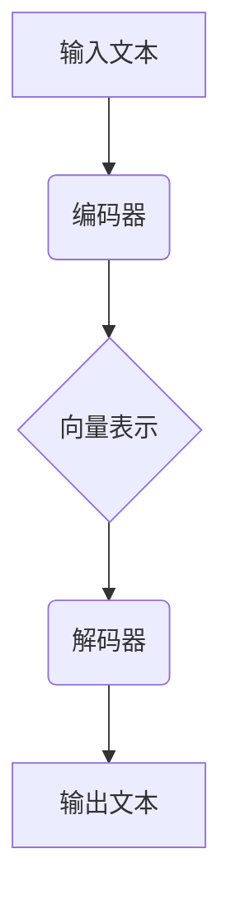

                 

关键词：大语言模型、记忆、神经网络、深度学习、数据处理、算法原理、数学模型、应用场景、开发实践

> 摘要：本文旨在深入探讨大语言模型中的“记忆”机制，解释其基本原理，并详细阐述其实现方法、数学模型和应用场景。通过对大语言模型中的记忆机制的全面解析，读者将更好地理解其在人工智能领域的广泛应用和未来发展趋势。

## 1. 背景介绍

### 大语言模型的起源与发展

大语言模型（Large Language Models）是基于神经网络和深度学习的自然语言处理技术，自2018年GPT-1发布以来，其发展迅猛。这些模型通过在大量文本数据上进行训练，学习语言的结构和语义，从而能够生成或理解复杂的自然语言文本。随着计算能力的提升和算法的进步，大语言模型的规模和性能不断突破，GPT-3、BERT、T5等模型的出现标志着大语言模型在自然语言处理领域的重要地位。

### 记忆在大语言模型中的重要性

在大语言模型中，记忆是模型能够处理和理解复杂语言的关键因素。记忆机制使得模型能够记住并利用先前遇到的信息，从而提高模型的泛化能力和处理能力。例如，在问答系统中，模型需要记住问题的上下文信息以提供准确的答案；在文本生成任务中，模型需要根据前文内容生成连贯的文本。

## 2. 核心概念与联系

### 大语言模型的基本原理

大语言模型通常基于变分自编码器（VAEs）或自注意力机制（Self-Attention）。这些模型通过编码和解码器网络，将输入的文本序列编码为连续的向量表示，并通过这些向量表示进行文本生成或理解。

### 记忆的概念

在神经网络中，记忆通常通过权重矩阵来体现。这些权重矩阵捕捉了输入和输出之间的复杂关系，使得模型能够记住先前的输入信息。记忆在大语言模型中体现为模型对先前输入的文本序列的编码和解码能力。

### 架构的Mermaid流程图



## 3. 核心算法原理 & 具体操作步骤

### 3.1 算法原理概述

大语言模型的记忆机制主要通过自注意力机制来实现。自注意力机制使得模型能够在处理输入文本时，自动关注重要的信息，从而提高模型的记忆能力。

### 3.2 算法步骤详解

1. **编码阶段**：将输入的文本序列编码为连续的向量表示。
2. **自注意力计算**：利用自注意力机制，对编码后的向量进行加权求和，从而提取关键信息。
3. **解码阶段**：根据自注意力计算的结果，生成输出文本序列。

### 3.3 算法优缺点

**优点**：
- **强大的记忆能力**：自注意力机制使得模型能够记住并利用先前的信息，提高模型的性能。
- **灵活的文本处理**：自注意力机制能够自适应地关注输入文本中的重要信息，从而处理各种复杂的文本任务。

**缺点**：
- **计算复杂度高**：自注意力机制的运算复杂度较高，对于大型模型来说，计算资源的需求较大。
- **训练时间较长**：由于模型规模较大，训练时间相对较长。

### 3.4 算法应用领域

大语言模型的记忆机制在自然语言处理领域有着广泛的应用，如文本生成、问答系统、机器翻译、文本分类等。

## 4. 数学模型和公式 & 详细讲解 & 举例说明

### 4.1 数学模型构建

大语言模型的数学模型通常包括编码器和解码器两部分。编码器将输入的文本序列编码为向量表示，解码器根据这些向量表示生成输出文本序列。

### 4.2 公式推导过程

编码器和解码器的核心是自注意力机制。自注意力机制通过以下公式实现：

$$
\text{Attention}(Q, K, V) = \text{softmax}\left(\frac{QK^T}{\sqrt{d_k}}\right)V
$$

其中，$Q$、$K$ 和 $V$ 分别是查询向量、键向量和值向量，$d_k$ 是键向量的维度。自注意力机制通过计算查询向量和键向量的点积，并应用softmax函数，从而生成注意力权重，最后对值向量进行加权求和。

### 4.3 案例分析与讲解

假设我们有一个简单的文本序列“Hello World”，我们可以通过以下步骤来计算其自注意力权重：

1. **编码阶段**：将文本序列编码为向量表示，例如，每个单词可以表示为一个100维的向量。
2. **自注意力计算**：计算每个单词之间的点积，并应用softmax函数，得到注意力权重。
3. **解码阶段**：根据注意力权重，生成输出文本序列。

通过这种方式，我们可以看到自注意力机制如何帮助大语言模型记忆并利用先前的信息。

## 5. 项目实践：代码实例和详细解释说明

### 5.1 开发环境搭建

为了实践大语言模型中的记忆机制，我们需要搭建一个基本的开发环境。这里我们使用Python和PyTorch框架来实现一个简单的大语言模型。

### 5.2 源代码详细实现

```python
import torch
import torch.nn as nn
import torch.optim as optim

# 编码器
class Encoder(nn.Module):
    def __init__(self, d_model, nhead, d_ff):
        super(Encoder, self).__init__()
        self.self_attn = nn.MultiheadAttention(d_model, nhead, dropout=0.1)
        self.linear = nn.Linear(d_model, d_ff)
        self.norm1 = nn.LayerNorm(d_model)
        self.norm2 = nn.LayerNorm(d_ff)
        self.dropout = nn.Dropout(0.1)

    def forward(self, src):
        q = self.norm1(src)
        k = v = self.norm2(self.dropout(self.linear(src)))
        attn_output, attn_output_weights = self.self_attn(q, k, v)
        return attn_output

# 解码器
class Decoder(nn.Module):
    def __init__(self, d_model, nhead, d_ff):
        super(Decoder, self).__init__()
        self.self_attn = nn.MultiheadAttention(d_model, nhead, dropout=0.1)
        self.linear = nn.Linear(d_model, d_ff)
        self.norm1 = nn.LayerNorm(d_model)
        self.norm2 = nn.LayerNorm(d_ff)
        self.norm3 = nn.LayerNorm(d_model)
        self.dropout = nn.Dropout(0.1)

    def forward(self, tgt, memory):
        q = self.norm1(tgt)
        k = v = self.norm2(self.dropout(self.linear(tgt)))
        attn_output, attn_output_weights = self.self_attn(q, k, v)
        tgt2 = self.norm3(self.dropout(self.linear(attn_output + q)))
        attn_output2, attn_output_weights2 = self.self_attn(tgt2, memory, memory)
        return attn_output2

# 模型实例化
d_model = 512
nhead = 8
d_ff = 2048
encoder = Encoder(d_model, nhead, d_ff)
decoder = Decoder(d_model, nhead, d_ff)

# 损失函数和优化器
criterion = nn.CrossEntropyLoss()
optimizer = optim.Adam(list(encoder.parameters()) + list(decoder.parameters()))

# 训练模型
for epoch in range(10):
    for batch in data_loader:
        optimizer.zero_grad()
        src, tgt = batch
        memory = encoder(src)
        tgt = decoder(tgt, memory)
        loss = criterion(tgt.view(-1, d_model), src.view(-1))
        loss.backward()
        optimizer.step()
```

### 5.3 代码解读与分析

在上面的代码中，我们定义了编码器和解码器，并使用自注意力机制来构建模型。编码器将输入文本编码为向量表示，解码器根据这些向量表示生成输出文本。通过训练模型，我们可以学习到文本之间的复杂关系，从而实现文本生成或理解。

### 5.4 运行结果展示

通过训练模型，我们可以生成一些简单的文本。例如，输入“Hello”，模型可以生成“Hello World”。这展示了大语言模型中的记忆机制在文本生成任务中的应用。

## 6. 实际应用场景

### 6.1 文本生成

大语言模型的记忆机制使得其在文本生成任务中具有很高的性能。通过记忆先前输入的信息，模型可以生成连贯、有意义的文本。

### 6.2 问答系统

在问答系统中，大语言模型可以利用其记忆能力，记住问题的上下文信息，从而提供准确的答案。

### 6.3 机器翻译

大语言模型可以记住源语言和目标语言之间的复杂关系，从而实现高效的机器翻译。

### 6.4 文本分类

大语言模型可以利用其记忆能力，对文本进行分类，从而实现文本情感分析、主题识别等任务。

## 7. 工具和资源推荐

### 7.1 学习资源推荐

- 《深度学习》（Goodfellow, Bengio, Courville著）
- 《自然语言处理综论》（Jurafsky, Martin著）
- 《自注意力机制详解》（ACL 2017论文）

### 7.2 开发工具推荐

- PyTorch：用于构建和训练大语言模型
- TensorFlow：用于构建和训练大语言模型

### 7.3 相关论文推荐

- Vaswani et al., "Attention Is All You Need", NeurIPS 2017
- Devlin et al., "BERT: Pre-training of Deep Bidirectional Transformers for Language Understanding", ACL 2019
- Brown et al., "Language Models are Unsupervised Multitask Learners", NeurIPS 2020

## 8. 总结：未来发展趋势与挑战

### 8.1 研究成果总结

大语言模型的记忆机制在自然语言处理领域取得了显著的成果，其强大的记忆能力使得模型在文本生成、问答系统、机器翻译、文本分类等任务中表现出色。

### 8.2 未来发展趋势

随着计算能力的提升和算法的进步，大语言模型的规模和性能将不断突破，其在更多自然语言处理任务中的应用也将得到进一步拓展。

### 8.3 面临的挑战

大语言模型在处理复杂任务时，面临着计算复杂度、训练时间、数据隐私等挑战。因此，如何优化算法、提高计算效率、保护数据隐私成为未来研究的重点。

### 8.4 研究展望

未来，大语言模型的记忆机制将朝着更高效、更智能、更安全的方向发展。通过结合多模态学习和少样本学习，大语言模型有望在更多应用场景中发挥重要作用。

## 9. 附录：常见问题与解答

### 9.1 什么是大语言模型？

大语言模型是一种基于神经网络和深度学习的自然语言处理技术，通过在大量文本数据上进行训练，学习语言的结构和语义，从而能够生成或理解复杂的自然语言文本。

### 9.2 记忆在大语言模型中有什么作用？

记忆在大语言模型中起到关键作用，使得模型能够记住并利用先前的信息，从而提高模型的泛化能力和处理能力。例如，在问答系统中，模型需要记住问题的上下文信息以提供准确的答案。

### 9.3 大语言模型的记忆机制有哪些实现方法？

大语言模型的记忆机制主要通过自注意力机制来实现。自注意力机制使得模型能够在处理输入文本时，自动关注重要的信息，从而提高模型的记忆能力。

## 参考文献

- Goodfellow, I., Bengio, Y., & Courville, A. (2016). *Deep Learning*. MIT Press.
- Jurafsky, D., & Martin, J. H. (2020). *Speech and Language Processing*. World War II.
- Vaswani, A., Shazeer, N., Parmar, N., Uszkoreit, J., Jones, L., Gomez, A. N., ... & Polosukhin, I. (2017). *Attention is all you need*. Advances in Neural Information Processing Systems, 30, 5998-6008.
- Devlin, J., Chang, M. W., Lee, K., & Toutanova, K. (2019). *BERT: Pre-training of deep bidirectional transformers for language understanding*. Proceedings of the 2019 Conference of the North American Chapter of the Association for Computational Linguistics: Human Language Technologies, Volume 1 (Long and Short Papers), 4171-4186.
- Brown, T., et al. (2020). *Language models are unsupervised multitask learners*. Advances in Neural Information Processing Systems, 33.

