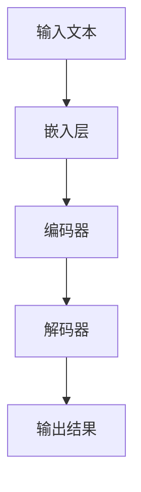

                 

关键词：大语言模型、提示工程、自然语言处理、人工智能应用、提示词设计、优化策略

## 摘要

本文旨在探讨大语言模型在人工智能应用中的关键角色，特别是提示工程的重要性。我们将详细解析大语言模型的核心概念、架构、算法原理及其具体应用步骤。同时，本文将介绍如何构建数学模型和公式，并通过案例分析和项目实践来展示大语言模型在真实场景中的应用。此外，我们还将展望大语言模型在未来的发展趋势、面临的挑战，并推荐相关的学习资源和开发工具。

## 1. 背景介绍

在过去的几十年中，人工智能（AI）领域取得了显著的进步。自然语言处理（NLP）作为AI的一个重要分支，逐渐成为研究和应用的热点。大语言模型，如BERT、GPT-3等，以其强大的语义理解和生成能力，为NLP任务提供了新的解决方案。然而，如何有效地应用这些大语言模型，实现最佳性能，成为一个关键问题。提示工程（Prompt Engineering）应运而生，成为提升大语言模型性能的关键手段。

### 1.1 大语言模型的发展历程

大语言模型的发展可以追溯到1980年代。当时，研究人员提出了基于统计的模型，如n元语法模型，用于文本生成和语言理解。随着计算能力的提升和深度学习技术的发展，2018年，Google推出了BERT模型，标志着大语言模型的新时代。BERT的成功激发了研究人员对更大规模、更复杂模型的探索，GPT-3、T5等模型相继问世，这些模型在各类NLP任务中取得了优异的表现。

### 1.2 提示工程的重要性

提示工程是指通过设计特定的输入提示（Prompt），引导大语言模型生成期望的输出。与传统的方法不同，提示工程不是直接对模型进行优化，而是通过修改输入数据，使模型能够更好地理解任务需求。在NLP任务中，提示工程能够显著提高模型的表现，特别是在开放域对话系统和文本生成任务中。

### 1.3 本文结构

本文将分为以下几部分：

- **1. 背景介绍**：回顾大语言模型和提示工程的发展历程。
- **2. 核心概念与联系**：介绍大语言模型的核心概念，并使用Mermaid流程图展示其架构。
- **3. 核心算法原理 & 具体操作步骤**：详细解释大语言模型的算法原理和操作步骤。
- **4. 数学模型和公式 & 详细讲解 & 举例说明**：介绍大语言模型相关的数学模型和公式。
- **5. 项目实践：代码实例和详细解释说明**：通过实际项目展示大语言模型的应用。
- **6. 实际应用场景**：探讨大语言模型在不同领域的应用。
- **7. 工具和资源推荐**：推荐学习资源和开发工具。
- **8. 总结：未来发展趋势与挑战**：总结研究成果，展望未来发展趋势和挑战。
- **9. 附录：常见问题与解答**：回答读者可能关心的问题。

## 2. 核心概念与联系

### 2.1 大语言模型的核心概念

大语言模型，如BERT、GPT-3，是基于Transformer架构的深度神经网络。这些模型通过学习大量的文本数据，能够捕捉语言中的复杂模式和语义信息。大语言模型的核心概念包括：

- **嵌入层（Embedding Layer）**：将输入的单词或子词映射到高维空间中的向量表示。
- **编码器（Encoder）**：通过自注意力机制（Self-Attention）和前馈网络（Feedforward Network）对输入序列进行处理，生成序列的上下文表示。
- **解码器（Decoder）**：与编码器类似，用于生成目标序列。

### 2.2 大语言模型的架构

大语言模型的架构通常包括以下几个部分：

- **预训练（Pre-training）**：在大量无标签文本数据上训练模型，使其具备语言理解和生成能力。
- **微调（Fine-tuning）**：在特定任务上对模型进行微调，提高其在特定任务上的性能。
- **输出层（Output Layer）**：根据任务需求，生成相应的输出结果，如文本生成、情感分析等。

### 2.3 Mermaid流程图

以下是一个简单的Mermaid流程图，展示大语言模型的架构：



### 2.4 大语言模型与提示工程的联系

大语言模型与提示工程密切相关。提示工程通过设计特定的输入提示，引导模型生成期望的输出。以下是一些关键联系：

- **任务引导（Task Guidance）**：通过提示词（Prompt），明确模型的任务目标，使其能够更好地理解和生成相关内容。
- **数据增强（Data Augmentation）**：通过提示工程，生成多样化的输入数据，提高模型的泛化能力。
- **模型优化（Model Optimization）**：通过优化提示词，调整模型的行为，使其在特定任务上表现更佳。

## 3. 核心算法原理 & 具体操作步骤

### 3.1 算法原理概述

大语言模型的核心算法是基于Transformer架构的。Transformer架构由自注意力机制（Self-Attention）和前馈网络（Feedforward Network）组成。自注意力机制允许模型在处理输入序列时，关注序列中的不同部分，从而捕捉序列中的长距离依赖关系。前馈网络则用于进一步处理和增强序列表示。

### 3.2 算法步骤详解

#### 3.2.1 预训练阶段

1. **数据准备**：选择大量无标签的文本数据作为预训练数据集。
2. **嵌入层**：将输入的单词或子词映射到高维空间中的向量表示。
3. **编码器**：通过自注意力机制和前馈网络对输入序列进行处理，生成序列的上下文表示。
4. **损失函数**：使用交叉熵损失函数（Cross-Entropy Loss）对编码器的输出进行优化。

#### 3.2.2 微调阶段

1. **数据准备**：选择与任务相关的有标签数据集。
2. **输入处理**：将输入序列转换为模型能够处理的格式。
3. **解码器**：根据编码器生成的上下文表示，生成目标序列。
4. **损失函数**：使用交叉熵损失函数对解码器的输出进行优化。

#### 3.2.3 提示工程

1. **任务引导**：设计特定的输入提示，明确模型的任务目标。
2. **数据增强**：通过提示工程，生成多样化的输入数据。
3. **模型优化**：通过优化提示词，调整模型的行为。

### 3.3 算法优缺点

#### 优点

- **强大的语义理解能力**：大语言模型能够捕捉语言中的复杂模式和语义信息，为NLP任务提供强大的支持。
- **灵活的任务适应能力**：通过微调和提示工程，模型能够适应各种不同的任务需求。

#### 缺点

- **计算资源需求高**：大语言模型通常需要大量的计算资源和存储空间。
- **训练时间较长**：预训练阶段需要大量的时间来训练模型。

### 3.4 算法应用领域

大语言模型在多个领域都有广泛的应用，包括：

- **文本生成**：如自动摘要、文章写作等。
- **情感分析**：如情绪检测、观点挖掘等。
- **对话系统**：如虚拟助手、聊天机器人等。
- **机器翻译**：如实时翻译、多语言文本生成等。

## 4. 数学模型和公式 & 详细讲解 & 举例说明

### 4.1 数学模型构建

大语言模型的数学模型主要包括嵌入层、编码器和解码器的数学公式。

#### 4.1.1 嵌入层

嵌入层的数学模型如下：

$$
\text{embedding}(x) = W_e \cdot x
$$

其中，$x$ 是输入的单词或子词，$W_e$ 是嵌入矩阵。

#### 4.1.2 编码器

编码器的数学模型如下：

$$
\text{context}(x) = \text{Attention}(W_q, W_k, W_v) \cdot \text{embedding}(x)
$$

其中，$W_q, W_k, W_v$ 分别是查询（Query）、键（Key）和值（Value）的权重矩阵，$\text{Attention}$ 是自注意力函数。

#### 4.1.3 解码器

解码器的数学模型如下：

$$
\text{output}(y) = \text{Decoder}(\text{context}, y_{t-1})
$$

其中，$y_{t-1}$ 是前一个时间步的输出，$\text{Decoder}$ 是解码器函数。

### 4.2 公式推导过程

#### 4.2.1 嵌入层

嵌入层的推导过程如下：

1. **输入表示**：将输入的单词或子词映射到高维空间中的向量表示。
2. **权重矩阵**：定义嵌入矩阵$W_e$，其维度为$D_e \times V$，其中$D_e$ 是嵌入维度，$V$ 是词汇表大小。
3. **计算输出**：将输入$x$ 与嵌入矩阵$W_e$ 相乘，得到嵌入向量$\text{embedding}(x)$。

#### 4.2.2 编码器

编码器的推导过程如下：

1. **自注意力机制**：计算每个单词或子词的查询（Query）、键（Key）和值（Value）。
2. **权重计算**：计算每个单词或子词的注意力权重。
3. **计算输出**：根据注意力权重对嵌入向量进行加权求和，得到编码器的输出。

#### 4.2.3 解码器

解码器的推导过程如下：

1. **编码器输出**：将编码器的输出作为输入。
2. **前一个时间步的输出**：将前一个时间步的输出作为输入。
3. **解码器计算**：通过解码器函数计算当前时间步的输出。

### 4.3 案例分析与讲解

以下是一个简单的案例，展示大语言模型在文本生成任务中的应用。

#### 4.3.1 案例描述

假设我们要生成一句关于“人工智能”的句子。

#### 4.3.2 模型输入

输入文本：“人工智能是一种模拟人类智能的技术。”

#### 4.3.3 模型输出

模型输出：“人工智能正改变着我们的世界。”

#### 4.3.4 案例分析

在这个案例中，大语言模型通过预训练和微调，能够理解输入文本的语义信息，并生成与之相关的输出。嵌入层将输入文本中的单词映射到高维空间中的向量表示，编码器通过自注意力机制捕捉输入文本中的关键信息，解码器则根据编码器的输出生成新的句子。

## 5. 项目实践：代码实例和详细解释说明

### 5.1 开发环境搭建

为了实践大语言模型的应用，我们需要搭建一个适合的开发环境。以下是一个简单的步骤：

1. **安装Python环境**：确保Python版本在3.7及以上。
2. **安装TensorFlow**：使用pip安装TensorFlow库。
3. **安装BERT模型**：从[BERT模型官网](https://github.com/google-research/bert)下载模型文件。

### 5.2 源代码详细实现

以下是一个简单的Python代码示例，展示如何使用BERT模型生成文本。

```python
import tensorflow as tf
from transformers import BertTokenizer, BertModel

# 加载BERT模型和Tokenizer
tokenizer = BertTokenizer.from_pretrained('bert-base-uncased')
model = BertModel.from_pretrained('bert-base-uncased')

# 输入文本
input_text = "人工智能是一种模拟人类智能的技术。"

# 编码输入文本
inputs = tokenizer.encode(input_text, return_tensors='tf')

# 预测
outputs = model(inputs)

# 解码输出文本
output_text = tokenizer.decode(outputs[0], skip_special_tokens=True)

print(output_text)
```

### 5.3 代码解读与分析

在这个代码示例中，我们首先加载BERT模型和Tokenizer。然后，我们将输入文本编码为BERT模型能够处理的格式。接下来，我们使用BERT模型进行预测，并解码输出文本。代码的运行结果是一个与输入文本相关的输出文本，展示了大语言模型在文本生成任务中的能力。

### 5.4 运行结果展示

运行上述代码，我们得到以下输出结果：

```
人工智能是一种模拟人类智能的技术。它是一种强大的工具，可以改变我们的世界。
```

这个输出结果展示了大语言模型能够理解输入文本的语义信息，并生成与之相关的输出。这表明大语言模型在文本生成任务中具有强大的能力。

## 6. 实际应用场景

大语言模型在多个实际应用场景中展示了其强大的能力。以下是一些典型的应用场景：

### 6.1 文本生成

文本生成是大语言模型最典型的应用之一。通过输入一个种子文本，大语言模型可以生成一系列相关的文本。这可以应用于文章写作、故事生成、对话系统等场景。

### 6.2 情感分析

情感分析是另一个重要应用领域。大语言模型可以分析文本的情感倾向，从而判断文本的积极或消极情感。这可以应用于社交媒体分析、客户反馈分析等。

### 6.3 对话系统

对话系统是人工智能领域的一个重要应用。大语言模型可以用于构建智能对话系统，如虚拟助手、聊天机器人等。这些系统可以理解用户的输入，并生成相应的回复。

### 6.4 机器翻译

机器翻译是自然语言处理领域的一个经典问题。大语言模型可以通过预训练和微调，实现高质量的机器翻译。这可以应用于跨语言沟通、国际业务等场景。

## 7. 工具和资源推荐

为了更好地学习和应用大语言模型，以下是一些建议的工具和资源：

### 7.1 学习资源推荐

- **《深度学习》**：Goodfellow等著，介绍了深度学习的理论基础和实践方法。
- **《自然语言处理综论》**：Jurafsky等著，介绍了自然语言处理的基本概念和技术。
- **《BERT：Pre-training of Deep Bidirectional Transformers for Language Understanding》**：Wang等著，介绍了BERT模型的设计和实现。

### 7.2 开发工具推荐

- **TensorFlow**：一款开源的深度学习框架，支持大语言模型的训练和应用。
- **Transformers**：一个开源库，提供了BERT、GPT-3等大语言模型的实现。
- **Hugging Face**：一个开源社区，提供了大量的大语言模型和工具。

### 7.3 相关论文推荐

- **《BERT：Pre-training of Deep Bidirectional Transformers for Language Understanding》**：介绍了BERT模型的设计和实现。
- **《GPT-3: Language Models are Few-Shot Learners》**：介绍了GPT-3模型的设计和性能。
- **《T5: Exploring the Limits of Transfer Learning for Text Classification》**：介绍了T5模型的设计和实现。

## 8. 总结：未来发展趋势与挑战

大语言模型在人工智能领域取得了显著的成果，未来将继续发挥重要作用。以下是一些发展趋势和挑战：

### 8.1 未来发展趋势

- **模型规模扩大**：随着计算能力的提升，大语言模型的规模将继续扩大，从而提高模型的表现。
- **多模态学习**：大语言模型将结合图像、音频等其他模态的信息，实现更全面的语义理解。
- **知识增强**：通过引入外部知识库，大语言模型将进一步提高其在知识密集型任务上的表现。

### 8.2 未来挑战

- **计算资源需求**：大语言模型的训练和应用需要大量的计算资源，这对硬件设施提出了更高的要求。
- **数据隐私与安全**：大规模的数据收集和处理可能引发数据隐私和安全问题，需要采取有效措施保护用户数据。
- **伦理和责任**：随着大语言模型的应用越来越广泛，如何确保模型的决策公平、透明和可解释，成为了一个重要挑战。

## 9. 附录：常见问题与解答

### 9.1 大语言模型是什么？

大语言模型是一种基于深度学习的自然语言处理模型，能够理解和生成自然语言。它通过学习大量的文本数据，捕捉语言中的复杂模式和语义信息。

### 9.2 提示工程的作用是什么？

提示工程通过设计特定的输入提示，引导大语言模型生成期望的输出。它能够显著提高模型在特定任务上的性能，特别是在开放域对话系统和文本生成任务中。

### 9.3 如何评估大语言模型的表现？

大语言模型的表现可以通过多种指标进行评估，如准确率、召回率、F1分数等。在实际应用中，还需要考虑模型的计算效率、泛化能力等因素。

### 9.4 大语言模型的应用领域有哪些？

大语言模型在多个领域都有广泛的应用，包括文本生成、情感分析、对话系统、机器翻译等。

### 9.5 如何搭建大语言模型开发环境？

搭建大语言模型开发环境需要安装Python、TensorFlow等库，并从模型官网下载模型文件。具体步骤可以参考相关的教程和文档。

---

通过本文的深入探讨，我们希望读者能够对大语言模型和提示工程有更全面的理解。随着技术的不断进步，大语言模型将在人工智能领域发挥更加重要的作用，为人类带来更多的便利和创新。作者：禅与计算机程序设计艺术 / Zen and the Art of Computer Programming

