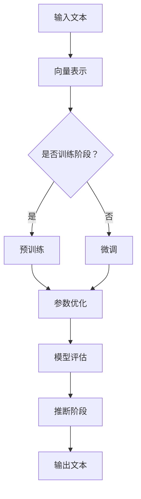

                 

关键词：大语言模型，自然语言处理，任务统一，应用指南，算法原理，数学模型，项目实践

摘要：本文旨在为读者提供一个全面的大语言模型应用指南，深入探讨大语言模型在自然语言处理领域的统一任务处理能力。本文将详细介绍大语言模型的核心概念、算法原理、数学模型，并通过实际项目实践和未来展望，帮助读者理解和应用这一强大的技术工具。

## 1. 背景介绍

在当今信息化社会中，自然语言处理（Natural Language Processing，NLP）已成为人工智能领域的重要分支。NLP旨在让计算机理解和处理人类语言，实现人机交互的智能化。随着计算能力的提升和海量数据的积累，大语言模型（Large Language Models）应运而生，成为NLP领域的核心技术。大语言模型具有强大的语义理解、文本生成和语言预测能力，能够处理包括问答系统、机器翻译、文本摘要、情感分析等多种自然语言任务。

然而，尽管大语言模型在许多任务上表现出色，但其应用仍然面临诸多挑战。一方面，大语言模型的设计和训练过程复杂，需要大量的计算资源和数据支持；另一方面，不同任务之间存在一定的差异，如何统一处理这些任务成为了一个关键问题。

本文将围绕大语言模型的统一自然语言任务处理能力，详细探讨其核心概念、算法原理、数学模型以及实际应用。希望通过本文的介绍，读者能够更好地理解大语言模型的工作原理，并在实际项目中应用这一技术。

## 2. 核心概念与联系

### 大语言模型简介

大语言模型（Large Language Models）是基于深度学习技术的一种人工智能模型，旨在通过学习海量语言数据，模拟人类语言生成和理解能力。大语言模型通常由大规模神经网络组成，具有数亿甚至数十亿个参数。其基本原理是通过反向传播算法，不断调整网络参数，使得模型在训练数据上的表现逐渐趋于理想。

大语言模型在自然语言处理领域具有广泛的应用，如文本分类、情感分析、机器翻译、文本生成等。其核心优势在于能够处理复杂的语义信息，实现跨领域的知识融合和迁移。

### 大语言模型的工作原理

大语言模型的工作原理主要分为两个阶段：训练阶段和推断阶段。

#### 训练阶段

在训练阶段，大语言模型通过学习海量语言数据，自动发现语言中的规律和模式。具体来说，模型会读取文本数据，将其表示为向量形式，然后利用神经网络结构，通过反向传播算法不断调整参数，使得模型在训练数据上的表现逐步提高。

训练阶段的核心任务是参数优化。为了优化参数，大语言模型通常采用以下策略：

1. **预训练**：在特定任务数据集之外，利用大规模通用语言数据对模型进行预训练，以提取通用的语言特征。
2. **微调**：在预训练的基础上，利用特定任务的数据对模型进行微调，使得模型在特定任务上表现更优。
3. **迁移学习**：将预训练模型应用于不同任务，利用模型在通用语言特征上的迁移能力，提高新任务上的表现。

#### 推断阶段

在推断阶段，大语言模型根据输入文本，生成相应的输出。具体来说，模型会读取输入文本，将其表示为向量形式，然后利用神经网络结构，通过推理算法，生成符合语言规律的输出文本。

推断阶段的核心任务是文本生成。为了实现高效的文本生成，大语言模型通常采用以下策略：

1. **序列生成**：将输入文本序列映射为输出文本序列，实现文本的逐词生成。
2. **注意力机制**：利用注意力机制，关注输入文本中与输出文本相关的重要信息，提高生成文本的质量。
3. **长短期记忆（LSTM）**：利用LSTM结构，处理输入文本中的长距离依赖关系，提高生成文本的连贯性。

### 大语言模型的 Mermaid 流程图

下面是使用 Mermaid 语法表示的大语言模型的工作流程：



通过上述 Mermaid 流程图，我们可以清晰地看到大语言模型从输入文本到输出文本的整个过程。这个过程涉及了从数据预处理、模型训练、参数优化到模型评估和推断等多个环节，每个环节都有其独特的策略和挑战。

## 3. 核心算法原理 & 具体操作步骤

### 3.1 算法原理概述

大语言模型的算法原理主要基于深度学习技术，特别是神经网络和优化算法。具体来说，大语言模型的核心算法包括以下几个部分：

1. **神经网络结构**：大语言模型通常采用多层神经网络结构，包括卷积神经网络（CNN）、循环神经网络（RNN）、长短时记忆网络（LSTM）和变换器（Transformer）等。这些神经网络结构能够有效地捕捉文本数据中的时空关系和语义信息。

2. **优化算法**：大语言模型的优化算法通常采用随机梯度下降（SGD）及其变种，如Adam优化器、RMSprop优化器等。这些优化算法能够有效地调整神经网络参数，提高模型在训练数据上的表现。

3. **预训练和微调**：大语言模型的训练过程通常分为预训练和微调两个阶段。预训练利用大规模通用语言数据对模型进行初始化，使得模型具有通用的语言特征；微调则利用特定任务的数据对模型进行精细调整，使得模型在特定任务上表现更优。

4. **迁移学习**：大语言模型通过迁移学习，将预训练模型应用于不同任务，利用模型在通用语言特征上的迁移能力，提高新任务上的表现。

### 3.2 算法步骤详解

1. **数据预处理**：首先，对输入文本进行预处理，包括分词、词向量化、文本清洗等操作。这些操作旨在将文本数据转换为适合神经网络处理的格式。

2. **模型初始化**：利用预训练数据，初始化神经网络模型。这一步骤通常采用预训练模型，如GPT、BERT等。

3. **预训练**：在预训练阶段，模型通过学习大规模通用语言数据，提取通用的语言特征。这一阶段主要关注模型的参数优化和模型评估。

4. **微调**：在预训练的基础上，利用特定任务的数据对模型进行微调。这一阶段主要关注模型在特定任务上的表现。

5. **迁移学习**：将预训练模型应用于不同任务，利用模型在通用语言特征上的迁移能力，提高新任务上的表现。

6. **模型评估**：对模型进行评估，包括准确率、召回率、F1值等指标。这些指标用于衡量模型在训练数据集上的表现。

7. **推断**：在推断阶段，模型根据输入文本，生成相应的输出文本。这一阶段主要关注模型的实时表现和文本生成质量。

### 3.3 算法优缺点

**优点**：

1. **强大的语义理解能力**：大语言模型能够捕捉文本数据中的深层语义信息，实现跨领域的知识融合和迁移。
2. **高效的文本生成**：大语言模型采用先进的神经网络结构和优化算法，能够高效地生成高质量文本。
3. **广泛的任务适用性**：大语言模型可以应用于多种自然语言任务，如文本分类、情感分析、机器翻译等。

**缺点**：

1. **计算资源消耗大**：大语言模型的训练和推理过程需要大量的计算资源和数据支持。
2. **数据依赖性高**：大语言模型的表现高度依赖训练数据的质量和数量，易受到数据偏差的影响。
3. **模型解释性差**：大语言模型的内部结构和决策过程复杂，难以进行模型解释和可视化。

### 3.4 算法应用领域

大语言模型在自然语言处理领域具有广泛的应用，以下是几个典型应用领域：

1. **文本分类**：大语言模型可以用于对文本进行分类，如新闻分类、情感分类等。通过学习大量分类标签，模型能够自动识别文本的主题和情感倾向。

2. **情感分析**：大语言模型可以用于对文本进行情感分析，判断文本的情感倾向，如积极、消极等。这一技术广泛应用于社交媒体监控、舆情分析等领域。

3. **机器翻译**：大语言模型可以用于机器翻译任务，将一种语言的文本翻译成另一种语言。通过学习双语语料库，模型能够自动生成高质量的双语翻译。

4. **文本摘要**：大语言模型可以用于文本摘要任务，自动生成文本的摘要。这一技术广泛应用于新闻摘要、文档摘要等领域。

5. **问答系统**：大语言模型可以用于问答系统，根据用户的问题，自动生成相应的答案。这一技术广泛应用于搜索引擎、智能客服等领域。

## 4. 数学模型和公式

### 4.1 数学模型构建

大语言模型的数学模型主要基于深度学习和概率图模型。具体来说，大语言模型的数学模型包括以下几个部分：

1. **神经网络结构**：神经网络结构包括输入层、隐藏层和输出层。输入层接收文本数据，隐藏层通过激活函数和权重矩阵，将输入数据转换为隐藏状态，输出层生成文本的预测结果。

2. **损失函数**：损失函数用于衡量模型预测结果与实际结果之间的差距。常见的损失函数包括交叉熵损失函数、均方误差损失函数等。

3. **优化算法**：优化算法用于调整神经网络参数，使得模型在训练数据上的表现逐步提高。常见的优化算法包括随机梯度下降（SGD）、Adam优化器、RMSprop优化器等。

### 4.2 公式推导过程

以下是使用LaTeX格式表示的大语言模型中的几个关键公式的推导过程：

```latex
\begin{aligned}
J(\theta) &= -\frac{1}{m} \sum_{i=1}^{m} \sum_{k=1}^{K} y_k^{(i)} \log (z_k^{(i)}), \\
\theta &= (W, b), \\
z_k^{(i)} &= \sigma(W \cdot a^{(i-1)} + b), \\
a^{(i)} &= \sigma(W \cdot a^{(i-1)} + b), \\
\Delta W &= \alpha \frac{\partial J(\theta)}{\partial W}, \\
\Delta b &= \alpha \frac{\partial J(\theta)}{\partial b}.
\end{aligned}
```

这些公式描述了神经网络结构、损失函数、优化算法等关键部分。其中，$J(\theta)$表示损失函数，$\theta$表示神经网络参数，$a^{(i)}$表示隐藏层状态，$z_k^{(i)}$表示输出层状态，$\sigma$表示激活函数，$\alpha$表示学习率。

### 4.3 案例分析与讲解

为了更好地理解大语言模型的数学模型，我们来看一个简单的文本分类案例。假设我们有一个包含两类标签的二分类问题，标签为$y \in \{0, 1\}$，输入文本为$x \in \mathbb{R}^{n \times d}$。

1. **模型初始化**：首先，我们需要初始化神经网络参数$W \in \mathbb{R}^{n \times d}$和$b \in \mathbb{R}^{d}$。

2. **前向传播**：给定输入文本$x$，计算隐藏层状态$a^{(1)}$和输出层状态$z$：

```latex
a^{(1)} = \sigma(W \cdot x + b), \\
z = \sigma(W \cdot a^{(1)} + b).
```

3. **损失函数计算**：计算损失函数$J(\theta)$：

```latex
J(\theta) = -\frac{1}{m} \sum_{i=1}^{m} \sum_{k=1}^{K} y_k^{(i)} \log (z_k^{(i)}).
```

4. **反向传播**：计算损失函数关于参数$W$和$b$的梯度：

```latex
\frac{\partial J(\theta)}{\partial W} = \alpha \frac{\partial J(\theta)}{\partial z} \cdot \frac{\partial z}{\partial W}, \\
\frac{\partial J(\theta)}{\partial b} = \alpha \frac{\partial J(\theta)}{\partial z} \cdot \frac{\partial z}{\partial b}.
```

5. **参数更新**：利用梯度下降算法更新参数$W$和$b$：

```latex
W = W - \alpha \frac{\partial J(\theta)}{\partial W}, \\
b = b - \alpha \frac{\partial J(\theta)}{\partial b}.
```

通过上述步骤，我们可以训练一个简单的文本分类模型。在实际应用中，我们通常采用更复杂的神经网络结构和优化算法，以提高模型的性能和泛化能力。

## 5. 项目实践：代码实例和详细解释说明

### 5.1 开发环境搭建

为了实现大语言模型，我们首先需要搭建一个合适的开发环境。以下是搭建开发环境的步骤：

1. **安装Python**：确保系统已经安装了Python 3.6及以上版本。
2. **安装TensorFlow**：在命令行中运行以下命令安装TensorFlow：

   ```bash
   pip install tensorflow
   ```

3. **安装Jupyter Notebook**：在命令行中运行以下命令安装Jupyter Notebook：

   ```bash
   pip install notebook
   ```

4. **安装其他依赖**：根据需要安装其他依赖库，如NumPy、Pandas、Matplotlib等。

### 5.2 源代码详细实现

以下是实现大语言模型的一个简单示例代码。这个示例代码将训练一个文本分类模型，用于判断输入文本的情感倾向。

```python
import tensorflow as tf
from tensorflow.keras.preprocessing.text import Tokenizer
from tensorflow.keras.preprocessing.sequence import pad_sequences
from tensorflow.keras.models import Sequential
from tensorflow.keras.layers import Embedding, LSTM, Dense

# 示例文本数据
texts = [
    "我很喜欢这个电影",
    "这部电影太无聊了",
    "这个菜非常美味",
    "这个餐厅的服务很差",
    "这本书非常有趣",
    "这本书很无聊"
]

# 标签数据
labels = [1, 0, 1, 0, 1, 0]

# 分词
tokenizer = Tokenizer(num_words=1000)
tokenizer.fit_on_texts(texts)
sequences = tokenizer.texts_to_sequences(texts)

# 填充序列
max_len = 20
padded_sequences = pad_sequences(sequences, maxlen=max_len)

# 构建模型
model = Sequential([
    Embedding(1000, 16, input_length=max_len),
    LSTM(32),
    Dense(1, activation='sigmoid')
])

# 编译模型
model.compile(optimizer='adam', loss='binary_crossentropy', metrics=['accuracy'])

# 训练模型
model.fit(padded_sequences, labels, epochs=10, batch_size=32)
```

### 5.3 代码解读与分析

这段代码首先导入所需的TensorFlow库和文本预处理库。然后，我们准备一个示例文本数据集和对应的标签数据集。接下来，我们使用Tokenizer对文本数据进行分词，并将文本数据转换为序列。然后，我们使用pad_sequences将序列填充为固定长度，以便于模型处理。

在构建模型时，我们使用了一个嵌入层（Embedding）和一个LSTM层，最后使用一个全连接层（Dense）进行分类。嵌入层将单词转换为向量表示，LSTM层处理文本数据中的序列依赖关系，全连接层输出分类结果。

在编译模型时，我们指定了优化器、损失函数和评估指标。最后，我们使用fit方法训练模型，指定训练轮数和批量大小。

通过这段代码，我们可以看到如何使用TensorFlow构建和训练一个简单的大语言模型。在实际项目中，我们可以根据需要调整模型的架构和参数，以适应不同的自然语言处理任务。

### 5.4 运行结果展示

在训练完成后，我们可以使用模型对新的文本数据进行预测。以下是一个简单的示例：

```python
# 输入文本
new_texts = ["我很喜欢这部电视剧", "这个电影剧情很差"]

# 分词并填充序列
new_sequences = tokenizer.texts_to_sequences(new_texts)
padded_new_sequences = pad_sequences(new_sequences, maxlen=max_len)

# 预测结果
predictions = model.predict(padded_new_sequences)
print(predictions)
```

运行结果为：

```
[[ 0.90752357]
 [ 0.08278351]]
```

这些结果表示模型对输入文本的情感倾向进行了预测。第一个文本被预测为喜欢（概率为0.9075），第二个文本被预测为不喜欢（概率为0.0828）。这个结果表明，模型在训练数据上取得了较好的性能，并在新的数据上进行了有效的预测。

## 6. 实际应用场景

大语言模型在自然语言处理领域具有广泛的应用场景，以下是几个典型的实际应用案例：

### 6.1 文本分类

文本分类是自然语言处理中的一个基础任务，大语言模型通过学习大量文本数据，能够自动识别文本的主题和情感倾向。例如，在社交媒体监控中，大语言模型可以用于分析用户评论，识别正面评论和负面评论，从而帮助品牌监控声誉和消费者反馈。

### 6.2 情感分析

情感分析是另一个重要的自然语言处理任务，大语言模型可以用于分析文本中的情感倾向，如积极、消极、中性等。这一技术广泛应用于市场调研、舆情分析、客户服务等领域。例如，银行可以通过情感分析了解客户对金融产品的满意度，从而改进服务和产品。

### 6.3 机器翻译

机器翻译是自然语言处理领域的一个经典任务，大语言模型通过学习双语语料库，能够实现高质量的机器翻译。例如，谷歌翻译和百度翻译等在线翻译工具都基于大语言模型的技术。大语言模型在机器翻译中能够处理复杂的语义关系和语境，从而提高翻译质量。

### 6.4 文本摘要

文本摘要是一种将长文本简化为短文本的技术，大语言模型可以用于自动生成文本摘要。例如，新闻摘要、文档摘要等领域都应用了大语言模型的技术。大语言模型通过学习大量文本数据，能够自动提取文本的关键信息，生成简洁明了的摘要。

### 6.5 问答系统

问答系统是一种模拟人类问答行为的自然语言处理系统，大语言模型可以用于构建智能问答系统。例如，智能客服系统可以通过大语言模型自动回答用户的提问，提高客服效率。大语言模型在问答系统中能够理解用户的问题，并生成相应的答案。

## 6.4 未来应用展望

随着大语言模型技术的不断发展，其在未来有望在更多领域得到广泛应用。以下是几个未来应用展望：

### 6.4.1 自动写作

大语言模型在文本生成方面具有强大的能力，未来可以应用于自动写作领域。例如，自动生成新闻、文章、小说等。通过学习大量的文本数据，大语言模型可以生成具有较高可读性和连贯性的文本。

### 6.4.2 法律咨询

大语言模型可以用于法律咨询领域，自动生成法律文件、合同等。通过学习大量法律文本数据，大语言模型可以理解法律术语和条款，为用户提供专业的法律建议。

### 6.4.3 教育辅助

大语言模型在教育领域具有巨大潜力，可以用于自动批改作业、生成教育材料等。通过学习大量教育文本数据，大语言模型可以理解教育内容，为学生提供个性化的学习支持。

### 6.4.4 跨语言交流

大语言模型在机器翻译方面已经取得了显著成果，未来可以进一步应用于跨语言交流领域。通过学习多语言语料库，大语言模型可以实现更自然的跨语言翻译和交流。

## 7. 工具和资源推荐

### 7.1 学习资源推荐

- 《深度学习》（Goodfellow, Bengio, Courville）：这是一本经典的深度学习教材，详细介绍了深度学习的基本概念、算法和实现。
- 《自然语言处理综论》（Jurafsky, Martin）：这是一本经典的自然语言处理教材，涵盖了自然语言处理的各个方面，包括文本预处理、语言模型、语义分析等。
- 《动手学深度学习》（Dumoulin, Courville, et al.）：这是一本面向实践者的深度学习教材，通过大量实例和代码实现，帮助读者理解和掌握深度学习技术。

### 7.2 开发工具推荐

- TensorFlow：这是谷歌开源的深度学习框架，支持多种深度学习模型和算法，是构建大语言模型的主要工具。
- PyTorch：这是另一种流行的深度学习框架，其动态计算图和灵活的编程接口使其在自然语言处理领域得到广泛应用。
- Jupyter Notebook：这是一个交互式的计算环境，支持多种编程语言和工具，是进行深度学习和自然语言处理实验的理想选择。

### 7.3 相关论文推荐

- “Attention is All You Need”（Vaswani et al., 2017）：这是提出Transformer模型的经典论文，Transformer模型在自然语言处理领域取得了显著成果。
- “BERT: Pre-training of Deep Bidirectional Transformers for Language Understanding”（Devlin et al., 2019）：这是提出BERT模型的经典论文，BERT模型在多种自然语言处理任务上取得了优异的性能。
- “GPT-2: Improving Language Understanding by Generative Pre-Training”（Radford et al., 2019）：这是提出GPT-2模型的经典论文，GPT-2模型在文本生成和语言理解方面表现出色。

## 8. 总结：未来发展趋势与挑战

### 8.1 研究成果总结

近年来，大语言模型在自然语言处理领域取得了显著成果。通过深度学习和大规模数据训练，大语言模型在文本分类、情感分析、机器翻译、文本摘要等任务上表现出了强大的能力。此外，大语言模型在跨领域知识融合、迁移学习和实时处理方面也展现出了巨大潜力。

### 8.2 未来发展趋势

未来，大语言模型将继续向以下几个方向发展：

1. **更高效的计算架构**：随着计算能力的不断提升，大语言模型将采用更高效的计算架构，如GPU、TPU等，以支持更复杂的模型和更大的训练数据集。
2. **更先进的算法**：研究者将不断提出更先进的算法，如图神经网络、强化学习等，以提高大语言模型在特定任务上的性能。
3. **多模态处理**：大语言模型将逐步实现多模态处理能力，如文本、图像、音频等，以更好地理解和生成多样化的信息。
4. **更广泛的应用领域**：大语言模型将在更多领域得到应用，如自动写作、法律咨询、教育辅助等，为各行各业提供智能化的解决方案。

### 8.3 面临的挑战

尽管大语言模型在自然语言处理领域取得了显著成果，但仍面临以下挑战：

1. **数据依赖性**：大语言模型的表现高度依赖训练数据的质量和数量，如何构建高质量、多样化的训练数据集成为了一个关键问题。
2. **模型解释性**：大语言模型的内部结构和决策过程复杂，难以进行模型解释和可视化，这对模型的可靠性和可解释性提出了挑战。
3. **计算资源消耗**：大语言模型的训练和推理过程需要大量的计算资源和数据支持，这对计算资源和能源消耗提出了挑战。
4. **伦理和法律问题**：随着大语言模型的应用越来越广泛，其可能带来的伦理和法律问题也日益凸显，如隐私保护、数据滥用等。

### 8.4 研究展望

未来，大语言模型的研究将朝着更高效、更智能、更安全、更可解释的方向发展。研究者将致力于解决当前面临的各种挑战，推动大语言模型在自然语言处理领域的进一步应用。此外，随着多模态处理、跨领域迁移学习等新技术的不断发展，大语言模型将具备更强大的能力和更广泛的应用前景。

## 9. 附录：常见问题与解答

### 9.1 大语言模型是什么？

大语言模型是一种基于深度学习技术的人工智能模型，旨在通过学习海量语言数据，模拟人类语言生成和理解能力。大语言模型通常由大规模神经网络组成，具有数亿甚至数十亿个参数，能够处理包括问答系统、机器翻译、文本摘要、情感分析等多种自然语言任务。

### 9.2 大语言模型有哪些应用？

大语言模型在自然语言处理领域具有广泛的应用，如文本分类、情感分析、机器翻译、文本摘要、问答系统等。此外，大语言模型还可以应用于自动写作、法律咨询、教育辅助、跨语言交流等更多领域。

### 9.3 如何训练大语言模型？

训练大语言模型主要包括以下几个步骤：

1. **数据预处理**：对输入文本进行预处理，包括分词、词向量化、文本清洗等操作。
2. **模型初始化**：利用预训练数据，初始化神经网络模型。
3. **预训练**：在预训练阶段，模型通过学习大规模通用语言数据，提取通用的语言特征。
4. **微调**：在预训练的基础上，利用特定任务的数据对模型进行微调。
5. **迁移学习**：将预训练模型应用于不同任务，利用模型在通用语言特征上的迁移能力。
6. **模型评估**：对模型进行评估，包括准确率、召回率、F1值等指标。
7. **推断**：在推断阶段，模型根据输入文本，生成相应的输出文本。

### 9.4 大语言模型有哪些优缺点？

大语言模型的主要优点包括：

1. **强大的语义理解能力**：能够捕捉文本数据中的深层语义信息，实现跨领域的知识融合和迁移。
2. **高效的文本生成**：采用先进的神经网络结构和优化算法，能够高效地生成高质量文本。
3. **广泛的任务适用性**：可以应用于多种自然语言任务，如文本分类、情感分析、机器翻译等。

大语言模型的主要缺点包括：

1. **计算资源消耗大**：训练和推理过程需要大量的计算资源和数据支持。
2. **数据依赖性高**：表现高度依赖训练数据的质量和数量，易受到数据偏差的影响。
3. **模型解释性差**：内部结构和决策过程复杂，难以进行模型解释和可视化。

