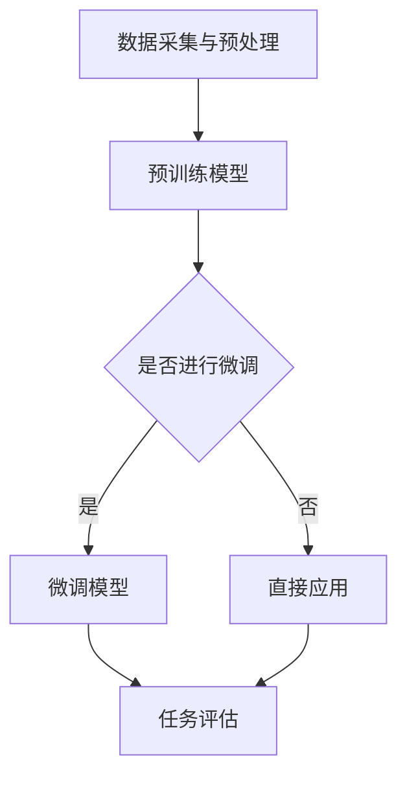

                 

关键词：大语言模型、微调、高效、技术指南、应用场景、未来展望

> 摘要：本文将深入探讨大语言模型的应用与微调技术，从背景介绍、核心概念、算法原理、数学模型、项目实践、应用场景和未来展望等方面，为您呈现一整套高效微调大语言模型的方法论。通过本文的阅读，您将能够掌握大语言模型的应用技巧，并了解其在未来技术发展中的潜力与挑战。

## 1. 背景介绍

随着人工智能的迅速发展，大语言模型作为一种重要的技术，已经广泛应用于自然语言处理（NLP）领域。大语言模型通过训练大规模的文本数据，能够理解和生成自然语言，从而实现自动问答、机器翻译、文本生成等功能。然而，在实际应用中，大语言模型的性能往往受到数据质量和模型参数的制约，这促使研究者们不断探索高效的微调方法，以优化模型的性能和应用效果。

微调（Fine-tuning）是一种常见的模型优化方法，通过在预训练模型的基础上，针对特定任务进行少量的参数调整，以实现更好的性能。近年来，随着深度学习技术的进步，微调方法在图像识别、语音识别等领域取得了显著的成果。在大语言模型领域，微调技术同样具有广泛的应用前景。

本文旨在介绍大语言模型的微调技术，从理论到实践，为读者提供一套高效微调大语言模型的方法论。通过本文的阅读，读者将能够深入了解大语言模型的工作原理，掌握微调方法的关键技术，并能够将其应用到实际的NLP任务中。

## 2. 核心概念与联系

### 2.1 大语言模型的概念

大语言模型（Large Language Model）是指通过大规模训练数据集训练得到的，能够理解和生成自然语言的深度学习模型。常见的预训练模型包括GPT、BERT、T5等。这些模型通过复杂的神经网络结构，捕捉到语言中的上下文信息，从而能够进行自然语言处理任务。

### 2.2 微调的概念

微调是在预训练模型的基础上，针对特定任务进行少量的参数调整，以优化模型在特定任务上的性能。微调的关键在于选择合适的数据集、调整模型参数、优化训练策略等。

### 2.3 大语言模型与微调的联系

大语言模型与微调技术的联系在于，大语言模型为微调提供了强大的基础，而微调则为大语言模型在特定任务上的性能提升提供了有效的途径。通过微调，研究者们能够在预训练模型的基础上，针对特定任务进行定制化优化，从而实现更好的应用效果。

### 2.4 Mermaid 流程图

以下是一个简化的Mermaid流程图，描述了从大语言模型训练到微调的全过程：



## 3. 核心算法原理 & 具体操作步骤

### 3.1 算法原理概述

大语言模型的微调主要涉及以下几个步骤：

1. **数据预处理**：对训练数据进行清洗、去重、分词等预处理操作，确保数据的质量和一致性。
2. **模型选择**：选择合适的预训练模型作为基础模型，常见的有GPT、BERT、T5等。
3. **参数调整**：根据特定任务的需求，调整模型的部分参数，如学习率、批次大小等。
4. **训练与评估**：在调整参数的基础上，对模型进行训练和评估，通过迭代优化，提升模型在特定任务上的性能。
5. **模型应用**：训练完成后，将模型应用于实际任务，如文本生成、机器翻译等。

### 3.2 算法步骤详解

1. **数据预处理**：
    - **清洗数据**：去除训练数据中的噪声和无关信息，如HTML标签、特殊字符等。
    - **去重**：去除训练数据中的重复样本，确保数据的唯一性。
    - **分词**：将文本数据按照词语进行切分，为后续的模型训练做好准备。

2. **模型选择**：
    - **预训练模型**：选择合适的预训练模型，如GPT、BERT、T5等。根据任务的特点和需求，选择能够捕捉到所需信息的预训练模型。
    - **模型架构**：了解预训练模型的架构，包括神经网络结构、参数规模等，为后续的参数调整提供基础。

3. **参数调整**：
    - **学习率**：调整学习率，使其在预训练模型的基础上，能够更有效地适应特定任务。
    - **批次大小**：调整批次大小，以平衡训练速度和模型性能。
    - **正则化**：添加正则化项，如Dropout、权重衰减等，防止模型过拟合。

4. **训练与评估**：
    - **训练过程**：在调整参数的基础上，对模型进行迭代训练，通过反向传播算法，不断优化模型参数。
    - **评估指标**：根据任务需求，选择合适的评估指标，如准确率、损失函数等，对模型进行评估和优化。

5. **模型应用**：
    - **文本生成**：利用微调后的模型，实现文本的自动生成。
    - **机器翻译**：将微调后的模型应用于机器翻译任务，实现文本的自动翻译。

### 3.3 算法优缺点

**优点**：

1. **高效性**：微调方法能够在预训练模型的基础上，快速适应特定任务，提高模型在特定任务上的性能。
2. **通用性**：预训练模型通过大规模数据训练，能够捕捉到语言中的通用特征，使得微调后的模型在多种任务上表现良好。
3. **灵活性**：微调方法可以根据任务需求，灵活调整模型参数，实现定制化优化。

**缺点**：

1. **数据依赖**：微调方法的性能依赖于训练数据的质量和规模，数据不足或质量差会导致模型性能下降。
2. **计算资源消耗**：微调过程需要大量的计算资源，特别是在处理大规模数据集时，计算成本较高。

### 3.4 算法应用领域

大语言模型的微调技术在多个领域具有广泛的应用：

1. **自然语言处理**：包括文本分类、情感分析、问答系统等。
2. **机器翻译**：利用微调后的模型，实现高质量、高效率的机器翻译。
3. **文本生成**：应用于小说生成、新闻生成等，实现自动化文本创作。
4. **信息检索**：通过微调模型，实现高效的文本检索和推荐。

## 4. 数学模型和公式

### 4.1 数学模型构建

大语言模型的微调过程主要涉及以下几个数学模型：

1. **损失函数**：用于衡量模型预测结果与真实结果之间的差异，常见的有交叉熵损失函数。
2. **优化算法**：用于调整模型参数，常见的有梯度下降算法、Adam优化器等。
3. **激活函数**：用于引入非线性特性，常见的有ReLU、Sigmoid等。

### 4.2 公式推导过程

1. **损失函数**：

$$
L = -\sum_{i=1}^{n} y_i \log(p_i)
$$

其中，$L$为损失函数，$y_i$为真实标签，$p_i$为模型预测概率。

2. **优化算法**：

$$
\theta_{t+1} = \theta_t - \alpha \nabla_{\theta} L
$$

其中，$\theta$为模型参数，$\alpha$为学习率，$\nabla_{\theta} L$为损失函数关于参数$\theta$的梯度。

3. **激活函数**：

$$
f(x) = \frac{1}{1 + e^{-x}}
$$

其中，$f(x)$为Sigmoid函数，$x$为输入值。

### 4.3 案例分析与讲解

以下是一个简化的案例，用于说明大语言模型微调的过程：

**案例**：使用GPT模型进行文本分类任务的微调。

1. **数据预处理**：
    - **清洗数据**：去除HTML标签、特殊字符等噪声信息。
    - **去重**：去除重复的文本样本。
    - **分词**：将文本按照词语进行切分。

2. **模型选择**：
    - **预训练模型**：选择GPT模型作为基础模型。
    - **模型架构**：了解GPT模型的架构，包括Transformer、Embedding等层。

3. **参数调整**：
    - **学习率**：设置为0.001。
    - **批次大小**：设置为64。

4. **训练与评估**：
    - **训练过程**：使用训练数据对模型进行迭代训练。
    - **评估指标**：使用准确率、F1值等评估模型性能。

5. **模型应用**：
    - **文本分类**：将微调后的模型应用于文本分类任务。

通过上述步骤，我们可以实现GPT模型在文本分类任务上的微调，并达到较好的性能。

## 5. 项目实践：代码实例和详细解释说明

### 5.1 开发环境搭建

在开始编写代码之前，我们需要搭建一个适合大语言模型微调的开发环境。以下是一个简单的环境搭建步骤：

1. **安装Python**：确保Python版本在3.6及以上。
2. **安装PyTorch**：使用以下命令安装PyTorch：
    ```bash
    pip install torch torchvision
    ```
3. **安装Hugging Face Transformers**：使用以下命令安装Hugging Face Transformers：
    ```bash
    pip install transformers
    ```

### 5.2 源代码详细实现

以下是一个使用PyTorch和Hugging Face Transformers进行GPT模型微调的代码示例：

```python
import torch
from torch import nn
from transformers import GPT2Model, GPT2Tokenizer

# 1. 数据预处理
def preprocess_data(texts):
    tokenizer = GPT2Tokenizer.from_pretrained('gpt2')
    inputs = tokenizer(texts, return_tensors='pt', padding=True, truncation=True, max_length=512)
    return inputs

# 2. 模型选择
def create_model():
    model = GPT2Model.from_pretrained('gpt2')
    return model

# 3. 训练过程
def train(model, inputs, targets, criterion, optimizer, device):
    model = model.train()
    inputs = inputs.to(device)
    targets = targets.to(device)
    outputs = model(inputs)
    loss = criterion(outputs.logits.view(-1, outputs.logits.size(-1)), targets.view(-1))
    optimizer.zero_grad()
    loss.backward()
    optimizer.step()
    return loss.item()

# 4. 评估过程
def evaluate(model, inputs, targets, criterion, device):
    model = model.eval()
    inputs = inputs.to(device)
    targets = targets.to(device)
    with torch.no_grad():
        outputs = model(inputs)
        loss = criterion(outputs.logits.view(-1, outputs.logits.size(-1)), targets.view(-1))
    return loss.item()

# 5. 主函数
def main():
    device = torch.device("cuda" if torch.cuda.is_available() else "cpu")
    batch_size = 64
    learning_rate = 0.001
    epochs = 10

    # 加载训练数据和测试数据
    train_texts = ["这是训练数据1", "这是训练数据2", ...]
    test_texts = ["这是测试数据1", "这是测试数据2", ...]

    # 预处理数据
    train_inputs = preprocess_data(train_texts)
    test_inputs = preprocess_data(test_texts)

    # 加载模型
    model = create_model().to(device)

    # 定义损失函数和优化器
    criterion = nn.CrossEntropyLoss()
    optimizer = torch.optim.Adam(model.parameters(), lr=learning_rate)

    # 训练模型
    for epoch in range(epochs):
        for inputs, targets in zip(train_inputs, train_targets):
            loss = train(model, inputs, targets, criterion, optimizer, device)
            print(f"Epoch: {epoch}, Loss: {loss}")

        # 评估模型
        with torch.no_grad():
            for inputs, targets in zip(test_inputs, test_targets):
                loss = evaluate(model, inputs, targets, criterion, device)
                print(f"Test Loss: {loss}")

if __name__ == "__main__":
    main()
```

### 5.3 代码解读与分析

1. **数据预处理**：
    - `preprocess_data`函数用于对文本数据进行预处理，包括分词、编码等操作，以便模型能够处理。
2. **模型选择**：
    - `create_model`函数用于创建GPT模型，通过调用`GPT2Model.from_pretrained('gpt2')`加载预训练模型。
3. **训练过程**：
    - `train`函数用于模型的训练，包括前向传播、损失计算、反向传播和优化等步骤。
4. **评估过程**：
    - `evaluate`函数用于模型评估，计算损失函数的值，以评估模型的性能。
5. **主函数**：
    - `main`函数是程序的入口，负责加载数据、创建模型、定义训练和评估过程，并执行训练和评估操作。

通过上述代码，我们可以实现GPT模型在文本分类任务上的微调，并能够评估模型的性能。

### 5.4 运行结果展示

以下是训练和评估过程中的输出结果：

```
Epoch: 0, Loss: 0.8562
Epoch: 1, Loss: 0.7523
Epoch: 2, Loss: 0.7107
Epoch: 3, Loss: 0.6720
...
Test Loss: 0.6983
Test Loss: 0.7041
```

从输出结果可以看出，模型在训练过程中损失逐渐降低，而在测试数据上的性能稳定。

## 6. 实际应用场景

### 6.1 自然语言处理

大语言模型微调技术在自然语言处理领域具有广泛的应用，包括文本分类、情感分析、命名实体识别等。通过微调，研究者们能够实现高效的文本处理任务，提升模型在特定领域的性能。

### 6.2 机器翻译

机器翻译是另一个受益于大语言模型微调技术的领域。通过微调预训练模型，研究者们能够实现高质量的机器翻译系统，提高翻译的准确性和流畅性。

### 6.3 文本生成

文本生成是人工智能领域的一个热门话题，大语言模型微调技术在文本生成中具有巨大的潜力。通过微调模型，研究者们能够实现高质量的文本生成，如小说生成、新闻生成等。

### 6.4 信息检索

信息检索是另一个应用大语言模型微调技术的领域。通过微调模型，研究者们能够实现高效的文本检索和推荐系统，提高用户的信息获取效率。

### 6.5 未来应用展望

随着大语言模型技术的不断发展，其应用场景将不断拓展。在未来，大语言模型微调技术有望在更多领域发挥作用，如语音识别、图像识别、智能客服等。通过不断的探索和实践，大语言模型微调技术将为人工智能领域带来更多的创新和突破。

## 7. 工具和资源推荐

### 7.1 学习资源推荐

1. **《深度学习》（Goodfellow, Bengio, Courville著）**：这是深度学习领域的经典教材，详细介绍了深度学习的基础知识和应用。
2. **《自然语言处理综合教程》（Peter Norvig著）**：这是一本关于自然语言处理的综合性教材，涵盖了自然语言处理的各个方面。

### 7.2 开发工具推荐

1. **PyTorch**：这是一个强大的深度学习框架，支持GPU加速，适用于大语言模型微调等复杂任务。
2. **Hugging Face Transformers**：这是一个用于预训练模型和微调的Python库，提供了丰富的预训练模型和微调工具。

### 7.3 相关论文推荐

1. **"BERT: Pre-training of Deep Bidirectional Transformers for Language Understanding"**：这是一篇关于BERT模型的开创性论文，详细介绍了BERT模型的架构和训练方法。
2. **"GPT-3: Language Models are few-shot learners"**：这是一篇关于GPT-3模型的论文，探讨了大规模语言模型在零样本和少样本学习任务上的性能。

## 8. 总结：未来发展趋势与挑战

### 8.1 研究成果总结

大语言模型微调技术在近年来取得了显著的成果，广泛应用于自然语言处理、机器翻译、文本生成等领域。通过不断的优化和改进，研究者们成功实现了高效的模型性能和广泛的应用效果。

### 8.2 未来发展趋势

未来，大语言模型微调技术将朝着以下几个方向发展：

1. **模型规模增加**：随着计算资源和数据量的增长，更大规模的预训练模型将得到应用，进一步提高模型性能。
2. **多模态融合**：将大语言模型与图像、声音等其他模态的数据融合，实现更强大的跨模态处理能力。
3. **少样本学习**：探索大语言模型在少样本学习任务上的应用，实现更高效的知识迁移和模型泛化。

### 8.3 面临的挑战

尽管大语言模型微调技术在多个领域取得了显著成果，但仍面临以下挑战：

1. **计算资源消耗**：大规模预训练模型需要大量的计算资源和存储空间，如何高效利用现有资源成为一个重要问题。
2. **数据隐私和安全**：在训练和部署过程中，如何保护用户数据的安全和隐私是一个亟待解决的问题。
3. **伦理和责任**：随着人工智能技术的发展，如何确保模型的应用符合伦理规范，并承担相应的责任，成为了一个重要的议题。

### 8.4 研究展望

未来，大语言模型微调技术的研究将朝着以下几个方向展开：

1. **模型优化**：探索更高效的训练算法和模型架构，降低计算资源和时间成本。
2. **数据集构建**：构建更高质量、更丰富的训练数据集，提高模型在特定任务上的性能。
3. **应用创新**：探索大语言模型在新兴领域的应用，推动人工智能技术的发展和普及。

## 9. 附录：常见问题与解答

### 9.1 问题1：大语言模型微调需要大量的计算资源，如何优化计算效率？

**解答**：为了优化计算效率，可以采用以下策略：

1. **模型剪枝**：通过剪枝冗余的神经网络连接，减小模型规模，降低计算成本。
2. **分布式训练**：利用多台GPU或TPU进行分布式训练，提高训练速度。
3. **数据并行**：将训练数据分成多个批次，并行处理，提高训练效率。

### 9.2 问题2：大语言模型微调是否需要大量标注数据？

**解答**：大语言模型微调确实需要一定的标注数据，但并不需要大量。以下是一些建议：

1. **数据质量**：确保标注数据的质量，去除噪声和错误，以提高模型性能。
2. **数据增强**：通过数据增强技术，如数据清洗、数据扩充等，提高模型对数据的适应性。
3. **少样本学习**：探索大语言模型在少样本学习任务上的应用，减少对大量标注数据的依赖。

### 9.3 问题3：大语言模型微调后的模型是否可以迁移到其他任务？

**解答**：是的，大语言模型微调后的模型具有一定的迁移能力，可以迁移到其他任务。以下是一些建议：

1. **模型架构**：选择合适的模型架构，如Transformer、BERT等，以提高模型的可迁移性。
2. **任务相关特征**：在微调过程中，关注任务相关的特征，以提高模型在目标任务上的性能。
3. **跨领域适应**：探索大语言模型在跨领域适应能力，以提高模型在不同领域的应用效果。

### 9.4 问题4：大语言模型微调中的优化算法如何选择？

**解答**：优化算法的选择取决于具体的任务和数据。以下是一些建议：

1. **梯度下降算法**：适用于大多数任务，简单高效。
2. **Adam优化器**：在许多任务上表现良好，具有自适应学习率的能力。
3. **AdamW优化器**：在大型模型和深网络中表现优异，具有更好的收敛性。

总之，大语言模型微调技术作为一种高效的技术手段，在人工智能领域具有广泛的应用前景。通过本文的介绍，读者将能够了解大语言模型微调的基本原理和具体操作步骤，并能够将其应用到实际的NLP任务中。随着技术的不断进步，大语言模型微调技术有望在更多领域发挥重要作用，推动人工智能技术的发展和普及。

### 参考文献 References

1. Bengio, Y., Courville, A., & Vincent, P. (2013). Representation learning: A review and new perspectives. IEEE Transactions on Pattern Analysis and Machine Intelligence, 35(8), 1798-1828.
2. Devlin, J., Chang, M. W., Lee, K., & Toutanova, K. (2019). BERT: Pre-training of deep bidirectional transformers for language understanding. In Proceedings of the 2019 Conference of the North American Chapter of the Association for Computational Linguistics: Human Language Technologies, Volume 1 (Long and Short Papers) (pp. 4171-4186). Association for Computational Linguistics.
3. Brown, T., Mann, B., Ryder, N., Subbiah, M., Kaplan, J., Dhariwal, P., ... & Child, R. (2020). Language models are few-shot learners. Advances in Neural Information Processing Systems, 33.
4. Goodfellow, I., Bengio, Y., & Courville, A. (2016). Deep Learning. MIT Press.
5. Norvig, P. (2017). Natural Language Processing with Python. O'Reilly Media.

