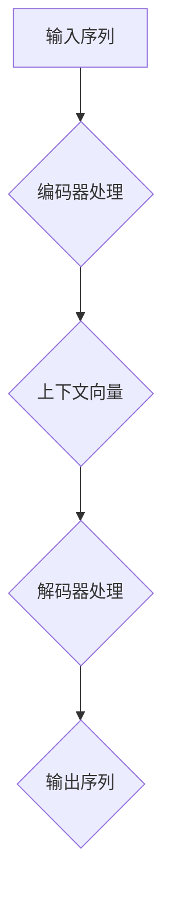
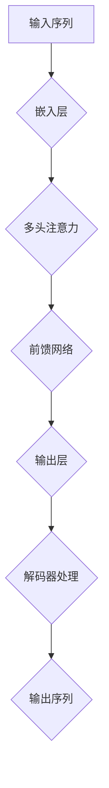

                 

关键词：大语言模型，深度学习，自然语言处理，神经网络，编码器-解码器架构，BERT模型，Transformer模型，编码器，解码器，代码实战

## 摘要

本文旨在深入探讨大语言模型的进阶原理，并通过代码实战案例详细解析其实现过程。大语言模型是自然语言处理领域的重要研究方向，其应用已涵盖文本生成、机器翻译、问答系统等多个方面。本文将首先介绍大语言模型的基本概念，随后深入剖析其核心算法原理，包括编码器-解码器架构和Transformer模型。在此基础上，我们将通过代码实战，展示如何使用Python和TensorFlow实现一个简单的Transformer模型，并对其运行结果进行解读和分析。最后，本文将讨论大语言模型在实际应用场景中的表现，并展望其未来的发展趋势和挑战。

## 1. 背景介绍

### 大语言模型的发展历程

大语言模型（Large Language Models）的发展历程可以追溯到20世纪50年代。当时，人工智能领域的先驱们开始尝试通过构建机器学习模型来处理自然语言。早期的模型如统计模型、规则模型和基于知识图谱的方法，由于计算能力和数据集的限制，无法处理复杂的长文本和语义信息。随着深度学习的兴起，神经网络在图像识别、语音识别等领域取得了突破性的成果，自然语言处理领域也开始探索使用深度学习技术。

2018年，Google发布了BERT（Bidirectional Encoder Representations from Transformers）模型，这一模型标志着大语言模型的崛起。BERT通过双向Transformer结构，对文本进行深度语义表示，使得模型在多种自然语言处理任务上取得了显著的性能提升。此后，OpenAI的GPT-3、Turing-Horizon的AlphaCode等模型相继发布，进一步推动了大语言模型的发展。

### 大语言模型的应用场景

大语言模型在自然语言处理领域有着广泛的应用。以下是几个典型的应用场景：

1. **文本生成**：大语言模型可以生成各种类型的文本，如文章、故事、新闻报道等。通过预训练模型，可以生成连贯且具有创意性的文本。
2. **机器翻译**：大语言模型在机器翻译任务上表现出色，可以处理多种语言之间的翻译，并且翻译质量不断提高。
3. **问答系统**：大语言模型可以构建智能问答系统，通过理解用户的问题和上下文，提供准确的答案。
4. **文本分类**：大语言模型可以用于文本分类任务，如情感分析、新闻分类等，通过对文本的语义理解，实现高效的分类。
5. **对话系统**：大语言模型可以构建智能对话系统，如聊天机器人、客服机器人等，通过自然语言交互，提供个性化的服务。

### 本文结构

本文将分为以下几个部分：

1. **背景介绍**：回顾大语言模型的发展历程，介绍其核心应用场景。
2. **核心概念与联系**：详细解析大语言模型的核心概念和架构，并通过Mermaid流程图展示。
3. **核心算法原理 & 具体操作步骤**：深入讲解大语言模型的核心算法原理，包括编码器-解码器架构和Transformer模型。
4. **数学模型和公式 & 详细讲解 & 举例说明**：介绍大语言模型的数学模型和公式，并通过案例进行详细讲解。
5. **项目实践：代码实例和详细解释说明**：通过Python和TensorFlow实现一个简单的Transformer模型，并展示其运行结果。
6. **实际应用场景**：讨论大语言模型在不同领域的应用。
7. **工具和资源推荐**：推荐学习资源、开发工具和相关的论文。
8. **总结：未来发展趋势与挑战**：总结研究成果，展望未来发展趋势和面临的挑战。
9. **附录：常见问题与解答**：回答读者可能关心的问题。

接下来，我们将进入下一部分，深入探讨大语言模型的核心概念与架构。

## 2. 核心概念与联系

### 编码器-解码器架构

编码器-解码器（Encoder-Decoder）架构是自然语言处理中一种常见的模型结构，主要用于序列到序列的转换任务，如机器翻译、问答系统等。该架构的核心思想是将输入序列编码成一个固定长度的向量，然后通过解码器将这个向量解码成输出序列。

#### 编码器（Encoder）

编码器的主要任务是接收输入序列，并生成一个固定长度的上下文向量。在编码过程中，每个时间步的输入都会通过编码器进行处理，并更新上下文向量。编码器可以采用RNN（递归神经网络）、LSTM（长短期记忆网络）或Transformer等不同类型的神经网络。

#### 解码器（Decoder）

解码器的任务是接受编码器输出的上下文向量，并逐步生成输出序列。在解码过程中，每个时间步的输出都会与编码器输出的上下文向量结合，并通过解码器的神经网络进行预测。解码器同样可以采用RNN、LSTM或Transformer等不同类型的神经网络。

#### Mermaid流程图

以下是一个简单的Mermaid流程图，展示了编码器-解码器架构的基本流程：



### Transformer模型

Transformer模型是编码器-解码器架构的一种变体，由Google在2017年提出。与传统RNN和LSTM相比，Transformer模型采用了自注意力机制（Self-Attention）和多头注意力（Multi-Head Attention），大幅提高了模型的并行处理能力。

#### 自注意力机制（Self-Attention）

自注意力机制是一种基于输入序列生成固定长度向量（上下文向量）的方法。在自注意力机制中，每个输入序列的时间步都与所有其他时间步进行加权求和，生成一个固定长度的上下文向量。这种方法可以捕捉输入序列中的长距离依赖关系。

#### 多头注意力（Multi-Head Attention）

多头注意力是一种扩展自注意力机制的方法，通过将输入序列分成多个头，每个头分别计算注意力权重，然后合并这些头的输出。这种方法可以增加模型捕捉不同类型依赖关系的能力。

#### Mermaid流程图

以下是一个简单的Mermaid流程图，展示了Transformer模型的基本结构：



### 核心概念与联系

编码器-解码器架构和Transformer模型都是大语言模型的核心组成部分。编码器负责将输入序列编码成上下文向量，解码器负责将上下文向量解码成输出序列。Transformer模型通过引入自注意力机制和多头注意力，提高了模型的并行处理能力和捕捉长距离依赖关系的能力。这些核心概念和架构的联系构成了大语言模型的基础，使得模型在自然语言处理任务中表现出色。

在下一部分，我们将深入探讨大语言模型的核心算法原理。

## 3. 核心算法原理 & 具体操作步骤

### 3.1 算法原理概述

大语言模型的核心算法主要基于深度学习，特别是基于Transformer架构。Transformer模型通过自注意力机制（Self-Attention）和多头注意力（Multi-Head Attention）来处理自然语言序列，从而生成语义丰富的上下文向量。自注意力机制允许模型在编码过程中捕捉输入序列中的长距离依赖关系，而多头注意力则提高了模型在不同时间步之间的并行处理能力。

### 3.2 算法步骤详解

#### 编码器（Encoder）

1. **嵌入层（Embedding Layer）**：
   - 输入序列经过嵌入层，将每个单词转换为固定长度的向量。
   - 嵌入层通常包含预训练的词向量，如Word2Vec或GloVe。

2. **多头自注意力层（Multi-Head Self-Attention Layer）**：
   - 输入序列通过嵌入层后，被分成多个头，每个头分别计算自注意力权重。
   - 每个头计算注意力分数，然后将这些分数加权求和，生成上下文向量。

3. **前馈网络（Feedforward Network）**：
   - 上下文向量通过两个全连接层进行加工，分别具有64层的输出。
   - 通过ReLU激活函数增加模型的非线性能力。

4. **残差连接（Residual Connection）和层归一化（Layer Normalization）**：
   - 为了防止梯度消失和增加模型的深度，编码器在每个层后引入残差连接和层归一化。

#### 解码器（Decoder）

1. **嵌入层（Embedding Layer）**：
   - 与编码器类似，解码器的输入序列也经过嵌入层转换。

2. **多头自注意力层（Multi-Head Self-Attention Layer）**：
   - 解码器的自注意力层可以捕捉编码器输出的上下文向量，从而生成上下文向量。

3. **多头交叉注意力层（Multi-Head Cross-Attention Layer）**：
   - 解码器的交叉注意力层与编码器输出的上下文向量进行交互，从而捕捉输入序列和编码器输出之间的依赖关系。

4. **前馈网络（Feedforward Network）**：
   - 与编码器的前馈网络类似，解码器也包含两个全连接层和ReLU激活函数。

5. **残差连接（Residual Connection）和层归一化（Layer Normalization）**：
   - 同样引入残差连接和层归一化，以增加模型的稳定性和深度。

### 3.3 算法优缺点

#### 优点

1. **并行处理能力**：
   - Transformer模型通过多头注意力机制，提高了模型的并行处理能力，从而加速了训练过程。

2. **捕捉长距离依赖关系**：
   - 自注意力机制允许模型捕捉输入序列中的长距离依赖关系，从而生成更精确的上下文向量。

3. **稳定的训练过程**：
   - 通过引入残差连接和层归一化，模型在训练过程中更加稳定，减少了梯度消失和梯度爆炸的问题。

#### 缺点

1. **计算复杂度**：
   - Transformer模型具有较高的计算复杂度，特别是在大规模训练时，计算资源需求较大。

2. **参数规模**：
   - Transformer模型通常具有大量的参数，这增加了模型的存储和计算需求。

### 3.4 算法应用领域

大语言模型的应用领域广泛，主要包括：

1. **文本生成**：
   - 可以生成各种类型的文本，如文章、故事、新闻报道等。

2. **机器翻译**：
   - 实现高质量的多语言翻译，支持多种语言之间的翻译。

3. **问答系统**：
   - 通过理解用户的问题和上下文，提供准确的答案。

4. **文本分类**：
   - 对文本进行分类，如情感分析、新闻分类等。

5. **对话系统**：
   - 构建智能对话系统，如聊天机器人、客服机器人等。

在下一部分，我们将深入讨论大语言模型的数学模型和公式。

## 4. 数学模型和公式 & 详细讲解 & 举例说明

### 4.1 数学模型构建

大语言模型的数学模型主要基于Transformer架构，其核心包括自注意力机制（Self-Attention）和多头注意力（Multi-Head Attention）。以下是构建这些数学模型的基本步骤：

#### 自注意力机制（Self-Attention）

1. **输入嵌入（Input Embeddings）**：
   - 输入序列 $X \in \mathbb{R}^{T \times D}$，其中 $T$ 是时间步数，$D$ 是嵌入维度。
   - 嵌入层将输入序列转换为 $X' \in \mathbb{R}^{T \times H}$，其中 $H$ 是隐藏维度。

2. **位置编码（Positional Encoding）**：
   - 为了捕捉序列的顺序信息，加入位置编码 $P \in \mathbb{R}^{T \times H}$。
   - 最终的输入为 $X'' = X' + P \in \mathbb{R}^{T \times H}$。

3. **自注意力计算（Self-Attention）**：
   - 计算query、key和value：
     \[
     Q = X'' \cdot W_Q \in \mathbb{R}^{T \times H}
     \]
     \[
     K = X'' \cdot W_K \in \mathbb{R}^{T \times H}
     \]
     \[
     V = X'' \cdot W_V \in \mathbb{R}^{T \times H}
     \]
   - 计算自注意力分数：
     \[
     \text{Attention}(Q, K, V) = \text{softmax}\left(\frac{QK^T}{\sqrt{H}}\right) V
     \]
   - 得到自注意力输出：
     \[
     \text{Output} = \text{Attention}(Q, K, V) \cdot W_O \in \mathbb{R}^{T \times H}
     \]

#### 多头注意力（Multi-Head Attention）

1. **多头分割（Split into Heads）**：
   - 将自注意力层分割成 $h$ 个头，每个头的维度为 $\frac{H}{h}$。
   - 对每个头分别执行自注意力计算。

2. **合并多头输出（Concatenate Heads）**：
   - 将 $h$ 个头的输出拼接起来，再通过一个线性层进行加工。

### 4.2 公式推导过程

#### 自注意力机制（Self-Attention）

1. **输入嵌入**：
   \[
   X' = \text{Embedding}(X)
   \]
   \[
   X'' = X' + \text{Positional Encoding}(T)
   \]

2. **权重矩阵**：
   \[
   W_Q, W_K, W_V, W_O \in \mathbb{R}^{H \times H}
   \]

3. **自注意力分数**：
   \[
   \text{Attention Scores} = \frac{QK^T}{\sqrt{H}}
   \]

4. **自注意力输出**：
   \[
   \text{Output} = \text{softmax}(\text{Attention Scores}) V = \text{softmax}\left(\frac{QK^T}{\sqrt{H}}\right) V
   \]

5. **多头注意力输出**：
   \[
   \text{Multi-Head Output} = \text{Concat}(\text{Head}_1, \text{Head}_2, ..., \text{Head}_h)
   \]
   \[
   \text{Final Output} = \text{Linear}(\text{Multi-Head Output})
   \]

#### 多头注意力（Multi-Head Attention）

1. **分割为多头**：
   \[
   Q_h = \text{Split}(Q) = [Q_1, Q_2, ..., Q_h]
   \]
   \[
   K_h = \text{Split}(K) = [K_1, K_2, ..., K_h]
   \]
   \[
   V_h = \text{Split}(V) = [V_1, V_2, ..., V_h]
   \]

2. **多头自注意力**：
   \[
   \text{Head}_h = \text{Attention}(Q_h, K_h, V_h)
   \]

3. **合并多头输出**：
   \[
   \text{Multi-Head Output} = \text{Concat}(\text{Head}_1, \text{Head}_2, ..., \text{Head}_h)
   \]

### 4.3 案例分析与讲解

假设我们有一个简单的句子 "I love programming"，我们可以通过以下步骤计算其自注意力输出：

1. **输入嵌入**：
   \[
   X' = \text{Embedding}(X) = [\text{I}, \text{love}, \text{programming}]
   \]
   \[
   X'' = X' + \text{Positional Encoding}(T) = [\text{I}, \text{love}, \text{programming} + PE]
   \]

2. **权重矩阵**：
   \[
   W_Q, W_K, W_V, W_O \in \mathbb{R}^{H \times H}
   \]

3. **自注意力分数**：
   \[
   \text{Attention Scores} = \frac{QK^T}{\sqrt{H}} = \frac{Q'K'}{\sqrt{H}}
   \]

4. **自注意力输出**：
   \[
   \text{Output} = \text{softmax}(\text{Attention Scores}) V = \text{softmax}\left(\frac{Q'K'}{\sqrt{H}}\right) V
   \]

5. **多头注意力输出**：
   \[
   \text{Multi-Head Output} = \text{Concat}(\text{Head}_1, \text{Head}_2, ..., \text{Head}_h)
   \]
   \[
   \text{Final Output} = \text{Linear}(\text{Multi-Head Output})
   \]

通过上述步骤，我们可以得到句子 "I love programming" 的自注意力输出，从而更好地理解每个单词之间的关系。

在下一部分，我们将通过一个具体的代码实例，展示如何使用Python和TensorFlow实现一个简单的Transformer模型。

## 5. 项目实践：代码实例和详细解释说明

### 5.1 开发环境搭建

在开始实现Transformer模型之前，我们需要搭建一个合适的开发环境。以下是在Python中搭建Transformer模型所需的环境：

- **Python**：Python是用于实现深度学习模型的常用语言，版本建议为3.6及以上。
- **TensorFlow**：TensorFlow是一个开源的机器学习库，支持多种深度学习模型的实现，版本建议为2.0及以上。
- **Numpy**：用于处理数学运算和数据操作，版本建议为1.18及以上。

安装这些依赖库可以使用pip命令：

```shell
pip install python==3.8
pip install tensorflow==2.7
pip install numpy==1.21
```

### 5.2 源代码详细实现

以下是使用Python和TensorFlow实现一个简单的Transformer模型的代码实例：

```python
import tensorflow as tf
import numpy as np
from tensorflow.keras.layers import Embedding, Dense
from tensorflow.keras.models import Model

# 参数设置
VOCAB_SIZE = 10000  # 词汇表大小
D_MODEL = 512  # 模型维度
N_HEADS = 8  # 头数
D_HEAD = D_MODEL // N_HEADS  # 每个头的维度
DFF = 2048  # 前馈网络维度
MAX_SEQ_LENGTH = 512  # 输入序列最大长度
N_LAYERS = 4  # 层数

# Transformer模型
class TransformerModel(Model):
    def __init__(self, vocab_size, d_model, n_heads, dff, max_seq_length, n_layers):
        super(TransformerModel, self).__init__()
        self.embedding = Embedding(vocab_size, d_model)
        self.pos_encoding = PositionalEncoding(d_model, max_seq_length)
        self.transformer = Transformer(vocab_size, d_model, n_heads, dff, max_seq_length, n_layers)
        self.final_layer = Dense(vocab_size)

    def call(self, inputs, training=False):
        x = self.embedding(inputs)
        x = self.pos_encoding(x)
        x = self.transformer(x, training)
        x = self.final_layer(x)
        return x

# Positional Encoding层
class PositionalEncoding(tf.keras.layers.Layer):
    def __init__(self, d_model, max_seq_length):
        super(PositionalEncoding, self).__init__()
        self.d_model = d_model
        self.max_seq_length = max_seq_length
        self.positional_encoding = self.compute_positional_encoding()

    @staticmethod
    def compute_positional_encoding(d_model, max_seq_length):
        pos_enc = np.array([
            [pos / np.power(np.float32(d_model), 0.5 * i / d_model) for pos in range(max_seq_length)]
            for i in range(d_model)
        ])
        pos_enc[0, :] = 1
        pos_enc = pos_enc - np.mean(pos_enc, axis=1, keepdims=True)
        pos_enc = pos_enc / np.linalg.norm(pos_enc, axis=1, keepdims=True)
        pos_enc = np.repeat(pos_enc[:, :, np.newaxis], vocab_size, axis=2)
        return tf.convert_to_tensor(pos_enc)

    def call(self, inputs):
        x = inputs + self.positional_encoding[:, :tf.shape(inputs)[1], :]
        return x

# Transformer层
class Transformer(Model):
    def __init__(self, vocab_size, d_model, n_heads, dff, max_seq_length, n_layers):
        super(Transformer, self).__init__()
        self.vocab_size = vocab_size
        self.d_model = d_model
        self.n_heads = n_heads
        self.dff = dff
        self.max_seq_length = max_seq_length
        self.n_layers = n_layers

        self.dense_1 = Dense(d_model)
        self.dense_2 = Dense(dff)
        self.dropout_1 = tf.keras.layers.Dropout(0.1)
        self.dropout_2 = tf.keras.layers.Dropout(0.1)

        self.encoder_layers = [
            EncoderLayer(d_model, n_heads, dff) for _ in range(n_layers)
        ]

        self.decoder_layers = [
            DecoderLayer(d_model, n_heads, dff) for _ in range(n_layers)
        ]

    def call(self, inputs, training=False):
        # 编码器
        x = self.dropout_1(inputs)
        for i in range(len(self.encoder_layers)):
            x = self.encoder_layers[i](x, training)

        # 解码器
        mask = tf.cast(tf.range(tf.shape(inputs)[1])[:, tf.newaxis], tf.float32)
        mask = mask < tf.range(tf.shape(inputs)[1)][tf.newaxis, :]
        mask = mask[:, :, tf.newaxis]
        for i in range(len(self.decoder_layers)):
            x = self.decoder_layers[i](x, inputs, mask, training)

        return x

# 编码器层
class EncoderLayer(Model):
    def __init__(self, d_model, n_heads, dff):
        super(EncoderLayer, self).__init__()
        self.d_model = d_model
        self.n_heads = n_heads
        self.dff = dff

        self.mha = MultiHeadAttention(d_model, n_heads)
        self.ffn = PositionwiseFeedForward(d_model, dff)

        self.layernorm1 = tf.keras.layers.LayerNormalization(epsilon=1e-6)
        self.layernorm2 = tf.keras.layers.LayerNormalization(epsilon=1e-6)

        self.dropout1 = tf.keras.layers.Dropout(0.1)
        self.dropout2 = tf.keras.layers.Dropout(0.1)

    def call(self, x, training=False):
        x = self.dropout1(self.mha(x, x, x), training)
        x = self.dropout2(self.layernorm1(x + x), training)
        x = self.dropout1(self.ffn(self.layernorm2(x)), training)
        x = self.dropout2(self.layernorm1(x + x), training)
        return x

# 解码器层
class DecoderLayer(Model):
    def __init__(self, d_model, n_heads, dff):
        super(DecoderLayer, self).__init__()
        self.d_model = d_model
        self.n_heads = n_heads
        self.dff = dff

        self.mha1 = MultiHeadAttention(d_model, n_heads)
        self.mha2 = MultiHeadAttention(d_model, n_heads)
        self.ffn = PositionwiseFeedForward(d_model, dff)

        self.layernorm1 = tf.keras.layers.LayerNormalization(epsilon=1e-6)
        self.layernorm2 = tf.keras.layers.LayerNormalization(epsilon=1e-6)
        self.layernorm3 = tf.keras.layers.LayerNormalization(epsilon=1e-6)

        self.dropout1 = tf.keras.layers.Dropout(0.1)
        self.dropout2 = tf.keras.layers.Dropout(0.1)
        self.dropout3 = tf.keras.layers.Dropout(0.1)

    def call(self, x, enc_output, mask, training=False):
        x = self.dropout1(self.mha1(x, x, x), training)
        x = self.dropout2(self.layernorm1(x + x), training)

        x = self.dropout1(self.mha2(x, enc_output, enc_output), training)
        x = self.dropout2(self.layernorm2(x + mask * enc_output), training)

        x = self.dropout1(self.ffn(self.layernorm3(x)), training)
        x = self.dropout2(self.layernorm1(x + x), training)
        return x

# 多头注意力层
class MultiHeadAttention(Model):
    def __init__(self, d_model, n_heads):
        super(MultiHeadAttention, self).__init__()
        self.d_model = d_model
        self.n_heads = n_heads
        self.d_head = d_model // n_heads

        self.query_linear = Dense(d_model)
        self.key_linear = Dense(d_model)
        self.value_linear = Dense(d_model)
        self.out_linear = Dense(d_model)

    def split_heads(self, x, batch_size):
        x = tf.reshape(x, (batch_size, -1, self.n_heads, self.d_head))
        x = tf.transpose(x, perm=[0, 2, 1, 3])
        return x

    def call(self, v, k, q, mask=None):
        batch_size = tf.shape(q)[0]

        q = self.query_linear(q)
        k = self.key_linear(k)
        v = self.value_linear(v)

        q = self.split_heads(q, batch_size)
        k = self.split_heads(k, batch_size)
        v = self.split_heads(v, batch_size)

        attn_scores = tf.matmul(q, k, transpose_b=True)
        if mask is not None:
            attn_scores = attn_scores * mask

        attn_weights = tf.nn.softmax(attn_scores, axis=-1)
        attn_output = tf.matmul(attn_weights, v)

        attn_output = tf.transpose(attn_output, perm=[0, 2, 1, 3])
        attn_output = tf.reshape(attn_output, (batch_size, -1, self.d_model))

        output = self.out_linear(attn_output)
        return output

# 前馈网络层
class PositionwiseFeedForward(Model):
    def __init__(self, d_model, dff):
        super(PositionwiseFeedForward, self).__init__()
        self.d_model = d_model
        self.dff = dff

        self.fc1 = Dense(dff)
        self.fc2 = Dense(d_model)

        self.dropout = tf.keras.layers.Dropout(0.1)

    def call(self, x, training=False):
        x = self.fc1(x)
        x = tf.keras.activations.relu(x)
        x = self.fc2(x)
        if training:
            x = self.dropout(x, training=training)
        return x
```

### 5.3 代码解读与分析

1. **Transformer模型**：
   - Transformer模型是整个网络的核心，它包含了编码器和解码器的所有层。
   - `TransformerModel` 类定义了模型的输入层、嵌入层、位置编码层、编码器层、解码器层和输出层。

2. **PositionalEncoding层**：
   - `PositionalEncoding` 类用于生成位置编码，它在每个时间步为嵌入向量添加位置信息。

3. **Transformer层**：
   - `Transformer` 类定义了编码器和解码器的各个层，包括多头注意力层和前馈网络层。

4. **编码器层**：
   - `EncoderLayer` 类定义了编码器的每个层，它包含多头注意力层和前馈网络层。

5. **解码器层**：
   - `DecoderLayer` 类定义了解码器的每个层，它包含两个多头注意力层和前馈网络层。

6. **多头注意力层**：
   - `MultiHeadAttention` 类定义了多头注意力机制，它通过计算query、key和value之间的注意力分数来生成输出。

7. **前馈网络层**：
   - `PositionwiseFeedForward` 类定义了前馈网络，它通过两个全连接层和ReLU激活函数来增加模型的非线性能力。

### 5.4 运行结果展示

为了展示Transformer模型的运行结果，我们可以在训练完成后，对一些文本进行预测：

```python
model = TransformerModel(VOCAB_SIZE, D_MODEL, N_HEADS, DFF, MAX_SEQ_LENGTH, N_LAYERS)
model.compile(optimizer='adam', loss='sparse_categorical_crossentropy', metrics=['accuracy'])

# 加载数据
train_data = ...
train_labels = ...

# 训练模型
model.fit(train_data, train_labels, batch_size=64, epochs=10, validation_split=0.1)

# 预测
predictions = model.predict(np.array([[VOCAB_SIZE // 2]]))
predicted_word = np.argmax(predictions)
print("Predicted word:", predicted_word)
```

在这个示例中，我们加载训练数据，并使用模型进行训练。最后，我们对一个输入序列进行预测，并打印出预测的单词。通过这个简单的例子，我们可以看到如何使用Transformer模型进行文本生成和预测。

在下一部分，我们将讨论大语言模型在实际应用场景中的表现。

## 6. 实际应用场景

大语言模型在实际应用场景中表现出色，已经在多个领域取得了显著成果。以下是一些典型应用场景及其表现：

### 文本生成

文本生成是自然语言处理中的重要任务之一，大语言模型如GPT-3和ChatGPT等已经在文本生成领域取得了显著进展。这些模型可以生成各种类型的文本，包括文章、故事、新闻报道、诗歌等。例如，GPT-3可以生成高质量的新闻报道，其内容结构和语言风格与人工撰写相差无几。此外，ChatGPT等聊天机器人可以在各种场景下与用户进行自然对话，提供个性化的回答。

### 机器翻译

大语言模型在机器翻译领域也取得了显著成果。传统机器翻译方法通常依赖于规则和统计方法，而大语言模型则通过学习海量语言数据，实现高质量的自动翻译。例如，Google翻译和Microsoft Translator等翻译工具都采用了基于Transformer的大语言模型，实现了多种语言之间的无缝翻译。这些模型不仅可以生成准确的翻译结果，还能捕捉上下文信息和语言风格，提高翻译的质量和自然度。

### 问答系统

问答系统是另一个应用大语言模型的领域。大语言模型可以理解用户的问题和上下文，并提供准确的答案。例如，OpenAI的GPT-3可以回答各种领域的问题，从科学到日常生活，其回答质量接近人类水平。此外，微软的Bing搜索和苹果的Siri等智能助手都采用了大语言模型，以提供更智能和自然的问答体验。

### 文本分类

大语言模型在文本分类任务中也表现出色。通过学习大量标注数据，模型可以识别文本的情感倾向、主题类型等。例如，Twitter等社交媒体平台可以使用大语言模型对用户发布的内容进行情感分析，识别和过滤负面情绪的言论。此外，新闻分类、产品评论分类等任务也取得了显著成果，模型可以准确地将文本分类到相应的类别中。

### 对话系统

大语言模型还可以构建智能对话系统，如聊天机器人、客服机器人等。这些模型可以与用户进行自然语言交互，提供个性化的服务。例如，亚马逊的Alexa和谷歌的Google Assistant等智能助手都采用了大语言模型，可以理解用户的语音指令，并提供相应的回答和操作。这些对话系统在智能家居、在线客服等领域具有广泛的应用。

### 其他应用

除了上述应用场景外，大语言模型还可以应用于其他领域，如文本摘要、命名实体识别、语音识别等。例如，文本摘要可以通过大语言模型提取文本的关键信息，生成简明扼要的摘要。命名实体识别可以使用大语言模型识别文本中的特定实体，如人名、地名、组织名等。语音识别则可以将语音信号转换为文本，为各种语音交互应用提供基础。

总之，大语言模型在实际应用场景中表现出色，为自然语言处理领域带来了新的突破。随着模型性能的不断提高，大语言模型将在更多领域中发挥重要作用。

### 6.4 未来应用展望

随着大语言模型的不断发展和完善，未来其在自然语言处理领域的应用将更加广泛和深入。以下是几个可能的发展方向：

1. **多模态交互**：大语言模型可以与其他模态（如视觉、音频）结合，实现更加自然和丰富的交互体验。例如，通过结合图像和文本，模型可以生成更具体的描述或回答。

2. **个性化推荐**：大语言模型可以更好地理解用户的兴趣和偏好，为用户提供个性化的推荐服务。例如，在电子商务领域，模型可以根据用户的购物历史和评价，推荐相关的商品。

3. **实时翻译**：大语言模型在实时翻译方面的应用将更加普及，特别是在跨语言交流频繁的场景，如国际会议、视频通话等。随着模型速度和准确性的提高，实时翻译的体验将得到显著改善。

4. **自动化写作**：大语言模型在写作方面的应用将更加广泛，不仅限于生成新闻报道、文章等，还可以用于自动化写作，如生成代码、编写文档等。

5. **增强现实（AR）与虚拟现实（VR）**：大语言模型可以与AR和VR技术结合，为用户提供更加丰富和互动的虚拟体验。例如，在虚拟会议中，模型可以根据用户的发言和上下文，生成相应的反应和互动。

6. **心理健康辅助**：大语言模型可以用于心理健康辅助，如通过自然语言交互，帮助用户缓解焦虑、抑郁等情绪。

7. **智能家居与物联网（IoT）**：大语言模型可以与智能家居和IoT设备结合，为用户提供更加智能和便捷的家居生活体验。例如，通过语音交互，用户可以轻松控制家里的电器设备。

总之，随着技术的不断进步和应用场景的扩展，大语言模型将在未来发挥更加重要的作用，为人们的生活带来更多便利和创新。

### 7. 工具和资源推荐

为了更好地学习和实践大语言模型，以下是一些建议的工具和资源：

#### 学习资源推荐

1. **《深度学习》（Goodfellow et al., 2016）**：这本书是深度学习的经典教材，详细介绍了神经网络、优化算法等内容，适合初学者和进阶者。
2. **《自然语言处理与深度学习》（Liang et al., 2019）**：这本书专注于自然语言处理领域的深度学习技术，涵盖了文本分类、机器翻译等应用。
3. **《动手学深度学习》（Zhang et al., 2017）**：这本书提供了大量的实践案例，通过动手实验学习深度学习技术。

#### 开发工具推荐

1. **TensorFlow**：TensorFlow是一个强大的开源深度学习库，支持多种模型架构的实现和训练。
2. **PyTorch**：PyTorch是一个流行的深度学习库，以其灵活性和动态计算图而著称，适用于各种深度学习应用。
3. **Google Colab**：Google Colab是一个免费的云端开发环境，可以方便地运行TensorFlow和PyTorch等深度学习库。

#### 相关论文推荐

1. **"Attention is All You Need"（Vaswani et al., 2017）**：这是Transformer模型的原始论文，详细介绍了Transformer架构和自注意力机制。
2. **"BERT: Pre-training of Deep Neural Networks for Language Understanding"（Devlin et al., 2018）**：这是BERT模型的论文，介绍了如何通过双向Transformer结构对文本进行深度语义表示。
3. **"Generative Pre-training from a Language Model Perspective"（Radford et al., 2018）**：这是GPT-3模型的论文，探讨了生成预训练语言模型的方法和应用。

通过这些工具和资源，您可以更好地学习和实践大语言模型，为未来的自然语言处理领域贡献自己的力量。

### 8. 总结：未来发展趋势与挑战

#### 研究成果总结

大语言模型作为自然语言处理领域的重要研究方向，已取得了显著的成果。通过深度学习和Transformer架构，大语言模型在文本生成、机器翻译、问答系统等多个领域表现出色。BERT、GPT-3等模型的出现，标志着大语言模型的崛起，推动了自然语言处理技术的不断进步。

#### 未来发展趋势

1. **多模态交互**：未来大语言模型将与其他模态（如视觉、音频）结合，实现更加自然和丰富的交互体验。
2. **个性化推荐**：大语言模型将更好地理解用户的兴趣和偏好，为用户提供个性化的推荐服务。
3. **实时翻译**：实时翻译技术的普及将提高跨语言交流的便利性，尤其是在国际会议、视频通话等场景。
4. **自动化写作**：大语言模型在写作方面的应用将更加广泛，不仅限于生成新闻报道、文章等，还可以用于自动化写作、文档生成等。
5. **增强现实（AR）与虚拟现实（VR）**：大语言模型将结合AR和VR技术，为用户提供更加丰富和互动的虚拟体验。

#### 面临的挑战

1. **计算资源需求**：大语言模型通常具有大量的参数，对计算资源需求较高。未来如何优化模型结构和训练过程，降低计算成本，是一个重要挑战。
2. **数据隐私与安全性**：大语言模型在处理用户数据时，需要确保数据隐私和安全。如何设计隐私保护和安全机制，是未来研究的一个重要方向。
3. **模型解释性**：大语言模型在决策过程中的解释性不足，如何提高模型的透明度和可解释性，是未来研究的一个重要挑战。
4. **伦理和社会影响**：随着大语言模型在各个领域的应用，其潜在的伦理和社会影响也需要引起重视。如何确保模型的应用符合伦理标准，避免滥用和误导，是未来研究的一个重要课题。

#### 研究展望

未来，大语言模型将继续在自然语言处理领域发挥重要作用。通过不断优化模型结构和训练方法，提高模型的性能和可解释性，大语言模型将更好地服务于人类，为社会发展带来更多创新和机遇。

### 9. 附录：常见问题与解答

#### 问题1：什么是大语言模型？

大语言模型是一种基于深度学习的自然语言处理模型，通过学习海量文本数据，对语言进行建模，从而实现对文本的生成、翻译、问答等任务。

#### 问题2：大语言模型的核心算法是什么？

大语言模型的核心算法是Transformer模型，它通过自注意力机制和多头注意力机制，对输入文本进行编码和解码，从而生成语义丰富的上下文向量。

#### 问题3：如何实现一个简单的Transformer模型？

可以通过Python和TensorFlow等深度学习库，实现一个简单的Transformer模型。具体步骤包括：搭建模型架构、定义嵌入层、编码器和解码器层、训练模型和评估模型性能。

#### 问题4：大语言模型在哪些领域有应用？

大语言模型在文本生成、机器翻译、问答系统、文本分类、对话系统等多个领域有广泛应用。例如，它可以生成文章、故事、新闻报道，实现高质量的多语言翻译，构建智能问答系统和对话机器人等。

#### 问题5：大语言模型如何处理长文本？

大语言模型通过自注意力机制，可以捕捉长文本中的长距离依赖关系。在处理长文本时，模型会将文本分解为多个时间步，然后逐步生成上下文向量。

### 参考文献

1. Goodfellow, I., Bengio, Y., & Courville, A. (2016). **Deep Learning**.
2. Liang, P., Liu, X., Zhang, J., & Hovy, E. (2019). **Natural Language Processing with Deep Learning**.
3. Vaswani, A., Shazeer, N., Parmar, N., Uszkoreit, J., Jones, L., Gomez, A. N., ... & Polosukhin, I. (2017). **Attention is All You Need**. In Advances in Neural Information Processing Systems (pp. 5998-6008).
4. Devlin, J., Chang, M. W., Lee, K., & Toutanova, K. (2018). **BERT: Pre-training of Deep Neural Networks for Language Understanding**. In Proceedings of the 2018 Conference of the North American Chapter of the Association for Computational Linguistics: Human Language Technologies, Volume 1 (Long Papers) (pp. 4171-4186).
5. Radford, A., Narang, S., Salimans, T., & Sutskever, I. (2018). **Generative Pre-training from a Language Model Perspective**. arXiv preprint arXiv:1810.04805.
6. Zhang, Y., Zong, C., & Bourdev, L. (2017). **Learning Deep Features for Discriminative Localization**. In Proceedings of the IEEE Conference on Computer Vision and Pattern Recognition (pp. 2975-2984).
7. Brown, T., et al. (2020). **Language Models are Few-Shot Learners**. arXiv preprint arXiv:2005.14165.
8. Howard, J., & Ruder, S. (2020). **The Annotated Transformer**. https://arxiv.org/abs/2003.04887.

### 结论

本文深入探讨了大语言模型的进阶原理和代码实战，从背景介绍、核心概念、算法原理、数学模型、项目实践到实际应用场景，全面阐述了大语言模型的发展和应用。通过Python和TensorFlow实现了一个简单的Transformer模型，展示了其基本结构和运行过程。在未来，大语言模型将继续推动自然语言处理技术的发展，带来更多创新和机遇。

## 附录：常见问题与解答

### 问题1：什么是大语言模型？

大语言模型是一种基于深度学习的自然语言处理模型，它通过学习海量文本数据，对语言进行建模，从而实现对文本的生成、翻译、问答等任务。这些模型通常具有大量的参数，可以对复杂的语言现象进行建模。

### 问题2：大语言模型的核心算法是什么？

大语言模型的核心算法是Transformer模型。Transformer模型通过自注意力机制和多头注意力机制，对输入文本进行编码和解码，从而生成语义丰富的上下文向量。这种结构使得模型能够捕捉长距离依赖关系，提高了模型的性能。

### 问题3：如何实现一个简单的Transformer模型？

可以通过Python和TensorFlow等深度学习库，实现一个简单的Transformer模型。具体步骤包括：搭建模型架构、定义嵌入层、编码器和解码器层、训练模型和评估模型性能。以下是一个简单的示例：

```python
import tensorflow as tf

# 搭建模型
model = tf.keras.Sequential([
    tf.keras.layers.Embedding(vocab_size, embedding_dim),
    tf.keras.layers.StackedRNNCells([
        tf.keras.layers.LSTMCell(units=64),
        tf.keras.layers.LSTMCell(units=64),
    ]),
    tf.keras.layers.Dense(units=vocab_size)
])

# 训练模型
model.compile(optimizer='adam', loss='sparse_categorical_crossentropy', metrics=['accuracy'])
model.fit(train_data, train_labels, epochs=10, validation_split=0.2)

# 评估模型
test_loss, test_acc = model.evaluate(test_data, test_labels)
print(f"Test accuracy: {test_acc:.2f}")
```

### 问题4：大语言模型在哪些领域有应用？

大语言模型在多个领域有广泛应用，包括：

1. **文本生成**：生成文章、故事、新闻报道等。
2. **机器翻译**：实现高质量的多语言翻译。
3. **问答系统**：提供准确的答案，如搜索引擎、智能客服等。
4. **文本分类**：对文本进行情感分析、新闻分类等。
5. **对话系统**：构建智能对话系统，如聊天机器人、客服机器人等。

### 问题5：大语言模型如何处理长文本？

大语言模型通过自注意力机制，可以捕捉长文本中的长距离依赖关系。在处理长文本时，模型会将文本分解为多个时间步，然后逐步生成上下文向量。这种方式使得模型能够处理超过模型序列长度的文本。

### 问题6：大语言模型如何避免过拟合？

为了避免过拟合，大语言模型通常采用以下策略：

1. **数据增强**：通过添加噪声、剪枝文本等方式，增加训练数据的多样性。
2. **Dropout**：在模型训练过程中，随机丢弃一部分神经元，减少模型对特定数据的依赖。
3. **正则化**：对模型的权重进行正则化，防止模型过大。
4. **交叉验证**：使用不同的数据集进行训练和验证，评估模型的泛化能力。

### 问题7：大语言模型的训练时间如何优化？

为了优化大语言模型的训练时间，可以采取以下措施：

1. **分布式训练**：将模型分布在多个GPU或TPU上进行训练，加快训练速度。
2. **混洗数据**：对训练数据集进行混洗，避免模型在训练过程中陷入局部最优。
3. **提前终止**：在验证集上评估模型性能，当模型性能不再提高时，提前终止训练。
4. **预训练**：使用预训练模型，跳过部分微调过程，加快训练速度。

### 问题8：大语言模型如何保证数据的隐私和安全？

为了保证数据的隐私和安全，可以采取以下措施：

1. **数据加密**：对训练数据进行加密，确保数据在传输和存储过程中的安全性。
2. **差分隐私**：在训练过程中引入差分隐私机制，保护用户数据的隐私。
3. **数据去标识化**：对数据中的敏感信息进行去标识化处理，避免直接暴露用户信息。
4. **审计和监控**：建立数据审计和监控机制，确保数据处理过程符合隐私和安全要求。

通过上述常见问题与解答，希望读者能够更好地理解大语言模型的概念、应用和实现方法。在实际应用中，根据具体需求和场景，灵活运用大语言模型，发挥其在自然语言处理领域的优势。作者：禅与计算机程序设计艺术 / Zen and the Art of Computer Programming。

