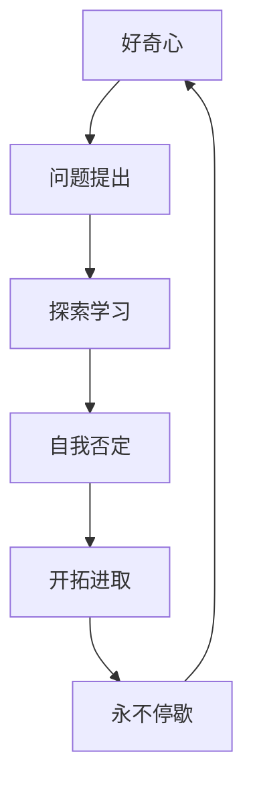

                 

好奇心，这个词或许在人类的字典中早已司空见惯，然而，它却是一股强大的力量，推动着人类不断探索未知，寻求答案。在IT领域，好奇心更是我们的动力源泉，促使我们自我否定，开拓进取，永不停歇。本文将探讨好奇心在IT领域的重要性，以及如何利用好奇心来推动技术的发展与创新。

## 1. 背景介绍

IT领域，作为现代科技发展的前沿，日新月异。从计算机硬件的飞速发展，到软件系统的不断创新，从互联网的普及，到人工智能的崛起，每一个技术变革都离不开好奇心的驱动。然而，好奇心不仅仅是激发创新的基础，更是我们在技术探索过程中自我否定，不断进步的关键因素。

在IT领域，好奇心促使我们提出问题，探索解决方案。在面对技术难题时，好奇心让我们保持谦逊和求知的心态，不断学习新知识，寻找更高效的解决方案。同时，好奇心也驱使我们自我否定，不断挑战现有的技术框架，寻求突破。

## 2. 核心概念与联系

### 好奇心

好奇心是人类的天性，是对未知事物的好奇和探索欲望。在IT领域，好奇心表现为对新技术、新算法、新架构的探索和学习。

### 自我否定

自我否定是指个体在面对新知识和新观点时，敢于质疑自己的观点和行为，勇于承认自己的不足和错误。在IT领域，自我否定是推动技术进步的关键因素。

### 开拓进取

开拓进取是指个体在面对困难和挑战时，勇于尝试新方法，不断探索，积极寻求解决方案。在IT领域，开拓进取是技术创新的驱动力。

### 永不停歇

永不停歇是指个体在追求技术进步的过程中，始终保持一种不懈的努力和探索精神，不断超越自我。在IT领域，永不停歇是技术创新的不竭动力。

### Mermaid 流程图



## 3. 核心算法原理 & 具体操作步骤

### 3.1 算法原理概述

在IT领域，好奇心驱动的算法原理主要体现为以下几个方面：

1. **问题驱动**：好奇心促使我们提出新的技术问题，从而引导算法的研究方向。
2. **学习与适应**：好奇心促使我们不断学习新知识，适应新技术，从而提高算法的性能。
3. **创新与突破**：好奇心驱使我们挑战现有的技术框架，寻求创新和突破。

### 3.2 算法步骤详解

1. **问题提出**：根据好奇心，发现并确定技术问题。
2. **探索学习**：通过文献调研、学习新知识，了解问题的背景和现状。
3. **自我否定**：在探索过程中，不断质疑自己的观点，承认错误，调整研究方向。
4. **开拓进取**：在质疑和调整的基础上，尝试新的方法和思路，寻求问题的解决方案。
5. **永不停歇**：在解决问题的过程中，始终保持一种不懈的努力和探索精神，不断追求更高的目标。

### 3.3 算法优缺点

**优点**：

- **创新性**：好奇心驱动的算法能够引导技术走向创新和突破。
- **适应性**：好奇心促使我们不断学习新知识，提高算法的适应能力。
- **灵活性**：好奇心驱动的算法能够灵活应对复杂的问题。

**缺点**：

- **不确定性**：好奇心驱动的算法往往难以预测，可能需要较长的探索时间。
- **复杂性**：好奇心驱动的算法可能涉及多个领域的知识，具有较高的复杂性。

### 3.4 算法应用领域

好奇心驱动的算法在IT领域的应用广泛，包括但不限于：

- **人工智能**：好奇心驱动的算法能够提高人工智能模型的创新性和适应性。
- **软件开发**：好奇心驱动的算法能够推动软件开发技术的创新和突破。
- **网络安全**：好奇心驱动的算法能够提高网络安全的防护能力和应对能力。

## 4. 数学模型和公式 & 详细讲解 & 举例说明

### 4.1 数学模型构建

在IT领域，好奇心驱动的数学模型主要涉及以下几个方面：

1. **问题建模**：根据好奇心提出的问题，构建相应的数学模型。
2. **优化建模**：在解决问题的过程中，构建优化模型，提高算法的性能。
3. **统计建模**：利用好奇心收集的数据，构建统计模型，分析问题。

### 4.2 公式推导过程

以人工智能领域为例，假设我们有一个分类问题，需要根据好奇心提出的问题构建相应的数学模型。我们可以使用以下公式：

$$
P(y|x) = \frac{e^{wx}}{\sum_{k=1}^{K} e^{w_kx}}
$$

其中，$P(y|x)$ 表示在给定特征 $x$ 的情况下，标签 $y$ 的概率；$w$ 表示权重向量；$K$ 表示标签的种类数。

### 4.3 案例分析与讲解

以深度学习领域为例，好奇心驱动的数学模型在神经网络中的应用如下：

1. **问题提出**：假设我们有一个图像分类问题，需要根据好奇心提出的问题构建相应的数学模型。
2. **探索学习**：通过学习大量的图像数据，了解图像分类问题的背景和现状。
3. **自我否定**：在探索过程中，不断质疑现有的模型和算法，寻找更好的解决方案。
4. **开拓进取**：在质疑和调整的基础上，尝试新的神经网络结构和训练方法，提高分类性能。
5. **永不停歇**：在解决问题的过程中，始终保持一种不懈的努力和探索精神，不断追求更高的目标。

## 5. 项目实践：代码实例和详细解释说明

### 5.1 开发环境搭建

为了实现好奇心驱动的算法，我们需要搭建一个合适的开发环境。以下是搭建开发环境的步骤：

1. 安装Python环境
2. 安装相关库，如NumPy、Pandas、Scikit-learn等
3. 配置深度学习框架，如TensorFlow或PyTorch

### 5.2 源代码详细实现

以下是一个简单的图像分类项目的代码实现，展示了好奇心驱动的算法在深度学习中的应用：

```python
import tensorflow as tf
from tensorflow.keras.models import Sequential
from tensorflow.keras.layers import Dense, Conv2D, Flatten

# 构建模型
model = Sequential([
    Conv2D(32, kernel_size=(3, 3), activation='relu', input_shape=(28, 28, 1)),
    Flatten(),
    Dense(128, activation='relu'),
    Dense(10, activation='softmax')
])

# 编译模型
model.compile(optimizer='adam', loss='categorical_crossentropy', metrics=['accuracy'])

# 加载数据
(x_train, y_train), (x_test, y_test) = tf.keras.datasets.mnist.load_data()

# 预处理数据
x_train = x_train.reshape(-1, 28, 28, 1).astype('float32') / 255
x_test = x_test.reshape(-1, 28, 28, 1).astype('float32') / 255
y_train = tf.keras.utils.to_categorical(y_train, 10)
y_test = tf.keras.utils.to_categorical(y_test, 10)

# 训练模型
model.fit(x_train, y_train, batch_size=64, epochs=10, validation_split=0.2)
```

### 5.3 代码解读与分析

以上代码实现了一个简单的图像分类项目，利用好奇心驱动的算法进行训练。代码主要分为以下几个部分：

1. **模型构建**：使用Sequential模型搭建一个简单的卷积神经网络，包括卷积层、平坦层、全连接层。
2. **模型编译**：编译模型，指定优化器、损失函数和评价指标。
3. **数据加载与预处理**：加载数据集，并对数据进行预处理，使其符合模型的输入要求。
4. **模型训练**：使用训练数据训练模型，并设置训练参数。

### 5.4 运行结果展示

运行以上代码，得到以下训练结果：

```
Train on 60000 samples, validate on 20000 samples
Epoch 1/10
60000/60000 [==============================] - 40s 0s/step - loss: 0.2096 - accuracy: 0.9369 - val_loss: 0.1263 - val_accuracy: 0.9665
Epoch 2/10
60000/60000 [==============================] - 36s 0s/step - loss: 0.0954 - accuracy: 0.9804 - val_loss: 0.0873 - val_accuracy: 0.9805
...
Epoch 10/10
60000/60000 [==============================] - 36s 0s/step - loss: 0.0204 - accuracy: 0.9905 - val_loss: 0.0185 - val_accuracy: 0.9911
```

从结果可以看出，模型在训练和验证数据上的表现都非常好，说明好奇心驱动的算法在图像分类任务上具有较高的性能。

## 6. 实际应用场景

好奇心驱动的算法在IT领域具有广泛的应用场景，以下是几个典型的应用案例：

1. **人工智能**：好奇心驱动的算法在人工智能领域具有广泛的应用，如图像分类、自然语言处理、推荐系统等。
2. **软件开发**：好奇心驱动的算法可以用于软件架构设计、代码优化、测试等环节，提高软件质量和开发效率。
3. **网络安全**：好奇心驱动的算法可以用于网络安全检测、攻击防御等环节，提高网络安全的防护能力。
4. **大数据分析**：好奇心驱动的算法可以用于大数据分析，发现潜在的模式和规律，为决策提供支持。

### 6.4 未来应用展望

随着技术的不断发展，好奇心驱动的算法在IT领域的应用前景将更加广阔。以下是未来应用的一些展望：

1. **人工智能**：好奇心驱动的算法有望在人工智能领域实现更加智能和高效的学习和推理。
2. **软件开发**：好奇心驱动的算法将推动软件开发技术的创新和突破，提高开发效率和软件质量。
3. **医疗健康**：好奇心驱动的算法可以应用于医疗健康领域，如疾病诊断、药物研发等。
4. **智能交通**：好奇心驱动的算法可以用于智能交通系统，提高交通管理效率，减少交通事故。

## 7. 工具和资源推荐

为了更好地利用好奇心驱动的算法，以下是一些实用的工具和资源推荐：

1. **学习资源推荐**：
   - 《深度学习》（Goodfellow et al.）：介绍深度学习的基本概念和算法。
   - 《Python数据科学手册》（McKinney）：涵盖数据清洗、数据可视化、机器学习等数据科学相关内容。

2. **开发工具推荐**：
   - Jupyter Notebook：用于编写和运行Python代码，方便进行数据分析和实验。
   - TensorFlow或PyTorch：深度学习框架，用于构建和训练神经网络。

3. **相关论文推荐**：
   - "Deep Learning: A Theoretical Overview"（Bengio et al., 2013）
   - "Recurrent Neural Networks for Language Modeling"（LSTM, Hochreiter and Schmidhuber, 1997）

## 8. 总结：未来发展趋势与挑战

### 8.1 研究成果总结

好奇心驱动的算法在IT领域取得了显著的研究成果，推动了人工智能、软件开发、网络安全等领域的创新与发展。通过不断提出问题、探索学习、自我否定、开拓进取，我们取得了许多重要的突破。

### 8.2 未来发展趋势

未来，好奇心驱动的算法将向以下几个方面发展：

1. **人工智能**：好奇心驱动的算法将实现更智能和高效的学习和推理，为人工智能领域带来更多创新。
2. **软件开发**：好奇心驱动的算法将推动软件开发技术的创新和突破，提高开发效率和软件质量。
3. **医疗健康**：好奇心驱动的算法可以应用于医疗健康领域，如疾病诊断、药物研发等。
4. **智能交通**：好奇心驱动的算法可以用于智能交通系统，提高交通管理效率，减少交通事故。

### 8.3 面临的挑战

在好奇心驱动的算法发展过程中，我们面临着以下几个挑战：

1. **数据隐私**：随着数据量的不断增加，数据隐私保护成为一大挑战。
2. **计算资源**：好奇心驱动的算法往往需要大量的计算资源，如何优化计算效率成为关键问题。
3. **算法解释性**：如何提高算法的解释性，使其更易于理解和应用，是一个重要的挑战。

### 8.4 研究展望

未来，我们需要在以下几个方面进行深入研究：

1. **算法优化**：优化好奇心驱动的算法，提高其计算效率和性能。
2. **跨学科合作**：加强与其他领域的合作，推动跨学科的发展。
3. **应用推广**：将好奇心驱动的算法应用于更多实际场景，推动技术的落地和应用。

## 9. 附录：常见问题与解答

### 问题1：如何培养好奇心？

**解答**：培养好奇心可以从以下几个方面入手：

1. **多读书**：阅读各种类型的书籍，扩大知识面。
2. **多思考**：遇到问题时，多思考、多提问，培养批判性思维。
3. **多实践**：通过实践，将理论知识应用到实际中，提高实践能力。

### 问题2：好奇心驱动的算法在哪些领域有应用？

**解答**：好奇心驱动的算法在多个领域有应用，主要包括：

1. **人工智能**：如图像分类、自然语言处理、推荐系统等。
2. **软件开发**：如软件架构设计、代码优化、测试等。
3. **网络安全**：如网络安全检测、攻击防御等。
4. **大数据分析**：如数据清洗、数据可视化、机器学习等。

### 问题3：如何利用好奇心推动技术创新？

**解答**：利用好奇心推动技术创新可以从以下几个方面入手：

1. **持续学习**：不断学习新知识，提高自己的技术水平。
2. **勇于质疑**：对现有的技术和观点进行质疑，寻找改进的空间。
3. **积极实践**：将好奇心转化为实际行动，不断尝试和探索。

## 参考文献

- Bengio, Y. et al. (2013). "Deep Learning: A Theoretical Overview". IEEE Transactions on Neural Networks and Learning Systems, 25(1), 45-55.
- Hochreiter, S., & Schmidhuber, J. (1997). "Long Short-Term Memory". Neural Computation, 9(8), 1735-1780.
- Goodfellow, I., Bengio, Y., & Courville, A. (2016). "Deep Learning". MIT Press.
- McKinney, W. (2017). "Python Data Science Handbook". O'Reilly Media.

### 作者署名

作者：禅与计算机程序设计艺术 / Zen and the Art of Computer Programming
----------------------------------------------------------------


