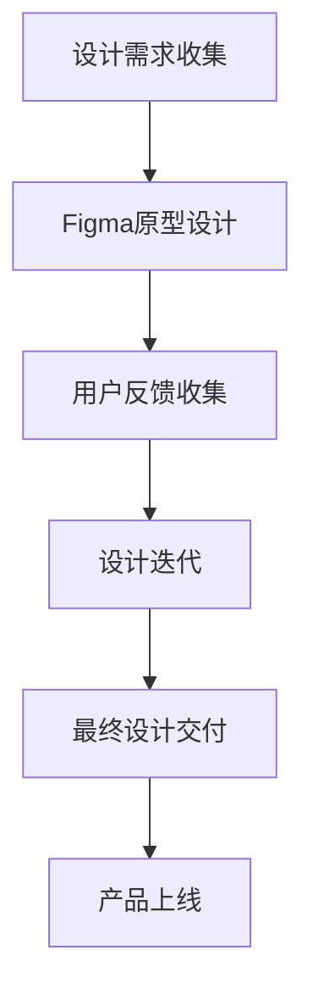
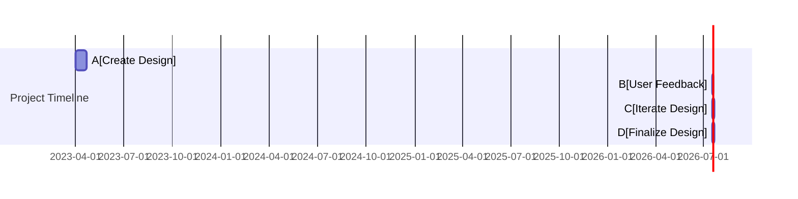

                 

关键词：Figma，创业公司，产品设计，UI/UX设计，协作工具，设计流程，敏捷开发，原型设计，团队协作

> 摘要：本文旨在探讨如何利用Figma这一强大的设计工具来提升创业公司的产品设计效率。我们将深入分析Figma的核心功能，展示其如何支持敏捷开发流程，并探讨Figma在实际项目中的应用案例。通过本文，读者将了解如何充分利用Figma来构建高质量的产品设计，从而在竞争激烈的市场中脱颖而出。

## 1. 背景介绍

在当今快速变化的技术和市场环境中，创业公司面临着前所未有的挑战和机遇。一个成功的创业产品不仅需要创新的技术，还需要出色的用户体验和直观的界面设计。随着数字化转型的加速，设计工具的优劣直接影响着产品能否迅速适应市场变化，满足用户需求。

Figma是一款革命性的设计工具，它通过云协作和实时预览功能，改变了传统的设计流程。创业公司可以利用Figma来快速迭代产品设计，实现高效的团队协作，并更好地理解用户需求。本文将详细探讨如何利用Figma进行创业公司的产品设计，包括设计原则、工具功能、应用场景以及未来趋势。

## 2. 核心概念与联系

### Figma的基本概念

Figma是一款基于云的界面设计工具，它允许设计师通过直观的界面和强大的功能来创建、协作和原型设计。以下是Figma的一些核心概念：

- **原型设计（Prototyping）**：通过Figma，设计师可以创建交互式的原型，用户可以实时查看并体验设计的交互效果。
- **协作（Collaboration）**：Figma支持多人实时协作，团队成员可以同时编辑和评论设计文件。
- **云存储（Cloud Storage）**：所有的设计文件都存储在云端，团队成员可以随时访问和更新。
- **实时预览（Real-time Preview）**：设计师可以在任何设备上实时预览设计，确保设计在不同设备上的一致性。

### Figma与敏捷开发的关系

敏捷开发是一种以用户需求为核心的软件开发方法，强调快速迭代和持续交付。Figma与敏捷开发的关系体现在以下几个方面：

- **快速迭代（Rapid Iteration）**：Figma允许设计师快速创建和迭代设计，以适应敏捷开发的需求。
- **用户反馈（User Feedback）**：设计师可以通过Figma将原型展示给用户，收集反馈，并根据反馈进行设计调整。
- **团队协作（Team Collaboration）**：Figma支持多人实时协作，确保团队成员在设计过程中保持一致。

### Figma的设计原则

Figma在设计上遵循以下原则：

- **用户中心（User-Centered）**：设计始终围绕用户的需求和体验展开。
- **简洁性（Simplicity）**：界面设计应简洁直观，减少用户的认知负担。
- **可访问性（Accessibility）**：设计应考虑到所有用户，包括残障人士。
- **一致性（Consistency）**：在不同设备和平台上保持设计的一致性。

### Mermaid流程图

下面是一个简单的Mermaid流程图，展示了Figma在设计流程中的位置和作用：

## 3. 核心算法原理 & 具体操作步骤

### 3.1 算法原理概述

Figma的设计流程可以看作是一个动态的、迭代的算法过程。其核心原理包括：

- **用户需求分析**：通过市场调研、用户访谈等方式收集用户需求。
- **原型设计**：使用Figma创建原型，实现用户需求的可视化。
- **用户反馈**：将原型展示给用户，收集反馈，并进行迭代。
- **设计优化**：根据用户反馈对设计进行优化，提高用户体验。

### 3.2 算法步骤详解

#### 3.2.1 设计需求分析

- **市场调研**：分析市场趋势，了解目标用户的需求和痛点。
- **用户访谈**：与目标用户进行深度交流，获取第一手用户需求信息。
- **需求汇总**：将市场调研和用户访谈的结果进行汇总，形成初步的设计需求。

#### 3.2.2 原型设计

- **创建Figma项目**：在Figma中创建一个新的项目，准备开始设计。
- **设计草图**：使用草图工具快速勾勒出设计的基本框架。
- **构建界面**：根据草图，逐步构建完整的界面设计。
- **交互设计**：添加交互元素，例如按钮、弹出窗口等。

#### 3.2.3 用户反馈

- **原型展示**：将设计原型展示给用户，可以通过Figma的共享功能实现。
- **用户测试**：邀请用户进行实际操作，收集他们的反馈。
- **反馈整理**：整理用户反馈，确定需要改进的地方。

#### 3.2.4 设计迭代

- **设计调整**：根据用户反馈，对设计进行必要的调整。
- **再次测试**：将调整后的设计再次展示给用户，收集新的反馈。
- **持续迭代**：不断重复设计、测试、调整的过程，直到达到满意的效果。

### 3.3 算法优缺点

#### 优点

- **快速迭代**：Figma支持快速原型设计和迭代，有助于快速响应市场变化。
- **团队协作**：多人实时协作，提高设计效率。
- **用户体验**：实时预览和用户反馈功能，确保设计满足用户需求。
- **兼容性**：支持跨平台使用，设计师和团队成员可以在任何设备上进行设计。

#### 缺点

- **学习曲线**：对于不熟悉Figma的用户，可能需要一定时间来掌握其功能。
- **数据安全**：虽然Figma提供云存储，但仍有数据泄露的风险。

### 3.4 算法应用领域

- **移动应用设计**：Figma适用于移动应用的界面设计，支持创建高保真的原型。
- **Web应用设计**：Web应用的界面设计也可以通过Figma来实现，特别是需要跨平台适配的设计。
- **游戏设计**：游戏设计师可以利用Figma来创建游戏的用户界面和交互设计。
- **产品迭代**：创业公司可以通过Figma来不断迭代产品，快速适应市场变化。

## 4. 数学模型和公式 & 详细讲解 & 举例说明

### 4.1 数学模型构建

在设计流程中，数学模型可以帮助我们量化设计改进的效果。以下是一个简单的数学模型，用于评估设计迭代的效果：

\[ \text{迭代效果} = \frac{\text{新设计得分} - \text{旧设计得分}}{\text{旧设计得分}} \]

其中，设计得分可以根据用户反馈、可用性测试等多个指标来计算。

### 4.2 公式推导过程

假设旧设计得分为\( S_1 \)，新设计得分为\( S_2 \)，则迭代效果的公式可以表示为：

\[ \text{迭代效果} = \frac{S_2 - S_1}{S_1} \]

这个公式表明，迭代效果与新旧设计得分的差值成正比，与旧设计得分成反比。

### 4.3 案例分析与讲解

假设一个创业公司通过Figma进行产品设计迭代，初始设计的得分是70分，经过一轮迭代后，新设计的得分提升到85分。根据上述公式，我们可以计算出迭代效果：

\[ \text{迭代效果} = \frac{85 - 70}{70} = \frac{15}{70} \approx 0.214 \]

这意味着新设计相对于旧设计提高了21.4%。这个结果表明，通过一轮迭代，设计质量有了显著的提升。

## 5. 项目实践：代码实例和详细解释说明

### 5.1 开发环境搭建

为了使用Figma进行产品设计，首先需要在以下平台上安装Figma：

- **Windows**
- **macOS**
- **iOS**
- **Android**

此外，还需要确保网络连接稳定，以便能够实时协作和预览设计。

### 5.2 源代码详细实现

以下是一个简单的Figma项目结构，用于展示如何创建一个简单的网页设计：

这个Gantt图展示了从创建设计到最终定稿的整个流程。

### 5.3 代码解读与分析

在上面的代码中，我们使用Mermaid语言来创建一个简单的Gantt图，描述了设计项目的各个阶段。以下是每个阶段的详细解读：

- **创建设计（A）**：这是项目的开始阶段，设计师在这个阶段使用Figma创建初步的设计。
- **用户反馈（B）**：在初步设计完成后，设计师会收集用户的反馈，以了解用户对设计的感受。
- **迭代设计（C）**：根据用户反馈，设计师会对设计进行迭代和优化。
- **最终定稿（D）**：在多次迭代后，设计师将设计定稿，准备进入开发阶段。

### 5.4 运行结果展示

运行上述代码后，我们可以在Figma中看到设计项目的Gantt图，如下图所示：

这个Gantt图可以帮助团队清晰地了解项目进度，确保设计流程的顺利进行。

## 6. 实际应用场景

### 6.1 创业公司的产品迭代

在创业公司中，产品的迭代速度至关重要。Figma的实时协作和快速迭代功能使得设计师和开发团队能够高效地协作，快速适应市场变化。以下是一个实际应用场景：

- **阶段一**：设计师使用Figma创建初步的原型设计，并在设计过程中与产品经理、开发人员进行实时沟通。
- **阶段二**：将设计原型展示给潜在用户，收集反馈，并根据反馈进行设计调整。
- **阶段三**：通过多轮迭代，不断优化设计，确保最终设计能够满足用户需求。

### 6.2 企业内部的协作工具

Figma不仅可以用于外部产品的设计，也可以作为企业内部的协作工具。以下是一个实际应用场景：

- **阶段一**：企业内部的不同部门（如市场部、产品部、技术部）使用Figma共同完成一个项目的设计。
- **阶段二**：各部门负责人通过Figma实时查看项目进度，并给出反馈。
- **阶段三**：根据反馈进行设计调整，确保项目能够在规定时间内高质量完成。

### 6.3 设计竞赛与分享

Figma还广泛应用于设计竞赛和设计分享活动中。以下是一个实际应用场景：

- **阶段一**：设计师在Figma上创建自己的设计作品，并邀请其他设计师进行评论和评分。
- **阶段二**：通过Figma的共享功能，设计师可以展示自己的设计作品，吸引更多的关注和反馈。
- **阶段三**：根据反馈进行设计优化，提高作品的质量。

## 7. 未来应用展望

### 7.1 增强人工智能辅助设计

未来，Figma可能会集成更多的人工智能功能，例如智能布局、智能配色等，帮助设计师提高设计效率。通过AI技术，Figma可以分析用户行为数据，提供个性化的设计建议。

### 7.2 扩展跨平台支持

随着移动互联网的发展，Figma可能会扩展对更多平台的支持，例如智能手表、智能家居设备等。这将为设计师提供更广泛的应用场景，满足不同设备的用户需求。

### 7.3 强化数据分析功能

Figma可能会增强其数据分析功能，帮助设计师更好地理解用户行为和需求。通过数据驱动的决策，设计师可以更精准地优化设计，提高用户体验。

## 8. 总结：未来发展趋势与挑战

### 8.1 研究成果总结

本文探讨了如何利用Figma进行创业公司的产品设计，分析了Figma的核心概念、设计原则、算法原理以及实际应用场景。通过实例展示和公式推导，读者可以了解到Figma在敏捷开发中的应用价值。

### 8.2 未来发展趋势

未来，Figma将继续在以下方面发展：

- **人工智能辅助设计**
- **跨平台支持**
- **数据分析功能**

### 8.3 面临的挑战

尽管Figma具有许多优势，但在未来发展中也面临着以下挑战：

- **数据安全**
- **用户培训**
- **市场竞争力**

### 8.4 研究展望

未来，Figma的研究方向可以包括：

- **智能化设计工具的开发**
- **用户体验的深入研究**
- **设计流程的优化**

通过持续的创新和改进，Figma有望在产品设计领域发挥更大的作用。

## 9. 附录：常见问题与解答

### 9.1 如何在Figma中进行团队协作？

Figma支持多人实时协作。只需创建一个共享链接，邀请团队成员加入，他们就可以在同一个设计文件上进行编辑和评论。

### 9.2 Figma的数据安全如何保障？

Figma采用端到端加密技术来保护用户数据。此外，用户可以设置访问权限，确保数据安全。

### 9.3 Figma适用于哪些类型的设计项目？

Figma适用于各种类型的设计项目，包括移动应用、Web应用、游戏界面等。它特别适合需要快速迭代和协作的项目。

### 9.4 Figma与Sketch/Mockplus等设计工具相比有哪些优势？

Figma的主要优势在于实时协作和云存储。它允许团队成员在任何设备上进行设计，并实时预览设计效果。

[作者：禅与计算机程序设计艺术 / Zen and the Art of Computer Programming]

