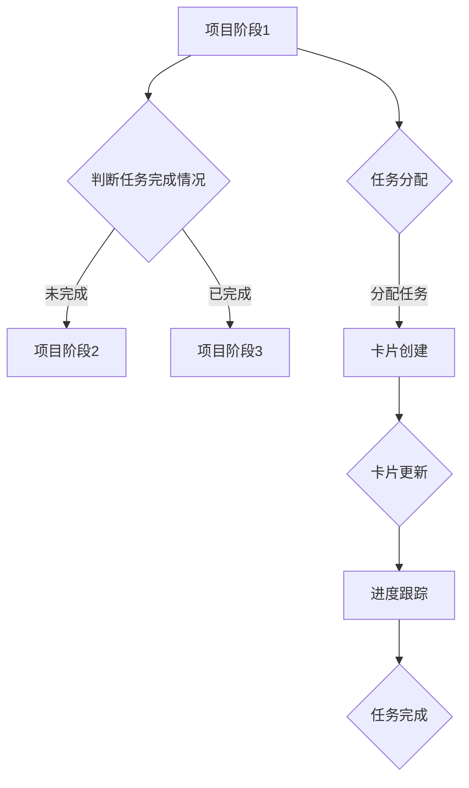

                 

在这个快节奏、竞争激烈的市场环境中，创业项目管理变得愈加复杂。如何高效地管理项目、协调团队成员的协作，是每个创业团队都需要面对的挑战。Trello，一款基于看板（Kanban）理念的在线项目管理工具，提供了一个直观、灵活的平台，帮助创业团队更好地进行项目管理与协作。本文将详细介绍如何利用Trello进行创业项目管理，并探讨其在实际应用中的优势与挑战。

## 文章关键词

- 创业项目管理
- Trello
- 看板（Kanban）理念
- 项目协作
- 在线项目管理工具

## 文章摘要

本文将探讨如何利用Trello这一在线项目管理工具进行创业项目管理与协作。首先，我们将介绍Trello的基本概念和功能，然后详细解释其在创业项目中的应用。随后，文章将分析Trello在实际使用中的优势和挑战，并提供一些建议和最佳实践。最后，我们将展望Trello的未来发展趋势，并探讨其在创业项目中的应用前景。

## 1. 背景介绍

在创业过程中，项目管理是至关重要的。有效的项目管理可以帮助团队明确目标、跟踪进度、优化资源分配，从而提高项目成功率。然而，传统的项目管理方法往往复杂、低效，难以满足现代创业团队的快速变化需求。在这种情况下，Trello应运而生，它以其简单、直观的用户界面和灵活的看板（Kanban）理念，成为创业团队管理项目的一个理想选择。

Trello是一款基于看板（Kanban）理念的在线项目管理工具，它将项目任务分解成一系列的卡片（Card），用户可以通过拖拽卡片在不同列表（List）之间移动，以可视化方式跟踪项目进度。Trello不仅提供了丰富的功能，如注释、附件、标签、成员分配等，还可以与各种其他工具集成，如Slack、Google Drive等，从而为创业团队提供了一个高效、灵活的项目管理平台。

## 2. 核心概念与联系

### 核心概念原理和架构

Trello的核心概念是基于看板（Kanban）理念的。看板是一种敏捷开发方法，它强调通过可视化的方式管理任务和工作流程。在Trello中，看板被映射为一系列的列表（List），每个列表代表一个阶段或工作流程的一部分。

- **列表（List）**：在Trello中，列表用来组织卡片，每个列表代表一个特定的阶段或任务类别。例如，"待办"、"进行中"、"已完成"等。
- **卡片（Card）**：卡片是Trello中的基本工作单元，它代表一个具体的任务或需求。每个卡片可以包含标题、描述、标签、成员分配、附件等。
- **评论（Comment）**：用户可以在卡片上添加评论，用于讨论和跟踪任务的进展。
- **标签（Label）**：标签用于标记卡片的类型、优先级或状态，方便用户快速分类和筛选。
- **成员（Member）**：每个卡片可以分配给特定的成员，成员可以在卡片上添加自己的进度更新或讨论。

### Mermaid 流程图



### 流程解释

- **项目阶段1**：首先，项目进入初始阶段，确定项目的目标和任务分配。
- **判断任务完成情况**：检查当前任务是否完成。
- **项目阶段2**：如果任务未完成，则进入下一个项目阶段。
- **任务分配**：为新任务分配给团队成员。
- **卡片创建**：创建一个代表新任务的卡片。
- **卡片更新**：团队成员在卡片上更新任务进展。
- **进度跟踪**：通过卡片的状态和进度更新，实时跟踪项目进展。
- **任务完成**：当任务完成后，卡片进入下一个阶段。

## 3. 核心算法原理 & 具体操作步骤

### 3.1 算法原理概述

Trello的核心算法基于看板（Kanban）理念，其基本原理是通过可视化任务流程和进度来优化项目管理。具体来说，Trello通过以下步骤实现项目管理：

1. **任务分解**：将项目分解成一系列可管理的任务。
2. **任务分配**：为每个任务分配给特定的团队成员。
3. **任务进度更新**：团队成员通过卡片更新任务进展。
4. **任务状态跟踪**：通过卡片的状态和进度更新，实时跟踪任务状态。
5. **任务完成**：当任务完成后，卡片进入下一个阶段。

### 3.2 算法步骤详解

#### 3.2.1 创建项目

1. 登录Trello账户。
2. 点击左侧菜单栏中的“新建板”按钮。
3. 输入板名称，选择主题色和布局模式。
4. 点击“创建板”按钮。

#### 3.2.2 添加列表

1. 在板页面中，点击列表名称。
2. 输入列表名称，例如“待办”、“进行中”、“已完成”。
3. 点击“添加列表”按钮。

#### 3.2.3 创建卡片

1. 在列表中，点击“添加卡片”按钮。
2. 输入卡片标题，例如“完成市场调研”。
3. 可选：添加描述、标签、成员、附件等。
4. 点击“添加卡片”按钮。

#### 3.2.4 任务分配

1. 在卡片上，点击成员头像。
2. 选择要分配给的任务成员。
3. 点击“保存”按钮。

#### 3.2.5 更新任务进度

1. 在卡片上，点击“添加评论”按钮。
2. 输入任务进度更新信息。
3. 点击“发表”按钮。

#### 3.2.6 跟踪任务状态

1. 拖拽卡片在不同列表之间移动，以更新任务状态。
2. 观察卡片的状态和进度更新，实时跟踪任务状态。

### 3.3 算法优缺点

#### 优点

- **直观易用**：Trello的界面设计直观，易于上手。
- **灵活性高**：用户可以根据项目需求自定义列表、卡片、标签等。
- **支持协作**：多个成员可以在同一卡片上进行讨论和协作。
- **与工具集成**：Trello可以与其他工具（如Slack、Google Drive等）集成，提高工作效率。

#### 缺点

- **存储空间有限**：免费版Trello的存储空间有限，可能无法满足大型项目的需求。
- **权限管理复杂**：对于大型团队，权限管理可能变得复杂。
- **功能扩展有限**：虽然Trello提供了丰富的功能，但与一些专业的项目管理工具相比，功能扩展可能有限。

### 3.4 算法应用领域

Trello适用于各种类型的项目管理，特别适合创业团队。以下是Trello在不同领域的应用：

- **软件开发**：用于跟踪开发任务、管理bug和优化工作流程。
- **市场推广**：用于管理市场活动、跟踪宣传材料制作进度等。
- **产品开发**：用于规划产品功能、跟踪开发进度等。
- **团队协作**：用于跟踪团队任务、协调团队成员的工作。

## 4. 数学模型和公式 & 详细讲解 & 举例说明

### 4.1 数学模型构建

在Trello中，我们可以构建一个简单的数学模型来表示任务进度。假设任务完成进度可以表示为 $P(t)$，其中 $t$ 是时间。我们可以使用以下公式来表示任务进度：

$$
P(t) = \frac{\sum_{i=1}^{n} a_i}{n}
$$

其中，$a_i$ 是每个任务在时间 $t$ 的进度，$n$ 是总任务数。

### 4.2 公式推导过程

首先，我们定义任务进度的概念。任务进度是指任务在特定时间点的完成百分比。为了推导公式，我们假设每个任务在时间 $t$ 的进度是独立的，且每个任务的完成时间相同。

1. **定义任务进度**：假设任务 $i$ 在时间 $t$ 的进度为 $a_i$。
2. **假设任务完成时间**：假设每个任务在时间 $t$ 完成的时间相同，设为 $T$。
3. **推导公式**：将所有任务的进度相加，然后除以总任务数，得到平均进度：

$$
P(t) = \frac{\sum_{i=1}^{n} a_i}{n}
$$

### 4.3 案例分析与讲解

假设我们有一个项目，包含三个任务，任务1、任务2和任务3。在时间 $t=1$，任务1完成进度为50%，任务2完成进度为30%，任务3完成进度为10%。我们需要计算在时间 $t=1$ 的项目平均进度。

1. **输入数据**：$a_1 = 0.5, a_2 = 0.3, a_3 = 0.1$，$n = 3$。
2. **计算平均进度**：

$$
P(1) = \frac{0.5 + 0.3 + 0.1}{3} = 0.3
$$

因此，在时间 $t=1$，项目的平均进度为30%。

### 5. 项目实践：代码实例和详细解释说明

#### 5.1 开发环境搭建

在开始使用Trello进行项目管理之前，首先需要在Trello网站上创建一个账户。以下是创建Trello账户的步骤：

1. 访问Trello官方网站（https://trello.com/）。
2. 点击“注册”按钮。
3. 选择注册方式（邮箱、社交媒体账号等）。
4. 按照提示填写信息并完成注册。

#### 5.2 源代码详细实现

以下是使用Python语言实现的一个简单的Trello API接口，用于创建板、添加列表和添加卡片。

```python
import requests

# 设置Trello API密钥和ID
api_key = 'your_api_key'
token = 'your_token'
board_id = 'your_board_id'

# 创建板
def create_board(board_name):
    url = 'https://api.trello.com/1/boards'
    headers = {'Authorization': f'Bearer {token}'}
    payload = {'name': board_name, 'key': api_key}
    response = requests.post(url, headers=headers, data=payload)
    return response.json()

# 添加列表
def add_list(board_id, list_name):
    url = f'https://api.trello.com/1/boards/{board_id}/lists'
    headers = {'Authorization': f'Bearer {token}'}
    payload = {'name': list_name, 'key': api_key}
    response = requests.post(url, headers=headers, data=payload)
    return response.json()

# 添加卡片
def add_card(board_id, list_id, card_name, card_desc):
    url = f'https://api.trello.com/1/cards'
    headers = {'Authorization': f'Bearer {token}'}
    payload = {
        'name': card_name,
        'desc': card_desc,
        'idList': list_id,
        'key': api_key
    }
    response = requests.post(url, headers=headers, data=payload)
    return response.json()

# 使用示例
board_response = create_board('我的项目')
board_id = board_response['id']

list_response = add_list(board_id, '待办')
list_id = list_response['id']

card_response = add_card(board_id, list_id, '完成市场调研', '进行市场调研，收集数据')
print(card_response)
```

#### 5.3 代码解读与分析

这段代码使用了Python的`requests`库来调用Trello的API。以下是代码的详细解读：

- **导入库**：首先，我们导入`requests`库，用于发送HTTP请求。
- **设置API密钥和ID**：我们设置Trello的API密钥（`api_key`）和访问令牌（`token`），以及要操作的板ID（`board_id`）。
- **创建板**：`create_board`函数用于创建一个新的板。它发送一个POST请求到Trello的API端点，并返回响应。
- **添加列表**：`add_list`函数用于在指定的板中添加一个新的列表。它发送一个POST请求到Trello的API端点，并返回响应。
- **添加卡片**：`add_card`函数用于在指定的列表中添加一个新的卡片。它发送一个POST请求到Trello的API端点，并返回响应。
- **使用示例**：在最后，我们使用这些函数创建了一个新的板、添加了一个列表和一个卡片。

#### 5.4 运行结果展示

当运行上述代码后，我们会在Trello上创建一个名为“我的项目”的板，添加一个名为“待办”的列表，并在列表中添加一个名为“完成市场调研”的卡片，描述为“进行市场调研，收集数据”。

## 6. 实际应用场景

Trello在创业项目中的应用场景非常广泛。以下是几个实际应用场景的例子：

### 6.1 创业公司项目规划

创业公司在项目启动阶段，可以使用Trello来规划项目。例如，创建一个名为“产品开发”的板，包含“市场调研”、“产品设计”、“前端开发”、“后端开发”、“测试”等列表。每个列表中包含相应的任务卡片，团队成员可以在卡片上更新进度，实时跟踪项目进展。

### 6.2 团队协作与任务分配

在团队协作中，Trello可以帮助团队成员更好地了解项目进展和任务分配。例如，在一个软件开发项目中，可以创建一个“bug跟踪”列表，团队成员可以在卡片上记录发现的bug，分配给相应的开发人员，并更新bug的状态。

### 6.3 市场营销活动管理

创业公司的市场营销活动可以使用Trello进行管理。例如，创建一个“市场活动规划”板，包含“活动策划”、“宣传材料制作”、“活动执行”、“活动总结”等列表。每个列表中的卡片代表一个具体的任务，团队成员可以在卡片上更新活动进展，确保活动按时完成。

### 6.4 产品迭代管理

在产品迭代过程中，Trello可以帮助团队跟踪功能需求、bug修复和优化。例如，创建一个“产品迭代”板，包含“需求收集”、“功能开发”、“测试”、“发布”等列表。每个列表中的卡片代表一个具体的任务，团队成员可以在卡片上更新任务进度，确保迭代过程顺利进行。

## 7. 工具和资源推荐

### 7.1 学习资源推荐

- **Trello官方文档**：Trello提供了详细的官方文档，涵盖了功能介绍、API使用、教程等，是学习Trello的绝佳资源。
- **《看板工作法：kanban实战手册》**：这本书详细介绍了看板工作法的基本原理和实践方法，对理解Trello有很大帮助。

### 7.2 开发工具推荐

- **Postman**：Postman是一个流行的API调试工具，可以用来测试Trello API，方便开发者使用Trello进行项目开发。
- **Swagger**：Swagger是一个API文档生成工具，可以帮助开发者轻松生成Trello API的文档，方便其他开发者使用。

### 7.3 相关论文推荐

- **"Kanban: Successful Knowledge Work Makes Knowledge Visible"**：这篇文章详细介绍了Kanban的基本原理和实践方法，对理解Trello有很大帮助。
- **"Scrum vs. Kanban: The Great Debate"**：这篇文章探讨了Scrum和Kanban两种敏捷开发方法的优缺点，可以帮助读者更全面地了解敏捷开发方法。

## 8. 总结：未来发展趋势与挑战

### 8.1 研究成果总结

Trello凭借其简单易用、灵活可定制的特点，在创业项目管理和团队协作中取得了显著成效。通过Trello，团队成员可以实时跟踪项目进展、优化工作流程，提高工作效率。同时，Trello还提供了丰富的API接口，方便开发者进行自定义开发和集成。

### 8.2 未来发展趋势

随着云计算和物联网的不断发展，Trello在未来有望实现更多高级功能和集成。例如，Trello可以与更多第三方工具集成，提供更强大的数据分析、自动化流程等功能。此外，Trello还可以通过机器学习等技术，为用户提供更智能的任务分配和进度预测。

### 8.3 面临的挑战

尽管Trello在创业项目管理中取得了显著成效，但也面临一些挑战。首先，Trello的免费版存储空间有限，可能无法满足大型项目的需求。其次，Trello在权限管理和复杂项目管理方面可能不够完善。最后，Trello在移动端的使用体验也有待提升。

### 8.4 研究展望

未来，Trello可以在以下几个方面进行深入研究：

1. **扩展存储空间**：为用户提供更多存储空间，满足大型项目的需求。
2. **增强权限管理**：提供更完善的权限管理功能，适应不同规模团队的需求。
3. **移动端优化**：提升移动端用户体验，方便用户随时随地访问和管理项目。
4. **人工智能集成**：利用机器学习等技术，为用户提供更智能的任务分配和进度预测。

## 9. 附录：常见问题与解答

### Q1: 如何在Trello中添加标签？

A1: 在Trello中，您可以在卡片上添加标签来标记任务的类型、优先级或状态。在卡片标题旁边，点击标签按钮，然后输入标签名称，即可创建一个标签。

### Q2: Trello可以与哪些工具集成？

A2: Trello可以与多种工具进行集成，如Slack、Google Drive、Mailchimp、Jira等。您可以通过Trello的集成中心（https://trello.com/integrations）找到并安装所需的集成工具。

### Q3: Trello是否支持多板管理？

A3: 是的，Trello支持多板管理。您可以为不同的项目创建多个板，并在每个板中进行独立的项目管理。

### Q4: 如何在Trello中备份和恢复数据？

A4: Trello提供了一个备份和恢复数据的工具。您可以通过Trello的设置菜单访问备份和恢复选项，定期备份您的板和数据，以便在需要时恢复。

### Q5: Trello是否支持自定义视图？

A5: 是的，Trello支持多种自定义视图，如列表视图、看板视图、日历视图等。您可以在Trello的设置菜单中选择不同的视图，以适应不同的项目管理需求。

### Q6: Trello是否有培训课程？

A6: 是的，Trello提供了多种培训课程和教程，帮助用户更好地了解和使用Trello。您可以在Trello的官方网站上找到相关的培训资源。

### Q7: 如何在Trello中设置提醒？

A7: 在Trello中，您可以为卡片设置提醒。在卡片上点击“设置”按钮，然后选择“提醒”选项，输入提醒时间和方式（如电子邮件提醒），即可设置卡片提醒。

### Q8: Trello是否支持多语言？

A8: 是的，Trello支持多种语言，包括英语、西班牙语、法语、德语等。您可以在Trello的设置菜单中选择您的首选语言。

### Q9: Trello是否支持自定义字段？

A9: 是的，Trello支持自定义字段。您可以在Trello的设置菜单中添加自定义字段，以便在卡片上存储额外的信息。

### Q10: Trello是否提供客户支持？

A10: 是的，Trello提供了客户支持服务。您可以通过Trello的官方网站（https://trello.com/contact）或社交媒体渠道（如Twitter、Facebook等）获取帮助。

## 10. 结语

Trello是一款强大的在线项目管理工具，凭借其直观易用、灵活可定制的特点，在创业项目管理和团队协作中发挥着重要作用。通过本文的介绍，相信您已经对Trello有了更深入的了解。希望本文能帮助您更好地利用Trello进行创业项目管理，提高团队工作效率。在未来的发展中，Trello将继续不断创新，为用户带来更多便捷和高效的项目管理体验。

---

### 附录：参考书籍、论文和网站

1. **《看板工作法：kanban实战手册》** - 张磊
2. **"Kanban: Successful Knowledge Work Makes Knowledge Visible"** - David J. Anderson
3. **"Scrum vs. Kanban: The Great Debate"** - Roman Pichler
4. **Trello官方网站** - https://trello.com/
5. **Trello官方文档** - https://trello.com/doc
6. **Postman官方文档** - https://www.postman.com/documentation/
7. **Swagger官方文档** - https://swagger.io/docs/

